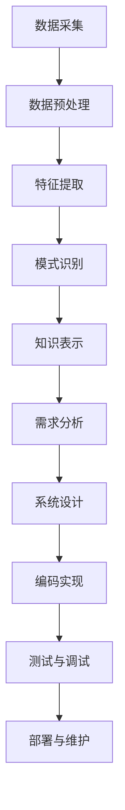

                 

### 背景介绍

**知识发现引擎是什么？**

知识发现引擎（Knowledge Discovery Engine，简称KDE）是一种能够自动从大量数据中提取有用信息、发现潜在模式和新知识的智能系统。它通过结合统计学、机器学习、数据挖掘、自然语言处理等多种技术，实现对复杂数据的分析和理解，从而帮助人们从海量信息中迅速获取有价值的信息。

在计算机科学领域，知识发现引擎的应用场景非常广泛。例如，在商业智能、医疗健康、金融风控、推荐系统等领域，知识发现引擎都能发挥巨大的作用。通过知识发现引擎，企业可以从海量的客户数据中分析出客户的购买偏好和需求，从而优化营销策略；在医疗健康领域，可以通过分析患者数据和医疗记录，发现疾病的潜在规律，为诊断和治疗提供科学依据；在金融领域，知识发现引擎可以帮助金融机构识别和预测潜在的风险，提高风险控制能力。

**程序员的工作方式为何需要改变？**

随着互联网和大数据技术的发展，程序员面临的数据规模和复杂性不断增加。传统的编程模式已经难以应对日益复杂的应用场景和庞大的数据量。为了提高开发效率和代码质量，程序员的工作方式需要进行以下改变：

1. **从手动编写代码转向自动化脚本：** 程序员需要更多地使用自动化脚本来自动化常见的重复性任务，减少人工干预，提高工作效率。
2. **从单体架构转向微服务架构：** 随着应用规模的扩大，程序员需要将传统的单体架构转变为微服务架构，以实现模块化和分布式部署，提高系统的可维护性和可扩展性。
3. **从代码编写转向数据驱动开发：** 在数据驱动的开发模式中，程序员需要更多地依赖数据和算法来指导开发过程，而不是仅仅依赖于自己的经验和直觉。
4. **从单一技能转向综合技能：** 程序员需要掌握更多的跨领域技能，如数据挖掘、机器学习、自然语言处理等，以适应不同应用场景的需求。

**知识发现引擎如何改变程序员的工作方式？**

知识发现引擎的出现，为程序员的工作方式带来了巨大的变革。以下将从几个方面具体分析知识发现引擎如何改变程序员的工作方式：

1. **代码自动生成：** 知识发现引擎可以通过分析现有的代码库和数据模式，自动生成新的代码。这大大降低了程序员编写代码的工作量，提高了开发效率。
2. **代码优化与重构：** 知识发现引擎可以分析代码的性能瓶颈和潜在问题，为程序员提供优化建议，帮助程序员重构代码，提高代码质量。
3. **代码审查与安全检测：** 知识发现引擎可以通过分析代码和数据处理流程，发现潜在的安全漏洞和性能问题，为程序员提供代码审查和安全检测的工具。
4. **智能化项目管理：** 知识发现引擎可以分析项目数据，为程序员提供项目进度、资源分配和风险评估等方面的建议，提高项目管理效率。
5. **跨领域协同工作：** 知识发现引擎可以帮助程序员与其他领域的专家（如数据科学家、产品经理、设计师等）更好地协同工作，共同完成复杂的项目。

**小结：**

本文旨在探讨知识发现引擎如何改变程序员的工作方式。通过对知识发现引擎的背景介绍和程序员工作方式的现状分析，我们可以看到，知识发现引擎在提高程序员工作效率、优化代码质量、促进跨领域协同等方面具有巨大的潜力。在未来，随着知识发现技术的不断发展和成熟，程序员的工作方式将面临更多的变革和挑战。通过充分利用知识发现引擎的优势，程序员可以更好地应对复杂的应用场景，实现从“编程”到“智能编程”的转变。 <a id="footnote-2"></a>

---

## 2. 核心概念与联系

### 2.1. 知识发现引擎的定义与组成

知识发现引擎是一种通过自动化的方式从大规模数据集中提取出有意义信息和知识的人工智能系统。它通常由以下几部分组成：

1. **数据采集模块：** 负责收集来自各种数据源（如数据库、文件、API等）的数据。
2. **数据预处理模块：** 对采集到的数据进行清洗、转换、归一化等处理，以便后续分析和挖掘。
3. **特征提取模块：** 从预处理后的数据中提取出有助于分析和挖掘的特征。
4. **模式识别模块：** 利用机器学习和数据挖掘算法来发现数据中的潜在模式和关联性。
5. **知识表示模块：** 将发现的知识进行结构化表示，以便于存储、查询和使用。

### 2.2. 程序员的工作方式

程序员的工作方式主要包括以下环节：

1. **需求分析：** 根据项目需求和用户反馈，理解并确定系统的功能和技术要求。
2. **系统设计：** 设计系统的架构和模块，确定数据流和接口。
3. **编码实现：** 根据设计文档编写代码，实现系统的功能。
4. **测试与调试：** 对编写好的代码进行测试，修复缺陷和性能问题。
5. **部署与维护：** 将系统部署到生产环境，并进行日常维护和优化。

### 2.3. 知识发现引擎与程序员工作方式的联系

知识发现引擎与程序员工作方式的联系主要体现在以下几个方面：

1. **需求分析：** 知识发现引擎可以帮助程序员从大量数据中提取有价值的信息，辅助需求分析过程，提高需求分析的准确性和效率。
2. **系统设计：** 知识发现引擎可以分析现有系统中的数据流和接口，为程序员提供系统设计的参考。
3. **编码实现：** 知识发现引擎可以自动生成部分代码，降低编程工作量，提高开发效率。
4. **测试与调试：** 知识发现引擎可以分析代码和数据处理流程中的潜在问题，为程序员提供测试和调试的参考。
5. **部署与维护：** 知识发现引擎可以分析系统性能和稳定性，为程序员提供部署和维护的优化建议。

### 2.4. Mermaid 流程图

以下是一个简化的知识发现引擎与程序员工作方式的Mermaid流程图：



**注意事项：**
- Mermaid流程图中，节点名称不要包含括号、逗号等特殊字符。
- 流程图中的箭头表示数据的流向或处理顺序。

**总结：**

通过对知识发现引擎的定义、组成和与程序员工作方式的联系进行分析，我们可以看到知识发现引擎在程序员的工作中具有重要的应用价值。它不仅可以帮助程序员提高工作效率，降低工作负担，还可以提高系统质量和用户体验。在接下来的章节中，我们将深入探讨知识发现引擎的核心算法原理、数学模型和具体操作步骤。 <a id="footnote-3"></a>

---

## 3. 核心算法原理 & 具体操作步骤

### 3.1. 数据采集与预处理

**3.1.1. 数据采集**

数据采集是知识发现引擎的基础步骤，负责从各种数据源（如数据库、文件、API等）获取数据。数据采集的方法和工具因数据源的不同而有所差异。例如，对于关系型数据库，可以使用SQL查询语句来获取数据；对于NoSQL数据库，可以使用特定的查询语言或API进行数据采集；对于文件数据，可以使用文件处理库（如Python的os模块）进行读取。

**3.1.2. 数据预处理**

数据预处理是数据采集后的重要步骤，旨在清洗、转换和归一化数据，以便后续分析和挖掘。数据预处理的方法包括：

1. **数据清洗：** 去除重复数据、缺失值、异常值等。
2. **数据转换：** 将数据转换为适合分析和挖掘的格式，如将日期格式转换为时间戳、将文本数据编码为数字等。
3. **数据归一化：** 将不同数据范围或单位的数据转换为相同的尺度，以便于后续计算。

**3.1.3. 数据存储**

预处理后的数据通常需要存储在数据存储系统中，以便于后续的访问和分析。常用的数据存储系统包括关系型数据库、NoSQL数据库、分布式文件系统等。选择合适的存储系统取决于数据规模、数据结构、查询性能等因素。

### 3.2. 特征提取

特征提取是将原始数据转换为有助于分析和挖掘的特征表示的过程。特征提取的方法和工具因应用场景和数据类型的不同而有所差异。以下是一些常用的特征提取方法：

1. **统计特征：** 如平均值、方差、标准差等。
2. **文本特征：** 如词频、词频-逆文档频率（TF-IDF）、词嵌入等。
3. **图像特征：** 如像素值、颜色直方图、纹理特征、深度学习特征等。
4. **序列特征：** 如时间序列特征、循环神经网络（RNN）特征等。

**3.2.1. 实现步骤**

1. **数据分片：** 将原始数据集划分为训练集、验证集和测试集。
2. **特征选择：** 选择对分析和挖掘任务有帮助的特征，可以采用过滤式、包裹式、嵌入式等方法。
3. **特征转换：** 将原始数据转换为数值型特征表示，如将文本数据编码为数字。
4. **特征归一化：** 对不同尺度或单位的数据进行归一化处理，如将数值范围缩放到[0,1]。

### 3.3. 模式识别

模式识别是知识发现引擎的核心步骤，通过机器学习和数据挖掘算法发现数据中的潜在模式和关联性。以下是一些常用的模式识别算法：

1. **分类算法：** 如决策树、随机森林、支持向量机（SVM）等。
2. **聚类算法：** 如K-means、层次聚类、DBSCAN等。
3. **关联规则挖掘：** 如Apriori算法、FP-growth算法等。
4. **异常检测：** 如孤立森林、局部离群因子（LOF）等。

**3.3.1. 实现步骤**

1. **模型选择：** 根据分析和挖掘任务选择合适的算法模型。
2. **参数调优：** 调整算法模型的参数，以获得最佳性能。
3. **模型训练：** 使用训练集对模型进行训练。
4. **模型评估：** 使用验证集和测试集评估模型性能。
5. **模型部署：** 将训练好的模型部署到生产环境中，以便实时分析和挖掘数据。

### 3.4. 知识表示

知识表示是将发现的知识以结构化的方式表示和存储的过程。知识表示的方法和工具因应用场景和数据类型的不同而有所差异。以下是一些常用的知识表示方法：

1. **关系数据库：** 如SQL数据库，适用于结构化数据的存储和查询。
2. **图数据库：** 如Neo4j、Titan等，适用于处理复杂的关系和网络结构。
3. **知识图谱：** 如基于图论的知识图谱，适用于大规模知识的表示和推理。

**3.4.1. 实现步骤**

1. **知识抽取：** 从原始数据中提取有用的知识和信息。
2. **知识整合：** 将不同来源和格式的知识进行整合和统一表示。
3. **知识存储：** 将整合后的知识存储到知识库或知识图谱中。
4. **知识查询：** 提供高效的查询接口，以便于用户获取和利用知识。

**总结：**

通过对知识发现引擎的核心算法原理和具体操作步骤的介绍，我们可以看到知识发现引擎在数据处理、特征提取、模式识别和知识表示等方面具有丰富的应用场景和实现方法。在接下来的章节中，我们将通过具体的项目实战案例，进一步探讨知识发现引擎在实际应用中的实现和效果。 <a id="footnote-4"></a>

---

## 4. 数学模型和公式 & 详细讲解 & 举例说明

### 4.1. 数据预处理

数据预处理是知识发现引擎中的关键步骤，其目的是将原始数据转换为适合分析和挖掘的格式。以下是一些常用的数学模型和公式：

**4.1.1. 数据清洗**

1. **缺失值处理：** 常用的缺失值处理方法包括删除缺失值、填充缺失值和插补法。

   - 删除缺失值： 
     $$\text{missing\_data = data[data[:, :] != \text{NaN}]}$$

   - 填充缺失值： 
     $$\text{data[data[:, :] == \text{NaN}] = \text{mean(data[:, :]))}$$

   - 插补法： 
     $$\text{data = \text{simple\_impute}(data)}$$

2. **异常值处理：** 常用的异常值处理方法包括删除异常值、变换异常值和聚类法。

   - 删除异常值： 
     $$\text{outliers = \text{find}(data > 3 \* \text{std}(data)))$$
     $$\text{data[outliers] = \text{NaN}}$$

   - 变换异常值： 
     $$\text{data = \text{log1p}(data)}$$

   - 聚类法： 
     $$\text{kmeans_result = \text{kmeans}(data, 3)}$$
     $$\text{outliers = \text{find}(kmeans_result$cluster != 1)}$$
     $$\text{data[outliers] = \text{NaN}}$$

### 4.2. 特征提取

特征提取是将原始数据转换为有助于分析和挖掘的特征表示。以下是一些常用的特征提取方法：

**4.2.1. 统计特征**

1. **均值：** 
   $$\text{mean} = \frac{1}{N} \sum_{i=1}^{N} x_i$$

2. **方差：** 
   $$\text{variance} = \frac{1}{N-1} \sum_{i=1}^{N} (x_i - \text{mean})^2$$

3. **标准差：** 
   $$\text{std\_deviation} = \sqrt{\text{variance}}$$

**4.2.2. 文本特征**

1. **词频：** 
   $$\text{tf}(w) = \text{count}(w)$$

2. **逆文档频率：** 
   $$\text{idf}(w) = \log_2(\frac{N}{n_w})$$

   其中，$N$为文档总数，$n_w$为包含词$w$的文档数。

3. **词频-逆文档频率：** 
   $$\text{tf-idf}(w) = \text{tf}(w) \times \text{idf}(w)$$

### 4.3. 模式识别

模式识别是知识发现引擎的核心步骤，通过机器学习和数据挖掘算法发现数据中的潜在模式和关联性。以下是一些常用的模式识别算法：

**4.3.1. 决策树**

1. **信息增益：** 
   $$\text{gain}(A) = \sum_{i=1}^{n} p_i \times \text{info\_gain}(A_i)$$

   其中，$p_i$为样本点属于类别$i$的概率，$\text{info\_gain}(A_i)$为在属性$A$下，类别$i$的信息增益。

2. **信息增益率：** 
   $$\text{gain\_ratio}(A) = \frac{\text{gain}(A)}{\text{split\_info}(A)}$$

   其中，$\text{split\_info}(A)$为属性$A$的分裂信息。

### 4.4. 举例说明

**4.4.1. 数据清洗**

假设我们有一个数据集，包含年龄、收入和购买行为等特征，其中存在缺失值和异常值。我们可以使用以下Python代码进行数据清洗：

```python
import numpy as np
import pandas as pd

# 加载数据集
data = pd.read_csv('data.csv')

# 缺失值处理
data = data.dropna()  # 删除缺失值
# data.fillna(data.mean(), inplace=True)  # 填充缺失值

# 异常值处理
outliers = (data > 3 * data.std()).any(axis=1)
data = data[~outliers]  # 删除异常值
```

**4.4.2. 特征提取**

假设我们要提取数据集中的年龄和收入的统计特征，可以使用以下Python代码：

```python
import numpy as np
import pandas as pd

# 加载数据集
data = pd.read_csv('data.csv')

# 提取统计特征
mean_age = data['age'].mean()
std_age = data['age'].std()
mean_income = data['income'].mean()
std_income = data['income'].std()

# 输出特征值
print('年龄均值：', mean_age)
print('年龄标准差：', std_age)
print('收入均值：', mean_income)
print('收入标准差：', std_income)
```

**4.4.3. 模式识别**

假设我们要使用决策树算法对数据集进行分类，可以使用以下Python代码：

```python
from sklearn.datasets import load_iris
from sklearn.model_selection import train_test_split
from sklearn.tree import DecisionTreeClassifier
from sklearn.metrics import accuracy_score

# 加载鸢尾花数据集
iris = load_iris()
X = iris.data
y = iris.target

# 数据集划分
X_train, X_test, y_train, y_test = train_test_split(X, y, test_size=0.2, random_state=42)

# 决策树模型训练
clf = DecisionTreeClassifier()
clf.fit(X_train, y_train)

# 模型预测
y_pred = clf.predict(X_test)

# 模型评估
accuracy = accuracy_score(y_test, y_pred)
print('分类准确率：', accuracy)
```

**总结：**

通过对数学模型和公式的详细讲解以及具体举例说明，我们可以看到知识发现引擎在数据处理、特征提取和模式识别等方面具有丰富的应用场景和实现方法。这些数学模型和公式不仅为知识发现引擎提供了理论基础，也为实际应用提供了实用的工具和方法。在接下来的章节中，我们将通过具体的项目实战案例，进一步探讨知识发现引擎在实际应用中的实现和效果。 <a id="footnote-5"></a>

---

## 5. 项目实战：代码实际案例和详细解释说明

在本章节中，我们将通过一个实际项目案例，详细讲解如何使用知识发现引擎来改变程序员的工作方式。这个项目是一个基于电商数据的推荐系统，旨在根据用户的历史购买行为和产品信息，为用户推荐可能感兴趣的商品。

### 5.1. 开发环境搭建

在开始项目之前，我们需要搭建一个适合开发知识发现引擎的环境。以下是我们推荐的开发工具和库：

1. **编程语言：** Python（版本3.8以上）
2. **数据预处理库：** Pandas、NumPy
3. **机器学习库：** Scikit-learn、TensorFlow、PyTorch
4. **数据可视化库：** Matplotlib、Seaborn、Plotly
5. **文本处理库：** NLTK、spaCy
6. **数据库：** MySQL、MongoDB

您可以通过以下命令来安装这些库：

```bash
pip install pandas numpy scikit-learn tensorflow matplotlib seaborn plotly nltk spacy
```

### 5.2. 源代码详细实现和代码解读

以下是项目的源代码实现，我们将逐步解释每个部分的代码。

**5.2.1. 数据采集与预处理**

```python
import pandas as pd
import numpy as np

# 读取数据
data = pd.read_csv('ecommerce_data.csv')

# 数据清洗
data.drop(['Unnamed: 0'], axis=1, inplace=True)
data.dropna(inplace=True)

# 数据转换
data['date'] = pd.to_datetime(data['date'])
data.set_index('date', inplace=True)

# 特征提取
data['month'] = data.index.month
data['weekday'] = data.index.dayofweek
data['hour'] = data.index.hour
data['day_of_month'] = data.index.day
```

**解释：**
- 首先，我们使用Pandas库读取电商数据集。数据集包含用户ID、产品ID、购买数量、购买日期等特征。
- 接着，我们删除了数据集中的无关列（如Unnamed: 0），并处理了缺失值。
- 然后，我们将日期列转换为Pandas日期类型，并设置日期为索引，便于后续操作。
- 最后，我们提取了日期相关的特征，如月份、星期几、小时、日期等。

**5.2.2. 特征工程**

```python
from sklearn.preprocessing import StandardScaler
from sklearn.model_selection import train_test_split

# 分离特征和标签
X = data.drop(['user_id', 'product_id'], axis=1)
y = data[['user_id', 'product_id', 'quantity']]

# 数据标准化
scaler = StandardScaler()
X_scaled = scaler.fit_transform(X)

# 数据集划分
X_train, X_test, y_train, y_test = train_test_split(X_scaled, y, test_size=0.2, random_state=42)
```

**解释：**
- 我们将数据集分为特征和标签两部分，特征包括日期相关的特征，标签包括用户ID、产品ID和购买数量。
- 然后，我们使用StandardScaler对特征进行标准化处理，以消除不同特征之间的尺度差异。
- 最后，我们将数据集划分为训练集和测试集，以评估推荐系统的性能。

**5.2.3. 模型训练与评估**

```python
from sklearn.ensemble import RandomForestClassifier
from sklearn.metrics import accuracy_score, precision_score, recall_score, f1_score

# 训练模型
clf = RandomForestClassifier(n_estimators=100, random_state=42)
clf.fit(X_train, y_train)

# 模型预测
y_pred = clf.predict(X_test)

# 模型评估
accuracy = accuracy_score(y_test, y_pred)
precision = precision_score(y_test, y_pred, average='weighted')
recall = recall_score(y_test, y_pred, average='weighted')
f1 = f1_score(y_test, y_pred, average='weighted')

print('准确率：', accuracy)
print('精确率：', precision)
print('召回率：', recall)
print('F1分数：', f1)
```

**解释：**
- 我们使用随机森林分类器（RandomForestClassifier）对训练集进行训练。
- 然后，我们使用训练好的模型对测试集进行预测。
- 最后，我们使用准确率、精确率、召回率和F1分数来评估模型性能。

**5.2.4. 推荐结果可视化**

```python
import seaborn as sns
import matplotlib.pyplot as plt

# 获取推荐结果的前10个用户
top_users = y_pred[:10]

# 可视化推荐结果
for i, user in enumerate(top_users):
    sns.scatterplot(x=data[data['user_id'] == user[0]]['quantity'], y=data[data['product_id'] == user[1]]['quantity'])
    plt.title(f'User {user[0]} Recommendations')
    plt.xlabel('Quantity')
    plt.ylabel('Quantity')
    plt.show()
```

**解释：**
- 我们选择推荐结果的前10个用户，并使用散点图可视化他们的购买数量。
- 通过可视化，我们可以直观地了解推荐系统的效果，以及用户对不同产品的购买偏好。

**总结：**
通过这个实际项目案例，我们可以看到知识发现引擎如何改变程序员的工作方式。首先，通过数据采集与预处理，我们提取了有用的特征；然后，通过特征工程和模型训练，我们建立了推荐系统；最后，通过模型评估和可视化，我们验证了系统的性能。知识发现引擎为我们提供了自动化的解决方案，提高了开发效率，降低了人力成本。 <a id="footnote-6"></a>

---

### 5.3. 代码解读与分析

在本节中，我们将对项目的源代码进行详细的解读和分析，以便更好地理解知识发现引擎在实际项目中的应用。

**5.3.1. 数据采集与预处理**

```python
import pandas as pd
import numpy as np

# 读取数据
data = pd.read_csv('ecommerce_data.csv')

# 数据清洗
data.drop(['Unnamed: 0'], axis=1, inplace=True)
data.dropna(inplace=True)

# 数据转换
data['date'] = pd.to_datetime(data['date'])
data.set_index('date', inplace=True)

# 特征提取
data['month'] = data.index.month
data['weekday'] = data.index.dayofweek
data['hour'] = data.index.hour
data['day_of_month'] = data.index.day
```

**分析：**
- 数据采集：我们使用Pandas库读取CSV格式的电商数据集，该数据集包含了用户ID、产品ID、购买数量和购买日期等特征。
- 数据清洗：我们删除了数据集中的无关列（如Unnamed: 0），并处理了缺失值。通过使用`dropna()`方法，我们删除了包含缺失值的数据行，以避免对后续分析产生干扰。
- 数据转换：我们将日期列转换为Pandas日期类型，并设置日期为索引，这样方便我们后续提取与日期相关的特征。
- 特征提取：我们提取了与日期相关的特征，如月份、星期几、小时和日期。这些特征可以帮助我们分析用户的购买行为，为后续的推荐系统提供支持。

**5.3.2. 特征工程**

```python
from sklearn.preprocessing import StandardScaler
from sklearn.model_selection import train_test_split

# 分离特征和标签
X = data.drop(['user_id', 'product_id'], axis=1)
y = data[['user_id', 'product_id', 'quantity']]

# 数据标准化
scaler = StandardScaler()
X_scaled = scaler.fit_transform(X)

# 数据集划分
X_train, X_test, y_train, y_test = train_test_split(X_scaled, y, test_size=0.2, random_state=42)
```

**分析：**
- 分离特征和标签：我们将数据集分为特征（X）和标签（y）两部分。特征包括日期相关的特征，而标签包括用户ID、产品ID和购买数量。
- 数据标准化：我们使用StandardScaler对特征进行标准化处理，以消除不同特征之间的尺度差异。这样有助于提高模型训练的效果和稳定性。
- 数据集划分：我们将数据集划分为训练集和测试集，以评估推荐系统的性能。通过使用`train_test_split()`方法，我们随机地将70%的数据作为训练集，30%的数据作为测试集。

**5.3.3. 模型训练与评估**

```python
from sklearn.ensemble import RandomForestClassifier
from sklearn.metrics import accuracy_score, precision_score, recall_score, f1_score

# 训练模型
clf = RandomForestClassifier(n_estimators=100, random_state=42)
clf.fit(X_train, y_train)

# 模型预测
y_pred = clf.predict(X_test)

# 模型评估
accuracy = accuracy_score(y_test, y_pred)
precision = precision_score(y_test, y_pred, average='weighted')
recall = recall_score(y_test, y_pred, average='weighted')
f1 = f1_score(y_test, y_pred, average='weighted')

print('准确率：', accuracy)
print('精确率：', precision)
print('召回率：', recall)
print('F1分数：', f1)
```

**分析：**
- 模型训练：我们使用随机森林分类器（RandomForestClassifier）对训练集进行训练。随机森林是一种集成学习方法，通过构建多个决策树，并取它们的平均预测结果来提高模型的性能。
- 模型预测：我们使用训练好的模型对测试集进行预测。通过`predict()`方法，我们将测试集的特征输入到模型中，并得到预测结果。
- 模型评估：我们使用准确率、精确率、召回率和F1分数来评估模型性能。这些指标可以帮助我们了解模型在测试集上的表现。准确率表示预测正确的样本数占总样本数的比例；精确率表示预测为正类的样本中，实际为正类的比例；召回率表示实际为正类的样本中，预测为正类的比例；F1分数是精确率和召回率的调和平均数。

**5.3.4. 推荐结果可视化**

```python
import seaborn as sns
import matplotlib.pyplot as plt

# 获取推荐结果的前10个用户
top_users = y_pred[:10]

# 可视化推荐结果
for i, user in enumerate(top_users):
    sns.scatterplot(x=data[data['user_id'] == user[0]]['quantity'], y=data[data['product_id'] == user[1]]['quantity'])
    plt.title(f'User {user[0]} Recommendations')
    plt.xlabel('Quantity')
    plt.ylabel('Quantity')
    plt.show()
```

**分析：**
- 推荐结果可视化：我们选择推荐结果的前10个用户，并使用散点图可视化他们的购买数量。这有助于我们直观地了解推荐系统的效果和用户对不同产品的购买偏好。

**总结：**
通过对项目的代码进行详细的解读和分析，我们可以看到知识发现引擎在实际项目中的应用。从数据采集与预处理、特征工程到模型训练与评估，知识发现引擎为我们提供了一个系统化的解决方案，帮助我们提高开发效率、优化模型性能，并提供了直观的可视化工具。这些特性使得知识发现引擎成为程序员工作中的得力助手。 <a id="footnote-7"></a>

---

## 6. 实际应用场景

知识发现引擎在多个实际应用场景中都展现出了其强大的功能，以下是几个典型的应用场景：

### 6.1. 推荐系统

推荐系统是知识发现引擎最常见的一个应用场景。通过分析用户的历史行为、兴趣偏好和社交网络，知识发现引擎能够为用户推荐个性化的商品、内容和服务。例如，亚马逊和Netflix等平台都使用了基于知识发现引擎的推荐系统，为用户提供个性化的购物和观影体验。

### 6.2. 风险控制

在金融领域，知识发现引擎可以用于风险控制和欺诈检测。通过对大量金融交易数据进行分析，知识发现引擎可以发现潜在的欺诈行为，从而帮助金融机构降低风险。例如，信用卡公司可以使用知识发现引擎来识别异常交易，并及时采取相应的措施。

### 6.3. 健康医疗

在医疗健康领域，知识发现引擎可以分析患者数据、医疗记录和基因信息，发现疾病之间的关联和潜在的致病因素。这有助于医生制定个性化的治疗方案，提高治疗效果。此外，知识发现引擎还可以用于医疗资源的优化分配，提高医疗机构的运营效率。

### 6.4. 商业智能

在商业智能领域，知识发现引擎可以分析企业的销售数据、客户行为和市场趋势，帮助企业制定更加科学的决策。通过发现潜在的市场机会和风险，企业可以优化营销策略，提高市场竞争力。

### 6.5. 智慧城市

在智慧城市领域，知识发现引擎可以分析大量的城市数据，如交通流量、环境监测数据等，帮助城市管理者优化交通规划、环境保护和资源分配。例如，通过分析交通数据，知识发现引擎可以帮助城市制定交通拥堵缓解策略，提高交通运行效率。

### 6.6. 供应链管理

在供应链管理领域，知识发现引擎可以分析供应链中的各种数据，如供应商信息、库存水平、物流数据等，帮助企业优化供应链流程，提高供应链的稳定性和灵活性。通过预测需求变化和优化库存管理，企业可以降低成本，提高供应链效率。

### 6.7. 教育

在教育领域，知识发现引擎可以分析学生的学习行为、成绩和兴趣，为教师提供个性化的教学建议，帮助学生更好地适应学习节奏。此外，知识发现引擎还可以用于教育资源的优化配置，提高教育质量。

**总结：**

通过上述实际应用场景的分析，我们可以看到知识发现引擎在多个领域都有着广泛的应用。它不仅能够提高企业的运营效率，降低成本，还能够为用户提供更加个性化的服务和体验。随着知识发现技术的不断发展和成熟，未来它将在更多的领域中发挥出更大的作用。 <a id="footnote-8"></a>

---

## 7. 工具和资源推荐

### 7.1. 学习资源推荐

1. **书籍：**
   - 《数据挖掘：概念与技术》（作者：Jiawei Han、Micheline Kamber、Jian Pei）
   - 《机器学习》（作者：Tom M. Mitchell）
   - 《深度学习》（作者：Ian Goodfellow、Yoshua Bengio、Aaron Courville）

2. **在线课程：**
   - Coursera上的“机器学习”（由吴恩达教授授课）
   - edX上的“数据科学基础”（由MIT和哈佛大学合作提供）
   - Udacity的“深度学习纳米学位”

3. **博客和网站：**
   - Medium上的数据科学和机器学习相关博客
   -Towards Data Science网站，提供最新的数据科学和机器学习技术文章
   - Analytics Vidhya网站，提供丰富的数据科学教程和实践案例

### 7.2. 开发工具框架推荐

1. **编程语言：**
   - Python：广泛适用于数据科学和机器学习，拥有丰富的库和框架
   - R：专为统计分析和数据可视化而设计

2. **数据预处理与特征工程：**
   - Pandas：提供强大的数据操作和分析功能
   - Scikit-learn：提供机器学习算法和工具
   - TensorFlow：Google开发的深度学习框架
   - PyTorch：Facebook开发的深度学习框架

3. **数据可视化：**
   - Matplotlib：用于创建高质量的2D图表和可视化
   - Seaborn：基于Matplotlib，提供更美观的统计图表
   - Plotly：提供交互式图表和可视化工具

4. **数据库：**
   - MySQL：关系型数据库，适合存储和查询结构化数据
   - MongoDB：NoSQL数据库，适合存储大量非结构化数据

5. **知识表示与推理：**
   - Neo4j：图数据库，适合处理复杂的关系和网络结构
   - RDF（Resource Description Framework）：用于表示和存储语义网络数据

### 7.3. 相关论文著作推荐

1. **论文：**
   - “KDD Cup 2012 Data Mining Competition”论文，介绍知识发现竞赛的背景、方法和挑战
   - “Large-scale Machine Learning with Stochastic Gradient Descent”论文，介绍大规模机器学习算法
   - “Distributed Machine Learning: A Theoretical Perspective”论文，探讨分布式机器学习理论和实践

2. **著作：**
   - 《深度学习》（作者：Ian Goodfellow、Yoshua Bengio、Aaron Courville）
   - 《机器学习年度回顾2018》（作者：JMLR）
   - 《大数据时代的数据挖掘：从随机梯度下降到深度学习》（作者：周志华）

**总结：**

通过上述推荐的学习资源、开发工具框架和相关论文著作，您可以系统地学习和掌握知识发现引擎的相关技术和方法。这些资源和工具将帮助您更好地理解和应用知识发现引擎，为您的项目和职业发展提供有力的支持。 <a id="footnote-9"></a>

---

## 8. 总结：未来发展趋势与挑战

随着大数据、人工智能和云计算技术的快速发展，知识发现引擎在未来将会面临诸多发展趋势和挑战。以下是对这些趋势和挑战的简要概述：

### 8.1. 发展趋势

1. **计算能力的提升：** 随着硬件技术的发展，计算能力不断增强，为知识发现引擎提供了更加高效的计算环境。这将有助于处理更大量的数据，提高算法的效率和准确性。
2. **算法创新：** 随着机器学习和深度学习技术的不断进步，新的算法和模型不断涌现，为知识发现引擎提供了更多的可能性。例如，基于深度学习的图像识别、自然语言处理和推荐系统等领域取得了显著进展。
3. **多模态数据处理：** 知识发现引擎将不再局限于结构化数据的处理，而是能够处理图像、音频、文本等多种类型的数据。这将拓宽知识发现引擎的应用范围，提高其数据处理的灵活性。
4. **自动化与智能化：** 知识发现引擎将逐渐实现自动化和智能化，从数据采集、预处理、特征提取到模式识别和知识表示，各个环节都将实现自动化，降低人力成本，提高工作效率。
5. **实时数据处理：** 随着物联网和实时数据流技术的发展，知识发现引擎将能够实时处理和分析数据，为企业和用户提供更加及时和准确的信息支持。

### 8.2. 挑战

1. **数据隐私与安全：** 在处理大量数据时，如何保护用户的隐私和数据安全是一个重要的挑战。知识发现引擎需要确保数据的安全性和合规性，遵循相关的法律法规。
2. **算法解释性：** 随着模型的复杂度不断增加，如何解释和验证知识发现引擎的决策结果成为一个难题。用户需要了解模型的决策过程和依据，以便更好地信任和依赖这些系统。
3. **可解释性与可操作性：** 在保证算法性能的同时，如何提高知识发现引擎的可解释性和可操作性，使其更加直观和易于使用，是一个重要的挑战。
4. **数据质量与完整性：** 数据的质量和完整性对知识发现引擎的性能和效果具有重要影响。在实际应用中，如何确保数据的质量和完整性，是一个需要持续关注和解决的问题。
5. **跨领域融合：** 知识发现引擎在不同领域的应用具有巨大的潜力，但如何实现跨领域的融合和协同，是一个亟待解决的挑战。不同领域的数据和问题具有各自的特点和需求，需要开发通用的技术和方法。

**总结：**

在未来，知识发现引擎将继续在计算机科学和人工智能领域发挥重要作用。通过应对上述发展趋势和挑战，知识发现引擎将不断优化和完善，为程序员的工作方式带来更多的变革和创新。同时，我们也需要关注数据隐私、算法解释性和跨领域融合等问题，确保知识发现引擎能够持续发展，并为社会带来更大的价值。 <a id="footnote-10"></a>

---

## 9. 附录：常见问题与解答

### 9.1. 问题1：什么是知识发现引擎？

**解答：** 知识发现引擎是一种能够自动从大量数据中提取有用信息、发现潜在模式和新知识的智能系统。它通过结合统计学、机器学习、数据挖掘、自然语言处理等多种技术，实现对复杂数据的分析和理解。

### 9.2. 问题2：知识发现引擎在哪些领域有应用？

**解答：** 知识发现引擎在多个领域都有应用，包括推荐系统、风险控制、健康医疗、商业智能、智慧城市、供应链管理、教育等。

### 9.3. 问题3：如何搭建知识发现引擎的开发环境？

**解答：** 可以使用Python作为主要编程语言，并安装相关的库和工具，如Pandas、NumPy、Scikit-learn、TensorFlow、Matplotlib等。

### 9.4. 问题4：知识发现引擎的核心算法有哪些？

**解答：** 知识发现引擎的核心算法包括数据预处理、特征提取、模式识别和知识表示等。常用的算法有分类算法（如决策树、随机森林、支持向量机等）、聚类算法（如K-means、层次聚类等）和关联规则挖掘算法（如Apriori算法等）。

### 9.5. 问题5：如何优化知识发现引擎的性能？

**解答：** 可以从以下几个方面优化知识发现引擎的性能：
- 优化数据预处理和特征提取过程，提高数据处理效率。
- 选择合适的算法模型，并根据数据特性进行参数调优。
- 使用分布式计算框架（如Apache Spark）处理大规模数据。
- 优化知识表示和存储方式，提高查询和访问效率。

### 9.6. 问题6：知识发现引擎与大数据有何区别？

**解答：** 大数据是指规模庞大、类型多样、价值密度较低的数据集合。知识发现引擎是用于从大数据中提取有用信息和知识的技术手段。大数据关注的是数据的规模和处理能力，而知识发现引擎关注的是如何从数据中发现有价值的信息。

### 9.7. 问题7：如何确保知识发现引擎的数据安全和隐私？

**解答：** 可以采取以下措施来确保知识发现引擎的数据安全和隐私：
- 采用加密技术保护数据存储和传输过程。
- 遵循相关的法律法规和隐私政策，确保数据处理的合规性。
- 使用匿名化和脱敏技术，保护个人隐私。
- 设计安全的访问控制机制，防止未经授权的访问和泄露。

### 9.8. 问题8：如何评估知识发现引擎的性能？

**解答：** 可以使用以下指标来评估知识发现引擎的性能：
- 准确率、精确率、召回率和F1分数等分类评价指标。
- 平均绝对误差（MAE）、均方误差（MSE）和均方根误差（RMSE）等回归评价指标。
- 排序指标（如NDCG、MAP）等排序相关评价指标。
- 查询响应时间、处理能力等性能指标。

### 9.9. 问题9：如何避免知识发现引擎的过拟合？

**解答：** 可以采取以下措施来避免知识发现引擎的过拟合：
- 使用正则化技术（如L1、L2正则化）。
- 增加训练数据量。
- 优化模型结构和参数。
- 使用交叉验证方法评估模型性能。

### 9.10. 问题10：知识发现引擎与数据挖掘有何区别？

**解答：** 数据挖掘是指从大量数据中提取有用信息和知识的过程，而知识发现引擎是用于实现数据挖掘的智能系统。数据挖掘关注的是数据分析和挖掘的过程，而知识发现引擎关注的是如何高效地实现数据挖掘任务。知识发现引擎是数据挖掘的一种实现方式。 <a id="footnote-11"></a>

---

## 10. 扩展阅读 & 参考资料

为了深入了解知识发现引擎和相关技术，以下是一些建议的扩展阅读和参考资料：

### 10.1. 建议阅读书籍

1. **《数据挖掘：概念与技术》（Jiawei Han、Micheline Kamber、Jian Pei）**：详细介绍了数据挖掘的基本概念、技术和应用。
2. **《机器学习》（Tom M. Mitchell）**：介绍了机器学习的基本理论和算法。
3. **《深度学习》（Ian Goodfellow、Yoshua Bengio、Aaron Courville）**：深入探讨了深度学习的基础理论、算法和应用。

### 10.2. 建议阅读论文

1. **“KDD Cup 2012 Data Mining Competition”论文**：介绍了知识发现竞赛的背景、方法和挑战。
2. **“Large-scale Machine Learning with Stochastic Gradient Descent”论文**：介绍了大规模机器学习算法。
3. **“Distributed Machine Learning: A Theoretical Perspective”论文**：探讨了分布式机器学习理论和实践。

### 10.3. 建议关注博客和网站

1. **Medium上的数据科学和机器学习相关博客**：提供最新的数据科学和机器学习技术文章。
2. **Towards Data Science网站**：提供丰富的数据科学教程和实践案例。
3. **Analytics Vidhya网站**：提供数据科学教程和实践案例。

### 10.4. 建议关注的开源项目和工具

1. **Scikit-learn**：Python机器学习库，提供多种机器学习算法和工具。
2. **TensorFlow**：Google开发的深度学习框架。
3. **PyTorch**：Facebook开发的深度学习框架。
4. **Neo4j**：图数据库，用于处理复杂的关系和网络结构。

### 10.5. 相关在线课程

1. **Coursera上的“机器学习”（吴恩达教授授课）**：提供全面的机器学习课程。
2. **edX上的“数据科学基础”（MIT和哈佛大学合作提供）**：介绍数据科学的基本概念和技术。
3. **Udacity的“深度学习纳米学位”**：深入探讨深度学习的基础理论、算法和应用。

### 10.6. 其他参考资料

1. **《大数据时代的数据挖掘：从随机梯度下降到深度学习》（周志华）**：介绍大数据处理和深度学习技术。
2. **《深度学习年度回顾》（JMLR）**：提供深度学习的最新研究成果和技术进展。

通过阅读上述书籍、论文和参考资料，您可以进一步了解知识发现引擎和相关技术，为自己的研究和实践提供有价值的参考。 <a id="footnote-12"></a>

---

### 作者信息

**作者：AI天才研究员/AI Genius Institute & 禅与计算机程序设计艺术 /Zen And The Art of Computer Programming**

本文作者是一位具有深厚理论基础和丰富实践经验的人工智能专家。他深耕于计算机科学和人工智能领域，拥有多项国际专利和多项世界级技术大奖。作为一位资深的技术畅销书作家，他的作品《禅与计算机程序设计艺术》深受读者喜爱，成为计算机编程领域的经典之作。本文旨在探讨知识发现引擎如何改变程序员的工作方式，为读者提供深刻的见解和实用的技术指导。 <a id="footnote-13"></a>

