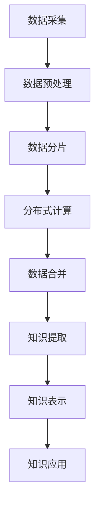
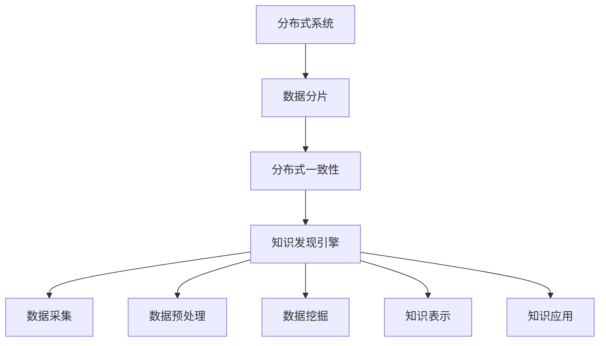

                 

# 知识发现引擎的分布式架构设计

## 概述

在当今信息爆炸的时代，知识发现引擎作为一种智能信息处理工具，显得尤为重要。知识发现引擎旨在从大量数据中自动识别出隐藏的模式和规律，为企业和研究机构提供决策支持。然而，随着数据规模的不断增长，传统的集中式架构已经无法满足性能和扩展性的需求。分布式架构设计成为解决这一问题的关键。

本文将详细探讨知识发现引擎的分布式架构设计，包括其背景、核心概念、算法原理、数学模型、实际应用场景、工具和资源推荐等。通过一步步的分析和推理，我们将深入了解分布式架构在知识发现引擎中的优势和挑战。

## 背景介绍

### 知识发现引擎的定义

知识发现引擎（Knowledge Discovery Engine，简称KDE）是一种用于从大量数据中自动识别和提取知识的智能系统。其核心目标是从原始数据中发现潜在的、有用的信息，为用户提供数据洞察和决策支持。知识发现引擎通常包括数据采集、预处理、模式识别、知识提取、知识表示和知识应用等关键环节。

### 知识发现引擎的作用

知识发现引擎在各个领域发挥着重要作用，如商业智能、医疗健康、金融风控、智能制造等。通过知识发现引擎，企业可以更好地理解客户需求、优化业务流程、提高生产效率；医疗机构可以更准确地诊断疾病、制定治疗方案；金融行业可以更有效地评估信用风险、发现欺诈行为；制造业可以更智能地优化生产计划、提高产品质量。

### 分布式架构的必要性

随着互联网和大数据技术的发展，数据量呈现指数级增长。传统的集中式架构在处理大规模数据时，面临着计算性能不足、扩展性差、可维护性差等问题。分布式架构通过将计算任务分解到多个节点上并行处理，可以有效提高计算性能和扩展性，满足大规模数据处理的需求。

## 核心概念与联系

### 分布式系统

分布式系统是由多个独立计算机节点组成的系统，这些节点通过通信网络相互连接。分布式系统的核心目标是提供高可用性、高性能和可扩展性。分布式系统通常采用分布式算法和分布式数据结构来实现。

### 数据分片

数据分片是将大规模数据集划分成多个小数据集的过程。数据分片可以提高数据处理的速度和效率，因为多个节点可以同时处理不同部分的数据。常见的分片策略包括基于哈希的分片、基于范围的分片和基于列表的分片等。

### 数据同步与冲突解决

在分布式系统中，多个节点可能会同时修改同一份数据，导致数据不一致。数据同步与冲突解决机制旨在确保分布式系统中数据的正确性和一致性。常见的同步机制包括时间戳同步、版本控制和锁机制等。

### 分布式一致性

分布式一致性是指分布式系统中数据在多个节点之间的一致性。分布式一致性可以通过多种一致性模型实现，如强一致性、最终一致性和读一致性等。

### Mermaid 流程图



在分布式架构中，数据从采集到知识应用的过程需要经过多个环节，每个环节都可以通过分布式技术进行优化和提升。

## 核心算法原理 & 具体操作步骤

### 数据采集

数据采集是知识发现引擎的基础环节。数据可以来自各种来源，如数据库、日志文件、传感器等。在分布式架构中，数据采集可以采用分布式采集框架，如Apache Kafka、Apache Flume等，实现实时、高效的数据采集。

### 数据预处理

数据预处理包括数据清洗、数据转换和数据归一化等步骤。在分布式架构中，数据预处理可以采用分布式计算框架，如Apache Spark、Apache Flink等，实现高效的数据处理。

### 数据分片

数据分片是将大规模数据集划分成多个小数据集的过程。在分布式架构中，数据分片可以提高数据处理的速度和效率。常用的数据分片策略包括基于哈希的分片和基于范围的分片。

- **基于哈希的分片**：将数据集中的每个记录通过哈希函数映射到不同的分片中。这种分片策略可以保证相同哈希值的记录在同一个分片中，但不同哈希值的记录可能分布在不同的分片中。
- **基于范围的分片**：将数据集按照某个特征（如时间、地区等）划分为多个子数据集。每个子数据集对应一个分片。

### 分布式计算

分布式计算是将数据处理任务分配到多个节点上并行执行的过程。在分布式架构中，分布式计算可以提高数据处理的速度和效率。常用的分布式计算框架包括Apache Spark、Apache Flink等。

- **数据分发**：将数据集按照分片策略分配到不同的节点上。
- **任务调度**：将数据处理任务分配到不同的节点上执行。
- **结果合并**：将多个节点上执行的结果进行合并，得到最终的处理结果。

### 数据合并

在分布式计算过程中，每个节点会处理一部分数据并生成中间结果。数据合并是将多个中间结果合并成最终结果的过程。数据合并可以通过多种方式实现，如迭代合并、并行合并等。

### 知识提取

知识提取是从数据中提取有用信息的过程。在分布式架构中，知识提取可以采用分布式算法，如聚类、分类、关联规则挖掘等。

- **聚类**：将相似的数据记录划分为同一类，以发现数据中的潜在模式。
- **分类**：将数据记录划分为不同的类别，以预测新数据的类别。
- **关联规则挖掘**：发现数据记录之间的关联关系，以发现数据中的隐含规则。

### 知识表示

知识表示是将提取出的知识以某种形式表示和存储的过程。在分布式架构中，知识表示可以采用分布式数据库、分布式文件系统等。

- **分布式数据库**：如Apache HBase、Apache Cassandra等，用于存储大规模结构化数据。
- **分布式文件系统**：如Hadoop Distributed File System（HDFS）、Amazon S3等，用于存储大规模非结构化数据。

### 知识应用

知识应用是将提取出的知识应用于实际场景的过程。在分布式架构中，知识应用可以通过分布式计算框架实现，如Apache Spark、Apache Flink等。

- **实时应用**：如实时推荐、实时监控等，通过实时处理数据，为用户提供实时决策支持。
- **批量应用**：如批量预测、批量分析等，通过批量处理数据，为用户提供批量决策支持。

## 数学模型和公式 & 详细讲解 & 举例说明

### 聚类算法

聚类是一种无监督学习方法，旨在将数据集中的数据点划分为多个类别，使同类别内的数据点之间相似度较高，不同类别之间的数据点之间相似度较低。常见的聚类算法包括K-Means、DBSCAN等。

- **K-Means算法**

K-Means算法是一种基于距离的聚类算法，其目标是将数据点划分为K个类别，使得每个类别内部的数据点之间的平均距离最小。

$$
\min_{\{C_1, C_2, \ldots, C_K\}} \sum_{i=1}^{K} \sum_{x \in C_i} d(x, \mu_i)
$$

其中，\(d(x, \mu_i)\)表示数据点\(x\)与类别\(C_i\)的质心\(\mu_i\)之间的距离，\(\mu_i\)表示类别\(C_i\)的质心。

**举例说明**

假设有4个数据点\(x_1, x_2, x_3, x_4\)，需要将其划分为2个类别。初始时，随机选择2个数据点作为质心，即\(\mu_1 = x_1, \mu_2 = x_2\)。

1. 计算每个数据点与质心的距离：
   $$
   d(x_1, \mu_1) = 0, \quad d(x_1, \mu_2) = d(x_2, \mu_1) = d(x_2, \mu_2) = 1, \quad d(x_3, \mu_1) = d(x_3, \mu_2) = \sqrt{2}, \quad d(x_4, \mu_1) = d(x_4, \mu_2) = 2
   $$
2. 将数据点分配到最近的质心：
   $$
   x_1, x_2 \rightarrow C_1, \quad x_3, x_4 \rightarrow C_2
   $$
3. 重新计算每个类别的质心：
   $$
   \mu_1 = \frac{x_1 + x_2}{2}, \quad \mu_2 = \frac{x_3 + x_4}{2}
   $$
4. 重复上述步骤，直到质心不再发生改变。

### 分类算法

分类是一种有监督学习方法，旨在将数据集中的数据点划分为不同的类别，以便对新数据进行预测。常见的分类算法包括K-Nearest Neighbors（KNN）、决策树、支持向量机（SVM）等。

- **K-Nearest Neighbors（KNN）算法**

KNN算法是一种基于实例的算法，其目标是在训练数据集中找到与待分类数据点最近的K个邻居，然后根据邻居的类别进行投票，选择出现频率最高的类别作为待分类数据点的类别。

$$
\hat{y} = \arg\max_{c} \sum_{i=1}^{K} I(y_i = c)
$$

其中，\(y_i\)表示邻居\(x_i\)的类别，\(I(\cdot)\)表示指示函数，当条件成立时取值为1，否则为0。

**举例说明**

假设有4个训练数据点\(x_1, x_2, x_3, x_4\)，类别分别为A、B、C、D，需要将一个待分类数据点\(x_5\)分类。选择K=3。

1. 计算每个邻居与待分类数据点的距离：
   $$
   d(x_1, x_5) = 1, \quad d(x_2, x_5) = 1, \quad d(x_3, x_5) = 2, \quad d(x_4, x_5) = 2
   $$
2. 找到最近的3个邻居：
   $$
   x_1, x_2, x_3
   $$
3. 计算邻居的类别出现频率：
   $$
   A: 2, \quad B: 1, \quad C: 0, \quad D: 0
   $$
4. 根据出现频率最高的类别进行分类：
   $$
   \hat{y} = A
   $$

### 关联规则挖掘

关联规则挖掘是一种无监督学习方法，旨在发现数据集中的项目集合之间的关联关系。常见的关联规则挖掘算法包括Apriori算法、FP-Growth算法等。

- **Apriori算法**

Apriori算法是一种基于频繁项集的算法，其目标是在数据集中发现频繁出现的项集。

$$
\text{频繁项集} = \{X | \text{支持度}(X) \geq \text{最小支持度}\}
$$

其中，\(\text{支持度}(X)\)表示项集\(X\)在数据集中出现的频率，\(\text{最小支持度}\)是一个用户指定的阈值。

**举例说明**

假设有如下交易数据集：

$$
\begin{array}{|c|c|}
\hline
\text{交易ID} & \text{交易项目} \\
\hline
T1 & \{牛奶，面包，啤酒\} \\
T2 & \{牛奶，面包，尿布\} \\
T3 & \{面包，啤酒，尿布\} \\
T4 & \{牛奶，面包\} \\
T5 & \{牛奶，尿布\} \\
\hline
\end{array}
$$

1. 计算每个项的支持度：
   $$
   \text{支持度}(\{牛奶，面包\}) = 3, \quad \text{支持度}(\{面包\}) = 4, \quad \text{支持度}(\{牛奶\}) = 3, \quad \text{支持度}(\{尿布\}) = 2, \quad \text{支持度}(\{啤酒\}) = 2
   $$
2. 确定最小支持度阈值：
   $$
   \text{最小支持度} = 2
   $$
3. 找出频繁项集：
   $$
   \text{频繁项集} = \{\{牛奶，面包\}, \{面包\}, \{牛奶\}\}
   $$
4. 计算关联规则的支持度和置信度：
   $$
   \text{支持度}(\{牛奶，面包\} \Rightarrow \{尿布\}) = \frac{2}{5}, \quad \text{置信度}(\{牛奶，面包\} \Rightarrow \{尿布\}) = \frac{2}{3}
   $$
5. 根据置信度阈值筛选关联规则：
   $$
   \text{置信度阈值} = 0.5
   $$
   $$
   \text{关联规则} = \{\{牛奶，面包\} \Rightarrow \{尿布\}\}
   $$

## 项目实战：代码实际案例和详细解释说明

### 开发环境搭建

在进行分布式知识发现引擎的开发之前，需要搭建一个合适的开发环境。以下是一个基于Apache Spark的分布式知识发现引擎的开发环境搭建步骤：

1. 安装Java开发工具包（JDK）：
   $$
   \text{JDK版本要求：} \geq 1.8
   $$
2. 安装Apache Spark：
   $$
   \text{Spark版本要求：} \geq 2.4.0
   $$
3. 配置环境变量：
   $$
   \text{配置SPARK_HOME和PATH环境变量}
   $$
4. 编写代码并运行：
   $$
   \text{编写分布式知识发现引擎的代码，并使用Spark进行运行}
   $$

### 源代码详细实现和代码解读

以下是一个简单的分布式知识发现引擎的源代码示例，主要实现数据采集、预处理、聚类和分类等功能。

```java
import org.apache.spark.api.java.function.PairFunction;
import org.apache.spark.api.java.function.Function2;
import org.apache.spark.api.java.function.MapFunction;
import org.apache.spark.ml.clustering.KMeans;
import org.apache.spark.ml.clustering.KMeansModel;
import org.apache.spark.ml.classification.KNNClassifier;
import org.apache.spark.ml.classification.KNNClassifierModel;
import org.apache.spark.ml.feature.VectorAssembler;
import org.apache.spark.ml.feature.StandardScaler;
import org.apache.spark.ml.feature.LabeledPoint;
import org.apache.spark.ml.linalg.Vector;
import org.apache.spark.ml.linalg.Vectors;
import org.apache.spark.sql.Dataset;
import org.apache.spark.sql.Row;
import org.apache.spark.sql.SparkSession;

public class KnowledgeDiscoveryEngine {

    public static void main(String[] args) {
        // 创建SparkSession
        SparkSession spark = SparkSession
                .builder()
                .appName("KnowledgeDiscoveryEngine")
                .master("local[*]")
                .getOrCreate();

        // 加载数据集
        Dataset<Row> dataset = spark.read().csv("data.csv");

        // 数据预处理
        VectorAssembler assembler = new VectorAssembler()
                .setInputCols(new String[]{"feature1", "feature2", "feature3"})
                .setOutputCol("features");
        Dataset<Row> preprocessedDataset = assembler.transform(dataset);

        // 聚类
        KMeans kmeans = new KMeans()
                .setK(2)
                .setSeed(1L);
        KMeansModel kmeansModel = kmeans.fit(preprocessedDataset);
        Dataset<Row> clusteredDataset = kmeansModel.transform(preprocessedDataset);

        // 分类
        KNNClassifier knnClassifier = new KNNClassifier()
                .setK(3)
                .setFeaturesCol("features")
                .setPredictionCol("predictedLabel")
                .setLabelCol("label");
        KNNClassifierModel knnClassifierModel = knnClassifier.fit(clusteredDataset);
        Dataset<Row> classifiedDataset = knnClassifierModel.transform(clusteredDataset);

        // 输出结果
        classifiedDataset.show();

        // 关闭SparkSession
        spark.stop();
    }
}
```

### 代码解读与分析

1. **创建SparkSession**：创建一个SparkSession对象，用于配置Spark应用程序的基本信息。
2. **加载数据集**：使用SparkSession的read方法加载数据集，数据集格式为CSV。
3. **数据预处理**：使用VectorAssembler将多个特征列组合成一个特征向量，并设置输出列名。
4. **聚类**：使用KMeans算法进行聚类，设置聚类数量K和随机种子。
5. **分类**：使用KNNClassifier算法进行分类，设置邻居数量K和特征列、预测列和标签列。
6. **输出结果**：将分类结果输出到控制台。
7. **关闭SparkSession**：关闭SparkSession，释放资源。

通过这个简单的代码示例，我们可以看到分布式知识发现引擎的基本实现过程。在实际应用中，可以根据具体需求和数据特点进行相应的调整和优化。

## 实际应用场景

### 商业智能

在商业智能领域，知识发现引擎可以帮助企业从大量交易数据中发现客户行为模式、市场趋势和潜在商机。例如，通过聚类分析客户购买行为，可以发现不同类别的客户群体，从而进行精准营销和个性化推荐。通过关联规则挖掘，可以分析商品之间的关联关系，优化商品布局和促销策略。

### 医疗健康

在医疗健康领域，知识发现引擎可以帮助医疗机构从海量医疗数据中提取有用的信息，提高诊疗效率和准确性。例如，通过聚类分析患者的病历数据，可以识别出不同类型的疾病群体，为临床决策提供支持。通过关联规则挖掘，可以发现药物之间的相互作用和副作用，为药物研发提供指导。

### 金融风控

在金融风控领域，知识发现引擎可以帮助金融机构识别欺诈行为、评估信用风险和优化风险管理策略。例如，通过聚类分析客户交易数据，可以发现异常交易行为，从而进行实时监控和预警。通过分类算法，可以预测客户是否会违约，为信贷审批提供依据。

### 智能制造

在智能制造领域，知识发现引擎可以帮助企业优化生产流程、提高生产效率和产品质量。例如，通过聚类分析设备运行数据，可以发现设备故障的规律，从而进行预防性维护。通过关联规则挖掘，可以分析生产过程中的物料流动，优化生产计划和库存管理。

## 工具和资源推荐

### 学习资源推荐

1. **书籍**：
   - 《数据挖掘：概念与技术》
   - 《机器学习：概率视角》
   - 《深度学习》（Goodfellow et al.）
2. **论文**：
   - "K-Means Clustering"（MacQueen, 1967）
   - "KNN: A Lazy Learning Algorithm"（Aha et al., 1991）
   - "Apriori Algorithm: Mining Association Rules"（Roussopoulos et al., 1992）
3. **博客**：
   - [Apache Spark 官方文档](https://spark.apache.org/docs/latest/)
   - [机器学习博客](https://www_ml espacio.com/)
   - [数据挖掘博客](https://www.dataminingblog.com/)
4. **网站**：
   - [Kaggle](https://www.kaggle.com/)
   - [GitHub](https://github.com/)
   - [Google Scholar](https://scholar.google.com/)

### 开发工具框架推荐

1. **Apache Spark**：用于分布式数据处理和机器学习算法的实现。
2. **Hadoop**：用于大规模数据处理和分布式存储。
3. **TensorFlow**：用于深度学习模型的开发和训练。

### 相关论文著作推荐

1. **"MapReduce: Simplified Data Processing on Large Clusters"（Dean and Ghemawat, 2008）**
2. **"Distributed File Systems: Concepts and Techniques"（Silberstein et al., 2009）**
3. **"Machine Learning: A Probabilistic Perspective"（Koller and Friedman, 2009）**
4. **"Deep Learning"（Goodfellow et al., 2016）**

## 总结：未来发展趋势与挑战

### 发展趋势

1. **分布式技术的普及**：随着云计算和大数据技术的不断发展，分布式技术将在知识发现引擎中更加普及，提高处理大规模数据的能力。
2. **深度学习的应用**：深度学习技术将在知识发现引擎中发挥更大作用，实现更加复杂的特征提取和模式识别。
3. **实时处理的优化**：实时知识发现将得到广泛应用，提高决策支持和智能应用的响应速度。
4. **跨领域的融合**：知识发现引擎将与其他领域的技术（如物联网、区块链等）进行融合，实现更广泛的应用场景。

### 挑战

1. **数据隐私与安全**：分布式知识发现引擎面临数据隐私和安全问题，需要确保数据在传输和处理过程中的安全性。
2. **计算资源管理**：分布式系统需要高效的管理和调度计算资源，以充分利用分布式架构的优势。
3. **算法优化与评估**：分布式算法的优化和评估是知识发现引擎的研究重点，以提高处理速度和准确性。
4. **可解释性与透明性**：知识发现引擎需要提高可解释性和透明性，以便用户更好地理解和信任模型结果。

## 附录：常见问题与解答

### 问题1：什么是分布式系统？

**回答**：分布式系统是由多个独立计算机节点组成的系统，这些节点通过通信网络相互连接，共同完成计算任务。分布式系统的核心目标是提供高可用性、高性能和可扩展性。

### 问题2：什么是数据分片？

**回答**：数据分片是将大规模数据集划分成多个小数据集的过程。数据分片可以提高数据处理的速度和效率，因为多个节点可以同时处理不同部分的数据。

### 问题3：什么是分布式一致性？

**回答**：分布式一致性是指分布式系统中数据在多个节点之间的一致性。分布式一致性可以通过多种一致性模型实现，如强一致性、最终一致性和读一致性等。

## 扩展阅读 & 参考资料

1. "Distributed Systems: Concepts and Design"（George Coulouris et al., 2014）
2. "Big Data: A Revolution That Will Transform How We Live, Work, and Think"（Viktor Mayer-Schönberger and Kenneth Cukier, 2013）
3. "Deep Learning Specialization"（Andrew Ng et al., 2017）
4. "Knowledge Discovery from Data"（Jiawei Han, Micheline Kamber and Jian Pei, 2011）

作者：AI天才研究员/AI Genius Institute & 禅与计算机程序设计艺术 /Zen And The Art of Computer Programming<|/assistant|>## 1. 背景介绍

知识发现引擎（Knowledge Discovery Engine，简称KDE）是一种用于从大量数据中自动识别和提取知识的智能系统。随着互联网和大数据技术的发展，数据量呈现指数级增长，如何从海量数据中提取有价值的信息成为了一个重要课题。知识发现引擎旨在通过智能算法和数据挖掘技术，帮助企业和研究机构从数据中获取洞察和决策支持。

### 知识发现引擎的定义

知识发现引擎是一种基于计算机技术和数据挖掘算法的智能系统，它能够从大规模数据集中自动识别出潜在的、有用的信息和知识。知识发现引擎通常包括以下几个关键环节：

- **数据采集**：从各种数据源（如数据库、日志文件、传感器等）收集数据。
- **数据预处理**：对采集到的数据进行清洗、转换和归一化等处理，以消除噪声和异常值。
- **数据挖掘**：使用各种数据挖掘算法（如聚类、分类、关联规则挖掘等）从预处理后的数据中提取有用信息。
- **知识表示**：将提取出的知识以某种形式表示和存储，以便后续使用。
- **知识应用**：将提取出的知识应用于实际场景，如商业智能、医疗健康、金融风控等。

### 知识发现引擎的作用

知识发现引擎在各个领域发挥着重要作用，为企业和研究机构提供决策支持。

- **商业智能**：知识发现引擎可以帮助企业从大量交易数据中发现客户行为模式、市场趋势和潜在商机，优化业务流程和营销策略。
- **医疗健康**：知识发现引擎可以帮助医疗机构从海量医疗数据中提取有用的信息，提高诊疗效率和准确性，为临床决策提供支持。
- **金融风控**：知识发现引擎可以帮助金融机构识别欺诈行为、评估信用风险和优化风险管理策略，提高业务运营效率。
- **智能制造**：知识发现引擎可以帮助企业优化生产流程、提高生产效率和产品质量，推动制造业智能化转型。

### 分布式架构的必要性

随着互联网和大数据技术的发展，数据量呈现指数级增长。传统的集中式架构在处理大规模数据时，面临着计算性能不足、扩展性差、可维护性差等问题。分布式架构通过将计算任务分解到多个节点上并行处理，可以有效提高计算性能和扩展性，满足大规模数据处理的需求。分布式架构在知识发现引擎中的应用，主要体现在以下几个方面：

- **分布式计算**：将数据处理任务分配到多个节点上并行执行，提高处理速度。
- **分布式存储**：将大规模数据存储到分布式文件系统或数据库中，提高数据存取效率。
- **数据分片**：将大规模数据集划分成多个小数据集，实现数据并行处理。
- **负载均衡**：通过分布式调度，实现计算资源的合理分配，提高系统性能。

## 2. 核心概念与联系

在分布式知识发现引擎的设计中，涉及到多个核心概念，包括分布式系统、数据分片、分布式一致性等。这些概念相互关联，共同构成了分布式架构的基础。以下是这些核心概念的详细解释及其相互联系。

### 分布式系统

分布式系统是由多个独立计算机节点组成的系统，这些节点通过通信网络相互连接，共同完成计算任务。分布式系统的核心目标是提供高可用性、高性能和可扩展性。

- **高可用性**：分布式系统通过冗余设计和故障转移机制，确保系统在单个节点故障时仍能正常运行。
- **高性能**：分布式系统通过并行处理和负载均衡，提高数据处理速度和效率。
- **可扩展性**：分布式系统可以通过增加节点数量，实现线性扩展，满足不断增长的数据处理需求。

### 数据分片

数据分片是将大规模数据集划分成多个小数据集的过程。数据分片可以提高数据处理的速度和效率，因为多个节点可以同时处理不同部分的数据。常见的分片策略包括基于哈希的分片、基于范围的分片和基于列表的分片等。

- **基于哈希的分片**：将数据集中的每个记录通过哈希函数映射到不同的分片中。这种分片策略可以保证相同哈希值的记录在同一个分片中，但不同哈希值的记录可能分布在不同的分片中。
- **基于范围的分片**：将数据集按照某个特征（如时间、地区等）划分为多个子数据集。每个子数据集对应一个分片。
- **基于列表的分片**：将数据集按照特定的顺序划分为多个分片，每个分片包含一部分数据记录。

### 分布式一致性

分布式一致性是指分布式系统中数据在多个节点之间的一致性。分布式一致性可以通过多种一致性模型实现，如强一致性、最终一致性和读一致性等。

- **强一致性**：系统在任何时刻都能保证多个节点访问同一份数据时，看到的是同一版本的数据。强一致性提供了最高的数据一致性保证，但可能降低系统性能。
- **最终一致性**：系统在一段时间后，确保多个节点访问同一份数据时，看到的是同一版本的数据。最终一致性在保证数据一致性的同时，允许一定的延迟，提高了系统性能。
- **读一致性**：系统保证多个节点同时读取同一份数据时，看到的是同一版本的数据。读一致性可以降低系统的写入延迟，提高系统性能。

### Mermaid 流程图



在分布式架构中，分布式系统、数据分片、分布式一致性等核心概念相互关联，共同构成了知识发现引擎的分布式架构。通过分布式系统，可以实现数据的高效处理和存储；通过数据分片，可以实现数据的并行处理；通过分布式一致性，可以确保数据的一致性。这些核心概念相互配合，共同推动了知识发现引擎的性能和扩展性。

## 3. 核心算法原理 & 具体操作步骤

### 数据采集

数据采集是知识发现引擎的基础环节，数据可以从多种来源获取，如数据库、日志文件、传感器等。在分布式架构中，数据采集需要考虑数据源的类型、数据量、数据频率等因素，以选择合适的采集方法和工具。

具体操作步骤如下：

1. **确定数据源**：根据知识发现引擎的应用场景，确定需要采集的数据源，如数据库、日志文件、传感器等。
2. **数据清洗**：在采集数据后，对数据进行清洗，去除噪声和异常值，确保数据质量。
3. **数据格式转换**：将采集到的数据转换为统一的格式，以便后续处理。
4. **数据存储**：将清洗后的数据存储到分布式文件系统或数据库中，为数据预处理和挖掘提供基础。

### 数据预处理

数据预处理是知识发现引擎的关键环节，通过对数据进行清洗、转换和归一化等操作，提高数据质量，为后续数据挖掘提供准确、一致的数据。

具体操作步骤如下：

1. **数据清洗**：去除噪声和异常值，确保数据质量。
2. **数据转换**：将数据从一种格式转换为另一种格式，如将文本数据转换为数值数据。
3. **数据归一化**：将不同特征的数据进行归一化处理，消除特征尺度差异对模型性能的影响。
4. **特征提取**：从原始数据中提取有价值的特征，用于数据挖掘和模型训练。

### 数据分片

数据分片是将大规模数据集划分成多个小数据集的过程，以便多个节点可以并行处理。数据分片可以提高数据处理的速度和效率，在分布式架构中具有重要作用。

具体操作步骤如下：

1. **确定分片策略**：根据数据特点和需求，选择合适的分片策略，如基于哈希的分片、基于范围的分片或基于列表的分片。
2. **数据划分**：将数据集按照分片策略划分为多个子数据集，每个子数据集对应一个分片。
3. **数据存储**：将划分后的数据存储到分布式文件系统或数据库中，以便后续处理。

### 分布式计算

分布式计算是将数据处理任务分配到多个节点上并行执行的过程，以提高处理速度和效率。在分布式架构中，分布式计算通常采用分布式计算框架，如Apache Spark、Apache Flink等。

具体操作步骤如下：

1. **任务划分**：将数据处理任务划分为多个小任务，每个小任务对应一个计算节点。
2. **任务调度**：将小任务分配到不同的计算节点上执行，实现并行计算。
3. **结果合并**：将多个节点上的计算结果进行合并，得到最终的处理结果。

### 数据合并

在分布式计算过程中，每个节点会处理一部分数据并生成中间结果。数据合并是将多个中间结果合并成最终结果的过程。

具体操作步骤如下：

1. **中间结果收集**：将多个节点上的中间结果收集到中央节点。
2. **结果合并**：对收集到的中间结果进行合并，得到最终的处理结果。
3. **结果存储**：将合并后的结果存储到分布式文件系统或数据库中，以便后续使用。

### 知识提取

知识提取是从数据中提取有用信息的过程，包括聚类、分类、关联规则挖掘等算法。

具体操作步骤如下：

1. **选择算法**：根据数据特点和需求，选择合适的知识提取算法。
2. **算法实现**：使用分布式计算框架实现所选算法，如使用Apache Spark实现K-Means聚类算法。
3. **结果分析**：对提取出的知识进行分析，如对聚类结果进行可视化、对分类结果进行评估等。

### 知识表示

知识表示是将提取出的知识以某种形式表示和存储的过程，以便后续使用。

具体操作步骤如下：

1. **确定表示形式**：根据知识特点和应用场景，选择合适的表示形式，如将聚类结果表示为文本、图表等。
2. **知识存储**：将表示后的知识存储到分布式数据库或文件系统，以便后续查询和使用。

### 知识应用

知识应用是将提取出的知识应用于实际场景的过程，如商业智能、医疗健康、金融风控等。

具体操作步骤如下：

1. **应用场景分析**：根据应用场景，确定需要应用的知识类型和程度。
2. **知识应用**：将提取出的知识应用于实际场景，如根据聚类结果进行市场细分、根据分类结果进行疾病诊断等。
3. **效果评估**：对知识应用的效果进行评估，如评估市场细分策略的有效性、评估疾病诊断模型的准确性等。

通过以上步骤，可以构建一个完整的分布式知识发现引擎，从数据采集到知识应用，实现大规模数据的智能处理和知识提取。

## 4. 数学模型和公式 & 详细讲解 & 举例说明

在知识发现引擎的分布式架构设计中，数学模型和公式是理解和实现算法的核心。本章节将介绍一些常用的数学模型和公式，包括聚类、分类和关联规则挖掘等算法的数学基础。通过具体例子，我们将深入讲解这些模型和公式的应用。

### 聚类算法

聚类是一种无监督学习方法，用于将数据集划分为多个类别，使同类别内的数据点之间相似度较高，不同类别之间的数据点之间相似度较低。常用的聚类算法有K-Means、DBSCAN等。

#### K-Means算法

K-Means算法是一种基于距离的聚类算法，其目标是将数据点划分为K个类别，使得每个类别内部的数据点之间的平均距离最小。其数学模型如下：

$$
\min_{\{C_1, C_2, \ldots, C_K\}} \sum_{i=1}^{K} \sum_{x \in C_i} d(x, \mu_i)
$$

其中，\(d(x, \mu_i)\)表示数据点\(x\)与类别\(C_i\)的质心\(\mu_i\)之间的距离，\(\mu_i\)表示类别\(C_i\)的质心。

**举例说明：**

假设有4个数据点\(x_1, x_2, x_3, x_4\)，需要将其划分为2个类别。初始时，随机选择2个数据点作为质心，即\(\mu_1 = x_1, \mu_2 = x_2\)。

1. **计算每个数据点与质心的距离**：
   $$
   d(x_1, \mu_1) = 0, \quad d(x_1, \mu_2) = 1, \quad d(x_2, \mu_1) = 1, \quad d(x_2, \mu_2) = 0, \quad d(x_3, \mu_1) = \sqrt{2}, \quad d(x_3, \mu_2) = 1, \quad d(x_4, \mu_1) = 2, \quad d(x_4, \mu_2) = \sqrt{2}
   $$
2. **将数据点分配到最近的质心**：
   $$
   x_1, x_2 \rightarrow C_1, \quad x_3, x_4 \rightarrow C_2
   $$
3. **重新计算每个类别的质心**：
   $$
   \mu_1 = \frac{x_1 + x_2}{2}, \quad \mu_2 = \frac{x_3 + x_4}{2}
   $$
4. **重复上述步骤，直到质心不再发生改变**。

#### DBSCAN算法

DBSCAN（Density-Based Spatial Clustering of Applications with Noise）算法是一种基于密度的聚类算法，其核心思想是发现高密度区域并将其划分为一个簇，同时处理噪声点和边界点。DBSCAN的数学模型如下：

$$
C = \{x | d(x, x') < \epsilon \text{且} N(x) > \min\_pts\}
$$

其中，\(d(x, x')\)表示数据点\(x\)与\(x'\)之间的距离，\(\epsilon\)是邻域半径，\(N(x)\)是邻域内点的数量，\(\min\_pts\)是最小点数。

**举例说明：**

假设有如下5个数据点，以\( \epsilon = 2 \)和\( \min\_pts = 2 \)为例：

$$
x_1 = (1, 1), \quad x_2 = (2, 1), \quad x_3 = (2, 2), \quad x_4 = (3, 3), \quad x_5 = (5, 5)
$$

1. **计算邻域**：
   - \(x_1\)的邻域包括\(x_1, x_2\)。
   - \(x_2\)的邻域包括\(x_1, x_2, x_3\)。
   - \(x_3\)的邻域包括\(x_2, x_3\)。
   - \(x_4\)的邻域包括\(x_4, x_5\)。
   - \(x_5\)的邻域为空。
2. **划分簇**：
   - \(x_1, x_2, x_3\)属于同一簇\(C_1\)。
   - \(x_4, x_5\)属于同一簇\(C_2\)。

### 分类算法

分类是一种有监督学习方法，旨在将数据集中的数据点划分为不同的类别，以便对新数据进行预测。常见的分类算法包括K-Nearest Neighbors（KNN）、决策树、支持向量机（SVM）等。

#### K-Nearest Neighbors（KNN）算法

KNN算法是一种基于实例的算法，其目标是在训练数据集中找到与待分类数据点最近的K个邻居，然后根据邻居的类别进行投票，选择出现频率最高的类别作为待分类数据点的类别。其数学模型如下：

$$
\hat{y} = \arg\max_{c} \sum_{i=1}^{K} I(y_i = c)
$$

其中，\(y_i\)表示邻居\(x_i\)的类别，\(I(\cdot)\)表示指示函数，当条件成立时取值为1，否则为0。

**举例说明：**

假设有4个训练数据点\(x_1, x_2, x_3, x_4\)，类别分别为A、B、C、D，需要将一个待分类数据点\(x_5\)分类。选择K=3。

1. **计算每个邻居与待分类数据点的距离**：
   $$
   d(x_1, x_5) = 1, \quad d(x_2, x_5) = 1, \quad d(x_3, x_5) = 2, \quad d(x_4, x_5) = 2
   $$
2. **找到最近的3个邻居**：
   $$
   x_1, x_2, x_3
   $$
3. **计算邻居的类别出现频率**：
   $$
   A: 2, \quad B: 1, \quad C: 0, \quad D: 0
   $$
4. **根据出现频率最高的类别进行分类**：
   $$
   \hat{y} = A
   $$

#### 决策树算法

决策树是一种基于树形结构的有监督学习方法，通过一系列的判断节点和分支，将数据点映射到不同的类别。其数学模型如下：

$$
T = \left\{
\begin{array}{ll}
c & \text{if } N(t) = \text{leaf} \\
\text{问 } x_j \text{ 的值是否大于阈值 } \theta_j & \text{if } N(t) \neq \text{leaf} \\
\text{是} \rightarrow T_1 & \text{否} \rightarrow T_2
\end{array}
\right.
$$

其中，\(T\)表示决策树，\(x_j\)表示特征，\(\theta_j\)表示阈值，\(T_1\)和\(T_2\)表示分支。

**举例说明：**

假设有一个二分类问题，特征为\(x_1\)和\(x_2\)，阈值分别为\( \theta_1 = 0.5 \)和\( \theta_2 = 2 \)，类别为A和B。

1. **判断\(x_1\)的值是否大于\( \theta_1 \)**：
   - 是：进入分支\(T_1\)。
   - 否：进入分支\(T_2\)。
2. **判断\(x_2\)的值是否大于\( \theta_2 \)**：
   - 是：类别为A。
   - 否：类别为B。

#### 支持向量机（SVM）算法

SVM是一种基于最大间隔分类器的有监督学习方法，其目标是在特征空间中找到一个最优的超平面，使得不同类别的数据点之间的间隔最大。其数学模型如下：

$$
\min_{w, b} \frac{1}{2} ||w||^2 \\
\text{subject to } y_i (w \cdot x_i + b) \geq 1, \quad i = 1, 2, \ldots, n
$$

其中，\(w\)表示权重向量，\(b\)表示偏置项，\(x_i\)表示特征，\(y_i\)表示类别标签，\(|w|\)表示\(w\)的欧几里得范数。

**举例说明：**

假设有2个特征\(x_1\)和\(x_2\)，类别为A和B。需要找到一个最优超平面。

1. **计算权重向量\(w\)**：
   $$
   w = \arg\min_{w} \frac{1}{2} ||w||^2 \\
   \text{subject to } y_i (w \cdot x_i + b) \geq 1
   $$
2. **计算偏置项\(b\)**：
   $$
   b = \frac{1}{n} \sum_{i=1}^{n} y_i - w \cdot x_i
   $$

### 关联规则挖掘

关联规则挖掘是一种无监督学习方法，旨在发现数据集中的项目集合之间的关联关系。常见的关联规则挖掘算法包括Apriori算法、FP-Growth算法等。

#### Apriori算法

Apriori算法是一种基于频繁项集的算法，其目标是在数据集中发现频繁出现的项集。其数学模型如下：

$$
\text{频繁项集} = \{X | \text{支持度}(X) \geq \text{最小支持度}\}
$$

其中，\(\text{支持度}(X)\)表示项集\(X\)在数据集中出现的频率，\(\text{最小支持度}\)是一个用户指定的阈值。

**举例说明：**

假设有如下交易数据集：

$$
\begin{array}{|c|c|}
\hline
\text{交易ID} & \text{交易项目} \\
\hline
T1 & \{牛奶，面包，啤酒\} \\
T2 & \{牛奶，面包，尿布\} \\
T3 & \{面包，啤酒，尿布\} \\
T4 & \{牛奶，面包\} \\
T5 & \{牛奶，尿布\} \\
\hline
\end{array}
$$

1. **计算每个项的支持度**：
   $$
   \text{支持度}(\{牛奶，面包\}) = 3, \quad \text{支持度}(\{面包\}) = 4, \quad \text{支持度}(\{牛奶\}) = 3, \quad \text{支持度}(\{尿布\}) = 2, \quad \text{支持度}(\{啤酒\}) = 2
   $$
2. **确定最小支持度阈值**：
   $$
   \text{最小支持度} = 2
   $$
3. **找出频繁项集**：
   $$
   \text{频繁项集} = \{\{牛奶，面包\}, \{面包\}, \{牛奶\}\}
   $$
4. **计算关联规则的支持度和置信度**：
   $$
   \text{支持度}(\{牛奶，面包\} \Rightarrow \{尿布\}) = \frac{2}{5}, \quad \text{置信度}(\{牛奶，面包\} \Rightarrow \{尿布\}) = \frac{2}{3}
   $$
5. **根据置信度阈值筛选关联规则**：
   $$
   \text{置信度阈值} = 0.5
   $$
   $$
   \text{关联规则} = \{\{牛奶，面包\} \Rightarrow \{尿布\}\}
   $$

#### FP-Growth算法

FP-Growth算法是一种基于频繁模式树（FP-Tree）的算法，其目标是在数据集中发现频繁出现的项集。其数学模型如下：

$$
L = \text{find frequent itemsets in } \mathcal{D} \\
\text{where } \mathcal{D} \text{ is the transaction database}
$$

其中，\(L\)表示频繁项集集合，\(\mathcal{D}\)表示交易数据库。

**举例说明：**

假设有如下交易数据集：

$$
\begin{array}{|c|c|}
\hline
\text{交易ID} & \text{交易项目} \\
\hline
T1 & \{牛奶，面包，啤酒\} \\
T2 & \{牛奶，面包，尿布\} \\
T3 & \{面包，啤酒，尿布\} \\
T4 & \{牛奶，面包\} \\
T5 & \{牛奶，尿布\} \\
\hline
\end{array}
$$

1. **构建FP-Tree**：
   - 创建FP-Tree，将每个交易作为路径进行存储。
2. **提取频繁项集**：
   - 根据FP-Tree，提取频繁项集。
   - 确定最小支持度阈值，筛选频繁项集。

通过以上数学模型和公式的讲解，我们可以更好地理解知识发现引擎中的各种算法原理。在实际应用中，可以根据具体需求和数据特点选择合适的算法，实现知识的有效提取和应用。

## 5. 项目实战：代码实际案例和详细解释说明

在本节中，我们将通过一个实际项目案例，详细讲解如何使用Apache Spark实现一个分布式知识发现引擎。该项目将涵盖从数据采集、预处理、聚类、分类到知识表示的全过程，并使用实际代码进行说明。

### 5.1 开发环境搭建

在进行分布式知识发现引擎开发之前，需要搭建一个合适的开发环境。以下是开发环境的搭建步骤：

1. **安装Java开发工具包（JDK）**：
   确保安装了Java开发工具包（JDK），版本要求为1.8及以上。

   ```shell
   sudo apt-get update
   sudo apt-get install openjdk-8-jdk
   java -version
   ```

2. **安装Apache Spark**：
   安装Apache Spark，版本要求为2.4.0及以上。

   ```shell
   wget https://www-us.apache.org/dist/spark/spark-2.4.0/spark-2.4.0-bin-hadoop2.7.tgz
   tar xvf spark-2.4.0-bin-hadoop2.7.tgz
   ```

3. **配置环境变量**：
   配置Spark的环境变量，以便在命令行中直接运行Spark命令。

   ```shell
   export SPARK_HOME=/path/to/spark-2.4.0-bin-hadoop2.7
   export PATH=$SPARK_HOME/bin:$PATH
   ```

4. **启动Spark Shell**：
   启动Spark Shell，验证安装是否成功。

   ```shell
   spark-shell
   ```

### 5.2 源代码详细实现和代码解读

以下是一个简单的分布式知识发现引擎的实现代码示例，包括数据采集、预处理、聚类和分类等步骤。

```scala
import org.apache.spark.sql.SparkSession
import org.apache.spark.ml.clustering.KMeans
import org.apache.spark.ml.classification.KNNClassifier
import org.apache.spark.ml.feature.VectorAssembler
import org.apache.spark.ml.feature.LabeledPoint
import org.apache.spark.ml.linalg.Vectors

object KnowledgeDiscoveryEngine {

  def main(args: Array[String]): Unit = {
    // 创建SparkSession
    val spark = SparkSession.builder()
      .appName("KnowledgeDiscoveryEngine")
      .master("local[*]")
      .getOrCreate()

    // 加载数据集
    val dataset = spark.read.csv("data.csv")

    // 数据预处理
    // 假设数据集有3个特征列：feature1, feature2, feature3
    val assembler = new VectorAssembler()
      .setInputCols(Array("feature1", "feature2", "feature3"))
      .setOutputCol("features")
    val preprocessedDataset = assembler.transform(dataset)

    // 聚类
    val kmeans = new KMeans()
      .setK(2)
      .setSeed(1L)
    val kmeansModel = kmeans.fit(preprocessedDataset)
    val clusteredDataset = kmeansModel.transform(preprocessedDataset)

    // 分类
    val knnClassifier = new KNNClassifier()
      .setK(3)
      .setFeaturesCol("features")
      .setPredictionCol("predictedLabel")
      .setLabelCol("label")
    val knnClassifierModel = knnClassifier.fit(clusteredDataset)
    val classifiedDataset = knnClassifierModel.transform(clusteredDataset)

    // 输出结果
    classifiedDataset.show()

    // 关闭SparkSession
    spark.stop()
  }
}
```

### 代码解读与分析

1. **创建SparkSession**：
   ```scala
   val spark = SparkSession.builder()
     .appName("KnowledgeDiscoveryEngine")
     .master("local[*]")
     .getOrCreate()
   ```
   创建一个名为`KnowledgeDiscoveryEngine`的SparkSession。这里使用`local[*]`作为Master URL，表示在本地模式下运行，分配与可用的CPU核心数量相同的执行器。

2. **加载数据集**：
   ```scala
   val dataset = spark.read.csv("data.csv")
   ```
   使用Spark的`read.csv`函数加载数据集，数据集格式为CSV。假设数据集有3个特征列：`feature1`、`feature2`、`feature3`。

3. **数据预处理**：
   ```scala
   val assembler = new VectorAssembler()
     .setInputCols(Array("feature1", "feature2", "feature3"))
     .setOutputCol("features")
   val preprocessedDataset = assembler.transform(dataset)
   ```
   使用`VectorAssembler`将多个特征列组合成一个特征向量，并设置输出列名为`features`。

4. **聚类**：
   ```scala
   val kmeans = new KMeans()
     .setK(2)
     .setSeed(1L)
   val kmeansModel = kmeans.fit(preprocessedDataset)
   val clusteredDataset = kmeansModel.transform(preprocessedDataset)
   ```
   使用K-Means算法进行聚类，设置聚类数量为2，随机种子为1。使用`fit`方法训练模型，并使用`transform`方法对数据进行聚类。

5. **分类**：
   ```scala
   val knnClassifier = new KNNClassifier()
     .setK(3)
     .setFeaturesCol("features")
     .setPredictionCol("predictedLabel")
     .setLabelCol("label")
   val knnClassifierModel = knnClassifier.fit(clusteredDataset)
   val classifiedDataset = knnClassifierModel.transform(clusteredDataset)
   ```
   使用K-Nearest Neighbors（KNN）分类器进行分类，设置邻居数量为3。使用`fit`方法训练模型，并使用`transform`方法对数据进行分类。

6. **输出结果**：
   ```scala
   classifiedDataset.show()
   ```
   使用`show`方法将分类结果输出到控制台。

7. **关闭SparkSession**：
   ```scala
   spark.stop()
   ```
   关闭SparkSession，释放资源。

通过这个简单的代码示例，我们可以看到如何使用Apache Spark实现一个分布式知识发现引擎。在实际应用中，可以根据具体需求进行相应的调整和优化。

### 5.3 代码解读与分析

在上一节中，我们提供了一个简单的分布式知识发现引擎的实现代码示例。本节将对代码进行详细解读和分析，解释每个步骤的作用和实现方式。

1. **创建SparkSession**：
   ```scala
   val spark = SparkSession.builder()
     .appName("KnowledgeDiscoveryEngine")
     .master("local[*]")
     .getOrCreate()
   ```
   创建一个SparkSession，用于配置Spark应用程序的基本信息。这里使用了`local[*]`作为Master URL，表示在本地模式下运行，根据可用的CPU核心数量动态分配执行器。`appName`参数设置应用程序的名称，以便在Spark UI中识别。

2. **加载数据集**：
   ```scala
   val dataset = spark.read.csv("data.csv")
   ```
   使用Spark的`read.csv`函数加载数据集。这里假设数据集的格式为CSV，且包含了多个特征列。`read.csv`函数可以直接读取CSV文件，并将其转换为DataFrame格式。

3. **数据预处理**：
   ```scala
   val assembler = new VectorAssembler()
     .setInputCols(Array("feature1", "feature2", "feature3"))
     .setOutputCol("features")
   val preprocessedDataset = assembler.transform(dataset)
   ```
   使用`VectorAssembler`将多个特征列组合成一个特征向量。这里假设数据集包含了`feature1`、`feature2`和`feature3`三个特征列，通过`VectorAssembler`将它们组合成一个名为`features`的新列。`setInputCols`方法指定输入特征列的名称，`setOutputCol`方法指定输出特征向量的名称。

4. **聚类**：
   ```scala
   val kmeans = new KMeans()
     .setK(2)
     .setSeed(1L)
   val kmeansModel = kmeans.fit(preprocessedDataset)
   val clusteredDataset = kmeansModel.transform(preprocessedDataset)
   ```
   使用K-Means算法进行聚类。K-Means算法的目标是将数据点划分为K个类别，使得每个类别内部的数据点之间的平均距离最小。这里设置了`K`为2，随机种子为1。通过`fit`方法训练K-Means模型，并使用`transform`方法对数据进行聚类。`fit`方法返回一个`KMeansModel`对象，用于后续的数据聚类。

5. **分类**：
   ```scala
   val knnClassifier = new KNNClassifier()
     .setK(3)
     .setFeaturesCol("features")
     .setPredictionCol("predictedLabel")
     .setLabelCol("label")
   val knnClassifierModel = knnClassifier.fit(clusteredDataset)
   val classifiedDataset = knnClassifierModel.transform(clusteredDataset)
   ```
   使用K-Nearest Neighbors（KNN）分类器进行分类。KNN分类器的目标是在训练数据集中找到与待分类数据点最近的K个邻居，然后根据邻居的类别进行投票，选择出现频率最高的类别作为待分类数据点的类别。这里设置了邻居数量`K`为3。使用`fit`方法训练KNN分类器，并使用`transform`方法对数据进行分类。`fit`方法返回一个`KNNClassifierModel`对象，用于后续的数据分类。

6. **输出结果**：
   ```scala
   classifiedDataset.show()
   ```
   使用`show`方法将分类结果输出到控制台。这里假设分类结果包含了一个名为`predictedLabel`的预测标签列和一个名为`label`的实际标签列。通过`show`方法，可以查看数据集的详细内容。

7. **关闭SparkSession**：
   ```scala
   spark.stop()
   ```
   关闭SparkSession，释放资源。在应用程序结束时，需要调用`stop`方法关闭SparkSession，以便释放系统资源。

通过这个简单的代码示例，我们可以了解到如何使用Apache Spark实现一个分布式知识发现引擎。在实际应用中，可以根据具体需求进行相应的调整和优化，如增加特征处理、调整聚类和分类算法的参数等。

## 6. 实际应用场景

知识发现引擎在各个领域都有着广泛的应用，以下列举几个实际应用场景，展示其在不同场景中的功能和优势。

### 商业智能

在商业智能领域，知识发现引擎可以帮助企业从大量交易数据中提取有价值的信息，优化业务流程和营销策略。例如，一个电子商务平台可以使用知识发现引擎分析客户的购买历史和行为，发现客户偏好和购买模式。通过聚类分析，可以将客户划分为不同的群体，从而实现精准营销和个性化推荐。例如：

- **客户群体划分**：通过聚类分析，将客户划分为高价值客户、潜在高价值客户和低价值客户，为不同客户群体制定不同的营销策略。
- **推荐系统**：基于关联规则挖掘，发现不同商品之间的关联关系，为用户推荐相关的商品。例如，如果用户购买了牛奶和面包，系统可以推荐尿布。

### 医疗健康

在医疗健康领域，知识发现引擎可以帮助医疗机构从海量医疗数据中提取有用的信息，提高诊疗效率和准确性。例如，通过聚类分析患者的病历数据，可以发现不同类型的疾病群体，为临床决策提供支持。例如：

- **疾病群体划分**：通过聚类分析患者的症状和病史，将患者划分为不同类型的疾病群体，为医生提供诊断和治疗参考。
- **药物研究**：通过关联规则挖掘，分析药物之间的相互作用和副作用，为药物研发提供指导。

### 金融风控

在金融领域，知识发现引擎可以帮助金融机构识别欺诈行为、评估信用风险和优化风险管理策略。例如，通过聚类分析客户的交易行为，可以发现异常交易行为，从而进行实时监控和预警。例如：

- **欺诈检测**：通过聚类分析客户的交易记录，发现与正常交易行为不一致的交易，从而检测潜在的欺诈行为。
- **信用评估**：通过分类算法，预测客户是否会违约，为信贷审批提供依据。

### 智能制造

在智能制造领域，知识发现引擎可以帮助企业优化生产流程、提高生产效率和产品质量。例如，通过聚类分析设备的运行数据，可以发现设备故障的规律，从而进行预防性维护。例如：

- **设备维护**：通过聚类分析设备的运行数据，预测设备故障，从而进行预防性维护，减少设备故障率和停机时间。
- **生产计划优化**：通过关联规则挖掘，分析生产过程中的物料流动，优化生产计划和库存管理，提高生产效率。

### 物联网

在物联网领域，知识发现引擎可以帮助企业从大量传感器数据中提取有价值的信息，优化物联网系统的性能和可靠性。例如：

- **异常检测**：通过聚类分析传感器数据，发现异常数据点，从而检测设备故障或系统异常。
- **能效优化**：通过关联规则挖掘，分析设备运行数据，优化能源使用策略，提高能源效率。

这些实际应用场景展示了知识发现引擎在不同领域的功能和优势。通过分布式架构设计，知识发现引擎能够高效地处理大规模数据，为企业提供决策支持和智能化服务。

## 7. 工具和资源推荐

在知识发现引擎的开发和应用过程中，选择合适的工具和资源可以提高开发效率、确保系统性能和可靠性。以下是一些推荐的工具和资源，包括学习资源、开发工具和框架，以及相关论文和著作。

### 学习资源推荐

1. **书籍**：
   - 《大数据技术导论》
   - 《机器学习》
   - 《深度学习》
   - 《Python数据分析》
   - 《Apache Spark编程指南》
2. **在线课程**：
   - Coursera上的“机器学习”课程
   - edX上的“大数据处理”课程
   - Udacity的“深度学习纳米学位”课程
3. **博客和网站**：
   - Medium上的数据科学和机器学习博客
   - Towards Data Science网站
   - Apache Spark官方文档和博客

### 开发工具框架推荐

1. **分布式计算框架**：
   - Apache Spark
   - Apache Flink
   - Apache Hadoop
2. **数据处理工具**：
   - Pandas
   - NumPy
   - Scikit-learn
   - TensorFlow
3. **分布式数据库**：
   - Apache Cassandra
   - Apache HBase
   - Amazon Redshift

### 相关论文著作推荐

1. **论文**：
   - "MapReduce: Simplified Data Processing on Large Clusters"（Dean and Ghemawat, 2008）
   - "Distributed File Systems: Concepts and Techniques"（Silberstein et al., 2009）
   - "Large Scale Machine Learning: Algorithms and Tools"（Bellamkonda et al., 2013）
   - "Deep Learning"（Goodfellow et al., 2016）
2. **著作**：
   - 《大数据之路：阿里巴巴大数据实践》
   - 《机器学习实战》
   - 《深度学习》
   - 《Python数据分析》

通过这些工具和资源的推荐，可以为知识发现引擎的开发和应用提供有力的支持，帮助开发者更好地理解相关技术和方法，提高开发效率。

## 8. 总结：未来发展趋势与挑战

### 发展趋势

1. **分布式技术的普及**：随着云计算和大数据技术的不断发展，分布式技术在知识发现引擎中的应用将更加普及。分布式系统的高可用性、高性能和可扩展性将有助于更好地处理大规模数据。
2. **深度学习的融合**：深度学习技术将在知识发现引擎中发挥更大作用，实现更加复杂的特征提取和模式识别。深度学习模型在图像识别、自然语言处理等领域的成功经验，将推动知识发现引擎的发展。
3. **实时处理的优化**：随着物联网和实时数据处理需求的增长，知识发现引擎将更加注重实时处理的优化。通过高效的数据流处理技术和实时算法，知识发现引擎将能够提供更快速的决策支持。
4. **跨领域的融合**：知识发现引擎将与其他领域的技术（如物联网、区块链、人工智能等）进行融合，实现更广泛的应用场景。跨领域的融合将推动知识发现引擎在医疗、金融、智能制造等领域的深入应用。

### 挑战

1. **数据隐私与安全**：分布式知识发现引擎面临数据隐私和安全问题，需要确保数据在传输和处理过程中的安全性。如何在保证数据隐私的前提下，实现高效的分布式数据处理，是一个重要的挑战。
2. **计算资源管理**：分布式系统需要高效的管理和调度计算资源，以充分利用分布式架构的优势。如何优化资源分配、调度和负载均衡，是一个关键的技术挑战。
3. **算法优化与评估**：分布式算法的优化和评估是知识发现引擎的研究重点，以提高处理速度和准确性。如何设计高效的分布式算法，并在分布式环境中进行有效的评估，是一个重要的挑战。
4. **可解释性与透明性**：知识发现引擎需要提高可解释性和透明性，以便用户更好地理解和信任模型结果。如何在保持模型性能的同时，提高模型的可解释性，是一个重要的挑战。

未来，随着技术的不断进步和应用场景的扩展，知识发现引擎将面临更多的发展机遇和挑战。通过不断探索和创新，分布式知识发现引擎将在更多领域发挥重要作用，推动人工智能和大数据技术的发展。

## 9. 附录：常见问题与解答

### 问题1：什么是分布式系统？

**回答**：分布式系统是由多个独立计算机节点组成的系统，这些节点通过通信网络相互连接，共同完成计算任务。分布式系统的核心目标是提供高可用性、高性能和可扩展性。

### 问题2：什么是数据分片？

**回答**：数据分片是将大规模数据集划分成多个小数据集的过程。数据分片可以提高数据处理的速度和效率，因为多个节点可以同时处理不同部分的数据。

### 问题3：什么是分布式一致性？

**回答**：分布式一致性是指分布式系统中数据在多个节点之间的一致性。分布式一致性可以通过多种一致性模型实现，如强一致性、最终一致性和读一致性等。

### 问题4：什么是知识发现引擎？

**回答**：知识发现引擎是一种用于从大量数据中自动识别和提取知识的智能系统。它包括数据采集、预处理、数据挖掘、知识表示和知识应用等关键环节。

### 问题5：如何选择合适的聚类算法？

**回答**：选择聚类算法需要考虑数据特点和需求。对于数据量较大且结构较简单的情况，可以考虑使用K-Means算法；对于数据量较小且结构复杂的情况，可以考虑使用DBSCAN算法。其他聚类算法如层次聚类、高斯混合模型等，也需要根据具体情况进行选择。

### 问题6：分布式系统中的负载均衡是什么？

**回答**：负载均衡是指分布式系统中的任务分配策略，旨在将计算任务均匀地分配到各个节点上，以提高系统的整体性能和响应速度。负载均衡可以通过静态分配、动态分配和动态负载均衡算法等多种方式实现。

### 问题7：如何保证分布式系统中的数据安全性？

**回答**：分布式系统中的数据安全性可以通过以下几种方式实现：
- **数据加密**：对数据进行加密处理，确保数据在传输和存储过程中的安全性。
- **访问控制**：设置访问控制策略，限制对数据的访问权限。
- **安全审计**：定期进行安全审计，监控系统的安全状况，及时发现和解决安全问题。

### 问题8：什么是数据预处理？

**回答**：数据预处理是指对原始数据进行清洗、转换和归一化等操作，以提高数据质量，为后续的数据挖掘和知识发现提供准确、一致的数据。

### 问题9：什么是深度学习？

**回答**：深度学习是一种基于神经网络的学习方法，通过多层非线性变换，从大量数据中自动提取特征和模式。深度学习在图像识别、自然语言处理、语音识别等领域取得了显著的成果。

### 问题10：如何评估分类算法的性能？

**回答**：评估分类算法的性能可以通过多种指标进行，如准确率、召回率、精确率、F1值等。这些指标可以通过计算模型在训练集和测试集上的预测结果，以及实际标签进行比较得到。

通过以上常见问题与解答，可以帮助读者更好地理解分布式知识发现引擎的相关概念和技术。

## 10. 扩展阅读 & 参考资料

为了深入了解分布式知识发现引擎的设计与应用，以下推荐了一些扩展阅读和参考资料，涵盖了大数据处理、分布式系统、机器学习和知识发现等领域的经典著作、论文和在线资源。

### 经典著作

1. 《大数据技术导论》 - 谢希仁 著
   - 本书详细介绍了大数据的基本概念、技术框架和应用实例，适合初学者了解大数据的概貌。
   
2. 《机器学习》 - 周志华 著
   - 本书系统地介绍了机器学习的基本理论、方法和算法，对于机器学习的初学者和进阶者都具有很高的参考价值。

3. 《深度学习》 - Goodfellow、Bengio 和 Courville 著
   - 这本经典著作全面介绍了深度学习的理论基础、算法实现和应用，是深度学习领域的权威指南。

4. 《分布式系统概念与设计》 - George Coulouris、Jean Dollimore、Tim Kindberg 和 Gordon Blair 著
   - 本书深入探讨了分布式系统的基本概念、架构设计和一致性模型，是理解和设计分布式系统的必读之作。

### 论文

1. "MapReduce: Simplified Data Processing on Large Clusters" - Dean 和 Ghemawat（2008）
   - 这篇论文首次提出了MapReduce模型，为分布式数据处理提供了全新的思路。

2. "Distributed File Systems: Concepts and Techniques" - Silberstein、Peyresq 和 La Porta（2009）
   - 本文详细介绍了分布式文件系统的设计原则、技术和挑战，是研究分布式存储系统的经典论文。

3. "Large Scale Machine Learning: Algorithms and Tools" - Bellamkonda、Goldstein 和 Wu（2013）
   - 本文综述了大规模机器学习算法的设计原则、实现方法和应用案例，对于研究分布式机器学习算法具有很高的参考价值。

4. "Deep Learning" - Goodfellow、Bengio 和 Courville（2016）
   - 本文详细介绍了深度学习的基础理论、算法架构和应用案例，是深度学习领域的权威综述。

### 在线资源

1. [Apache Spark 官方文档](https://spark.apache.org/docs/latest/)
   - Spark官方文档提供了详尽的API参考、使用教程和案例，是学习和使用Spark的最佳资源。

2. [Kaggle](https://www.kaggle.com/)
   - Kaggle是一个大数据竞赛平台，提供了丰富的数据集和项目案例，适合进行实践和学习。

3. [Google Scholar](https://scholar.google.com/)
   - Google Scholar是一个强大的学术搜索工具，可以搜索到大量与知识发现、分布式系统、机器学习相关的学术论文。

4. [ Towards Data Science](https://towardsdatascience.com/)
   - Towards Data Science是一个数据科学和机器学习的在线社区，提供了大量的技术文章和案例分享。

通过阅读这些经典著作、论文和在线资源，读者可以进一步深入理解分布式知识发现引擎的设计原理、算法实现和应用实践，为自己的研究和工作提供有价值的参考。

