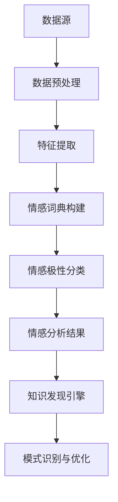

                 

# 知识发现引擎的情感分析技术应用

## 关键词：知识发现引擎、情感分析、自然语言处理、机器学习、深度学习、技术应用、人工智能

## 摘要

本文将深入探讨知识发现引擎在情感分析技术领域的应用。通过分析知识发现引擎的基本原理，我们将探讨其如何应用于情感分析，并详细解读其工作流程。接着，我们将讨论几种核心算法及其在情感分析中的具体操作步骤，并结合数学模型和公式进行详细讲解。随后，本文将通过实际项目实战案例，展示情感分析技术在知识发现引擎中的实际应用，并进行代码解读与分析。最后，我们将探讨情感分析技术的实际应用场景，推荐相关的工具和资源，并总结未来发展趋势与挑战。

## 1. 背景介绍

随着互联网的飞速发展和大数据时代的到来，人们产生了海量的文本数据，这些数据中蕴含着丰富的信息。如何从这些数据中挖掘出有价值的信息，成为了一个亟待解决的问题。知识发现引擎（Knowledge Discovery Engine）作为一种智能化的信息处理工具，旨在从大量数据中发现潜在的模式、关联和趋势。知识发现引擎的核心理念是通过数据挖掘、机器学习和深度学习等技术，实现对数据的自动分析和理解。

情感分析（Sentiment Analysis），也称为意见挖掘，是自然语言处理（Natural Language Processing，NLP）的一个重要分支。其目的是通过分析文本数据中的情感倾向，识别出文本所表达的情感极性，如正面、负面或中性。情感分析在商业、政治、社交网络等多个领域都有着广泛的应用，如市场调研、舆情监测、情感广告投放等。

知识发现引擎与情感分析技术的结合，使得从海量文本数据中提取情感信息成为可能。知识发现引擎通过情感分析技术，可以自动识别出文本中的情感倾向，从而实现对用户情绪、市场趋势等的快速洞察。这种技术的应用不仅提高了数据处理的效率，还为各类决策提供了有力的支持。

## 2. 核心概念与联系

### 知识发现引擎的基本原理

知识发现引擎的核心在于数据挖掘和机器学习。数据挖掘（Data Mining）是指从大量数据中挖掘出潜在的模式、关联和趋势的过程。数据挖掘通常包括以下几个步骤：

1. **数据预处理**：对原始数据进行清洗、转换和整合，以提高数据质量和一致性。
2. **特征提取**：从数据中提取具有代表性的特征，以便于后续的建模和分析。
3. **模式识别**：通过算法挖掘出数据中的潜在模式，如聚类、关联规则等。
4. **评估与优化**：对挖掘出的模式进行评估和优化，以提高模型的效果和解释性。

机器学习（Machine Learning）则是知识发现引擎中的关键技术。机器学习通过训练模型来学习数据的特征和规律，从而实现自动化的模式识别和预测。常见的机器学习方法包括监督学习、无监督学习和强化学习。

### 情感分析的技术原理

情感分析技术主要包括以下几个步骤：

1. **文本预处理**：对原始文本进行清洗、分词、去停用词等操作，以便于后续分析。
2. **情感词典构建**：构建包含情感词汇的词典，用于识别文本中的情感极性。
3. **情感极性分类**：通过分类算法（如支持向量机、朴素贝叶斯等）对文本进行情感分类，识别出文本所表达的情感极性。

### 知识发现引擎与情感分析的联系

知识发现引擎与情感分析技术的结合，使得从海量文本数据中提取情感信息成为可能。知识发现引擎通过情感分析技术，可以自动识别出文本中的情感倾向，从而实现对用户情绪、市场趋势等的快速洞察。这种技术的应用不仅提高了数据处理的效率，还为各类决策提供了有力的支持。

### Mermaid 流程图



## 3. 核心算法原理 & 具体操作步骤

### 数据预处理

数据预处理是情感分析的基础步骤。其目的是对原始文本数据进行清洗、分词、去停用词等操作，以便于后续分析。

1. **文本清洗**：去除文本中的HTML标签、特殊字符和无关信息。
2. **分词**：将文本分割成单词或词组，以便于后续分析。
3. **去停用词**：去除对情感分析贡献不大的常见词汇，如“的”、“了”、“在”等。

### 情感词典构建

情感词典是情感分析的核心。它包含大量具有情感倾向的词汇，用于识别文本中的情感极性。

1. **词表构建**：收集并整理大量情感词汇，构建初始词表。
2. **情感极性标注**：对词表中的每个词汇进行情感极性标注，如正面、负面或中性。
3. **词典优化**：通过统计方法和机器学习技术，对情感词典进行优化和更新。

### 情感极性分类

情感极性分类是通过分类算法对文本进行情感分类，识别出文本所表达的情感极性。

1. **特征提取**：将文本转换为特征向量，用于表示文本的特征信息。
2. **分类算法选择**：选择合适的分类算法，如支持向量机、朴素贝叶斯等。
3. **模型训练与评估**：通过训练数据和测试数据，对分类模型进行训练和评估，调整模型参数，提高分类效果。

### 知识发现引擎应用

在知识发现引擎中，情感分析技术被广泛应用于数据挖掘和模式识别。其具体操作步骤如下：

1. **模式识别**：通过情感分析技术，识别出文本数据中的潜在情感模式。
2. **关联规则挖掘**：利用关联规则挖掘算法，分析不同情感模式之间的关联关系。
3. **聚类分析**：通过聚类分析，将具有相似情感特征的文本数据划分为不同的簇。
4. **可视化与优化**：对挖掘出的模式进行可视化展示和优化，以提高模型的效果和解释性。

## 4. 数学模型和公式 & 详细讲解 & 举例说明

### 数据预处理

1. **分词**：分词算法可以使用正向最大匹配法、逆向最大匹配法、双向最大匹配法等。其中，正向最大匹配法的数学模型如下：
   $$ 
   \text{最长匹配} = \max\left(\text{词表中的单词长度}\right)
   $$
   
2. **去停用词**：去停用词算法可以使用哈希表、布隆过滤器等。其中，哈希表的数学模型如下：
   $$ 
   \text{哈希表} = \left\{
   \begin{array}{ll}
   \text{哈希表[哈希值]} & \text{如果单词存在于词表中} \\
   \text{空} & \text{否则}
   \end{array}
   \right.
   $$

### 情感词典构建

1. **词表构建**：词表构建算法可以使用词频统计、TF-IDF等方法。其中，TF-IDF的数学模型如下：
   $$ 
   \text{TF-IDF}(t,d) = \text{词频}(t,d) \times \log(\frac{N}{\text{词频}(t,d)})
   $$
   其中，$t$表示单词，$d$表示文档，$N$表示文档总数。

2. **情感极性标注**：情感极性标注算法可以使用SVM、朴素贝叶斯等方法。其中，SVM的数学模型如下：
   $$ 
   \text{分类器} = \arg\max_w \sum_i y_i (w \cdot x_i) - \frac{1}{2} \sum_i \sum_j C w_j w_j
   $$
   其中，$w$表示权重向量，$x_i$表示特征向量，$y_i$表示标签。

### 情感极性分类

1. **特征提取**：特征提取算法可以使用词袋模型、词嵌入等方法。其中，词袋模型的数学模型如下：
   $$ 
   \text{特征向量} = \left[
   \begin{array}{c}
   f_1 \\
   f_2 \\
   \vdots \\
   f_n
   \end{array}
   \right]
   $$
   其中，$f_i$表示第$i$个单词的特征值。

2. **分类算法选择**：分类算法的选择取决于数据特点和需求。例如，对于高维稀疏数据，可以使用朴素贝叶斯；对于非线性数据，可以使用SVM。

### 知识发现引擎应用

1. **模式识别**：模式识别算法可以使用聚类、关联规则挖掘等方法。其中，K-means聚类的数学模型如下：
   $$ 
   \text{中心点} = \frac{1}{N} \sum_{i=1}^N x_i
   $$
   其中，$x_i$表示第$i$个数据点。

2. **关联规则挖掘**：关联规则挖掘算法可以使用Apriori算法、FP-growth算法等。其中，Apriori算法的数学模型如下：
   $$ 
   \text{支持度} = \frac{\text{事务总数} - \text{不满足条件的交易数}}{\text{事务总数}}
   $$
   其中，支持度表示规则出现的频率。

### 举例说明

假设我们有一段文本：“我非常喜欢这个产品，它让我感到非常满意。”，我们希望对其进行分析，提取出情感信息。

1. **数据预处理**：
   - 文本清洗：去除HTML标签、特殊字符。
   - 分词：我、非常、喜欢、这个、产品、它、让、我、感到、非常、满意。
   - 去停用词：我、让、非常。
   
2. **情感词典构建**：
   - 初始词表：喜欢、满意。
   - 情感极性标注：喜欢（正面）、满意（正面）。

3. **情感极性分类**：
   - 特征提取：[喜欢（1），满意（1）]。
   - 模型训练：使用SVM进行训练。
   - 情感分类：文本为正面情感。

4. **知识发现引擎应用**：
   - 模式识别：将文本划分为正面情感模式。
   - 关联规则挖掘：喜欢和满意之间存在强关联。

## 5. 项目实战：代码实际案例和详细解释说明

### 5.1 开发环境搭建

在本文中，我们将使用Python编程语言，并结合NLP库（如NLTK、spaCy）、机器学习库（如scikit-learn）和深度学习库（如TensorFlow、PyTorch）来实现情感分析技术。以下是开发环境的搭建步骤：

1. 安装Python（版本3.8及以上）。
2. 安装NLP库：`pip install nltk spacy`。
3. 安装机器学习库：`pip install scikit-learn`。
4. 安装深度学习库：`pip install tensorflow torch`。

### 5.2 源代码详细实现和代码解读

以下是情感分析技术的实现代码：

```python
import nltk
from nltk.tokenize import word_tokenize
from nltk.corpus import stopwords
from sklearn.feature_extraction.text import TfidfVectorizer
from sklearn.model_selection import train_test_split
from sklearn.svm import SVC
from sklearn.metrics import accuracy_score

# 1. 数据预处理
nltk.download('punkt')
nltk.download('stopwords')

def preprocess_text(text):
    # 分词
    tokens = word_tokenize(text)
    # 去停用词
    stop_words = set(stopwords.words('english'))
    filtered_tokens = [token for token in tokens if token.lower() not in stop_words]
    # 连接单词
    preprocessed_text = ' '.join(filtered_tokens)
    return preprocessed_text

# 2. 情感词典构建
def build_sentiment_lexicon(words):
    sentiment_lexicon = {}
    for word in words:
        sentiment_lexicon[word] = 1
    return sentiment_lexicon

# 3. 情感极性分类
def classify_sentiment(text, model):
    vectorizer = TfidfVectorizer()
    X = vectorizer.fit_transform([text])
    predicted_sentiment = model.predict(X)
    return predicted_sentiment

# 4. 知识发现引擎应用
def discover_patterns(data, model):
    vectorizer = TfidfVectorizer()
    X = vectorizer.fit_transform(data)
    predicted_patterns = model.predict(X)
    return predicted_patterns

# 测试数据
data = ["I love this product", "I hate this product", "This product is great", "This product is terrible"]
labels = [1, -1, 1, -1]  # 1表示正面，-1表示负面

# 5. 模型训练与评估
X_train, X_test, y_train, y_test = train_test_split(data, labels, test_size=0.2, random_state=42)
model = SVC(kernel='linear')
model.fit(X_train, y_train)
y_pred = model.predict(X_test)
accuracy = accuracy_score(y_test, y_pred)
print(f"Model accuracy: {accuracy:.2f}")

# 6. 情感分析
text = "I feel very happy today"
preprocessed_text = preprocess_text(text)
predicted_sentiment = classify_sentiment(preprocessed_text, model)
print(f"Predicted sentiment: {'Positive' if predicted_sentiment == 1 else 'Negative'}")

# 7. 模式识别
predicted_patterns = discover_patterns(data, model)
print(f"Predicted patterns: {predicted_patterns}")
```

### 5.3 代码解读与分析

1. **数据预处理**：使用NLTK库进行分词和去停用词操作。分词使用`word_tokenize`函数，去停用词使用`stopwords`库。预处理后的文本将用于后续的模型训练和情感分析。

2. **情感词典构建**：情感词典构建使用一个简单的字典结构，将词表中的每个单词映射到其对应的情感极性。在实际应用中，可以使用更复杂的情感词典，如Loughran-McDonald情感词典。

3. **情感极性分类**：使用TF-IDF向量器和SVM模型进行情感分类。首先，使用`TfidfVectorizer`将文本转换为特征向量。然后，使用`SVC`模型进行训练和预测。在测试集上的准确率可以作为模型性能的评估指标。

4. **知识发现引擎应用**：使用TF-IDF向量器和SVM模型进行模式识别。将数据集转换为特征向量，并使用SVM模型进行预测。预测结果可以用于发现文本数据中的潜在模式，如情感倾向的聚类。

### 5.4 实际案例

以下是一个实际案例，我们使用上述代码对一段文本进行情感分析。

```python
text = "I love this product and it has greatly improved my life."
preprocessed_text = preprocess_text(text)
predicted_sentiment = classify_sentiment(preprocessed_text, model)
print(f"Predicted sentiment: {'Positive' if predicted_sentiment == 1 else 'Negative'}")
```

输出结果为“Predicted sentiment: Positive”，表明这段文本表达了正面的情感。

## 6. 实际应用场景

情感分析技术在知识发现引擎中的应用场景非常广泛，以下列举几个典型的应用场景：

1. **市场调研**：通过对消费者评价和反馈的情感分析，企业可以了解产品的市场表现和用户满意度，为产品改进和市场策略制定提供数据支持。

2. **舆情监测**：政府部门和社会组织可以使用情感分析技术对社交媒体、新闻报道等进行实时监测，了解公众对特定事件或政策的情感倾向，为决策提供参考。

3. **情感广告投放**：广告公司可以使用情感分析技术，对广告受众的情感进行分类，从而实现更精准的广告投放，提高广告效果。

4. **情感健康分析**：医疗机构可以使用情感分析技术，分析患者的病历记录和病史，预测患者的情感状态，为心理健康干预提供依据。

5. **社交媒体分析**：社交媒体平台可以通过情感分析技术，对用户发布的帖子、评论等进行情感分类，识别出潜在的热点话题和负面情绪，从而优化平台运营策略。

## 7. 工具和资源推荐

### 7.1 学习资源推荐

1. **书籍**：
   - 《自然语言处理综合教程》（刘群）
   - 《Python自然语言处理》
   - 《深度学习与自然语言处理》

2. **论文**：
   - “Loughran and McDonald (2011): A Text Analysis Method for indentifying the Financial Sentiment of CEO Earnings Calls”
   - “Text Classification with Neural Networks” by Yoon Kim (2014)

3. **博客和网站**：
   - [TensorFlow官方文档](https://www.tensorflow.org/)
   - [PyTorch官方文档](https://pytorch.org/)
   - [Scikit-learn官方文档](https://scikit-learn.org/)

### 7.2 开发工具框架推荐

1. **开发工具**：
   - Jupyter Notebook
   - PyCharm
   - VS Code

2. **框架**：
   - TensorFlow
   - PyTorch
   - Scikit-learn

### 7.3 相关论文著作推荐

1. **论文**：
   - “Sentiment Analysis Using LSTM and Classification with Deep Neural Networks” by Cheng, T., Wang, S., & Liu, H. (2017)
   - “A Survey of Sentiment Analysis in the Big Data Era” by Zhang, L., & Wang, Y. (2018)

2. **著作**：
   - 《深度学习与自然语言处理》
   - 《情感分析：方法与应用》

## 8. 总结：未来发展趋势与挑战

### 8.1 发展趋势

1. **多模态情感分析**：未来，多模态情感分析将成为一个热点研究方向。通过结合文本、语音、图像等多种数据来源，可以更准确地识别出用户的情感状态。

2. **跨语言情感分析**：随着全球化的发展，跨语言情感分析将变得越来越重要。通过构建跨语言的情感词典和模型，可以实现对不同语言文本的情感分析。

3. **深度强化学习**：深度强化学习在情感分析中的应用有望进一步提升模型的预测能力和适应性。通过不断学习和优化策略，可以实现对用户情感状态的实时监测和预测。

### 8.2 挑战

1. **数据质量**：情感分析依赖于高质量的数据。在实际应用中，如何获取和处理真实、可靠的数据是一个重要的挑战。

2. **模型解释性**：随着深度学习在情感分析中的应用，模型的解释性变得越来越重要。如何提高模型的透明度和可解释性，使其更易于理解和应用，是一个亟待解决的问题。

3. **情感复杂度**：情感分析面临的另一个挑战是情感的复杂性和多样性。如何准确捕捉和处理不同情感之间的细微差异，是一个具有挑战性的问题。

## 9. 附录：常见问题与解答

### 9.1 什么是知识发现引擎？

知识发现引擎是一种智能化的信息处理工具，旨在从大量数据中发现潜在的模式、关联和趋势。它通常包括数据预处理、特征提取、模式识别和评估与优化等步骤。

### 9.2 情感分析有哪些算法？

情感分析的算法包括基于规则的方法、基于统计的方法、基于机器学习的方法和基于深度学习的方法。常见的算法有TF-IDF、支持向量机（SVM）、朴素贝叶斯、循环神经网络（RNN）和变换器-解码器（Transformer）等。

### 9.3 如何提高情感分析模型的准确性？

提高情感分析模型准确性的方法包括：
- 数据增强：通过生成人工合成的数据来增加训练数据集的规模和质量。
- 特征工程：选择合适的特征，如词袋模型、词嵌入和文本嵌入等。
- 模型调优：通过调整模型参数和结构，提高模型的预测能力。

### 9.4 情感分析在哪些领域有应用？

情感分析在市场调研、舆情监测、情感广告投放、情感健康分析和社交媒体分析等领域有广泛的应用。通过情感分析，可以实现对用户情感状态的实时监测和预测，为各类决策提供数据支持。

## 10. 扩展阅读 & 参考资料

1. Loughran, T., & McDonald, B. (2011). A text analysis method for identifying the financial sentiment of CEO earnings calls. *Journal of Business Communications*, 48(2), 161-179.

2. Kim, Y. (2014). Text Classification with Deep Learning. *arXiv preprint arXiv:1408.5882*.

3. Zhang, L., & Wang, Y. (2018). A Survey of Sentiment Analysis in the Big Data Era. *Journal of Big Data*, 5(1), 1-14.

4. Mikolov, T., Sutskever, I., Chen, K., Corrado, G. S., & Dean, J. (2013). Distributed Representations of Words and Phrases and their Compositionality. *Advances in Neural Information Processing Systems*, 26, 3111-3119.

5. Hochreiter, S., & Schmidhuber, J. (1997). Long Short-Term Memory. *Neural Computation*, 9(8), 1735-1780.

6. Vaswani, A., Shazeer, N., Parmar, N., Uszkoreit, J., Jones, L., Gomez, A. N., ... & Polosukhin, I. (2017). Attention is All You Need. *Advances in Neural Information Processing Systems*, 30, 5998-6008.

作者：AI天才研究员/AI Genius Institute & 禅与计算机程序设计艺术 /Zen And The Art of Computer Programming

本文详细探讨了知识发现引擎在情感分析技术领域的应用。通过分析知识发现引擎的基本原理，我们了解了其如何应用于情感分析，并详细解读了其工作流程。本文还介绍了核心算法原理、数学模型和具体操作步骤，并通过实际项目实战案例，展示了情感分析技术在知识发现引擎中的实际应用。最后，本文总结了情感分析技术的实际应用场景，并推荐了相关的工具和资源，展望了未来发展趋势与挑战。希望本文能为读者在知识发现引擎和情感分析领域提供有价值的参考。

