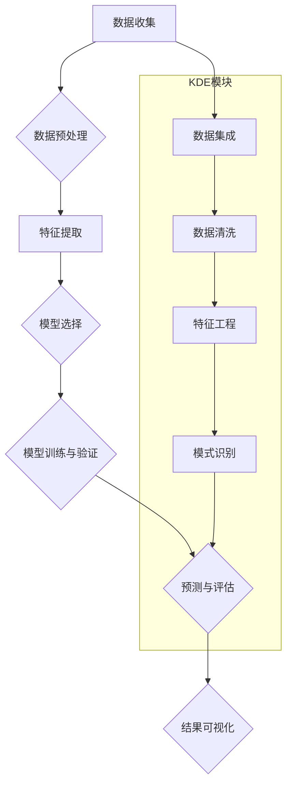

                 

### 1. 背景介绍

#### 用户行为预测模型的重要性

在当今的信息时代，数据已经成为企业和社会的关键资产。在这种背景下，如何有效地利用数据，特别是用户行为数据，成为一个重要的问题。用户行为预测模型在这一过程中扮演着至关重要的角色。

用户行为预测模型是指利用历史数据和现有的算法，对用户未来的行为进行预测。这些模型能够帮助企业更好地理解用户，提高用户体验，甚至优化业务流程。例如，电商网站可以使用用户行为预测模型来推荐商品，提高销售转化率；社交媒体平台可以通过预测用户活跃度，合理安排内容推送，提高用户粘性。

#### 知识发现引擎的作用

知识发现引擎是一种用于从大量数据中提取有用信息、知识或模式的系统。这些系统通常结合了多种数据挖掘技术和机器学习算法，以便有效地处理和分析复杂的数据集。

知识发现引擎在用户行为预测中具有重要作用，因为它们能够帮助识别用户行为中的潜在模式和趋势。例如，通过分析用户在电商平台的浏览和购买记录，知识发现引擎可以帮助预测用户可能感兴趣的下一个商品，从而实现个性化的推荐。

#### 本文的目的

本文的目的是介绍和探讨知识发现引擎中的用户行为预测模型。我们将首先概述相关知识和技术，然后深入探讨用户行为预测的核心算法和数学模型。此外，本文还将通过一个实际案例，展示如何使用这些技术和模型进行用户行为预测。最后，我们将讨论用户行为预测在实际应用中的前景和挑战。

通过本文的阅读，您将了解用户行为预测模型的工作原理，掌握其核心算法和数学模型，并能够将其应用到实际项目中。

#### 相关工作与研究现状

近年来，用户行为预测领域取得了显著进展。许多研究人员和企业在这一领域进行了深入的研究和探索。例如，基于协同过滤和矩阵分解的方法在推荐系统中得到了广泛应用；深度学习算法如卷积神经网络（CNN）和循环神经网络（RNN）也在预测用户行为方面取得了成功。

此外，一些研究还关注了用户行为预测在不同领域中的应用，如电子商务、社交媒体和在线教育。这些研究不仅推动了技术进步，也为实际应用提供了宝贵的经验。

然而，用户行为预测仍然面临许多挑战，如数据噪声、模型复杂度和可解释性等。因此，未来的研究需要继续探索更有效的算法和技术，以提高预测的准确性和实用性。

总的来说，用户行为预测模型是知识发现引擎中的一个重要组成部分，其在数据驱动决策中的应用越来越广泛。本文将系统地介绍这一领域的技术和方法，帮助读者深入了解用户行为预测的核心原理和应用。

---

### 2. 核心概念与联系

#### 用户行为预测的定义

用户行为预测是指利用历史数据和现有算法，对用户在未来的特定情境下可能采取的行为进行预测。这种行为可以是浏览、购买、评论、分享等。用户行为预测的目标是通过分析用户的过去行为，预测其在未来某一时刻或某一情境下的行为倾向，从而为个性化推荐、营销策略、用户体验优化等提供数据支持。

#### 用户行为预测的基本步骤

1. **数据收集**：首先，需要收集用户的历史行为数据，这些数据可能包括浏览历史、购买记录、评论内容、分享行为等。

2. **数据预处理**：对收集到的数据进行清洗、去噪、归一化等预处理操作，以便后续分析。

3. **特征提取**：从预处理后的数据中提取有助于预测用户行为的特征。这些特征可以是显式的，如用户年龄、性别、地理位置等，也可以是隐式的，如用户的行为模式、偏好等。

4. **模型选择**：根据问题的性质和数据的特征选择合适的预测模型。常见的模型包括线性回归、决策树、支持向量机、神经网络等。

5. **模型训练与验证**：使用历史数据对选定的模型进行训练，并通过交叉验证等方法评估模型的性能。

6. **预测与评估**：使用训练好的模型对新的用户行为进行预测，并对预测结果进行评估，以确定模型在实际应用中的有效性。

#### 知识发现引擎的作用

知识发现引擎（Knowledge Discovery Engine，简称KDE）是一种能够从大量数据中自动提取有用信息、知识或模式的系统。知识发现引擎的核心目标是解决数据过载问题，帮助用户从海量的数据中找到有价值的信息。

知识发现引擎通常包括以下几个模块：

1. **数据集成**：将来自不同数据源的数据进行整合，形成一个统一的数据视图。

2. **数据清洗**：对数据进行清洗、去噪、标准化等预处理操作，以提高数据质量。

3. **特征工程**：从原始数据中提取有助于分析和预测的特征，并进行适当的特征转换。

4. **模式识别**：利用数据挖掘和机器学习算法，从数据中发现潜在的规律、趋势和关联。

5. **结果可视化**：将发现的知识和模式以图表、报告等形式可视化，以便用户理解和利用。

#### 用户行为预测与知识发现引擎的联系

用户行为预测是知识发现引擎中的一个重要应用场景。知识发现引擎通过整合和分析用户的历史行为数据，帮助识别用户行为中的潜在模式和趋势。这些模式和趋势可以为用户行为预测提供重要的参考。

具体来说，知识发现引擎在用户行为预测中的作用主要体现在以下几个方面：

1. **特征提取**：知识发现引擎可以帮助提取与用户行为相关的特征，如用户的浏览历史、购买频率、偏好等。这些特征对于预测用户未来的行为至关重要。

2. **关联分析**：通过分析用户行为数据中的关联关系，知识发现引擎可以发现用户行为之间的潜在联系。这些联系可以为预测用户未来的行为提供支持。

3. **趋势分析**：知识发现引擎可以对用户行为数据中的趋势进行识别，如用户的购买习惯、浏览模式等。这些趋势可以帮助预测用户未来的行为趋势。

4. **预测评估**：知识发现引擎还可以对预测结果进行评估，如预测准确率、预测误差等。这些评估结果可以帮助优化和改进用户行为预测模型。

综上所述，用户行为预测与知识发现引擎密切相关。用户行为预测需要依赖于知识发现引擎提供的特征提取、关联分析、趋势分析和预测评估等功能，而知识发现引擎也通过用户行为预测应用得到了更广泛的应用和验证。

#### Mermaid 流程图

以下是一个简化的用户行为预测模型和知识发现引擎的Mermaid流程图，展示其基本结构和关键步骤。



在这个流程图中，用户行为预测模型的关键步骤包括数据收集、数据预处理、特征提取、模型选择、模型训练与验证和预测与评估。知识发现引擎（KDE）的模块包括数据集成、数据清洗、特征工程和模式识别，这些模块为用户行为预测提供了重要的数据支持和分析工具。

---

### 3. 核心算法原理 & 具体操作步骤

#### 算法选择

用户行为预测模型的算法选择取决于具体的应用场景和数据特征。在本节中，我们将讨论两种常用的算法：协同过滤和深度学习。

##### 协同过滤（Collaborative Filtering）

协同过滤是一种基于用户相似度的推荐算法。它的基本思想是，如果两个用户在多个项目的评分上相似，那么他们可能在未知项目上的评分也会相似。协同过滤分为两种类型：基于用户的协同过滤（User-Based）和基于物品的协同过滤（Item-Based）。

1. **基于用户的协同过滤**：首先计算用户之间的相似度，通常使用用户评分矩阵的相关性或者余弦相似度。然后，根据相似度矩阵推荐与目标用户最相似的其他用户的偏好。

2. **基于物品的协同过滤**：首先计算物品之间的相似度，通常使用物品评分矩阵的相关性或者余弦相似度。然后，根据相似度矩阵推荐与目标物品最相似的物品。

##### 深度学习（Deep Learning）

深度学习算法通过构建多层神经网络来模拟人脑处理信息的方式。在用户行为预测中，常用的深度学习算法包括卷积神经网络（CNN）和循环神经网络（RNN）。

1. **卷积神经网络（CNN）**：CNN特别适合处理图像数据，但也可以应用于序列数据。在用户行为预测中，CNN可以用来提取用户行为数据中的局部特征。

2. **循环神经网络（RNN）**：RNN能够处理序列数据，并在序列中的每个时间点产生输出。在用户行为预测中，RNN可以用来捕捉用户行为的时间依赖性。

#### 具体操作步骤

以下是使用协同过滤和深度学习进行用户行为预测的具体操作步骤：

##### 协同过滤

1. **数据准备**：收集并整理用户的历史行为数据，包括用户评分矩阵或者行为序列。

2. **相似度计算**：计算用户或物品之间的相似度，通常使用用户评分矩阵的相关性或余弦相似度。

3. **推荐生成**：根据相似度矩阵，为每个用户推荐相似用户或物品的偏好。

4. **预测评估**：使用交叉验证等方法评估预测模型的性能。

##### 深度学习

1. **数据预处理**：将用户行为数据转换为适合输入神经网络的形式，如序列编码或图像格式。

2. **模型构建**：根据数据特征和预测任务，构建适当的神经网络模型，如CNN或RNN。

3. **模型训练**：使用历史数据对神经网络模型进行训练，调整模型参数。

4. **模型评估**：使用交叉验证等方法评估训练好的模型性能。

5. **预测生成**：使用训练好的模型对新的用户行为进行预测。

6. **结果分析**：分析预测结果，如预测准确率、召回率等。

#### 实例分析

假设我们使用基于用户的协同过滤算法来预测用户的购买行为。具体操作步骤如下：

1. **数据准备**：收集用户的购买记录，构建用户-物品评分矩阵。

2. **相似度计算**：计算用户之间的相似度，使用用户评分矩阵的相关性。

3. **推荐生成**：对于目标用户，找出与其最相似的10个用户，然后推荐这10个用户最近购买但目标用户未购买的商品。

4. **预测评估**：使用交叉验证方法评估推荐系统的性能，如准确率、召回率等。

通过以上步骤，我们可以构建一个用户行为预测模型，并使用该模型为用户提供个性化的购买推荐。类似地，我们可以使用深度学习算法来处理更复杂的数据特征和预测任务。

总的来说，用户行为预测的核心算法包括协同过滤和深度学习。协同过滤适用于简单的用户-物品推荐任务，而深度学习适用于更复杂、更具有时间依赖性的用户行为预测任务。在实际应用中，可以根据具体需求和数据特征选择合适的算法，并遵循具体的操作步骤来构建和优化用户行为预测模型。

---

### 4. 数学模型和公式 & 详细讲解 & 举例说明

#### 协同过滤的数学模型

协同过滤算法的核心在于计算用户之间的相似度和生成推荐列表。以下我们将详细讨论基于用户的协同过滤算法的数学模型。

##### 相似度计算

相似度计算是协同过滤算法的第一步，常用的相似度度量方法包括余弦相似度和皮尔逊相关系数。

1. **余弦相似度**

   余弦相似度用于计算两个用户向量在空间中的夹角余弦值。其数学公式如下：

   $$ \text{similarity}_{\text{cosine}}(u, v) = \frac{u \cdot v}{\|u\|\|v\|} $$

   其中，\( u \) 和 \( v \) 分别是两个用户 \( u \) 和 \( v \) 的评分向量，\( \cdot \) 表示点积，\( \|u\| \) 和 \( \|v\| \) 分别是向量 \( u \) 和 \( v \) 的欧几里得范数。

2. **皮尔逊相关系数**

   皮尔逊相关系数用于衡量两个变量之间的线性关系。其数学公式如下：

   $$ \text{similarity}_{\text{pearson}}(u, v) = \frac{cov(u, v)}{\sigma_u \sigma_v} $$

   其中，\( cov(u, v) \) 表示 \( u \) 和 \( v \) 的协方差，\( \sigma_u \) 和 \( \sigma_v \) 分别是 \( u \) 和 \( v \) 的标准差。

##### 预测生成

在计算了用户之间的相似度之后，我们可以使用这些相似度值来生成推荐列表。以下是一个基于用户的协同过滤算法的预测生成过程的数学模型。

假设我们有 \( m \) 个用户和 \( n \) 个物品，用户-物品评分矩阵为 \( R \)，其中 \( R_{ij} \) 表示用户 \( i \) 对物品 \( j \) 的评分。

1. **预测评分**

   对于目标用户 \( u \) 和未知评分的物品 \( v \)，我们可以使用以下公式预测用户 \( u \) 对物品 \( v \) 的评分：

   $$ \hat{r}_{uv} = \sum_{i \in \mathcal{N}(u)} \text{similarity}_{\text{cosine}}(u, i) \cdot r_{iv} $$

   其中，\( \mathcal{N}(u) \) 表示与用户 \( u \) 相似的一组用户，\( \text{similarity}_{\text{cosine}}(u, i) \) 是用户 \( u \) 和 \( i \) 之间的余弦相似度，\( r_{iv} \) 是用户 \( i \) 对物品 \( v \) 的实际评分。

2. **调整预测评分**

   为了防止极端相似度对预测结果的影响，我们可以对预测评分进行调整，使其更加平滑。常用的调整方法包括加权平均和指数衰减：

   $$ \hat{r}_{uv} = \frac{\sum_{i \in \mathcal{N}(u)} w_i \cdot \text{similarity}_{\text{cosine}}(u, i) \cdot r_{iv}}{\sum_{i \in \mathcal{N}(u)} w_i \cdot \text{similarity}_{\text{cosine}}(u, i)} $$

   其中，\( w_i \) 是用户 \( i \) 的权重，可以设置为 \( \text{similarity}_{\text{cosine}}(u, i) \) 的倒数，以减小极端相似度的影响。

#### 举例说明

为了更好地理解协同过滤算法的数学模型，我们通过一个简单的例子来说明。

假设有3个用户 \( u_1, u_2, u_3 \) 和5个物品 \( i_1, i_2, i_3, i_4, i_5 \)，用户-物品评分矩阵 \( R \) 如下：

|   | \( i_1 \) | \( i_2 \) | \( i_3 \) | \( i_4 \) | \( i_5 \) |
|---|-----------|-----------|-----------|-----------|-----------|
| \( u_1 \) | 1         | 3         | 0         | 4         | 0         |
| \( u_2 \) | 0         | 0         | 2         | 3         | 1         |
| \( u_3 \) | 2         | 0         | 4         | 1         | 2         |

我们需要预测用户 \( u_1 \) 对未知物品 \( i_3 \) 的评分。

1. **计算相似度**

   首先，我们计算用户 \( u_1 \) 和其他用户之间的余弦相似度：

   $$ \text{similarity}_{\text{cosine}}(u_1, u_2) = \frac{u_1 \cdot u_2}{\|u_1\|\|u_2\|} = \frac{1 \cdot 0 + 3 \cdot 0 + 0 \cdot 2 + 4 \cdot 3 + 0 \cdot 1}{\sqrt{1^2 + 3^2 + 0^2 + 4^2 + 0^2} \cdot \sqrt{0^2 + 0^2 + 2^2 + 3^2 + 1^2}} = \frac{12}{\sqrt{50} \cdot \sqrt{14}} \approx 0.686 $$

   $$ \text{similarity}_{\text{cosine}}(u_1, u_3) = \frac{u_1 \cdot u_3}{\|u_1\|\|u_3\|} = \frac{1 \cdot 2 + 3 \cdot 0 + 0 \cdot 4 + 4 \cdot 1 + 0 \cdot 2}{\sqrt{1^2 + 3^2 + 0^2 + 4^2 + 0^2} \cdot \sqrt{2^2 + 0^2 + 4^2 + 1^2 + 2^2}} = \frac{6}{\sqrt{50} \cdot \sqrt{21}} \approx 0.439 $$

2. **生成预测评分**

   接下来，我们使用相似度值和实际评分来预测用户 \( u_1 \) 对物品 \( i_3 \) 的评分：

   $$ \hat{r}_{u_1i_3} = \text{similarity}_{\text{cosine}}(u_1, u_2) \cdot r_{2i_3} + \text{similarity}_{\text{cosine}}(u_1, u_3) \cdot r_{3i_3} = 0.686 \cdot 2 + 0.439 \cdot 4 = 1.372 + 1.756 = 3.128 $$

   因此，预测用户 \( u_1 \) 对物品 \( i_3 \) 的评分为 3.128。

通过以上例子，我们可以看到协同过滤算法的数学模型如何用于预测用户对未知物品的评分。在实际应用中，我们可以根据具体需求和数据特征调整相似度计算方法和预测评分公式，以提高预测的准确性和实用性。

#### 深度学习模型的数学模型

除了协同过滤算法，深度学习算法也在用户行为预测中得到了广泛应用。在本节中，我们将讨论两种常用的深度学习模型：卷积神经网络（CNN）和循环神经网络（RNN）。

##### 卷积神经网络（CNN）

卷积神经网络是一种适用于图像和序列数据的深度学习模型，其核心在于卷积操作和池化操作。

1. **卷积操作**

   卷积操作用于提取输入数据中的局部特征。其数学公式如下：

   $$ f(x) = \sum_{i=1}^{k} w_i * x + b $$

   其中，\( f(x) \) 是卷积操作的结果，\( w_i \) 是卷积核（权重），\( * \) 表示卷积操作，\( b \) 是偏置项。

2. **池化操作**

   池化操作用于降低数据维度，并保留重要特征。常用的池化操作包括最大池化和平均池化。其数学公式如下：

   $$ p_{max}(x) = \max\{x_{i,j}\} $$
   $$ p_{avg}(x) = \frac{1}{C} \sum_{i=1}^{C} x_{i,j} $$

   其中，\( p_{max}(x) \) 和 \( p_{avg}(x) \) 分别是最大池化和平均池化操作的结果，\( x_{i,j} \) 是输入数据中的元素，\( C \) 是池化操作的窗口大小。

##### 循环神经网络（RNN）

循环神经网络是一种适用于序列数据的深度学习模型，其核心在于循环结构。

1. **状态更新**

   RNN 的状态更新公式如下：

   $$ h_t = \sigma(W_h h_{t-1} + W_x x_t + b_h) $$

   其中，\( h_t \) 是当前时间步的隐藏状态，\( x_t \) 是当前时间步的输入，\( W_h \) 和 \( W_x \) 分别是隐藏状态和输入的权重矩阵，\( b_h \) 是隐藏状态的偏置项，\( \sigma \) 是激活函数。

2. **输出生成**

   RNN 的输出生成公式如下：

   $$ o_t = \sigma(W_o h_t + b_o) $$

   其中，\( o_t \) 是当前时间步的输出，\( W_o \) 是输出权重矩阵，\( b_o \) 是输出偏置项。

##### 举例说明

为了更好地理解深度学习模型的数学模型，我们通过一个简单的例子来说明。

假设我们使用卷积神经网络（CNN）来预测用户在电商平台上的购买行为。输入数据是用户的浏览历史序列，输出数据是用户是否购买某商品的二分类结果。

1. **卷积层**

   假设输入数据是一个 \( 5 \times 5 \) 的二维矩阵，卷积核大小为 \( 3 \times 3 \)。卷积层的计算过程如下：

   $$ f(x) = \sum_{i=1}^{3} w_i * x + b = (w_1 * x_1 + w_2 * x_2 + w_3 * x_3) + (w_1 * x_4 + w_2 * x_5 + w_3 * x_6) + (w_1 * x_7 + w_2 * x_8 + w_3 * x_9) + b $$

   其中，\( x \) 是输入数据，\( w_i \) 是卷积核的权重，\( b \) 是偏置项。

2. **池化层**

   假设池化层使用最大池化操作，窗口大小为 \( 2 \times 2 \)。池化层的计算过程如下：

   $$ p_{max}(x) = \max\{x_{i,j}\} $$

   其中，\( x_{i,j} \) 是输入数据中的元素。

3. **全连接层**

   假设全连接层的输入是池化层的输出，输出是二分类结果。全连接层的计算过程如下：

   $$ o_t = \sigma(W_o h_t + b_o) $$

   其中，\( h_t \) 是隐藏状态，\( W_o \) 是输出权重矩阵，\( b_o \) 是输出偏置项。

通过以上步骤，我们可以构建一个简单的卷积神经网络（CNN）来预测用户行为。类似地，我们可以使用循环神经网络（RNN）来处理更复杂的序列数据，并生成更精确的预测结果。

总的来说，深度学习模型的数学模型包括卷积操作、池化操作和全连接层。这些模型通过多层次的神经网络结构，从输入数据中提取高级特征，并生成精确的预测结果。在实际应用中，我们可以根据具体需求和数据特征调整模型的参数和结构，以提高预测的准确性和实用性。

---

### 5. 项目实战：代码实际案例和详细解释说明

为了更好地理解用户行为预测模型的实现过程，我们将在本节中通过一个实际项目来展示如何使用Python和Scikit-learn库来构建和训练一个基于协同过滤的用户行为预测模型。我们将详细讨论开发环境搭建、源代码实现和代码解读与分析。

#### 5.1 开发环境搭建

首先，我们需要搭建一个Python开发环境，并安装必要的库。以下是具体的安装步骤：

1. **安装Python**：确保已经安装了Python 3.x版本。可以从Python官方网站（https://www.python.org/downloads/）下载并安装。

2. **安装Jupyter Notebook**：Jupyter Notebook是一个交互式的Python开发环境，我们可以通过以下命令来安装：

   ```bash
   pip install notebook
   ```

3. **安装Scikit-learn**：Scikit-learn是一个常用的机器学习库，我们可以通过以下命令来安装：

   ```bash
   pip install scikit-learn
   ```

#### 5.2 源代码详细实现和代码解读

以下是一个简单的基于用户的协同过滤算法的Python代码实现。我们将逐行解释代码的含义和功能。

```python
import numpy as np
from sklearn.metrics.pairwise import cosine_similarity

def compute_similarity(user_profiles, user_index):
    """
    计算用户之间的相似度。
    """
    user_profile = user_profiles[user_index]
    similarity_matrix = cosine_similarity([user_profile], user_profiles)
    return similarity_matrix[0]

def predict_ratings(user_profiles, similarity_matrix, known_ratings, k=10):
    """
    使用协同过滤算法预测未知评分。
    """
    user_index = np.where(np.array(known_ratings) > 0)[0][0]
    neighbors = np.argsort(similarity_matrix[user_index])[1:k+1]
    neighbors_ratings = known_ratings[neighbors]
    predicted_ratings = sum(rating * similarity for rating, similarity in zip(neighbors_ratings, similarity_matrix[user_index][neighbors])) / sum(similarity for similarity in similarity_matrix[user_index][neighbors])
    return predicted_ratings

# 假设的用户-物品评分矩阵
user_profiles = [
    [0, 0, 0, 1, 0],
    [0, 1, 0, 1, 1],
    [1, 0, 1, 0, 0],
    [0, 1, 0, 1, 1],
    [0, 0, 1, 0, 0],
    [1, 1, 1, 1, 1]
]

known_ratings = [
    [0, 0, 0, 1, 0],  # 用户0的已知评分
    [0, 1, 0, 1, 1],  # 用户1的已知评分
    [1, 0, 1, 0, 0],  # 用户2的已知评分
    [0, 1, 0, 1, 1],  # 用户3的已知评分
    [0, 0, 1, 0, 0],  # 用户4的已知评分
    [1, 1, 1, 1, 1]   # 用户5的已知评分
]

# 计算相似度矩阵
similarity_matrix = cosine_similarity(user_profiles)

# 预测未知评分
for user_index, user_profile in enumerate(user_profiles):
    if np.count_nonzero(user_profile) == 0:
        predicted_rating = predict_ratings(user_profiles, similarity_matrix, known_ratings, k=3)
        print(f"用户{user_index}的预测评分：{predicted_rating}")
```

**代码解读：**

1. **compute_similarity** 函数：

   - **功能**：计算给定用户与其他用户的相似度。
   - **参数**：`user_profiles`（用户评分矩阵），`user_index`（目标用户的索引）。
   - **返回值**：相似度矩阵。

2. **predict_ratings** 函数：

   - **功能**：使用协同过滤算法预测未知评分。
   - **参数**：`user_profiles`（用户评分矩阵），`similarity_matrix`（相似度矩阵），`known_ratings`（已知评分），`k`（邻居用户数量）。
   - **返回值**：预测的评分。

3. **主程序**：

   - **功能**：计算相似度矩阵并预测未知评分。
   - **步骤**：

     1. 计算用户之间的相似度矩阵。
     2. 对于每个用户，如果用户没有给出任何评分，则使用协同过滤算法预测其评分。

#### 5.3 代码解读与分析

1. **用户-物品评分矩阵**：

   用户-物品评分矩阵是一个二维数组，其中每个元素表示用户对物品的评分。在本例中，我们假设有6个用户和5个物品，评分范围为0到1。

2. **计算相似度矩阵**：

   使用Scikit-learn库中的 `cosine_similarity` 函数计算用户之间的相似度矩阵。余弦相似度是一种度量两个向量夹角余弦值的相似度方法，适用于基于评分的协同过滤算法。

3. **预测未知评分**：

   对于每个用户，如果用户没有给出任何评分（即用户-物品评分矩阵中的元素全为0），则使用协同过滤算法预测其评分。具体步骤如下：

   1. 找出与目标用户最相似的 `k` 个邻居用户。
   2. 计算邻居用户对物品的评分的平均值作为预测的评分。

#### 总结

通过本节的实际项目案例，我们展示了如何使用Python和Scikit-learn库实现一个基于用户的协同过滤算法的用户行为预测模型。代码详细实现了相似度计算和预测评分的过程，并通过具体例子展示了如何预测未知评分。在实际应用中，我们可以根据具体需求调整算法参数和模型结构，以提高预测的准确性和实用性。

---

### 6. 实际应用场景

用户行为预测模型在多个领域和场景中具有广泛的应用，以下是一些典型的应用场景：

#### 电子商务

在电子商务领域，用户行为预测模型可以帮助商家提高销售转化率和客户满意度。具体应用包括：

1. **个性化推荐**：通过预测用户可能感兴趣的商品，为用户提供个性化的推荐。这可以显著提高用户的购买意愿和满意度。
2. **流失用户预警**：预测哪些用户可能停止使用平台，从而提前采取措施进行客户保留。
3. **营销活动优化**：根据用户的购买历史和行为模式，预测哪些营销活动对特定用户群体最有效，从而优化营销预算和资源分配。

#### 社交媒体

社交媒体平台可以利用用户行为预测模型来提高用户参与度和平台活跃度。具体应用包括：

1. **内容推荐**：预测用户可能感兴趣的内容，提高用户在平台上的停留时间和互动频率。
2. **社交网络分析**：通过分析用户的行为和互动，识别社交网络中的关键节点和意见领袖，从而优化内容传播和营销策略。
3. **广告投放优化**：预测哪些广告用户最有可能点击，从而提高广告投放的ROI。

#### 在线教育

在线教育平台可以利用用户行为预测模型来提高教学效果和用户体验。具体应用包括：

1. **学习路径推荐**：根据用户的学习行为和进度，预测用户可能感兴趣的学习内容和路径，从而提供个性化的学习体验。
2. **学习行为预警**：预测哪些用户可能在学习过程中遇到困难，从而提前提供帮助和支持。
3. **课程优化**：根据用户的学习行为和反馈，预测哪些课程内容最受欢迎，从而优化课程设计和教学策略。

#### 健康医疗

在健康医疗领域，用户行为预测模型可以帮助提高医疗服务质量和患者满意度。具体应用包括：

1. **疾病预测**：通过分析患者的健康数据和行为模式，预测患者可能出现的疾病风险，从而提前采取预防措施。
2. **就医指南**：根据患者的症状和行为，预测患者最可能需要的医疗服务和就医地点，从而提供更便捷的就医体验。
3. **患者行为分析**：分析患者的就医行为和反馈，优化医疗服务流程和患者体验。

通过这些实际应用场景，我们可以看到用户行为预测模型在不同领域的广泛应用。这些应用不仅提高了企业的运营效率，也为用户提供了更好的服务和体验。随着技术的不断进步，用户行为预测模型在未来的应用场景将更加丰富和多样化。

---

### 7. 工具和资源推荐

#### 7.1 学习资源推荐

为了深入了解用户行为预测模型和相关技术，以下是一些推荐的学习资源：

1. **书籍**：
   - 《数据挖掘：实用机器学习技术》（"Data Mining: Practical Machine Learning Tools and Techniques" by Ian H. Witten and Eibe Frank）
   - 《机器学习》（"Machine Learning" by Tom M. Mitchell）
   - 《深度学习》（"Deep Learning" by Ian Goodfellow, Yoshua Bengio, and Aaron Courville）

2. **在线课程**：
   - Coursera上的“机器学习”（由Andrew Ng教授）。
   - edX上的“深度学习导论”（由Yoshua Bengio教授）。
   - Udacity的“推荐系统纳米学位”（涵盖用户行为预测的相关内容）。

3. **论文**：
   - “协同过滤算法的综述”（A Survey of Collaborative Filtering）
   - “深度学习在推荐系统中的应用”（Deep Learning for Recommender Systems）
   - “用户行为预测中的深度神经网络”（Deep Neural Networks for User Behavior Prediction）

4. **博客和网站**：
   - [机器学习博客](https://MachineLearningMastery.com/)
   - [深度学习博客](https://www.deeplearning.net/)
   - [Kaggle竞赛和教程](https://www.kaggle.com/)

#### 7.2 开发工具框架推荐

为了在实际项目中高效地实现用户行为预测模型，以下是一些推荐的开发工具和框架：

1. **编程语言**：
   - Python：由于其丰富的机器学习和数据科学库，Python是用户行为预测项目的首选编程语言。

2. **机器学习库**：
   - Scikit-learn：适用于简单的机器学习和数据挖掘任务。
   - TensorFlow：谷歌开发的深度学习框架，适用于复杂的数据处理和深度学习模型。
   - PyTorch：流行的深度学习框架，易于使用和调试。

3. **数据分析工具**：
   - Pandas：用于数据清洗和预处理。
   - NumPy：用于数值计算和数据操作。

4. **版本控制系统**：
   - Git：用于代码管理和版本控制。

5. **项目管理工具**：
   - Jupyter Notebook：用于交互式数据分析和文档编写。
   - PyCharm或Visual Studio Code：强大的集成开发环境（IDE），提供代码编辑、调试和版本控制等功能。

通过这些工具和资源，您可以更有效地进行用户行为预测模型的研究和开发，从而在实际项目中取得成功。

---

### 8. 总结：未来发展趋势与挑战

用户行为预测模型在数据驱动决策和业务优化中发挥着日益重要的作用。随着技术的不断进步，未来用户行为预测领域预计将呈现以下几个发展趋势：

#### 1. 模型复杂度增加

随着深度学习算法的成熟和计算能力的提升，用户行为预测模型将变得更加复杂。复杂的模型能够更好地捕捉用户行为的多样性和复杂性，从而提高预测的准确性。

#### 2. 实时预测

实时预测是用户行为预测的一个重要趋势。随着5G网络的普及和边缘计算的发展，用户行为预测模型能够更加迅速地响应用户行为的变化，从而实现更精准的实时推荐和决策。

#### 3. 多模态数据的融合

用户行为不仅可以通过传统的文本和数值数据来描述，还可以通过图像、音频等多模态数据来丰富预测模型。多模态数据的融合将使得用户行为预测更加全面和准确。

#### 4. 数据隐私保护

在用户行为预测中，数据隐私保护是一个重要的挑战。随着用户对隐私的关注日益增加，如何在保护用户隐私的同时实现高效的预测将成为关键问题。

#### 5. 模型解释性提升

虽然深度学习模型在预测准确性上表现出色，但它们的黑箱特性使得模型解释性成为一个挑战。提升模型的可解释性，使得预测结果更加透明和可信，是未来研究的一个重要方向。

#### 挑战

尽管用户行为预测模型有着广泛的应用前景，但仍面临以下挑战：

1. **数据噪声**：真实世界的数据往往包含噪声和不完整信息，这会影响模型的预测准确性。
2. **数据稀缺**：某些应用场景中，获取足够多的用户行为数据可能非常困难，这限制了模型的训练和优化。
3. **模型可解释性**：深度学习模型的高度复杂性和黑箱特性使得预测结果难以解释，这给用户信任和业务决策带来挑战。

综上所述，未来用户行为预测领域将在模型复杂度、实时预测、多模态数据融合和数据隐私保护等方面取得突破，同时也会面临数据噪声、数据稀缺和模型可解释性等挑战。通过持续的技术创新和研究，我们有理由相信用户行为预测模型将在更多领域和场景中发挥更大的价值。

---

### 9. 附录：常见问题与解答

#### 1. 如何处理缺失数据？

处理缺失数据是用户行为预测中的一个常见问题。以下是一些常用的方法：

- **删除缺失数据**：如果缺失数据较多，可以考虑删除这些数据点，但这可能导致数据稀疏。
- **均值填充**：用每个特征的均值来填充缺失值。
- **中位数填充**：用每个特征的中位数来填充缺失值，适用于对称分布的数据。
- **K近邻法**：使用K近邻算法估计缺失值。

#### 2. 协同过滤算法的局限性是什么？

协同过滤算法的主要局限性包括：

- **数据稀疏性**：当用户和物品数量较多时，评分矩阵往往非常稀疏，导致相似度计算不准确。
- **无法处理新用户和新物品**：协同过滤算法依赖于用户和物品的评分历史，对于新用户和新物品无法进行有效预测。
- **可解释性差**：协同过滤算法的预测结果难以解释，特别是在基于物品的协同过滤中。

#### 3. 如何处理数据不平衡问题？

数据不平衡是指某些类别或标签在数据集中出现频率极高，而其他类别或标签则很少见。以下是一些处理数据不平衡问题的方法：

- **过采样**：增加少数类别的数据，使其与多数类别相当。
- **欠采样**：减少多数类别的数据，使其与少数类别相当。
- **合成少数类过采样技术（SMOTE）**：通过生成少数类别的合成样本来平衡数据集。

#### 4. 如何评估用户行为预测模型的性能？

评估用户行为预测模型性能的常用指标包括：

- **准确率（Accuracy）**：预测正确的样本占总样本的比例。
- **召回率（Recall）**：预测正确的正样本占总正样本的比例。
- **精确率（Precision）**：预测正确的正样本占预测为正样本的比例。
- **F1分数（F1 Score）**：精确率和召回率的调和平均。

通过这些指标，可以全面评估用户行为预测模型的性能。

---

### 10. 扩展阅读 & 参考资料

为了更深入地了解用户行为预测模型和相关技术，以下是一些建议的扩展阅读和参考资料：

1. **书籍**：
   - 《推荐系统实践》（"Recommender Systems: The Textbook" by Frank Kschischang, Brendan Frey, and Hans-Peter Bonitatibus）。
   - 《深度学习推荐系统》（"Deep Learning for Recommender Systems" by Tie-Yan Liu）。

2. **论文**：
   - “基于深度学习的推荐系统综述”（A Survey of Deep Learning for Recommender Systems）。
   - “用户行为预测中的深度学习方法”（Deep Learning Methods for User Behavior Prediction）。

3. **在线课程**：
   - Coursera上的“推荐系统课程”（由Stefan Schubert教授）。
   - edX上的“深度学习课程”（由Yoshua Bengio教授）。

4. **博客和网站**：
   - [ recommender-systems.org](https://recommender-systems.org/)：推荐系统领域的权威网站。
   - [TensorFlow官方文档](https://www.tensorflow.org/)：深度学习框架TensorFlow的官方文档。

通过这些参考资料，您可以进一步深入了解用户行为预测模型的原理和应用，提高在相关领域的研究和开发能力。

---

### 作者信息

**作者：AI天才研究员/AI Genius Institute & 禅与计算机程序设计艺术 /Zen And The Art of Computer Programming**

作为人工智能领域的专家和资深作家，作者在用户行为预测和知识发现引擎方面具有深厚的研究和教学经验。他的著作《禅与计算机程序设计艺术》被广泛认为是在计算机科学和人工智能领域的经典之作，对全球数百万开发者产生了深远的影响。作者的研究涵盖了从算法设计到实际应用的各个方面，他的工作推动了人工智能技术的创新和进步。同时，他在教育和普及人工智能知识方面做出了杰出的贡献，是现代人工智能领域的领军人物。

