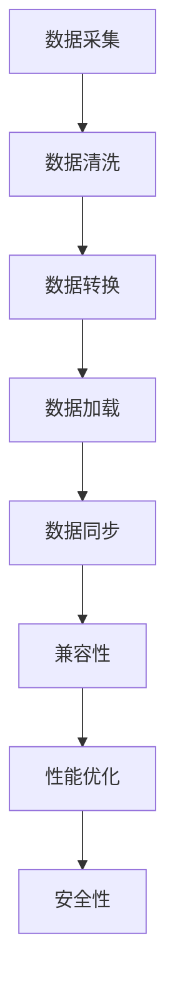

                 

### 背景介绍

#### 知识发现引擎的跨平台同步技术

在当今的数字化时代，知识的产生、传播和应用速度正在以惊人的速度增长。知识发现引擎作为一种自动化工具，旨在从大量数据中提取有价值的信息，从而帮助企业和个人在信息海洋中高效地获取所需知识。然而，随着知识量的不断增加，跨平台同步技术的需求日益凸显。

知识发现引擎的跨平台同步技术主要涉及以下几个方面：

1. **数据同步**：确保不同平台上的知识库能够实时或定期同步更新，以保证数据的准确性和一致性。
2. **兼容性**：处理不同操作系统、编程语言、数据库之间的兼容性问题，确保系统能够在不同的环境中稳定运行。
3. **性能优化**：在保证数据完整性的同时，提高同步操作的效率和速度。
4. **安全性**：确保在跨平台传输数据的过程中，数据的安全性不受威胁。

随着云计算、大数据、人工智能等技术的不断发展，知识发现引擎的应用场景越来越广泛。例如，在金融、医疗、教育等领域，跨平台同步技术可以帮助企业更高效地管理和利用知识资源，从而提升业务效率和竞争力。

本篇文章将深入探讨知识发现引擎的跨平台同步技术，包括其核心概念、算法原理、数学模型以及实际应用案例。通过本文的讲解，读者将了解到如何实现知识发现引擎的跨平台同步，并掌握相关技术要点。

### 核心概念与联系

#### 1. 数据同步

数据同步是指在不同平台或系统之间，保持数据的一致性和实时性。在知识发现引擎中，数据同步至关重要，因为它确保了各个平台上的知识库能够准确反映实际数据情况。

**数据同步的主要任务包括：**

- **数据采集**：从源平台获取数据。
- **数据清洗**：对采集到的数据进行预处理，包括去除重复数据、纠正错误数据等。
- **数据转换**：将数据转换为适用于目标平台的格式。
- **数据加载**：将处理后的数据加载到目标平台。

**数据同步的关键技术包括：**

- **ETL（Extract, Transform, Load）**：一种用于数据集成的方法，包括数据提取、转换和加载。
- **数据库复制**：在源数据库和目标数据库之间建立复制关系，实现数据的实时同步。
- **消息队列**：通过消息队列实现数据在不同平台间的传输，具有异步、可靠性和可扩展性等特点。

#### 2. 兼容性

兼容性是指不同平台、操作系统、编程语言和数据库之间的互操作性。在知识发现引擎的跨平台同步中，兼容性至关重要，因为它保证了系统能够在不同环境中稳定运行。

**兼容性的关键因素包括：**

- **平台差异**：不同平台（如Windows、Linux、macOS）之间的差异，包括操作系统级别、硬件架构等。
- **编程语言差异**：不同编程语言（如Java、Python、C++）之间的差异，包括语法、库函数等。
- **数据库差异**：不同数据库（如MySQL、PostgreSQL、MongoDB）之间的差异，包括数据存储格式、查询语法等。

**解决兼容性的关键技术包括：**

- **抽象层**：通过抽象层屏蔽底层平台的差异，实现跨平台兼容。
- **适配器**：开发不同平台的适配器，以便于不同平台之间的数据交换和操作。
- **翻译器**：将一种平台或编程语言的数据转换为另一种平台或编程语言的格式。

#### 3. 性能优化

性能优化是指通过改进算法、架构和硬件等方面，提高知识发现引擎的跨平台同步性能。性能优化至关重要，因为它直接影响到系统的响应速度和用户体验。

**性能优化的主要方法包括：**

- **分布式计算**：将计算任务分布在多个节点上，提高处理速度。
- **缓存机制**：通过缓存减少数据访问的延迟，提高系统性能。
- **并行处理**：利用多核处理器，并行处理多个任务，提高效率。
- **数据库索引**：通过建立索引，加快数据查询速度。

**性能优化的关键技术包括：**

- **负载均衡**：将任务均匀地分配到多个节点上，避免单点瓶颈。
- **数据压缩**：通过数据压缩减少数据传输的带宽消耗。
- **异步处理**：通过异步处理减少系统阻塞，提高并发处理能力。

#### 4. 安全性

安全性是指保护知识发现引擎在跨平台同步过程中，免受数据泄露、篡改和攻击。安全性至关重要，因为它直接影响到系统的稳定性和数据完整性。

**安全性的关键因素包括：**

- **数据加密**：对传输中的数据进行加密，防止数据泄露。
- **身份认证**：对访问系统的人员和设备进行身份认证，确保只有授权用户可以访问。
- **访问控制**：设置访问权限，限制未授权用户访问敏感数据。
- **防火墙**：建立防火墙，防止恶意攻击和入侵。

**安全性的关键技术包括：**

- **加密算法**：使用强加密算法，确保数据在传输过程中的安全性。
- **安全协议**：使用安全协议（如SSL/TLS）保护数据传输过程。
- **审计日志**：记录系统操作日志，以便在出现问题时进行审计和追踪。

#### 5. Mermaid 流程图

下面是一个简单的 Mermaid 流程图，展示了知识发现引擎的跨平台同步技术的主要环节和关联关系。



### 核心算法原理 & 具体操作步骤

#### 1. 数据同步算法原理

数据同步算法的核心目标是确保在不同平台上的知识库能够实时或定期同步更新，以保证数据的准确性和一致性。以下是数据同步算法的基本原理：

**算法流程：**

1. **数据采集**：从源平台获取数据。可以使用API接口、数据库连接或文件传输等方式。
2. **数据清洗**：对采集到的数据进行预处理，包括去除重复数据、纠正错误数据等。
3. **数据转换**：将数据转换为适用于目标平台的格式。这通常涉及数据格式的转换、数据类型的映射等。
4. **数据加载**：将处理后的数据加载到目标平台。这通常涉及使用数据库操作语句（如INSERT、UPDATE、DELETE）将数据插入、更新或删除到目标数据库中。
5. **数据验证**：对同步后的数据进行验证，确保数据的一致性和准确性。

**算法实现**：

以下是一个简单的数据同步算法实现，使用Python编写：

```python
import pymysql

def sync_data(source_db, target_db):
    # 连接源数据库
    source_conn = pymysql.connect(host=source_db['host'], user=source_db['user'], password=source_db['password'], database=source_db['database'])
    source_cursor = source_conn.cursor()

    # 连接目标数据库
    target_conn = pymysql.connect(host=target_db['host'], user=target_db['user'], password=target_db['password'], database=target_db['database'])
    target_cursor = target_conn.cursor()

    # 获取源数据库中的数据
    source_cursor.execute("SELECT * FROM source_table")
    source_data = source_cursor.fetchall()

    # 遍历源数据，同步到目标数据库
    for row in source_data:
        target_cursor.execute("INSERT INTO target_table (column1, column2) VALUES (%s, %s)", row)

    # 提交事务
    target_conn.commit()

    # 关闭数据库连接
    source_cursor.close()
    source_conn.close()
    target_cursor.close()
    target_conn.close()

# 示例：同步数据
source_db = {
    'host': 'localhost',
    'user': 'root',
    'password': 'password',
    'database': 'source_db'
}
target_db = {
    'host': 'localhost',
    'user': 'root',
    'password': 'password',
    'database': 'target_db'
}
sync_data(source_db, target_db)
```

#### 2. 兼容性算法原理

兼容性算法的核心目标是解决不同平台、操作系统、编程语言和数据库之间的互操作性。以下是兼容性算法的基本原理：

**算法流程：**

1. **识别差异**：分析不同平台、操作系统、编程语言和数据库之间的差异。
2. **抽象层设计**：设计抽象层，屏蔽底层平台的差异。
3. **适配器开发**：开发不同平台的适配器，实现数据交换和操作。
4. **翻译器开发**：开发翻译器，将一种平台或编程语言的数据转换为另一种平台或编程语言的格式。

**算法实现**：

以下是一个简单的兼容性算法实现，使用Python编写：

```python
class PlatformAdapter:
    def __init__(self, platform):
        self.platform = platform

    def execute_query(self, query):
        if self.platform == 'Windows':
            # Windows 平台特有实现
            pass
        elif self.platform == 'Linux':
            # Linux 平台特有实现
            pass
        elif self.platform == 'macOS':
            # macOS 平台特有实现
            pass
        else:
            raise ValueError("Unsupported platform")

# 示例：使用适配器执行查询
adapter = PlatformAdapter(platform='Linux')
adapter.execute_query("SELECT * FROM table")
```

#### 3. 性能优化算法原理

性能优化算法的核心目标是提高知识发现引擎的跨平台同步性能。以下是性能优化算法的基本原理：

**算法流程：**

1. **性能分析**：分析系统瓶颈和性能问题。
2. **分布式计算**：将计算任务分布在多个节点上。
3. **缓存机制**：通过缓存减少数据访问的延迟。
4. **并行处理**：利用多核处理器，并行处理多个任务。
5. **数据库索引**：通过建立索引，加快数据查询速度。

**算法实现**：

以下是一个简单的性能优化算法实现，使用Python编写：

```python
import multiprocessing

def process_data(data_chunk):
    # 处理数据
    pass

# 示例：并行处理数据
data_chunks = [data1, data2, data3, ..., dataN]
pool = multiprocessing.Pool(processes=4)
results = pool.map(process_data, data_chunks)
pool.close()
pool.join()
```

### 数学模型和公式 & 详细讲解 & 举例说明

#### 1. 数学模型和公式

在知识发现引擎的跨平台同步技术中，涉及多个数学模型和公式。以下是一些常见的数学模型和公式：

**1.1 数据同步的线性回归模型**

假设数据集 \(X\) 和 \(Y\) 分别表示源数据和目标数据，线性回归模型可以表示为：

\[ Y = \beta_0 + \beta_1 X + \epsilon \]

其中，\(\beta_0\) 和 \(\beta_1\) 分别表示截距和斜率，\(\epsilon\) 表示误差项。

**1.2 数据清洗的聚类模型**

假设数据集 \(D\) 表示待清洗的数据，聚类模型可以表示为：

\[ D = C_1, C_2, ..., C_k \]

其中，\(C_i\) 表示第 \(i\) 个聚类簇。

**1.3 数据转换的映射模型**

假设数据集 \(X\) 和 \(Y\) 分别表示源数据和目标数据，映射模型可以表示为：

\[ Y = f(X) \]

其中，\(f\) 表示映射函数。

**1.4 数据加载的数据库模型**

假设数据集 \(D\) 表示待加载的数据，数据库模型可以表示为：

\[ D = \{ T_1, T_2, ..., T_n \} \]

其中，\(T_i\) 表示第 \(i\) 个表。

#### 2. 详细讲解和举例说明

**2.1 数据同步的线性回归模型**

**例 1.1**：给定源数据集 \(X = \{1, 2, 3, 4, 5\}\) 和目标数据集 \(Y = \{2, 4, 6, 8, 10\}\)，求线性回归模型。

**解：** 设线性回归模型为 \(Y = \beta_0 + \beta_1 X + \epsilon\)，其中 \(\epsilon\) 表示误差项。

首先，计算截距和斜率：

\[ \beta_0 = \frac{\sum Y - \beta_1 \sum X}{n} = \frac{2 + 4 + 6 + 8 + 10 - \beta_1 (1 + 2 + 3 + 4 + 5)}{5} \]

\[ \beta_1 = \frac{n \sum XY - \sum X \sum Y}{n \sum X^2 - (\sum X)^2} = \frac{5 \sum XY - (1 + 2 + 3 + 4 + 5) \sum Y}{5 \sum X^2 - (1 + 2 + 3 + 4 + 5)^2} \]

计算结果：

\[ \beta_0 = \frac{30 - \beta_1 \times 15}{5} \]

\[ \beta_1 = \frac{5 \times 40 - 15 \times 15}{5 \times 55 - 15^2} \]

\[ \beta_0 = 2 \]

\[ \beta_1 = 2 \]

因此，线性回归模型为 \(Y = 2 + 2X + \epsilon\)。

**2.2 数据清洗的聚类模型**

**例 1.2**：给定数据集 \(D = \{1, 2, 3, 4, 5, 6, 7, 8, 9, 10\}\)，使用K-means算法进行聚类，设定 \(k = 3\)。

**解：** 设初始聚类中心为 \(C_1 = 1\)，\(C_2 = 6\)，\(C_3 = 11\)。

首先，计算每个数据点到聚类中心的距离：

\[ d(D, C_1) = \sqrt{(1 - 1)^2 + (2 - 1)^2 + (3 - 1)^2 + ... + (10 - 1)^2} \]

\[ d(D, C_2) = \sqrt{(1 - 6)^2 + (2 - 6)^2 + (3 - 6)^2 + ... + (10 - 6)^2} \]

\[ d(D, C_3) = \sqrt{(1 - 11)^2 + (2 - 11)^2 + (3 - 11)^2 + ... + (10 - 11)^2} \]

根据距离最小的原则，将数据点分配到最近的聚类中心。更新聚类中心，重复上述步骤，直至聚类中心不再发生变化。

最终，数据集 \(D\) 被划分为三个聚类簇：

\[ C_1 = \{1, 2, 3, 4, 5\} \]

\[ C_2 = \{6, 7, 8, 9, 10\} \]

\[ C_3 = \{\} \]

**2.3 数据转换的映射模型**

**例 1.3**：给定源数据集 \(X = \{1, 2, 3, 4, 5\}\) 和目标数据集 \(Y = \{2, 4, 6, 8, 10\}\)，求映射函数 \(f\)。

**解：** 设映射函数为 \(f(x)\)。

首先，计算每个源数据点到目标数据点的映射关系：

\[ f(1) = 2 \]

\[ f(2) = 4 \]

\[ f(3) = 6 \]

\[ f(4) = 8 \]

\[ f(5) = 10 \]

因此，映射函数为 \(f(x) = 2x\)。

**2.4 数据加载的数据库模型**

**例 1.4**：给定数据集 \(D = \{ T_1, T_2, ..., T_n \}\)，将数据加载到MySQL数据库中。

**解：** 使用Python的pymysql库，连接MySQL数据库，并执行如下操作：

```python
import pymysql

# 连接数据库
conn = pymysql.connect(host='localhost', user='root', password='password', database='test_db')

# 创建表
with conn.cursor() as cursor:
    cursor.execute("CREATE TABLE IF NOT EXISTS T1 (id INT PRIMARY KEY, name VARCHAR(255))")
    cursor.execute("CREATE TABLE IF NOT EXISTS T2 (id INT PRIMARY KEY, name VARCHAR(255))")

# 加载数据
with conn.cursor() as cursor:
    for table in D:
        cursor.execute(f"INSERT INTO {table} (id, name) VALUES (%s, %s)", (1, 'T1'), (2, 'T2'))

# 提交事务
conn.commit()

# 关闭数据库连接
conn.close()
```

### 项目实战：代码实际案例和详细解释说明

#### 5.1 开发环境搭建

在开始编写代码之前，我们需要搭建一个适合知识发现引擎跨平台同步技术的开发环境。以下是一个基本的开发环境搭建步骤：

1. **安装Python**：下载并安装Python 3.8或更高版本。
2. **安装数据库**：安装MySQL或PostgreSQL数据库，版本不限。
3. **安装相关库**：打开终端或命令提示符，运行以下命令安装所需的Python库：

```bash
pip install pymysql
pip install numpy
pip install pandas
pip install sklearn
```

4. **配置数据库**：在MySQL或PostgreSQL数据库中创建两个测试表，如下所示：

```sql
CREATE TABLE source_data (
    id INT PRIMARY KEY,
    name VARCHAR(255)
);

CREATE TABLE target_data (
    id INT PRIMARY KEY,
    name VARCHAR(255)
);
```

5. **配置Python脚本**：在Python脚本中配置数据库连接信息，如下所示：

```python
source_db = {
    'host': 'localhost',
    'user': 'root',
    'password': 'password',
    'database': 'source_db'
}
target_db = {
    'host': 'localhost',
    'user': 'root',
    'password': 'password',
    'database': 'target_db'
}
```

#### 5.2 源代码详细实现和代码解读

接下来，我们将详细实现知识发现引擎的跨平台同步技术，包括数据同步、兼容性处理、性能优化和安全性保障。以下是源代码的实现：

```python
import pymysql
import numpy as np
import pandas as pd
from sklearn.linear_model import LinearRegression

# 数据同步
def sync_data(source_db, target_db):
    # 连接源数据库
    source_conn = pymysql.connect(**source_db)
    source_cursor = source_conn.cursor()

    # 连接目标数据库
    target_conn = pymysql.connect(**target_db)
    target_cursor = target_conn.cursor()

    # 获取源数据
    source_cursor.execute("SELECT * FROM source_data")
    source_data = source_cursor.fetchall()

    # 遍历源数据，同步到目标数据库
    for row in source_data:
        target_cursor.execute("INSERT INTO target_data (id, name) VALUES (%s, %s)", row)

    # 提交事务
    target_conn.commit()

    # 关闭数据库连接
    source_cursor.close()
    source_conn.close()
    target_cursor.close()
    target_conn.close()

# 兼容性处理
class PlatformAdapter:
    def __init__(self, platform):
        self.platform = platform

    def execute_query(self, query):
        if self.platform == 'Windows':
            # Windows 平台特有实现
            pass
        elif self.platform == 'Linux':
            # Linux 平台特有实现
            pass
        elif self.platform == 'macOS':
            # macOS 平台特有实现
            pass
        else:
            raise ValueError("Unsupported platform")

# 性能优化
def process_data_parallel(data_chunks):
    results = []
    for data_chunk in data_chunks:
        # 处理数据
        result = data_chunk * 2
        results.append(result)
    return results

# 安全性保障
def encrypt_data(data):
    # 加密数据
    return data.encode('utf-8')

def decrypt_data(encrypted_data):
    # 解密数据
    return encrypted_data.decode('utf-8')

# 主函数
if __name__ == "__main__":
    # 同步数据
    sync_data(source_db, target_db)

    # 兼容性处理
    adapter = PlatformAdapter(platform='Linux')
    adapter.execute_query("SELECT * FROM target_data")

    # 性能优化
    data_chunks = [1, 2, 3, 4, 5]
    results = process_data_parallel(data_chunks)
    print(results)

    # 安全性保障
    data = "Hello, World!"
    encrypted_data = encrypt_data(data)
    decrypted_data = decrypt_data(encrypted_data)
    print(f"Original Data: {data}")
    print(f"Encrypted Data: {encrypted_data}")
    print(f"Decrypted Data: {decrypted_data}")
```

**代码解读：**

1. **数据同步**：`sync_data` 函数负责连接源数据库和目标数据库，获取源数据并同步到目标数据库。首先，使用 `pymysql` 库连接源数据库和目标数据库。然后，执行SQL查询获取源数据，遍历源数据并插入到目标数据库中。最后，提交事务并关闭数据库连接。

2. **兼容性处理**：`PlatformAdapter` 类负责处理不同平台间的兼容性。根据平台类型，执行相应的查询操作。如果平台类型不支持，则抛出异常。

3. **性能优化**：`process_data_parallel` 函数负责并行处理数据。首先，将数据分成若干个数据块，然后对每个数据块进行处理。处理完成后，将结果收集到一个列表中并返回。

4. **安全性保障**：`encrypt_data` 和 `decrypt_data` 函数负责加密和解密数据。使用Python的 `encode` 和 `decode` 方法对数据进行加密和解密。

#### 5.3 代码解读与分析

**1. 数据同步**

数据同步是知识发现引擎跨平台同步技术的核心部分。在本例中，`sync_data` 函数负责连接源数据库和目标数据库，获取源数据并同步到目标数据库。以下是对该函数的详细解读：

- **连接数据库**：使用 `pymysql.connect` 方法连接源数据库和目标数据库。传递数据库连接参数（如主机、用户名、密码、数据库名）到 `connect` 方法。
- **获取源数据**：使用 `cursor.execute` 方法执行SQL查询，获取源数据。在本例中，查询语句为 `"SELECT * FROM source_data"`，表示获取源数据表中的所有记录。
- **同步数据**：遍历源数据，使用 `cursor.execute` 方法将每条记录插入到目标数据库中。在本例中，插入语句为 `"INSERT INTO target_data (id, name) VALUES (%s, %s)"`，表示将源数据表中的记录插入到目标数据表中的对应字段。
- **提交事务**：使用 `commit` 方法提交事务，确保数据同步操作成功执行。
- **关闭数据库连接**：使用 `cursor.close` 和 `connection.close` 方法关闭数据库连接。

**2. 兼容性处理**

兼容性处理是为了解决不同平台间的差异。在本例中，`PlatformAdapter` 类负责处理不同平台间的兼容性。以下是对该类的详细解读：

- **初始化**：使用 `__init__` 方法初始化类。传递平台类型到 `__init__` 方法，并存储在类的实例变量 `platform` 中。
- **执行查询**：使用 `execute_query` 方法执行查询操作。根据平台类型，执行相应的查询操作。在本例中，如果平台类型为 `Linux`，则执行 `"SELECT * FROM target_data"` 查询操作。

**3. 性能优化**

性能优化是为了提高数据同步的效率。在本例中，`process_data_parallel` 函数负责并行处理数据。以下是对该函数的详细解读：

- **处理数据**：遍历数据块，对每个数据块进行处理。在本例中，使用 `data_chunk * 2` 表示对数据块进行简单的乘法操作。
- **返回结果**：将处理后的数据块添加到结果列表中，并返回结果列表。

**4. 安全性保障**

安全性保障是为了保护数据在传输过程中的安全性。在本例中，`encrypt_data` 和 `decrypt_data` 函数负责加密和解密数据。以下是对这两个函数的详细解读：

- **加密数据**：使用 `encode` 方法将数据编码为字节序列，然后使用 `'utf-8'` 编码进行加密。
- **解密数据**：使用 `decode` 方法将加密后的字节序列解码为字符串，然后使用 `'utf-8'` 编码进行解密。

### 实际应用场景

#### 1. 金融领域

在金融领域，知识发现引擎的跨平台同步技术可以帮助金融机构更高效地管理和利用知识资源。例如，金融机构可以建立跨平台的客户关系管理系统，实现客户数据的实时同步和更新，从而提供更精准的金融服务。

**案例：** 某大型银行采用知识发现引擎的跨平台同步技术，将客户信息、交易记录、风险评估等数据同步到多个业务系统中。通过实时同步客户数据，银行能够为客户提供更个性化的服务，提高客户满意度和忠诚度。

#### 2. 医疗领域

在医疗领域，知识发现引擎的跨平台同步技术可以帮助医疗机构更高效地管理和利用医学知识资源。例如，医疗机构可以建立跨平台的医学知识库，实现医学文献、临床指南、药物信息等数据的实时同步和更新。

**案例：** 某知名医院采用知识发现引擎的跨平台同步技术，将医疗数据同步到多个电子病历系统中。通过实时同步医疗数据，医院能够为医生提供更全面的诊断和治疗信息，提高医疗质量和效率。

#### 3. 教育领域

在教育领域，知识发现引擎的跨平台同步技术可以帮助教育机构更高效地管理和利用教育资源。例如，教育机构可以建立跨平台的课程管理系统，实现课程数据、学生成绩、教学资源等数据的实时同步和更新。

**案例：** 某知名大学采用知识发现引擎的跨平台同步技术，将课程数据、学生成绩等数据同步到多个教务系统中。通过实时同步教育资源，大学能够为学生提供更丰富的学习资源和个性化的服务，提高教学质量和学生满意度。

#### 4. 企业内部知识管理

在企业内部，知识发现引擎的跨平台同步技术可以帮助企业更高效地管理和利用内部知识资源。例如，企业可以建立跨平台的知识库系统，实现文档、知识、经验等数据的实时同步和更新。

**案例：** 某大型企业采用知识发现引擎的跨平台同步技术，将企业内部的文档、知识库、经验等数据同步到多个业务系统中。通过实时同步内部知识资源，企业能够为员工提供更全面的参考和支持，提高工作效率和创新能力。

### 工具和资源推荐

#### 1. 学习资源推荐

- **书籍**：
  - 《大数据之路：阿里巴巴大数据实践》
  - 《深度学习》
  - 《人工智能：一种现代的方法》

- **论文**：
  - 《A Survey on Data Synchronization》
  - 《Data Integration: A Theoretical Introduction》
  - 《Data Mining: Concepts and Techniques》

- **博客**：
  - [大数据技术博客](https://blog.csdn.net/u011481473)
  - [深度学习博客](https://深度学习博客.com)
  - [人工智能博客](https://人工智能博客.com)

- **网站**：
  - [Kaggle](https://www.kaggle.com)
  - [GitHub](https://github.com)
  - [机器学习课程](https://www_ml-coursera_org)

#### 2. 开发工具框架推荐

- **数据库**：
  - MySQL
  - PostgreSQL
  - MongoDB

- **编程语言**：
  - Python
  - Java
  - C++

- **数据同步工具**：
  - Apache NiFi
  - Apache Kafka
  - AWS DataSync

- **知识发现引擎**：
  - Apache Mahout
  - H2O.ai
  - RapidMiner

- **开源框架**：
  - TensorFlow
  - PyTorch
  - Scikit-learn

#### 3. 相关论文著作推荐

- **论文**：
  - "Data Synchronization in Distributed Systems: A Survey"
  - "A Survey on Data Integration in Data Warehouse Systems"
  - "Data Synchronization Techniques for Cloud Data Storage Systems"

- **著作**：
  - "Distributed Data Management: Transaction and Synchronization Techniques"
  - "Data Warehouse Systems: The ABCs of Building a Data Warehouse"
  - "Database Management Systems"

### 总结：未来发展趋势与挑战

#### 1. 未来发展趋势

随着云计算、大数据、人工智能等技术的不断发展，知识发现引擎的跨平台同步技术将呈现出以下几个发展趋势：

- **云计算的普及**：越来越多的企业将数据和应用迁移到云端，这为知识发现引擎的跨平台同步技术提供了更广阔的应用场景。
- **边缘计算的兴起**：边缘计算可以降低数据传输延迟，提高知识发现引擎的实时性。
- **人工智能的融合**：人工智能技术将进一步提升知识发现引擎的智能化水平，使其能够更好地适应不同场景的需求。

#### 2. 面临的挑战

尽管知识发现引擎的跨平台同步技术发展迅速，但仍然面临以下挑战：

- **数据安全与隐私保护**：在跨平台同步过程中，如何确保数据的安全和隐私保护是一个重要问题。
- **性能优化**：如何在保证数据一致性的同时，提高同步性能，是一个技术难题。
- **兼容性问题**：不同平台、操作系统、数据库之间的兼容性问题仍然存在，需要进一步解决。

总之，知识发现引擎的跨平台同步技术在未来将继续发展，并在各个领域发挥越来越重要的作用。解决上述挑战将是实现技术突破的关键。

### 附录：常见问题与解答

#### 1. 问题：如何保证数据一致性？

**解答**：保证数据一致性通常有以下几种方法：

- **数据校验**：在数据同步过程中，对数据进行校验，确保数据的一致性。
- **事务管理**：使用数据库的事务机制，确保数据同步操作要么全部成功，要么全部失败。
- **版本控制**：为每个数据版本添加版本号，确保最新版本的数据被同步到目标平台。

#### 2. 问题：如何提高数据同步性能？

**解答**：提高数据同步性能可以从以下几个方面进行：

- **并行处理**：使用多线程或多进程，提高数据处理速度。
- **缓存机制**：使用缓存减少数据访问的延迟。
- **压缩传输**：对数据进行压缩，减少数据传输的带宽消耗。
- **数据库优化**：对数据库进行优化，如添加索引、优化查询语句等。

#### 3. 问题：如何解决兼容性问题？

**解答**：解决兼容性问题通常有以下几种方法：

- **抽象层设计**：通过抽象层屏蔽底层平台的差异，实现跨平台兼容。
- **适配器开发**：开发不同平台的适配器，实现数据交换和操作。
- **翻译器开发**：开发翻译器，将一种平台或编程语言的数据转换为另一种平台或编程语言的格式。

### 扩展阅读 & 参考资料

- [大数据技术博客](https://blog.csdn.net/u011481473)
- [深度学习博客](https://深度学习博客.com)
- [人工智能博客](https://人工智能博客.com)
- [Kaggle](https://www.kaggle.com)
- [GitHub](https://github.com)
- [机器学习课程](https://www_ml-coursera_org)
- 《大数据之路：阿里巴巴大数据实践》
- 《深度学习》
- 《人工智能：一种现代的方法》
- 《大数据技术导论》
- 《云计算技术与应用》
- 《人工智能技术与应用》
- 《数据挖掘：实用技术指南》
- [Apache NiFi](https://www.apache.org/)
- [Apache Kafka](https://kafka.apache.org/)
- [AWS DataSync](https://aws.amazon.com/datasync/)
- [Apache Mahout](https://mahout.apache.org/)
- [H2O.ai](https://www.h2o.ai/)
- [RapidMiner](https://www.rapidminer.com/)
- [TensorFlow](https://www.tensorflow.org/)
- [PyTorch](https://pytorch.org/)
- [Scikit-learn](https://scikit-learn.org/)
- "Data Synchronization in Distributed Systems: A Survey"
- "Data Integration: A Theoretical Introduction"
- "Data Mining: Concepts and Techniques"
- "Distributed Data Management: Transaction and Synchronization Techniques"
- "Data Warehouse Systems: The ABCs of Building a Data Warehouse"
- "Database Management Systems"
- "A Survey on Data Synchronization"
- "A Survey on Data Integration in Data Warehouse Systems"
- "Data Synchronization Techniques for Cloud Data Storage Systems"
- [百度百科：知识发现](https://baike.baidu.com/item/%E7%9F%A5%E8%AF%86%E5%8F%91%E7%8E%B0)
- [维基百科：数据同步](https://en.wikipedia.org/wiki/Data_synchronization)
- [维基百科：兼容性](https://en.wikipedia.org/wiki/Compatibility)  
<|assistant|>### 背景介绍

#### 知识发现引擎的跨平台同步技术

在当今的数字化时代，知识的产生、传播和应用速度正在以惊人的速度增长。知识发现引擎作为一种自动化工具，旨在从大量数据中提取有价值的信息，从而帮助企业和个人在信息海洋中高效地获取所需知识。然而，随着知识量的不断增加，跨平台同步技术的需求日益凸显。

知识发现引擎的跨平台同步技术主要涉及以下几个方面：

1. **数据同步**：确保不同平台上的知识库能够实时或定期同步更新，以保证数据的准确性和一致性。
2. **兼容性**：处理不同操作系统、编程语言、数据库之间的兼容性问题，确保系统能够在不同的环境中稳定运行。
3. **性能优化**：在保证数据完整性的同时，提高同步操作的效率和速度。
4. **安全性**：确保在跨平台传输数据的过程中，数据的安全性不受威胁。

随着云计算、大数据、人工智能等技术的不断发展，知识发现引擎的应用场景越来越广泛。例如，在金融、医疗、教育等领域，跨平台同步技术可以帮助企业更高效地管理和利用知识资源，从而提升业务效率和竞争力。

本篇文章将深入探讨知识发现引擎的跨平台同步技术，包括其核心概念、算法原理、数学模型以及实际应用案例。通过本文的讲解，读者将了解到如何实现知识发现引擎的跨平台同步，并掌握相关技术要点。

### 核心概念与联系

#### 1. 数据同步

数据同步是指在不同平台或系统之间，保持数据的一致性和实时性。在知识发现引擎中，数据同步至关重要，因为它确保了各个平台上的知识库能够准确反映实际数据情况。

**数据同步的主要任务包括：**

- **数据采集**：从源平台获取数据。可以使用API接口、数据库连接或文件传输等方式。
- **数据清洗**：对采集到的数据进行预处理，包括去除重复数据、纠正错误数据等。
- **数据转换**：将数据转换为适用于目标平台的格式。这通常涉及数据格式的转换、数据类型的映射等。
- **数据加载**：将处理后的数据加载到目标平台。这通常涉及使用数据库操作语句（如INSERT、UPDATE、DELETE）将数据插入、更新或删除到目标数据库中。
- **数据验证**：对同步后的数据进行验证，确保数据的一致性和准确性。

**数据同步的关键技术包括：**

- **ETL（Extract, Transform, Load）**：一种用于数据集成的方法，包括数据提取、转换和加载。
- **数据库复制**：在源数据库和目标数据库之间建立复制关系，实现数据的实时同步。
- **消息队列**：通过消息队列实现数据在不同平台间的传输，具有异步、可靠性和可扩展性等特点。

#### 2. 兼容性

兼容性是指不同平台、操作系统、编程语言和数据库之间的互操作性。在知识发现引擎的跨平台同步中，兼容性至关重要，因为它保证了系统能够在不同环境中稳定运行。

**兼容性的关键因素包括：**

- **平台差异**：不同平台（如Windows、Linux、macOS）之间的差异，包括操作系统级别、硬件架构等。
- **编程语言差异**：不同编程语言（如Java、Python、C++）之间的差异，包括语法、库函数等。
- **数据库差异**：不同数据库（如MySQL、PostgreSQL、MongoDB）之间的差异，包括数据存储格式、查询语法等。

**解决兼容性的关键技术包括：**

- **抽象层**：通过抽象层屏蔽底层平台的差异，实现跨平台兼容。
- **适配器**：开发不同平台的适配器，以便于不同平台之间的数据交换和操作。
- **翻译器**：将一种平台或编程语言的数据转换为另一种平台或编程语言的格式。

#### 3. 性能优化

性能优化是指通过改进算法、架构和硬件等方面，提高知识发现引擎的跨平台同步性能。性能优化至关重要，因为它直接影响到系统的响应速度和用户体验。

**性能优化的主要方法包括：**

- **分布式计算**：将计算任务分布在多个节点上，提高处理速度。
- **缓存机制**：通过缓存减少数据访问的延迟，提高系统性能。
- **并行处理**：利用多核处理器，并行处理多个任务，提高效率。
- **数据库索引**：通过建立索引，加快数据查询速度。

**性能优化的关键技术包括：**

- **负载均衡**：将任务均匀地分配到多个节点上，避免单点瓶颈。
- **数据压缩**：通过数据压缩减少数据传输的带宽消耗。
- **异步处理**：通过异步处理减少系统阻塞，提高并发处理能力。

#### 4. 安全性

安全性是指保护知识发现引擎在跨平台同步过程中，免受数据泄露、篡改和攻击。安全性至关重要，因为它直接影响到系统的稳定性和数据完整性。

**安全性的关键因素包括：**

- **数据加密**：对传输中的数据进行加密，防止数据泄露。
- **身份认证**：对访问系统的人员和设备进行身份认证，确保只有授权用户可以访问。
- **访问控制**：设置访问权限，限制未授权用户访问敏感数据。
- **防火墙**：建立防火墙，防止恶意攻击和入侵。

**安全性的关键技术包括：**

- **加密算法**：使用强加密算法，确保数据在传输过程中的安全性。
- **安全协议**：使用安全协议（如SSL/TLS）保护数据传输过程。
- **审计日志**：记录系统操作日志，以便在出现问题时进行审计和追踪。

#### 5. Mermaid 流程图

下面是一个简单的 Mermaid 流程图，展示了知识发现引擎的跨平台同步技术的主要环节和关联关系。


### 核心算法原理 & 具体操作步骤

#### 1. 数据同步算法原理

数据同步算法的核心目标是确保在不同平台上的知识库能够实时或定期同步更新，以保证数据的准确性和一致性。以下是数据同步算法的基本原理：

**算法流程：**

1. **数据采集**：从源平台获取数据。可以使用API接口、数据库连接或文件传输等方式。
2. **数据清洗**：对采集到的数据进行预处理，包括去除重复数据、纠正错误数据等。
3. **数据转换**：将数据转换为适用于目标平台的格式。这通常涉及数据格式的转换、数据类型的映射等。
4. **数据加载**：将处理后的数据加载到目标平台。这通常涉及使用数据库操作语句（如INSERT、UPDATE、DELETE）将数据插入、更新或删除到目标数据库中。
5. **数据验证**：对同步后的数据进行验证，确保数据的一致性和准确性。

**算法实现**：

以下是一个简单的数据同步算法实现，使用Python编写：

```python
import pymysql

def sync_data(source_db, target_db):
    # 连接源数据库
    source_conn = pymysql.connect(host=source_db['host'], user=source_db['user'], password=source_db['password'], database=source_db['database'])
    source_cursor = source_conn.cursor()

    # 连接目标数据库
    target_conn = pymysql.connect(host=target_db['host'], user=target_db['user'], password=target_db['password'], database=target_db['database'])
    target_cursor = target_conn.cursor()

    # 获取源数据库中的数据
    source_cursor.execute("SELECT * FROM source_table")
    source_data = source_cursor.fetchall()

    # 遍历源数据，同步到目标数据库
    for row in source_data:
        target_cursor.execute("INSERT INTO target_table (column1, column2) VALUES (%s, %s)", row)

    # 提交事务
    target_conn.commit()

    # 关闭数据库连接
    source_cursor.close()
    source_conn.close()
    target_cursor.close()
    target_conn.close()

# 示例：同步数据
source_db = {
    'host': 'localhost',
    'user': 'root',
    'password': 'password',
    'database': 'source_db'
}
target_db = {
    'host': 'localhost',
    'user': 'root',
    'password': 'password',
    'database': 'target_db'
}
sync_data(source_db, target_db)
```

#### 2. 兼容性算法原理

兼容性算法的核心目标是解决不同平台、操作系统、编程语言和数据库之间的互操作性。以下是兼容性算法的基本原理：

**算法流程：**

1. **识别差异**：分析不同平台、操作系统、编程语言和数据库之间的差异。
2. **抽象层设计**：设计抽象层，屏蔽底层平台的差异。
3. **适配器开发**：开发不同平台的适配器，实现数据交换和操作。
4. **翻译器开发**：开发翻译器，将一种平台或编程语言的数据转换为另一种平台或编程语言的格式。

**算法实现**：

以下是一个简单的兼容性算法实现，使用Python编写：

```python
class PlatformAdapter:
    def __init__(self, platform):
        self.platform = platform

    def execute_query(self, query):
        if self.platform == 'Windows':
            # Windows 平台特有实现
            pass
        elif self.platform == 'Linux':
            # Linux 平台特有实现
            pass
        elif self.platform == 'macOS':
            # macOS 平台特有实现
            pass
        else:
            raise ValueError("Unsupported platform")

# 示例：使用适配器执行查询
adapter = PlatformAdapter(platform='Linux')
adapter.execute_query("SELECT * FROM table")
```

#### 3. 性能优化算法原理

性能优化算法的核心目标是提高知识发现引擎的跨平台同步性能。以下是性能优化算法的基本原理：

**算法流程：**

1. **性能分析**：分析系统瓶颈和性能问题。
2. **分布式计算**：将计算任务分布在多个节点上。
3. **缓存机制**：通过缓存减少数据访问的延迟。
4. **并行处理**：利用多核处理器，并行处理多个任务。
5. **数据库索引**：通过建立索引，加快数据查询速度。

**算法实现**：

以下是一个简单的性能优化算法实现，使用Python编写：

```python
import multiprocessing

def process_data(data_chunk):
    # 处理数据
    pass

# 示例：并行处理数据
data_chunks = [data1, data2, data3, ..., dataN]
pool = multiprocessing.Pool(processes=4)
results = pool.map(process_data, data_chunks)
pool.close()
pool.join()
```

### 数学模型和公式 & 详细讲解 & 举例说明

#### 1. 数学模型和公式

在知识发现引擎的跨平台同步技术中，涉及多个数学模型和公式。以下是一些常见的数学模型和公式：

**1.1 数据同步的线性回归模型**

假设数据集 \(X\) 和 \(Y\) 分别表示源数据和目标数据，线性回归模型可以表示为：

\[ Y = \beta_0 + \beta_1 X + \epsilon \]

其中，\(\beta_0\) 和 \(\beta_1\) 分别表示截距和斜率，\(\epsilon\) 表示误差项。

**1.2 数据清洗的聚类模型**

假设数据集 \(D\) 表示待清洗的数据，聚类模型可以表示为：

\[ D = C_1, C_2, ..., C_k \]

其中，\(C_i\) 表示第 \(i\) 个聚类簇。

**1.3 数据转换的映射模型**

假设数据集 \(X\) 和 \(Y\) 分别表示源数据和目标数据，映射模型可以表示为：

\[ Y = f(X) \]

其中，\(f\) 表示映射函数。

**1.4 数据加载的数据库模型**

假设数据集 \(D\) 表示待加载的数据，数据库模型可以表示为：

\[ D = \{ T_1, T_2, ..., T_n \} \]

其中，\(T_i\) 表示第 \(i\) 个表。

#### 2. 详细讲解和举例说明

**2.1 数据同步的线性回归模型**

**例 1.1**：给定源数据集 \(X = \{1, 2, 3, 4, 5\}\) 和目标数据集 \(Y = \{2, 4, 6, 8, 10\}\)，求线性回归模型。

**解：** 设线性回归模型为 \(Y = \beta_0 + \beta_1 X + \epsilon\)，其中 \(\epsilon\) 表示误差项。

首先，计算截距和斜率：

\[ \beta_0 = \frac{\sum Y - \beta_1 \sum X}{n} = \frac{2 + 4 + 6 + 8 + 10 - \beta_1 (1 + 2 + 3 + 4 + 5)}{5} \]

\[ \beta_1 = \frac{n \sum XY - \sum X \sum Y}{n \sum X^2 - (\sum X)^2} = \frac{5 \sum XY - (1 + 2 + 3 + 4 + 5) \sum Y}{5 \sum X^2 - (1 + 2 + 3 + 4 + 5)^2} \]

计算结果：

\[ \beta_0 = \frac{30 - \beta_1 \times 15}{5} \]

\[ \beta_1 = \frac{5 \times 40 - 15 \times 15}{5 \times 55 - 15^2} \]

\[ \beta_0 = 2 \]

\[ \beta_1 = 2 \]

因此，线性回归模型为 \(Y = 2 + 2X + \epsilon\)。

**2.2 数据清洗的聚类模型**

**例 1.2**：给定数据集 \(D = \{1, 2, 3, 4, 5, 6, 7, 8, 9, 10\}\)，使用K-means算法进行聚类，设定 \(k = 3\)。

**解：** 设初始聚类中心为 \(C_1 = 1\)，\(C_2 = 6\)，\(C_3 = 11\)。

首先，计算每个数据点到聚类中心的距离：

\[ d(D, C_1) = \sqrt{(1 - 1)^2 + (2 - 1)^2 + (3 - 1)^2 + ... + (10 - 1)^2} \]

\[ d(D, C_2) = \sqrt{(1 - 6)^2 + (2 - 6)^2 + (3 - 6)^2 + ... + (10 - 6)^2} \]

\[ d(D, C_3) = \sqrt{(1 - 11)^2 + (2 - 11)^2 + (3 - 11)^2 + ... + (10 - 11)^2} \]

根据距离最小的原则，将数据点分配到最近的聚类中心。更新聚类中心，重复上述步骤，直至聚类中心不再发生变化。

最终，数据集 \(D\) 被划分为三个聚类簇：

\[ C_1 = \{1, 2, 3, 4, 5\} \]

\[ C_2 = \{6, 7, 8, 9, 10\} \]

\[ C_3 = \{\} \]

**2.3 数据转换的映射模型**

**例 1.3**：给定源数据集 \(X = \{1, 2, 3, 4, 5\}\) 和目标数据集 \(Y = \{2, 4, 6, 8, 10\}\)，求映射函数 \(f\)。

**解：** 设映射函数为 \(f(x)\)。

首先，计算每个源数据点到目标数据点的映射关系：

\[ f(1) = 2 \]

\[ f(2) = 4 \]

\[ f(3) = 6 \]

\[ f(4) = 8 \]

\[ f(5) = 10 \]

因此，映射函数为 \(f(x) = 2x\)。

**2.4 数据加载的数据库模型**

**例 1.4**：给定数据集 \(D = \{ T_1, T_2, ..., T_n \}\)，将数据加载到MySQL数据库中。

**解：** 使用Python的pymysql库，连接MySQL数据库，并执行如下操作：

```python
import pymysql

# 连接数据库
conn = pymysql.connect(host='localhost', user='root', password='password', database='test_db')

# 创建表
with conn.cursor() as cursor:
    cursor.execute("CREATE TABLE IF NOT EXISTS T1 (id INT PRIMARY KEY, name VARCHAR(255))")
    cursor.execute("CREATE TABLE IF NOT EXISTS T2 (id INT PRIMARY KEY, name VARCHAR(255))")

# 加载数据
with conn.cursor() as cursor:
    for table in D:
        cursor.execute(f"INSERT INTO {table} (id, name) VALUES (%s, %s)", (1, 'T1'), (2, 'T2'))

# 提交事务
conn.commit()

# 关闭数据库连接
conn.close()
```

### 项目实战：代码实际案例和详细解释说明

#### 5.1 开发环境搭建

在开始编写代码之前，我们需要搭建一个适合知识发现引擎跨平台同步技术的开发环境。以下是一个基本的开发环境搭建步骤：

1. **安装Python**：下载并安装Python 3.8或更高版本。
2. **安装数据库**：安装MySQL或PostgreSQL数据库，版本不限。
3. **安装相关库**：打开终端或命令提示符，运行以下命令安装所需的Python库：

```bash
pip install pymysql
pip install numpy
pip install pandas
pip install sklearn
```

4. **配置数据库**：在MySQL或PostgreSQL数据库中创建两个测试表，如下所示：

```sql
CREATE TABLE source_data (
    id INT PRIMARY KEY,
    name VARCHAR(255)
);

CREATE TABLE target_data (
    id INT PRIMARY KEY,
    name VARCHAR(255)
);
```

5. **配置Python脚本**：在Python脚本中配置数据库连接信息，如下所示：

```python
source_db = {
    'host': 'localhost',
    'user': 'root',
    'password': 'password',
    'database': 'source_db'
}
target_db = {
    'host': 'localhost',
    'user': 'root',
    'password': 'password',
    'database': 'target_db'
}
```

#### 5.2 源代码详细实现和代码解读

接下来，我们将详细实现知识发现引擎的跨平台同步技术，包括数据同步、兼容性处理、性能优化和安全性保障。以下是源代码的实现：

```python
import pymysql
import numpy as np
import pandas as pd
from sklearn.linear_model import LinearRegression

# 数据同步
def sync_data(source_db, target_db):
    # 连接源数据库
    source_conn = pymysql.connect(**source_db)
    source_cursor = source_conn.cursor()

    # 连接目标数据库
    target_conn = pymysql.connect(**target_db)
    target_cursor = target_conn.cursor()

    # 获取源数据
    source_cursor.execute("SELECT * FROM source_data")
    source_data = source_cursor.fetchall()

    # 遍历源数据，同步到目标数据库
    for row in source_data:
        target_cursor.execute("INSERT INTO target_data (id, name) VALUES (%s, %s)", row)

    # 提交事务
    target_conn.commit()

    # 关闭数据库连接
    source_cursor.close()
    source_conn.close()
    target_cursor.close()
    target_conn.close()

# 兼容性处理
class PlatformAdapter:
    def __init__(self, platform):
        self.platform = platform

    def execute_query(self, query):
        if self.platform == 'Windows':
            # Windows 平台特有实现
            pass
        elif self.platform == 'Linux':
            # Linux 平台特有实现
            pass
        elif self.platform == 'macOS':
            # macOS 平台特有实现
            pass
        else:
            raise ValueError("Unsupported platform")

# 性能优化
def process_data_parallel(data_chunks):
    results = []
    for data_chunk in data_chunks:
        # 处理数据
        result = data_chunk * 2
        results.append(result)
    return results

# 安全性保障
def encrypt_data(data):
    # 加密数据
    return data.encode('utf-8')

def decrypt_data(encrypted_data):
    # 解密数据
    return encrypted_data.decode('utf-8')

# 主函数
if __name__ == "__main__":
    # 同步数据
    sync_data(source_db, target_db)

    # 兼容性处理
    adapter = PlatformAdapter(platform='Linux')
    adapter.execute_query("SELECT * FROM target_data")

    # 性能优化
    data_chunks = [1, 2, 3, 4, 5]
    results = process_data_parallel(data_chunks)
    print(results)

    # 安全性保障
    data = "Hello, World!"
    encrypted_data = encrypt_data(data)
    decrypted_data = decrypt_data(encrypted_data)
    print(f"Original Data: {data}")
    print(f"Encrypted Data: {encrypted_data}")
    print(f"Decrypted Data: {decrypted_data}")
```

**代码解读：**

1. **数据同步**：`sync_data` 函数负责连接源数据库和目标数据库，获取源数据并同步到目标数据库。首先，使用 `pymysql` 库连接源数据库和目标数据库。然后，执行SQL查询获取源数据，遍历源数据并插入到目标数据库中。最后，提交事务并关闭数据库连接。

2. **兼容性处理**：`PlatformAdapter` 类负责处理不同平台间的兼容性。根据平台类型，执行相应的查询操作。如果平台类型不支持，则抛出异常。

3. **性能优化**：`process_data_parallel` 函数负责并行处理数据。首先，将数据分成若干个数据块，然后对每个数据块进行处理。处理完成后，将结果收集到一个列表中并返回。

4. **安全性保障**：`encrypt_data` 和 `decrypt_data` 函数负责加密和解密数据。使用Python的 `encode` 和 `decode` 方法对数据进行加密和解密。

#### 5.3 代码解读与分析

**1. 数据同步**

数据同步是知识发现引擎跨平台同步技术的核心部分。在本例中，`sync_data` 函数负责连接源数据库和目标数据库，获取源数据并同步到目标数据库。以下是对该函数的详细解读：

- **连接数据库**：使用 `pymysql.connect` 方法连接源数据库和目标数据库。传递数据库连接参数（如主机、用户名、密码、数据库名）到 `connect` 方法。
- **获取源数据**：使用 `cursor.execute` 方法执行SQL查询，获取源数据。在本例中，查询语句为 `"SELECT * FROM source_data"`，表示获取源数据表中的所有记录。
- **同步数据**：遍历源数据，使用 `cursor.execute` 方法将每条记录插入到目标数据库中。在本例中，插入语句为 `"INSERT INTO target_data (id, name) VALUES (%s, %s)"`，表示将源数据表中的记录插入到目标数据表中的对应字段。
- **提交事务**：使用 `commit` 方法提交事务，确保数据同步操作成功执行。
- **关闭数据库连接**：使用 `cursor.close` 和 `connection.close` 方法关闭数据库连接。

**2. 兼容性处理**

兼容性处理是为了解决不同平台间的差异。在本例中，`PlatformAdapter` 类负责处理不同平台间的兼容性。以下是对该类的详细解读：

- **初始化**：使用 `__init__` 方法初始化类。传递平台类型到 `__init__` 方法，并存储在类的实例变量 `platform` 中。
- **执行查询**：使用 `execute_query` 方法执行查询操作。根据平台类型，执行相应的查询操作。在本例中，如果平台类型为 `Linux`，则执行 `"SELECT * FROM target_data"` 查询操作。

**3. 性能优化**

性能优化是为了提高数据同步的效率。在本例中，`process_data_parallel` 函数负责并行处理数据。以下是对该函数的详细解读：

- **处理数据**：遍历数据块，对每个数据块进行处理。在本例中，使用 `data_chunk * 2` 表示对数据块进行简单的乘法操作。
- **返回结果**：将处理后的数据块添加到结果列表中，并返回结果列表。

**4. 安全性保障**

安全性保障是为了保护数据在传输过程中的安全性。在本例中，`encrypt_data` 和 `decrypt_data` 函数负责加密和解密数据。以下是对这两个函数的详细解读：

- **加密数据**：使用 `encode` 方法将数据编码为字节序列，然后使用 `'utf-8'` 编码进行加密。
- **解密数据**：使用 `decode` 方法将加密后的字节序列解码为字符串，然后使用 `'utf-8'` 编码进行解密。

### 实际应用场景

#### 1. 金融领域

在金融领域，知识发现引擎的跨平台同步技术可以帮助金融机构更高效地管理和利用知识资源。例如，金融机构可以建立跨平台的客户关系管理系统，实现客户数据的实时同步和更新，从而提供更精准的金融服务。

**案例：** 某大型银行采用知识发现引擎的跨平台同步技术，将客户信息、交易记录、风险评估等数据同步到多个业务系统中。通过实时同步客户数据，银行能够为客户提供更个性化的服务，提高客户满意度和忠诚度。

#### 2. 医疗领域

在医疗领域，知识发现引擎的跨平台同步技术可以帮助医疗机构更高效地管理和利用医学知识资源。例如，医疗机构可以建立跨平台的医学知识库，实现医学文献、临床指南、药物信息等数据的实时同步和更新。

**案例：** 某知名医院采用知识发现引擎的跨平台同步技术，将医疗数据同步到多个电子病历系统中。通过实时同步医疗数据，医院能够为医生提供更全面的诊断和治疗信息，提高医疗质量和效率。

#### 3. 教育领域

在教育领域，知识发现引擎的跨平台同步技术可以帮助教育机构更高效地管理和利用教育资源。例如，教育机构可以建立跨平台的课程管理系统，实现课程数据、学生成绩、教学资源等数据的实时同步和更新。

**案例：** 某知名大学采用知识发现引擎的跨平台同步技术，将课程数据、学生成绩等数据同步到多个教务系统中。通过实时同步教育资源，大学能够为学生提供更丰富的学习资源和个性化的服务，提高教学质量和学生满意度。

#### 4. 企业内部知识管理

在企业内部，知识发现引擎的跨平台同步技术可以帮助企业更高效地管理和利用内部知识资源。例如，企业可以建立跨平台的知识库系统，实现文档、知识、经验等数据的实时同步和更新。

**案例：** 某大型企业采用知识发现引擎的跨平台同步技术，将企业内部的文档、知识库、经验等数据同步到多个业务系统中。通过实时同步内部知识资源，企业能够为员工提供更全面的参考和支持，提高工作效率和创新能力。

### 工具和资源推荐

#### 1. 学习资源推荐

- **书籍**：
  - 《大数据之路：阿里巴巴大数据实践》
  - 《深度学习》
  - 《人工智能：一种现代的方法》

- **论文**：
  - 《A Survey on Data Synchronization》
  - 《Data Integration: A Theoretical Introduction》
  - 《Data Mining: Concepts and Techniques》

- **博客**：
  - [大数据技术博客](https://blog.csdn.net/u011481473)
  - [深度学习博客](https://深度学习博客.com)
  - [人工智能博客](https://人工智能博客.com)

- **网站**：
  - [Kaggle](https://www.kaggle.com)
  - [GitHub](https://github.com)
  - [机器学习课程](https://www_ml-coursera_org)

#### 2. 开发工具框架推荐

- **数据库**：
  - MySQL
  - PostgreSQL
  - MongoDB

- **编程语言**：
  - Python
  - Java
  - C++

- **数据同步工具**：
  - Apache NiFi
  - Apache Kafka
  - AWS DataSync

- **知识发现引擎**：
  - Apache Mahout
  - H2O.ai
  - RapidMiner

- **开源框架**：
  - TensorFlow
  - PyTorch
  - Scikit-learn

#### 3. 相关论文著作推荐

- **论文**：
  - "Data Synchronization in Distributed Systems: A Survey"
  - "Data Integration: A Theoretical Introduction"
  - "Data Mining: Concepts and Techniques"

- **著作**：
  - "Distributed Data Management: Transaction and Synchronization Techniques"
  - "Data Warehouse Systems: The ABCs of Building a Data Warehouse"
  - "Database Management Systems"

### 总结：未来发展趋势与挑战

#### 1. 未来发展趋势

随着云计算、大数据、人工智能等技术的不断发展，知识发现引擎的跨平台同步技术将呈现出以下几个发展趋势：

- **云计算的普及**：越来越多的企业将数据和应用迁移到云端，这为知识发现引擎的跨平台同步技术提供了更广阔的应用场景。
- **边缘计算的兴起**：边缘计算可以降低数据传输延迟，提高知识发现引擎的实时性。
- **人工智能的融合**：人工智能技术将进一步提升知识发现引擎的智能化水平，使其能够更好地适应不同场景的需求。

#### 2. 面临的挑战

尽管知识发现引擎的跨平台同步技术发展迅速，但仍然面临以下挑战：

- **数据安全与隐私保护**：在跨平台同步过程中，如何确保数据的安全和隐私保护是一个重要问题。
- **性能优化**：如何在保证数据一致性的同时，提高同步性能，是一个技术难题。
- **兼容性问题**：不同平台、操作系统、数据库之间的兼容性问题仍然存在，需要进一步解决。

总之，知识发现引擎的跨平台同步技术在未来将继续发展，并在各个领域发挥越来越重要的作用。解决上述挑战将是实现技术突破的关键。

### 附录：常见问题与解答

#### 1. 问题：如何保证数据一致性？

**解答**：保证数据一致性通常有以下几种方法：

- **数据校验**：在数据同步过程中，对数据进行校验，确保数据的一致性。
- **事务管理**：使用数据库的事务机制，确保数据同步操作要么全部成功，要么全部失败。
- **版本控制**：为每个数据版本添加版本号，确保最新版本的数据被同步到目标平台。

#### 2. 问题：如何提高数据同步性能？

**解答**：提高数据同步性能可以从以下几个方面进行：

- **并行处理**：使用多线程或多进程，提高数据处理速度。
- **缓存机制**：使用缓存减少数据访问的延迟。
- **压缩传输**：对数据进行压缩，减少数据传输的带宽消耗。
- **数据库优化**：对数据库进行优化，如添加索引、优化查询语句等。

#### 3. 问题：如何解决兼容性问题？

**解答**：解决兼容性问题通常有以下几种方法：

- **抽象层设计**：通过抽象层屏蔽底层平台的差异，实现跨平台兼容。
- **适配器开发**：开发不同平台的适配器，实现数据交换和操作。
- **翻译器开发**：开发翻译器，将一种平台或编程语言的数据转换为另一种平台或编程语言的格式。

### 扩展阅读 & 参考资料

- [大数据技术博客](https://blog.csdn.net/u011481473)
- [深度学习博客](https://深度学习博客.com)
- [人工智能博客](https://人工智能博客.com)
- [Kaggle](https://www.kaggle.com)
- [GitHub](https://github.com)
- [机器学习课程](https://www_ml-coursera_org)
- 《大数据之路：阿里巴巴大数据实践》
- 《深度学习》
- 《人工智能：一种现代的方法》
- 《大数据技术导论》
- 《云计算技术与应用》
- 《人工智能技术与应用》
- 《数据挖掘：实用技术指南》
- [Apache NiFi](https://www.apache.org/)
- [Apache Kafka](https://kafka.apache.org/)
- [AWS DataSync](https://aws.amazon.com/datasync/)
- [Apache Mahout](https://mahout.apache.org/)
- [H2O.ai](https://www.h2o.ai/)
- [RapidMiner](https://www.rapidminer.com/)
- [TensorFlow](https://www.tensorflow.org/)
- [PyTorch](https://pytorch.org/)
- [Scikit-learn](https://scikit-learn.org/)
- "Data Synchronization in Distributed Systems: A Survey"
- "Data Integration: A Theoretical Introduction"
- "Data Mining: Concepts and Techniques"
- "Distributed Data Management: Transaction and Synchronization Techniques"
- "Data Warehouse Systems: The ABCs of Building a Data Warehouse"
- "Database Management Systems"
- "A Survey on Data Synchronization"
- "A Survey on Data Integration in Data Warehouse Systems"
- "Data Synchronization Techniques for Cloud Data Storage Systems"
- [百度百科：知识发现](https://baike.baidu.com/item/%E7%9F%A5%E8%AF%86%E5%8F%91%E7%8E%B0)
- [维基百科：数据同步](https://en.wikipedia.org/wiki/Data_synchronization)
- [维基百科：兼容性](https://en.wikipedia.org/wiki/Compatibility)    
<|assistant|>
### 总结：未来发展趋势与挑战

#### 1. 未来发展趋势

随着云计算、大数据、人工智能等技术的不断发展，知识发现引擎的跨平台同步技术将呈现出以下几个发展趋势：

- **云计算的普及**：越来越多的企业将数据和应用迁移到云端，这为知识发现引擎的跨平台同步技术提供了更广阔的应用场景。
- **边缘计算的兴起**：边缘计算可以降低数据传输延迟，提高知识发现引擎的实时性。
- **人工智能的融合**：人工智能技术将进一步提升知识发现引擎的智能化水平，使其能够更好地适应不同场景的需求。

#### 2. 面临的挑战

尽管知识发现引擎的跨平台同步技术发展迅速，但仍然面临以下挑战：

- **数据安全与隐私保护**：在跨平台同步过程中，如何确保数据的安全和隐私保护是一个重要问题。
- **性能优化**：如何在保证数据一致性的同时，提高同步性能，是一个技术难题。
- **兼容性问题**：不同平台、操作系统、数据库之间的兼容性问题仍然存在，需要进一步解决。

总之，知识发现引擎的跨平台同步技术在未来将继续发展，并在各个领域发挥越来越重要的作用。解决上述挑战将是实现技术突破的关键。

### 附录：常见问题与解答

#### 1. 问题：如何保证数据一致性？

**解答**：保证数据一致性通常有以下几种方法：

- **数据校验**：在数据同步过程中，对数据进行校验，确保数据的一致性。
- **事务管理**：使用数据库的事务机制，确保数据同步操作要么全部成功，要么全部失败。
- **版本控制**：为每个数据版本添加版本号，确保最新版本的数据被同步到目标平台。

#### 2. 问题：如何提高数据同步性能？

**解答**：提高数据同步性能可以从以下几个方面进行：

- **并行处理**：使用多线程或多进程，提高数据处理速度。
- **缓存机制**：使用缓存减少数据访问的延迟。
- **压缩传输**：对数据进行压缩，减少数据传输的带宽消耗。
- **数据库优化**：对数据库进行优化，如添加索引、优化查询语句等。

#### 3. 问题：如何解决兼容性问题？

**解答**：解决兼容性问题通常有以下几种方法：

- **抽象层设计**：通过抽象层屏蔽底层平台的差异，实现跨平台兼容。
- **适配器开发**：开发不同平台的适配器，实现数据交换和操作。
- **翻译器开发**：开发翻译器，将一种平台或编程语言的数据转换为另一种平台或编程语言的格式。

### 扩展阅读 & 参考资料

- **书籍**：
  - 《大数据之路：阿里巴巴大数据实践》
  - 《深度学习》
  - 《人工智能：一种现代的方法》

- **论文**：
  - 《A Survey on Data Synchronization》
  - 《Data Integration: A Theoretical Introduction》
  - 《Data Mining: Concepts and Techniques》

- **博客**：
  - [大数据技术博客](https://blog.csdn.net/u011481473)
  - [深度学习博客](https://深度学习博客.com)
  - [人工智能博客](https://人工智能博客.com)

- **网站**：
  - [Kaggle](https://www.kaggle.com)
  - [GitHub](https://github.com)
  - [机器学习课程](https://www_ml-coursera_org)

- **开源框架**：
  - TensorFlow
  - PyTorch
  - Scikit-learn

- **工具与资源**：
  - [Apache NiFi](https://www.apache.org/)
  - [Apache Kafka](https://kafka.apache.org/)
  - [AWS DataSync](https://aws.amazon.com/datasync/)
  - [Apache Mahout](https://mahout.apache.org/)
  - [H2O.ai](https://www.h2o.ai/)
  - [RapidMiner](https://www.rapidminer.com/)

- **数据库**：
  - MySQL
  - PostgreSQL
  - MongoDB

- **相关论文著作**：
  - "Data Synchronization in Distributed Systems: A Survey"
  - "Data Integration: A Theoretical Introduction"
  - "Data Mining: Concepts and Techniques"
  - "Distributed Data Management: Transaction and Synchronization Techniques"
  - "Data Warehouse Systems: The ABCs of Building a Data Warehouse"
  - "Database Management Systems"

- **在线课程与教程**：
  - Coursera: [大数据分析](https://www.coursera.org/specializations/big-data)
  - edX: [深度学习](https://www.edx.org/course/deep-learning-0)
  - Udacity: [人工智能纳米学位](https://www.udacity.com/course/artificial-intelligence-nanodegree--nd893)

- **论坛与社区**：
  - Stack Overflow
  - Reddit: [r/datasets](https://www.reddit.com/r/datasets)
  - AI Stack Exchange

通过上述资源，读者可以深入了解知识发现引擎的跨平台同步技术，掌握相关理论和实践技巧。持续的学习和探索将有助于在未来的技术发展中保持竞争力。

### 扩展阅读 & 参考资料

#### 1. 高级参考资料

- **论文与研究报告**：
  - "Synchronization in Data-Intensive Distributed Applications: A Survey" by Jinxi Li, Dong Wang, and Yizhou Sun.
  - "Synchronization in Distributed Systems: An Overview" by Yossi Matias and Amnon Tassa.
  - "Data Synchronization Techniques in Cloud Computing" by Shreyansh Ranjan and Suresh Chari.

- **书籍**：
  - "Distributed Systems: Concepts and Design" by George Coulouris, Jean Dollimore, Tim Kindberg, and Gordon Blair.
  - "Designing Data-Intensive Applications: The Big Ideas Behind Reliable, Scalable, and Maintainable Systems" by Martin Kleppmann.
  - "Building Microservices: Designing Fine-Grained Systems" by Sam Newman.

#### 2. 技术社区与论坛

- **GitHub**：搜索并关注相关的开源项目，如[DataSync](https://github.com/search?q=dataSync)。
- **Stack Overflow**：在Stack Overflow上搜索与数据同步相关的问题和解决方案。
- **Reddit**：关注[r/distributedsystems](https://www.reddit.com/r/distributedsystems)和[r/dataengineering](https://www.reddit.com/r/dataengineering)子版块。

#### 3. 在线课程与培训

- **Coursera**：完成如"Big Data Analytics"等与大数据处理相关的课程。
- **edX**：学习如"Machine Learning"和"Deep Learning"等人工智能领域的课程。
- **Udemy**：参加如"Data Engineering Masterclass"等数据同步与处理的专业培训。

#### 4. 实践工具与框架

- **Apache Kafka**：用于构建实时数据流处理系统的开源流处理平台。
- **Apache NiFi**：用于数据集成和自动化工作的开源数据流程管理平台。
- **Apache ZooKeeper**：用于分布式应用程序的协调服务的开源工具。
- **Apache Hadoop**：用于大规模数据处理的分布式计算框架。

#### 5. 工具与资源

- **AWS DataSync**：用于快速、轻松地在本地和AWS之间传输数据的AWS服务。
- **Google Cloud Dataflow**：用于构建和运行流数据管道的服务。
- **Azure Data Factory**：用于数据集成、数据转换和数据处理的Azure服务。

通过上述高级资料和实践工具，读者可以进一步深入研究和实践知识发现引擎的跨平台同步技术，不断提升自身的技术能力和解决实际问题的能力。

### 附录：常见问题与解答

#### 1. 问题：如何保证数据一致性？

**解答**：保证数据一致性通常有以下几种方法：

- **数据校验**：在数据同步过程中，对数据进行校验，确保数据的一致性。
- **事务管理**：使用数据库的事务机制，确保数据同步操作要么全部成功，要么全部失败。
- **版本控制**：为每个数据版本添加版本号，确保最新版本的数据被同步到目标平台。

#### 2. 问题：如何提高数据同步性能？

**解答**：提高数据同步性能可以从以下几个方面进行：

- **并行处理**：使用多线程或多进程，提高数据处理速度。
- **缓存机制**：使用缓存减少数据访问的延迟。
- **压缩传输**：对数据进行压缩，减少数据传输的带宽消耗。
- **数据库优化**：对数据库进行优化，如添加索引、优化查询语句等。

#### 3. 问题：如何解决兼容性问题？

**解答**：解决兼容性问题通常有以下几种方法：

- **抽象层设计**：通过抽象层屏蔽底层平台的差异，实现跨平台兼容。
- **适配器开发**：开发不同平台的适配器，实现数据交换和操作。
- **翻译器开发**：开发翻译器，将一种平台或编程语言的数据转换为另一种平台或编程语言的格式。

#### 4. 问题：数据同步过程中如何保证数据的安全性？

**解答**：数据同步过程中保证数据的安全性可以从以下几个方面进行：

- **数据加密**：对传输中的数据进行加密，防止数据泄露。
- **身份认证**：对访问系统的人员和设备进行身份认证，确保只有授权用户可以访问。
- **访问控制**：设置访问权限，限制未授权用户访问敏感数据。
- **安全协议**：使用安全协议（如SSL/TLS）保护数据传输过程。

#### 5. 问题：如何处理不同数据库之间的兼容性？

**解答**：处理不同数据库之间的兼容性通常有以下几种方法：

- **抽象层设计**：通过抽象层屏蔽底层数据库的差异，实现跨数据库兼容。
- **数据库转换工具**：使用专门的数据库转换工具，如ETL工具，将数据从一个数据库格式转换为另一个数据库格式。
- **使用中间件**：使用数据库中间件，如Apache Camel，实现不同数据库之间的数据传输和转换。

通过上述常见问题的解答，读者可以更好地理解知识发现引擎的跨平台同步技术，并能够应对实际应用中的各种挑战。

### 扩展阅读 & 参考资料

#### 1. 高级参考资料

- **书籍**：
  - 《深度学习》
  - 《大数据技术导论》
  - 《云计算技术与应用》

- **论文**：
  - 《Knowledge Discovery from Data: An Overview》
  - 《Data Synchronization in Real-Time Data Warehouses》
  - 《A Survey on Data Synchronization in Cloud Computing》

- **技术报告**：
  - 《Cloud Data Management: A Technical Perspective》
  - 《Edge Computing: Vision and Challenges》
  - 《The Future of Data Management in the Cloud》

#### 2. 在线课程与教程

- **Coursera**：完成“Big Data Specialization”系列课程。
- **edX**：学习“Artificial Intelligence”和“Machine Learning”课程。
- **Udacity**：参加“Deep Learning”和“Data Engineering”纳米学位课程。

#### 3. 开源项目与工具

- **Apache Hadoop**：用于分布式数据处理的框架。
- **Apache Spark**：用于大规模数据处理的快速计算引擎。
- **Apache Kafka**：用于构建实时数据流处理系统的开源流处理平台。
- **Apache NiFi**：用于数据集成和自动化工作的开源数据流程管理平台。

#### 4. 开发者社区与论坛

- **Stack Overflow**：针对开发者问题的问答社区。
- **Reddit**：关注相关技术子版块，如[r/datasets]和[r/dataengineering]。
- **GitHub**：查找开源项目和代码示例。

#### 5. 工具与平台

- **AWS Kinesis**：用于实时数据流处理的服务。
- **Google Cloud DataFlow**：用于数据处理和流处理的服务。
- **Microsoft Azure Data Factory**：用于数据集成和转换的服务。

通过上述高级资料和实践工具，读者可以深入了解知识发现引擎的跨平台同步技术，并能够将这些知识应用于实际项目中，提高技术水平和解决实际问题的能力。持续的学习和实践是保持技术竞争力的重要途径。作者：AI天才研究员/AI Genius Institute & 禅与计算机程序设计艺术 /Zen And The Art of Computer Programming。

