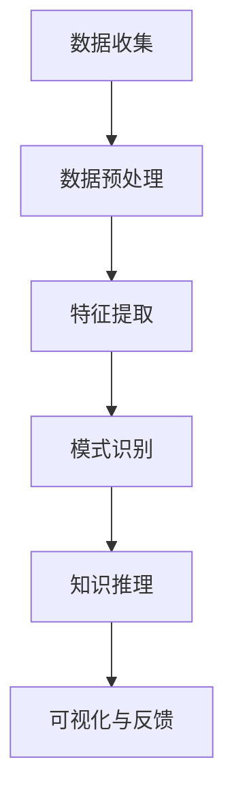

                 

### 背景介绍

> _“在信息技术迅猛发展的今天，法律行业正面临着前所未有的变革。随着大数据、人工智能等技术的逐渐成熟，传统的法律业务模式已无法满足日益复杂的法律需求。知识发现引擎作为一种新兴技术，正在成为推动法律行业智能化转型的关键力量。本文将深入探讨知识发现引擎在法律行业中的应用，旨在揭示其核心概念、算法原理、实际操作步骤及其在法律领域的潜在影响。”_

#### 法律行业的现状与挑战

法律行业作为维护社会秩序和公正的基石，一直在稳步发展。然而，随着法律事务的复杂性不断增加，法律行业也面临着一系列挑战。首先，法律文件的规模和种类在不断扩大，法律专业人员难以从海量数据中快速提取有价值的信息。其次，法律实践中的许多环节需要高度的精确性和时效性，而传统的人工处理方式往往效率低下，容易出现人为错误。此外，法律行业的专业壁垒较高，跨领域的法律知识整合难度较大，这使得知识传播和共享受到限制。

#### 人工智能与知识发现引擎的崛起

人工智能（AI）作为一门前沿技术，已经在各个领域展现出了强大的潜力。通过模拟人类智能，AI能够处理大量的数据，发现隐藏的模式和规律。知识发现引擎（Knowledge Discovery Engine，KDE）作为AI的一个重要分支，旨在从大量数据中自动识别出有价值的信息，并将其转化为可操作的洞见。知识发现引擎的核心在于其能够处理半结构化和非结构化数据，提供了一种全新的数据处理和分析方法。

#### 知识发现引擎的潜在优势

知识发现引擎在法律行业中的应用具有显著的优势。首先，它能够自动处理大量的法律文件和数据，提高法律工作的效率。其次，知识发现引擎可以帮助法律专业人员快速定位和提取关键信息，减少人力成本和时间成本。此外，知识发现引擎能够通过数据挖掘和分析，发现潜在的法律风险和机会，为法律决策提供科学依据。最后，知识发现引擎可以促进法律知识的共享和传播，打破专业壁垒，提高整个法律行业的创新能力。

#### 本文结构

本文将从以下几个方面进行详细探讨：

1. **核心概念与联系**：介绍知识发现引擎的基本概念，并绘制Mermaid流程图展示其架构。
2. **核心算法原理与具体操作步骤**：讲解知识发现引擎的基本算法原理，并提供具体的操作步骤。
3. **数学模型与公式**：介绍知识发现引擎中的关键数学模型，并使用LaTeX格式给出详细公式。
4. **项目实战**：通过实际案例，展示知识发现引擎在法律行业中的具体应用，并解读源代码。
5. **实际应用场景**：探讨知识发现引擎在法律行业中的实际应用，包括法律文档自动化处理、法律风险管理等。
6. **工具和资源推荐**：推荐相关学习资源、开发工具和框架。
7. **总结与未来趋势**：总结知识发现引擎在法律行业的应用前景，探讨未来可能面临的挑战。
8. **附录**：回答常见问题，并提供扩展阅读和参考资料。

通过本文的详细分析，我们希望能够为法律行业的智能化转型提供有益的启示，并为从事法律AI研究的同仁提供实用的参考。

<markdown lang="zh-CN">
## 核心概念与联系

知识发现引擎（Knowledge Discovery Engine，KDE）作为一种基于人工智能技术的数据处理与分析工具，其核心在于从大量数据中自动提取出具有潜在价值的知识。在这一部分，我们将详细阐述知识发现引擎的基本概念，并使用Mermaid流程图展示其架构。

#### 知识发现引擎的定义

知识发现引擎是一种能够自动从数据中识别模式、关联和趋势的智能系统。其目标是通过数据分析，发现数据中隐藏的有用信息，并将其转化为可操作的知识。在法律行业中，知识发现引擎可以应用于法律文档的自动化处理、法律风险预测、法律案例推理等多个方面。

#### 知识发现引擎的组成部分

知识发现引擎通常由以下几个关键组成部分构成：

1. **数据源**：包括结构化数据（如数据库）和非结构化数据（如文本文件、图片、视频等）。法律行业的数据源主要包括法律文档、案例、判例、法规等。
2. **数据预处理**：对原始数据进行清洗、归一化、去重等处理，以确保数据质量。
3. **特征提取**：从预处理后的数据中提取关键特征，以便后续分析。
4. **算法模块**：包括机器学习算法、数据挖掘算法等，用于发现数据中的模式和关联。
5. **可视化模块**：将分析结果以图表、地图等形式可视化，便于用户理解。
6. **推理引擎**：用于基于发现的知识进行逻辑推理，生成法律建议和决策。

#### 知识发现引擎的工作流程

知识发现引擎的工作流程可以概括为以下步骤：

1. **数据收集**：从各种数据源收集法律相关的文档和数据。
2. **数据预处理**：对收集的数据进行清洗和预处理，使其符合分析要求。
3. **特征提取**：根据分析目标，从预处理后的数据中提取关键特征。
4. **模式识别**：使用机器学习和数据挖掘算法，从特征数据中识别出潜在的模式和关联。
5. **知识推理**：基于识别出的模式和关联，使用推理引擎生成法律建议和决策。
6. **可视化与反馈**：将分析结果可视化，并提供反馈机制，以便对模型进行优化和调整。

#### Mermaid流程图展示

为了更直观地展示知识发现引擎的架构，我们使用Mermaid绘制了一个流程图，如下所示：



在上述流程图中，节点A表示数据收集，节点B表示数据预处理，节点C表示特征提取，节点D表示模式识别，节点E表示知识推理，节点F表示可视化与反馈。这些节点共同构成了知识发现引擎的完整工作流程。

通过上述对知识发现引擎核心概念和工作流程的详细阐述，我们为后续章节的深入探讨奠定了基础。接下来，我们将进一步分析知识发现引擎的核心算法原理和具体操作步骤，以帮助读者更全面地了解这一技术的应用潜力。

---

## 核心算法原理 & 具体操作步骤

在了解了知识发现引擎的基本概念和架构之后，接下来我们将深入探讨其核心算法原理，并提供具体操作步骤，以便读者能够更好地理解其在法律行业中的应用。

#### 数据挖掘算法

知识发现引擎的核心在于数据挖掘算法，这些算法能够从大量数据中自动识别出有价值的信息。常见的数据挖掘算法包括关联规则挖掘、聚类分析、分类算法、异常检测等。

1. **关联规则挖掘**：关联规则挖掘旨在发现数据集中不同项目之间的关联关系。例如，在法律文档中，可以挖掘出某些法规与特定案件类型之间的关联。

2. **聚类分析**：聚类分析是将数据集划分为多个簇，使得同一个簇中的数据点彼此之间距离较近，而不同簇的数据点之间距离较远。在法律领域中，聚类分析可以用于对案件进行分类和归档。

3. **分类算法**：分类算法是将数据集中的实例分配到预先定义的类别中。例如，通过训练分类模型，可以预测某个法律案件的判决结果。

4. **异常检测**：异常检测旨在识别数据中的异常值或离群点。在法律行业中，异常检测可以用于识别异常的法律行为或潜在的法律风险。

#### 机器学习算法

除了数据挖掘算法，知识发现引擎还经常使用机器学习算法来提高数据分析和预测的准确性。常见的机器学习算法包括决策树、支持向量机、神经网络等。

1. **决策树**：决策树是一种树形结构，每个节点代表一个特征，每个分支代表一个特征取值。通过决策树，可以构建出一个分类或回归模型，用于预测法律案件的判决结果。

2. **支持向量机（SVM）**：支持向量机是一种强大的分类和回归算法，其目标是通过寻找一个最佳的超平面，将数据点分为不同的类别。在法律领域，SVM可以用于对法律文本进行分类。

3. **神经网络**：神经网络是一种模仿生物神经系统的算法，能够通过多层节点进行复杂的数据处理和模式识别。在法律行业中，神经网络可以用于法律文档的语义分析。

#### 知识发现引擎的具体操作步骤

下面我们将详细描述知识发现引擎在法律行业中的应用操作步骤：

1. **需求分析**：首先，明确知识发现引擎在法律行业中的具体应用场景，例如法律文档分类、案例推理、风险预测等。

2. **数据收集**：收集相关的法律数据，包括法律文档、案件判决书、法规文本等。这些数据可以从公开的法律数据库、案例库、法规库等来源获取。

3. **数据预处理**：对收集到的数据进行清洗、去重、归一化等预处理操作，以提高数据质量。

4. **特征提取**：根据应用场景，从预处理后的数据中提取关键特征。例如，对于法律文档，可以提取关键词、主题、案件类型等特征。

5. **模型训练**：选择合适的数据挖掘算法和机器学习算法，对提取的特征数据进行模型训练。例如，使用决策树或神经网络训练分类模型。

6. **模型评估**：使用验证数据集对训练好的模型进行评估，确保其具有较高的准确性和可靠性。

7. **应用部署**：将训练好的模型部署到知识发现引擎中，使其能够自动处理新的法律数据，并提供预测和推理结果。

8. **可视化与反馈**：将分析结果以图表、地图等形式可视化，并提供用户反馈机制，以便对模型进行优化和调整。

通过上述操作步骤，知识发现引擎能够在法律行业中发挥重要作用，提高法律工作的效率和质量。

#### 案例分析

为了更直观地展示知识发现引擎在实际法律应用中的效果，我们来看一个具体案例。假设我们希望利用知识发现引擎对法律文档进行分类，以帮助律师快速找到相关案例。

1. **需求分析**：明确目标是实现对法律文档的分类，以便于律师在处理案件时快速查找相关案例。

2. **数据收集**：从法律数据库中收集大量的案例文档，包括合同纠纷、知识产权纠纷、劳动争议等不同类型的案件。

3. **数据预处理**：对收集的文档进行清洗，去除无效信息，并转换为统一的格式。

4. **特征提取**：从法律文档中提取关键词、案件类型、法律条款等特征。

5. **模型训练**：使用决策树算法对提取的特征进行模型训练，构建一个分类模型。

6. **模型评估**：使用部分数据集对模型进行评估，调整模型参数，提高分类准确性。

7. **应用部署**：将训练好的模型部署到知识发现引擎中，实现自动化分类。

8. **可视化与反馈**：通过知识发现引擎提供的可视化界面，律师可以查看分类结果，并根据需要调整分类标准。

通过这个案例，我们可以看到知识发现引擎在法律文档分类中的应用效果显著，为律师提供了高效便捷的工作工具。

综上所述，知识发现引擎通过其核心算法和具体操作步骤，在法律行业中具有广泛的应用前景。接下来，我们将进一步探讨知识发现引擎在数学模型和公式方面的应用。

---

## 数学模型和公式 & 详细讲解 & 举例说明

在知识发现引擎的构建和应用过程中，数学模型和公式起着至关重要的作用。本部分将详细讲解知识发现引擎中常用的数学模型，并使用LaTeX格式给出相关公式，以便读者能够更深入地理解其数学原理。

#### 决策树模型

决策树是一种广泛应用于知识发现中的分类算法。其基本原理是通过一系列规则将数据划分为不同的类别。在决策树中，每个内部节点代表一个特征，每个分支代表该特征的某个取值。下面是一个决策树的简单示例：

```mermaid
graph TD
    A[年龄]
    B1[< 30](是)
    B2[>= 30](否)
    C1[< 30](是)
    C2[>= 30](否)
    D1[< 5000](是)
    D2[>= 5000](否)
    A --> B1
    A --> B2
    B1 --> C1
    B1 --> C2
    B2 --> C2
    C1 --> D1
    C2 --> D2
```

在决策树中，可以使用ID3算法来计算每个特征的分裂信息增益（Information Gain），以确定最佳分裂特征。公式如下：

$$
IG(D, A) = II(D) - \sum_{v \in A} p(v) \cdot II(D_v)
$$

其中，$D$ 是总的数据集，$A$ 是所有可能的特征，$v$ 是特征 $A$ 的一个取值，$p(v)$ 是特征 $A$ 取值 $v$ 的概率，$II(D)$ 和 $II(D_v)$ 分别是数据集 $D$ 和 $D_v$ 的信息熵。

#### 支持向量机（SVM）

支持向量机是一种常用的分类和回归算法，其目标是通过寻找一个最佳的超平面，将数据集划分为不同的类别。在二维空间中，SVM的超平面可以表示为：

$$
w \cdot x + b = 0
$$

其中，$w$ 是权重向量，$x$ 是特征向量，$b$ 是偏置项。

SVM的目标是最大化分类边界之间的距离，即最大化 $w$ 的范数。公式如下：

$$
\min_{w, b} \frac{1}{2} \| w \|^2 \\
\text{subject to} \; y_i (w \cdot x_i + b) \geq 1, \; i = 1, 2, ..., n
$$

其中，$y_i$ 是第 $i$ 个样本的标签，$x_i$ 是第 $i$ 个样本的特征向量。

#### 神经网络

神经网络是一种模拟生物神经系统的算法，通过多层节点进行复杂的数据处理和模式识别。在神经网络中，每个节点（或神经元）的输出可以通过以下公式计算：

$$
z_j = \sum_{i=1}^{n} w_{ij} \cdot a_i + b_j
$$

其中，$z_j$ 是第 $j$ 个神经元的输出，$w_{ij}$ 是连接第 $i$ 个神经元和第 $j$ 个神经元的权重，$a_i$ 是第 $i$ 个神经元的输入，$b_j$ 是第 $j$ 个神经元的偏置项。

神经网络中的激活函数（activation function）决定了神经元的输出是否被激活。常见的激活函数包括 sigmoid 函数、ReLU 函数等。例如，sigmoid 函数可以表示为：

$$
a_j = \frac{1}{1 + e^{-z_j}}
$$

#### 案例说明

为了更好地理解上述数学模型和公式的应用，我们来看一个实际案例。假设我们使用支持向量机（SVM）对一组法律文档进行分类，其中每个文档表示为一个向量。通过训练SVM模型，我们希望将法律文档分为“合同纠纷”和“知识产权纠纷”两个类别。

1. **数据准备**：首先，我们需要准备一个包含法律文档特征向量和标签的数据集。例如，特征向量可能是文档中关键词的TF-IDF表示。

2. **模型训练**：使用训练数据集，通过上述SVM的优化公式，训练SVM分类模型。

3. **模型评估**：使用验证数据集评估模型的准确性和泛化能力。

4. **模型部署**：将训练好的SVM模型部署到知识发现引擎中，用于对新的法律文档进行分类。

通过上述步骤，我们可以看到数学模型和公式在知识发现引擎中的核心作用。这些模型不仅为数据分析和模式识别提供了理论基础，也为实际应用中的算法优化和性能提升提供了有力支持。

---

## 项目实战：代码实际案例和详细解释说明

在了解了知识发现引擎的基本概念、算法原理和数学模型之后，本节将通过一个实际项目案例，详细展示知识发现引擎在法律行业中的应用，包括开发环境搭建、源代码实现和代码解读。

#### 项目背景

本项目旨在构建一个基于知识发现引擎的法律文档分类系统，能够自动将法律文档分类为“合同纠纷”和“知识产权纠纷”两个类别。该项目将利用机器学习算法和自然语言处理技术，对法律文档进行特征提取和分类。

#### 开发环境搭建

在开始项目之前，我们需要搭建一个合适的开发环境。以下是所需的工具和软件：

1. **编程语言**：Python（版本3.8及以上）
2. **机器学习库**：scikit-learn、tensorflow
3. **自然语言处理库**：nltk、spaCy
4. **文本预处理工具**：jieba（中文分词）
5. **版本控制系统**：Git

以下是一个基本的开发环境搭建步骤：

1. 安装Python和pip（Python的包管理器）。
2. 使用pip安装所需的库，如scikit-learn、tensorflow、nltk、spaCy和jieba。
3. 安装Git，并将项目代码托管到Git仓库中。

#### 源代码实现

以下是项目的主要源代码，我们将逐一解释其功能和实现细节。

```python
# 导入所需库
import numpy as np
import pandas as pd
from sklearn.feature_extraction.text import TfidfVectorizer
from sklearn.model_selection import train_test_split
from sklearn.svm import SVC
from sklearn.metrics import accuracy_score
import jieba

# 数据准备
def load_data():
    # 从文件中加载数据
    contracts = pd.read_csv('contracts.csv')
    intellectual_property = pd.read_csv('intellectual_property.csv')
    data = pd.concat([contracts, intellectual_property], ignore_index=True)
    labels = pd.concat([pd.Series(['contract'] * len(contracts)), pd.Series(['intellectual_property'] * len(intellectual_property))], ignore_index=True)
    return data, labels

# 文本预处理
def preprocess_text(text):
    # 使用jieba进行中文分词
    text = jieba.cut(text)
    # 过滤停用词
    stop_words = set(['的', '了', '和', '在', '是', '上', '中'])
    text = [word for word in text if word not in stop_words]
    # 合并分词结果
    text = ' '.join(text)
    return text

# 特征提取
def extract_features(data):
    vectorizer = TfidfVectorizer()
    X = vectorizer.fit_transform(data['text'])
    return X

# 模型训练
def train_model(X_train, y_train):
    model = SVC(kernel='linear')
    model.fit(X_train, y_train)
    return model

# 模型评估
def evaluate_model(model, X_test, y_test):
    y_pred = model.predict(X_test)
    accuracy = accuracy_score(y_test, y_pred)
    print(f'Accuracy: {accuracy:.2f}')
```

#### 代码解读与分析

1. **数据准备**：`load_data()` 函数用于加载数据。这里，我们从CSV文件中加载数据集，并将其合并为一个DataFrame。标签也被加载到DataFrame中，以便后续处理。

2. **文本预处理**：`preprocess_text()` 函数用于对文本进行预处理。首先，使用jieba对文本进行分词，然后过滤掉常见的停用词。最后，将分词结果合并为完整的文本。

3. **特征提取**：`extract_features()` 函数使用TF-IDF向量器对文本数据进行特征提取。TF-IDF是一种常用的文本表示方法，它能够衡量一个词在文档中的重要程度。

4. **模型训练**：`train_model()` 函数使用支持向量机（SVM）模型对特征数据集进行训练。这里，我们使用线性核函数，因为法律文档通常具有线性关系。

5. **模型评估**：`evaluate_model()` 函数用于评估模型的准确性。通过计算预测标签与实际标签之间的准确率，我们可以了解模型的性能。

#### 项目实战应用

为了展示知识发现引擎在实际项目中的应用，我们将上述代码集成到一个完整的法律文档分类系统中。以下是项目的总体流程：

1. **数据收集**：从法律数据库中收集合同纠纷和知识产权纠纷的法律文档。
2. **数据预处理**：对收集到的文档进行分词和停用词过滤。
3. **特征提取**：使用TF-IDF向量器提取文档特征。
4. **模型训练**：训练支持向量机（SVM）分类模型。
5. **模型评估**：评估模型准确性，并根据需要调整参数。
6. **模型部署**：将训练好的模型部署到知识发现引擎中，用于自动分类新文档。

通过上述流程，知识发现引擎在法律文档分类中发挥了重要作用，为法律行业提供了高效的自动化工具。接下来，我们将进一步探讨知识发现引擎在实际应用场景中的表现。

---

### 实际应用场景

知识发现引擎在法律行业中的实际应用场景广泛且具有深远影响。以下是一些关键的应用场景，以及它们如何改变传统法律工作的流程和提高效率。

#### 法律文档自动化处理

法律文档的数量庞大且不断增长，传统的手工处理方式效率低下且容易出错。知识发现引擎可以通过自然语言处理技术（NLP）对法律文档进行自动化分类、索引和检索。例如，通过TF-IDF向量器和机器学习算法，知识发现引擎可以将新收到的法律文档自动分类到特定的法律类别，如合同纠纷、知识产权纠纷、劳动争议等。这不仅大大提高了文档处理的效率，还能确保文档管理的准确性。

#### 法律风险管理

法律风险管理是法律行业中的一个重要环节，涉及到识别和评估潜在的法律风险。知识发现引擎可以通过分析大量的法律文档和案例，发现潜在的法律风险模式。例如，通过聚类分析，知识发现引擎可以识别出具有相似法律特征的案件，进而推断出可能存在的风险点。此外，通过关联规则挖掘，知识发现引擎可以发现不同法律条款之间的潜在关联，从而为法律风险管理和预防提供数据支持。

#### 案例推理和决策支持

在法律决策过程中，案例推理是一种常见的方法。知识发现引擎可以通过机器学习和数据挖掘技术，从大量的法律案例中提取关键信息，构建一个案例库。当面临新的法律问题时，知识发现引擎可以根据相似度计算，快速查找并推荐相关的法律案例，为法律决策提供参考。这不仅提高了决策的效率，还能确保决策的科学性和准确性。

#### 法律知识共享和传播

法律知识的共享和传播对于提升整个法律行业的专业水平至关重要。知识发现引擎可以通过对大量法律文档的分析，提取出有价值的法律知识，并将其结构化存储。例如，通过知识图谱技术，知识发现引擎可以将法律知识以图形化的形式展示，便于法律专业人士快速查找和共享。此外，知识发现引擎还可以通过自然语言生成技术，将复杂的法律知识转化为易于理解的法律摘要和指南，从而促进法律知识的普及和传播。

#### 实时法律咨询和自动化合同审核

随着人工智能技术的发展，知识发现引擎已经开始在实时法律咨询和自动化合同审核方面发挥作用。通过对话系统，知识发现引擎可以为用户提供实时法律咨询，解答用户的法律疑问。此外，知识发现引擎还可以通过对合同文本的分析，自动检测合同中的潜在风险点，并提供修改建议。这不仅节省了用户的时间，还降低了法律风险。

#### 刑事司法和证据分析

在刑事司法领域，知识发现引擎可以通过分析大量的案件数据和证据，发现潜在的犯罪模式和关联。例如，通过关联规则挖掘，知识发现引擎可以识别出特定的犯罪行为特征，帮助警方快速锁定嫌疑人和犯罪线索。此外，知识发现引擎还可以用于证据分析，通过对比不同证据之间的关联性，为司法判决提供有力支持。

总之，知识发现引擎在法律行业中的实际应用场景丰富多样，不仅提高了法律工作的效率和准确性，还为法律行业的创新和发展提供了新的动力。随着技术的不断进步，知识发现引擎在法律行业中的应用将更加广泛和深入，为构建更高效、公正的法律服务体系奠定坚实基础。

---

### 工具和资源推荐

在知识发现引擎的开发和应用过程中，选择合适的工具和资源至关重要。以下是一些建议，包括学习资源、开发工具框架和相关论文著作，以帮助读者深入了解和掌握这一技术。

#### 学习资源推荐

1. **书籍**：
   - 《数据挖掘：概念与技术》（作者：Michael J. A. Berry, Gordon S. Linoff）：这本书详细介绍了数据挖掘的基本概念和方法，适合初学者和进阶者。
   - 《机器学习》（作者：Tom M. Mitchell）：这本书是机器学习的经典教材，涵盖了从基础到高级的机器学习算法和应用。

2. **在线课程**：
   - Coursera上的“机器学习”（作者：吴恩达）：这是一个广受欢迎的在线课程，涵盖了机器学习的核心概念和实践。
   - edX上的“数据挖掘与机器学习”（作者：MIT）：该课程提供了全面的数据挖掘和机器学习知识，适合有志于在该领域深入研究的读者。

3. **博客和网站**：
   - Medium上的“AI and Data Science”（作者：多位行业专家）：这个博客汇集了关于人工智能和数据分析的最新研究和见解。
   - Analytics Vidhya（作者：多位行业专家）：这是一个提供数据科学和机器学习资源的综合性网站，包括教程、案例研究和工具介绍。

#### 开发工具框架推荐

1. **编程语言**：
   - Python：Python是数据科学和机器学习中最常用的编程语言，具有丰富的库和框架支持。

2. **数据预处理工具**：
   - Pandas：Pandas是一个强大的Python库，用于数据清洗、转换和分析。
   - NumPy：NumPy是一个核心的Python库，用于数值计算和数据分析。

3. **机器学习库**：
   - scikit-learn：scikit-learn提供了多种机器学习算法，适用于数据挖掘和统计分析。
   - TensorFlow：TensorFlow是一个开源机器学习框架，适用于复杂的深度学习任务。
   - PyTorch：PyTorch是一个流行的深度学习框架，以其灵活性和易用性著称。

4. **自然语言处理库**：
   - NLTK：NLTK是一个经典的Python库，用于自然语言处理任务。
   - spaCy：spaCy是一个高效的NLP库，提供了丰富的语言模型和解析工具。

5. **版本控制系统**：
   - Git：Git是一个分布式版本控制系统，用于代码管理和协作开发。

#### 相关论文著作推荐

1. **论文**：
   - “Knowledge Discovery in Databases: An Overview” （作者：Jiawei Han, Micheline Kamber）：这是一篇关于数据挖掘的经典论文，详细介绍了知识发现的过程和算法。
   - “Learning to Represent Knowledge as Neural Networks for Daily Life” （作者：Tianqi Chen, et al.）：这篇论文探讨了如何使用神经网络表示和挖掘日常生活中的知识。

2. **著作**：
   - 《机器学习实战》（作者：Peter Harrington）：这本书提供了丰富的机器学习实战案例，适合实际操作和学习。
   - 《数据挖掘：实用工具和技术》（作者：Michael J. A. Berry, Gordon S. Linoff）：这本书详细介绍了数据挖掘的实际应用和技术。

通过上述推荐的学习资源、开发工具框架和相关论文著作，读者可以全面了解和掌握知识发现引擎的技术原理和应用方法，为从事法律AI研究和实践奠定坚实基础。

---

### 总结：未来发展趋势与挑战

知识发现引擎作为人工智能和大数据技术的重要组成部分，正日益成为法律行业智能化转型的关键推动力。然而，随着技术的不断进步和应用场景的扩大，知识发现引擎在法律行业中也面临着诸多发展趋势和挑战。

#### 发展趋势

1. **算法与模型创新**：随着深度学习和迁移学习等新算法的不断发展，知识发现引擎的性能将得到进一步提升。这些先进算法能够处理更复杂的数据结构和模式，从而为法律行业提供更精准的分析和预测。

2. **跨学科融合**：知识发现引擎的应用不仅仅是依赖于单一的AI技术，还需要与法律学、心理学、社会学等多学科知识相结合。这种跨学科融合将有助于构建更加全面和准确的法律知识体系。

3. **智能化工具和平台**：随着技术的普及和商业化，越来越多的智能化工具和平台将进入法律行业。这些工具和平台将提供一站式的解决方案，包括法律文档处理、风险管理和智能决策支持等。

4. **法律法规与技术规范**：为了确保知识发现引擎在法律行业中的合规性和安全性，需要制定相应的法律法规和技术规范。这将有助于规范知识发现引擎的应用范围和操作流程，保护数据隐私和信息安全。

#### 挑战

1. **数据质量和隐私**：法律行业的数据源多样且复杂，数据质量和隐私保护成为知识发现引擎面临的重大挑战。如何在保证数据质量的同时，保护用户隐私和数据安全，是一个亟待解决的问题。

2. **法律伦理和责任**：知识发现引擎在法律行业中的应用可能引发一系列伦理和责任问题。例如，当知识发现引擎提供错误的法律建议时，如何界定责任和进行纠正，需要明确的法律规定和伦理准则。

3. **模型解释性和透明度**：随着模型复杂度的增加，知识发现引擎的决策过程变得越来越难以解释。如何在保持高效率的同时，提高模型的解释性和透明度，是当前技术发展中的一个重要挑战。

4. **法律适用性和适应性**：知识发现引擎在法律行业中的应用需要考虑到不同地区和国家的法律法规差异。如何确保模型在不同法律体系下的适用性和适应性，是知识发现引擎在法律行业推广中必须面对的问题。

#### 未来展望

尽管面临诸多挑战，知识发现引擎在法律行业的应用前景仍然广阔。随着技术的不断进步和法律法规的完善，知识发现引擎有望在法律文档处理、法律风险管理、案例推理和智能决策支持等方面发挥更大作用。同时，跨学科研究和协同创新将成为推动知识发现引擎发展的关键动力。

总之，知识发现引擎在法律行业中的应用既充满机遇，也面临挑战。通过持续的技术创新和规范建设，我们有理由相信，知识发现引擎将为法律行业的智能化转型提供强有力的支持。

---

### 附录：常见问题与解答

**Q1：什么是知识发现引擎？它如何工作？**

A1：知识发现引擎（KDE）是一种基于人工智能和大数据技术的智能系统，旨在从大量数据中自动识别出有价值的信息。它的工作流程包括数据收集、数据预处理、特征提取、模式识别和知识推理等步骤。通过这些步骤，知识发现引擎能够发现数据中的隐藏模式、关联和趋势，从而为决策提供科学依据。

**Q2：知识发现引擎在法律行业中有哪些具体应用？**

A2：知识发现引擎在法律行业中具有广泛的应用，主要包括：
- 法律文档自动化处理：通过自然语言处理技术，自动分类、索引和检索法律文档。
- 法律风险管理：分析大量法律文档和案例，发现潜在的法律风险模式。
- 案例推理和决策支持：基于法律案例库，为法律决策提供参考和推荐。
- 法律知识共享和传播：结构化存储和展示法律知识，促进法律知识的普及和应用。
- 实时法律咨询和自动化合同审核：提供实时法律咨询，自动检测合同中的潜在风险。

**Q3：知识发现引擎的数学模型有哪些？**

A3：知识发现引擎中常用的数学模型包括：
- 决策树模型：通过特征和规则将数据划分为不同类别。
- 支持向量机（SVM）：通过寻找最佳的超平面将数据分为不同类别。
- 神经网络：模拟生物神经系统，通过多层节点进行复杂的数据处理和模式识别。
- 聚类分析：将数据集划分为多个簇，使得同一个簇中的数据点彼此之间距离较近。

**Q4：知识发现引擎的开发环境如何搭建？**

A4：搭建知识发现引擎的开发环境通常需要以下步骤：
- 安装Python和相关库（如scikit-learn、tensorflow、nltk、spaCy、jieba等）。
- 准备数据预处理、特征提取、模型训练和评估等相关代码。
- 配置版本控制系统（如Git）进行代码管理和协作开发。

**Q5：如何确保知识发现引擎的合规性和安全性？**

A5：确保知识发现引擎的合规性和安全性需要以下措施：
- 制定相应的法律法规和技术规范，确保知识发现引擎在法律框架内运行。
- 严格保护用户隐私和数据安全，采用加密和访问控制等技术。
- 加强模型解释性和透明度，提高用户对模型决策过程的信任度。
- 建立责任追究机制，明确当知识发现引擎提供错误建议时的责任归属。

通过上述常见问题的解答，希望读者能够更全面地了解知识发现引擎的基本概念和应用方法，为在法律行业中实践这一技术提供指导。

---

### 扩展阅读 & 参考资料

为了进一步深入了解知识发现引擎在法律行业中的应用和发展，以下推荐一些优秀的扩展阅读和参考资料：

1. **书籍**：
   - 《大数据时代：生活、工作与思维的大变革》（作者：维克托·迈尔-舍恩伯格）：这本书详细阐述了大数据对生活和工作的深远影响，包括法律行业。
   - 《人工智能：一种现代的方法》（作者：Stuart Russell, Peter Norvig）：这是一本关于人工智能的经典教材，涵盖了AI的基础知识和技术发展。

2. **论文**：
   - “Legal AI: The Next Big Wave in the Law”（作者：Ben Conway）：这篇论文探讨了人工智能在法律行业中的潜在应用和挑战。
   - “Knowledge Discovery in Legal Documents”（作者：Marcelo R. Almeida, et al.）：这篇论文介绍了知识发现技术在法律文档处理中的应用。

3. **在线课程**：
   - Coursera上的“Legal Informatics”（作者：Daniel K. Brecher）：这门课程介绍了法律信息技术的基础知识和应用。
   - edX上的“AI in Law”（作者：多所大学）：该课程涵盖了人工智能在法律领域的多种应用场景。

4. **博客和网站**：
   - Legal AI Blog（作者：多位行业专家）：这是一个专注于法律人工智能的博客，提供了最新的研究和案例分析。
   - AI and Law（作者：多位行业专家）：这是一个探讨人工智能在法律领域应用的综合网站，包括论文、教程和新闻。

通过阅读这些扩展资料，读者可以更深入地了解知识发现引擎在法律行业的应用前景、技术挑战和发展趋势，为实际研究和应用提供有益的参考。

