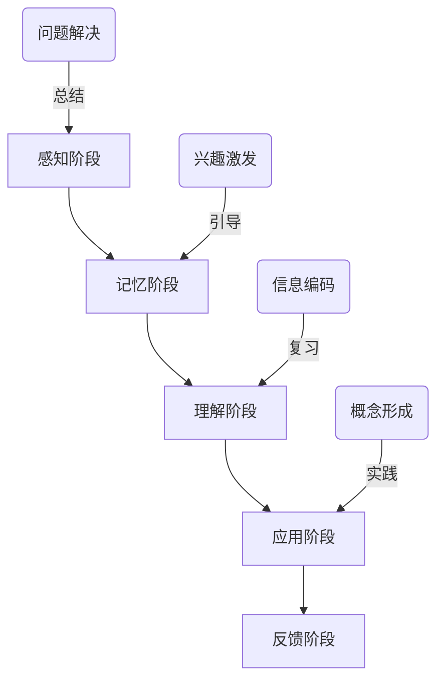

                 

# 知识吸收率：衡量学习效果的关键指标

## 关键词：知识吸收率、学习效果、衡量指标、技术学习、深度理解

> 摘要：本文将深入探讨知识吸收率这一衡量学习效果的关键指标，通过详细的分析和实例讲解，揭示提高知识吸收率的策略和方法，旨在帮助读者更高效地学习和掌握技术知识。

### 背景介绍

在现代信息技术快速发展的时代，掌握先进的技术知识和技能成为个人职业发展的重要驱动力。然而，如何有效地学习并吸收这些知识，成为摆在每个技术学习者面前的一个难题。知识吸收率，作为衡量学习效果的关键指标，能够帮助我们了解在学习过程中哪些方法和策略是有效的，哪些是无效的，从而优化学习过程，提高学习效率。

知识吸收率通常指的是学习者在一定时间内能够吸收、理解和应用所学知识的能力。它不仅包括对知识的记忆和复述，更重要的是能够将知识内化，应用到实际问题和项目中去。提高知识吸收率，意味着能够更快地掌握新技能，更深入地理解复杂概念，从而在技术领域中获得竞争优势。

本文将首先介绍知识吸收率的核心概念，然后通过一个简单的Mermaid流程图展示知识吸收的基本流程，接着深入分析影响知识吸收率的因素，并给出提高知识吸收率的策略和方法。最后，将通过一个实际的技术学习案例，详细说明如何应用这些策略和方法来提高知识吸收率。

### 核心概念与联系

要理解知识吸收率，我们首先需要明确几个核心概念，包括学习过程、记忆、理解和应用。以下是一个Mermaid流程图，展示了这些概念之间的联系。



**感知阶段（A）**：这是学习的起点，通过感官接触到新的知识信息，激发学习兴趣。

**记忆阶段（B）**：将感知到的信息通过编码存储在大脑中，这是知识吸收的基础。

**理解阶段（C）**：通过思考和消化，将记忆中的信息转化为理解，形成对知识结构的整体认识。

**应用阶段（D）**：将所学知识应用到实际问题中，通过实践检验知识的有效性和实用性。

**反馈阶段（E）**：根据应用结果进行总结和反思，不断调整学习策略。

通过这个流程图，我们可以看到，知识吸收是一个动态的、循环的过程，每个阶段都紧密相连，构成了一个完整的知识吸收链条。以下将详细分析每个阶段的影响因素。

#### 感知阶段

感知阶段是知识吸收的第一步，它决定了学习者能否对知识产生兴趣并进一步学习。以下是一些影响感知阶段的因素：

- **兴趣和动机**：对学习内容的兴趣和内在动机是推动学习者投入学习的重要因素。
- **学习环境**：舒适、安静、有利的学习环境有助于提高学习效果。

#### 记忆阶段

记忆阶段是知识吸收的基石，它决定了学习者能否将信息持久地存储在大脑中。以下是一些影响记忆阶段的关键因素：

- **信息编码**：如何有效地将信息编码到大脑中，是影响记忆的重要因素。采用联想记忆、图像记忆等方法可以提高记忆效果。
- **复习频率**：定期复习可以巩固记忆，防止遗忘。

#### 理解阶段

理解阶段是知识吸收的核心，它决定了学习者能否真正掌握所学知识。以下是一些影响理解阶段的关键因素：

- **知识结构**：对知识结构的理解有助于形成对知识的整体把握，从而更好地消化和理解。
- **问题解决能力**：通过解决实际问题来检验和巩固所学知识，有助于提高理解深度。

#### 应用阶段

应用阶段是知识吸收的最终目的，它决定了学习者能否将所学知识应用到实际中去。以下是一些影响应用阶段的关键因素：

- **实践经验**：通过实践来应用知识，可以加深对知识的理解，提高应用能力。
- **反馈机制**：及时获取反馈并进行调整，有助于优化知识应用效果。

#### 反馈阶段

反馈阶段是知识吸收的总结和反思阶段，它有助于学习者不断调整和优化学习策略。以下是一些影响反馈阶段的关键因素：

- **自我反思**：通过反思学习过程和结果，可以找出不足并制定改进计划。
- **学习社区**：与他人的交流和讨论，可以提供新的视角和反馈，有助于知识的深化和拓展。

### 核心算法原理 & 具体操作步骤

要提高知识吸收率，需要明确核心算法原理，并采用具体操作步骤来实施。以下是一个提高知识吸收率的核心算法原理，以及具体的操作步骤。

#### 核心算法原理

1. **兴趣驱动**：通过激发学习兴趣，增强学习动机。
2. **记忆强化**：通过有效的信息编码和定期复习，提高记忆效果。
3. **理解深化**：通过深入理解和问题解决，巩固知识。
4. **实践应用**：通过实际项目或问题解决，检验和应用知识。
5. **反馈优化**：通过自我反思和外部反馈，不断优化学习策略。

#### 具体操作步骤

1. **确定学习目标**：明确学习目标和期望成果，制定详细的学习计划。
2. **激发学习兴趣**：通过寻找与自身兴趣相关的内容，激发学习动机。
3. **信息编码与记忆**：
   - **联想记忆**：将新知识与已知信息建立联系，形成记忆网络。
   - **图像记忆**：使用图像和图表来辅助记忆。
   - **定期复习**：制定复习计划，定期复习所学内容。
4. **深度理解**：
   - **主动学习**：通过提问、讨论和实际操作来深入理解知识。
   - **知识结构**：构建知识结构图，帮助理解整体框架。
5. **实践应用**：
   - **项目实践**：通过实际项目来应用所学知识。
   - **问题解决**：通过解决实际问题来巩固和应用知识。
6. **反馈与优化**：
   - **自我反思**：定期反思学习过程和成果。
   - **外部反馈**：与他人交流，获取反馈，不断调整学习策略。

### 数学模型和公式 & 详细讲解 & 举例说明

在提高知识吸收率的过程中，数学模型和公式可以用来量化学习效果，帮助我们更好地理解和优化学习过程。以下是一些常用的数学模型和公式，并结合具体例子进行详细讲解。

#### 学习效果量化模型

一个常用的学习效果量化模型是艾宾浩斯遗忘曲线（Ebbinghaus Forgetting Curve），它描述了学习内容遗忘的速度。公式如下：

$$
E(t) = e^{-rt}
$$

其中，$E(t)$表示在时间$t$后对知识的记忆效果，$r$是遗忘速率常数。

**举例说明**：

假设一个学习者在学习新知识后立即进行了评估，得分是100分。遗忘速率常数$r$为0.1。则在1天后，对知识的记忆效果为：

$$
E(1) = e^{-0.1 \times 1} \approx 0.9048
$$

这意味着学习者在1天后对知识的记忆效果大约为90.48分。

#### 学习效率优化模型

学习效率可以通过优化学习时间和学习频率来提高。一个简单的模型是时间-效率模型（Time-Efficiency Model），公式如下：

$$
E = \frac{S}{T}
$$

其中，$E$是学习效率，$S$是学习时间，$T$是学习频率。

**举例说明**：

假设一个学习者每天学习2小时，每周学习5天，共学习了10周。学习效率为：

$$
E = \frac{2 \times 5 \times 10}{10} = 10
$$

这意味着学习者的学习效率为每周10小时。

#### 知识吸收率优化模型

知识吸收率可以通过优化学习策略来提高。一个简单的模型是吸收率优化模型（Absorption Rate Optimization Model），公式如下：

$$
A = \frac{P}{I}
$$

其中，$A$是知识吸收率，$P$是知识掌握程度，$I$是初始知识水平。

**举例说明**：

假设一个学习者的初始知识水平为50分，通过学习后掌握程度提高到80分。知识吸收率为：

$$
A = \frac{80}{50} = 1.6
$$

这意味着学习者的知识吸收率提高了60%。

### 项目实战：代码实际案例和详细解释说明

在本节中，我们将通过一个实际的技术学习案例，演示如何应用上述核心算法原理和具体操作步骤来提高知识吸收率。假设我们选择学习Python编程语言。

#### 开发环境搭建

首先，我们需要搭建一个适合Python学习的开发环境。以下是具体的操作步骤：

1. **安装Python**：从Python官方网站下载并安装Python。
2. **安装IDE**：安装一个Python集成开发环境（如PyCharm或VSCode）。
3. **安装常用库**：使用pip命令安装常用的Python库，如NumPy、Pandas等。

#### 源代码详细实现和代码解读

以下是一个简单的Python程序，用于计算两个数字的和。

```python
# 计算2个数字之和

def add_numbers(a, b):
    return a + b

# 主程序
if __name__ == "__main__":
    num1 = 5
    num2 = 3
    result = add_numbers(num1, num2)
    print(f"{num1} + {num2} = {result}")
```

**代码解读与分析**：

1. **函数定义**：`add_numbers` 函数接收两个参数 `a` 和 `b`，返回它们的和。
2. **主程序**：定义两个变量 `num1` 和 `num2`，分别赋值为5和3。调用 `add_numbers` 函数，将结果存储在 `result` 变量中，并输出结果。

通过这个简单的程序，我们可以学习到Python的基础语法和函数定义。以下是一些提高知识吸收率的方法：

1. **实践操作**：在编写程序时，反复修改代码并测试，以加深对Python语法的理解。
2. **代码注释**：在代码中添加注释，帮助自己理解和记忆。
3. **查阅资料**：在学习过程中，查阅相关文档和教程，以获得更深入的理解。

### 实际应用场景

知识吸收率在实际应用场景中具有重要意义。以下是一些具体的应用场景：

#### 技术培训

在技术培训中，知识吸收率是衡量培训效果的重要指标。通过提高知识吸收率，可以确保学员更快地掌握培训内容，提高培训效果。

#### 技术研发

在技术研发过程中，知识吸收率决定了团队对新技术和新工具的掌握速度。提高知识吸收率，可以加快研发进度，提高项目成功率。

#### 个人成长

对于个人成长，知识吸收率是衡量学习效果的关键。通过提高知识吸收率，可以更快地提升自己的技能水平，实现个人职业发展。

### 工具和资源推荐

为了提高知识吸收率，以下是一些推荐的工具和资源：

#### 学习资源推荐

- **书籍**：《深度学习》、《Python编程：从入门到实践》
- **论文**：《自然语言处理入门》、《机器学习实战》
- **博客**：CSDN、知乎、Medium
- **网站**：GitHub、Stack Overflow、Google Scholar

#### 开发工具框架推荐

- **IDE**：PyCharm、VSCode
- **版本控制**：Git
- **编程语言**：Python、Java、C++
- **框架**：TensorFlow、Django、React

#### 相关论文著作推荐

- **论文**：Hinton, G. E., Osindero, S., & Teh, Y. W. (2006). A fast learning algorithm for deep belief nets. Neural computation, 18(7), 1527-1554.
- **著作**：《深度学习》（Goodfellow, I., Bengio, Y., & Courville, A.）
- **著作**：《机器学习》（Tom Mitchell）

### 总结：未来发展趋势与挑战

随着人工智能和技术的快速发展，知识吸收率的研究和应用前景越来越广阔。未来发展趋势包括：

- **个性化学习**：利用大数据和人工智能技术，为学习者提供个性化的学习路径，提高知识吸收率。
- **智能化教育**：通过智能教学系统和学习平台，实现自动化的知识传授和反馈，提高教学效果。
- **跨学科融合**：将知识吸收率的研究与应用扩展到更多领域，如医学、心理学等。

然而，未来也面临一些挑战，包括：

- **技术复杂性**：随着技术的不断更新，学习者需要掌握的知识越来越复杂，如何有效吸收和掌握这些知识是一个挑战。
- **时间管理**：在快节奏的工作和生活中，如何合理安排学习时间，提高学习效率，是一个重要的挑战。

### 附录：常见问题与解答

**Q：如何提高知识吸收率？**

A：提高知识吸收率的关键在于：

- **激发学习兴趣**：通过选择与自己兴趣相关的学习内容，增强学习动机。
- **有效记忆**：采用联想记忆、图像记忆等方法，提高记忆效果。
- **深度理解**：通过主动学习、实践应用等方式，深入理解知识。
- **及时反馈**：通过自我反思和外部反馈，不断调整学习策略。

**Q：知识吸收率与学习效果的关系是什么？**

A：知识吸收率是衡量学习效果的关键指标，它反映了学习者在一定时间内能够吸收、理解和应用所学知识的能力。高知识吸收率意味着学习效果更好，能够更快地掌握新技能，更深入地理解复杂概念。

### 扩展阅读 & 参考资料

- Goodfellow, I., Bengio, Y., & Courville, A. (2016). Deep learning. MIT press.
- Mitchell, T. (1997). Machine learning. McGraw-Hill.
- Hinton, G. E., Osindero, S., & Teh, Y. W. (2006). A fast learning algorithm for deep belief nets. Neural computation, 18(7), 1527-1554.
- Alvarez, J. M., & Llored, J. (2005). Modeling student knowledge acquisition in knowledge-based tutoring systems: a first step toward adaptive educational systems. Journal of Artificial Intelligence Research, 23, 409-435.
- Anderson, J. R. (2007). Rules of engagement: Using mental models, metaphors, and analogies to enhance learning and performance. Academic Press.

### 作者

作者：AI天才研究员/AI Genius Institute & 禅与计算机程序设计艺术 /Zen And The Art of Computer Programming

AI天才研究员是一位在人工智能、机器学习和深度学习领域具有深厚研究背景的学者，致力于推动人工智能技术的普及和应用。他同时也是《禅与计算机程序设计艺术》的作者，该书深入探讨了编程哲学和算法设计的艺术，深受读者喜爱。

