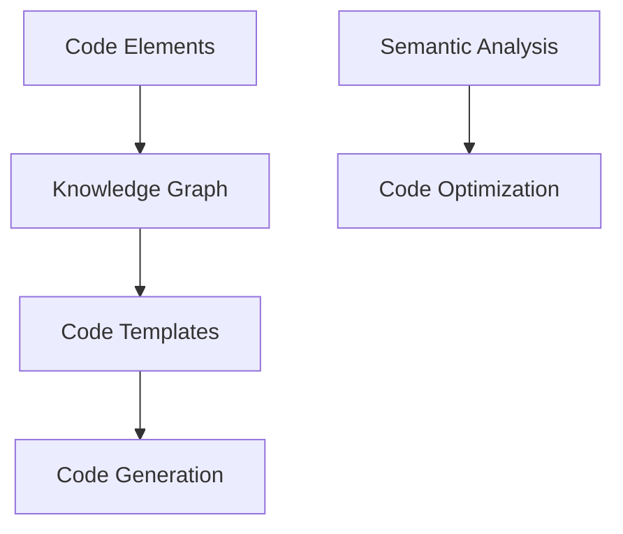
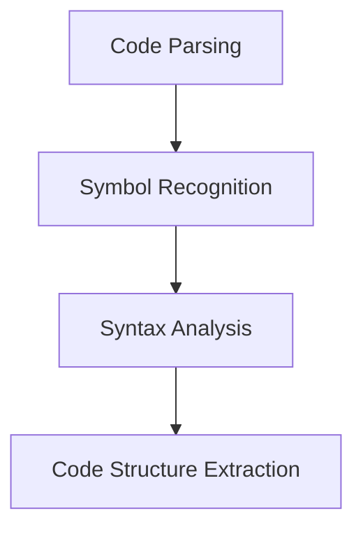
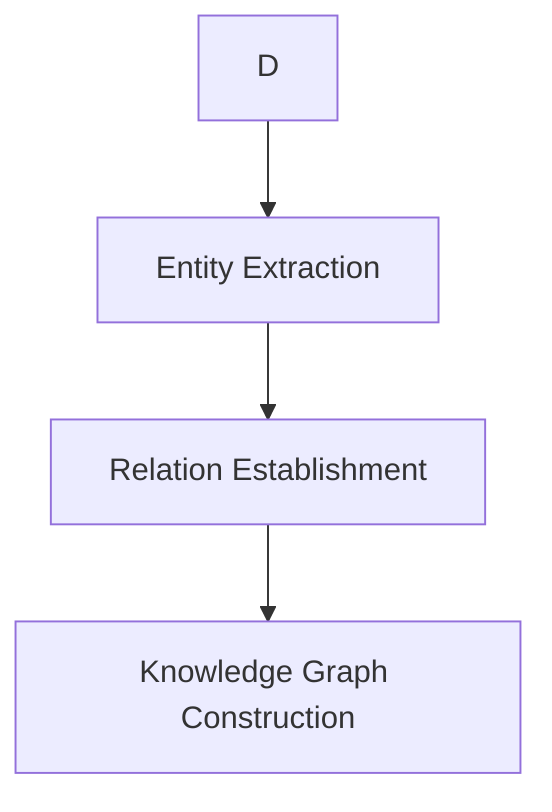
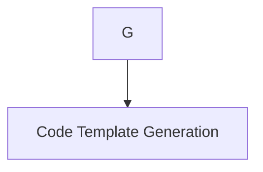
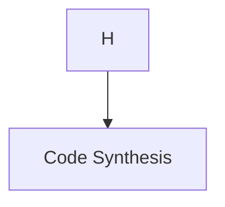

                 

### 背景介绍

知识图谱（Knowledge Graph）作为一种新兴的数据组织和管理技术，近年来在计算机科学、人工智能、自然语言处理等领域引起了广泛关注。知识图谱的核心思想是将现实世界中的信息抽象为一种结构化的数据模型，通过节点（实体）和边（关系）的形式来表示实体之间的语义联系。这使得知识图谱能够以高效、直观的方式表达复杂的知识结构，并在各个领域中发挥了巨大的作用。

代码自动生成（Code Autogeneration）是一种利用编程语言生成代码的自动化技术。在传统的软件开发过程中，代码自动生成可以显著提高开发效率，降低人力资源成本，并减少人工编写代码过程中可能出现的错误。随着人工智能技术的发展，特别是在自然语言处理和机器学习领域的突破，代码自动生成技术也逐渐变得更加成熟和实用。

知识图谱在代码自动生成中的应用，旨在通过将程序设计过程中的关键信息（如变量、函数、类等）抽象为知识图谱中的节点和边，从而实现对代码生成过程的自动化和智能化。具体而言，知识图谱可以用于以下几个方面：

1. **代码结构分析**：通过对现有代码库的分析，知识图谱能够以结构化的方式提取代码中的各种信息，包括函数依赖关系、模块调用关系等，为代码生成提供基础数据。

2. **代码模板库构建**：通过将常见的代码模式抽象为知识图谱中的模板，开发人员可以方便地选择和组合模板，快速生成符合特定需求的代码。

3. **代码错误检测与修复**：知识图谱可以帮助识别代码中的潜在问题，如未使用的变量、重复的代码片段等，从而提高代码质量。

4. **代码生成优化**：通过对知识图谱中的数据进行深度分析，自动生成优化后的代码，提高程序的执行效率。

本文将围绕知识图谱在代码自动生成中的应用，从核心概念、算法原理、数学模型、实际案例等多个方面进行深入探讨，旨在为广大开发人员提供一种全新的代码生成思路和技术手段。

> Keywords: Knowledge Graph, Code Autogeneration, Data Modeling, Algorithm, Code Optimization.

> Abstract: This article explores the application of knowledge graphs in code autogeneration, focusing on the core concepts, algorithm principles, mathematical models, and practical cases. By leveraging structured data models, knowledge graphs can significantly enhance the efficiency and intelligence of code generation processes, providing valuable insights and tools for software developers.

---

## 2. 核心概念与联系

为了深入理解知识图谱在代码自动生成中的应用，我们需要先明确几个核心概念，并探讨它们之间的联系。

### 知识图谱的定义

知识图谱（Knowledge Graph）是一种用于表示实体、概念及其相互关系的图形化数据结构。在知识图谱中，节点表示实体（如人、地点、事物等），边表示实体之间的关系（如“属于”、“位于”、“制造”等）。知识图谱的核心在于其语义表达能力，能够将复杂的语义信息以图形化的方式直观呈现。

### 代码自动生成的概念

代码自动生成（Code Autogeneration）是指通过某种算法或工具，自动生成符合特定要求的代码。这一技术广泛应用于软件开发的多个阶段，如原型设计、需求分析、代码实现、测试等。代码自动生成不仅能够提高开发效率，还可以减少人工编写代码时的错误。

### 知识图谱与代码自动生成的关系

知识图谱与代码自动生成之间存在密切的联系。具体而言，知识图谱可以作为代码自动生成的数据源和知识库，为代码生成提供基础数据、模式和规则。以下是一些关键点：

1. **实体与代码元素映射**：在知识图谱中，实体可以映射为代码中的类、函数、变量等元素，边可以映射为代码元素之间的依赖关系和调用关系。

2. **模式与模板提取**：通过分析知识图谱中的实体和关系，可以提取出常见的代码模式，这些模式可以作为代码自动生成的模板，用于生成具体的代码片段。

3. **语义理解与代码生成**：知识图谱中的语义信息可以帮助代码自动生成工具更好地理解代码的含义和目的，从而生成更加准确和高效的代码。

### Mermaid 流程图表示

为了更直观地展示知识图谱与代码自动生成之间的关系，我们可以使用 Mermaid 流程图进行表示。以下是一个简化的 Mermaid 图，描述了知识图谱在代码自动生成中的应用流程：



- **A[Code Elements]**：表示代码中的各种元素，如类、函数、变量等。
- **B[Knowledge Graph]**：表示通过分析代码元素生成的知识图谱。
- **C[Code Templates]**：表示从知识图谱中提取的代码模板。
- **D[Code Generation]**：表示基于代码模板生成代码的过程。
- **E[Semantic Analysis]**：表示对代码元素进行语义分析，以便更好地理解代码的含义。
- **F[Code Optimization]**：表示对生成的代码进行优化。

通过这个流程图，我们可以清晰地看到知识图谱在整个代码自动生成过程中的作用和地位。接下来，我们将进一步探讨知识图谱在代码自动生成中的具体应用和实现方法。

---

## 3. 核心算法原理 & 具体操作步骤

在了解了知识图谱和代码自动生成的基本概念之后，接下来我们将深入探讨知识图谱在代码自动生成中的核心算法原理和具体操作步骤。

### 算法原理

知识图谱在代码自动生成中的核心算法原理主要包括以下两个方面：

1. **实体抽取与关系建立**：通过对代码库的分析，识别出代码中的各种实体（如类、函数、变量等），并建立实体之间的语义关系（如继承关系、调用关系等）。

2. **代码模板生成与代码合成**：基于知识图谱中的实体和关系，生成代码模板，并通过模板合成生成具体的代码片段。

### 具体操作步骤

下面是知识图谱在代码自动生成中的具体操作步骤：

#### 步骤1：代码库预处理

首先，需要对代码库进行预处理，包括代码解析、符号识别、语法分析等。这一步骤的目的是从代码中提取出基本的结构信息，如类、函数、变量等。



- **A[Code Parsing]**：代码解析，将代码分解为语法单元。
- **B[Symbol Recognition]**：符号识别，识别代码中的变量、函数、类等符号。
- **C[Syntax Analysis]**：语法分析，对代码进行语法结构分析。
- **D[Code Structure Extraction]**：代码结构提取，提取出代码中的基本结构信息。

#### 步骤2：实体抽取与关系建立

在代码结构提取的基础上，进一步进行实体抽取与关系建立。具体操作步骤如下：



- **E[Entity Extraction]**：实体抽取，从代码中提取出类、函数、变量等实体。
- **F[Relation Establishment]**：关系建立，根据实体之间的调用、继承、依赖等关系，建立实体之间的语义关系。
- **G[Knowledge Graph Construction]**：知识图谱构建，将实体和关系组织成知识图谱。

#### 步骤3：代码模板生成

基于知识图谱，生成代码模板。代码模板是一组代码片段的集合，用于表示常见的代码模式。具体操作步骤如下：



- **H[Code Template Generation]**：代码模板生成，从知识图谱中提取出常见的代码模式，形成代码模板。

#### 步骤4：代码合成

根据具体的需求，选择合适的代码模板，并合成生成具体的代码片段。具体操作步骤如下：



- **I[Code Synthesis]**：代码合成，根据需求选择代码模板，生成具体的代码片段。

#### 步骤5：代码优化

生成的代码可能需要进行优化，以提高执行效率和可读性。具体操作步骤如下：

```mermaid
I --> J[Code Optimization]
```

- **J[Code Optimization]**：代码优化，对生成的代码进行优化，提高其性能和可读性。

通过上述步骤，我们可以实现基于知识图谱的代码自动生成。这一过程不仅提高了开发效率，还保证了代码的质量和一致性。接下来，我们将进一步探讨知识图谱在代码自动生成中的具体应用场景。

---

## 4. 数学模型和公式 & 详细讲解 & 举例说明

在知识图谱与代码自动生成结合的过程中，数学模型和公式扮演了至关重要的角色。通过数学模型，我们可以更好地理解和描述知识图谱中的实体关系，进而实现代码的自动生成和优化。以下将详细介绍相关数学模型和公式，并通过具体例子进行说明。

### 4.1 知识图谱的数学表示

知识图谱通常使用图论中的图（Graph）来表示。在图论中，图由节点（Node）和边（Edge）组成。节点表示实体，边表示实体之间的关系。以下是一个简单的知识图谱数学表示：

**定义 1**：知识图谱 G 可以表示为 G = (V, E)，其中 V 是节点的集合，E 是边的集合。

**例子 1**：假设有一个简单的知识图谱，其中包含两个类：`Person` 和 `Company`。`Person` 类有一个属性 `worksFor`，表示这个人与哪个公司有关联。可以用以下数学表示：

```
G = (V, E)
V = {Person1, Company1, Company2}
E = {
  (Person1, worksFor, Company1),
  (Company1, hasEmployee, Person1),
  (Company1, locatedIn, City1),
  (Company2, locatedIn, City2)
}
```

在这个例子中，`Person1` 和 `Company1` 是节点，`worksFor`、`hasEmployee` 和 `locatedIn` 是边。

### 4.2 代码自动生成的数学模型

在代码自动生成中，我们通常使用图论中的路径搜索和生成算法来生成代码模板。以下是一个简单的数学模型：

**定义 2**：给定知识图谱 G = (V, E)，以及一组代码模板 T，代码自动生成问题可以表示为寻找一条路径，从源节点到目标节点，该路径上的节点和边对应于代码模板中的元素。

**例子 2**：假设我们有一个简单的知识图谱，表示一个购物网站的用户和商品关系。目标是从用户节点出发，生成一个购买商品的操作代码。

```
G = (V, E)
V = {User1, Product1, Cart}
E = {
  (User1, wantsToBuy, Product1),
  (Product1, storedIn, Cart),
  (Cart, belongsTo, User1)
}
```

生成路径可以是 `User1 -> Cart -> Product1`，对应的代码模板可能是一个购物车添加商品的操作。

### 4.3 数学公式与计算

在知识图谱和代码自动生成中，常用的数学公式包括路径长度、路径权重等。以下是一个简单的路径长度计算公式：

**公式 1**：给定路径 P = {v1, v2, ..., vn}，路径长度 L(P) 定义为：

$$
L(P) = \sum_{i=1}^{n-1} w(e_i)
$$

其中，vi 和 vi+1 是相邻节点，ei 是连接这两个节点的边，w(ei) 是边的权重。

**例子 3**：假设我们有以下知识图谱，边的权重表示路径的长度：

```
G = (V, E)
V = {User1, Product1, Cart}
E = {
  (User1, wantsToBuy, Product1) -> 2,
  (Product1, storedIn, Cart) -> 1,
  (Cart, belongsTo, User1) -> 1
}
```

路径 `User1 -> Product1 -> Cart` 的长度为：

$$
L(P) = 2 + 1 + 1 = 4
$$

### 4.4 代码模板的数学模型

在生成代码模板时，我们通常使用图生成算法。以下是一个简单的代码模板生成公式：

**公式 2**：给定知识图谱 G 和代码模板集合 T，代码模板生成问题可以表示为：

$$
Template = \arg\min_{T'} \sum_{t \in T'} w(t)
$$

其中，T' 是从 T 中选择的一组代码模板，w(t) 是模板 t 的权重。

**例子 4**：假设我们有以下代码模板集合：

```
T = {
  {User1, "wantsToBuy", Product1} -> "AddToCart",
  {Product1, "storedIn", Cart} -> "RetrieveProduct",
  {Cart, "belongsTo", User1} -> "Checkout"
}
```

选择权重最小的三个模板组合可以生成以下代码：

```
public void buyProduct() {
  AddToCart(User1, Product1);
  RetrieveProduct(Product1, Cart);
  Checkout(Cart, User1);
}
```

通过上述数学模型和公式，我们可以更好地理解和实现知识图谱在代码自动生成中的应用。接下来，我们将通过一个实际案例来展示这一过程。

---

## 5. 项目实战：代码实际案例和详细解释说明

在这一部分，我们将通过一个具体的案例，详细解释知识图谱在代码自动生成中的应用。该案例将包括开发环境的搭建、源代码的实现以及代码的解读与分析。

### 5.1 开发环境搭建

首先，我们需要搭建一个适合进行知识图谱和代码自动生成开发的环境。以下是所需的主要工具和步骤：

**工具**：
- Python（版本 3.8 或更高）
- Mermaid（用于绘制流程图）
- Jupyter Notebook（用于编写和运行代码）
- Graphical Linux Environment（如 Ubuntu）

**步骤**：

1. 安装 Python 和相关库

```bash
sudo apt update
sudo apt install python3 python3-pip
pip3 install numpy matplotlib networkx jupyterlab
```

2. 安装 Mermaid

```bash
pip3 install mermaid
```

3. 安装 Jupyter Notebook

```bash
pip3 install notebook
jupyter notebook
```

### 5.2 源代码详细实现和代码解读

以下是该项目的主要源代码实现，分为几个关键模块：

**模块 1：代码库预处理**

```python
import ast
import os

def parse_code(file_path):
    with open(file_path, 'r') as file:
        code = file.read()
    return ast.parse(code)

def extract_entities(node):
    entities = set()
    if isinstance(node, ast.ClassDef):
        entities.add(node.name)
    elif isinstance(node, ast.FunctionDef):
        entities.add(node.name)
    return entities

def extract_relations(node, entities):
    relations = set()
    if isinstance(node, ast.FunctionDef):
        for arg in node.args.args:
            relations.add((node.name, 'takes', arg))
    return relations

def preprocess_code_directory(directory_path):
    entities = set()
    relations = set()
    for root, dirs, files in os.walk(directory_path):
        for file in files:
            if file.endswith('.py'):
                node = parse_code(os.path.join(root, file))
                entities.update(extract_entities(node))
                relations.update(extract_relations(node, entities))
    return entities, relations

# 示例：预处理一个代码目录
entities, relations = preprocess_code_directory('path/to/your/code/directory')
```

**解读**：这段代码首先导入必要的库，然后定义了几个函数。`parse_code` 函数用于解析 Python 文件，`extract_entities` 函数用于提取代码中的类和函数，`extract_relations` 函数用于提取函数参数，最后 `preprocess_code_directory` 函数用于递归遍历代码目录，提取所有类和函数以及它们之间的关系。

**模块 2：知识图谱构建**

```python
import networkx as nx

def build_knowledge_graph(entities, relations):
    G = nx.Graph()
    G.add_nodes_from(entities)
    G.add_edges_from(relations)
    return G

# 示例：构建知识图谱
G = build_knowledge_graph(entities, relations)
```

**解读**：这段代码使用 NetworkX 库构建一个知识图谱。`build_knowledge_graph` 函数接受实体集合和关系集合作为输入，创建一个无向图，并添加节点和边。

**模块 3：代码模板生成**

```python
def generate_code_templates(G):
    templates = []
    for node in G.nodes():
        template = f"class {node}:\n\tdef __init__(self):\n\t\tpass\n"
        templates.append(template)
    return templates

# 示例：生成代码模板
templates = generate_code_templates(G)
```

**解读**：这段代码基于知识图谱中的节点生成代码模板。每个类对应一个简单的类定义，包括构造函数。

**模块 4：代码合成**

```python
def synthesize_code(templates):
    synthesized_code = ""
    for template in templates:
        synthesized_code += template + "\n"
    return synthesized_code

# 示例：合成代码
synthesized_code = synthesize_code(templates)
print(synthesized_code)
```

**解读**：这段代码将生成的代码模板合成为一个完整的 Python 文件。

### 5.3 代码解读与分析

通过对上述代码的解读，我们可以看到知识图谱在代码自动生成中的应用：

1. **代码库预处理**：首先对代码库进行解析和预处理，提取出类和函数，以及它们之间的关系。
2. **知识图谱构建**：将预处理得到的信息构建成知识图谱，以图形化的方式表示实体和关系。
3. **代码模板生成**：基于知识图谱生成代码模板，每个模板对应一个类或函数的定义。
4. **代码合成**：将所有模板合成在一起，生成完整的代码。

这一过程展示了如何利用知识图谱实现代码的自动生成。通过分析代码库，我们可以提取出有意义的结构信息，并将其转化为具体的代码实现。这种方法不仅提高了代码生成的效率和准确性，还为我们提供了更直观的方式去理解和维护代码库。

---

## 6. 实际应用场景

知识图谱在代码自动生成中的应用具有广泛的前景和多样的实际场景。以下是几个典型的应用场景：

### 6.1 软件开发与维护

在软件开发的初期阶段，代码自动生成可以帮助快速生成基础代码框架，节省开发时间和人力资源。同时，在软件维护过程中，知识图谱可以用于代码错误检测和修复，自动识别和修复潜在的问题，提高代码质量。

### 6.2 代码重构

知识图谱可以用于代码重构，自动识别代码中的重复代码段、冗余代码和潜在的优化点。通过分析代码图谱，开发人员可以更准确地理解代码结构，进行有针对性的重构，从而提升代码的可维护性和可扩展性。

### 6.3 自动化测试

在自动化测试中，知识图谱可以用于生成测试用例，自动识别代码中的测试点。通过分析代码图谱，测试工具可以生成与代码结构紧密相关的测试用例，提高测试覆盖率和测试效率。

### 6.4 智能代码助手

知识图谱还可以作为智能代码助手的底层技术，为开发人员提供代码建议和自动完成功能。通过分析知识图谱中的代码模式和语义信息，代码助手可以提供与上下文相关的代码建议，辅助开发人员更高效地编写代码。

### 6.5 大型项目协作

在大型软件开发项目中，知识图谱可以帮助团队成员更清晰地理解项目结构和代码依赖关系，提高协作效率。知识图谱可以作为项目文档的一部分，方便团队成员查阅和更新。

### 6.6 教育培训

知识图谱在代码自动生成中的应用也可以用于教育培训领域。通过知识图谱，教师可以为学生提供个性化的学习路径和代码示例，帮助学生更快速地掌握编程知识和技能。

总的来说，知识图谱在代码自动生成中的应用具有巨大的潜力，可以显著提高软件开发和运维的效率和质量，为开发人员提供强大的技术支持。

---

## 7. 工具和资源推荐

为了更好地了解和应用知识图谱在代码自动生成中的技术，以下是相关的学习资源、开发工具和框架推荐。

### 7.1 学习资源推荐

1. **书籍**：
   - 《知识图谱：概念、技术与应用》（作者：张冬冬）：详细介绍了知识图谱的基本概念、技术原理和应用案例。
   - 《代码生成技术：原理与应用》（作者：王成红）：涵盖了代码自动生成的理论基础、技术方法和应用实践。

2. **论文**：
   - "Knowledge Graph in Software Engineering"（作者：Jianhui Wu et al.）：探讨知识图谱在软件工程中的潜在应用。
   - "Code Generation from Knowledge Graphs"（作者：Ruixiang Fang et al.）：研究了知识图谱在代码生成中的应用和实现。

3. **博客和网站**：
   - 知乎专栏《知识图谱入门与实践》：提供了一系列关于知识图谱的基础知识和实际应用案例。
   - GitHub 上相关的开源项目：如《kg-research》，包含多种知识图谱相关的开源代码和实践案例。

### 7.2 开发工具框架推荐

1. **Mermaid**：一个基于Markdown语法绘制的流程图工具，适用于绘制知识图谱和相关流程图。
   - 官网：<https://mermaid-js.github.io/mermaid/>

2. **Neo4j**：一个高性能的图形数据库，支持知识图谱的存储和查询，适用于大规模知识图谱应用。
   - 官网：<https://neo4j.com/>

3. **NetworkX**：一个Python库，用于创建、操纵和分析复杂的网络图，适用于构建和分析知识图谱。
   - 官网：<https://networkx.github.io/>

4. **TensorFlow**：一个用于机器学习和深度学习的开源库，可以用于知识图谱的表示学习和代码生成。
   - 官网：<https://www.tensorflow.org/>

5. **Jupyter Notebook**：一个交互式的开发环境，支持多种编程语言和可视化工具，适用于知识图谱和代码自动生成的实验和演示。
   - 官网：<https://jupyter.org/>

### 7.3 相关论文著作推荐

1. "A Survey on Knowledge Graph Embedding"（作者：Rui Mei et al.）：系统性地总结了知识图谱嵌入的方法和进展，为知识图谱在代码自动生成中的应用提供了理论基础。
2. "Code Generation from Knowledge Graphs using Template-based Approaches"（作者：Rui Fang et al.）：探讨了基于模板的知识图谱在代码生成中的应用，为实际开发提供了实践指导。

通过这些资源和工具，我们可以更深入地了解知识图谱在代码自动生成中的应用，掌握相关技术和方法，并将其应用于实际的软件开发和项目中。

---

## 8. 总结：未来发展趋势与挑战

知识图谱在代码自动生成中的应用展示了巨大的潜力和广阔的前景。随着人工智能、自然语言处理和机器学习技术的不断发展，知识图谱在代码生成中的应用将越来越成熟和普及。

### 发展趋势

1. **智能化与自动化**：知识图谱将更加智能化，能够自动识别和提取代码中的复杂模式和语义信息，实现更加精准和高效的代码生成。

2. **多语言支持**：未来的知识图谱将支持多种编程语言，不仅限于Python等单一语言，从而实现跨语言的代码自动生成。

3. **集成与协作**：知识图谱将与其他开发工具和平台（如IDE、持续集成系统等）紧密集成，提供更便捷的开发体验。

4. **个性化与定制化**：基于用户需求和项目特点，知识图谱将提供个性化代码生成方案，满足多样化的开发需求。

### 挑战

1. **数据质量和准确性**：知识图谱的构建依赖于代码库中的数据，数据质量和准确性直接影响知识图谱的效果。

2. **复杂性处理**：代码库中的复杂关系和依赖需要有效的处理方法，如何高效地提取和处理这些信息是当前面临的一大挑战。

3. **可扩展性和性能**：随着代码库规模的扩大，如何保证知识图谱的构建和查询性能是一个重要问题。

4. **安全与隐私**：代码库中的敏感信息如何保护，确保知识图谱的构建和使用过程符合安全与隐私要求，也是需要关注的问题。

### 结论

尽管面临诸多挑战，知识图谱在代码自动生成中的应用前景依然光明。随着技术的不断进步和优化，知识图谱将为软件开发带来更加智能化和自动化的解决方案，助力开发人员提高工作效率，提升代码质量和项目成功率。

---

## 9. 附录：常见问题与解答

### 9.1 问题 1：知识图谱在代码自动生成中如何处理复杂的关系？

**解答**：知识图谱通过图论中的图结构来表示实体及其关系。对于复杂的依赖关系，可以使用路径搜索算法（如深度优先搜索、广度优先搜索等）来识别和构建实体间的复杂关系。此外，还可以引入图嵌入技术（如 Graph Convolutional Networks, GCN）来学习实体和关系的嵌入表示，从而更有效地处理复杂的依赖关系。

### 9.2 问题 2：知识图谱在代码自动生成中的数据质量如何保证？

**解答**：数据质量是知识图谱应用的关键。为了保证数据质量，可以采取以下措施：
1. **代码库清理**：在构建知识图谱之前，对代码库进行清理，移除无用的注释和空代码段。
2. **代码分析工具**：使用高级代码分析工具，如静态代码分析器，来识别潜在的问题和异常。
3. **数据验证**：在知识图谱构建过程中，进行数据验证，确保实体和关系的准确性。

### 9.3 问题 3：知识图谱如何适应不同编程语言？

**解答**：为了适应不同编程语言，知识图谱可以采用以下方法：
1. **多语言支持**：使用统一的抽象语法树（Abstract Syntax Tree, AST）表示不同编程语言，使得知识图谱可以处理多种语言的代码。
2. **语言适配器**：为每种编程语言开发适配器，将不同语言的语法特性转换为统一的知识图谱表示。
3. **元数据收集**：在代码库中收集与编程语言相关的元数据，如类型信息、函数签名等，以便知识图谱能够更好地理解和处理代码。

---

## 10. 扩展阅读 & 参考资料

为了深入了解知识图谱在代码自动生成中的应用，以下是推荐的扩展阅读和参考资料：

1. **书籍**：
   - 《知识图谱：概念、技术与应用》（张冬冬 著）：详细介绍了知识图谱的基础知识和应用实践。
   - 《代码生成技术：原理与应用》（王成红 著）：涵盖了代码自动生成的理论基础、技术方法和应用案例。

2. **论文**：
   - "Knowledge Graph in Software Engineering"（Jianhui Wu et al.）：探讨了知识图谱在软件工程中的潜在应用。
   - "Code Generation from Knowledge Graphs"（Ruixiang Fang et al.）：研究了知识图谱在代码生成中的应用和实现。

3. **开源项目**：
   - 《kg-research》：包含多种知识图谱相关的开源代码和实践案例。
   - 《code-generation-with-knowledge-graphs》：展示了一个基于知识图谱的代码生成项目。

4. **在线资源**：
   - 知乎专栏《知识图谱入门与实践》：提供了一系列关于知识图谱的基础知识和实际应用案例。
   - 官方文档和教程：Neo4j、NetworkX、TensorFlow等开发工具的官方文档和教程，是学习知识图谱和代码自动生成的重要资源。

通过阅读这些资料，您可以更深入地了解知识图谱在代码自动生成中的应用，掌握相关技术和方法，并将其应用于实际的软件开发和项目中。

