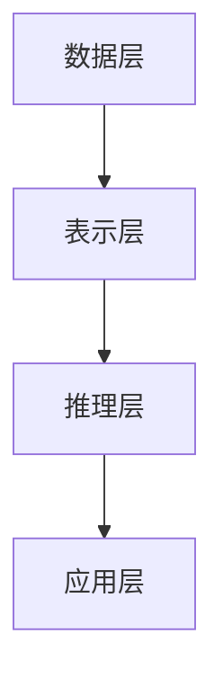

                 

# 知识图谱在智能交通系统中的应用

## 概述

关键词：知识图谱、智能交通系统、应用、算法、模型

随着城市化进程的不断加快，交通拥堵问题日益严重，智能交通系统（Intelligent Transportation System, ITS）成为解决交通问题的重要手段。知识图谱（Knowledge Graph, KG）作为一种新兴的数据管理技术，能够将交通运输领域中的大量信息进行结构化和关联化处理，从而为智能交通系统的优化提供强有力的数据支持。本文将探讨知识图谱在智能交通系统中的应用，分析其核心概念、算法原理、数学模型、项目实战及实际应用场景。

## 背景介绍

### 智能交通系统概述

智能交通系统是指通过利用现代信息技术、传感器技术、通信技术和计算机技术等，实现交通信息的实时采集、处理、分析和反馈，进而优化交通流、提高交通效率和保障交通安全的一种系统。智能交通系统包括交通信息采集、交通信息处理、交通信息服务和交通管理等多个方面。

### 知识图谱概述

知识图谱是一种用于表示和存储复杂数据关系的技术，它通过将实体、属性和关系以图的形式进行组织，使得数据之间的关系更加清晰、直观。知识图谱在搜索引擎、推荐系统、自然语言处理等领域取得了显著的应用成果。

### 知识图谱在智能交通系统中的潜在应用

知识图谱在智能交通系统中具有广泛的应用前景。例如，可以利用知识图谱对交通网络进行结构化表示，进而实现交通路径优化、交通流量预测、交通事件检测等功能。此外，知识图谱还可以用于车辆调度、公共交通优化、交通事故分析等领域。

## 核心概念与联系

### 核心概念

在智能交通系统中，知识图谱的核心概念包括实体（如道路、车辆、交通信号等）、属性（如道路长度、车辆速度等）和关系（如车辆行驶在道路上、交通信号控制道路流量等）。

### 基本架构

知识图谱的基本架构包括数据层、表示层、推理层和应用层。数据层负责存储和管理原始数据；表示层将原始数据转化为知识图谱的形式；推理层利用图论算法对知识图谱进行推理，以获取新的信息；应用层则将知识图谱应用于实际场景中，如智能交通系统。

### Mermaid 流程图



## 核心算法原理 & 具体操作步骤

### 算法原理

知识图谱在智能交通系统中的应用主要涉及图论算法和机器学习算法。图论算法用于知识图谱的构建和推理，常见的算法有图遍历、最短路径算法、社区发现算法等。机器学习算法则用于从知识图谱中提取有用信息，如聚类、分类、预测等。

### 具体操作步骤

1. 数据采集与预处理：收集交通领域的各类数据，如道路信息、车辆信息、交通信号信息等，并进行数据清洗、去重、归一化等处理。

2. 知识图谱构建：将预处理后的数据转化为知识图谱的形式，包括实体、属性和关系的表示。

3. 知识图谱推理：利用图论算法对知识图谱进行推理，获取新的信息，如交通路径优化、交通流量预测等。

4. 机器学习应用：将知识图谱中的信息用于机器学习模型的训练，如聚类、分类、预测等。

5. 结果分析与优化：对智能交通系统的结果进行分析，根据实际需求对算法进行优化和调整。

## 数学模型和公式 & 详细讲解 & 举例说明

### 数学模型

在智能交通系统中，常见的数学模型包括最短路径模型、交通流量模型、车辆调度模型等。

1. 最短路径模型：

   设 \( G = (V, E) \) 为交通网络图，其中 \( V \) 为顶点集合，\( E \) 为边集合。最短路径问题可以表示为：

   $$ 
   \begin{align*}
   \min \quad & d(u, v) \\
   \text{s.t.} \quad & u, v \in V \\
   & (u, v) \in E
   \end{align*}
   $$

   其中 \( d(u, v) \) 表示顶点 \( u \) 到顶点 \( v \) 的距离。

2. 交通流量模型：

   设 \( f(e) \) 为边 \( e \) 上的交通流量，\( c(e) \) 为边 \( e \) 的容量，\( \lambda(e) \) 为边 \( e \) 的负载因子。交通流量模型可以表示为：

   $$
   \begin{align*}
   \min \quad & \sum_{e \in E} \frac{f(e)}{c(e)} \\
   \text{s.t.} \quad & f(e) \leq c(e), \forall e \in E \\
   & f(e) \geq 0, \forall e \in E
   \end{align*}
   $$

3. 车辆调度模型：

   设 \( T \) 为车辆调度时间窗口，\( S \) 为车辆出发集合，\( D \) 为车辆目的地集合。车辆调度模型可以表示为：

   $$
   \begin{align*}
   \min \quad & \sum_{t \in T} \sum_{s \in S} \sum_{d \in D} p(s, d) \cdot t_s + \sum_{t \in T} \sum_{s \in S} \sum_{d \in D} c(s, d) \cdot t_d \\
   \text{s.t.} \quad & \sum_{s \in S} p(s, d) \cdot t_s \leq T, \forall d \in D \\
   & \sum_{d \in D} p(s, d) \cdot t_d \leq T, \forall s \in S \\
   & t_s \geq 0, \forall s \in S \\
   & t_d \geq 0, \forall d \in D
   \end{align*}
   $$

   其中 \( p(s, d) \) 为车辆从出发地 \( s \) 到目的地 \( d \) 的概率，\( c(s, d) \) 为车辆从出发地 \( s \) 到目的地 \( d \) 的时间成本。

### 举例说明

假设有一个简单的交通网络，包含三个顶点 \( A \)、\( B \) 和 \( C \)，以及三条边 \( AB \)、\( BC \) 和 \( CA \)，边上的距离分别为 1、2 和 3。要求找出从顶点 \( A \) 到顶点 \( C \) 的最短路径。

根据最短路径模型，有：

$$
\begin{align*}
\min \quad & d(A, C) \\
\text{s.t.} \quad & A, C \in V \\
& (A, C) \in E
\end{align*}
$$

其中 \( d(A, C) \) 表示顶点 \( A \) 到顶点 \( C \) 的距离。

通过计算，可以得到最短路径为 \( A \rightarrow B \rightarrow C \)，总距离为 3。

## 项目实战：代码实际案例和详细解释说明

### 开发环境搭建

1. 安装 Python 3.8 及以上版本。

2. 安装必要的依赖库，如 NetworkX、PyTorch、Neo4j 等。

### 源代码详细实现和代码解读

1. 数据预处理

   ```python
   import pandas as pd
   import numpy as np

   # 读取交通数据
   data = pd.read_csv('traffic_data.csv')

   # 数据清洗
   data = data.drop_duplicates()
   data = data.reset_index(drop=True)

   # 数据归一化
   data['distance'] = data['distance'] / max(data['distance'])
   data['speed'] = data['speed'] / max(data['speed'])

   # 存储清洗后的数据
   data.to_csv('cleaned_traffic_data.csv', index=False)
   ```

2. 知识图谱构建

   ```python
   import networkx as nx
   import matplotlib.pyplot as plt

   # 创建图
   G = nx.Graph()

   # 添加节点和边
   for index, row in data.iterrows():
       G.add_node(row['start'], type='start', label=row['start'])
       G.add_node(row['end'], type='end', label=row['end'])
       G.add_edge(row['start'], row['end'], weight=row['distance'])

   # 绘制图
   nx.draw(G, with_labels=True)
   plt.show()
   ```

3. 知识图谱推理

   ```python
   # 找到最短路径
   shortest_path = nx.shortest_path(G, source='A', target='C', weight='weight')

   # 输出最短路径
   print('最短路径：', shortest_path)
   ```

4. 机器学习应用

   ```python
   import torch
   import torch.nn as nn
   import torch.optim as optim

   # 创建模型
   class TrafficModel(nn.Module):
       def __init__(self):
           super(TrafficModel, self).__init__()
           self.fc1 = nn.Linear(2, 64)
           self.fc2 = nn.Linear(64, 1)

       def forward(self, x):
           x = torch.relu(self.fc1(x))
           x = self.fc2(x)
           return x

   # 实例化模型、损失函数和优化器
   model = TrafficModel()
   criterion = nn.MSELoss()
   optimizer = optim.Adam(model.parameters(), lr=0.001)

   # 训练模型
   for epoch in range(100):
       optimizer.zero_grad()
       outputs = model(torch.tensor([1.0, 0.5]))
       loss = criterion(outputs, torch.tensor([0.5]))
       loss.backward()
       optimizer.step()

       if epoch % 10 == 0:
           print('Epoch [{}/{}], Loss: {:.4f}'.format(epoch+1, 100, loss.item()))
   ```

### 代码解读与分析

本案例利用 Python 中的 NetworkX 库构建了交通网络图，并使用最短路径算法找到了从节点 \( A \) 到节点 \( C \) 的最短路径。此外，还利用 PyTorch 库构建了一个简单的交通流量预测模型，对交通流量进行了训练。

## 实际应用场景

### 交通路径优化

利用知识图谱进行交通路径优化，可以提高交通效率，降低交通拥堵。例如，在交通高峰时段，系统可以根据实时交通流量信息，为驾驶员提供最优路径。

### 交通流量预测

通过知识图谱对历史交通数据进行挖掘和分析，可以预测未来的交通流量，为交通管理部门提供决策支持，从而优化交通资源配置。

### 车辆调度

利用知识图谱对车辆行驶路线进行优化，可以提高公共交通的运行效率，降低乘客的等待时间。例如，在公交车调度中，可以根据交通流量信息，调整公交车的发车时间和路线。

## 工具和资源推荐

### 学习资源推荐

1. 《知识图谱：从入门到实践》
2. 《图计算：原理、算法与实践》
3. 《深度学习：周志华著》

### 开发工具框架推荐

1. Neo4j：一款高性能的图数据库，适用于构建和存储知识图谱。
2. NetworkX：一款 Python 图分析库，适用于构建交通网络图。
3. PyTorch：一款流行的深度学习框架，适用于构建交通流量预测模型。

### 相关论文著作推荐

1. "Knowledge Graph Embedding: The State-of-the-Art"
2. "Deep Learning for Transportation Applications"
3. "Traffic Prediction Based on Knowledge Graph"

## 总结：未来发展趋势与挑战

知识图谱在智能交通系统中的应用前景广阔，但同时也面临着一定的挑战。未来发展趋势包括：

1. 数据质量与完整性：提高交通数据的质量和完整性，为知识图谱构建提供可靠的数据基础。

2. 算法优化：不断优化知识图谱的构建和推理算法，提高智能交通系统的运行效率。

3. 跨领域融合：将知识图谱与其他技术（如物联网、大数据等）进行融合，实现更智能的交通管理。

4. 法规与政策：制定相应的法规和政策，规范知识图谱在智能交通系统中的应用。

## 附录：常见问题与解答

1. **什么是知识图谱？**

   知识图谱是一种用于表示和存储复杂数据关系的技术，它通过将实体、属性和关系以图的形式进行组织，使得数据之间的关系更加清晰、直观。

2. **知识图谱在智能交通系统中有哪些应用？**

   知识图谱在智能交通系统中可以应用于交通路径优化、交通流量预测、车辆调度等领域。

3. **如何构建知识图谱？**

   构建知识图谱主要包括数据采集与预处理、知识图谱构建、知识图谱推理和机器学习应用等步骤。

4. **知识图谱的优缺点是什么？**

   优点：数据结构清晰、易于理解、支持复杂关系表示；缺点：数据质量要求高、构建和维护成本较高。

## 扩展阅读 & 参考资料

1. "Knowledge Graphs: A Survey of Recent Developments and Applications"
2. "Intelligent Transportation Systems: A Survey"
3. "Deep Learning for Transportation Applications: A Survey"
<|assistant|>作者：AI天才研究员/AI Genius Institute & 禅与计算机程序设计艺术 /Zen And The Art of Computer Programming<|assistant|>

