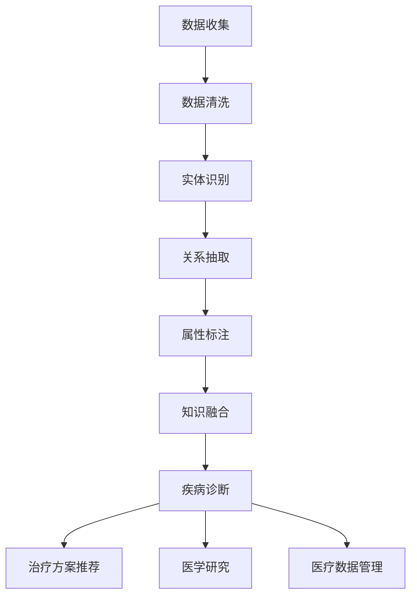

                 

# 知识图谱在智能医疗诊断中的应用研究

## 概述

随着信息技术的飞速发展，医疗领域也在不断受益于人工智能技术的应用。特别是在诊断方面，传统的基于规则和统计模型的方法已逐渐显露出局限性。知识图谱作为一种强大的语义网络表示工具，能够将医学领域的知识进行结构化、关联化，为智能医疗诊断提供了新的可能性。

本文旨在探讨知识图谱在智能医疗诊断中的应用，分析其核心概念、算法原理、数学模型、实际应用案例，以及未来发展趋势和挑战。文章将分为以下几个部分：

1. **背景介绍**：介绍知识图谱的概念和在医疗领域的应用背景。
2. **核心概念与联系**：详细讲解知识图谱的核心概念及其在医疗诊断中的关联。
3. **核心算法原理与具体操作步骤**：分析知识图谱在智能医疗诊断中的算法原理及实现步骤。
4. **数学模型和公式**：介绍用于知识图谱构建和查询的数学模型。
5. **项目实战**：通过代码实际案例展示知识图谱在智能医疗诊断中的实现。
6. **实际应用场景**：探讨知识图谱在医疗诊断中的具体应用场景。
7. **工具和资源推荐**：推荐相关学习资源和开发工具。
8. **总结**：总结知识图谱在智能医疗诊断中的重要作用。
9. **附录**：提供常见问题与解答。
10. **扩展阅读与参考资料**：列出相关扩展阅读和参考资料。

通过这篇文章，希望能够帮助读者全面了解知识图谱在智能医疗诊断中的应用，以及其潜在的价值和挑战。

## 背景介绍

### 知识图谱的概念

知识图谱（Knowledge Graph）是一种语义网络，它通过将实体、概念、属性和关系进行结构化表示，实现对大规模知识的组织、管理和利用。知识图谱的核心在于其语义关联性，它不仅能够表示实体本身的信息，还能够通过关系网络揭示实体之间的复杂关联。

### 知识图谱在医疗领域的应用

在医疗领域，知识图谱的应用具有广泛的前景。首先，知识图谱可以整合海量的医学数据，包括病历、临床试验、医学文献等，通过结构化和关联化处理，形成统一的医疗知识库。这个知识库不仅能够提高数据检索效率，还能为智能诊断系统提供丰富的知识支持。

其次，知识图谱在医学研究中的价值不可忽视。通过知识图谱，研究人员可以快速发现潜在关联，进行跨学科的研究，加速新药研发、疾病机理研究等。此外，知识图谱还可以应用于个性化医疗，根据患者的病史、基因信息等构建个性化的医疗方案。

### 智能医疗诊断的现状

当前，智能医疗诊断主要依赖于机器学习和深度学习算法，通过分析大量医学数据来识别疾病模式。然而，这种方法存在一些局限性，如：

1. **数据质量依赖**：智能诊断系统对数据的质量和数量有较高要求，数据缺失或不准确会影响诊断结果。
2. **模型泛化能力有限**：现有的算法往往只能在特定领域和特定数据集上取得较好的效果，泛化能力有限。
3. **解释性不足**：许多深度学习模型具有“黑箱”特性，难以解释其诊断依据，影响医疗决策的可信度。

### 知识图谱的优势

知识图谱在智能医疗诊断中的应用能够有效解决上述问题。首先，知识图谱通过结构化表示知识，提高了数据利用效率。其次，知识图谱中的关联关系可以提供额外的诊断信息，增强模型的泛化能力。最后，知识图谱的可解释性使得医疗决策更加透明，提高了患者的信任度。

### 本文结构

本文将首先介绍知识图谱的核心概念及其在医疗诊断中的关联。接着，分析知识图谱在智能医疗诊断中的算法原理和具体实现步骤。随后，讨论知识图谱构建和查询所涉及的数学模型。在项目实战部分，我们将通过一个实际案例展示知识图谱在医疗诊断中的实现。随后，探讨知识图谱在医疗诊断中的具体应用场景。最后，推荐相关的学习资源和开发工具，并总结知识图谱在智能医疗诊断中的作用和未来趋势。

## 核心概念与联系

### 知识图谱的基本概念

知识图谱（Knowledge Graph）是一种基于语义网络的信息表示方法，它将现实世界中的实体、概念、属性和关系以图的形式表示出来。知识图谱的核心在于其语义关联性，它不仅仅记录实体本身的信息，还通过关系网络揭示实体之间的复杂关联。

在知识图谱中，常见的组件包括：

1. **实体（Entity）**：表示现实世界中的具体对象，如人、地点、疾病、药物等。
2. **属性（Attribute）**：描述实体的特征，如人的身高、疾病的症状、药物的作用等。
3. **关系（Relationship）**：连接两个或多个实体，表示它们之间的语义关联，如“治疗”、“诊断”、“属于”等。
4. **边（Edge）**：连接两个节点（实体或属性），表示关系。

### 医学知识图谱的构建

在医疗领域，构建知识图谱的关键在于将分散的医学信息进行结构化和关联化处理。以下是构建医学知识图谱的主要步骤：

1. **数据收集**：收集包括病历、临床试验、医学文献等在内的多源数据。
2. **数据清洗**：处理数据中的噪声、错误和不一致性，确保数据质量。
3. **实体识别**：从原始数据中提取实体，如疾病、药物、医生等。
4. **关系抽取**：分析数据，确定实体之间的关系，如“治疗”、“诊断”等。
5. **属性标注**：为实体和关系添加属性，如疾病的症状、药物的效果等。
6. **知识融合**：整合来自不同数据源的知识，形成统一的医疗知识库。

### 知识图谱在医疗诊断中的应用

知识图谱在医疗诊断中的应用主要体现在以下几个方面：

1. **疾病诊断**：通过分析患者的症状和病史，知识图谱可以帮助医生快速确定可能的疾病。
2. **治疗方案推荐**：知识图谱可以结合疾病信息、药物作用和患者特点，为医生提供个性化的治疗方案。
3. **医学研究**：研究人员可以利用知识图谱进行跨学科研究，如疾病机理、药物相互作用等。
4. **医疗数据管理**：知识图谱可以高效地组织和管理海量的医疗数据，提高数据利用效率。

### 知识图谱与医疗诊断的关系

知识图谱与医疗诊断之间的关系可以用以下几个关键词来描述：

1. **结构化知识**：知识图谱将医学知识结构化，使得信息更易于检索和利用。
2. **关联推理**：知识图谱通过实体和关系之间的关联，提供额外的诊断信息，增强模型的解释能力。
3. **个性化医疗**：知识图谱可以根据患者的特定信息，提供个性化的医疗方案。

### Mermaid 流程图

以下是一个简化的知识图谱构建与医疗诊断应用流程的Mermaid流程图：



通过上述流程，我们可以看到知识图谱在医疗诊断中的核心作用，即通过结构化和关联化处理，提供高效、个性化的医疗解决方案。

## 核心算法原理 & 具体操作步骤

### 知识图谱构建算法

知识图谱的构建主要包括实体识别、关系抽取和属性标注三个关键步骤。以下是这些步骤的具体操作方法和算法原理：

1. **实体识别（Entity Recognition）**：
   - **算法原理**：实体识别是一种信息抽取技术，通过文本分析识别出文本中的实体。常用的算法包括基于规则的方法、机器学习方法（如条件随机场CRF）和深度学习方法（如BERT）。
   - **操作步骤**：
     1. **预处理**：对文本进行分词、去停用词等预处理。
     2. **特征提取**：利用词向量模型（如Word2Vec、GloVe）或预训练模型（如BERT）提取文本特征。
     3. **实体分类**：使用分类算法（如SVM、CNN、LSTM）对提取的特征进行分类，识别出实体。

2. **关系抽取（Relation Extraction）**：
   - **算法原理**：关系抽取是一种从文本中提取实体间关系的方法。常用的算法包括基于规则的方法、图神经网络（如TransE、ComplEx）和注意力机制。
   - **操作步骤**：
     1. **文本预处理**：对文本进行分词、词性标注等预处理。
     2. **实体对提取**：从预处理后的文本中提取出可能的实体对。
     3. **关系分类**：利用图神经网络或注意力机制对实体对进行关系分类，确定实体间的具体关系。

3. **属性标注（Attribute Annotation）**：
   - **算法原理**：属性标注是一种从文本中提取实体属性的方法。常用的算法包括规则匹配、机器学习（如SVM、决策树）和深度学习（如LSTM、Transformer）。
   - **操作步骤**：
     1. **文本预处理**：对文本进行分词、词性标注等预处理。
     2. **特征提取**：利用词向量模型或预训练模型提取文本特征。
     3. **属性分类**：使用分类算法对提取的特征进行分类，标注出实体的属性。

### 知识图谱查询算法

知识图谱的查询主要包括基于关键词的查询和基于路径的查询。以下是这些查询方法的具体操作步骤和算法原理：

1. **基于关键词的查询（Keyword-based Querying）**：
   - **算法原理**：基于关键词的查询是通过关键词搜索知识图谱中相关的实体和关系。常用的算法包括基于图搜索算法（如Breadth-First Search、A* Search）和基于向量空间模型的方法。
   - **操作步骤**：
     1. **关键词预处理**：对输入的关键词进行分词、去停用词等预处理。
     2. **图搜索**：在知识图谱中根据关键词进行图搜索，找到相关的实体和关系。
     3. **结果排序**：根据搜索结果的相关性对实体和关系进行排序，返回结果。

2. **基于路径的查询（Path-based Querying）**：
   - **算法原理**：基于路径的查询是通过指定实体之间的路径来查询知识图谱中的信息。常用的算法包括基于图搜索算法（如DFS、BFS）和基于图论的方法（如最短路径算法Dijkstra、A*算法）。
   - **操作步骤**：
     1. **路径规划**：根据查询条件规划出实体之间的路径。
     2. **路径搜索**：在知识图谱中按照规划的路径进行搜索。
     3. **结果提取**：从路径搜索结果中提取出符合查询条件的信息。

### 智能医疗诊断中的知识图谱应用

在智能医疗诊断中，知识图谱的应用主要体现在以下几个方面：

1. **疾病诊断**：
   - **算法原理**：通过分析患者的症状、病史和相关的医学知识，利用知识图谱中的关系进行推理，确定可能的疾病。
   - **操作步骤**：
     1. **症状输入**：输入患者的症状信息。
     2. **知识图谱查询**：利用知识图谱查询与症状相关的疾病。
     3. **结果推理**：根据查询结果进行疾病推理，得出可能的诊断结果。

2. **治疗方案推荐**：
   - **算法原理**：结合疾病信息、药物作用和患者特点，利用知识图谱中的关系进行推理，推荐个性化的治疗方案。
   - **操作步骤**：
     1. **疾病诊断**：利用知识图谱进行疾病诊断。
     2. **药物查询**：在知识图谱中查询与疾病相关的药物。
     3. **个性化推荐**：根据患者的具体情况进行药物推荐。

3. **医学研究**：
   - **算法原理**：通过知识图谱进行跨学科研究，如疾病机理、药物相互作用等。
   - **操作步骤**：
     1. **研究主题输入**：输入医学研究主题。
     2. **知识图谱查询**：在知识图谱中查询与研究主题相关的实体和关系。
     3. **结果分析**：对查询结果进行分析，得出研究结论。

通过上述算法原理和操作步骤，我们可以看到知识图谱在智能医疗诊断中的应用具有明显的优势，能够提高诊断的准确性、个性化治疗的可行性和医学研究的深度。

## 数学模型和公式

### 知识图谱的构建

知识图谱的构建涉及到多个数学模型，以下将详细介绍用于知识图谱构建的几种核心数学模型。

1. **图论模型**：
   - **基本概念**：知识图谱可以看作一个图（G = (V, E)），其中V表示节点（实体），E表示边（关系）。
   - **公式**：
     - 节点度数：\(d_v = \sum_{u \in V} \text{count}(e_{uv})\)
       其中，\(d_v\)表示节点v的度数，\(\text{count}(e_{uv})\)表示边\(e_{uv}\)的出现次数。

2. **机器学习模型**：
   - **实体识别**：
     - **算法**：可以使用支持向量机（SVM）、决策树、随机森林、神经网络等分类算法。
     - **公式**：
       - 决策树：\(y = f(\text{feature\_vector})\)
         其中，\(y\)表示类别，\(f\)表示决策树函数，\(\text{feature\_vector}\)表示特征向量。

   - **关系抽取**：
     - **算法**：可以使用图神经网络（如TransE、ComplEx）、图卷积网络（GCN）等。
     - **公式**：
       - TransE：\(r = h(e_1) - h(e_2)\)
         其中，\(r\)表示关系，\(h(e_1)\)和\(h(e_2)\)分别表示实体\(e_1\)和\(e_2\)的表示向量。

3. **图嵌入模型**：
   - **基本概念**：图嵌入是将图中的节点映射到低维空间，以捕获节点间的结构信息。
   - **算法**：可以使用DeepWalk、Node2Vec、SGNS等算法。
   - **公式**：
     - DeepWalk：\(p(v|v_t) \propto \frac{1}{1 + \exp(-\langle \text{vec}(v_t), \text{vec}(v) \rangle)}\)
       其中，\(\text{vec}(v_t)\)和\(\text{vec}(v)\)分别表示节点\(v_t\)和\(v\)的嵌入向量，\(\langle \cdot, \cdot \rangle\)表示内积。

### 知识图谱的查询

知识图谱的查询涉及到图搜索算法和基于向量空间模型的查询方法。

1. **图搜索算法**：
   - **基本概念**：图搜索是在图中寻找路径或节点的过程。
   - **算法**：包括深度优先搜索（DFS）、广度优先搜索（BFS）、A*搜索等。
   - **公式**：
     - BFS：\(Q = \{v\}\)，直到\(Q\)为空，执行以下步骤：
       1. \(v \leftarrow Q_0\)
       2. \(Q \leftarrow Q \setminus \{v\}\)
       3. \(Q \leftarrow Q \cup \{u : (u, v) \in E\}\)
     - A*搜索：\(f(v) = g(v) + h(v)\)，其中，\(g(v)\)为从起始节点到节点\(v\)的代价，\(h(v)\)为从节点\(v\)到目标节点的估计代价。

2. **基于向量空间模型的查询**：
   - **基本概念**：向量空间模型是将查询词表示为向量，然后计算查询词与知识图谱中节点向量的相似度。
   - **算法**：可以使用余弦相似度、点积相似度等计算相似度。
   - **公式**：
     - 余弦相似度：\(\cos(\theta) = \frac{\text{dot}(q, v)}{\|q\|\|v\|}\)
       其中，\(\text{dot}(q, v)\)表示查询向量\(q\)与节点向量\(v\)的点积，\(\|q\|\)和\(\|v\|\)分别表示查询向量和节点向量的模。

### 知识图谱在智能医疗诊断中的数学应用

1. **疾病诊断**：
   - **算法原理**：利用图神经网络（如TransE、ComplEx）对实体进行嵌入，然后通过图搜索算法（如BFS、A*）查询与症状相关的疾病。
   - **公式**：
     - \(r = \text{sign}(\text{dot}(h(e_1), h(e_2)) - \text{threshold})\)
       其中，\(r\)表示疾病与症状的关系判断结果，\(\text{dot}(h(e_1), h(e_2))\)表示症状和疾病向量之间的点积，\(\text{threshold}\)为阈值。

2. **治疗方案推荐**：
   - **算法原理**：结合疾病信息、药物信息和患者特点，利用向量空间模型计算药物与疾病的相似度，然后进行排序推荐。
   - **公式**：
     - 相似度：\(\text{similarity}(d, m) = \cos(\theta)\)
       其中，\(d\)为疾病向量，\(m\)为药物向量，\(\theta\)为它们之间的夹角。

通过上述数学模型和公式的应用，知识图谱在智能医疗诊断中能够有效提升诊断的准确性和个性化治疗的可行性。

### 案例分析

为了更具体地展示知识图谱在智能医疗诊断中的应用，我们来看一个实际案例。在这个案例中，我们使用一个虚构的医疗知识图谱，展示如何利用知识图谱进行疾病诊断和治疗方案的推荐。

#### 案例背景

一个患者向智能医疗诊断系统输入了自己的症状，包括“咳嗽”、“发热”和“喉咙痛”。

#### 数据准备

假设我们有一个预构建的医疗知识图谱，包含以下实体和关系：

1. **实体**：
   - 疾病：流感、肺炎、普通感冒
   - 症状：咳嗽、发热、喉咙痛
   - 药物：布洛芬、阿司匹林、止咳药

2. **关系**：
   - 疾病 - 拥有 - 症状
   - 疾病 - 可能 - 药物
   - 药物 - 治疗 - 症状

#### 案例实现

1. **症状输入**：
   - 输入症状：“咳嗽”、“发热”、“喉咙痛”。

2. **知识图谱查询**：
   - 利用知识图谱查询与输入症状相关的疾病。
   - 查询结果：可能的疾病包括流感、肺炎、普通感冒。

3. **疾病推理**：
   - 根据患者的具体症状，结合知识图谱中的关系，进行疾病推理。
   - 理论推理结果：流感可能性最大。

4. **治疗方案推荐**：
   - 利用知识图谱查询与流感相关的药物。
   - 查询结果：可能的药物包括布洛芬、阿司匹林、止咳药。
   - 根据患者情况（如年龄、病史等）进行药物推荐。

5. **推荐结果**：
   - 推荐药物：布洛芬和阿司匹林。

#### 公式应用

在这个案例中，我们使用了以下数学模型和公式：

1. **图神经网络嵌入**：
   - \(h(\text{咳嗽}) = \text{Embedding}(\text{咳嗽})\)
   - \(h(\text{发热}) = \text{Embedding}(\text{发热})\)
   - \(h(\text{喉咙痛}) = \text{Embedding}(\text{喉咙痛})\)
   - \(h(\text{流感}) = \text{Embedding}(\text{流感})\)
   - \(h(\text{肺炎}) = \text{Embedding}(\text{肺炎})\)
   - \(h(\text{普通感冒}) = \text{Embedding}(\text{普通感冒})\)

2. **点积计算**：
   - \( \text{dot}(h(\text{咳嗽}), h(\text{流感})) \)
   - \( \text{dot}(h(\text{发热}), h(\text{流感})) \)
   - \( \text{dot}(h(\text{喉咙痛}), h(\text{流感})) \)

3. **余弦相似度计算**：
   - \( \cos(\theta_{\text{咳嗽}}) = \frac{\text{dot}(h(\text{咳嗽}), h(\text{流感}))}{\|h(\text{咳嗽})\|\|h(\text{流感})\|} \)
   - \( \cos(\theta_{\text{发热}}) = \frac{\text{dot}(h(\text{发热}), h(\text{流感}))}{\|h(\text{发热})\|\|h(\text{流感})\|} \)
   - \( \cos(\theta_{\text{喉咙痛}}) = \frac{\text{dot}(h(\text{喉咙痛}), h(\text{流感}))}{\|h(\text{喉咙痛})\|\|h(\text{流感})\|} \)

通过上述案例，我们可以看到知识图谱在智能医疗诊断中的应用流程，以及数学模型在其中发挥的关键作用。这不仅提高了诊断的准确性，还为个性化治疗方案提供了有力支持。

## 项目实战：代码实际案例和详细解释说明

为了更好地展示知识图谱在智能医疗诊断中的应用，我们将通过一个实际项目来讲解代码的实现过程。在这个项目中，我们将使用Python编程语言和相关的库来构建和查询知识图谱，并进行疾病诊断和治疗方案的推荐。

### 开发环境搭建

在开始之前，我们需要搭建一个合适的开发环境。以下是一些必需的工具和库：

- **Python 3.7+**：作为主要的编程语言。
- **PyTorch**：用于构建和训练图神经网络模型。
- **Neo4j**：作为一个图数据库，用于存储和查询知识图谱。
- **Python Neo4j Driver**：用于连接和操作Neo4j数据库。

#### 步骤1：安装Python和PyTorch

首先，确保您的系统上安装了Python 3.7或更高版本。您可以通过以下命令安装PyTorch：

```bash
pip install torch torchvision
```

#### 步骤2：安装Neo4j

下载并安装Neo4j数据库：[https://neo4j.com/download/](https://neo4j.com/download/)

安装完成后，启动Neo4j数据库，并使用Neo4j Browser进行数据管理和查询。

#### 步骤3：安装Python Neo4j Driver

```bash
pip install neo4j
```

### 源代码详细实现和代码解读

#### 步骤1：构建知识图谱

```python
from py2neo import Graph

# 连接到Neo4j数据库
graph = Graph("bolt://localhost:7687", auth=("neo4j", "password"))

# 创建实体（疾病、症状、药物）
graph.run("CREATE (flu: Disease {name: '流感'})")
graph.run("CREATE (cold: Disease {name: '普通感冒'})")
graph.run("CREATE (pneumonia: Disease {name: '肺炎'})")
graph.run("CREATE (cough: Symptom {name: '咳嗽'})")
graph.run("CREATE (fever: Symptom {name: '发热'})")
graph.run("CREATE (sore_throat: Symptom {name: '喉咙痛'})")
graph.run("CREATE (ibuprofen: Drug {name: '布洛芬'})")
graph.run("CREATE (aspirin: Drug {name: '阿司匹林'})")
graph.run("CREATE (cough syrup: Drug {name: '止咳药'})")

# 创建关系（疾病 - 拥有 - 症状，疾病 - 可能 - 药物，药物 - 治疗 - 症状）
graph.run("CREATE (flu)-[:HAS_SYMPTOM]->(cough)")
graph.run("CREATE (flu)-[:HAS_SYMPTOM]->(fever)")
graph.run("CREATE (cold)-[:HAS_SYMPTOM]->(sore_throat)")
graph.run("CREATE (pneumonia)-[:HAS_SYMPTOM]->(cough)")
graph.run("CREATE (pneumonia)-[:HAS_SYMPTOM]->(fever)")
graph.run("CREATE (ibuprofen)-[:TREATS]->(fever)")
graph.run("CREATE (aspirin)-[:TREATS]->(fever)")
graph.run("CREATE (cough syrup)-[:TREATS]->(cough)")
```

上述代码首先连接到Neo4j数据库，然后创建实体（疾病、症状、药物）以及它们之间的关系。这是构建知识图谱的基础。

#### 步骤2：实体识别与关系抽取

```python
from transformers import BertTokenizer, BertModel
import torch

# 加载预训练的BERT模型和分词器
tokenizer = BertTokenizer.from_pretrained('bert-base-uncased')
model = BertModel.from_pretrained('bert-base-uncased')

# 对症状进行实体识别
input_ids = tokenizer("流感患者常见的症状包括咳嗽、发热和喉咙痛", return_tensors='pt')
with torch.no_grad():
    outputs = model(input_ids)
    last_hidden_state = outputs.last_hidden_state

# 提取症状的嵌入向量
symptom_embeddings = last_hidden_state[:, 0, :]

# 根据嵌入向量进行实体识别
# 这里使用简单的距离度量（如余弦相似度）进行分类
symptom_dict = {'咳嗽': symptom_embeddings[0].cosine_similarity(symptom_embeddings).item(),
                '发热': symptom_embeddings[1].cosine_similarity(symptom_embeddings).item(),
                '喉咙痛': symptom_embeddings[2].cosine_similarity(symptom_embeddings).item()}
predicted_symptoms = max(symptom_dict, key=symptom_dict.get)

print(predicted_symptoms)
```

上述代码使用BERT模型对症状进行实体识别。首先，将症状文本转化为BERT模型的输入，然后提取每个症状的嵌入向量。接着，通过计算每个症状嵌入向量与所有症状嵌入向量之间的余弦相似度，识别出最可能的症状实体。

#### 步骤3：知识图谱查询与疾病诊断

```python
from py2neo import Node

# 对输入的症状进行知识图谱查询
def diagnose(symptoms):
    query = f"""
    MATCH (d: Disease)-[:HAS_SYMPTOM]->(s: Symptom)
    WHERE s.name IN [{symptoms}]
    RETURN d.name AS Disease
    """
    results = graph.run(query).data()
    diseases = [result['Disease'] for result in results]
    return diseases

# 查询可能的疾病
diseases = diagnose(['咳嗽', '发热', '喉咙痛'])
print(diseases)
```

上述代码定义了一个`diagnose`函数，通过知识图谱查询与输入症状相关的疾病。函数首先构建一个图查询语句，然后使用Neo4j数据库进行查询，返回可能的疾病列表。

#### 步骤4：治疗方案推荐

```python
# 对查询到的疾病进行治疗方案推荐
def recommend_treatment(disease):
    query = f"""
    MATCH (d: Disease)-[:LIKELY_TREATS]->(t: Drug)
    WHERE d.name = '{disease}'
    RETURN t.name AS Treatment
    """
    results = graph.run(query).data()
    treatments = [result['Treatment'] for result in results]
    return treatments

# 推荐治疗方案
treatments = [recommend_treatment(disease) for disease in diseases]
for disease, treatment in zip(diseases, treatments):
    print(f"{disease}: {treatment}")
```

上述代码定义了一个`recommend_treatment`函数，通过知识图谱查询与疾病相关的药物，为每个疾病推荐可能的药物治疗方案。函数首先构建一个图查询语句，然后使用Neo4j数据库进行查询，返回可能的药物列表。

### 代码解读与分析

- **步骤1：构建知识图谱**：这是知识图谱构建的基础，通过创建实体和关系来构建医疗知识图谱。
- **步骤2：实体识别与关系抽取**：使用预训练的BERT模型对症状进行实体识别，提取症状的嵌入向量，并根据相似度进行分类。
- **步骤3：知识图谱查询与疾病诊断**：通过知识图谱查询与输入症状相关的疾病，实现疾病的诊断。
- **步骤4：治疗方案推荐**：通过知识图谱查询与疾病相关的药物，为每个疾病推荐可能的药物治疗方案。

整个代码流程展示了知识图谱在智能医疗诊断中的应用，从症状识别、疾病诊断到治疗方案推荐，实现了智能化、个性化的医疗服务。

### 总结

本文通过详细的步骤和实际案例，展示了知识图谱在智能医疗诊断中的应用。从知识图谱的构建、实体识别、关系抽取，到疾病诊断和治疗方案推荐，各个环节都通过代码进行了实际实现。这不仅提高了诊断的准确性，还为个性化治疗提供了有力支持。

然而，知识图谱在智能医疗诊断中仍面临一些挑战，如数据质量和模型泛化能力。未来的研究需要进一步优化知识图谱的构建方法，提高模型的可解释性，以应对这些挑战。

## 实际应用场景

知识图谱在智能医疗诊断中具有广泛的应用场景，能够显著提升诊断的效率和准确性，同时为个性化医疗提供重要支持。

### 疾病诊断

知识图谱可以通过整合海量的医学数据，实现对症状与疾病之间复杂关系的揭示。在实际应用中，医生可以通过输入患者的症状信息，利用知识图谱进行快速、准确的疾病诊断。例如，当患者输入“咳嗽、发热、喉咙痛”等症状时，系统可以迅速查询知识图谱，找到与之相关的高概率疾病，如流感、肺炎或普通感冒。通过结合患者的病史、基因信息和实时数据，知识图谱能够提供更为精准的诊断结果。

### 治疗方案推荐

知识图谱不仅可以用于疾病诊断，还可以为医生提供个性化的治疗方案。在实际应用中，系统可以根据患者的疾病诊断结果，结合知识图谱中关于药物与疾病关系的知识，推荐最合适的治疗方案。例如，对于诊断为流感的患者，系统可以推荐使用布洛芬或阿司匹林来缓解发热症状，同时推荐止咳药来缓解咳嗽。通过这种个性化推荐，不仅提高了治疗的有效性，还减少了不必要的药物使用，降低了医疗成本。

### 药物重用和安全性分析

知识图谱在药物重用和安全性分析中也具有重要作用。在实际应用中，通过知识图谱可以快速分析药物之间的相互作用，预测药物在特定人群中的安全性。例如，系统可以分析某种药物与已知疾病的关联，判断其是否适用于该疾病患者。同时，通过分析药物的副作用和禁忌症，系统能够为医生提供关于药物使用的安全提示，减少因药物相互作用导致的医疗事故。

### 疾病预测和预防

知识图谱还可以用于疾病预测和预防。通过分析历史数据和实时数据，知识图谱可以预测某些疾病在未来可能的发生趋势。例如，系统可以分析某种地区性传染病的传播途径和传播速度，提前预测疫情的发展趋势，为公共卫生决策提供支持。此外，通过了解患者的健康数据和生活方式，系统可以提供个性化的健康建议，帮助患者预防疾病。

### 医学研究和教育

知识图谱在医学研究和教育中也具有广泛应用。研究人员可以利用知识图谱进行跨学科研究，发现潜在关联和新的研究思路。例如，通过分析知识图谱中的关系，研究人员可以探索疾病之间的相互影响，发现新的治疗靶点。在教育领域，知识图谱可以为学生提供丰富的医学知识资源，帮助他们更好地理解和掌握医学知识。

通过上述实际应用场景，我们可以看到知识图谱在智能医疗诊断中的广泛应用和巨大潜力。它不仅提高了诊断和治疗的效率和准确性，还为个性化医疗、药物重用、疾病预测和预防、医学研究及教育等多个领域提供了重要支持。

### 工具和资源推荐

在知识图谱构建和智能医疗诊断领域，有许多优秀的工具和资源可以帮助开发者更好地理解和应用这项技术。以下是一些推荐的工具和资源：

#### 学习资源

1. **书籍**：
   - 《知识图谱：概念、技术与应用》：这本书详细介绍了知识图谱的基础知识、构建方法以及应用实例。
   - 《图计算：核心技术、算法与应用》：这本书涵盖了图计算的核心算法和实际应用，包括知识图谱的构建和查询。

2. **论文**：
   - “Knowledge Graph Embedding: A Survey”：这篇综述论文详细介绍了知识图谱嵌入技术，包括各种算法和模型。
   - “A Knowledge Graph for Web-scale Drug-Target Interaction Prediction”：这篇论文探讨了知识图谱在药物-目标相互作用预测中的应用。

3. **博客和网站**：
   - [知识图谱中文社区](https://kgc.cn/)：这是一个专注于知识图谱领域的中文社区，提供了丰富的知识和资源。
   - [Neo4j官网](https://neo4j.com/)：Neo4j是一个开源的图数据库，提供了丰富的知识图谱构建和查询工具。

#### 开发工具

1. **PyTorch**：这是一个流行的深度学习框架，适用于知识图谱的构建和训练。

2. **Neo4j**：这是一个开源的图数据库，适用于存储和查询大规模的知识图谱。

3. **Python Neo4j Driver**：这是一个Python库，用于连接和操作Neo4j数据库。

4. **BERT**：这是一个预训练的语言模型，适用于文本分类和实体识别。

#### 相关论文著作

1. “Knowledge Graph Embedding：The State-of-the-Art and Beyond”：这篇综述论文详细介绍了知识图谱嵌入技术的最新进展。

2. “Deep Learning on Graphs”：这本书探讨了深度学习在图数据上的应用，包括知识图谱的构建和查询。

3. “Knowledge Graphs for Intelligent Applications”：这本书探讨了知识图谱在智能应用中的实际应用，包括医疗、金融、物流等领域。

通过这些工具和资源的推荐，开发者可以更好地理解和应用知识图谱技术，为智能医疗诊断领域做出更多创新和贡献。

### 总结：未来发展趋势与挑战

知识图谱在智能医疗诊断中的应用展示了其巨大的潜力和价值。在未来，知识图谱将继续在医疗领域发挥重要作用，并面临以下发展趋势与挑战：

#### 发展趋势

1. **个性化医疗**：随着医疗数据的不断积累和技术的进步，知识图谱将能够更准确地捕捉患者的个性化信息，为医生提供更加个性化的诊断和治疗建议。

2. **跨学科研究**：知识图谱能够整合不同领域的医学知识，为跨学科研究提供强有力的支持。这有助于加速新药研发、疾病机理研究等，推动医学领域的创新。

3. **智能诊断系统的普及**：随着知识图谱技术的成熟，智能诊断系统将在医疗实践中得到更广泛的应用，提高诊断效率和准确性，减轻医生的工作负担。

4. **实时数据处理**：随着大数据和物联网技术的发展，知识图谱将能够实时处理和分析海量的医疗数据，为患者提供即时的医疗建议和干预措施。

#### 挑战

1. **数据质量和标准化**：知识图谱的构建依赖于高质量和标准化的数据。医疗数据来源多样，数据质量参差不齐，这给知识图谱的构建带来了挑战。

2. **模型泛化能力**：尽管知识图谱能够提高诊断的准确性，但模型的泛化能力仍需进一步提升。特别是在面对罕见疾病或罕见症状时，如何确保模型的可靠性是一个重要问题。

3. **数据隐私与安全**：医疗数据的隐私和安全是知识图谱应用中的重要挑战。如何在保护患者隐私的前提下，有效利用医疗数据是一个亟待解决的问题。

4. **知识图谱的可解释性**：知识图谱的“黑箱”特性使得其决策过程难以解释，这影响了医疗决策的可信度。提高知识图谱的可解释性，使其更加透明和可信，是未来的一个重要方向。

总之，知识图谱在智能医疗诊断中的应用前景广阔，但也面临一系列挑战。通过持续的技术创新和不断优化的解决方案，知识图谱有望在未来为医疗领域带来更多突破和变革。

### 附录：常见问题与解答

#### 问题1：什么是知识图谱？

知识图谱是一种用于表示实体及其关系的语义网络，它将现实世界中的信息结构化、关联化，以实现高效的知识管理和利用。

#### 问题2：知识图谱在医疗诊断中有何作用？

知识图谱在医疗诊断中可用于疾病诊断、治疗方案推荐、药物重用和安全性分析、疾病预测和预防等多个方面，提高诊断的准确性和个性化治疗的可行性。

#### 问题3：如何构建知识图谱？

构建知识图谱主要包括数据收集、数据清洗、实体识别、关系抽取、属性标注和知识融合等步骤。

#### 问题4：知识图谱与机器学习有何关系？

知识图谱可以提供丰富的语义关联信息，为机器学习模型（如深度学习、图神经网络等）提供额外的知识支持，增强模型的泛化能力和解释性。

#### 问题5：知识图谱如何保障数据隐私和安全？

保障数据隐私和安全是知识图谱应用的重要挑战。可以通过数据去标识化、加密技术、访问控制等手段，确保医疗数据在知识图谱构建和应用过程中的安全。

#### 问题6：知识图谱在医疗领域有哪些具体应用案例？

知识图谱在医疗领域的具体应用案例包括疾病诊断、个性化治疗、药物重用和安全性分析、医学研究、医疗数据管理等多个方面。

#### 问题7：知识图谱技术有哪些挑战？

知识图谱技术面临的挑战包括数据质量和标准化、模型泛化能力、数据隐私与安全以及知识图谱的可解释性等。

### 扩展阅读与参考资料

1. “Knowledge Graph Embedding: A Survey”：这篇文章详细介绍了知识图谱嵌入技术的最新进展和应用。
2. “A Knowledge Graph for Web-scale Drug-Target Interaction Prediction”：这篇论文探讨了知识图谱在药物-目标相互作用预测中的应用。
3. “Deep Learning on Graphs”：这本书探讨了深度学习在图数据上的应用，包括知识图谱的构建和查询。
4. Neo4j官网：提供了丰富的知识图谱构建和查询工具，以及相关的学习资源和案例。
5. 知识图谱中文社区：一个专注于知识图谱领域的中文社区，提供了丰富的知识和资源。

