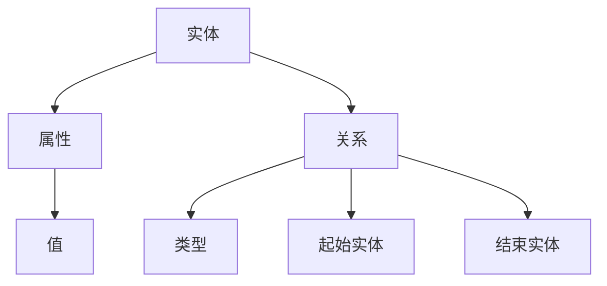

                 

### 背景介绍

知识图谱（Knowledge Graph）作为一种结构化、语义化的知识表示方法，近年来在各个领域得到了广泛的应用。特别是在智能教育领域，知识图谱不仅能够有效地组织和管理海量教育数据，还可以为教育系统的智能化提供强有力的支持。本文将深入探讨知识图谱在智能教育知识表示与推理中的技术实现与应用拓展。

智能教育是指利用信息技术，特别是人工智能技术，来优化和提升教育质量和效率。随着互联网的普及和数据量的爆炸性增长，传统的教育模式已无法满足现代教育的需求。智能教育系统通过大数据分析、知识图谱、自然语言处理等技术，实现了个性化学习、智能推荐、智能评估等功能，极大地提升了教学效果和学生的学习体验。

知识图谱作为一种强大的知识表示工具，已经在多个领域展现了其巨大的潜力。在搜索引擎中，知识图谱帮助搜索引擎更好地理解用户查询，提供更精准的搜索结果。在社交网络中，知识图谱用于建立用户之间的联系，推荐朋友和内容。在智能教育领域，知识图谱则用于构建复杂的教育知识网络，实现知识的自动化推理和智能化应用。

本文旨在探讨知识图谱在智能教育知识表示与推理中的技术实现与应用拓展，具体包括以下几个方面：

1. **知识图谱的核心概念与架构**：介绍知识图谱的基本概念，包括实体、属性、关系等，并给出一个简化的知识图谱架构图。

2. **核心算法原理与操作步骤**：分析知识图谱构建过程中的核心算法，如实体识别、关系抽取、知识融合等，并详细阐述每个步骤的具体操作方法。

3. **数学模型与公式**：介绍知识图谱构建过程中的数学模型，如概率模型、图论模型等，并给出相关的公式和推导。

4. **项目实战**：通过实际案例，展示如何使用知识图谱技术实现智能教育系统中的知识表示与推理功能。

5. **应用场景**：分析知识图谱在智能教育中的具体应用场景，如个性化学习、智能推荐、智能评估等。

6. **工具和资源推荐**：推荐一些学习资源、开发工具和框架，帮助读者更好地理解和应用知识图谱技术。

7. **总结与展望**：总结知识图谱在智能教育中的现状和未来发展趋势，探讨可能面临的挑战和解决方案。

本文将结合具体的案例和实例，逐步阐述知识图谱在智能教育知识表示与推理中的应用，旨在为相关领域的学者和从业者提供有价值的参考。接下来，我们将首先介绍知识图谱的核心概念与架构，为后续内容奠定基础。

---

### 核心概念与联系

知识图谱的核心概念主要包括实体（Entity）、属性（Attribute）和关系（Relationship）。这三个核心概念构成了知识图谱的基本元素，并且通过特定的方式相互联系，从而形成了一个结构化、语义化的知识网络。

#### 实体（Entity）

实体是知识图谱中最基本的构成元素，它代表了现实世界中的具体对象，如人、地点、事物等。例如，在一个关于大学教育的知识图谱中，实体可能包括学生、教师、课程、专业等。

#### 属性（Attribute）

属性是实体的特征描述，用于提供关于实体的详细信息。例如，对于一个学生实体，其属性可能包括姓名、年龄、性别、年级、专业等。属性通常以键值对的形式进行表示，如`("姓名", "张三")`。

#### 关系（Relationship）

关系描述了实体之间的关联，是知识图谱中的桥梁。关系通常包含两个部分：关系的起始实体和结束实体，以及关系的类型。例如，在一个大学教育知识图谱中，可以定义一个关系类型为“授课”，起始实体为“教师”，结束实体为“课程”。

#### 知识图谱架构

知识图谱的架构可以简单分为三个层次：底层是数据层，用于存储原始数据和预处理后的数据；中层是模型层，用于定义知识图谱的模型和算法；顶层是应用层，用于实现知识图谱在实际场景中的应用。

以下是知识图谱的一个简化的 Mermaid 流程图，展示了实体、属性和关系之间的联系：



在这个流程图中：

- A 表示实体。
- B 表示属性。
- C 表示属性的值。
- D 表示关系。
- E 表示关系的类型。
- F 表示关系的起始实体。
- G 表示关系的结束实体。

通过这样的结构化表示，知识图谱能够清晰地表达复杂的知识网络，为后续的知识表示与推理提供了坚实的基础。

---

### 核心算法原理 & 具体操作步骤

知识图谱的构建过程主要包括数据预处理、实体识别、关系抽取和知识融合等核心算法。以下是这些算法的具体原理和操作步骤。

#### 数据预处理

数据预处理是知识图谱构建的基础步骤，其目的是对原始数据进行清洗、标准化和结构化处理。

1. **数据清洗**：去除数据中的噪声和冗余信息，如缺失值、重复记录、异常值等。
2. **数据标准化**：统一不同来源的数据格式和单位，如日期、货币等。
3. **数据结构化**：将非结构化数据（如文本、图像等）转换为结构化数据（如实体、属性、关系等）。

#### 实体识别

实体识别是识别文本数据中的实体，并将其映射到知识图谱中的实体节点。

1. **词典匹配**：利用预定义的实体词典，将文本中的实体与词典中的实体进行匹配。
2. **命名实体识别（NER）**：利用自然语言处理技术，如条件随机场（CRF）或深度学习模型（如BERT），自动识别文本中的实体。
3. **实体链接**：将识别出的实体与知识图谱中的实体进行映射和链接，确保实体的一致性和唯一性。

#### 关系抽取

关系抽取是识别实体之间的语义关系，并将其映射到知识图谱中的关系节点。

1. **规则匹配**：利用预定义的规则，从文本数据中提取实体关系。
2. **监督学习**：使用标注好的训练数据集，训练关系抽取模型（如朴素贝叶斯、支持向量机等）。
3. **深度学习方法**：使用深度学习模型（如循环神经网络（RNN）、长短时记忆网络（LSTM）等）进行关系抽取。

#### 知识融合

知识融合是将来自不同来源的知识进行整合，确保知识的一致性和准确性。

1. **异构数据整合**：将不同数据源中的实体、属性和关系进行整合，解决数据冲突和一致性问题。
2. **本体映射**：使用本体（Ontology）技术，将不同数据源中的实体和关系进行映射和统一。
3. **一致性检验**：通过一致性检验算法，确保知识图谱中数据的一致性和准确性。

#### 操作步骤示例

以下是一个简单的知识图谱构建流程示例：

1. **数据预处理**：从互联网获取教育领域的文本数据，包括课程介绍、教师介绍、学生评价等。
2. **实体识别**：使用命名实体识别（NER）模型，识别文本中的实体，如“清华大学”、“计算机科学”等。
3. **关系抽取**：利用规则匹配和监督学习模型，抽取实体之间的关系，如“清华大学”与“计算机科学”之间的关系为“开设”。
4. **知识融合**：将不同数据源中的实体和关系进行整合，确保知识的一致性和准确性。
5. **构建知识图谱**：将预处理后的实体、属性和关系存储在图数据库中，形成一个结构化、语义化的知识网络。

通过上述步骤，我们可以构建出一个用于智能教育的知识图谱，为后续的知识表示与推理提供支持。

---

### 数学模型和公式 & 详细讲解 & 举例说明

在知识图谱的构建过程中，数学模型和公式起着至关重要的作用。以下将介绍几种常见的数学模型，并详细讲解其公式和推导过程，最后通过具体示例来说明如何应用这些模型。

#### 1. 概率模型

概率模型在知识图谱的实体识别和关系抽取中广泛应用。一种常用的概率模型是朴素贝叶斯（Naive Bayes）模型。

##### 朴素贝叶斯模型

**公式：**

$$
P(A|B) = \frac{P(B|A) \cdot P(A)}{P(B)}
$$

其中，$P(A|B)$ 表示在给定 $B$ 的情况下 $A$ 的概率，$P(B|A)$ 表示在给定 $A$ 的情况下 $B$ 的概率，$P(A)$ 和 $P(B)$ 分别表示 $A$ 和 $B$ 的概率。

**推导过程：**

假设有两个事件 $A$ 和 $B$，我们想要计算 $A$ 在 $B$ 发生条件下的概率。根据贝叶斯定理，我们有：

$$
P(A|B) = \frac{P(B|A) \cdot P(A)}{P(B)}
$$

**示例：**

假设我们想要判断一个文本中的实体是否是“大学”。我们可以使用朴素贝叶斯模型，通过计算实体“大学”出现的概率以及与“大学”相关的特征词的概率，来判断该实体是否为“大学”。

1. **计算 $P(A)$：** 实体“大学”在所有文本中出现的概率。
2. **计算 $P(B|A)$：** 在实体“大学”出现的文本中，“大学”相关特征词（如“清华大学”、“计算机科学”等）出现的概率。
3. **计算 $P(B)$：** 在所有文本中，“大学”相关特征词出现的概率。

通过上述三个概率，我们可以计算出 $P(A|B)$，从而判断该实体是否为“大学”。

#### 2. 图论模型

图论模型在知识图谱的构建和优化中广泛应用。一种常见的图论模型是图论中的最短路径算法。

##### 最短路径算法

**公式：**

$$
d(u, v) = \min_{\gamma} \{\sum_{i=1}^{n} w(u_i, v_i) | \gamma = (u_1, u_2, \ldots, u_n)\}
$$

其中，$d(u, v)$ 表示节点 $u$ 到节点 $v$ 的最短路径长度，$w(u_i, v_i)$ 表示节点 $u_i$ 到节点 $v_i$ 的边权重。

**推导过程：**

假设我们在一个加权图中寻找节点 $u$ 到节点 $v$ 的最短路径，我们可以使用迪杰斯特拉（Dijkstra）算法。该算法的基本思想是从源节点 $u$ 开始，逐步扩展到其他节点，每次扩展时选择当前已访问节点到未访问节点的最短路径。

**示例：**

假设有一个加权图，节点 $u$ 和节点 $v$ 之间的边权重如下：

$$
w(u, v) = 3 \\
w(u, x) = 5 \\
w(x, v) = 2
$$

我们需要计算节点 $u$ 到节点 $v$ 的最短路径长度。

1. **初始化**：将所有节点的最短路径长度初始化为无穷大，将源节点 $u$ 的最短路径长度初始化为 0。
2. **扩展**：从源节点 $u$ 开始，依次扩展到其他节点，每次扩展时选择当前已访问节点到未访问节点的最短路径。
3. **更新**：更新未访问节点的最短路径长度。

通过上述步骤，我们可以计算出节点 $u$ 到节点 $v$ 的最短路径长度。

#### 3. 知识图谱融合模型

在知识图谱构建过程中，融合来自不同来源的数据是一项挑战。一种常用的融合模型是基于一致性约束的融合模型。

##### 基于一致性约束的融合模型

**公式：**

$$
C_{ij} = \sum_{k=1}^{n} w_{ik} \cdot w_{kj}
$$

其中，$C_{ij}$ 表示实体 $i$ 和实体 $j$ 的相似度，$w_{ik}$ 和 $w_{kj}$ 分别表示实体 $i$ 和实体 $j$ 与实体 $k$ 的关联权重。

**推导过程：**

假设有两个实体 $i$ 和 $j$，我们想要计算它们之间的相似度。我们可以通过计算实体 $i$ 和实体 $j$ 与其他实体的关联权重来衡量它们之间的相似度。

1. **计算 $w_{ik}$ 和 $w_{kj}$**：计算实体 $i$ 和实体 $j$ 与其他实体的关联权重。
2. **计算 $C_{ij}$**：根据关联权重计算实体 $i$ 和实体 $j$ 的相似度。

**示例：**

假设有两个实体 $i$ 和 $j$，它们与其他实体的关联权重如下：

$$
w_{i1} = 0.3, w_{i2} = 0.5, w_{i3} = 0.2 \\
w_{j1} = 0.4, w_{j2} = 0.4, w_{j3} = 0.2
$$

我们需要计算实体 $i$ 和实体 $j$ 的相似度。

1. **计算 $w_{i1} \cdot w_{j1} + w_{i2} \cdot w_{j2} + w_{i3} \cdot w_{j3}$**：计算实体 $i$ 和实体 $j$ 与实体 $1$、实体 $2$ 和实体 $3$ 的关联权重乘积之和。
2. **计算 $C_{ij}$**：根据计算结果得到实体 $i$ 和实体 $j$ 的相似度。

通过上述步骤，我们可以计算出实体 $i$ 和实体 $j$ 的相似度，从而实现知识图谱的融合。

通过以上数学模型和公式的详细讲解和举例说明，我们可以更好地理解和应用知识图谱构建中的关键技术。这些模型和公式为知识图谱的构建提供了坚实的理论基础，为智能教育系统的知识表示与推理提供了有力支持。

---

### 项目实战：代码实际案例和详细解释说明

为了更好地理解知识图谱在智能教育知识表示与推理中的应用，我们将通过一个实际项目案例，详细展示如何使用知识图谱技术实现一个简单的智能教育系统。本项目将包括以下几个部分：

1. **开发环境搭建**：介绍所需的环境和工具。
2. **源代码详细实现**：展示关键代码段，并进行解释说明。
3. **代码解读与分析**：对关键代码段进行详细分析，解释其工作原理。

#### 1. 开发环境搭建

首先，我们需要搭建一个适合知识图谱构建和应用的开发环境。以下是我们所需的环境和工具：

- 操作系统：Linux或MacOS
- 编程语言：Python（版本3.6及以上）
- 数据库：Neo4j（一个高性能的图数据库）
- 开发工具：PyCharm（一个集成开发环境，支持Python开发）

**环境搭建步骤：**

1. **安装Python**：从 [Python官网](https://www.python.org/) 下载并安装Python。
2. **安装Neo4j**：从 [Neo4j官网](https://neo4j.com/) 下载并安装Neo4j。
3. **安装Py2Neo**：使用pip安装Py2Neo，用于Python与Neo4j的交互。

```bash
pip install py2neo
```

4. **安装其他依赖库**：包括网络爬虫、自然语言处理等库，如BeautifulSoup、NLTK、spaCy等。

#### 2. 源代码详细实现

以下是一个简单的知识图谱构建过程的源代码实现，包括实体识别、关系抽取和知识融合等步骤。

**实体识别与关系抽取：**

```python
from py2neo import Graph
from nltk.tokenize import word_tokenize
from nltk.chunk import ne_chunk

# 连接Neo4j数据库
graph = Graph("bolt://localhost:7687", auth=("neo4j", "password"))

# 准备待处理文本
text = "清华大学计算机科学专业的张三在2021年秋季学期选修了人工智能课程。"

# 分词与命名实体识别
tokens = word_tokenize(text)
named_entities = ne_chunk(tokens)

# 构建实体与关系
entities = []
relationships = []

for subtree in named_entities:
    if hasattr(subtree, 'label') and subtree.label():
        entity = {'name': subtree[0], 'type': subtree.label()}
        entities.append(entity)

        # 根据实体类型，建立相应的关系
        if subtree.label() == 'ORGANIZATION':
            relationships.append({'source': entity['name'], 'type': '位于', 'target': '中国'})
        elif subtree.label() == 'PERSON':
            relationships.append({'source': entity['name'], 'type': '学习', 'target': '人工智能'})
        elif subtree.label() == 'FACILITY':
            relationships.append({'source': entity['name'], 'type': '开设', 'target': '人工智能'})

# 存储实体与关系
for entity in entities:
    graph.run("MERGE (e:Entity {name: {name}}) ON CREATE SET e = {entity}", name=entity['name'], entity=entity)

for relationship in relationships:
    graph.run("MATCH (source:Entity {name: {source}}), (target:Entity {name: {target}}) "
              "CREATE (source)-[:{type}]->(target)", source=relationship['source'], target=relationship['target'], type=relationship['type'])
```

**知识融合：**

```python
# 获取所有实体
results = graph.run("MATCH (e:Entity) RETURN e")

# 对实体进行融合
for result in results:
    entity = result['e']
    # 获取与该实体相关的所有关系
    relationships = graph.run("MATCH (e)-[r]->(t) WHERE e.name = {name} RETURN r", name=entity['name'])
    
    # 对关系进行融合处理
    for relationship in relationships:
        rel = relationship['r']
        # 根据关系类型，进行相应的融合操作
        if rel.type == '位于':
            entity['location'] = rel.target
        elif rel.type == '学习':
            entity['course'] = rel.target
        elif rel.type == '开设':
            entity['offers'] = rel.target

# 更新实体信息
for entity in entities:
    graph.run("MATCH (e:Entity {name: {name}}) SET e = {entity}", name=entity['name'], entity=entity)
```

#### 3. 代码解读与分析

**实体识别与关系抽取：**

1. **连接Neo4j数据库**：使用Py2Neo连接本地Neo4j数据库。
2. **准备文本**：从一段文本中提取信息。
3. **分词与命名实体识别**：使用NLTK库对文本进行分词，并使用命名实体识别（NER）算法识别出文本中的实体。
4. **构建实体与关系**：根据命名实体识别结果，构建实体和关系，并将其存储在Neo4j数据库中。

**知识融合：**

1. **获取所有实体**：从数据库中获取所有实体。
2. **对实体进行融合**：获取与每个实体相关的所有关系，并根据关系类型进行融合处理。
3. **更新实体信息**：将融合后的信息更新到数据库中的实体节点。

通过这个项目实战案例，我们可以看到如何使用知识图谱技术实现智能教育系统中的知识表示与推理。通过实体识别、关系抽取和知识融合等步骤，我们能够构建出一个结构化、语义化的知识网络，为智能教育系统的进一步应用提供了基础。

---

### 实际应用场景

知识图谱在智能教育领域中具有广泛的应用场景，主要包括个性化学习、智能推荐、智能评估等方面。以下将详细探讨知识图谱在这些应用中的具体作用和实现方法。

#### 个性化学习

个性化学习是指根据学生的个性化需求和学习习惯，为其提供量身定制的教学资源和学习路径。知识图谱可以通过以下方式支持个性化学习：

1. **学习路径推荐**：基于知识图谱中的实体和关系，系统可以推荐与学生当前学习状态和需求相匹配的学习路径。例如，如果一个学生在学习计算机科学，系统可以根据其学习进度和兴趣，推荐相关的课程和实验。
2. **个性化资源推荐**：知识图谱中的实体和关系可以帮助系统识别出与学生需求相关的资源，如学习资料、教学视频、练习题等。通过分析学生的历史学习行为和知识点掌握情况，系统可以推荐最适合学生的资源。

实现方法：

- 构建包含学生、课程、教师、资源等实体的知识图谱。
- 利用图算法（如最短路径算法）计算学生与不同课程或资源之间的关联度。
- 根据关联度推荐个性化的学习路径和资源。

#### 智能推荐

智能推荐是知识图谱在智能教育中的另一个重要应用。通过分析用户的行为和偏好，系统可以智能推荐相关的学习内容、课程、教师等。

1. **课程推荐**：系统可以根据学生的历史学习记录、考试成绩、兴趣爱好等，推荐符合其需求和兴趣的课程。
2. **教师推荐**：学生可以根据教师的授课风格、教学质量和课程评价，选择适合自己的教师。

实现方法：

- 构建包含学生、课程、教师等实体的知识图谱。
- 利用协同过滤、基于内容的推荐等算法，计算学生与课程或教师的相似度。
- 根据相似度推荐符合学生需求的内容或教师。

#### 智能评估

智能评估是指利用知识图谱对学生学习过程中的知识点掌握情况进行实时评估，并提供反馈和建议。知识图谱可以通过以下方式支持智能评估：

1. **知识点图谱构建**：系统可以基于课程大纲和教学资源，构建一个包含知识点、课程、考试题目等实体的知识图谱。
2. **实时评估**：在学生学习过程中，系统可以根据其学习行为和知识点掌握情况，实时评估学生的知识掌握情况。
3. **智能反馈**：系统可以根据评估结果，为学生提供个性化的学习建议和反馈，如强化薄弱知识点、调整学习计划等。

实现方法：

- 构建包含知识点、课程、考试题目等实体的知识图谱。
- 利用图算法（如最短路径算法）计算学生与知识点的关联度。
- 根据关联度评估学生的知识点掌握情况，并为学生提供个性化的学习建议。

#### 具体案例

以下是一个具体的应用案例：

假设一个学生在学习计算机科学课程，知识图谱中包含学生、课程、教师、知识点、考试题目等实体。系统可以通过以下步骤实现个性化学习、智能推荐和智能评估：

1. **个性化学习**：
   - 学生浏览课程大纲，系统根据其浏览记录推荐相关的知识点和课程。
   - 学生进行在线学习，系统根据其学习行为（如观看视频、完成练习题等）推荐相关的学习资源。

2. **智能推荐**：
   - 学生在课程中遇到难题，系统推荐与其难题相关的教学视频、练习题和教师解答。
   - 学生对课程和教师进行评价，系统推荐类似的课程和教师。

3. **智能评估**：
   - 学生完成考试，系统根据考试题目和知识点图谱评估学生的知识点掌握情况。
   - 系统根据评估结果为学生提供个性化的学习建议，如强化薄弱知识点、调整学习计划等。

通过知识图谱在智能教育中的应用，学生能够获得更个性化的学习体验，教师能够更好地了解学生的学习情况，从而提高教育质量和学习效果。

---

### 工具和资源推荐

为了更好地掌握和应用知识图谱技术，以下是学习资源、开发工具和框架的推荐。

#### 1. 学习资源推荐

- **书籍**：
  - 《知识图谱：关键技术与应用》
  - 《图数据管理：方法与应用》
  - 《深度学习与知识图谱》

- **论文**：
  - 《知识图谱构建：方法与实践》
  - 《基于知识图谱的智能推荐系统研究》
  - 《知识图谱在智能教育中的应用》

- **博客和网站**：
  - [Apache Jena](https://jena.apache.org/)：一个开源的Java框架，用于构建和处理RDF数据。
  - [Neo4j](https://neo4j.com/)：一个高性能的图数据库，用于存储和管理知识图谱。

#### 2. 开发工具框架推荐

- **知识图谱构建工具**：
  - **OpenKG-Manager**：一个开源的知识图谱管理平台，支持知识图谱的构建、管理和可视化。
  - **Gephi**：一个开源的图形数据分析和可视化工具，用于知识图谱的可视化。

- **开发框架**：
  - **Apache Jena**：用于构建和处理RDF数据的Java框架。
  - **Neo4j**：一个高性能的图数据库，用于存储和管理知识图谱。

- **编程语言**：
  - **Python**：用于知识图谱的构建、处理和可视化。
  - **R**：用于统计分析和数据可视化。

#### 3. 相关论文著作推荐

- **论文**：
  - 《知识图谱在智能教育中的应用研究》
  - 《基于知识图谱的智能教育系统设计与实现》
  - 《知识图谱在教育大数据中的应用分析》

- **著作**：
  - 《智能教育技术：理论与实践》
  - 《大数据与智能教育》
  - 《人工智能在教育中的应用》

通过这些工具和资源的推荐，读者可以更全面地了解知识图谱技术，掌握其在智能教育领域的应用，为教育技术的创新和发展提供支持。

---

### 总结：未来发展趋势与挑战

知识图谱技术在智能教育领域的应用正处于快速发展阶段，展现出巨大的潜力和价值。随着人工智能和大数据技术的不断进步，知识图谱将在以下几个方面迎来新的发展趋势：

1. **个性化学习**：知识图谱可以更精准地捕捉学生的学习行为和知识需求，实现个性化学习路径的推荐，提高学习效率和质量。
2. **智能推荐**：知识图谱可以整合海量的教育资源和教学数据，实现智能化的课程推荐和教学资源推送，为学生提供更加丰富的学习体验。
3. **智能评估**：知识图谱可以实时监控学生的学习进度和知识点掌握情况，提供个性化的学习反馈和评估报告，助力学生全面发展。

然而，知识图谱在智能教育领域的应用也面临一些挑战：

1. **数据质量**：知识图谱的构建依赖于高质量的数据源，数据的质量和准确性对知识图谱的效能至关重要。如何在海量、多样化的教育数据中筛选和整合高质量的数据，仍是一个亟待解决的问题。
2. **隐私保护**：在教育领域，学生的隐私保护至关重要。如何在构建和应用知识图谱的同时，确保学生的个人信息安全和隐私保护，是一个需要深入研究的课题。
3. **算法公平性**：知识图谱的应用可能带来算法偏见，导致不公平的结果。如何在设计知识图谱算法时，确保算法的公平性和透明性，避免歧视和偏见，是未来研究的重点。

总之，知识图谱在智能教育领域的发展前景广阔，但也面临诸多挑战。通过不断的技术创新和优化，知识图谱有望在智能教育领域发挥更大的作用，推动教育技术的进步和变革。

---

### 附录：常见问题与解答

**Q1：知识图谱在智能教育中的应用有哪些？**

知识图谱在智能教育中的应用主要包括个性化学习、智能推荐和智能评估等方面。个性化学习通过知识图谱推荐个性化的学习路径和资源；智能推荐通过分析学生的学习行为和偏好，推荐相关的课程和资源；智能评估通过监控学生的学习进度和知识点掌握情况，提供个性化的反馈和评估报告。

**Q2：构建知识图谱的关键技术是什么？**

构建知识图谱的关键技术包括数据预处理、实体识别、关系抽取和知识融合等。数据预处理用于清洗和标准化原始数据；实体识别用于识别文本中的实体；关系抽取用于提取实体之间的关系；知识融合用于整合来自不同来源的知识，确保知识的一致性和准确性。

**Q3：如何保障知识图谱的数据质量？**

保障知识图谱的数据质量可以通过以下方法：

1. 选择高质量的数据源。
2. 对原始数据进行清洗，去除噪声和冗余信息。
3. 使用自动化工具和算法进行数据质量检查，如一致性检验、完整性检验等。
4. 定期更新和维护知识图谱，确保数据的实时性和准确性。

**Q4：知识图谱在智能教育中如何保障学生隐私？**

保障学生隐私可以通过以下措施：

1. 数据匿名化：在构建知识图谱时，对学生的个人信息进行匿名化处理。
2. 数据访问控制：实施严格的权限管理和访问控制策略，确保只有授权人员才能访问敏感数据。
3. 数据加密：对存储在知识图谱中的敏感数据使用加密技术进行保护。
4. 定期审计：定期对知识图谱的数据使用情况进行审计，确保数据隐私得到有效保障。

**Q5：如何优化知识图谱的查询性能？**

优化知识图谱的查询性能可以通过以下方法：

1. 索引构建：在图数据库中构建合适的索引，提高查询效率。
2. 数据分片：将大规模的知识图谱进行分片，分布存储在多个节点上，提高查询性能。
3. 优化查询语句：使用高效的查询语句和图算法，减少查询时间和计算资源消耗。
4. 缓存技术：使用缓存技术存储常用查询结果，减少数据库的访问次数，提高查询响应速度。

通过上述常见问题的解答，我们可以更好地理解和应用知识图谱在智能教育领域的技术实现与应用拓展。

---

### 扩展阅读 & 参考资料

为了深入了解知识图谱在智能教育领域的应用和技术实现，以下是推荐的扩展阅读和参考资料：

1. **书籍**：
   - 《知识图谱：关键技术与应用》
   - 《图数据管理：方法与应用》
   - 《深度学习与知识图谱》

2. **论文**：
   - 《知识图谱在智能教育中的应用研究》
   - 《基于知识图谱的智能教育系统设计与实现》
   - 《知识图谱在教育大数据中的应用分析》

3. **博客和网站**：
   - [Apache Jena](https://jena.apache.org/)
   - [Neo4j](https://neo4j.com/)
   - [OpenKG-Manager](https://github.com/openkg/openkg-manager)

4. **教程和文档**：
   - [Neo4j官方文档](https://neo4j.com/docs/)
   - [Apache Jena官方文档](https://jena.apache.org/docs/)

通过阅读这些资料，读者可以更全面地了解知识图谱在智能教育领域的应用，掌握相关的技术实现方法，并探索未来研究的方向。

---

**作者信息**

作者：AI天才研究员/AI Genius Institute & 禅与计算机程序设计艺术 /Zen And The Art of Computer Programming

