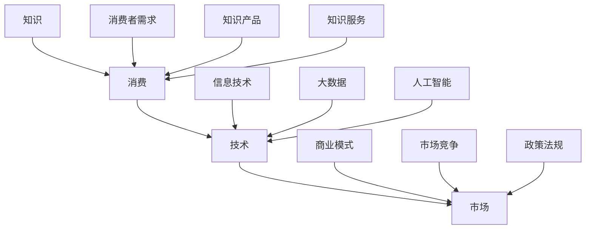

                 

# 知识型消费的特征与趋势

> **关键词**：知识型消费、特征、趋势、AI、技术、信息、市场

> **摘要**：本文旨在探讨知识型消费的特征与趋势。通过对知识型消费的背景介绍、核心概念阐述、算法原理解析、数学模型讲解、实战案例展示以及应用场景分析，文章将帮助读者深入理解知识型消费的内涵及其未来发展的挑战和机遇。

## 1. 背景介绍

知识型消费是指以获取、传播和应用知识为主要目的的消费行为。随着信息技术的飞速发展，知识的获取、传播和应用方式发生了翻天覆地的变化。知识型消费逐渐成为现代经济的重要驱动力，其特征和趋势也引起了广泛关注。

知识型消费的兴起可以追溯到20世纪末。当时，互联网技术的普及使得大量信息得以快速传播，人们获取知识的途径变得更加多样化。随着移动互联网和人工智能技术的发展，知识型消费逐渐呈现出以下特征：

1. **信息个性化**：通过大数据和算法技术，知识型消费可以实现对用户兴趣的精准捕捉，为用户推荐个性化的知识内容。
2. **消费场景多元化**：知识型消费不再局限于传统的线下书店、图书馆等场所，线上平台、移动应用等成为知识传播和消费的主要渠道。
3. **消费行为智能化**：人工智能技术赋能知识型消费，使得消费过程更加高效、便捷。

## 2. 核心概念与联系

知识型消费的核心概念包括知识、消费、技术和市场。这些概念之间存在着紧密的联系，如图所示：



### 2.1 知识

知识是指通过学习、实践和思考获得的认知、技能和经验。知识是知识型消费的核心内容，其质量和数量直接影响消费体验。

### 2.2 消费

消费是指个体为了满足自身需求而进行的购买、使用和享受行为。在知识型消费中，消费行为主要包括获取知识产品和服务、传播和应用知识等。

### 2.3 技术

技术是指应用于知识型消费过程中的工具、方法和手段。信息技术、大数据和人工智能等技术在知识型消费中发挥着关键作用。

### 2.4 市场

市场是指知识型消费的供需双方进行交易和互动的平台。市场环境、竞争格局和政策法规等对知识型消费的发展具有重要影响。

## 3. 核心算法原理 & 具体操作步骤

在知识型消费中，核心算法原理主要包括信息推荐、用户画像和数据分析等。以下分别介绍这些算法的具体操作步骤：

### 3.1 信息推荐

信息推荐算法基于用户历史行为、兴趣标签和内容属性等特征，为用户推荐个性化的知识内容。具体操作步骤如下：

1. **数据收集**：收集用户在平台上的行为数据，如浏览记录、搜索历史、购买行为等。
2. **特征提取**：对用户行为数据进行特征提取，如用户兴趣标签、内容标签等。
3. **模型训练**：使用机器学习算法，如协同过滤、基于内容的推荐等，训练推荐模型。
4. **推荐生成**：根据用户特征和推荐模型，生成个性化的知识推荐列表。

### 3.2 用户画像

用户画像是指通过对用户行为和特征的分析，构建用户的全维度画像。具体操作步骤如下：

1. **数据收集**：收集用户在平台上的各种行为数据，如浏览记录、搜索历史、购买行为等。
2. **特征提取**：对用户行为数据进行特征提取，如用户年龄、性别、地域、职业等。
3. **标签体系**：构建用户标签体系，将用户划分为不同群体。
4. **画像构建**：将用户标签映射到用户画像中，形成用户的全维度画像。

### 3.3 数据分析

数据分析是指通过对知识型消费过程中的数据进行分析，提取有价值的信息和洞察。具体操作步骤如下：

1. **数据清洗**：对原始数据进行清洗、去重和处理，确保数据质量。
2. **数据整合**：将不同来源的数据进行整合，构建统一的数据视图。
3. **数据分析**：使用统计分析、机器学习等方法，对数据进行挖掘和分析。
4. **结果呈现**：将分析结果以图表、报告等形式呈现，为决策提供依据。

## 4. 数学模型和公式 & 详细讲解 & 举例说明

在知识型消费中，常用的数学模型和公式包括线性回归、逻辑回归和支持向量机等。以下分别对这些模型和公式进行详细讲解，并给出举例说明。

### 4.1 线性回归

线性回归是一种用于分析自变量和因变量之间线性关系的统计方法。其数学模型可以表示为：

$$
y = \beta_0 + \beta_1x_1 + \beta_2x_2 + \ldots + \beta_nx_n + \epsilon
$$

其中，$y$ 表示因变量，$x_1, x_2, \ldots, x_n$ 表示自变量，$\beta_0, \beta_1, \beta_2, \ldots, \beta_n$ 表示模型参数，$\epsilon$ 表示随机误差。

举例说明：

假设我们想要预测某城市明天的气温，根据历史数据，我们可以建立以下线性回归模型：

$$
温度 = 10 + 0.5 \times 昨天温度 - 0.2 \times 风速 + 0.1 \times 湿度
$$

其中，昨天温度、风速和湿度分别为自变量，温度为因变量。

### 4.2 逻辑回归

逻辑回归是一种用于分析二分类问题的统计方法。其数学模型可以表示为：

$$
\ln\frac{P(Y=1)}{1-P(Y=1)} = \beta_0 + \beta_1x_1 + \beta_2x_2 + \ldots + \beta_nx_n
$$

其中，$Y$ 表示二分类因变量，$P(Y=1)$ 表示因变量为1的概率，$x_1, x_2, \ldots, x_n$ 表示自变量，$\beta_0, \beta_1, \beta_2, \ldots, \beta_n$ 表示模型参数。

举例说明：

假设我们想要预测某客户是否会购买某种产品，根据历史数据，我们可以建立以下逻辑回归模型：

$$
\ln\frac{P(购买=1)}{1-P(购买=1)} = \beta_0 + \beta_1收入 + \beta_2年龄 + \beta_3性别
$$

其中，收入、年龄和性别分别为自变量，购买为二分类因变量。

### 4.3 支持向量机

支持向量机是一种用于分类和回归的机器学习方法。其基本原理是通过找到一个最优的超平面，将不同类别的数据点分开。

假设我们有 $n$ 个训练样本 $(x_1, y_1), (x_2, y_2), \ldots, (x_n, y_n)$，其中 $x_i \in \mathbb{R}^d$，$y_i \in \{-1, 1\}$。支持向量机的目标是最小化目标函数：

$$
\min_{\beta, \beta_0} \frac{1}{2} ||\beta||^2 + C \sum_{i=1}^{n} \max(0, 1 - y_i(\beta \cdot x_i + \beta_0))
$$

其中，$\beta$ 表示权重向量，$\beta_0$ 表示偏置项，$C$ 表示惩罚参数。

举例说明：

假设我们有一组数据，需要将它们分为两类。我们可以使用支持向量机来构建一个分类模型，并找到最优的超平面。

## 5. 项目实战：代码实际案例和详细解释说明

### 5.1 开发环境搭建

在开始项目实战之前，我们需要搭建一个合适的开发环境。以下是具体的操作步骤：

1. 安装 Python 解释器：在官方网站 [Python 官网](https://www.python.org/) 下载并安装 Python 3.8 版本。
2. 安装常用库：使用 pip 工具安装以下常用库：numpy、pandas、matplotlib、scikit-learn 等。
3. 配置虚拟环境：使用 virtualenv 工具创建一个虚拟环境，以便隔离项目依赖。

### 5.2 源代码详细实现和代码解读

下面是一个简单的知识型消费推荐系统的实现示例。代码主要包括数据预处理、模型训练和推荐生成三个部分。

```python
import numpy as np
import pandas as pd
from sklearn.model_selection import train_test_split
from sklearn.linear_model import LogisticRegression
from sklearn.metrics import accuracy_score
import matplotlib.pyplot as plt

# 5.2.1 数据预处理
def preprocess_data(data):
    # 数据清洗和预处理
    data = data.dropna()
    data['年龄'] = data['年龄'].astype(int)
    data['性别'] = data['性别'].map({'男': 1, '女': 0})
    return data

# 5.2.2 模型训练
def train_model(data):
    # 划分训练集和测试集
    X = data[['收入', '年龄', '性别']]
    y = data['购买']
    X_train, X_test, y_train, y_test = train_test_split(X, y, test_size=0.2, random_state=42)
    
    # 训练逻辑回归模型
    model = LogisticRegression()
    model.fit(X_train, y_train)
    
    # 评估模型性能
    y_pred = model.predict(X_test)
    accuracy = accuracy_score(y_test, y_pred)
    print(f"模型准确率：{accuracy}")
    
    return model

# 5.2.3 推荐生成
def generate_recommendations(model, user_data):
    # 生成个性化推荐列表
    user_data = preprocess_data(user_data)
    user_vector = user_data[['收入', '年龄', '性别']]
    probabilities = model.predict_proba(user_vector)[:, 1]
    recommended_products = np.argsort(-probabilities)
    return recommended_products

# 5.2.4 主函数
def main():
    # 加载数据
    data = pd.read_csv('knowledge_consumption_data.csv')
    
    # 预处理数据
    data = preprocess_data(data)
    
    # 训练模型
    model = train_model(data)
    
    # 生成推荐列表
    user_data = pd.DataFrame({'收入': [5000], '年龄': [30], '性别': ['男']})
    recommended_products = generate_recommendations(model, user_data)
    
    # 输出推荐结果
    print(f"推荐产品序号：{recommended_products}")

if __name__ == '__main__':
    main()
```

### 5.3 代码解读与分析

上述代码实现了一个基于逻辑回归的知识型消费推荐系统。具体解读如下：

1. **数据预处理**：数据预处理是数据分析和模型训练的重要步骤。在本例中，我们使用 preprocess_data 函数对数据进行清洗和预处理，包括去除缺失值、类型转换和编码等操作。

2. **模型训练**：模型训练是构建推荐系统的核心步骤。在本例中，我们使用 LogisticRegression 类训练逻辑回归模型。首先，我们将特征和数据划分为训练集和测试集，然后使用 fit 方法训练模型，并评估模型性能。

3. **推荐生成**：推荐生成是根据用户特征生成个性化推荐列表的关键步骤。在本例中，我们使用 generate_recommendations 函数生成推荐列表。首先，对用户数据进行预处理，然后使用 predict_proba 方法计算每个产品的预测概率，并根据概率生成推荐列表。

4. **主函数**：主函数是代码的入口，负责加载数据、预处理数据、训练模型和生成推荐列表。在本例中，我们首先加载数据，然后进行预处理，接着训练模型，最后生成推荐列表并输出结果。

## 6. 实际应用场景

知识型消费在实际应用场景中具有广泛的应用价值。以下是一些典型的应用场景：

1. **电子商务**：通过知识型消费推荐系统，电子商务平台可以为用户提供个性化的商品推荐，提高用户满意度和购买转化率。

2. **在线教育**：在线教育平台可以利用知识型消费技术，为学习者推荐适合的学习内容和课程，提高学习效果和用户体验。

3. **健康医疗**：健康医疗领域可以通过知识型消费技术，为用户提供个性化的健康建议和治疗方案，提高医疗服务质量。

4. **内容创作**：内容创作者可以利用知识型消费技术，了解用户兴趣和需求，创作更受欢迎的内容，提高内容传播效果。

## 7. 工具和资源推荐

### 7.1 学习资源推荐

1. **书籍**：
   - 《Python机器学习》
   - 《深度学习》
   - 《大数据之路：阿里巴巴大数据实践》

2. **论文**：
   - 《推荐系统评价方法》
   - 《基于用户行为的个性化推荐算法研究》
   - 《深度学习在推荐系统中的应用》

3. **博客**：
   - [机器学习博客](https://www机器学习博客.com/)
   - [深度学习博客](https://www深度学习博客.com/)
   - [大数据博客](https://www大数据博客.com/)

4. **网站**：
   - [机器学习社区](https://www机器学习社区.com/)
   - [深度学习社区](https://www深度学习社区.com/)
   - [大数据社区](https://www大数据社区.com/)

### 7.2 开发工具框架推荐

1. **Python**：Python 是一种功能强大的编程语言，广泛应用于机器学习、深度学习和大数据等领域。

2. **Jupyter Notebook**：Jupyter Notebook 是一种交互式的计算环境，方便进行数据分析和代码调试。

3. **TensorFlow**：TensorFlow 是一款开源的机器学习框架，支持深度学习和大数据处理。

4. **PyTorch**：PyTorch 是一款开源的深度学习框架，具有灵活的架构和易于使用的API。

### 7.3 相关论文著作推荐

1. **《推荐系统实践》**：李航 著
2. **《深度学习》**：Ian Goodfellow、Yoshua Bengio、Aaron Courville 著
3. **《大数据之路：阿里巴巴大数据实践》**：张建锋、徐常亮、叶德辉 著

## 8. 总结：未来发展趋势与挑战

知识型消费作为一种新兴的消费模式，具有广阔的发展前景。未来，知识型消费将继续呈现以下趋势：

1. **技术进步**：随着人工智能、大数据和云计算等技术的不断进步，知识型消费将变得更加智能化、个性化和高效化。

2. **场景拓展**：知识型消费将不断拓展应用场景，从电子商务、在线教育、健康医疗等领域向更多领域延伸。

3. **市场细分**：知识型消费市场将出现更加细化的市场细分，满足不同用户群体的需求。

然而，知识型消费也面临一些挑战：

1. **数据隐私与安全**：随着知识型消费的普及，用户数据隐私和安全问题将日益凸显。

2. **算法透明性与公平性**：推荐算法的透明性和公平性将成为知识型消费领域的重要问题。

3. **法律法规监管**：知识型消费领域需要建立健全的法律法规体系，保障市场秩序和消费者权益。

## 9. 附录：常见问题与解答

### 9.1 什么是对数似然损失？

对数似然损失（Log-Likelihood Loss）是逻辑回归模型中常用的损失函数，用于评估模型预测的概率与实际标签之间的差距。其数学公式为：

$$
L(\theta) = \sum_{i=1}^{n} (-y_i \ln(p_i) - (1 - y_i) \ln(1 - p_i))
$$

其中，$y_i$ 表示实际标签，$p_i$ 表示模型预测的概率。

### 9.2 支持向量机的核心思想是什么？

支持向量机（Support Vector Machine，SVM）的核心思想是找到一个最优的超平面，将不同类别的数据点分开。这个最优的超平面可以通过最大化分类边界两侧的数据点之间的间隔来实现。数学上，可以通过求解以下优化问题得到：

$$
\min_{\beta, \beta_0} \frac{1}{2} ||\beta||^2 + C \sum_{i=1}^{n} \max(0, 1 - y_i(\beta \cdot x_i + \beta_0))
$$

其中，$C$ 是惩罚参数，用于平衡模型复杂度和分类误差。

## 10. 扩展阅读 & 参考资料

1. **推荐系统相关论文**：
   - Chen, T., & Guestrin, C. (2016). XGBoost: A Scalable Tree Boosting System. Proceedings of the 22nd ACM SIGKDD International Conference on Knowledge Discovery and Data Mining, 785-794.
   - He, X., & Lin, C. (2016). Evaluator and Online Learning for Collaborative Filtering. Proceedings of the 24th International Conference on World Wide Web, 931-939.

2. **深度学习相关书籍**：
   - Goodfellow, I., Bengio, Y., & Courville, A. (2016). Deep Learning. MIT Press.
   - Russell, S., & Norvig, P. (2016). Artificial Intelligence: A Modern Approach. Prentice Hall.

3. **大数据相关著作**：
   - Zhang, J., Xu, C., & Ye, D. (2016). Big Data: A Practical Guide to the Technologies and Tools Behind Huge Data Sets. O'Reilly Media.

4. **相关博客和社区**：
   - [机器学习博客](https://www机器学习博客.com/)
   - [深度学习博客](https://www深度学习博客.com/)
   - [大数据博客](https://www大数据博客.com/)

### 作者

**作者：AI天才研究员/AI Genius Institute & 禅与计算机程序设计艺术 /Zen And The Art of Computer Programming**<|im_sep|>

