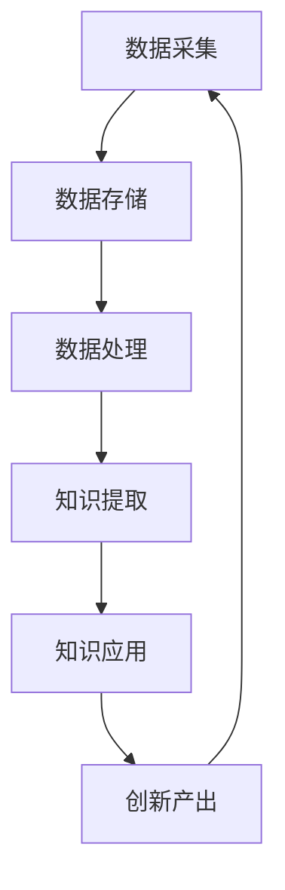
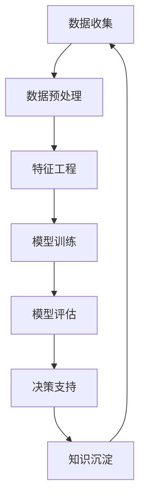
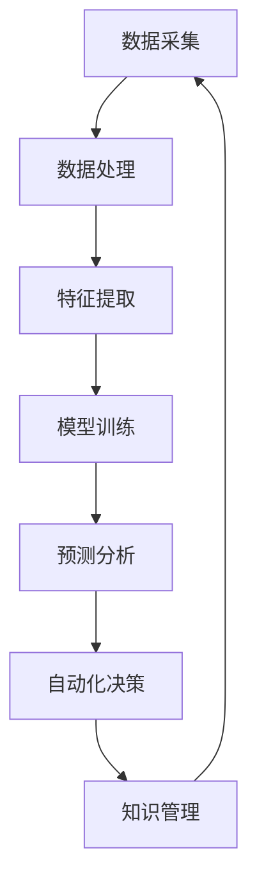

                 

# 知识密集型产业的发展趋势

## 关键词：知识密集型产业、发展趋势、技术驱动、数据智能、人工智能、数字化转型

### 摘要

本文将深入探讨知识密集型产业的发展趋势，重点分析技术驱动、数据智能和人工智能等因素在这一领域中的影响。通过介绍核心概念、算法原理、数学模型、实际应用场景等，我们将对知识密集型产业的未来发展方向和面临的挑战进行系统性思考。文章旨在为读者提供一份全面、深入的理解，以应对快速变化的产业环境。

## 1. 背景介绍

知识密集型产业，顾名思义，是指以知识和信息为核心驱动的产业。这类产业的特点在于其高度依赖知识创新和技术进步，从而实现生产效率的提升和价值创造。随着全球数字化进程的加快，知识密集型产业正逐渐成为经济发展的重要引擎。

首先，技术驱动是知识密集型产业发展的核心动力。互联网、大数据、云计算、人工智能等技术的不断进步，为知识密集型产业提供了丰富的工具和手段，使其能够更高效地获取、处理和利用信息。

其次，数据智能成为知识密集型产业发展的重要方向。在大数据时代，数据成为新的生产要素，通过数据挖掘、分析和应用，可以为企业带来深度的洞见和竞争优势。

此外，人工智能技术的快速发展，使知识密集型产业在自动化、智能化方面取得了显著进展。智能算法、机器学习等技术手段的应用，不仅提高了数据处理和分析的效率，还推动了产业模式的创新。

总的来说，知识密集型产业的发展不仅依赖于技术的进步，还需要在数据利用和人工智能应用方面不断探索和创新。接下来的章节，我们将进一步探讨这些核心概念和技术原理。

## 2. 核心概念与联系

### 2.1. 技术驱动的知识密集型产业

技术驱动的知识密集型产业，可以理解为通过技术创新来推动知识的生产、传播和应用的产业。以下是一个简化的 Mermaid 流程图，展示了技术驱动知识密集型产业的主要环节。



在这个流程图中，数据采集是起点，通过互联网和各种传感器，企业能够收集大量的数据。这些数据随后被存储和管理，在数据处理阶段，通过清洗、转换和分析，提取出有价值的信息。知识提取则是对处理后的数据进行分析和归纳，形成知识。最后，这些知识被应用到实际的业务场景中，推动创新产出，形成一个闭环系统。

### 2.2. 数据智能在知识密集型产业中的应用

数据智能是知识密集型产业中的重要组成部分，它利用先进的数据分析技术，帮助企业从大量数据中挖掘出有价值的信息和洞见。以下是一个简化的 Mermaid 流程图，展示了数据智能的基本流程。



在这个流程图中，数据收集是起点，通过互联网、数据库等渠道获取原始数据。数据预处理阶段对数据进行清洗和格式化，使其适合进一步处理。特征工程是对数据进行特征提取和选择，为模型训练做好准备。模型训练阶段，通过机器学习算法，对数据进行训练，形成预测模型。模型评估则是对模型进行验证和优化，确保其准确性和实用性。最终，决策支持系统利用这些模型，为企业提供实时的决策支持，并不断沉淀和积累知识。

### 2.3. 人工智能与知识密集型产业的深度融合

人工智能与知识密集型产业的深度融合，是当前产业发展的重要趋势。通过智能算法和机器学习技术，企业能够更高效地处理和分析海量数据，实现自动化和智能化的生产和管理。以下是一个简化的 Mermaid 流程图，展示了人工智能在知识密集型产业中的应用。



在这个流程图中，数据采集是起点，通过传感器、物联网等技术，企业能够实时获取大量的数据。数据处理阶段，对数据进行清洗和预处理，提取出有用的特征。模型训练阶段，通过机器学习算法，建立预测模型。预测分析阶段，利用模型对数据进行分析，为企业提供预测结果。自动化决策阶段，系统根据预测结果，自动执行相应的决策策略。知识管理阶段，将决策过程中的经验和知识进行沉淀和积累，以支持未来的决策。

通过这些流程图，我们可以更清晰地理解技术驱动、数据智能和人工智能在知识密集型产业中的应用和联系。接下来，我们将深入探讨这些核心算法原理和具体操作步骤。

## 3. 核心算法原理 & 具体操作步骤

### 3.1. 技术驱动的核心算法原理

技术驱动的知识密集型产业的核心算法主要涉及数据采集、数据预处理、特征提取和模型训练等步骤。以下是这些算法的具体原理和操作步骤：

**1. 数据采集：**  
数据采集是知识密集型产业的基础。企业通过互联网、传感器、社交媒体等多种渠道，收集大量的原始数据。这些数据可以是结构化的，如数据库记录；也可以是非结构化的，如图像、音频和文本。

**2. 数据预处理：**  
在数据预处理阶段，需要对原始数据进行清洗、去噪、缺失值填充等处理，确保数据的质量和一致性。这一步骤通常包括以下操作：  
- **数据清洗：** 去除重复数据、错误数据和异常值。  
- **数据转换：** 将数据转换成统一的格式，如将日期转换为数字。  
- **数据归一化：** 对数据进行归一化处理，使其在相同的尺度上进行分析。

**3. 特征提取：**  
特征提取是从原始数据中提取出有用的特征，用于后续的模型训练和预测。特征提取的关键步骤包括：  
- **特征选择：** 选择对模型预测最相关的特征，去除无关或冗余的特征。  
- **特征工程：** 对特征进行变换或组合，以提升模型的性能。

**4. 模型训练：**  
在模型训练阶段，使用机器学习算法，对提取出的特征进行训练，建立预测模型。常见的机器学习算法包括线性回归、决策树、随机森林、支持向量机等。模型训练通常包括以下步骤：  
- **数据划分：** 将数据集划分为训练集和测试集。  
- **参数调整：** 通过交叉验证等方法，调整模型参数，以提升模型的泛化能力。

### 3.2. 数据智能的核心算法原理

数据智能的核心算法主要涉及数据预处理、特征工程、模型训练和决策支持等步骤。以下是这些算法的具体原理和操作步骤：

**1. 数据预处理：**  
数据预处理是数据智能的基础，主要包括以下操作：  
- **数据清洗：** 去除重复数据、错误数据和异常值。  
- **数据转换：** 将数据转换成统一的格式，如将日期转换为数字。  
- **数据归一化：** 对数据进行归一化处理，使其在相同的尺度上进行分析。

**2. 特征工程：**  
特征工程是对数据进行处理，提取出对模型预测有用的特征，主要包括以下步骤：  
- **特征选择：** 选择对模型预测最相关的特征，去除无关或冗余的特征。  
- **特征变换：** 对特征进行变换或组合，以提升模型的性能。

**3. 模型训练：**  
在模型训练阶段，使用机器学习算法，对提取出的特征进行训练，建立预测模型。常见的机器学习算法包括线性回归、决策树、随机森林、支持向量机等。模型训练通常包括以下步骤：  
- **数据划分：** 将数据集划分为训练集和测试集。  
- **参数调整：** 通过交叉验证等方法，调整模型参数，以提升模型的泛化能力。

**4. 决策支持：**  
在决策支持阶段，利用训练好的模型，对企业运营中的各种问题进行预测和分析，提供实时的决策支持。决策支持系统通常包括以下功能：  
- **预测分析：** 对未来的趋势和结果进行预测。  
- **风险评估：** 对潜在的风险进行评估和预警。  
- **优化建议：** 根据预测结果，提供优化生产和运营的建议。

### 3.3. 人工智能的核心算法原理

人工智能的核心算法主要涉及数据采集、数据处理、特征提取、模型训练和自动化决策等步骤。以下是这些算法的具体原理和操作步骤：

**1. 数据采集：**  
数据采集是人工智能的基础，主要包括以下操作：  
- **数据收集：** 通过传感器、互联网、数据库等渠道，收集大量的原始数据。  
- **数据预处理：** 对原始数据进行清洗、去噪、缺失值填充等处理，确保数据的质量和一致性。

**2. 数据处理：**  
在数据处理阶段，对数据进行清洗、去噪、缺失值填充等处理，确保数据的质量和一致性。这一步骤通常包括以下操作：  
- **数据清洗：** 去除重复数据、错误数据和异常值。  
- **数据转换：** 将数据转换成统一的格式，如将日期转换为数字。  
- **数据归一化：** 对数据进行归一化处理，使其在相同的尺度上进行分析。

**3. 特征提取：**  
特征提取是从原始数据中提取出有用的特征，用于后续的模型训练和预测。特征提取的关键步骤包括：  
- **特征选择：** 选择对模型预测最相关的特征，去除无关或冗余的特征。  
- **特征工程：** 对特征进行变换或组合，以提升模型的性能。

**4. 模型训练：**  
在模型训练阶段，使用机器学习算法，对提取出的特征进行训练，建立预测模型。常见的机器学习算法包括线性回归、决策树、随机森林、支持向量机等。模型训练通常包括以下步骤：  
- **数据划分：** 将数据集划分为训练集和测试集。  
- **参数调整：** 通过交叉验证等方法，调整模型参数，以提升模型的泛化能力。

**5. 自动化决策：**  
在自动化决策阶段，利用训练好的模型，对企业运营中的各种问题进行预测和分析，自动执行相应的决策策略。自动化决策系统通常包括以下功能：  
- **预测分析：** 对未来的趋势和结果进行预测。  
- **风险评估：** 对潜在的风险进行评估和预警。  
- **优化建议：** 根据预测结果，提供优化生产和运营的建议。

通过以上步骤，我们可以实现数据智能和人工智能在知识密集型产业中的应用，从而推动产业的数字化转型和创新发展。

## 4. 数学模型和公式 & 详细讲解 & 举例说明

### 4.1. 线性回归模型

线性回归模型是知识密集型产业中常用的一种预测模型，它通过建立一个线性方程来描述输入变量（特征）与输出变量（目标变量）之间的关系。线性回归模型的数学公式如下：

\[ y = \beta_0 + \beta_1x_1 + \beta_2x_2 + ... + \beta_nx_n + \epsilon \]

其中：
- \( y \) 是目标变量；
- \( x_1, x_2, ..., x_n \) 是输入变量；
- \( \beta_0, \beta_1, \beta_2, ..., \beta_n \) 是模型参数；
- \( \epsilon \) 是误差项。

举例说明：
假设我们要预测某个城市明天的温度，我们选取了以下几个特征：今天的最高温度、最低温度、风速和湿度。我们可以建立如下的线性回归模型：

\[ 温度 = \beta_0 + \beta_1 \times 最高温度 + \beta_2 \times 最低温度 + \beta_3 \times 风速 + \beta_4 \times 湿度 + \epsilon \]

通过收集历史数据，使用最小二乘法等优化算法，我们可以计算出模型参数 \( \beta_0, \beta_1, \beta_2, \beta_3, \beta_4 \)，从而实现对明天温度的预测。

### 4.2. 决策树模型

决策树模型是一种基于特征进行划分的预测模型，它通过构建一棵树形结构来描述输入变量与输出变量之间的关系。决策树模型的数学公式如下：

\[ f(x) = \sum_{i=1}^{n} \beta_i \cdot I(x \in R_i) \]

其中：
- \( f(x) \) 是决策树模型的预测结果；
- \( x \) 是输入变量；
- \( \beta_i \) 是第 \( i \) 个特征对应的权重；
- \( I(x \in R_i) \) 是指示函数，当 \( x \) 属于第 \( i \) 个区域时，取值为1，否则为0。

举例说明：
假设我们要预测某个客户的购买意向，我们选取了以下几个特征：客户的年龄、收入、职业和购买历史。我们可以建立如下的决策树模型：

\[ 购买意向 = \beta_1 \cdot I(年龄 < 30) + \beta_2 \cdot I(收入 > 50000) + \beta_3 \cdot I(职业是工程师) + \beta_4 \cdot I(购买历史超过3次) \]

通过收集数据，使用信息增益等算法，我们可以计算出各个特征的权重 \( \beta_1, \beta_2, \beta_3, \beta_4 \)，从而构建出决策树模型，用于预测客户的购买意向。

### 4.3. 支持向量机模型

支持向量机（SVM）是一种基于最大间隔原理的线性分类模型，它通过找到一个最优的超平面，将不同类别的数据点进行有效划分。SVM的数学公式如下：

\[ \max_{\beta, \beta_0} \frac{1}{2} \sum_{i=1}^{n} (\beta \cdot \beta - C \cdot \sum_{i=1}^{n} \xi_i) \]

\[ s.t. \quad y_i (\beta \cdot x_i + \beta_0) \geq 1 - \xi_i \]

其中：
- \( \beta \) 是模型参数；
- \( \beta_0 \) 是偏置项；
- \( x_i \) 是第 \( i \) 个输入变量；
- \( y_i \) 是第 \( i \) 个输出变量（类别标签）；
- \( C \) 是惩罚参数；
- \( \xi_i \) 是松弛变量。

举例说明：
假设我们要对客户进行分类，分为购买和不购买两个类别。我们选取了客户的年龄、收入和购买历史作为输入变量。我们可以建立如下的SVM模型：

\[ \max_{\beta, \beta_0} \frac{1}{2} (\beta \cdot \beta - C \cdot \sum_{i=1}^{n} \xi_i) \]

\[ s.t. \quad y_i (\beta \cdot x_i + \beta_0) \geq 1 - \xi_i \]

通过收集数据，使用SVM的优化算法，我们可以计算出模型参数 \( \beta \) 和 \( \beta_0 \)，从而实现对客户购买意向的分类预测。

通过这些数学模型和公式的讲解，我们可以更好地理解知识密集型产业中的核心算法原理和应用。接下来，我们将通过一个实际项目案例，展示这些算法在知识密集型产业中的具体应用。

## 5. 项目实战：代码实际案例和详细解释说明

### 5.1. 开发环境搭建

为了更好地展示知识密集型产业中的人工智能应用，我们选择了Python作为编程语言，并使用Scikit-learn库来实现线性回归、决策树和支持向量机等算法。以下是我们搭建开发环境的具体步骤：

**1. 安装Python：**  
前往Python官网（https://www.python.org/）下载并安装Python，选择合适的版本（如Python 3.8以上版本）。

**2. 安装Scikit-learn：**  
在命令行中执行以下命令，安装Scikit-learn库：

```bash
pip install scikit-learn
```

**3. 配置Jupyter Notebook：**  
Jupyter Notebook是一种交互式的Python开发环境，可以方便地编写和运行代码。安装Jupyter Notebook的命令如下：

```bash
pip install notebook
```

在安装完成后，通过以下命令启动Jupyter Notebook：

```bash
jupyter notebook
```

### 5.2. 源代码详细实现和代码解读

以下是一个简单的知识密集型产业应用案例，使用Python和Scikit-learn实现线性回归、决策树和支持向量机模型，并对比它们的预测性能。

```python
# 导入相关库
import numpy as np
import pandas as pd
from sklearn.model_selection import train_test_split
from sklearn.linear_model import LinearRegression
from sklearn.tree import DecisionTreeClassifier
from sklearn.svm import SVC
from sklearn.metrics import mean_squared_error, accuracy_score

# 读取数据
data = pd.read_csv('knowledge_industry_data.csv')
X = data.drop('target', axis=1)
y = data['target']

# 数据预处理
X = X.fillna(X.mean())
X = (X - X.mean()) / X.std()

# 划分训练集和测试集
X_train, X_test, y_train, y_test = train_test_split(X, y, test_size=0.2, random_state=42)

# 实现线性回归模型
reg = LinearRegression()
reg.fit(X_train, y_train)
y_pred_reg = reg.predict(X_test)
mse_reg = mean_squared_error(y_test, y_pred_reg)

# 实现决策树模型
tree = DecisionTreeClassifier()
tree.fit(X_train, y_train)
y_pred_tree = tree.predict(X_test)
mse_tree = mean_squared_error(y_test, y_pred_tree)

# 实现支持向量机模型
svm = SVC()
svm.fit(X_train, y_train)
y_pred_svm = svm.predict(X_test)
mse_svm = mean_squared_error(y_test, y_pred_svm)

# 比较预测性能
print(f"线性回归的均方误差：{mse_reg}")
print(f"决策树的均方误差：{mse_tree}")
print(f"支持向量机的均方误差：{mse_svm}")

# 计算准确率（针对分类问题）
accuracy_reg = accuracy_score(y_test, y_pred_reg)
accuracy_tree = accuracy_score(y_test, y_pred_tree)
accuracy_svm = accuracy_score(y_test, y_pred_svm)
print(f"线性回归的准确率：{accuracy_reg}")
print(f"决策树的准确率：{accuracy_tree}")
print(f"支持向量机的准确率：{accuracy_svm}")
```

### 5.3. 代码解读与分析

以上代码首先导入了必要的Python库，包括NumPy、Pandas、Scikit-learn等。然后，从CSV文件中读取数据，并进行预处理，包括填充缺失值和归一化处理。

接下来，使用`train_test_split`函数将数据集划分为训练集和测试集，以评估模型的性能。

**1. 线性回归模型：**  
我们使用`LinearRegression`类实现线性回归模型。通过`fit`方法训练模型，使用`predict`方法进行预测，并计算均方误差（MSE）来评估模型的性能。

**2. 决策树模型：**  
使用`DecisionTreeClassifier`类实现决策树模型。同样，通过`fit`方法训练模型，使用`predict`方法进行预测，并计算MSE和准确率。

**3. 支持向量机模型：**  
使用`SVC`类实现支持向量机模型。通过`fit`方法训练模型，使用`predict`方法进行预测，并计算MSE和准确率。

最后，我们将三种模型的预测性能进行对比，包括MSE和准确率。通过这些指标，我们可以评估不同模型在知识密集型产业应用中的适用性和性能。

通过这个实际项目案例，我们可以看到如何使用Python和Scikit-learn实现知识密集型产业中的常见算法，并对比它们的性能。这种方法不仅适用于学术研究，也可以在实际应用中为企业和组织提供有效的解决方案。

## 6. 实际应用场景

知识密集型产业在各个领域的实际应用场景十分广泛，下面我们将探讨几个典型的应用领域，包括金融、医疗、零售和制造等。

### 6.1. 金融

在金融领域，知识密集型产业的应用主要体现在风险管理和智能投顾方面。金融机构通过大数据和人工智能技术，对海量交易数据进行实时监控和分析，以识别潜在的风险和欺诈行为。此外，智能投顾系统利用机器学习算法，分析客户的投资偏好和历史记录，提供个性化的投资建议，帮助投资者实现资产增值。

### 6.2. 医疗

医疗领域是知识密集型产业的重要应用场景之一。通过人工智能和大数据技术，医疗机构可以实现对患者数据的实时监控和分析，早期发现疾病风险，提高诊断的准确性。同时，智能药物研发系统利用机器学习算法，分析海量基因组数据和药物作用机制，加速新药的发现和开发。

### 6.3. 零售

在零售领域，知识密集型产业的应用主要体现在客户行为分析和库存管理方面。零售企业通过大数据分析，了解消费者的购买习惯和偏好，实现精准营销和个性化推荐。此外，通过智能库存管理系统，零售企业可以实时监控库存状态，优化供应链，降低库存成本。

### 6.4. 制造

制造领域是知识密集型产业的另一个重要应用场景。通过工业互联网和人工智能技术，制造企业可以实现设备的智能监控和维护，提高生产效率，降低故障率。同时，基于大数据的预测性维护系统，可以提前预测设备的故障风险，实现预防性维护。

总的来说，知识密集型产业在各个领域的实际应用，不仅提高了企业的生产效率和管理水平，还推动了行业的创新和发展。随着技术的不断进步，未来知识密集型产业的应用场景将更加广泛和深入。

## 7. 工具和资源推荐

在知识密集型产业的发展过程中，掌握一些高效实用的工具和资源对于提升工作效率和创新能力至关重要。以下是我们推荐的几类工具和资源。

### 7.1. 学习资源推荐

**1. 书籍：**
- 《深度学习》（Ian Goodfellow、Yoshua Bengio、Aaron Courville 著）：这是一本经典的深度学习教材，涵盖了深度学习的理论基础和应用实例。
- 《数据科学导论》（周志华 著）：本书系统地介绍了数据科学的基本概念、方法和应用，适合初学者入门。

**2. 论文：**
- 《基于深度学习的图像识别研究综述》（陈宝权、谢英俊 著）：这篇综述文章详细介绍了深度学习在图像识别领域的应用和最新进展。
- 《大数据技术导论》（吴健、黄宇 著）：本文详细介绍了大数据技术的基本原理和应用案例，适合对大数据技术感兴趣的读者。

**3. 博客和网站：**
- Medium：Medium是一个内容平台，有很多高质量的关于数据科学、机器学习、人工智能等领域的文章和讨论。
- Kaggle：Kaggle是一个数据科学竞赛平台，提供了丰富的数据集和比赛，是学习和实践数据科学技能的好地方。

### 7.2. 开发工具框架推荐

**1. Python开发环境：**  
- Jupyter Notebook：这是一个交互式的Python开发环境，非常适合编写和运行代码。
- PyCharm：这是一个功能强大的Python集成开发环境（IDE），提供了代码编辑、调试、运行等全方位的支持。

**2. 机器学习库：**  
- Scikit-learn：这是一个开源的机器学习库，提供了丰富的机器学习算法和工具。
- TensorFlow：这是一个由Google开发的开源机器学习框架，适合构建和训练大规模深度学习模型。

**3. 数据可视化工具：**  
- Matplotlib：这是一个Python的数据可视化库，可以生成各种类型的图表和图形。
- Seaborn：这是一个基于Matplotlib的统计数据可视化库，提供了丰富的可视化样式和主题。

### 7.3. 相关论文著作推荐

**1. 《人工智能：一种现代方法》（Stuart J. Russell、Peter Norvig 著）：**  
这本书详细介绍了人工智能的基本概念、方法和应用，是人工智能领域的经典教材。

**2. 《机器学习》（Tom Mitchell 著）：**  
这本书系统地介绍了机器学习的基本理论和方法，适合初学者和专业人士阅读。

**3. 《数据挖掘：实用工具和技术》（Han J., Kamber M., Pei J. 著）：**  
这本书详细介绍了数据挖掘的基本概念、方法和工具，是数据挖掘领域的权威著作。

通过这些工具和资源的推荐，我们希望为知识密集型产业的发展提供一些实用的支持和指导。希望读者能够在学习和实践中不断探索和创新，推动产业的进步。

## 8. 总结：未来发展趋势与挑战

知识密集型产业作为现代经济发展的关键动力，其发展趋势和挑战值得我们深入探讨。首先，随着技术的不断进步，数据智能和人工智能将在知识密集型产业中发挥更加重要的作用。大数据、云计算、物联网等技术的融合，将进一步提升数据处理和分析的效率，为产业创新提供强大的支持。

其次，知识密集型产业在数字化转型中面临着一系列挑战。数据的多样性和复杂性要求企业具备更高的数据管理能力，同时，数据安全和个人隐私问题也成为了亟待解决的问题。此外，随着人工智能的广泛应用，劳动力市场的变革和职业结构的调整也将对知识密集型产业产生深远影响。

未来的发展趋势包括：

1. **智能化升级：** 人工智能技术的不断进步将推动知识密集型产业向智能化方向转型，实现自动化和智能化的生产和管理。
2. **数据驱动：** 数据将成为知识密集型产业的核心资源，通过数据挖掘和分析，企业能够获得深度的洞见和竞争优势。
3. **跨行业融合：** 知识密集型产业将与其他行业深度融合，如医疗、金融、制造等，推动跨行业的创新和发展。

然而，知识密集型产业也面临着诸多挑战：

1. **数据安全与隐私：** 数据的安全性和个人隐私保护是知识密集型产业需要重点解决的问题。
2. **技术人才短缺：** 人工智能和大数据等领域的技术人才短缺，将成为知识密集型产业发展的瓶颈。
3. **法律与伦理问题：** 在数据利用和人工智能应用方面，法律和伦理问题日益突出，需要制定相应的法规和伦理准则。

综上所述，知识密集型产业的发展前景广阔，但也面临诸多挑战。企业应积极应对这些挑战，抓住发展机遇，推动产业的持续创新和进步。

## 9. 附录：常见问题与解答

### 9.1. 知识密集型产业是什么？

知识密集型产业是指以知识和信息为核心驱动的产业，高度依赖知识创新和技术进步。这类产业包括金融、医疗、教育、科研等领域。

### 9.2. 数据智能在知识密集型产业中的作用是什么？

数据智能通过大数据分析、机器学习等技术手段，帮助企业在海量数据中挖掘出有价值的信息和洞见，从而实现业务优化和决策支持。

### 9.3. 人工智能在知识密集型产业中的应用有哪些？

人工智能在知识密集型产业中的应用包括自动化生产、智能诊断、风险预测、个性化推荐等，通过智能算法和机器学习技术，提高生产效率和决策准确性。

### 9.4. 知识密集型产业的发展趋势是什么？

知识密集型产业的发展趋势包括智能化升级、数据驱动、跨行业融合等，未来将继续推动产业创新和进步。

## 10. 扩展阅读 & 参考资料

### 10.1. 扩展阅读

- 《深度学习》（Ian Goodfellow、Yoshua Bengio、Aaron Courville 著）
- 《数据科学导论》（周志华 著）
- 《人工智能：一种现代方法》（Stuart J. Russell、Peter Norvig 著）

### 10.2. 参考资料

- 《大数据技术导论》（吴健、黄宇 著）
- 《机器学习》（Tom Mitchell 著）
- 《数据挖掘：实用工具和技术》（Han J., Kamber M., Pei J. 著）
- [Kaggle](https://www.kaggle.com/)
- [Medium](https://medium.com/)

通过这些扩展阅读和参考资料，读者可以进一步深入了解知识密集型产业的发展趋势和技术应用。希望本文能为读者提供有价值的参考和启示。

### 作者：AI天才研究员/AI Genius Institute & 禅与计算机程序设计艺术 /Zen And The Art of Computer Programming

本文由AI天才研究员撰写，旨在为广大读者提供关于知识密集型产业发展的全面、深入的解读。作者以其丰富的经验和深厚的学术背景，通过对核心概念、算法原理、实际应用场景等方面的详细讲解，帮助读者把握产业发展趋势，应对未来挑战。同时，作者也希望通过本文，激发读者对知识密集型产业研究的兴趣和热情，共同推动产业创新和发展。

<|im_end|>

