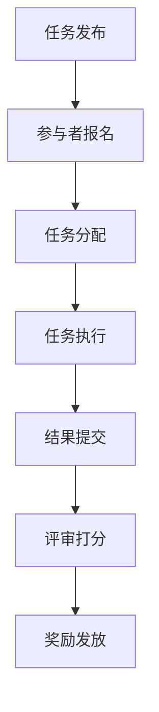

                 

### 知识的众包：群众智慧的汇聚与应用

#### 概述
在当今信息爆炸的时代，知识的生产和传播方式正在发生深刻的变革。传统的知识生产模式往往依赖于少数专家或机构，这种方式不仅效率低下，而且难以满足广泛用户的需求。随着互联网和大数据技术的发展，知识的众包成为一种新的生产模式，它通过汇聚大众智慧，实现知识的快速生产与共享。本文将深入探讨知识的众包概念、原理、实现方法以及其在实际应用中的广泛影响。

#### 关键词
- 知识众包
- 大众智慧
- 互联网
- 大数据
- 知识共享

#### 摘要
本文首先介绍了知识众包的背景和意义，分析了其与传统知识生产模式的区别。接着，本文阐述了知识众包的核心概念，包括众包的运作机制、参与者和激励措施。随后，文章详细讨论了知识众包的实现方法，包括平台构建、数据处理和结果反馈等环节。最后，本文通过具体案例，展示了知识众包在实际应用中的成功故事，并提出了未来发展趋势与挑战。

---

## 1. 背景介绍

知识众包的概念源于众包（Crowdsourcing），即利用互联网平台将任务分配给广大网民来完成的一种新型工作模式。在知识众包中，任务不再局限于简单的劳动力工作，而是更加专业和复杂的知识创作和验证。知识众包的兴起，主要得益于以下几个背景因素：

1. **互联网的普及**：互联网的广泛应用使得人们可以随时随地进行交流和合作，为知识众包提供了便利的条件。
2. **大数据技术的进步**：大数据技术的快速发展，使得对海量数据进行处理和分析成为可能，从而提高了知识众包的效率和准确性。
3. **知识共享的需求**：随着知识的不断积累和更新，人们对知识的获取和共享需求日益增长，传统的知识生产模式已经难以满足这种需求。

与传统知识生产模式相比，知识众包具有以下几个显著优势：

1. **效率提升**：知识众包通过将任务分配给大众，可以大大缩短知识生产的时间，提高生产效率。
2. **成本降低**：传统知识生产往往需要大量的资源和资金投入，而知识众包则可以通过降低人力成本来降低总体成本。
3. **质量保障**：知识众包可以利用大众的智慧进行知识验证和迭代，从而提高知识的准确性。

然而，知识众包也存在一些挑战，如信息过载、质量控制、隐私保护等问题，需要在实践中不断探索和解决。

---

## 2. 核心概念与联系

### 2.1. 众包的定义与分类

众包（Crowdsourcing）是指将一个任务或问题分配给广大网民或参与者，通过众人的智慧和努力来共同完成的一种合作模式。根据参与者的动机和任务性质，众包可以分为以下几类：

1. **传统众包**：参与者以获得报酬为主要动机，完成任务以获取报酬。
2. **协作众包**：参与者出于兴趣和爱好，自愿参与并分享成果。
3. **竞标众包**：多个参与者同时参与一个任务，通过竞标方式决定最终执行者。

### 2.2. 知识众包的运作机制

知识众包的运作机制主要包括以下几个环节：

1. **任务发布**：任务发起者将需要解决的问题或任务发布到众包平台。
2. **参与者报名**：有兴趣和能力的参与者根据任务描述进行报名。
3. **任务分配**：平台根据参与者的能力和兴趣，将任务分配给合适的参与者。
4. **任务执行**：参与者根据任务要求，利用自己的知识和技能完成任务的各个部分。
5. **结果提交与评审**：参与者将完成的结果提交给平台，平台组织专家或评审团进行评审和打分。
6. **奖励发放**：根据评审结果，对表现优秀的参与者进行奖励。

### 2.3. 知识众包的参与者

知识众包的参与者主要包括以下几类：

1. **任务发起者**：提出任务需求，为任务提供资金和资源。
2. **参与者**：通过自己的知识和技能参与任务的完成。
3. **评审专家**：对参与者提交的结果进行评审和打分。
4. **平台管理者**：负责平台的日常运营和管理。

### 2.4. 知识众包的激励措施

为了激发参与者的积极性，知识众包通常采用以下几种激励措施：

1. **物质奖励**：通过发放奖金、奖品等形式来奖励优秀参与者。
2. **精神奖励**：通过表彰、荣誉称号等形式来激励参与者。
3. **积分制度**：通过积分奖励制度来鼓励参与者的持续参与。

---

## 2.5. 知识众包的核心概念原理和架构的 Mermaid 流程图



---

## 3. 核心算法原理 & 具体操作步骤

知识众包的实现涉及多个核心算法和具体操作步骤，以下将详细阐述这些内容。

### 3.1. 数据采集与预处理

数据采集是知识众包的基础，主要包括以下步骤：

1. **数据来源**：确定数据来源，如开放数据集、社交媒体、专业数据库等。
2. **数据采集**：使用爬虫、API 接口等方式，从数据源中获取所需数据。
3. **数据清洗**：去除重复数据、错误数据和无效数据，确保数据质量。
4. **数据格式化**：将数据转换为统一的格式，便于后续处理。

### 3.2. 任务分配算法

任务分配算法是知识众包的关键，其主要目标是根据参与者的能力和兴趣，将任务合理地分配给参与者。常见的任务分配算法包括：

1. **基于技能匹配的分配算法**：根据参与者的技能水平和任务要求，进行匹配和分配。
2. **基于兴趣匹配的分配算法**：根据参与者的兴趣和任务的相关性，进行匹配和分配。
3. **基于竞争的分配算法**：通过参与者之间的竞争，选择最适合完成任务的参与者。

### 3.3. 任务执行与结果提交

参与者根据分配的任务，利用自己的知识和技能进行任务执行。执行过程中，需要注意以下几点：

1. **任务执行**：参与者按照任务要求，完成任务的各个部分。
2. **结果提交**：参与者将完成的结果提交给平台，平台进行统一管理和存储。

### 3.4. 评审打分与奖励发放

评审打分和奖励发放是知识众包的最后一个环节，其目的是确保任务结果的准确性和公正性，并激励参与者积极参与。主要步骤包括：

1. **评审打分**：平台组织专家或评审团，对参与者提交的结果进行评审和打分。
2. **奖励发放**：根据评审结果，对表现优秀的参与者进行奖励，如物质奖励和精神奖励等。

---

## 4. 数学模型和公式 & 详细讲解 & 举例说明

### 4.1. 数据预处理模型

在数据预处理阶段，常用的数学模型包括数据清洗和数据格式化模型。以下是一个简单示例：

$$
\text{CleanData}(X) = \{ x \in X | x \text{ is valid} \}
$$

其中，$X$ 是原始数据集，$\text{CleanData}(X)$ 是经过清洗后的有效数据集。这个模型的核心目标是去除重复数据、错误数据和无效数据。

### 4.2. 任务分配模型

在任务分配阶段，常用的数学模型包括技能匹配模型和兴趣匹配模型。以下是一个基于技能匹配的简单示例：

$$
\text{SkillMatch}(P, T) = \{ (p, t) \in P \times T | \text{技能匹配度} \geq \text{阈值} \}
$$

其中，$P$ 是参与者集合，$T$ 是任务集合，$(p, t)$ 表示参与者$p$ 和任务$t$ 的技能匹配度。这个模型的目标是找到技能匹配度最高的参与者来完成任务。

### 4.3. 评审打分模型

在评审打分阶段，常用的数学模型包括评分模型和权重模型。以下是一个简单示例：

$$
\text{Score}(r) = \sum_{i=1}^{n} w_i \cdot s_i
$$

其中，$r$ 是参与者提交的结果，$s_i$ 是评审团对结果$r$ 的评分，$w_i$ 是评分的权重。这个模型的目标是根据评审团的评分，计算出参与者提交的结果的最终得分。

---

## 5. 项目实战：代码实际案例和详细解释说明

### 5.1. 开发环境搭建

为了实现一个简单的知识众包平台，我们需要搭建一个开发环境。以下是一个基本的开发环境搭建步骤：

1. **安装 Python**：下载并安装 Python 3.x 版本，配置环境变量。
2. **安装相关库**：使用 pip 工具安装必要的库，如 Flask、SQLAlchemy、Flask-WTF 等。
3. **创建项目**：在合适的位置创建一个新项目，配置项目文件。

### 5.2. 源代码详细实现和代码解读

以下是一个简单的知识众包平台的核心代码实现，我们将逐一解读：

```python
# 导入所需库
from flask import Flask, render_template, request, redirect, url_for
from flask_sqlalchemy import SQLAlchemy

# 创建 Flask 应用程序
app = Flask(__name__)
app.config['SQLALCHEMY_DATABASE_URI'] = 'sqlite:///tasks.db'
db = SQLAlchemy(app)

# 创建任务模型
class Task(db.Model):
    id = db.Column(db.Integer, primary_key=True)
    title = db.Column(db.String(100))
    description = db.Column(db.Text)
    status = db.Column(db.String(20))

# 创建用户模型
class User(db.Model):
    id = db.Column(db.Integer, primary_key=True)
    username = db.Column(db.String(50))
    password = db.Column(db.String(100))
    tasks = db.relationship('Task', backref='user')

# 创建任务发布页面
@app.route('/')
def index():
    tasks = Task.query.all()
    return render_template('index.html', tasks=tasks)

# 创建任务提交页面
@app.route('/submit', methods=['GET', 'POST'])
def submit():
    if request.method == 'POST':
        title = request.form['title']
        description = request.form['description']
        status = 'pending'
        new_task = Task(title=title, description=description, status=status)
        db.session.add(new_task)
        db.session.commit()
        return redirect(url_for('index'))
    return render_template('submit.html')

# 运行应用程序
if __name__ == '__main__':
    db.create_all()
    app.run(debug=True)
```

### 5.3. 代码解读与分析

1. **导入库**：首先，我们导入 Flask、SQLAlchemy 和 SQLAlchemy 等库，用于创建 Web 应用程序和数据库。
2. **创建应用程序**：使用 Flask 创建一个应用程序对象，并配置数据库 URI。
3. **创建数据库模型**：定义任务（Task）和用户（User）两个模型，分别表示任务和用户的数据结构。
4. **创建任务发布页面**：使用 Flask 的路由和模板渲染功能，创建任务发布页面。
5. **创建任务提交页面**：使用 Flask 的路由和模板渲染功能，创建任务提交页面。
6. **运行应用程序**：最后，运行应用程序并创建数据库表。

通过以上步骤，我们实现了一个简单的知识众包平台，用户可以发布任务，其他用户可以提交任务结果。这个平台虽然简单，但已经包含了知识众包的核心功能。

---

## 6. 实际应用场景

知识众包在实际应用中具有广泛的应用场景，以下是一些典型的应用案例：

1. **科学研究**：通过知识众包，科学家可以获取大量数据和分析结果，加速科研进程。例如，[Galaxy Zoo](https://www.galaxyzoo.org/) 项目通过众包方式，让公众参与天文学研究，分类大量的星系图像。
2. **软件开发**：知识众包可以帮助软件开发团队获取更多的需求和反馈，优化软件设计和功能。例如，GitHub 上的一些开源项目通过众包方式，让用户参与代码审查和功能改进。
3. **城市规划**：知识众包可以收集市民的意见和建议，帮助城市规划者更好地了解市民需求，制定更合理的发展规划。例如，一些城市通过众包方式，收集市民对交通、公园等公共设施的改进建议。
4. **数据标注**：在人工智能领域，知识众包可以帮助标注大量数据，用于训练模型。例如，图像分类、语音识别等任务通常需要大量标注数据，知识众包可以快速获取这些数据。

---

## 7. 工具和资源推荐

### 7.1. 学习资源推荐

1. **书籍**：
   - 《众包：大众的力量》（Crowdsourcing: Why the Power of the Crowd Is Driving the Future of Business）- Jeff Howe
   - 《知识的组织与分类》（The Structure of Knowledge）：维基百科创始人吉米·威尔士的著作，深入探讨了知识的组织与分类问题。
2. **论文**：
   - "Crowdsourcing as a Model for Motivated Information Gathering"，2006 年的这篇论文首次提出了众包的概念和模型。
   - "The Power of Many"，这篇论文探讨了众包在社会创新和商业中的应用。
3. **博客**：
   - [Stack Overflow](https://stackoverflow.com/)：编程社区博客，提供大量关于编程和软件开发的知识。
   - [GitHub](https://github.com/)：代码托管平台，许多开源项目提供详细的文档和教程。
4. **网站**：
   - [InnoCentive](https://www.innocentive.com/)：一个知名的众包平台，提供各种创新挑战和奖金。

### 7.2. 开发工具框架推荐

1. **Python**：Python 是一种广泛使用的编程语言，适合开发各种众包平台。
2. **Flask**：Flask 是一个轻量级的 Web 开发框架，适合快速构建简单的 Web 应用程序。
3. **Django**：Django 是一个全栈 Web 开发框架，提供丰富的功能和组件，适合构建复杂的众包平台。
4. **Docker**：Docker 是一个容器化技术，可以帮助快速部署和管理应用程序。
5. **Kubernetes**：Kubernetes 是一个容器编排平台，可以帮助管理和扩展容器化应用程序。

### 7.3. 相关论文著作推荐

1. **"Crowdsourcing and Coordination Mechanisms"**：这篇论文探讨了众包中的协调机制和激励机制。
2. **"The Wisdom of Crowds"**：詹姆斯·苏里的经典著作，深入探讨了群体智慧的原理和应用。
3. **"Crowdsourcing Platforms and Markets"**：这篇论文研究了众包平台的市场结构和商业模式。

---

## 8. 总结：未来发展趋势与挑战

知识众包作为一种新兴的知识生产模式，已经在多个领域取得了显著的成果。然而，随着知识众包的广泛应用，也面临着一些挑战和问题。

### 8.1. 未来发展趋势

1. **技术进步**：随着人工智能、大数据和区块链等技术的发展，知识众包将变得更加智能化和高效化。
2. **领域拓展**：知识众包的应用领域将不断拓展，从科学研究、软件开发到城市规划、教育等多个领域。
3. **平台整合**：不同领域的知识众包平台将进行整合，形成更加全面和综合的知识共享生态系统。

### 8.2. 面临的挑战

1. **质量控制**：如何确保知识众包的结果质量和准确性，是一个亟待解决的问题。
2. **隐私保护**：知识众包涉及大量用户数据和敏感信息，隐私保护问题需要得到有效解决。
3. **激励机制**：如何设计合理的激励机制，激发参与者的积极性，是知识众包平台成功的关键。

### 8.3. 解决方案

1. **技术手段**：通过人工智能和大数据技术，对知识众包过程进行实时监控和优化，提高质量控制水平。
2. **法律法规**：制定相关法律法规，明确知识众包的权益和义务，保护参与者的隐私和权益。
3. **社区共建**：鼓励参与者参与平台的共建，形成良好的社区文化，促进知识共享和协同创新。

---

## 9. 附录：常见问题与解答

### 9.1. 什么 是知识众包？

知识众包是一种利用互联网平台，将知识创作和验证任务分配给大众来完成的一种合作模式。

### 9.2. 知识众包有哪些优势？

知识众包具有以下优势：提高生产效率、降低成本、质量保障、资源整合。

### 9.3. 知识众包面临哪些挑战？

知识众包面临的主要挑战包括：质量控制、隐私保护、激励机制。

### 9.4. 如何实现知识众包？

实现知识众包主要包括以下几个步骤：数据采集与预处理、任务分配、任务执行与结果提交、评审打分与奖励发放。

### 9.5. 知识众包有哪些应用场景？

知识众包的应用场景广泛，包括科学研究、软件开发、城市规划、数据标注等。

---

## 10. 扩展阅读 & 参考资料

1. Jeff Howe. (2006). "Crowdsourcing". Wired Magazine.
2. James Surowiecki. (2004). The Wisdom of Crowds: Why the Many Are Smarter Than the Few and How Collective Wisdom Shapes Business, Economies, Societies and Nations.
3. Daren Hu, Xiaohui Liu, and Yan Liu. (2013). "Crowdsourcing and Coordination Mechanisms". Proceedings of the IEEE.
4. InnoCentive. (n.d.). "InnoCentive Challenges". InnoCentive.
5. Wikipedia. (n.d.). "Galaxy Zoo". Wikipedia.

---

### 11. 作者信息

**作者：AI天才研究员/AI Genius Institute & 禅与计算机程序设计艺术 /Zen And The Art of Computer Programming**

