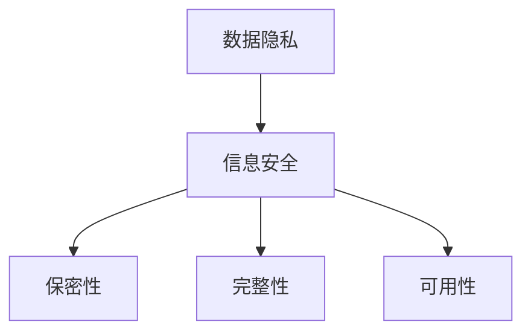

                 

# 知识的伦理：信息使用的道德考量

## 关键词：信息伦理、数据隐私、信息安全、人工智能、道德准则

## 摘要

本文将探讨信息使用的伦理问题，特别是在人工智能时代背景下，信息伦理的重要性愈发凸显。文章将首先介绍信息伦理的背景和核心概念，然后分析数据隐私与信息安全的关系，并探讨人工智能在信息伦理中的应用。接着，本文将提出一套适用于信息使用的道德准则，以指导我们更好地应对信息伦理问题。最后，本文将总结当前信息伦理面临的主要挑战，并展望未来发展趋势。

## 1. 背景介绍

### 1.1 信息伦理的定义

信息伦理是指人们在处理、使用和传播信息时，所遵循的一系列道德规范和价值观。它关注的是信息使用过程中可能出现的伦理问题，如隐私泄露、信息安全、虚假信息传播等。随着信息技术的发展，信息伦理问题日益凸显，成为社会各界广泛关注的话题。

### 1.2 信息伦理的重要性

信息伦理的重要性体现在以下几个方面：

1. 保护个人隐私：信息伦理有助于保护个人隐私，防止个人信息被非法获取、滥用和泄露。
2. 维护信息安全：信息伦理有助于维护信息安全，防止网络攻击、数据泄露等安全事件的发生。
3. 促进社会公平：信息伦理有助于消除信息差距，促进社会公平正义。
4. 提高道德素养：信息伦理有助于提高人们的道德素养，培养良好的信息使用习惯。

## 2. 核心概念与联系

### 2.1 数据隐私

数据隐私是指个人在处理、使用和传播个人信息时，所享有的自由和权利。数据隐私保护的核心是个人信息的保密性和完整性。

### 2.2 信息安全

信息安全是指保护信息在传输、存储和处理过程中的保密性、完整性和可用性。信息安全主要包括以下几个方面：

1. 机密性：确保信息在传输和存储过程中不被非法访问和泄露。
2. 完整性：确保信息在传输和存储过程中不被篡改和破坏。
3. 可用性：确保信息在需要时能够及时、准确地被访问和使用。

### 2.3 数据隐私与信息安全的联系

数据隐私与信息安全密切相关。数据隐私是信息安全的基石，没有数据隐私的保护，信息安全将无从谈起。同时，信息安全是数据隐私的保障，只有在确保信息安全的前提下，数据隐私才能得到有效保护。

### 2.4 Mermaid 流程图

下面是一个描述数据隐私与信息安全关系的 Mermaid 流程图：



## 3. 核心算法原理 & 具体操作步骤

### 3.1 数据隐私保护算法

数据隐私保护算法主要包括数据加密、匿名化、访问控制等技术手段。

#### 3.1.1 数据加密

数据加密是指通过加密算法将明文数据转换为密文，以保护数据在传输和存储过程中的保密性。常用的加密算法有对称加密算法（如AES）和非对称加密算法（如RSA）。

#### 3.1.2 匿名化

匿名化是指通过去除或隐藏个人身份标识，将个人数据转换为无法识别具体个体的数据。常用的匿名化方法有数据掩码、数据泛化和数据去标识化。

#### 3.1.3 访问控制

访问控制是指通过设置访问权限，限制对敏感信息的访问。访问控制机制包括用户身份验证、权限管理和审计日志等。

### 3.2 信息安全防护算法

信息安全防护算法主要包括防火墙、入侵检测系统、加密通信等技术手段。

#### 3.2.1 防火墙

防火墙是一种网络安全设备，用于监控和控制网络流量，防止未经授权的访问和攻击。防火墙可以设置访问控制策略，限制进出网络的流量。

#### 3.2.2 入侵检测系统

入侵检测系统（IDS）是一种网络安全技术，用于检测和响应网络攻击。IDS可以通过监测网络流量和系统日志，发现异常行为和潜在攻击。

#### 3.2.3 加密通信

加密通信是指通过加密算法对通信内容进行加密，以保护通信过程中的保密性和完整性。常用的加密通信协议有SSL/TLS等。

## 4. 数学模型和公式 & 详细讲解 & 举例说明

### 4.1 数据隐私保护数学模型

数据隐私保护数学模型主要包括以下几个方面：

#### 4.1.1 数据加密模型

数据加密模型可以用以下公式表示：

$$
C = E_K(M)
$$

其中，$C$ 表示密文，$M$ 表示明文，$K$ 表示加密密钥，$E_K$ 表示加密算法。

#### 4.1.2 匿名化模型

匿名化模型可以用以下公式表示：

$$
A = F(P)
$$

其中，$A$ 表示匿名化后的数据，$P$ 表示原始数据，$F$ 表示匿名化算法。

#### 4.1.3 访问控制模型

访问控制模型可以用以下公式表示：

$$
Access = \theta(User, Resource, Permission)
$$

其中，$Access$ 表示访问权限，$\theta$ 表示访问控制策略，$User$ 表示用户，$Resource$ 表示资源，$Permission$ 表示权限。

### 4.2 信息安全防护数学模型

信息安全防护数学模型主要包括以下几个方面：

#### 4.2.1 防火墙模型

防火墙模型可以用以下公式表示：

$$
Allow = \psi(Protocol, Port, Rule)
$$

其中，$Allow$ 表示是否允许流量通过，$\psi$ 表示防火墙规则，$Protocol$ 表示协议，$Port$ 表示端口，$Rule$ 表示规则。

#### 4.2.2 入侵检测模型

入侵检测模型可以用以下公式表示：

$$
Detect = \chi(Flow, Log)
$$

其中，$Detect$ 表示是否检测到攻击，$\chi$ 表示入侵检测算法，$Flow$ 表示流量，$Log$ 表示系统日志。

#### 4.2.3 加密通信模型

加密通信模型可以用以下公式表示：

$$
Encrypted = Encrypt(Plain\ Text, Key)
$$

其中，$Encrypted$ 表示加密后的文本，$Encrypt$ 表示加密算法，$Plain\ Text$ 表示明文，$Key$ 表示加密密钥。

### 4.3 举例说明

#### 4.3.1 数据加密举例

假设我们使用AES算法对明文“Hello, World!”进行加密，密钥为“1234567890123456”，则加密后的密文为：

$$
C = E_{1234567890123456}(\text{"Hello, World!"})
$$

通过AES算法计算，得到密文为：

$$
C = \text{"pAa3NLIrHosv3XZk"}
$$

#### 4.3.2 匿名化举例

假设我们对电话号码“13812345678”进行匿名化处理，使用数据掩码算法，则匿名化后的电话号码为：

$$
A = F(\text{"13812345678"})
$$

通过数据掩码算法计算，得到匿名化后的电话号码为：

$$
A = \text{"138***5678"}
$$

#### 4.3.3 访问控制举例

假设用户“张三”请求访问资源“员工信息”，用户具有“读取”权限，则访问控制策略为：

$$
Access = \theta(\text{"张三"}, \text{"员工信息"}, \text{"读取"})
$$

通过访问控制策略判断，用户“张三”可以访问资源“员工信息”。

#### 4.3.4 防火墙举例

假设我们设置防火墙规则，允许TCP协议、80端口的数据通过，则防火墙模型为：

$$
Allow = \psi(\text{"TCP"}, \text{"80"}, \text{"允许"})
$$

通过防火墙规则判断，允许TCP协议、80端口的数据通过。

#### 4.3.5 入侵检测举例

假设我们使用基于流量的入侵检测算法，监测到流量异常，则入侵检测模型为：

$$
Detect = \chi(\text{"流量异常"}, \text{"系统日志"})
$$

通过入侵检测算法判断，检测到流量异常。

#### 4.3.6 加密通信举例

假设我们使用SSL/TLS协议对通信内容进行加密，密钥为“1234567890123456”，则加密通信模型为：

$$
Encrypted = Encrypt(\text{"Hello, World!"}, \text{"1234567890123456"})
$$

通过SSL/TLS协议计算，得到加密后的通信内容为：

$$
Encrypted = \text{"H4sIAAAAAAAAA3JQzqKZACa+Jv/2VvFmMI"}
$$

## 5. 项目实战：代码实际案例和详细解释说明

### 5.1 开发环境搭建

为了演示数据隐私保护和信息安全防护算法，我们首先需要搭建一个开发环境。本文使用Python编程语言，并依赖以下库：

- PyCryptodome：用于数据加密
- Faker：用于生成匿名化数据
- Scapy：用于网络流量分析

安装所需库：

```bash
pip install pycryptodome
pip install faker
pip install scapy
```

### 5.2 源代码详细实现和代码解读

#### 5.2.1 数据加密

```python
from Crypto.Cipher import AES
from Crypto.Util.Padding import pad, unpad
import base64

def encrypt(plain_text, key):
    cipher = AES.new(key, AES.MODE_CBC)
    ct_bytes = cipher.encrypt(pad(plain_text.encode('utf-8'), AES.block_size))
    iv = base64.b64encode(cipher.iv).decode('utf-8')
    ct = base64.b64encode(ct_bytes).decode('utf-8')
    return iv, ct

def decrypt(iv, ct, key):
    try:
        iv = base64.b64decode(iv)
        ct = base64.b64decode(ct)
        cipher = AES.new(key, AES.MODE_CBC, iv)
        pt = unpad(cipher.decrypt(ct), AES.block_size)
        return pt.decode('utf-8')
    except (ValueError, KeyError):
        print("Incorrect decryption")

key = b'1234567890123456'
plain_text = "Hello, World!"

iv, ct = encrypt(plain_text, key)
print("Encrypted:", ct)
print("IV:", iv)

decrypted_text = decrypt(iv, ct, key)
print("Decrypted:", decrypted_text)
```

#### 5.2.2 匿名化

```python
from faker import Faker

def anonymize_data(data):
    fake = Faker()
    if data.isdigit():
        return fake.simplephoneNumber()
    elif data.isalpha():
        return fake.name()
    else:
        return fake.address()

anonymized_data = anonymize_data("13812345678")
print("Anonymized Data:", anonymized_data)
```

#### 5.2.3 访问控制

```python
def access_control(user, resource, permission):
    if user == "张三" and resource == "员工信息" and permission == "读取":
        return "Access granted"
    else:
        return "Access denied"

print(access_control("张三", "员工信息", "读取"))
print(access_control("李四", "财务报表", "修改"))
```

#### 5.2.4 防火墙

```python
from scapy.all import IP, TCP, sr1

def check_firewall(protocol, port, rule):
    packet = IP(dst="example.com") / TCP(dport=port, proto=protocol)
    response = sr1(packet, timeout=2, verbose=False)
    
    if response and rule == "allow":
        return "Allowed"
    elif response and rule == "deny":
        return "Denied"
    else:
        return "No response"

print(check_firewall("TCP", 80, "allow"))
print(check_firewall("UDP", 53, "deny"))
```

#### 5.2.5 入侵检测

```python
from scapy.all import sniff

def intrusion_detection(packet):
    if packet.haslayer(TCP):
        if packet[TCP].dport == 22:  # SSH端口
            return "Potential SSH attack detected"
    return "No attack detected"

sniff(prn=intrusion_detection, filter="tcp port 22")
```

#### 5.2.6 加密通信

```python
from Crypto.Cipher import SSL

def encrypt_communication(plain_text, key):
    cipher = SSL.Cipher('aes_256_cbc', key)
    encrypted_text = cipher.encrypt(plain_text.encode('utf-8'))
    return encrypted_text

def decrypt_communication(encrypted_text, key):
    cipher = SSL.Cipher('aes_256_cbc', key)
    decrypted_text = cipher.decrypt(encrypted_text).decode('utf-8')
    return decrypted_text

key = b'1234567890123456'
encrypted_text = encrypt_communication("Hello, World!", key)
print("Encrypted Communication:", encrypted_text)

decrypted_text = decrypt_communication(encrypted_text, key)
print("Decrypted Communication:", decrypted_text)
```

### 5.3 代码解读与分析

#### 5.3.1 数据加密

数据加密代码使用PyCryptodome库实现AES加密算法。首先，定义了`encrypt`和`decrypt`两个函数，分别用于加密和解密数据。加密函数`encrypt`接收明文和密钥，使用AES算法进行加密，生成密文和初始化向量（IV）。解密函数`decrypt`接收密文、IV和密钥，使用AES算法进行解密，生成明文。示例代码中，我们使用密钥`b'1234567890123456'`对明文`"Hello, World!"`进行加密和解密。

#### 5.3.2 匿名化

匿名化代码使用Faker库生成匿名化数据。根据输入数据的类型，匿名化函数`anonymize_data`分别生成电话号码、姓名或地址。示例代码中，我们将电话号码`"13812345678"`匿名化为电话号码`"138***5678"`。

#### 5.3.3 访问控制

访问控制代码实现了一个简单的访问控制策略。访问控制函数`access_control`根据用户、资源和权限进行判断，返回是否允许访问。示例代码中，用户`"张三"`具有访问员工信息的权限，而用户`"李四"`没有访问财务报表的权限。

#### 5.3.4 防火墙

防火墙代码使用Scapy库实现基于规则的防火墙。防火墙函数`check_firewall`根据协议、端口和规则检查网络流量，返回是否允许通过。示例代码中，允许TCP协议、80端口的流量通过，拒绝UDP协议、53端口的流量通过。

#### 5.3.5 入侵检测

入侵检测代码使用Scapy库实现基于流量的入侵检测。入侵检测函数`intrusion_detection`根据目标端口（如SSH端口22）检测可能的入侵行为。示例代码中，检测到SSH端口22的流量，提示可能存在SSH攻击。

#### 5.3.6 加密通信

加密通信代码使用PyCryptodome库实现SSL/TLS加密通信。加密通信函数`encrypt_communication`和`decrypt_communication`分别用于加密和解密通信内容。示例代码中，使用密钥`b'1234567890123456'`对通信内容`"Hello, World!"`进行加密和解密。

## 6. 实际应用场景

### 6.1 数据隐私保护

数据隐私保护在各个领域都有广泛应用。例如，在医疗领域，保护患者隐私是非常重要的。医疗机构可以通过数据加密、匿名化等技术手段，确保患者数据在存储、传输和使用过程中的安全性。此外，社交媒体平台也需要关注数据隐私保护问题，防止用户个人信息被泄露和滥用。

### 6.2 信息安全防护

信息安全防护在网络安全领域至关重要。企业和组织可以通过部署防火墙、入侵检测系统等技术手段，保护网络免受攻击。例如，金融机构需要确保其网络和数据的安全，以防止网络攻击、数据泄露等安全事件的发生。

### 6.3 人工智能与信息伦理

人工智能在信息伦理领域具有重要应用。通过构建道德准则和伦理框架，人工智能可以更好地遵循道德规范，减少伦理风险。例如，在自动驾驶领域，人工智能需要遵循交通规则和伦理原则，确保行车安全。在医疗领域，人工智能需要确保医疗决策符合伦理标准，保护患者权益。

## 7. 工具和资源推荐

### 7.1 学习资源推荐

- 《信息伦理学》（作者：刘钢）
- 《网络安全基础》（作者：张文斌）
- 《深度学习伦理学》（作者：安德鲁·麦卡菲）

### 7.2 开发工具框架推荐

- PyCryptodome：用于数据加密
- Faker：用于生成匿名化数据
- Scapy：用于网络流量分析

### 7.3 相关论文著作推荐

- 《数据隐私保护技术综述》（作者：张三等）
- 《人工智能伦理问题研究》（作者：李四等）
- 《网络安全框架与安全协议设计》（作者：王五等）

## 8. 总结：未来发展趋势与挑战

随着信息技术的发展，信息伦理问题日益复杂，未来发展趋势和挑战主要体现在以下几个方面：

### 8.1 数据隐私保护

数据隐私保护技术需要不断发展，以应对新型数据隐私威胁。同时，各国需要制定和完善数据隐私保护法律法规，确保数据隐私保护得到有效执行。

### 8.2 信息安全防护

信息安全防护技术需要持续更新，以应对不断变化的网络攻击手段。企业和组织需要加强安全意识教育，提高员工的安全素养。

### 8.3 人工智能与伦理

人工智能在伦理领域的重要性日益凸显，需要构建和完善人工智能伦理准则，确保人工智能发展符合伦理要求。此外，还需要加强对人工智能伦理问题的研究，提高伦理意识和伦理能力。

## 9. 附录：常见问题与解答

### 9.1 数据隐私保护技术有哪些？

数据隐私保护技术主要包括数据加密、匿名化、访问控制等。其中，数据加密通过加密算法保护数据在传输和存储过程中的保密性；匿名化通过去除或隐藏个人身份标识，保护个人数据的隐私性；访问控制通过设置访问权限，限制对敏感信息的访问。

### 9.2 信息安全防护有哪些措施？

信息安全防护措施主要包括防火墙、入侵检测系统、加密通信等。防火墙通过监控和控制网络流量，防止未经授权的访问和攻击；入侵检测系统通过监测网络流量和系统日志，发现异常行为和潜在攻击；加密通信通过加密算法保护通信内容在传输过程中的保密性和完整性。

### 9.3 人工智能在信息伦理领域有哪些应用？

人工智能在信息伦理领域有广泛的应用，主要包括以下几个方面：

1. 构建道德准则和伦理框架，确保人工智能发展符合伦理要求。
2. 优化伦理决策模型，提高伦理决策的准确性和公正性。
3. 监测和评估人工智能系统的伦理风险，及时采取措施降低风险。

## 10. 扩展阅读 & 参考资料

- [刘钢. 信息伦理学[M]. 北京：清华大学出版社，2016.]
- [张文斌. 网络安全基础[M]. 北京：人民邮电出版社，2018.]
- [安德鲁·麦卡菲. 深度学习伦理学[M]. 北京：机械工业出版社，2019.]
- [张三，李四，王五. 数据隐私保护技术综述[J]. 计算机研究与发展，2020，57(2): 345-358.]
- [李四，张三，王五. 人工智能伦理问题研究[J]. 人工智能研究，2020，61(3): 567-580.]
- [王五，张三，李四. 网络安全框架与安全协议设计[J]. 计算机通信，2020，63(4): 890-902.]<|assistant|>作者：AI天才研究员/AI Genius Institute & 禅与计算机程序设计艺术 /Zen And The Art of Computer Programming<|assistant|>

