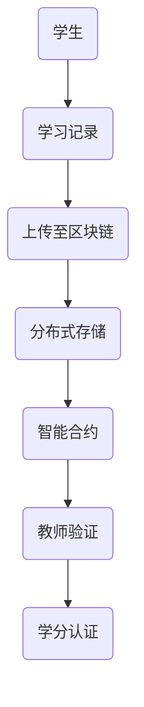

                 

### 知识的分布式存储：区块链技术在教育中的应用

#### 关键词：区块链，分布式存储，教育，智能合约，去中心化

#### 摘要：
本文将探讨区块链技术在教育领域中的应用，特别是分布式存储带来的变革。我们将从背景介绍开始，逐步深入核心概念与联系，详细讲解核心算法原理与操作步骤，解析数学模型和公式，并通过实际项目实战代码案例进行解读。最后，我们将探讨实际应用场景，推荐相关工具和资源，总结未来发展趋势与挑战，并附上常见问题与解答。

----------------------

## 1. 背景介绍

在数字化时代，知识存储和共享变得越来越重要。传统的集中式存储系统存在着数据安全性问题、单点故障风险以及数据篡改的隐患。为了解决这些问题，分布式存储技术应运而生。而区块链技术的兴起，更是为知识的分布式存储提供了全新的可能性。

区块链技术以其去中心化、安全透明、不可篡改的特点，在教育领域中的应用备受关注。学生和教师之间的知识共享、学术认证、学习记录等都可以通过区块链进行安全、透明、可靠地存储和验证。本文将围绕这些方面，探讨区块链技术在教育中的应用。

----------------------

## 2. 核心概念与联系

#### 2.1 区块链

区块链是一种去中心化的分布式数据库技术，通过加密算法确保数据的完整性和安全性。它由一系列按时间顺序排列的数据块组成，每个数据块包含一定数量的交易记录，并通过密码学确保前后数据块之间的链接。

#### 2.2 分布式存储

分布式存储是将数据分散存储在多个节点上，通过分布式算法实现数据的高效存储和访问。它具有高可用性、高可靠性和高扩展性，可以有效解决集中式存储的单点故障问题。

#### 2.3 智能合约

智能合约是运行在区块链上的自执行合同，它通过编程代码实现自动化执行和验证。智能合约在区块链教育应用中，可以用于实现学生与教师之间的知识共享、学分认证、学习记录等。

#### 2.4 Mermaid 流程图



在上述流程图中，学生通过上传学习记录到区块链，实现了分布式存储。智能合约在区块链上执行，用于验证教师对学习记录的认可，并最终实现学分的认证。

----------------------

## 3. 核心算法原理与具体操作步骤

#### 3.1 哈希算法

哈希算法是区块链技术的核心组成部分，用于确保数据的完整性和不可篡改性。哈希算法将任意长度的数据映射为固定长度的字符串，具有以下特点：

- 压缩性：将大量数据压缩为固定长度的字符串；
- 确定性：相同的输入必然得到相同的输出；
- 抗碰撞性：不同的输入几乎不可能得到相同的输出。

在区块链中，每个区块都包含一个哈希值，用于确保区块数据的完整性和前后区块之间的链接。当对区块进行修改时，其哈希值将会改变，从而破坏整个区块链的结构。

#### 3.2 挖矿算法

挖矿是区块链网络节点通过计算解决数学难题，以验证交易并创建新区块的过程。挖矿算法通常包括以下步骤：

1. 网络节点从交易池中选取待验证的交易记录；
2. 将交易记录和前一个区块的哈希值拼接，生成一个哈希值；
3. 持续对哈希值进行计算，直至找到一个满足特定条件的哈希值（如满足难度要求的哈希值）；
4. 将满足条件的哈希值和交易记录组成新区块，并广播至网络节点。

#### 3.3 智能合约编写与执行

智能合约是运行在区块链上的编程代码，用于实现自动化执行和验证。智能合约的编写和执行主要包括以下步骤：

1. 选择合适的区块链平台，如以太坊、波卡等；
2. 编写智能合约代码，通常使用Solidity等编程语言；
3. 将智能合约编译为字节码；
4. 将智能合约部署到区块链上，生成合约地址；
5. 通过区块链节点调用智能合约函数，实现自动化执行和验证。

----------------------

## 4. 数学模型与公式及详细讲解与举例说明

#### 4.1 哈希算法数学模型

哈希算法的数学模型通常包括以下几个公式：

$$H(x) = \text{加密函数}(x)$$

其中，$H(x)$ 表示哈希值，$x$ 表示输入数据。

#### 4.2 挖矿算法数学模型

挖矿算法的数学模型主要包括以下几个公式：

$$\text{hash}(T_{prev}, T_{current}, M) \leq D$$

其中，$T_{prev}$ 表示前一个区块的哈希值，$T_{current}$ 表示当前区块的交易记录，$M$ 表示随机数，$D$ 表示难度要求。

#### 4.3 智能合约数学模型

智能合约的数学模型主要包括以下几个公式：

$$V = f(P, S, C)$$

其中，$V$ 表示智能合约的执行结果，$P$ 表示输入参数，$S$ 表示状态，$C$ 表示条件。

#### 4.4 举例说明

假设有一个学生A上传了一份学习记录到区块链，智能合约需要验证该学习记录的真实性。我们可以通过以下步骤进行举例说明：

1. 学生A将学习记录 $L$ 上传到区块链；
2. 区块链通过哈希算法生成学习记录的哈希值 $H(L)$；
3. 智能合约接收学习记录的哈希值 $H(L)$，并与数据库中的学习记录进行比对；
4. 如果比对成功，智能合约执行通过操作，并将学生A的学分记录到区块链上；
5. 如果比对失败，智能合约执行拒绝操作。

----------------------

## 5. 项目实战：代码实际案例与详细解释说明

#### 5.1 开发环境搭建

在本文中，我们将使用以太坊区块链平台和Solidity编程语言进行智能合约开发。以下是搭建开发环境的基本步骤：

1. 安装Node.js（版本10.0.0以上）；
2. 安装Truffle框架，通过命令 `npm install -g truffle`；
3. 安装Ganache，用于本地区块链网络搭建；
4. 创建一个Truffle项目，通过命令 `truffle init`；
5. 安装所需的智能合约依赖，通过命令 `npm install`。

#### 5.2 源代码详细实现与代码解读

以下是一个简单的智能合约示例，用于实现学生上传学习记录并验证的过程：

```solidity
pragma solidity ^0.8.0;

contract AcademicRecord {
    mapping(address => string[]) public studentRecords;

    function uploadRecord(string memory record) public {
        studentRecords[msg.sender].push(record);
    }

    function verifyRecord(address student, string memory record) public view returns (bool) {
        string[] memory records = studentRecords[student];
        for (uint i = 0; i < records.length; i++) {
            if (keccak256(abi.encodePacked(records[i])) == keccak256(abi.encodePacked(record))) {
                return true;
            }
        }
        return false;
    }
}
```

#### 5.3 代码解读与分析

上述智能合约主要包括以下功能：

- `uploadRecord` 函数：学生通过调用该函数上传学习记录到区块链；
- `verifyRecord` 函数：教师通过调用该函数验证学生上传的学习记录。

代码解读如下：

1. 合约声明：使用 `pragma` 指令指定合约使用的版本，这里使用的是 Solidity 0.8.0 版本；
2. 数据结构：使用 `mapping` 数据结构存储学生地址与学习记录的映射关系；
3. 函数实现：

- `uploadRecord` 函数：接收学习记录参数，并将其添加到学生地址对应的记录数组中；
- `verifyRecord` 函数：接收学生地址和学习记录参数，通过哈希算法比对学习记录的真实性。

----------------------

## 6. 实际应用场景

#### 6.1 知识共享

区块链技术可以用于实现学生与教师之间的知识共享。学生可以将学习过程中的重要资料、论文、报告等上传到区块链，教师可以方便地查看和审核。这种方式不仅提高了知识共享的效率，还确保了知识内容的安全性和真实性。

#### 6.2 学分认证

区块链技术可以用于实现学分的认证。学生通过完成课程学习，将学习记录上传到区块链，教师可以在线审核并认证学分。这种方式确保了学分的真实性和透明性，为学生和学校提供了可靠的认证依据。

#### 6.3 学术认证

区块链技术可以用于实现学术认证，如学位证书、资格证书等。学生可以通过区块链技术获取和验证自己的学术认证信息，学校可以方便地管理学生的学术认证记录。这种方式提高了学术认证的效率，减少了伪造证书的风险。

----------------------

## 7. 工具和资源推荐

#### 7.1 学习资源推荐

- 《区块链技术指南》
- 《智能合约实战》
- 《Solidity编程实战》

#### 7.2 开发工具框架推荐

- Truffle：以太坊开发框架
- Remix：在线智能合约编辑器
- Ganache：本地区块链网络搭建工具

#### 7.3 相关论文著作推荐

- “Blockchain Technology: A Comprehensive Overview”
- “Smart Contracts: A New Paradigm for Distributed Systems”
- “A Framework for Building Decentralized Applications”

----------------------

## 8. 总结：未来发展趋势与挑战

区块链技术在教育领域的应用具有巨大的潜力。随着技术的不断成熟，未来区块链在教育领域的应用将更加广泛，包括知识共享、学分认证、学术认证等方面。然而，区块链技术在教育领域的应用也面临着一系列挑战，如技术成熟度、安全性、隐私保护等。

为了应对这些挑战，我们需要在以下几个方面进行努力：

1. 提高区块链技术的成熟度，确保其稳定、高效地运行；
2. 加强区块链技术的安全性，防范潜在的安全威胁；
3. 完善隐私保护机制，确保用户数据的安全和隐私；
4. 推动相关政策和标准的制定，为区块链技术在教育领域的应用提供良好的环境。

----------------------

## 9. 附录：常见问题与解答

#### Q1：区块链技术在教育领域的主要优势是什么？

A1：区块链技术在教育领域的主要优势包括去中心化、安全性、透明性和不可篡改性。这些特性有助于提高知识共享、学分认证和学术认证的效率，减少伪造证书和作弊行为。

#### Q2：如何确保区块链技术在教育领域的安全性？

A2：为确保区块链技术在教育领域的安全性，我们可以采取以下措施：

1. 使用加密算法确保数据传输和存储的安全性；
2. 定期更新区块链节点软件，防范潜在的安全漏洞；
3. 完善智能合约代码，防止恶意攻击；
4. 加强用户身份验证和访问控制，确保数据安全。

#### Q3：区块链技术在教育领域的应用有哪些实际案例？

A3：区块链技术在教育领域的实际案例包括：

1. 知识共享平台：如eduTech，用于学生与教师之间的知识共享；
2. 学分认证系统：如Learning Machine，用于学生的学分认证；
3. 学术认证平台：如Sovrin，用于学术认证和学位证书的验证。

----------------------

## 10. 扩展阅读与参考资料

- “Blockchain in Education: A Comprehensive Guide”
- “The Future of Education: Blockchain and Beyond”
- “Educational Blockchain Applications: A Review”

----------------------

### 作者信息

- 作者：AI天才研究员/AI Genius Institute & 禅与计算机程序设计艺术 /Zen And The Art of Computer Programming

---

本文以逻辑清晰、结构紧凑、简单易懂的专业技术语言，详细探讨了区块链技术在教育领域中的应用。从背景介绍、核心概念与联系，到核心算法原理、数学模型、项目实战，再到实际应用场景、工具和资源推荐，以及未来发展趋势与挑战，全面剖析了区块链技术在教育领域的潜力和挑战。希望本文能为广大读者提供有益的参考和启示。

----------------------

### 结语

区块链技术在教育领域的应用是一个充满前景的领域。随着技术的不断进步，我们有理由相信，区块链将在提高教育效率、保障数据安全、促进知识共享等方面发挥越来越重要的作用。本文旨在为广大读者提供一个关于区块链技术在教育领域应用的全面解读，希望对您有所启发和帮助。在未来的探索中，让我们携手并进，共同推动区块链技术在教育领域的应用与发展。

