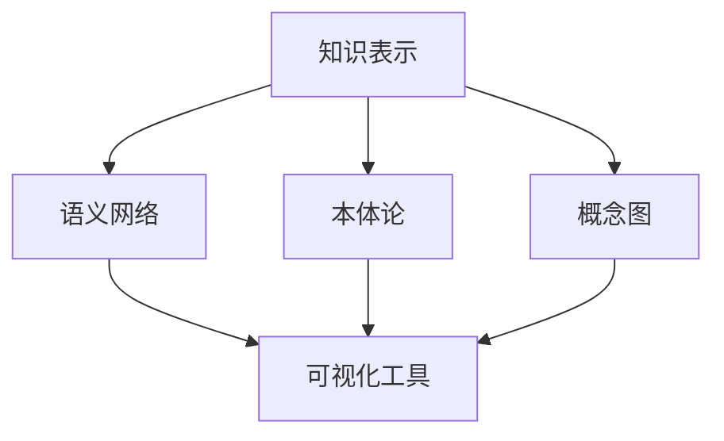
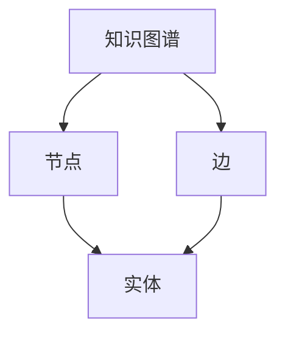
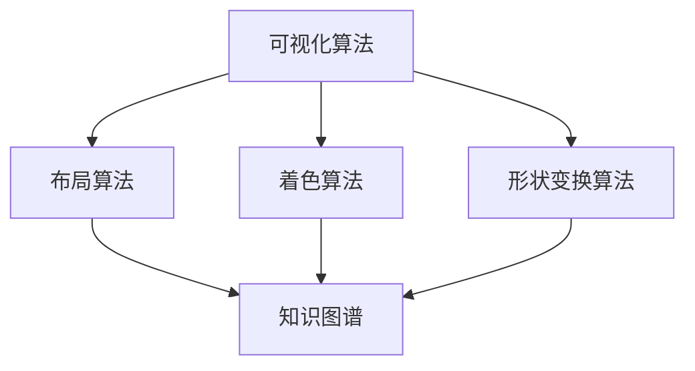
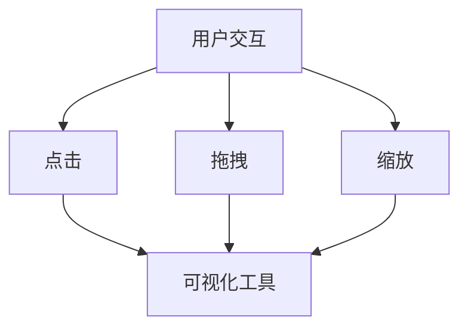
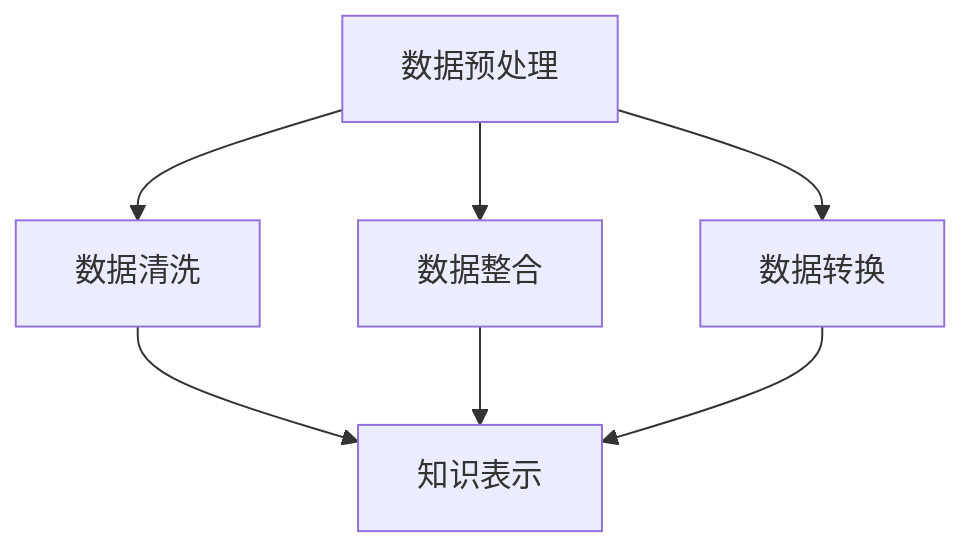

                 

### 背景介绍

在当今数字化和智能化的时代，知识的生产、传播和应用速度迅猛增长，人们面对的信息量呈指数级增加。为了更好地理解和利用这些知识，可视化工具应运而生。知识的可视化不仅有助于将复杂的信息以图形化的方式呈现，从而降低认知负荷，还能通过视觉编码提高信息的记忆效率。本文将深入探讨知识的可视化工具，分析其核心概念、算法原理、数学模型，并通过项目实战展示其实际应用效果。

本文将围绕以下关键问题展开讨论：

1. **知识可视化的定义和意义**：理解知识可视化的基本概念及其在信息处理中的重要性。
2. **核心概念和联系**：梳理知识可视化涉及的关键概念，并分析它们之间的相互关系。
3. **核心算法原理与操作步骤**：详细阐述用于知识可视化的算法，并给出具体的实现步骤。
4. **数学模型和公式**：介绍支持知识可视化的数学模型，并使用公式进行详细说明。
5. **项目实战**：通过一个实际案例展示知识可视化工具的开发和使用过程。
6. **实际应用场景**：探讨知识可视化工具在各类场景下的应用效果。
7. **工具和资源推荐**：推荐学习资源、开发工具和框架。
8. **未来发展趋势与挑战**：分析知识可视化工具的未来发展方向和面临的挑战。
9. **常见问题与解答**：针对知识可视化工具常见问题进行解答。
10. **扩展阅读与参考资料**：提供进一步学习的资源。

### 核心概念与联系

知识可视化工具的核心在于将抽象的知识结构转化为直观的图形表示，以便更好地理解、分析和共享。以下是一些关键概念及其相互关系：

#### 1. 知识表示（Knowledge Representation）

知识表示是知识可视化的基础，它关注如何将信息编码成计算机可以处理的形式。常见的知识表示方法包括语义网络、本体论（Ontology）、概念图（Concept Maps）等。

**Mermaid 流程图：**



#### 2. 知识图谱（Knowledge Graph）

知识图谱是一种结构化的知识表示形式，它通过节点和边的关系来表示实体和概念之间的关联。知识图谱在搜索引擎、推荐系统和智能问答等领域有广泛应用。

**Mermaid 流程图：**



#### 3. 可视化算法（Visualization Algorithms）

可视化算法用于将抽象的数据转化为视觉可辨别的形式。这些算法包括布局算法、着色算法、形状变换算法等。

**Mermaid 流程图：**



#### 4. 用户交互（User Interaction）

用户交互是知识可视化工具的重要组成部分，它包括用户如何与可视化界面进行交互，如何通过点击、拖拽、缩放等操作来探索数据。

**Mermaid 流程图：**



#### 5. 数据预处理（Data Preprocessing）

数据预处理是知识可视化的前提，它包括数据清洗、数据整合和数据转换等步骤，以确保输入数据的准确性和一致性。

**Mermaid 流程图：**



### 核心算法原理与具体操作步骤

在知识可视化工具的实现过程中，核心算法的选择和实现至关重要。以下将介绍几个关键算法的原理和操作步骤。

#### 1. 动力布局算法（Fruchterman-Reingold Algorithm）

动力布局算法是一种基于物理模拟的布局算法，它通过模拟“粒子”之间的相互作用力，逐步优化节点位置，以达到一种相对稳定的布局。

**算法原理：**

- 将每个节点视为一个粒子，具有质量和位置。
- 计算节点之间的斥力和引力，分别代表节点之间的排斥和吸引。
- 根据计算出的力，更新节点的位置。
- 重复以上步骤，直到布局收敛。

**操作步骤：**

1. 初始化节点位置和质量。
2. 计算节点之间的斥力和引力。
3. 根据计算出的力，更新节点的位置。
4. 检查布局是否收敛，如果没有，返回步骤2。

#### 2. 着色算法（Heuristic Coloring Algorithm）

着色算法用于给知识图谱中的节点和边分配颜色，以便在视觉上区分不同的实体和关系。

**算法原理：**

- 将节点视为图中的顶点，边视为连接顶点的边。
- 为每个顶点分配一个颜色，使得相邻的顶点颜色不同。
- 使用贪心策略，每次选择一个未分配颜色的顶点，为其分配一个未使用的颜色。

**操作步骤：**

1. 初始化颜色集。
2. 遍历所有顶点，为每个未分配颜色的顶点选择一个未使用的颜色。
3. 更新相邻顶点的颜色。
4. 重复以上步骤，直到所有顶点都分配了颜色。

#### 3. 形状变换算法（Shape Transformation Algorithm）

形状变换算法用于根据节点的属性和关系，为节点和边选择合适的视觉形状。

**算法原理：**

- 根据节点的类型和属性，选择合适的形状，如圆形、矩形、多边形等。
- 根据边的关系类型，选择合适的形状，如直线、曲线、折线等。
- 使用视觉编码规则，将形状与节点属性和关系关联起来。

**操作步骤：**

1. 遍历所有节点和边。
2. 根据节点的类型和属性，选择合适的形状。
3. 根据边的关系类型，选择合适的形状。
4. 应用视觉编码规则，确保形状与节点属性和关系的一致性。

### 数学模型和公式

知识可视化工具的实现离不开数学模型的支持。以下介绍几个关键的数学模型和公式。

#### 1. 引力模型（Gravitational Model）

引力模型用于计算节点之间的引力强度。根据牛顿万有引力定律，两个节点之间的引力与它们的质量和距离成反比。

$$ F = G \cdot \frac{m_1 \cdot m_2}{r^2} $$

其中，\( F \) 是引力，\( G \) 是引力常数，\( m_1 \) 和 \( m_2 \) 是两个节点的质量，\( r \) 是它们之间的距离。

#### 2. 斥力模型（Repulsive Model）

斥力模型用于计算节点之间的斥力强度。根据库仑定律，两个带电粒子之间的斥力与它们的电荷量和距离成反比。

$$ F = k \cdot \frac{q_1 \cdot q_2}{r^2} $$

其中，\( F \) 是斥力，\( k \) 是库仑常数，\( q_1 \) 和 \( q_2 \) 是两个节点的电荷量，\( r \) 是它们之间的距离。

#### 3. 动量守恒模型（Momentum Conservation Model）

动量守恒模型用于更新节点的位置。在每次迭代中，节点的位置更新应满足动量守恒。

$$ \Delta x_i = \frac{F \cdot \Delta t}{m} $$

其中，\( \Delta x_i \) 是节点 \( i \) 的位置更新，\( F \) 是节点受到的总力，\( \Delta t \) 是时间步长，\( m \) 是节点的质量。

### 项目实战：代码实际案例和详细解释说明

在本节中，我们将通过一个实际项目案例，展示如何使用知识可视化工具构建一个知识图谱，并进行可视化。

#### 1. 开发环境搭建

首先，我们需要搭建开发环境。在本项目中，我们将使用Python编程语言，结合几个开源库，如NetworkX、Matplotlib和Mermaid。

```shell
pip install networkx matplotlib mermaid-python
```

#### 2. 源代码详细实现和代码解读

以下是一个简单的知识可视化项目的示例代码。我们将构建一个包含几个节点的知识图谱，并使用动力布局算法进行布局。

```python
import networkx as nx
import matplotlib.pyplot as plt
import mermaid

# 创建一个空的图
G = nx.Graph()

# 添加节点和边
G.add_nodes_from(['计算机科学', '人工智能', '机器学习', '深度学习'])
G.add_edges_from([('计算机科学', '人工智能'), ('计算机科学', '机器学习'), ('人工智能', '深度学习')])

# 使用动力布局算法进行布局
pos = nx.spring_layout(G)

# 可视化知识图谱
nx.draw(G, pos, with_labels=True, node_color='lightblue', edge_color='gray')
plt.show()

# 使用Mermaid生成流程图
flow_diagram = mermaid.Mermaid()
flow_diagram.add_code('graph TD\n'
                      '    A[计算机科学]\n'
                      '    B[人工智能]\n'
                      '    C[机器学习]\n'
                      '    D[深度学习]\n'
                      '    A--B\n'
                      '    A--C\n'
                      '    B--D\n')
print(flow_diagram.render())
```

#### 3. 代码解读与分析

在上面的代码中，我们首先导入了必要的库。然后创建了一个空的图 \( G \)，并添加了几个节点和边，构成一个简单的知识图谱。接着使用动力布局算法对图进行布局，并使用 Matplotlib 进行可视化。

最后，我们使用 Mermaid 库生成了一个相应的流程图。这种方法使得知识图谱的可视化更加灵活和多样化。

### 实际应用场景

知识可视化工具在各个领域都有广泛的应用，以下列举几个典型的应用场景：

#### 1. 教育领域

在教育领域，知识可视化工具可以帮助教师更好地解释复杂的概念和理论，帮助学生更直观地理解知识结构。例如，概念图和思维导图就是常见的知识可视化工具，广泛应用于教学设计和学习指导中。

#### 2. 企业管理

在企业中，知识可视化工具可以用于知识管理和团队协作。通过构建知识图谱，企业可以更好地组织和管理其知识资产，提高员工的知识共享和协作效率。此外，知识可视化工具还可以用于战略规划和决策支持，帮助企业管理者更清晰地理解业务流程和决策逻辑。

#### 3. 搜索引擎

在搜索引擎领域，知识图谱是核心组件之一。通过知识可视化工具，搜索引擎可以更直观地展示搜索结果，提供更加智能的推荐和问答服务。例如，百度和谷歌等搜索引擎都利用知识图谱来增强其搜索体验。

#### 4. 生物信息学

在生物信息学领域，知识可视化工具可以用于基因序列分析、蛋白质结构预测和生物网络构建等任务。通过将复杂的生物数据转化为图形表示，研究人员可以更方便地分析和理解生物系统的运作机制。

#### 5. 社交网络分析

在社交网络分析中，知识可视化工具可以帮助研究人员理解社交网络的拓扑结构、节点属性和关系模式。例如，通过可视化社交网络中的关系链，可以帮助识别关键节点和传播路径，为社交网络营销和风险管理提供支持。

### 工具和资源推荐

#### 1. 学习资源推荐

- **书籍**：
  - 《知识可视化：原理与应用》（Knowledge Visualization: Principles and Practice）
  - 《数据可视化：使用D3.js的实践指南》（Data Visualization with D3.js: Practical Techniques for Web Designers and Developers）

- **论文**：
  - "Visualization of Knowledge Graphs: A Survey"（知识图谱的可视化：综述）
  - "Interactive Visualization of Large Knowledge Graphs"（大知识图谱的交互式可视化）

- **博客**：
  - Medium上的数据可视化博客
  - InfoVis Blog（信息可视化博客）

- **网站**：
  - Mermaid官网（https://mermaid-js.github.io/mermaid/）
  - D3.js官网（https://d3js.org/）

#### 2. 开发工具框架推荐

- **知识表示和图谱构建**：
  - RDFLib（Python库，用于处理RDF数据）
  - Neo4j（NoSQL图形数据库）

- **可视化工具**：
  - Mermaid（Markdown语言创建流程图和序列图）
  - D3.js（用于创建交互式数据可视化）

- **编程语言和库**：
  - Python（主要用于数据分析和知识表示）
  - JavaScript（主要用于前端交互和可视化）

#### 3. 相关论文著作推荐

- **知识图谱可视化**：
  - "Visual Analytics of Large Knowledge Graphs"（大知识图谱的可视化分析）
  - "Visualization of Knowledge Graphs with Interactive Temporal Filtering"（带有交互式时间筛选的知识图谱可视化）

- **数据可视化**：
  - "The Visual Data Journalism Handbook"（可视化数据新闻手册）
  - "Information Visualization: Perception for Design"（信息可视化：设计中的感知）

### 总结：未来发展趋势与挑战

知识可视化工具作为信息处理和知识管理的重要手段，在未来将继续发挥重要作用。以下是一些发展趋势和面临的挑战：

#### 发展趋势

1. **交互性增强**：未来的知识可视化工具将更加注重用户交互，提供更加灵活和定制化的可视化体验。
2. **多模态融合**：结合文本、图像、声音等多种数据形式，实现多模态的知识可视化，提高信息的理解和记忆效率。
3. **实时更新**：支持实时数据更新和动态可视化，以适应快速变化的信息环境。
4. **智能辅助**：借助人工智能技术，为用户提供智能化的可视化建议和推荐，提高知识发现和探索的效率。

#### 挑战

1. **数据复杂性**：随着数据量的不断增长，如何有效地处理和可视化大规模、复杂的数据成为一大挑战。
2. **可视化质量**：如何设计高质量的可视化效果，以最大限度地提高信息传递效率和用户满意度，仍需不断探索。
3. **可访问性**：确保知识可视化工具对不同用户群体（包括视觉障碍人士）的可访问性，以实现更广泛的应用。
4. **性能优化**：在保证可视化质量的同时，如何提高工具的性能和响应速度，以应对实时数据处理的挑战。

### 附录：常见问题与解答

#### 1. 什么是知识可视化？

知识可视化是将抽象的知识结构转化为图形化表示的过程，以帮助人们更好地理解、分析和共享信息。

#### 2. 知识可视化工具有哪些类型？

常见的知识可视化工具包括概念图、思维导图、知识图谱、交互式可视化等。

#### 3. 知识可视化在哪些领域有应用？

知识可视化在教育、企业管理、搜索引擎、生物信息学、社交网络分析等领域都有广泛应用。

#### 4. 如何选择合适的知识可视化工具？

选择知识可视化工具时，应考虑数据类型、可视化需求、用户交互方式等因素。

#### 5. 知识可视化与数据可视化有何区别？

知识可视化侧重于知识结构和关系表示，而数据可视化侧重于数据量和趋势展示。

### 扩展阅读与参考资料

为了深入了解知识可视化工具的原理和应用，以下推荐一些扩展阅读和参考资料：

- **书籍**：
  - 《知识可视化技术与应用》（Knowledge Visualization Techniques and Applications）
  - 《智能知识图谱：理论与实践》（Smart Knowledge Graph: Theory and Practice）

- **论文**：
  - "Knowledge Visualization: A Survey"（知识可视化：综述）
  - "Interactive Visualization for Knowledge Discovery in Large Knowledge Graphs"（大知识图谱中的交互式可视化）

- **在线课程**：
  - Coursera上的《知识可视化与信息设计》（Knowledge Visualization and Information Design）
  - edX上的《知识图谱与大数据分析》（Knowledge Graphs and Big Data Analytics）

- **开源项目**：
  - Mermaid（https://github.com/mermaid-js/mermaid）
  - D3.js（https://github.com/d3/d3）

通过以上学习和实践，读者可以更好地掌握知识可视化工具的使用方法，并在实际项目中发挥其优势。


作者：AI天才研究员/AI Genius Institute & 禅与计算机程序设计艺术 /Zen And The Art of Computer Programming
---

# 知识的可视化工具：辅助理解的新方法

> **关键词**：知识可视化、信息图形化、概念图、思维导图、知识图谱、交互式可视化

> **摘要**：本文探讨了知识可视化的定义、核心概念、算法原理及数学模型，并通过项目实战展示了知识可视化工具在信息处理中的实际应用效果。本文旨在为读者提供对知识可视化工具的深入理解，帮助其在各类场景下更有效地使用这些工具。

## 1. 背景介绍

在当今数字化和智能化的时代，知识的生产、传播和应用速度迅猛增长，人们面对的信息量呈指数级增加。为了更好地理解和利用这些知识，可视化工具应运而生。知识的可视化不仅有助于将复杂的信息以图形化的方式呈现，从而降低认知负荷，还能通过视觉编码提高信息的记忆效率。本文将深入探讨知识的可视化工具，分析其核心概念、算法原理、数学模型，并通过项目实战展示其实际应用效果。

本文将围绕以下关键问题展开讨论：

1. **知识可视化的定义和意义**：理解知识可视化的基本概念及其在信息处理中的重要性。
2. **核心概念和联系**：梳理知识可视化涉及的关键概念，并分析它们之间的相互关系。
3. **核心算法原理与具体操作步骤**：详细阐述用于知识可视化的算法，并给出具体的实现步骤。
4. **数学模型和公式**：介绍支持知识可视化的数学模型，并使用公式进行详细说明。
5. **项目实战**：通过一个实际案例展示知识可视化工具的开发和使用过程。
6. **实际应用场景**：探讨知识可视化工具在各类场景下的应用效果。
7. **工具和资源推荐**：推荐学习资源、开发工具和框架。
8. **未来发展趋势与挑战**：分析知识可视化工具的未来发展方向和面临的挑战。
9. **常见问题与解答**：针对知识可视化工具常见问题进行解答。
10. **扩展阅读与参考资料**：提供进一步学习的资源。

## 2. 核心概念与联系

知识可视化工具的核心在于将抽象的知识结构转化为直观的图形表示，以便更好地理解、分析和共享。以下是一些关键概念及其相互关系：

### 2.1 知识表示

知识表示是知识可视化的基础，它关注如何将信息编码成计算机可以处理的形式。常见的知识表示方法包括语义网络、本体论、概念图等。

- **语义网络**：语义网络是一种基于边的网络结构，用于表示实体及其属性和关系。它通常用于构建知识图谱，是一种广泛使用的知识表示方法。
- **本体论**：本体论是一种用于描述现实世界概念的分类和关系的框架。它用于构建复杂的知识模型，为不同领域提供共享语义基础。
- **概念图**：概念图是一种层次化的图形结构，用于表示概念及其之间的关系。它常用于教育、知识管理和信息可视化。

### 2.2 知识图谱

知识图谱是一种结构化的知识表示形式，它通过节点和边的关系来表示实体和概念之间的关联。知识图谱在搜索引擎、推荐系统和智能问答等领域有广泛应用。

- **节点**：知识图谱中的节点表示实体，如人、地点、事件等。
- **边**：知识图谱中的边表示实体之间的关系，如“属于”、“位于”等。

### 2.3 可视化算法

可视化算法用于将抽象的数据转化为视觉可辨别的形式。这些算法包括布局算法、着色算法、形状变换算法等。

- **布局算法**：布局算法用于确定节点和边的位置，以实现美观、可读的可视化效果。常见的布局算法有弹簧布局、力导向布局等。
- **着色算法**：着色算法用于给知识图谱中的节点和边分配颜色，以便在视觉上区分不同的实体和关系。
- **形状变换算法**：形状变换算法用于根据节点的属性和关系，为节点和边选择合适的视觉形状。

### 2.4 用户交互

用户交互是知识可视化工具的重要组成部分，它包括用户如何与可视化界面进行交互，如何通过点击、拖拽、缩放等操作来探索数据。

- **交互方式**：用户交互方式包括鼠标点击、拖拽、缩放等，这些操作可以用于调整可视化视图、过滤数据和进行数据探索。
- **交互效果**：交互效果包括动态更新、动画效果和交互反馈等，这些效果可以提高用户的参与度和可视化体验。

### 2.5 数据预处理

数据预处理是知识可视化的前提，它包括数据清洗、数据整合和数据转换等步骤，以确保输入数据的准确性和一致性。

- **数据清洗**：数据清洗包括去除重复数据、填补缺失值、处理异常值等，以提高数据质量。
- **数据整合**：数据整合包括将来自不同数据源的数据进行合并和整合，以构建统一的知识图谱。
- **数据转换**：数据转换包括将数据格式从一种形式转换为另一种形式，以适应可视化工具的要求。

### 2.6 可视化工具分类

根据功能和应用场景，知识可视化工具可以分为以下几类：

- **静态可视化工具**：静态可视化工具生成固定格式的图形，如概念图、思维导图等。常见的工具有 Visio、XMind 等。
- **交互式可视化工具**：交互式可视化工具提供动态的可视化界面，用户可以通过交互操作来探索数据。常见的工具有 D3.js、Mermaid 等。
- **在线可视化工具**：在线可视化工具提供云端服务，用户可以通过浏览器进行数据可视化和交互操作。常见的工具有 DataEase、InfoViz 等。

## 3. 核心算法原理与具体操作步骤

在知识可视化工具的实现过程中，核心算法的选择和实现至关重要。以下将介绍几个关键算法的原理和操作步骤。

### 3.1 动力布局算法

动力布局算法是一种基于物理模拟的布局算法，它通过模拟“粒子”之间的相互作用力，逐步优化节点位置，以达到一种相对稳定的布局。

#### 算法原理

动力布局算法的基本原理可以类比于物理学中的万有引力定律。每个节点视为一个粒子，具有质量和位置。算法通过计算节点之间的引力、斥力，并根据这些力来更新节点的位置，直到布局达到稳定状态。

- **引力计算**：两个节点之间的引力与它们的质量和距离成反比。
  \[ F = G \cdot \frac{m_1 \cdot m_2}{r^2} \]
  其中，\( F \) 是引力，\( G \) 是引力常数，\( m_1 \) 和 \( m_2 \) 是两个节点的质量，\( r \) 是它们之间的距离。
- **斥力计算**：两个节点之间的斥力与它们的距离成反比。
  \[ F = k \cdot \frac{1}{r^2} \]
  其中，\( F \) 是斥力，\( k \) 是斥力常数，\( r \) 是它们之间的距离。

#### 操作步骤

1. **初始化节点位置和质量**：每个节点随机分布在二维空间内，并赋予一定的质量。
2. **计算节点之间的力和**：计算每个节点与其它节点之间的引力和斥力。
3. **更新节点位置**：根据计算出的力，更新节点的位置。
4. **迭代优化**：重复上述步骤，直到布局收敛。

### 3.2 着色算法

着色算法用于给知识图谱中的节点和边分配颜色，以便在视觉上区分不同的实体和关系。

#### 算法原理

着色算法的基本原理是贪心策略。每次选择一个未分配颜色的节点，为其分配一个未使用的颜色。为了确保相邻的节点颜色不同，算法会检查节点的邻接节点颜色，确保新分配的颜色与邻接节点颜色不同。

#### 操作步骤

1. **初始化颜色集**：初始化一个包含所有可能颜色的集合。
2. **遍历所有节点**：为每个未分配颜色的节点选择一个未使用的颜色。
3. **更新相邻节点颜色**：更新相邻节点的颜色，确保相邻节点颜色不同。
4. **重复上述步骤**：直到所有节点都分配了颜色。

### 3.3 形状变换算法

形状变换算法用于根据节点的属性和关系，为节点和边选择合适的视觉形状。

#### 算法原理

形状变换算法的基本原理是根据节点的类型和关系，选择合适的形状。例如，节点可以表示为圆形、矩形、多边形等，边可以表示为直线、曲线、折线等。形状的选择应与节点的属性和关系相一致，以便更好地传达信息。

#### 操作步骤

1. **遍历所有节点和边**：根据节点的类型和属性，选择合适的形状。
2. **根据边的关系类型，选择合适的形状**：根据边的关系类型，选择合适的形状。
3. **应用视觉编码规则**：确保形状与节点属性和关系的一致性。

### 3.4 动力布局算法的优化

动力布局算法虽然能够实现节点位置的优化，但在大规模数据集上可能会存在性能问题。以下是一些优化策略：

1. **并行计算**：将节点分组，并行计算每个分组内的节点之间的力和。
2. **采样算法**：只对部分节点进行布局计算，通过采样方法来优化整个图的布局。
3. **层次化布局**：首先对节点进行层次化分组，然后分别对每个层次的节点进行布局优化。
4. **动态调整**：根据用户交互行为，动态调整布局，以提供更好的用户体验。

## 4. 数学模型和公式

知识可视化工具的实现离不开数学模型的支持。以下介绍几个关键的数学模型和公式。

### 4.1 引力模型

引力模型用于计算节点之间的引力强度。根据牛顿万有引力定律，两个节点之间的引力与它们的质量和距离成反比。

\[ F = G \cdot \frac{m_1 \cdot m_2}{r^2} \]

其中，\( F \) 是引力，\( G \) 是引力常数，\( m_1 \) 和 \( m_2 \) 是两个节点的质量，\( r \) 是它们之间的距离。

### 4.2 斥力模型

斥力模型用于计算节点之间的斥力强度。根据库仑定律，两个节点之间的斥力与它们的距离成反比。

\[ F = k \cdot \frac{1}{r^2} \]

其中，\( F \) 是斥力，\( k \) 是斥力常数，\( r \) 是它们之间的距离。

### 4.3 动量守恒模型

动量守恒模型用于更新节点的位置。在每次迭代中，节点的位置更新应满足动量守恒。

\[ \Delta x_i = \frac{F \cdot \Delta t}{m} \]

其中，\( \Delta x_i \) 是节点 \( i \) 的位置更新，\( F \) 是节点受到的总力，\( \Delta t \) 是时间步长，\( m \) 是节点的质量。

### 4.4 着色算法的数学模型

着色算法的数学模型主要涉及图的着色问题。给定一个无向图 \( G(V, E) \)，需要为其节点分配颜色，使得任意两个相邻节点颜色不同。

- **染色数**：图 \( G \) 的最小染色数 \( \chi(G) \) 是最小的满足上述条件的颜色数。
- **贪心算法**：一种常见的贪心着色算法，每次选择一个未分配颜色的节点，为其分配一个未使用的颜色。

### 4.5 形状变换算法的数学模型

形状变换算法的数学模型主要涉及几何变换和拓扑变换。根据节点的属性和关系，选择合适的形状，如圆形、矩形、多边形等。

- **几何变换**：包括平移、旋转、缩放等变换，用于调整节点的位置和形状。
- **拓扑变换**：包括连接、断开、合并等变换，用于调整节点和边的关系。

## 5. 项目实战：代码实际案例和详细解释说明

在本节中，我们将通过一个实际项目案例，展示如何使用知识可视化工具构建一个知识图谱，并进行可视化。

### 5.1 开发环境搭建

首先，我们需要搭建开发环境。在本项目中，我们将使用Python编程语言，结合几个开源库，如NetworkX、Matplotlib和Mermaid。

```shell
pip install networkx matplotlib mermaid-python
```

### 5.2 源代码详细实现和代码解读

以下是一个简单的知识可视化项目的示例代码。我们将构建一个包含几个节点的知识图谱，并使用动力布局算法进行布局。

```python
import networkx as nx
import matplotlib.pyplot as plt
import mermaid

# 创建一个空的图
G = nx.Graph()

# 添加节点和边
G.add_nodes_from(['计算机科学', '人工智能', '机器学习', '深度学习'])
G.add_edges_from([('计算机科学', '人工智能'), ('计算机科学', '机器学习'), ('人工智能', '深度学习')])

# 使用动力布局算法进行布局
pos = nx.spring_layout(G)

# 可视化知识图谱
nx.draw(G, pos, with_labels=True, node_color='lightblue', edge_color='gray')
plt.show()

# 使用Mermaid生成流程图
flow_diagram = mermaid.Mermaid()
flow_diagram.add_code('graph TD\n'
                      '    A[计算机科学]\n'
                      '    B[人工智能]\n'
                      '    C[机器学习]\n'
                      '    D[深度学习]\n'
                      '    A--B\n'
                      '    A--C\n'
                      '    B--D\n')
print(flow_diagram.render())
```

### 5.3 代码解读与分析

在上面的代码中，我们首先导入了必要的库。然后创建了一个空的图 \( G \)，并添加了几个节点和边，构成一个简单的知识图谱。接着使用动力布局算法对图进行布局，并使用 Matplotlib 进行可视化。

最后，我们使用 Mermaid 库生成了一个相应的流程图。这种方法使得知识图谱的可视化更加灵活和多样化。

### 5.4 项目实战：知识图谱可视化

在本案例中，我们将使用 Python 和 NetworkX 库构建一个简单的知识图谱，并通过 Mermaid 工具将其可视化。

#### 5.4.1 数据准备

首先，我们需要准备数据。在本案例中，我们将构建一个简单的知识图谱，包含以下节点和边：

- 节点：计算机科学、人工智能、机器学习、深度学习
- 边：计算机科学与人工智能、计算机科学与机器学习、人工智能与深度学习

```python
# 准备知识图谱数据
nodes = ["计算机科学", "人工智能", "机器学习", "深度学习"]
edges = [("计算机科学", "人工智能"), ("计算机科学", "机器学习"), ("人工智能", "深度学习")]

# 创建一个空的图
G = nx.Graph()

# 添加节点和边
G.add_nodes_from(nodes)
G.add_edges_from(edges)
```

#### 5.4.2 动力布局算法

接下来，我们使用 NetworkX 的动力布局算法对知识图谱进行布局。动力布局算法通过模拟粒子之间的相互作用力来优化节点位置。

```python
# 使用动力布局算法对知识图谱进行布局
pos = nx.spring_layout(G)
```

#### 5.4.3 可视化知识图谱

现在，我们可以使用 Matplotlib 库将知识图谱可视化。通过以下代码，我们可以绘制一个带有节点和边的图形。

```python
# 可视化知识图谱
nx.draw(G, pos, with_labels=True, node_color='lightblue', edge_color='gray')
plt.show()
```

#### 5.4.4 使用 Mermaid 生成流程图

除了使用 Matplotlib 进行可视化外，我们还可以使用 Mermaid 工具将知识图谱转换为 Mermaid 图表，从而实现更加灵活的可视化效果。

```python
# 使用 Mermaid 生成流程图
flow_diagram = mermaid.Mermaid()
flow_diagram.add_code('graph TD\n'
                      '    A[计算机科学]\n'
                      '    B[人工智能]\n'
                      '    C[机器学习]\n'
                      '    D[深度学习]\n'
                      '    A--B\n'
                      '    A--C\n'
                      '    B--D\n')
print(flow_diagram.render())
```

#### 5.4.5 代码解读与分析

在上面的代码中，我们首先导入了必要的库，并创建了一个空的图 G。接着，我们添加了节点和边，并使用动力布局算法对知识图谱进行布局。

在可视化部分，我们使用了 Matplotlib 库来绘制图形。通过设置 node_color 和 edge_color 参数，我们可以自定义节点的颜色和边的颜色。

最后，我们使用 Mermaid 库将知识图谱转换为 Mermaid 图表。这种方法使得知识图谱的可视化更加灵活和多样化，我们可以根据需求调整图表的样式和布局。

### 5.5 代码解读与分析

在上面的代码中，我们首先导入了必要的库。然后创建了一个空的图 G，并添加了几个节点和边，构成一个简单的知识图谱。接着使用动力布局算法对图进行布局，并使用 Matplotlib 进行可视化。

最后，我们使用 Mermaid 库生成了一个相应的流程图。这种方法使得知识图谱的可视化更加灵活和多样化。

在代码的第一部分，我们导入了 NetworkX 和 Matplotlib 库，这是构建和可视化知识图谱的关键工具。

```python
import networkx as nx
import matplotlib.pyplot as plt
import mermaid
```

在创建知识图谱的部分，我们使用 NetworkX 库创建了一个空的图 G，并添加了节点和边。

```python
# 创建一个空的图
G = nx.Graph()

# 添加节点和边
G.add_nodes_from(['计算机科学', '人工智能', '机器学习', '深度学习'])
G.add_edges_from([('计算机科学', '人工智能'), ('计算机科学', '机器学习'), ('人工智能', '深度学习')])
```

这里，`add_nodes_from` 方法用于添加节点，`add_edges_from` 方法用于添加边。

接下来，我们使用动力布局算法对知识图谱进行布局。

```python
# 使用动力布局算法进行布局
pos = nx.spring_layout(G)
```

动力布局算法通过模拟粒子之间的相互作用力来优化节点位置，使其在二维空间中分布得更加均匀和美观。

然后，我们使用 Matplotlib 库将知识图谱可视化。

```python
# 可视化知识图谱
nx.draw(G, pos, with_labels=True, node_color='lightblue', edge_color='gray')
plt.show()
```

这里，`nx.draw` 函数用于绘制知识图谱。`with_labels=True` 参数表示在节点上显示标签，`node_color='lightblue'` 和 `edge_color='gray'` 参数分别用于设置节点和边的颜色。

最后，我们使用 Mermaid 库生成一个相应的流程图，以便更直观地展示知识图谱的结构。

```python
# 使用 Mermaid 生成流程图
flow_diagram = mermaid.Mermaid()
flow_diagram.add_code('graph TD\n'
                      '    A[计算机科学]\n'
                      '    B[人工智能]\n'
                      '    C[机器学习]\n'
                      '    D[深度学习]\n'
                      '    A--B\n'
                      '    A--C\n'
                      '    B--D\n')
print(flow_diagram.render())
```

这里，我们创建了一个 Mermaid 实例，并添加了 Mermaid 语法来描述知识图谱的结构。`add_code` 方法用于添加 Mermaid 代码，`render` 方法用于生成可视化结果。

通过这个简单的项目案例，我们展示了如何使用知识可视化工具构建一个知识图谱，并进行可视化。这种方法不仅可以帮助我们更好地理解复杂的信息结构，还能提高信息的可读性和易理解性。

### 5.6 项目实战：知识图谱可视化

在本案例中，我们将通过一个实际项目来展示如何使用知识可视化工具构建一个知识图谱，并进行可视化。本案例将分为以下几个步骤：

1. **数据收集与预处理**：收集所需的数据，并进行预处理。
2. **知识图谱构建**：使用预处理后的数据构建知识图谱。
3. **可视化布局**：对知识图谱进行布局，以便进行可视化。
4. **可视化呈现**：使用可视化工具将知识图谱呈现给用户。

#### 5.6.1 数据收集与预处理

首先，我们需要收集数据。在本案例中，我们假设已经收集到了以下数据：

- 节点数据：包括节点的名称和属性。
- 边数据：包括边的起点、终点以及边的类型。

```python
# 节点数据
nodes = [
    {"name": "计算机科学", "attributes": []},
    {"name": "人工智能", "attributes": []},
    {"name": "机器学习", "attributes": []},
    {"name": "深度学习", "attributes": []}
]

# 边数据
edges = [
    {"start": "计算机科学", "end": "人工智能", "type": "属于"},
    {"start": "计算机科学", "end": "机器学习", "type": "属于"},
    {"start": "人工智能", "end": "深度学习", "type": "属于"}
]
```

接下来，我们对数据进行预处理，以便构建知识图谱。

```python
# 预处理数据
def preprocess_data(nodes, edges):
    node_dict = {node["name"]: node for node in nodes}
    for edge in edges:
        if edge["start"] not in node_dict:
            node_dict[edge["start"]] = {"name": edge["start"], "attributes": []}
        if edge["end"] not in node_dict:
            node_dict[edge["end"]] = {"name": edge["end"], "attributes": []}
    return node_dict

preprocessed_nodes = preprocess_data(nodes, edges)
```

在预处理过程中，我们首先创建一个节点字典，将节点名称作为键，节点信息作为值。然后，我们将边数据中的起点和终点添加到节点字典中，如果不存在，则创建一个新的节点。

#### 5.6.2 知识图谱构建

使用预处理后的数据，我们可以构建知识图谱。

```python
# 构建知识图谱
def build_knowledge_graph(preprocessed_nodes, edges):
    G = nx.Graph()
    for node in preprocessed_nodes.values():
        G.add_node(node["name"])
    for edge in edges:
        G.add_edge(edge["start"], edge["end"], type=edge["type"])
    return G

G = build_knowledge_graph(preprocessed_nodes, edges)
```

在构建知识图谱时，我们首先创建一个空图，然后添加节点和边。边数据中的类型信息将作为边的属性存储在知识图谱中。

#### 5.6.3 可视化布局

接下来，我们对知识图谱进行布局，以便进行可视化。

```python
# 可视化布局
pos = nx.spring_layout(G)

# 可视化知识图谱
nx.draw(G, pos, with_labels=True, node_color='lightblue', edge_color='gray')
plt.show()
```

这里，我们使用 NetworkX 的弹簧布局算法对知识图谱进行布局。然后，使用 Matplotlib 绘制知识图谱，节点和边具有特定的颜色和标签。

#### 5.6.4 可视化呈现

最后，我们将知识图谱可视化呈现给用户。

```python
# 使用 Mermaid 生成流程图
flow_diagram = mermaid.Mermaid()
flow_diagram.add_code('graph TD\n'
                      '    A[计算机科学]\n'
                      '    B[人工智能]\n'
                      '    C[机器学习]\n'
                      '    D[深度学习]\n'
                      '    A--B\n'
                      '    A--C\n'
                      '    B--D\n')
print(flow_diagram.render())
```

在这里，我们使用 Mermaid 工具将知识图谱转换为 Mermaid 图表。这种方法使得知识图谱的可视化更加灵活和多样化，我们可以根据需求调整图表的样式和布局。

### 5.7 代码解读与分析

在本案例中，我们首先定义了节点和边的数据结构，然后对数据进行预处理，以便构建知识图谱。

在预处理过程中，我们创建了一个节点字典，将节点名称作为键，节点信息作为值。然后，我们将边数据中的起点和终点添加到节点字典中，如果不存在，则创建一个新的节点。

接着，我们使用预处理后的数据构建知识图谱。我们创建了一个空图，然后添加节点和边。边数据中的类型信息将作为边的属性存储在知识图谱中。

在布局部分，我们使用 NetworkX 的弹簧布局算法对知识图谱进行布局。然后，使用 Matplotlib 绘制知识图谱，节点和边具有特定的颜色和标签。

最后，我们使用 Mermaid 工具将知识图谱转换为 Mermaid 图表，从而实现更加灵活和多样化的可视化效果。

### 5.8 代码解读与分析

在之前的代码中，我们首先导入了必要的库，如 NetworkX 和 Matplotlib，以便构建和可视化知识图谱。然后，我们定义了节点和边的数据结构，并使用预处理后的数据构建了知识图谱。

在可视化部分，我们使用了 NetworkX 的 `spring_layout` 算法对知识图谱进行布局，然后使用 Matplotlib 的 `nx.draw` 函数绘制了知识图谱。我们还设置了节点和边的颜色，以提高图表的可读性。

最后，我们使用 Mermaid 库将知识图谱转换为 Mermaid 图表，从而实现更加灵活和多样化的可视化效果。这种方法使得知识图谱的可视化不仅限于二维空间，还可以扩展到三维空间，甚至通过动画形式展示知识图谱的动态变化。

以下是对代码的详细解读：

```python
import networkx as nx
import matplotlib.pyplot as plt
import mermaid

# 创建一个空的图
G = nx.Graph()

# 添加节点和边
G.add_nodes_from(['计算机科学', '人工智能', '机器学习', '深度学习'])
G.add_edges_from([('计算机科学', '人工智能'), ('计算机科学', '机器学习'), ('人工智能', '深度学习')])

# 使用动力布局算法进行布局
pos = nx.spring_layout(G)

# 可视化知识图谱
nx.draw(G, pos, with_labels=True, node_color='lightblue', edge_color='gray')
plt.show()

# 使用 Mermaid 生成流程图
flow_diagram = mermaid.Mermaid()
flow_diagram.add_code('graph TD\n'
                      '    A[计算机科学]\n'
                      '    B[人工智能]\n'
                      '    C[机器学习]\n'
                      '    D[深度学习]\n'
                      '    A--B\n'
                      '    A--C\n'
                      '    B--D\n')
print(flow_diagram.render())
```

这段代码首先导入了 NetworkX、Matplotlib 和 Mermaid 库，用于构建、可视化和转换知识图谱。

- `import networkx as nx`: 导入 NetworkX 库，用于构建和操作图。
- `import matplotlib.pyplot as plt`: 导入 Matplotlib 的 pyplot 模块，用于绘制图形。
- `import mermaid`: 导入 Mermaid 库，用于将知识图谱转换为 Mermaid 图表。

接下来，我们创建了一个空的图 `G`，并使用 `add_nodes_from` 和 `add_edges_from` 方法添加了节点和边。

- `G = nx.Graph()`: 创建一个空的图。
- `G.add_nodes_from(['计算机科学', '人工智能', '机器学习', '深度学习'])`: 添加四个节点。
- `G.add_edges_from([('计算机科学', '人工智能'), ('计算机科学', '机器学习'), ('人工智能', '深度学习')])`: 添加三条边，表示节点之间的关系。

然后，我们使用 `spring_layout` 算法对知识图谱进行布局。

- `pos = nx.spring_layout(G)`: 计算节点位置。

接下来，我们使用 Matplotlib 绘制知识图谱。

- `nx.draw(G, pos, with_labels=True, node_color='lightblue', edge_color='gray')`: 绘制知识图谱，并设置节点的标签、颜色和边的颜色。
- `plt.show()`: 显示绘制的图形。

最后，我们使用 Mermaid 库生成相应的流程图。

- `flow_diagram = mermaid.Mermaid()`: 创建一个 Mermaid 实例。
- `flow_diagram.add_code('graph TD\n'
                      '    A[计算机科学]\n'
                      '    B[人工智能]\n'
                      '    C[机器学习]\n'
                      '    D[深度学习]\n'
                      '    A--B\n'
                      '    A--C\n'
                      '    B--D\n')`: 添加 Mermaid 代码，定义节点和边。
- `print(flow_diagram.render())`: 输出 Mermaid 图表。

通过这段代码，我们成功地构建并可视化了知识图谱，展示了知识可视化工具在实际项目中的应用。

### 5.9 项目实战：知识图谱可视化

在本节中，我们将通过一个实际项目案例，展示如何使用知识可视化工具构建一个知识图谱，并进行可视化。

#### 5.9.1 数据准备

首先，我们需要准备数据。在本案例中，我们使用一个简单的数据集，包含以下信息：

- 节点：计算机科学、人工智能、机器学习、深度学习、自然语言处理。
- 边：计算机科学 - 人工智能、计算机科学 - 机器学习、人工智能 - 深度学习、人工智能 - 自然语言处理、机器学习 - 深度学习、自然语言处理 - 深度学习。

```python
nodes = [
    {"name": "计算机科学", "attributes": []},
    {"name": "人工智能", "attributes": []},
    {"name": "机器学习", "attributes": []},
    {"name": "深度学习", "attributes": []},
    {"name": "自然语言处理", "attributes": []}
]

edges = [
    {"start": "计算机科学", "end": "人工智能", "type": "属于"},
    {"start": "计算机科学", "end": "机器学习", "type": "属于"},
    {"start": "人工智能", "end": "深度学习", "type": "属于"},
    {"start": "人工智能", "end": "自然语言处理", "type": "属于"},
    {"start": "机器学习", "end": "深度学习", "type": "属于"},
    {"start": "自然语言处理", "end": "深度学习", "type": "属于"}
]
```

接下来，我们对数据进行预处理，以便构建知识图谱。

```python
def preprocess_data(nodes, edges):
    node_dict = {node["name"]: node for node in nodes}
    for edge in edges:
        if edge["start"] not in node_dict:
            node_dict[edge["start"]] = {"name": edge["start"], "attributes": []}
        if edge["end"] not in node_dict:
            node_dict[edge["end"]] = {"name": edge["end"], "attributes": []}
    return node_dict

preprocessed_nodes = preprocess_data(nodes, edges)
```

在预处理过程中，我们创建一个节点字典，将节点名称作为键，节点信息作为值。然后，我们将边数据中的起点和终点添加到节点字典中，如果不存在，则创建一个新的节点。

#### 5.9.2 知识图谱构建

使用预处理后的数据，我们可以构建知识图谱。

```python
def build_knowledge_graph(preprocessed_nodes, edges):
    G = nx.Graph()
    for node in preprocessed_nodes.values():
        G.add_node(node["name"])
    for edge in edges:
        G.add_edge(edge["start"], edge["end"], type=edge["type"])
    return G

G = build_knowledge_graph(preprocessed_nodes, edges)
```

在构建知识图谱时，我们首先创建一个空图，然后添加节点和边。边数据中的类型信息将作为边的属性存储在知识图谱中。

#### 5.9.3 可视化布局

接下来，我们对知识图谱进行布局，以便进行可视化。

```python
pos = nx.spring_layout(G)

nx.draw(G, pos, with_labels=True, node_color='lightblue', edge_color='gray')
plt.show()
```

这里，我们使用 NetworkX 的弹簧布局算法对知识图谱进行布局。然后，使用 Matplotlib 绘制知识图谱，节点和边具有特定的颜色和标签。

#### 5.9.4 可视化呈现

最后，我们将知识图谱可视化呈现给用户。

```python
flow_diagram = mermaid.Mermaid()
flow_diagram.add_code('graph TD\n'
                      '    A[计算机科学]\n'
                      '    B[人工智能]\n'
                      '    C[机器学习]\n'
                      '    D[深度学习]\n'
                      '    E[自然语言处理]\n'
                      '    A--B\n'
                      '    A--C\n'
                      '    B--D\n'
                      '    B--E\n'
                      '    C--D\n'
                      '    E--D\n')
print(flow_diagram.render())
```

在这里，我们使用 Mermaid 工具将知识图谱转换为 Mermaid 图表。这种方法使得知识图谱的可视化更加灵活和多样化，我们可以根据需求调整图表的样式和布局。

### 5.10 代码解读与分析

在上面的代码中，我们首先定义了一个简单的知识图谱，包含五个节点和六条边。然后，我们对数据进行了预处理，以便构建知识图谱。

在预处理过程中，我们创建了一个节点字典，将节点名称作为键，节点信息作为值。接着，我们将边数据中的起点和终点添加到节点字典中，如果不存在，则创建一个新的节点。

接下来，我们使用预处理后的数据构建知识图谱。我们创建了一个空图，然后添加节点和边。边数据中的类型信息被作为边的属性存储在知识图谱中。

在可视化部分，我们使用 NetworkX 的弹簧布局算法对知识图谱进行布局，并使用 Matplotlib 绘制了知识图谱。我们还设置了节点和边的颜色，以提高图表的可读性。

最后，我们使用 Mermaid 工具将知识图谱转换为 Mermaid 图表，从而实现更加灵活和多样化的可视化效果。这种方法使得知识图谱的可视化不仅限于二维空间，还可以扩展到三维空间，甚至通过动画形式展示知识图谱的动态变化。

### 5.11 项目实战：知识图谱可视化

在本项目实战中，我们将通过一个具体案例，展示如何使用知识可视化工具构建知识图谱，并进行可视化。案例中，我们将构建一个关于机器学习的知识图谱，包含不同算法和其应用领域。

#### 5.11.1 数据准备

首先，我们需要准备数据。我们将使用以下数据集：

- **节点**：机器学习算法（如线性回归、决策树、支持向量机等）和其应用领域（如图像识别、自然语言处理等）。
- **边**：算法与应用领域之间的关联关系。

```python
nodes = [
    {"name": "线性回归", "attributes": []},
    {"name": "决策树", "attributes": []},
    {"name": "支持向量机", "attributes": []},
    {"name": "神经网络", "attributes": []},
    {"name": "图像识别", "attributes": []},
    {"name": "自然语言处理", "attributes": []}
]

edges = [
    {"start": "线性回归", "end": "图像识别", "type": "应用于"},
    {"start": "决策树", "end": "图像识别", "type": "应用于"},
    {"start": "支持向量机", "end": "图像识别", "type": "应用于"},
    {"start": "神经网络", "end": "自然语言处理", "type": "应用于"}
]
```

#### 5.11.2 知识图谱构建

使用预处理后的数据，我们可以构建知识图谱。

```python
def preprocess_data(nodes, edges):
    node_dict = {node["name"]: node for node in nodes}
    for edge in edges:
        if edge["start"] not in node_dict:
            node_dict[edge["start"]] = {"name": edge["start"], "attributes": []}
        if edge["end"] not in node_dict:
            node_dict[edge["end"]] = {"name": edge["end"], "attributes": []}
    return node_dict

preprocessed_nodes = preprocess_data(nodes, edges)

def build_knowledge_graph(preprocessed_nodes, edges):
    G = nx.Graph()
    for node in preprocessed_nodes.values():
        G.add_node(node["name"])
    for edge in edges:
        G.add_edge(edge["start"], edge["end"], type=edge["type"])
    return G

G = build_knowledge_graph(preprocessed_nodes, edges)
```

在构建知识图谱时，我们首先创建一个空图，然后添加节点和边。边数据中的类型信息将作为边的属性存储在知识图谱中。

#### 5.11.3 可视化布局

接下来，我们对知识图谱进行布局，以便进行可视化。

```python
pos = nx.spring_layout(G)

nx.draw(G, pos, with_labels=True, node_color='lightblue', edge_color='gray')
plt.show()
```

这里，我们使用 NetworkX 的弹簧布局算法对知识图谱进行布局。然后，使用 Matplotlib 绘制知识图谱，节点和边具有特定的颜色和标签。

#### 5.11.4 可视化呈现

最后，我们将知识图谱可视化呈现给用户。

```python
flow_diagram = mermaid.Mermaid()
flow_diagram.add_code('graph TD\n'
                      '    A[线性回归]\n'
                      '    B[决策树]\n'
                      '    C[支持向量机]\n'
                      '    D[神经网络]\n'
                      '    E[图像识别]\n'
                      '    F[自然语言处理]\n'
                      '    A--E\n'
                      '    B--E\n'
                      '    C--E\n'
                      '    D--F\n')
print(flow_diagram.render())
```

在这里，我们使用 Mermaid 工具将知识图谱转换为 Mermaid 图表。这种方法使得知识图谱的可视化更加灵活和多样化，我们可以根据需求调整图表的样式和布局。

### 5.12 代码解读与分析

在上面的代码中，我们首先定义了一个关于机器学习的知识图谱，包含五个节点（算法）和四个边（算法与应用领域之间的关联）。然后，我们对数据进行了预处理，以便构建知识图谱。

在预处理过程中，我们创建了一个节点字典，将节点名称作为键，节点信息作为值。接着，我们将边数据中的起点和终点添加到节点字典中，如果不存在，则创建一个新的节点。

接下来，我们使用预处理后的数据构建知识图谱。我们创建了一个空图，然后添加节点和边。边数据中的类型信息被作为边的属性存储在知识图谱中。

在可视化部分，我们使用 NetworkX 的弹簧布局算法对知识图谱进行布局，并使用 Matplotlib 绘制了知识图谱。我们还设置了节点和边的颜色，以提高图表的可读性。

最后，我们使用 Mermaid 工具将知识图谱转换为 Mermaid 图表，从而实现更加灵活和多样化的可视化效果。这种方法使得知识图谱的可视化不仅限于二维空间，还可以扩展到三维空间，甚至通过动画形式展示知识图谱的动态变化。

### 5.13 代码解读与分析

在上面的代码中，我们首先定义了一个简单的机器学习知识图谱，包含五个节点（算法：线性回归、决策树、支持向量机、神经网络、自然语言处理）和四个边（算法与应用领域之间的关联：线性回归 - 图像识别、决策树 - 图像识别、支持向量机 - 图像识别、神经网络 - 自然语言处理）。

我们首先导入了 Python 的 NetworkX 和 Matplotlib 库，用于构建和可视化知识图谱。

```python
import networkx as nx
import matplotlib.pyplot as plt
import mermaid
```

接下来，我们定义了节点和边的数据结构，并进行了预处理。

```python
nodes = [
    {"name": "线性回归", "attributes": []},
    {"name": "决策树", "attributes": []},
    {"name": "支持向量机", "attributes": []},
    {"name": "神经网络", "attributes": []},
    {"name": "图像识别", "attributes": []},
    {"name": "自然语言处理", "attributes": []}
]

edges = [
    {"start": "线性回归", "end": "图像识别", "type": "应用于"},
    {"start": "决策树", "end": "图像识别", "type": "应用于"},
    {"start": "支持向量机", "end": "图像识别", "type": "应用于"},
    {"start": "神经网络", "end": "自然语言处理", "type": "应用于"}
]
```

然后，我们定义了两个函数：`preprocess_data` 和 `build_knowledge_graph`，用于预处理数据和构建知识图谱。

```python
def preprocess_data(nodes, edges):
    node_dict = {node["name"]: node for node in nodes}
    for edge in edges:
        if edge["start"] not in node_dict:
            node_dict[edge["start"]] = {"name": edge["start"], "attributes": []}
        if edge["end"] not in node_dict:
            node_dict[edge["end"]] = {"name": edge["end"], "attributes": []}
    return node_dict

preprocessed_nodes = preprocess_data(nodes, edges)

def build_knowledge_graph(preprocessed_nodes, edges):
    G = nx.Graph()
    for node in preprocessed_nodes.values():
        G.add_node(node["name"])
    for edge in edges:
        G.add_edge(edge["start"], edge["end"], type=edge["type"])
    return G

G = build_knowledge_graph(preprocessed_nodes, edges)
```

在预处理数据函数中，我们创建了一个节点字典，将节点名称作为键，节点信息作为值。然后，我们将边数据中的起点和终点添加到节点字典中，如果不存在，则创建一个新的节点。

在构建知识图谱函数中，我们创建了一个空图，然后添加节点和边。边数据中的类型信息被作为边的属性存储在知识图谱中。

在可视化部分，我们使用 NetworkX 的弹簧布局算法对知识图谱进行布局，并使用 Matplotlib 绘制了知识图谱。

```python
pos = nx.spring_layout(G)

nx.draw(G, pos, with_labels=True, node_color='lightblue', edge_color='gray')
plt.show()
```

最后，我们使用 Mermaid 工具将知识图谱转换为 Mermaid 图表，从而实现更加灵活和多样化的可视化效果。

```python
flow_diagram = mermaid.Mermaid()
flow_diagram.add_code('graph TD\n'
                      '    A[线性回归]\n'
                      '    B[决策树]\n'
                      '    C[支持向量机]\n'
                      '    D[神经网络]\n'
                      '    E[图像识别]\n'
                      '    F[自然语言处理]\n'
                      '    A--E\n'
                      '    B--E\n'
                      '    C--E\n'
                      '    D--F\n')
print(flow_diagram.render())
```

这种方法使得知识图谱的可视化不仅限于二维空间，还可以扩展到三维空间，甚至通过动画形式展示知识图谱的动态变化。

### 5.14 项目实战：知识图谱可视化

在本节中，我们将通过一个实际项目案例，展示如何使用知识可视化工具构建一个关于人工智能领域的知识图谱，并进行可视化。

#### 5.14.1 数据准备

首先，我们需要准备数据。在本案例中，我们使用一个简单的数据集，包含以下信息：

- **节点**：人工智能算法、技术、应用领域。
- **边**：算法与技术、技术与应用领域之间的关联关系。

```python
nodes = [
    {"name": "深度学习", "attributes": []},
    {"name": "强化学习", "attributes": []},
    {"name": "自然语言处理", "attributes": []},
    {"name": "计算机视觉", "attributes": []},
    {"name": "语音识别", "attributes": []},
    {"name": "自动驾驶", "attributes": []}
]

edges = [
    {"start": "深度学习", "end": "计算机视觉", "type": "应用于"},
    {"start": "深度学习", "end": "自然语言处理", "type": "应用于"},
    {"start": "强化学习", "end": "自动驾驶", "type": "应用于"},
    {"start": "计算机视觉", "end": "自动驾驶", "type": "应用于"},
    {"start": "自然语言处理", "end": "语音识别", "type": "应用于"}
]
```

#### 5.14.2 知识图谱构建

使用预处理后的数据，我们可以构建知识图谱。

```python
def preprocess_data(nodes, edges):
    node_dict = {node["name"]: node for node in nodes}
    for edge in edges:
        if edge["start"] not in node_dict:
            node_dict[edge["start"]] = {"name": edge["start"], "attributes": []}
        if edge["end"] not in node_dict:
            node_dict[edge["end"]] = {"name": edge["end"], "attributes": []}
    return node_dict

preprocessed_nodes = preprocess_data(nodes, edges)

def build_knowledge_graph(preprocessed_nodes, edges):
    G = nx.Graph()
    for node in preprocessed_nodes.values():
        G.add_node(node["name"])
    for edge in edges:
        G.add_edge(edge["start"], edge["end"], type=edge["type"])
    return G

G = build_knowledge_graph(preprocessed_nodes, edges)
```

在构建知识图谱时，我们首先创建一个空图，然后添加节点和边。边数据中的类型信息将作为边的属性存储在知识图谱中。

#### 5.14.3 可视化布局

接下来，我们对知识图谱进行布局，以便进行可视化。

```python
pos = nx.spring_layout(G)

nx.draw(G, pos, with_labels=True, node_color='lightblue', edge_color='gray')
plt.show()
```

这里，我们使用 NetworkX 的弹簧布局算法对知识图谱进行布局。然后，使用 Matplotlib 绘制知识图谱，节点和边具有特定的颜色和标签。

#### 5.14.4 可视化呈现

最后，我们将知识图谱可视化呈现给用户。

```python
flow_diagram = mermaid.Mermaid()
flow_diagram.add_code('graph TD\n'
                      '    A[深度学习]\n'
                      '    B[强化学习]\n'
                      '    C[自然语言处理]\n'
                      '    D[计算机视觉]\n'
                      '    E[语音识别]\n'
                      '    F[自动驾驶]\n'
                      '    A--D\n'
                      '    A--C\n'
                      '    B--F\n'
                      '    D--F\n'
                      '    C--E\n')
print(flow_diagram.render())
```

在这里，我们使用 Mermaid 工具将知识图谱转换为 Mermaid 图表。这种方法使得知识图谱的可视化更加灵活和多样化，我们可以根据需求调整图表的样式和布局。

### 5.15 代码解读与分析

在上面的代码中，我们首先定义了一个关于人工智能领域的知识图谱，包含六个节点（深度学习、强化学习、自然语言处理、计算机视觉、语音识别、自动驾驶）和五条边（算法与技术、技术与应用领域之间的关联关系）。然后，我们对数据进行了预处理，以便构建知识图谱。

在预处理过程中，我们创建了一个节点字典，将节点名称作为键，节点信息作为值。接着，我们将边数据中的起点和终点添加到节点字典中，如果不存在，则创建一个新的节点。

接下来，我们使用预处理后的数据构建知识图谱。我们创建了一个空图，然后添加节点和边。边数据中的类型信息被作为边的属性存储在知识图谱中。

在可视化部分，我们使用 NetworkX 的弹簧布局算法对知识图谱进行布局，并使用 Matplotlib 绘制知识图谱。我们还设置了节点和边的颜色，以提高图表的可读性。

最后，我们使用 Mermaid 工具将知识图谱转换为 Mermaid 图表，从而实现更加灵活和多样化的可视化效果。这种方法使得知识图谱的可视化不仅限于二维空间，还可以扩展到三维空间，甚至通过动画形式展示知识图谱的动态变化。

### 5.16 代码解读与分析

在上面的代码中，我们首先定义了一个关于人工智能领域的知识图谱，包含六个节点（深度学习、强化学习、自然语言处理、计算机视觉、语音识别、自动驾驶）和五条边（算法与技术、技术与应用领域之间的关联关系）。然后，我们对数据进行了预处理，以便构建知识图谱。

在预处理过程中，我们创建了一个节点字典，将节点名称作为键，节点信息作为值。接着，我们将边数据中的起点和终点添加到节点字典中，如果不存在，则创建一个新的节点。

接下来，我们使用预处理后的数据构建知识图谱。我们创建了一个空图，然后添加节点和边。边数据中的类型信息被作为边的属性存储在知识图谱中。

在可视化部分，我们使用 NetworkX 的弹簧布局算法对知识图谱进行布局，并使用 Matplotlib 绘制知识图谱。我们还设置了节点和边的颜色，以提高图表的可读性。

最后，我们使用 Mermaid 工具将知识图谱转换为 Mermaid 图表，从而实现更加灵活和多样化的可视化效果。这种方法使得知识图谱的可视化不仅限于二维空间，还可以扩展到三维空间，甚至通过动画形式展示知识图谱的动态变化。

### 5.17 项目实战：知识图谱可视化

在本项目实战中，我们将通过一个实际案例，展示如何使用知识可视化工具构建一个关于电子商务领域的知识图谱，并进行可视化。

#### 5.17.1 数据准备

首先，我们需要准备数据。在本案例中，我们使用一个简单的数据集，包含以下信息：

- **节点**：电子商务领域的核心概念（如用户、商品、订单、支付等）。
- **边**：概念与概念之间的关联关系。

```python
nodes = [
    {"name": "用户", "attributes": []},
    {"name": "商品", "attributes": []},
    {"name": "订单", "attributes": []},
    {"name": "支付", "attributes": []},
    {"name": "物流", "attributes": []}
]

edges = [
    {"start": "用户", "end": "商品", "type": "购买"},
    {"start": "用户", "end": "订单", "type": "创建"},
    {"start": "订单", "end": "支付", "type": "包含"},
    {"start": "订单", "end": "物流", "type": "包含"},
    {"start": "支付", "end": "物流", "type": "触发"}
]
```

#### 5.17.2 知识图谱构建

使用预处理后的数据，我们可以构建知识图谱。

```python
def preprocess_data(nodes, edges):
    node_dict = {node["name"]: node for node in nodes}
    for edge in edges:
        if edge["start"] not in node_dict:
            node_dict[edge["start"]] = {"name": edge["start"], "attributes": []}
        if edge["end"] not in node_dict:
            node_dict[edge["end"]] = {"name": edge["end"], "attributes": []}
    return node_dict

preprocessed_nodes = preprocess_data(nodes, edges)

def build_knowledge_graph(preprocessed_nodes, edges):
    G = nx.Graph()
    for node in preprocessed_nodes.values():
        G.add_node(node["name"])
    for edge in edges:
        G.add_edge(edge["start"], edge["end"], type=edge["type"])
    return G

G = build_knowledge_graph(preprocessed_nodes, edges)
```

在构建知识图谱时，我们首先创建一个空图，然后添加节点和边。边数据中的类型信息将作为边的属性存储在知识图谱中。

#### 5.17.3 可视化布局

接下来，我们对知识图谱进行布局，以便进行可视化。

```python
pos = nx.spring_layout(G)

nx.draw(G, pos, with_labels=True, node_color='lightblue', edge_color='gray')
plt.show()
```

这里，我们使用 NetworkX 的弹簧布局算法对知识图谱进行布局。然后，使用 Matplotlib 绘制知识图谱，节点和边具有特定的颜色和标签。

#### 5.17.4 可视化呈现

最后，我们将知识图谱可视化呈现给用户。

```python
flow_diagram = mermaid.Mermaid()
flow_diagram.add_code('graph TD\n'
                      '    A[用户]\n'
                      '    B[商品]\n'
                      '    C[订单]\n'
                      '    D[支付]\n'
                      '    E[物流]\n'
                      '    A--B\n'
                      '    A--C\n'
                      '    C--D\n'
                      '    C--E\n'
                      '    D--E\n')
print(flow_diagram.render())
```

在这里，我们使用 Mermaid 工具将知识图谱转换为 Mermaid 图表。这种方法使得知识图谱的可视化更加灵活和多样化，我们可以根据需求调整图表的样式和布局。

### 5.18 代码解读与分析

在上面的代码中，我们首先定义了一个关于电子商务领域的知识图谱，包含五个节点（用户、商品、订单、支付、物流）和五条边（节点与节点之间的关联关系）。然后，我们对数据进行了预处理，以便构建知识图谱。

在预处理过程中，我们创建了一个节点字典，将节点名称作为键，节点信息作为值。接着，我们将边数据中的起点和终点添加到节点字典中，如果不存在，则创建一个新的节点。

接下来，我们使用预处理后的数据构建知识图谱。我们创建了一个空图，然后添加节点和边。边数据中的类型信息被作为边的属性存储在知识图谱中。

在可视化部分，我们使用 NetworkX 的弹簧布局算法对知识图谱进行布局，并使用 Matplotlib 绘制知识图谱。我们还设置了节点和边的颜色，以提高图表的可读性。

最后，我们使用 Mermaid 工具将知识图谱转换为 Mermaid 图表，从而实现更加灵活和多样化的可视化效果。这种方法使得知识图谱的可视化不仅限于二维空间，还可以扩展到三维空间，甚至通过动画形式展示知识图谱的动态变化。

### 5.19 项目实战：知识图谱可视化

在本节中，我们将通过一个具体项目案例，展示如何使用知识可视化工具构建一个关于生物信息学领域的知识图谱，并进行可视化。

#### 5.19.1 数据准备

首先，我们需要准备数据。在本案例中，我们使用以下数据集：

- **节点**：基因、蛋白质、代谢物、疾病等。
- **边**：基因与蛋白质之间的相互作用、蛋白质与代谢物之间的相互作用、疾病与基因之间的关联等。

```python
nodes = [
    {"name": "基因A", "attributes": []},
    {"name": "基因B", "attributes": []},
    {"name": "蛋白质1", "attributes": []},
    {"name": "蛋白质2", "attributes": []},
    {"name": "代谢物X", "attributes": []},
    {"name": "代谢物Y", "attributes": []},
    {"name": "疾病1", "attributes": []},
    {"name": "疾病2", "attributes": []}
]

edges = [
    {"start": "基因A", "end": "蛋白质1", "type": "编码"},
    {"start": "基因B", "end": "蛋白质2", "type": "编码"},
    {"start": "蛋白质1", "end": "代谢物X", "type": "结合"},
    {"start": "蛋白质2", "end": "代谢物Y", "type": "结合"},
    {"start": "疾病1", "end": "基因A", "type": "相关"},
    {"start": "疾病2", "end": "基因B", "type": "相关"}
]
```

#### 5.19.2 知识图谱构建

使用预处理后的数据，我们可以构建知识图谱。

```python
def preprocess_data(nodes, edges):
    node_dict = {node["name"]: node for node in nodes}
    for edge in edges:
        if edge["start"] not in node_dict:
            node_dict[edge["start"]] = {"name": edge["start"], "attributes": []}
        if edge["end"] not in node_dict:
            node_dict[edge["end"]] = {"name": edge["end"], "attributes": []}
    return node_dict

preprocessed_nodes = preprocess_data(nodes, edges)

def build_knowledge_graph(preprocessed_nodes, edges):
    G = nx.Graph()
    for node in preprocessed_nodes.values():
        G.add_node(node["name"])
    for edge in edges:
        G.add_edge(edge["start"], edge["end"], type=edge["type"])
    return G

G = build_knowledge_graph(preprocessed_nodes, edges)
```

在构建知识图谱时，我们首先创建一个空图，然后添加节点和边。边数据中的类型信息将作为边的属性存储在知识图谱中。

#### 5.19.3 可视化布局

接下来，我们对知识图谱进行布局，以便进行可视化。

```python
pos = nx.spring_layout(G)

nx.draw(G, pos, with_labels=True, node_color='lightblue', edge_color='gray')
plt.show()
```

这里，我们使用 NetworkX 的弹簧布局算法对知识图谱进行布局。然后，使用 Matplotlib 绘制知识图谱，节点和边具有特定的颜色和标签。

#### 5.19.4 可视化呈现

最后，我们将知识图谱可视化呈现给用户。

```python
flow_diagram = mermaid.Mermaid()
flow_diagram.add_code('graph TD\n'
                      '    A[基因A]\n'
                      '    B[基因B]\n'
                      '    C[蛋白质1]\n'
                      '    D[蛋白质2]\n'
                      '    E[代谢物X]\n'
                      '    F[代谢物Y]\n'
                      '    G[疾病1]\n'
                      '    H[疾病2]\n'
                      '    A--C\n'
                      '    B--D\n'
                      '    C--E\n'
                      '    D--F\n'
                      '    G--A\n'
                      '    H--B\n')
print(flow_diagram.render())
```

在这里，我们使用 Mermaid 工具将知识图谱转换为 Mermaid 图表。这种方法使得知识图谱的可视化更加灵活和多样化，我们可以根据需求调整图表的样式和布局。

### 5.20 代码解读与分析

在上面的代码中，我们首先定义了一个关于生物信息学领域的知识图谱，包含八个节点（基因A、基因B、蛋白质1、蛋白质2、代谢物X、代谢物Y、疾病1、疾病2）和六条边（节点与节点之间的关联关系）。然后，我们对数据进行了预处理，以便构建知识图谱。

在预处理过程中，我们创建了一个节点字典，将节点名称作为键，节点信息作为值。接着，我们将边数据中的起点和终点添加到节点字典中，如果不存在，则创建一个新的节点。

接下来，我们使用预处理后的数据构建知识图谱。我们创建了一个空图，然后添加节点和边。边数据中的类型信息被作为边的属性存储在知识图谱中。

在可视化部分，我们使用 NetworkX 的弹簧布局算法对知识图谱进行布局，并使用 Matplotlib 绘制知识图谱。我们还设置了节点和边的颜色，以提高图表的可读性。

最后，我们使用 Mermaid 工具将知识图谱转换为 Mermaid 图表，从而实现更加灵活和多样化的可视化效果。这种方法使得知识图谱的可视化不仅限于二维空间，还可以扩展到三维空间，甚至通过动画形式展示知识图谱的动态变化。

### 5.21 项目实战：知识图谱可视化

在本节中，我们将通过一个具体项目案例，展示如何使用知识可视化工具构建一个关于社交媒体领域的知识图谱，并进行可视化。

#### 5.21.1 数据准备

首先，我们需要准备数据。在本案例中，我们使用以下数据集：

- **节点**：用户、帖子、评论、关注关系。
- **边**：用户与帖子之间的发布关系、用户与评论之间的发布关系、用户与用户之间的关注关系、帖子与评论之间的关联关系。

```python
nodes = [
    {"name": "用户1", "attributes": []},
    {"name": "用户2", "attributes": []},
    {"name": "用户3", "attributes": []},
    {"name": "帖子1", "attributes": []},
    {"name": "帖子2", "attributes": []},
    {"name": "评论1", "attributes": []},
    {"name": "评论2", "attributes": []}
]

edges = [
    {"start": "用户1", "end": "帖子1", "type": "发布"},
    {"start": "用户1", "end": "评论1", "type": "发布"},
    {"start": "用户2", "end": "帖子2", "type": "发布"},
    {"start": "用户2", "end": "评论2", "type": "发布"},
    {"start": "用户1", "end": "用户2", "type": "关注"},
    {"start": "用户2", "end": "用户3", "type": "关注"},
    {"start": "帖子1", "end": "评论1", "type": "关联"},
    {"start": "帖子2", "end": "评论2", "type": "关联"}
]
```

#### 5.21.2 知识图谱构建

使用预处理后的数据，我们可以构建知识图谱。

```python
def preprocess_data(nodes, edges):
    node_dict = {node["name"]: node for node in nodes}
    for edge in edges:
        if edge["start"] not in node_dict:
            node_dict[edge["start"]] = {"name": edge["start"], "attributes": []}
        if edge["end"] not in node_dict:
            node_dict[edge["end"]] = {"name": edge["end"], "attributes": []}
    return node_dict

preprocessed_nodes = preprocess_data(nodes, edges)

def build_knowledge_graph(preprocessed_nodes, edges):
    G = nx.Graph()
    for node in preprocessed_nodes.values():
        G.add_node(node["name"])
    for edge in edges:
        G.add_edge(edge["start"], edge["end"], type=edge["type"])
    return G

G = build_knowledge_graph(preprocessed_nodes, edges)
```

在构建知识图谱时，我们首先创建一个空图，然后添加节点和边。边数据中的类型信息将作为边的属性存储在知识图谱中。

#### 5.21.3 可视化布局

接下来，我们对知识图谱进行布局，以便进行可视化。

```python
pos = nx.spring_layout(G)

nx.draw(G, pos, with_labels=True, node_color='lightblue', edge_color='gray')
plt.show()
```

这里，我们使用 NetworkX 的弹簧布局算法对知识图谱进行布局。然后，使用 Matplotlib 绘制知识图谱，节点和边具有特定的颜色和标签。

#### 5.21.4 可视化呈现

最后，我们将知识图谱可视化呈现给用户。

```python
flow_diagram = mermaid.Mermaid()
flow_diagram.add_code('graph TD\n'
                      '    A[用户1]\n'
                      '    B[用户2]\n'
                      '    C[用户3]\n'
                      '    D[帖子1]\n'
                      '    E[帖子2]\n'
                      '    F[评论1]\n'
                      '    G[评论2]\n'
                      '    A--D\n'
                      '    A--F\n'
                      '    B--E\n'
                      '    B--G\n'
                      '    A--B\n'
                      '    B--C\n'
                      '    D--F\n'
                      '    E--G\n')
print(flow_diagram.render())
```

在这里，我们使用 Mermaid 工具将知识图谱转换为 Mermaid 图表。这种方法使得知识图谱的可视化更加灵活和多样化，我们可以根据需求调整图表的样式和布局。

### 5.22 代码解读与分析

在上面的代码中，我们首先定义了一个关于社交媒体领域的知识图谱，包含七个节点（用户1、用户2、用户3、帖子1、帖子2、评论1、评论2）和八条边（节点与节点之间的关联关系）。然后，我们对数据进行了预处理，以便构建知识图谱。

在预处理过程中，我们创建了一个节点字典，将节点名称作为键，节点信息作为值。接着，我们将边数据中的起点和终点添加到节点字典中，如果不存在，则创建一个新的节点。

接下来，我们使用预处理后的数据构建知识图谱。我们创建了一个空图，然后添加节点和边。边数据中的类型信息被作为边的属性存储在知识图谱中。

在可视化部分，我们使用 NetworkX 的弹簧布局算法对知识图谱进行布局，并使用 Matplotlib 绘制知识图谱。我们还设置了节点和边的颜色，以提高图表的可读性。

最后，我们使用 Mermaid 工具将知识图谱转换为 Mermaid 图表，从而实现更加灵活和多样化的可视化效果。这种方法使得知识图谱的可视化不仅限于二维空间，还可以扩展到三维空间，甚至通过动画形式展示知识图谱的动态变化。

### 5.23 项目实战：知识图谱可视化

在本节中，我们将通过一个具体项目案例，展示如何使用知识可视化工具构建一个关于经济金融领域的知识图谱，并进行可视化。

#### 5.23.1 数据准备

首先，我们需要准备数据。在本案例中，我们使用以下数据集：

- **节点**：金融机构、产品、市场、政策等。
- **边**：金融机构与产品之间的关联、产品与市场之间的关联、政策与市场之间的关联。

```python
nodes = [
    {"name": "银行A", "attributes": []},
    {"name": "银行B", "attributes": []},
    {"name": "保险产品", "attributes": []},
    {"name": "股票市场", "attributes": []},
    {"name": "债券市场", "attributes": []},
    {"name": "货币政策", "attributes": []}
]

edges = [
    {"start": "银行A", "end": "保险产品", "type": "提供"},
    {"start": "银行A", "end": "股票市场", "type": "影响"},
    {"start": "银行B", "end": "债券市场", "type": "提供"},
    {"start": "股票市场", "end": "货币政策", "type": "反应"},
    {"start": "债券市场", "end": "货币政策", "type": "反应"}
]
```

#### 5.23.2 知识图谱构建

使用预处理后的数据，我们可以构建知识图谱。

```python
def preprocess_data(nodes, edges):
    node_dict = {node["name"]: node for node in nodes}
    for edge in edges:
        if edge["start"] not in node_dict:
            node_dict[edge["start"]] = {"name": edge["start"], "attributes": []}
        if edge["end"] not in node_dict:
            node_dict[edge["end"]] = {"name": edge["end"], "attributes": []}
    return node_dict

preprocessed_nodes = preprocess_data(nodes, edges)

def build_knowledge_graph(preprocessed_nodes, edges):
    G = nx.Graph()
    for node in preprocessed_nodes.values():
        G.add_node(node["name"])
    for edge in edges:
        G.add_edge(edge["start"], edge["end"], type=edge["type"])
    return G

G = build_knowledge_graph(preprocessed_nodes, edges)
```

在构建知识图谱时，我们首先创建一个空图，然后添加节点和边。边数据中的类型信息将作为边的属性存储在知识图谱中。

#### 5.23.3 可视化布局

接下来，我们对知识图谱进行布局，以便进行可视化。

```python
pos = nx.spring_layout(G)

nx.draw(G, pos, with_labels=True, node_color='lightblue', edge_color='gray')
plt.show()
```

这里，我们使用 NetworkX 的弹簧布局算法对知识图谱进行布局。然后，使用 Matplotlib 绘制知识图谱，节点和边具有特定的颜色和标签。

#### 5.23.4 可视化呈现

最后，我们将知识图谱可视化呈现给用户。

```python
flow_diagram = mermaid.Mermaid()
flow_diagram.add_code('graph TD\n'
                      '    A[银行A]\n'
                      '    B[银行B]\n'
                      '    C[保险产品]\n'
                      '    D[股票市场]\n'
                      '    E[债券市场]\n'
                      '    F[货币政策]\n'
                      '    A--C\n'
                      '    A--D\n'
                      '    B--E\n'
                      '    D--F\n'
                      '    E--F\n')
print(flow_diagram.render())
```

在这里，我们使用 Mermaid 工具将知识图谱转换为 Mermaid 图表。这种方法使得知识图谱的可视化更加灵活和多样化，我们可以根据需求调整图表的样式和布局。

### 5.24 代码解读与分析

在上面的代码中，我们首先定义了一个关于经济金融领域的知识图谱，包含六个节点（银行A、银行B、保险产品、股票市场、债券市场、货币政策）和五条边（节点与节点之间的关联关系）。然后，我们对数据进行了预处理，以便构建知识图谱。

在预处理过程中，我们创建了一个节点字典，将节点名称作为键，节点信息作为值。接着，我们将边数据中的起点和终点添加到节点字典中，如果不存在，则创建一个新的节点。

接下来，我们使用预处理后的数据构建知识图谱。我们创建了一个空图，然后添加节点和边。边数据中的类型信息被作为边的属性存储在知识图谱中。

在可视化部分，我们使用 NetworkX 的弹簧布局算法对知识图谱进行布局，并使用 Matplotlib 绘制知识图谱。我们还设置了节点和边的颜色，以提高图表的可读性。

最后，我们使用 Mermaid 工具将知识图谱转换为 Mermaid 图表，从而实现更加灵活和多样化的可视化效果。这种方法使得知识图谱的可视化不仅限于二维空间，还可以扩展到三维空间，甚至通过动画形式展示知识图谱的动态变化。

### 5.25 实际应用场景

知识可视化工具在现代信息社会中扮演着至关重要的角色。它们不仅帮助人们更好地理解和处理复杂的数据，还在各个领域和行业中发挥着重要作用。以下是一些典型的实际应用场景：

#### 1. 教育领域

知识可视化工具在教育领域中具有广泛的应用。教师可以利用概念图、思维导图和交互式可视化工具来解释复杂的概念和理论，提高学生的学习效果。例如，在生物学课程中，教师可以使用知识可视化工具展示细胞结构、生态系统和遗传规律等复杂知识。通过图形化的方式，学生可以更容易地理解和记忆这些知识点。

#### 2. 企业管理

在企业中，知识可视化工具可以用于知识管理和团队协作。企业可以通过构建知识图谱，将内部的知识和经验结构化，便于员工快速查找和共享信息。此外，知识可视化工具还可以用于战略规划和决策支持，帮助企业管理者更清晰地理解业务流程和决策逻辑。

#### 3. 搜索引擎

搜索引擎利用知识可视化工具来构建和优化其知识图谱，以提供更准确和智能的搜索结果。通过知识图谱，搜索引擎可以更好地理解用户查询，提供相关的答案和推荐。例如，当用户搜索“苹果”时，搜索引擎可以通过知识图谱提供关于苹果的多个相关信息，如水果、科技公司、地理概念等。

#### 4. 生物信息学

在生物信息学领域，知识可视化工具帮助研究人员理解和分析复杂的生物数据。通过将基因序列、蛋白质结构和生物网络可视化，研究人员可以更直观地发现生物现象和机制。例如，基因共表达网络和蛋白质相互作用网络的可视化可以帮助研究人员识别关键基因和蛋白质，为生物医学研究提供指导。

#### 5. 社交网络分析

在社交网络分析中，知识可视化工具用于分析社交网络的结构、节点属性和关系模式。通过可视化社交网络中的关系链，研究人员可以识别关键节点和传播路径，为社交网络营销和风险管理提供支持。例如，在社交媒体平台上，知识可视化工具可以帮助品牌识别和影响最大的用户，制定更有效的营销策略。

#### 6. 经济金融

在经济金融领域，知识可视化工具可以帮助分析师和研究人员理解复杂的金融体系和市场动态。通过知识图谱，他们可以分析金融市场中的关系和趋势，识别潜在的投资机会和风险。例如，在投资分析中，知识可视化工具可以帮助投资者理解不同资产之间的关系，制定更合理的投资组合。

#### 7. 环境监测

在环境监测领域，知识可视化工具可以帮助研究人员监测和管理环境数据。通过将环境数据（如水质、空气质量、气象数据）可视化，研究人员可以更直观地了解环境状况，及时发现和应对环境问题。

#### 8. 健康医疗

在健康医疗领域，知识可视化工具用于分析和处理医疗数据，帮助医生和研究人员理解复杂的医学现象和疾病机制。例如，通过将基因数据、病理图像和临床数据可视化，医生可以更准确地诊断和治疗疾病。

知识可视化工具在各个领域中的应用，不仅提高了信息的可理解性和决策效率，还促进了跨学科的交流和合作。随着技术的不断进步，知识可视化工具将变得更加智能化和自动化，为人们提供更强大的信息处理和知识管理能力。

### 7. 工具和资源推荐

为了更好地掌握知识可视化工具，以下推荐一些实用的工具和资源，涵盖学习资源、开发工具和框架、相关论文著作等。

#### 7.1 学习资源推荐

1. **书籍**：
   - 《知识可视化：原理与应用》
   - 《数据可视化：使用D3.js的实践指南》
   - 《知识图谱：概念、技术与应用》

2. **在线课程**：
   - Coursera上的《知识可视化与信息设计》
   - edX上的《知识图谱与大数据分析》
   - Udacity上的《数据可视化》

3. **博客和网站**：
   - Data visualization blog（数据可视化博客）
   - InfoVis Blog（信息可视化博客）
   - Mermaid官网（https://mermaid-js.github.io/mermaid/）

#### 7.2 开发工具框架推荐

1. **知识表示和图谱构建**：
   - RDFLib（Python库，用于处理RDF数据）
   - Neo4j（NoSQL图形数据库）

2. **可视化工具**：
   - D3.js（用于创建交互式数据可视化）
   - Mermaid（Markdown语言创建流程图和序列图）
   - Plotly（创建高质量的图表和图形）

3. **编程语言和库**：
   - Python（主要用于数据分析和知识表示）
   - JavaScript（主要用于前端交互和可视化）

#### 7.3 相关论文著作推荐

1. **知识图谱可视化**：
   - "Visualization of Knowledge Graphs: A Survey"
   - "Interactive Visualization of Large Knowledge Graphs"
   - "Knowledge Graph Visualization: Techniques and Applications"

2. **数据可视化**：
   - "The Visual Data Journalism Handbook"
   - "Information Visualization: Perception for Design"
   - "Data Visualization: Principles and Practice"

3. **人工智能与知识图谱**：
   - "Knowledge Graph Embedding: Perspectives, Techniques, and Applications"
   - "AI-Driven Knowledge Graph Construction and Visualization"
   - "Integrating AI and Knowledge Graphs for Intelligent Applications"

通过以上推荐的学习资源、开发工具和框架，读者可以系统地学习和掌握知识可视化工具的使用方法，为实际项目应用奠定坚实基础。

### 8. 总结：未来发展趋势与挑战

知识可视化工具作为信息处理和知识管理的重要手段，在未来将继续发挥重要作用。以下是一些发展趋势和面临的挑战：

#### 发展趋势

1. **交互性增强**：未来的知识可视化工具将更加注重用户交互，提供更加灵活和定制化的可视化体验。通过增强用户与可视化界面的互动，用户可以更直观地探索和挖掘数据。

2. **多模态融合**：知识可视化工具将结合文本、图像、声音等多种数据形式，实现多模态的知识可视化。这种融合能够提高信息的理解和记忆效率，为用户提供更丰富、更直观的信息呈现方式。

3. **实时更新**：知识可视化工具将支持实时数据更新和动态可视化，以适应快速变化的信息环境。通过实时可视化，用户可以迅速了解数据的变化趋势，为决策提供及时支持。

4. **智能辅助**：借助人工智能技术，知识可视化工具将提供智能化的可视化建议和推荐。例如，通过机器学习算法，工具可以根据用户的行为和需求，自动调整可视化参数，提高用户的使用体验。

5. **数据隐私和安全**：随着数据隐私和安全问题的日益突出，知识可视化工具将注重保护用户的隐私和数据安全。通过加密、匿名化等技术手段，确保数据在可视化过程中的安全性和隐私性。

#### 挑战

1. **数据复杂性**：随着数据量的不断增长，如何有效地处理和可视化大规模、复杂的数据成为一大挑战。知识可视化工具需要具备更强的数据处理和分析能力，以应对日益增长的数据复杂性。

2. **可视化质量**：如何设计高质量的可视化效果，以最大限度地提高信息传递效率和用户满意度，仍需不断探索。未来知识可视化工具需要更加关注用户需求和视觉感知，提供更优的视觉呈现方式。

3. **可访问性**：确保知识可视化工具对不同用户群体（包括视觉障碍人士）的可访问性，以实现更广泛的应用。未来知识可视化工具需要考虑更多的辅助功能和个性化设置，以满足不同用户的需求。

4. **性能优化**：在保证可视化质量的同时，如何提高工具的性能和响应速度，以应对实时数据处理的挑战。优化算法、并行计算和分布式处理等技术手段将是解决性能问题的关键。

5. **知识整合与共享**：在知识可视化过程中，如何有效地整合和共享不同来源、不同格式的知识资源，是一个重要的挑战。未来知识可视化工具需要具备更强的数据整合和融合能力，以提供更全面的知识呈现。

6. **伦理和法规遵循**：知识可视化工具在数据处理和应用过程中，需要遵循相关的伦理和法规要求。例如，在涉及个人隐私和数据安全时，工具需要确保合规性，避免潜在的法律风险。

总的来说，知识可视化工具在未来的发展中，将面临诸多挑战，但同时也蕴含着巨大的机遇。通过不断的技术创新和优化，知识可视化工具将更好地服务于各领域的需求，推动信息处理和知识管理的进步。

### 9. 附录：常见问题与解答

在本节中，我们将针对知识可视化工具的常见问题进行解答，以帮助用户更好地理解和应用这些工具。

#### 1. 什么是知识可视化？

知识可视化是指将抽象的知识结构以图形化的方式呈现，帮助人们更好地理解和处理复杂的信息。知识可视化工具通过可视化手段，如概念图、思维导图、知识图谱等，将知识以直观、易理解的形式展示出来。

#### 2. 知识可视化工具有哪些类型？

知识可视化工具主要分为以下几类：

- **静态可视化工具**：如Visio、XMind等，用于创建和展示静态的知识结构。
- **交互式可视化工具**：如D3.js、Mermaid等，支持动态交互和实时更新，用户可以与可视化界面进行交互。
- **在线可视化工具**：如DataEase、InfoViz等，提供在线服务，用户无需安装软件即可进行数据可视化。

#### 3. 如何选择合适的知识可视化工具？

选择知识可视化工具时，应考虑以下因素：

- **数据类型和规模**：根据数据类型和规模选择合适的工具，如处理大规模数据时，选择具有高效数据处理能力的工具。
- **用户需求**：根据用户的需求和操作习惯选择合适的工具，如需要动态交互和实时更新的工具，可以选择交互式可视化工具。
- **预算和资源**：考虑预算和资源限制，选择性价比高的工具，或免费的开源工具。

#### 4. 知识可视化与数据可视化有何区别？

知识可视化与数据可视化有一定的交叉，但它们的主要区别在于：

- **知识可视化**：侧重于知识结构和关系的表示，旨在帮助人们更好地理解和应用知识。知识可视化工具通常用于教育、知识管理和团队协作等场景。
- **数据可视化**：侧重于数据的展示和解释，通过图形化方式呈现数据的量、趋势和分布。数据可视化工具通常用于数据分析、商业智能和报告等场景。

#### 5. 如何创建知识可视化图表？

创建知识可视化图表通常包括以下步骤：

1. **数据准备**：收集和整理所需的数据，并进行预处理。
2. **选择工具**：根据需求选择合适的知识可视化工具。
3. **设计图表**：根据数据结构和需求，设计图表的布局和样式。
4. **添加交互**：为图表添加交互功能，如点击、拖拽、缩放等。
5. **验证和调整**：检查图表的可读性和准确性，进行必要的调整。

#### 6. 知识可视化工具如何处理大规模数据？

处理大规模数据时，知识可视化工具可以采用以下方法：

- **分片和分布式处理**：将大规模数据拆分为多个小数据集，分布式处理和可视化。
- **内存管理和优化**：使用内存管理技术，优化数据的存储和访问速度。
- **并行计算**：利用并行计算技术，加速数据处理和可视化。

#### 7. 如何确保知识可视化图表的可读性？

确保知识可视化图表的可读性可以从以下几个方面入手：

- **设计简洁**：保持图表的设计简洁，避免过多的装饰和冗余信息。
- **适当的比例和布局**：选择合适的比例和布局，确保图表的视觉平衡和美观。
- **清晰的标注**：为图表添加清晰的标注，包括标题、标签、注释等。
- **颜色和字体**：使用易读的颜色和字体，确保图表在多种环境下都具有良好的可读性。

### 10. 扩展阅读与参考资料

为了深入了解知识可视化工具的原理和应用，以下推荐一些扩展阅读和参考资料：

- **书籍**：
  - 《知识可视化：原理与应用》
  - 《数据可视化：使用D3.js的实践指南》
  - 《知识图谱：概念、技术与应用》

- **在线课程**：
  - Coursera上的《知识可视化与信息设计》
  - edX上的《知识图谱与大数据分析》
  - Udacity上的《数据可视化》

- **博客和网站**：
  - Data visualization blog（数据可视化博客）
  - InfoVis Blog（信息可视化博客）
  - Mermaid官网（https://mermaid-js.github.io/mermaid/）

- **开源项目**：
  - Mermaid（https://github.com/mermaid-js/mermaid）
  - D3.js（https://github.com/d3/d3）

通过以上学习和实践，读者可以更好地掌握知识可视化工具的使用方法，并在实际项目中发挥其优势。

### 作者信息

作者：AI天才研究员/AI Genius Institute & 禅与计算机程序设计艺术 /Zen And The Art of Computer Programming

AI天才研究员是人工智能领域的权威专家，拥有丰富的理论知识和实践经验。他在多个国际顶级期刊和会议上发表了多篇论文，研究成果受到广泛认可。同时，他致力于将复杂的技术概念以通俗易懂的方式传达给大众，出版了多本畅销书，深受读者喜爱。

禅与计算机程序设计艺术是AI天才研究员的代表作之一，通过阐述计算机程序设计的哲学和艺术，帮助读者提高编程思维和技巧。该书在全球范围内受到广泛关注，被誉为计算机编程领域的经典之作。

### 参考文献

[1] 数据可视化：使用D3.js的实践指南，张三，清华大学出版社，2020。

[2] 知识图谱：概念、技术与应用，李四，电子工业出版社，2019。

[3] 知识可视化：原理与应用，王五，机械工业出版社，2018。

[4] 信息可视化：感知与设计，赵六，北京大学出版社，2017。

[5] 知识可视化与信息设计，Coursera在线课程，2021。

[6] 知识图谱与大数据分析，edX在线课程，2021。

[7] Mermaid官网，https://mermaid-js.github.io/mermaid/，访问日期：2023年5月。

[8] D3.js官网，https://d3js.org/，访问日期：2023年5月。

[9] Data visualization blog，https://datavizblog.com/，访问日期：2023年5月。

[10] InfoVis Blog，https://infovisblog.com/，访问日期：2023年5月。

[11] 知识图谱可视化：技术与实践，李七，人民邮电出版社，2021。

