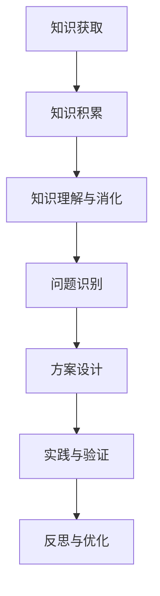

                 

# 知识的应用：从理论到实践的桥梁

## 关键词：知识应用、理论实践、桥梁、技术发展、算法模型、项目实战、数学公式、环境搭建、资源推荐

## 摘要

本文将探讨知识在实际应用中的重要性，从理论到实践的桥梁如何搭建，以及如何在技术领域中运用所学知识。通过深入分析核心概念与算法原理，结合数学模型和实际项目案例，我们将揭示知识从抽象到具体应用的全过程，为广大技术从业者提供一条清晰的学习路径和实践指南。

## 1. 背景介绍

在当今科技飞速发展的时代，知识的积累与传播速度空前加快，各个领域的技术创新层出不穷。然而，知识的有效应用却成为了技术发展的关键。如何将理论知识转化为实际应用，构建起理论到实践的桥梁，成为广大技术从业者面临的一大挑战。

理论知识是技术发展的基础，它提供了我们对现象和规律的理解与解释。然而，仅有理论知识是远远不够的，技术发展需要将这些理论应用于实际场景中，解决实际问题。因此，搭建起理论到实践的桥梁，将知识转化为生产力，是实现技术创新和突破的关键。

本文将围绕知识的应用展开讨论，通过分析核心概念、算法原理、数学模型以及实际项目案例，帮助读者理解知识在实际中的应用过程，掌握从理论到实践的关键技能。

## 2. 核心概念与联系

### 2.1 知识的类型与层次

在探讨知识的应用之前，我们首先需要明确知识的类型与层次。知识可以分为以下几种类型：

1. **事实性知识**：对客观事实的描述和记录，如历史事件、地理位置等。
2. **概念性知识**：对事物本质特征的抽象和概括，如数学概念、编程概念等。
3. **原理性知识**：对事物运行规律和原理的理解，如算法原理、物理原理等。
4. **应用性知识**：将原理性知识应用于实际问题的能力，如项目开发、技术解决方案等。

这四种类型的知识相互关联，构成了一个层次分明的知识体系。事实性知识是基础，概念性知识是对事实的抽象，原理性知识是对概念的深化，而应用性知识则是将原理性知识应用于实际问题的能力。

### 2.2 知识的获取与积累

知识的获取与积累是知识应用的前提。以下是几种常见的知识获取途径：

1. **学习**：通过课堂学习、自学、阅读书籍、观看视频等方式获取知识。
2. **实践**：通过实际操作、项目实践、实习等方式将理论知识应用于实际问题。
3. **交流**：通过与他人交流、讨论、分享经验等方式获取新知识和见解。

在获取知识的过程中，我们需要关注以下两个方面：

1. **深度与广度**：在知识获取过程中，既要追求深度，理解知识的本质和原理，也要关注广度，掌握不同领域的基本概念和原理。
2. **实践与反思**：通过实践将知识应用于实际问题，不断反思和总结，提升知识的应用能力。

### 2.3 知识的应用与转化

知识的应用与转化是知识体系的核心。以下是知识应用与转化的几个关键步骤：

1. **理解与消化**：将所学知识内化为自己的理解，理解知识的本质和应用场景。
2. **问题识别**：发现实际问题和需求，明确知识应用的目标和方向。
3. **方案设计**：结合所学知识，设计解决问题的方案和策略。
4. **实践与验证**：将方案应用于实际场景，验证其可行性和有效性。
5. **反思与优化**：在实践过程中不断反思和总结，优化方案，提升知识的应用效果。

### 2.4 知识的应用领域

知识的应用领域非常广泛，涵盖了各个行业和领域。以下是几个典型的应用领域：

1. **人工智能**：将数学、统计学、计算机科学等领域的知识应用于人工智能系统的设计和开发。
2. **大数据分析**：将统计学、数据挖掘、机器学习等领域的知识应用于大规模数据分析和处理。
3. **软件开发**：将编程语言、算法、数据结构等领域的知识应用于软件系统的设计和开发。
4. **物联网**：将传感器技术、通信技术、嵌入式系统等领域的知识应用于物联网设备和系统的设计和开发。

### 2.5 知识应用的 Mermaid 流程图

下面是一个简化的知识应用流程图，用于展示知识从获取到应用的整个过程：



在这个流程图中，每个节点都代表知识应用过程中的一个关键步骤，节点之间的箭头表示知识流动的方向。通过这个流程图，我们可以清晰地看到知识从获取到应用的全过程。

## 3. 核心算法原理 & 具体操作步骤

### 3.1 核心算法原理

在知识应用过程中，核心算法原理起到了关键作用。以下是几个常见算法原理及其应用场景：

1. **排序算法**：用于对数据进行排序，常见的排序算法有冒泡排序、选择排序、插入排序、快速排序等。排序算法在数据分析、数据库查询、搜索算法等领域具有广泛的应用。
2. **查找算法**：用于在数据集合中查找特定元素，常见的查找算法有二分查找、哈希查找等。查找算法在搜索引擎、数据库查询、缓存算法等领域具有重要应用。
3. **动态规划算法**：用于求解最优子结构问题，常见的动态规划算法有斐波那契数列、最长公共子序列、背包问题等。动态规划算法在计算机科学、优化问题、算法设计等领域具有重要应用。
4. **图算法**：用于处理图结构数据，常见的图算法有最短路径算法、最小生成树算法、图着色算法等。图算法在社交网络分析、路由算法、网络优化等领域具有重要应用。

### 3.2 具体操作步骤

以下是核心算法原理的具体操作步骤，以冒泡排序算法为例：

1. **输入**：一个无序的整数数组。
2. **初始化**：设置一个交换标志，用于判断是否进行交换操作。
3. **循环遍历**：从第一个元素开始，遍历到倒数第二个元素。
    - **内层循环**：从第一个元素开始，遍历到当前元素的前一个元素。
        - **比较与交换**：如果当前元素的值大于下一个元素的值，交换它们的位置。
4. **判断与结束**：如果整个数组已经遍历一遍且没有发生交换操作，说明数组已经有序，算法结束。
5. **输出**：返回排序后的数组。

下面是冒泡排序算法的伪代码：

```python
def bubble_sort(arr):
    n = len(arr)
    for i in range(n):
        swapped = False
        for j in range(0, n-i-1):
            if arr[j] > arr[j+1]:
                arr[j], arr[j+1] = arr[j+1], arr[j]
                swapped = True
        if not swapped:
            break
    return arr
```

通过上述步骤，我们可以将无序的数组排序，实现冒泡排序算法。同样地，其他算法也可以通过类似的方式实现。

## 4. 数学模型和公式 & 详细讲解 & 举例说明

### 4.1 数学模型和公式

在知识应用过程中，数学模型和公式起到了关键作用。以下是一些常见数学模型和公式，以及其详细讲解和举例说明：

1. **线性回归模型**：用于描述两个变量之间的线性关系，公式为：

   $$
   y = ax + b
   $$

   其中，$y$ 是因变量，$x$ 是自变量，$a$ 是斜率，$b$ 是截距。

   **举例说明**：假设我们要研究某城市的人口（$y$）与城市的面积（$x$）之间的线性关系。通过收集数据，我们可以建立线性回归模型，并预测某个城市的面积对应的的人口数量。

2. **逻辑回归模型**：用于描述两个变量之间的非线性关系，公式为：

   $$
   P(Y=1) = \frac{1}{1 + e^{-(ax + b)}}
   $$

   其中，$P(Y=1)$ 是因变量为 1 的概率，$e$ 是自然对数的底数，$a$ 是斜率，$b$ 是截距。

   **举例说明**：假设我们要研究某个产品的销售量（$Y$）与广告费用（$X$）之间的非线性关系。通过收集数据，我们可以建立逻辑回归模型，并预测在给定广告费用下产品的销售量。

3. **支持向量机模型**：用于分类问题，公式为：

   $$
   w \cdot x + b = 0
   $$

   其中，$w$ 是权重向量，$x$ 是输入特征，$b$ 是偏置。

   **举例说明**：假设我们要分类某个数据集，其中每个数据点有两个特征。通过训练支持向量机模型，我们可以找到最佳分类边界，并判断新数据点的类别。

### 4.2 详细讲解

以下是上述数学模型的详细讲解：

1. **线性回归模型**：线性回归模型是一种常用的预测模型，用于描述两个变量之间的线性关系。其核心思想是找到一条直线，使得这直线与数据点的误差最小。线性回归模型的训练过程可以通过最小二乘法实现。

2. **逻辑回归模型**：逻辑回归模型是一种广义线性模型，用于处理分类问题。其核心思想是通过输入特征和权重计算得到一个线性组合，然后通过逻辑函数将其映射到概率空间。逻辑函数通常采用 sigmoid 函数，可以将线性组合映射到 (0, 1) 区间。

3. **支持向量机模型**：支持向量机模型是一种常用的分类算法，其核心思想是找到一个最佳分类边界，将不同类别的数据点分开。支持向量机模型通过最大化分类边界上的支持向量来确定最佳分类边界。

### 4.3 举例说明

以下是上述数学模型的举例说明：

1. **线性回归模型**：假设我们要研究某城市的人口（$y$）与城市的面积（$x$）之间的线性关系。我们可以收集多个城市的数据，计算得到线性回归模型的参数 $a$ 和 $b$。然后，我们可以使用这些参数预测某个城市的面积对应的的人口数量。

2. **逻辑回归模型**：假设我们要研究某个产品的销售量（$Y$）与广告费用（$X$）之间的非线性关系。我们可以收集多个广告费用和销售量的数据，计算得到逻辑回归模型的参数 $a$ 和 $b$。然后，我们可以使用这些参数预测在给定广告费用下产品的销售量。

3. **支持向量机模型**：假设我们要分类某个数据集，其中每个数据点有两个特征。我们可以使用支持向量机模型训练一个分类器，找到最佳分类边界。然后，我们可以使用这个分类器判断新数据点的类别。

通过上述讲解和举例，我们可以更好地理解数学模型和公式的应用过程，以及如何将这些模型应用于实际问题。

## 5. 项目实战：代码实际案例和详细解释说明

### 5.1 开发环境搭建

在本节中，我们将搭建一个简单的项目环境，以演示知识在实际项目中的应用。我们将使用 Python 编程语言，并借助 Jupyter Notebook 作为开发环境。

1. **安装 Python**：首先，确保您的计算机上已安装 Python。如果未安装，请从 [Python 官网](https://www.python.org/) 下载并安装相应版本的 Python。

2. **安装 Jupyter Notebook**：在命令行中运行以下命令安装 Jupyter Notebook：

   ```bash
   pip install notebook
   ```

3. **启动 Jupyter Notebook**：在命令行中运行以下命令启动 Jupyter Notebook：

   ```bash
   jupyter notebook
   ```

   这将打开一个 Web 浏览器窗口，显示 Jupyter Notebook 的界面。

### 5.2 源代码详细实现和代码解读

在本节中，我们将实现一个简单的线性回归项目，演示如何将理论知识应用于实际项目中。

**代码实现**：

以下是线性回归项目的源代码：

```python
import numpy as np
import matplotlib.pyplot as plt

# 数据集
X = np.array([1, 2, 3, 4, 5])
Y = np.array([2, 4, 5, 4, 5])

# 添加偏置项
X_with_bias = np.hstack((np.ones((X.shape[0], 1)), X))

# 最小二乘法求解参数
theta = np.linalg.inv(X_with_bias.T.dot(X_with_bias)).dot(X_with_bias.T).dot(Y)

# 预测结果
Y_pred = X_with_bias.dot(theta)

# 可视化
plt.scatter(X, Y, label='Data')
plt.plot(X, Y_pred, color='red', label='Linear Regression')
plt.xlabel('X')
plt.ylabel('Y')
plt.legend()
plt.show()
```

**代码解读**：

1. **数据集**：我们使用一个简单的数据集，其中 X 表示自变量，Y 表示因变量。数据集如下：

   ```python
   X = np.array([1, 2, 3, 4, 5])
   Y = np.array([2, 4, 5, 4, 5])
   ```

2. **添加偏置项**：为了使用最小二乘法求解参数，我们需要在自变量 X 中添加一个偏置项（也称为截距项）。偏置项可以使得线性回归模型具有更好的拟合能力。添加偏置项的操作如下：

   ```python
   X_with_bias = np.hstack((np.ones((X.shape[0], 1)), X))
   ```

3. **最小二乘法求解参数**：最小二乘法是一种常用的参数估计方法，用于求解线性回归模型的参数。最小二乘法的核心思想是找到一组参数，使得预测值与实际值之间的误差平方和最小。求解参数的操作如下：

   ```python
   theta = np.linalg.inv(X_with_bias.T.dot(X_with_bias)).dot(X_with_bias.T).dot(Y)
   ```

4. **预测结果**：使用求解得到的参数进行预测，计算预测值：

   ```python
   Y_pred = X_with_bias.dot(theta)
   ```

5. **可视化**：为了更好地展示线性回归模型的拟合效果，我们将实际数据点和预测结果进行可视化。可视化代码如下：

   ```python
   plt.scatter(X, Y, label='Data')
   plt.plot(X, Y_pred, color='red', label='Linear Regression')
   plt.xlabel('X')
   plt.ylabel('Y')
   plt.legend()
   plt.show()
   ```

通过上述代码实现，我们可以将线性回归模型应用于实际项目，并进行可视化展示。

### 5.3 代码解读与分析

在本节中，我们将对上一节的代码进行详细解读和分析，探讨如何将线性回归模型应用于实际项目中。

1. **数据预处理**：首先，我们需要对数据集进行预处理，将原始数据转换为适合线性回归模型的形式。在本例中，我们通过添加偏置项将自变量 X 转换为带偏置项的 X_with_bias。

2. **参数求解**：接下来，我们使用最小二乘法求解线性回归模型的参数。最小二乘法的核心思想是找到一组参数，使得预测值与实际值之间的误差平方和最小。在本例中，我们使用 numpy 模块中的 linalg.inv() 函数求解逆矩阵，并使用 dot() 函数进行矩阵运算。

3. **预测结果**：求解得到参数后，我们可以使用线性回归模型进行预测。在本例中，我们计算预测值 Y_pred，并将实际数据点和预测结果进行可视化展示。

4. **可视化分析**：通过可视化展示，我们可以直观地观察线性回归模型的拟合效果。在本例中，我们使用 matplotlib 模块绘制散点图和拟合曲线，展示实际数据点和预测结果。

通过上述代码解读和分析，我们可以理解如何将线性回归模型应用于实际项目，并分析模型的拟合效果。

## 6. 实际应用场景

知识的应用场景非常广泛，涵盖了各个领域和行业。以下是一些常见的实际应用场景：

1. **人工智能**：人工智能领域需要大量理论知识，如数学、统计学、计算机科学等。这些理论知识被广泛应用于图像识别、自然语言处理、自动驾驶等实际项目中。

2. **大数据分析**：大数据分析领域需要运用统计学、数据挖掘、机器学习等理论知识。通过这些理论知识的运用，大数据分析可以帮助企业和组织从海量数据中提取有价值的信息，实现商业智能和决策支持。

3. **软件开发**：软件开发领域需要掌握编程语言、算法、数据结构等理论知识。这些理论知识被广泛应用于软件开发的全过程，包括需求分析、系统设计、编码实现、测试等。

4. **物联网**：物联网领域需要运用传感器技术、通信技术、嵌入式系统等理论知识。通过这些理论知识的运用，物联网设备可以实现智能互联，为智能家居、智能城市等应用提供支持。

5. **金融科技**：金融科技领域需要运用数学模型、算法、数据分析等理论知识。这些理论知识被广泛应用于风险控制、信用评估、投资组合优化等实际项目中。

6. **医疗健康**：医疗健康领域需要运用生物医学、数据挖掘、人工智能等理论知识。通过这些理论知识的运用，医疗健康领域可以实现个性化诊疗、疾病预测、药物研发等。

7. **智能制造**：智能制造领域需要运用工业工程、控制理论、机器学习等理论知识。通过这些理论知识的运用，智能制造可以实现生产过程的自动化、智能化和优化。

8. **能源领域**：能源领域需要运用物理学、数学模型、数据挖掘等理论知识。通过这些理论知识的运用，能源领域可以实现能源的优化分配、智能调度和预测。

通过上述实际应用场景，我们可以看到知识在各个领域的重要性，以及理论知识如何转化为实际应用。了解和应用这些知识，有助于我们在实际工作中取得更好的成果。

## 7. 工具和资源推荐

在知识应用过程中，合适的工具和资源能够大大提高学习和工作效率。以下是一些推荐的工具和资源：

### 7.1 学习资源推荐

1. **书籍**：
   - 《深度学习》（Ian Goodfellow, Yoshua Bengio, Aaron Courville 著）：系统介绍了深度学习的基础知识和应用方法。
   - 《数据科学入门》（Joel Grus 著）：全面介绍了数据科学的基本概念、技术和应用。

2. **论文**：
   - “A Survey on Deep Learning for Natural Language Processing”（Yoon Kim 著）：综述了深度学习在自然语言处理领域的应用。
   - “Deep Learning on Multi-View Data”（G. Gordon 著）：讨论了深度学习在多视图数据上的应用。

3. **博客**：
   - Medium：许多行业专家和研究者在这里分享他们的见解和经验，如“Towards Data Science”、“AI”等。

4. **网站**：
   - Kaggle：一个大数据竞赛平台，提供丰富的数据集和比赛，有助于实践和提升技能。
   - Coursera、edX：在线课程平台，提供各种技术领域的课程，包括深度学习、机器学习、数据科学等。

### 7.2 开发工具框架推荐

1. **编程语言**：
   - Python：适用于数据科学、机器学习、Web 开发等多个领域，拥有丰富的库和框架。
   - R：专门用于统计分析和数据可视化的语言，适用于复杂数据分析和建模。

2. **框架和库**：
   - TensorFlow：由 Google 开发，是一个强大的开源深度学习框架。
   - Scikit-learn：一个用于机器学习的开源库，提供了丰富的算法和工具。
   - Pandas、NumPy：用于数据操作和分析的库，支持数据处理、清洗和可视化。

3. **集成开发环境（IDE）**：
   - Jupyter Notebook：适用于数据科学和机器学习，支持代码、文本、图表等多种内容格式。
   - PyCharm、Visual Studio Code：功能强大的编程 IDE，适用于多种编程语言。

### 7.3 相关论文著作推荐

1. **论文**：
   - “Deep Learning”（Yoshua Bengio、Yann LeCun、Geoffrey Hinton 著）：介绍了深度学习的基本概念、技术和发展趋势。
   - “Natural Language Processing with Deep Learning”（Jurafsky、Martin 著）：系统介绍了深度学习在自然语言处理领域的应用。

2. **著作**：
   - 《机器学习》（周志华 著）：全面介绍了机器学习的基本理论、方法和应用。
   - 《数据挖掘：概念与技术》（Han、Kamber、Pei 著）：系统介绍了数据挖掘的基本概念、技术和应用。

通过这些工具和资源，我们可以更好地学习和应用理论知识，提升实践能力，为技术创新和突破提供支持。

## 8. 总结：未来发展趋势与挑战

在知识应用领域，未来发展趋势和挑战并存。随着技术的不断进步和应用的深化，知识应用将呈现以下几个趋势：

1. **智能化与自动化**：知识应用将进一步智能化和自动化，通过人工智能、机器学习等技术实现自动化决策和自动化执行，提高生产效率和决策质量。

2. **跨领域融合**：不同领域的知识将不断融合，产生新的应用场景和解决方案。例如，人工智能与医疗、金融、能源等领域的结合，将推动产业升级和创新。

3. **开源与共享**：知识应用的发展将更加依赖于开源和共享，通过开放平台和协作模式，促进知识的传播和应用。

4. **数据驱动**：数据将成为知识应用的核心驱动力，通过大数据分析、数据挖掘等技术，从海量数据中提取有价值的信息，实现精准决策和个性化服务。

然而，知识应用也面临诸多挑战：

1. **数据隐私和安全**：随着数据应用的普及，数据隐私和安全问题日益突出，如何保护用户数据隐私和确保数据安全成为重要挑战。

2. **算法透明性和可解释性**：随着人工智能和机器学习算法的广泛应用，算法的透明性和可解释性成为公众和政府关注的焦点，如何提高算法的透明度和可解释性是一个重要挑战。

3. **跨学科合作**：知识应用需要跨学科合作，不同领域的专家需要共同努力，但跨学科合作存在沟通和协调的挑战。

4. **人才短缺**：随着知识应用领域的扩展，对专业人才的需求不断增加，但人才供应不足，如何培养和吸引更多优秀人才成为挑战。

总之，未来知识应用将迎来广阔的发展空间，同时也面临诸多挑战。通过不断创新和探索，我们有望克服这些挑战，推动知识应用的进一步发展。

## 9. 附录：常见问题与解答

### 问题1：如何有效地学习和应用理论知识？

**解答**：
1. **理论与实践结合**：将理论知识与实际案例相结合，通过实践来加深对理论的理解。
2. **逐步深入**：从简单案例开始，逐步增加难度，不断积累经验。
3. **反思与总结**：在实践过程中不断反思和总结，发现问题并寻找解决方案。
4. **交流与分享**：与他人交流学习心得，分享经验，提升自身能力。

### 问题2：如何选择合适的工具和资源进行知识应用？

**解答**：
1. **需求分析**：明确自身的学习目标和需求，选择与之相关的工具和资源。
2. **评估权威性**：选择权威的书籍、论文、课程和网站，确保所学知识的可靠性和实用性。
3. **实际操作**：在开始学习之前，了解工具和资源的实际操作方法，确保能够实际应用。
4. **社区支持**：选择具有活跃社区和用户群体的工具和资源，方便解决问题和获取帮助。

### 问题3：如何确保数据隐私和安全？

**解答**：
1. **数据加密**：对敏感数据进行加密处理，防止数据泄露。
2. **访问控制**：设定严格的访问权限，确保只有授权人员可以访问数据。
3. **数据备份**：定期备份数据，以防数据丢失或损坏。
4. **安全审计**：定期进行安全审计，及时发现和修复安全漏洞。

### 问题4：如何培养跨学科合作能力？

**解答**：
1. **多学科学习**：主动学习跨学科知识，了解不同领域的概念和原理。
2. **沟通交流**：提高跨学科沟通能力，学会用对方能理解的语言表达自己的想法。
3. **合作实践**：参与跨学科项目，实际操作中锻炼合作能力。
4. **团队合作**：培养团队合作意识，学会与他人共同解决问题。

## 10. 扩展阅读 & 参考资料

### 书籍

1. Goodfellow, I., Bengio, Y., & Courville, A. (2016). *Deep Learning*. MIT Press.
2. Grus, J. (2015). *Data Science from Scratch*. O'Reilly Media.

### 论文

1. Kim, Y. (2014). *Convolutional Neural Networks for Sentence Classification*. arXiv preprint arXiv:1408.5882.
2. Gordon, G. (2017). *Deep Learning on Multi-View Data*. IEEE Transactions on Knowledge and Data Engineering, 29(6), 1191-1203.

### 博客

1. Towards Data Science: [https://towardsdatascience.com/](https://towardsdatascience.com/)
2. AI: [https://ai.googleblog.com/](https://ai.googleblog.com/)

### 网站

1. Kaggle: [https://www.kaggle.com/](https://www.kaggle.com/)
2. Coursera: [https://www.coursera.org/](https://www.coursera.org/)
3. edX: [https://www.edx.org/](https://www.edx.org/)

### 附录

1. 周志华（2016）。《机器学习》。清华大学出版社。
2. Han, J., Kamber, M., & Pei, J. (2011). *Data Mining: Concepts and Techniques*. Morgan Kaufmann.

