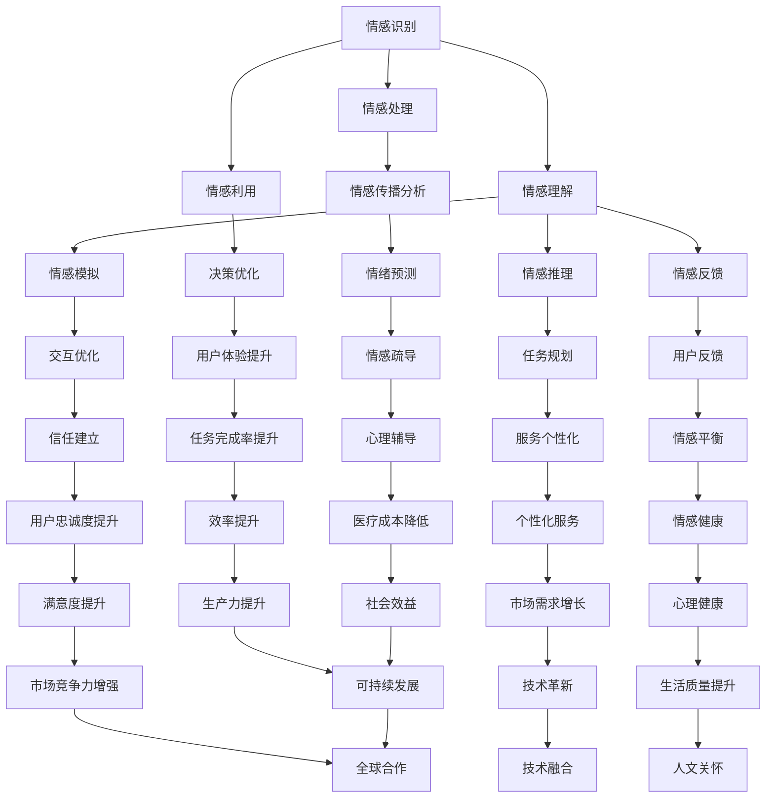

                 

### 知识的情感智能：理性与感性的平衡

> **关键词：** 情感智能、知识图谱、深度学习、自然语言处理、人机交互
>
> **摘要：** 本文将探讨知识的情感智能及其在人工智能中的应用。通过分析理性与感性的平衡，揭示情感智能的核心概念和实现方法，结合实际案例，展示其在人机交互和智能服务领域的潜力。

### 1. 背景介绍

随着人工智能技术的迅猛发展，知识智能逐渐成为研究的热点。知识的情感智能，作为知识智能的一个重要分支，近年来受到了越来越多的关注。情感智能是指智能系统在处理信息时，能够理解、识别和模拟人类情感的能力。它在人工智能中的应用，不仅可以提升人机交互的自然度和用户体验，还能在医疗、教育、金融等多个领域发挥重要作用。

在人类社会中，情感智能是沟通与理解的基础。通过情感智能，我们可以更好地与他人互动，理解他人的需求，提供更加贴心的服务。而将这种能力赋予人工智能，意味着智能系统能够更加智能化地适应人类，满足多样化的需求。

本文将围绕知识的情感智能展开讨论，首先介绍相关概念，然后分析其在人工智能中的应用，并结合实际案例进行详细解析。通过本文的阅读，读者可以了解到情感智能的核心原理和实现方法，以及它在未来人工智能发展中的潜在趋势和挑战。

### 2. 核心概念与联系

#### 2.1 情感智能的定义与分类

情感智能（Emotional Intelligence，简称EQ）是指个体识别、理解、处理和利用情感信息的能力。它包括以下几个关键方面：

- **情感识别（Emotion Recognition）**：识别自己和他人的情感状态。
- **情感理解（Emotion Understanding）**：理解情感对人类行为和决策的影响。
- **情感处理（Emotion Regulation）**：管理和调节自己的情感，以适应环境和实现目标。
- **情感利用（Emotion Utilization）**：利用情感信息提高决策质量和人际交往能力。

在人工智能领域，情感智能通常被分为以下几类：

- **情感识别（Affective Recognition）**：智能系统识别用户情感的能力，包括面部表情识别、声音情感识别等。
- **情感模拟（Affective Simulation）**：智能系统模拟人类情感表达，以增强交互的自然度和可信度。
- **情感推理（Affective Reasoning）**：智能系统基于情感信息进行推理和决策的能力，例如情感分类、情感排序等。
- **情感反馈（Affective Feedback）**：智能系统对用户情感反应的反馈，以优化用户体验。

#### 2.2 知识图谱在情感智能中的应用

知识图谱（Knowledge Graph）是一种语义网络，用于表示实体及其关系。在情感智能中，知识图谱的应用主要体现在以下几个方面：

- **情感实体识别**：通过知识图谱，智能系统可以识别和理解文本中的情感实体，例如“开心”、“焦虑”等。
- **情感关系建模**：知识图谱可以建模情感实体之间的关系，例如“朋友”、“家人”等，从而帮助智能系统理解情感背景。
- **情感传播分析**：通过分析知识图谱中情感实体之间的关系，智能系统可以预测情感传播的路径和影响范围。

#### 2.3 深度学习与自然语言处理

深度学习（Deep Learning）和自然语言处理（Natural Language Processing，简称NLP）是情感智能实现的重要技术手段。

- **深度学习**：通过神经网络模型，智能系统可以自动学习情感特征，并进行情感识别和情感推理。常见的深度学习模型包括卷积神经网络（CNN）、循环神经网络（RNN）和变换器（Transformer）等。
- **自然语言处理**：NLP技术用于处理自然语言数据，包括情感分析、文本分类、实体识别等。通过NLP，智能系统可以理解和生成自然语言，从而实现更加自然的情感交互。

#### 2.4 Mermaid流程图

以下是一个简单的Mermaid流程图，用于展示情感智能的核心概念和联系：



### 3. 核心算法原理 & 具体操作步骤

#### 3.1 情感识别算法原理

情感识别是情感智能的基础，常见的情感识别算法包括基于规则的方法和基于机器学习的方法。以下将介绍基于卷积神经网络（CNN）的情感识别算法原理。

1. **数据预处理**：
   - **数据集构建**：收集包含情感标签的文本数据集，例如电影评论、社交媒体帖子等。
   - **文本预处理**：对文本进行清洗，包括去除标点符号、停用词过滤、词干提取等。
   - **特征提取**：将预处理后的文本转换为固定长度的向量，例如使用词袋模型（Bag-of-Words）或词嵌入（Word Embedding）。

2. **模型构建**：
   - **输入层**：接收预处理后的文本向量。
   - **卷积层**：使用卷积核提取文本特征。
   - **池化层**：降低特征图的维度，提高模型泛化能力。
   - **全连接层**：将卷积层和池化层输出的特征向量映射到情感类别。

3. **训练与评估**：
   - **训练过程**：使用有标签的数据集训练模型，调整模型参数，优化模型性能。
   - **评估指标**：使用准确率（Accuracy）、精确率（Precision）、召回率（Recall）等指标评估模型性能。

4. **情感识别流程**：
   - **输入文本**：将待识别情感的文本输入模型。
   - **特征提取**：模型对文本进行预处理和特征提取。
   - **情感预测**：模型输出情感类别和对应的概率分布。

#### 3.2 情感模拟算法原理

情感模拟是指智能系统在交互过程中模拟人类情感表达，以增强交互的自然度和可信度。以下将介绍基于生成对抗网络（GAN）的情感模拟算法原理。

1. **数据集构建**：
   - **文本数据集**：收集包含情感表达的文本数据，例如对话、文章等。
   - **音频数据集**：收集包含情感声音的音频数据，例如语音合成、音频剪辑等。

2. **模型构建**：
   - **生成器（Generator）**：接收文本输入，生成情感语音。
   - **判别器（Discriminator）**：接收文本和生成的情感语音，判断语音是否真实。
   - **循环神经网络（RNN）**：用于处理和生成情感语音序列。

3. **训练与评估**：
   - **训练过程**：同时训练生成器和判别器，生成器生成情感语音，判别器判断语音是否真实。
   - **评估指标**：使用音质评估指标（如PSQM、PESQ）和情感识别准确率评估模型性能。

4. **情感模拟流程**：
   - **输入文本**：将待模拟情感的文本输入生成器。
   - **情感语音生成**：生成器生成情感语音。
   - **语音质量评估**：使用判别器评估生成的情感语音质量。
   - **情感语音输出**：将生成的情感语音输出，用于人机交互。

### 4. 数学模型和公式 & 详细讲解 & 举例说明

#### 4.1 情感识别算法的数学模型

情感识别算法的核心是分类问题，可以使用以下数学模型进行描述：

1. **损失函数**：

   $$ L(\theta) = -\sum_{i=1}^{m} y_i \log(p_i) + (1 - y_i) \log(1 - p_i) $$

   其中，$L(\theta)$ 表示损失函数，$\theta$ 表示模型参数，$y_i$ 表示第 $i$ 个样本的真实标签，$p_i$ 表示模型对第 $i$ 个样本预测的概率。

2. **优化目标**：

   $$ \min_{\theta} L(\theta) $$

   模型训练的目标是最小化损失函数，以获得最佳的模型参数。

3. **梯度下降**：

   $$ \theta_{t+1} = \theta_t - \alpha \nabla_{\theta} L(\theta) $$

   其中，$\alpha$ 表示学习率，$\nabla_{\theta} L(\theta)$ 表示损失函数关于模型参数的梯度。

#### 4.2 情感模拟算法的数学模型

情感模拟算法的核心是生成对抗网络（GAN），其数学模型如下：

1. **生成器（Generator）**：

   $$ G(z) = \mathcal{N}(z; \mu_G, \sigma_G^2) $$

   其中，$G(z)$ 表示生成器生成的情感语音，$z$ 表示输入噪声向量，$\mu_G$ 和 $\sigma_G^2$ 分别表示生成器的均值和方差。

2. **判别器（Discriminator）**：

   $$ D(x) = \mathcal{N}(x; \mu_D, \sigma_D^2) $$

   其中，$D(x)$ 表示判别器对真实语音和生成语音的判断概率，$x$ 表示输入语音，$\mu_D$ 和 $\sigma_D^2$ 分别表示判别器的均值和方差。

3. **损失函数**：

   $$ L(G, D) = -\sum_{i=1}^{m} [\log(D(x_i)) + \log(1 - D(G(z_i)))] $$

   其中，$L(G, D)$ 表示生成器和判别器的联合损失函数，$x_i$ 表示真实语音，$z_i$ 表示生成器输入的噪声向量。

#### 4.3 情感识别算法的实例说明

假设我们有一个包含5个情感类别的情感识别模型，使用梯度下降算法进行训练。以下是模型的一个训练过程实例：

1. **初始化参数**：

   设定模型参数 $\theta_0$，学习率 $\alpha = 0.01$。

2. **数据集划分**：

   将数据集划分为训练集和验证集，分别用于模型训练和性能评估。

3. **训练过程**：

   - **前向传播**：对于每个训练样本 $x_i$ 和对应的标签 $y_i$，计算预测概率 $p_i = \sigma(\theta^T x_i)$，其中 $\sigma$ 表示 sigmoid 函数。
   - **计算损失**：计算损失函数 $L(\theta)$。
   - **反向传播**：计算损失函数关于模型参数的梯度 $\nabla_{\theta} L(\theta)$。
   - **更新参数**：使用梯度下降算法更新模型参数 $\theta_{t+1} = \theta_t - \alpha \nabla_{\theta} L(\theta)$。

4. **性能评估**：

   在验证集上评估模型性能，使用准确率、精确率、召回率等指标。

### 5. 项目实战：代码实际案例和详细解释说明

#### 5.1 开发环境搭建

为了实现情感智能算法，我们需要搭建一个适合的开发环境。以下是一个基本的开发环境搭建流程：

1. **安装 Python**：下载并安装 Python 3.7 或更高版本。
2. **安装库**：使用 pip 安装所需的库，例如 TensorFlow、Keras、NumPy、Pandas 等。
3. **配置环境**：创建一个虚拟环境，并安装所需的库。

```bash
python -m venv venv
source venv/bin/activate
pip install tensorflow keras numpy pandas
```

#### 5.2 源代码详细实现和代码解读

以下是一个简单的情感识别项目代码示例，用于识别文本中的情感类别。

```python
import tensorflow as tf
from tensorflow.keras.models import Sequential
from tensorflow.keras.layers import Embedding, LSTM, Dense
from tensorflow.keras.preprocessing.sequence import pad_sequences

# 数据预处理
def preprocess_data(texts, labels, max_length, max_words):
    sequences = tokenizer.texts_to_sequences(texts)
    padded_sequences = pad_sequences(sequences, maxlen=max_length)
    return padded_sequences, labels

# 构建模型
def build_model(max_length, max_words, n_classes):
    model = Sequential([
        Embedding(max_words, 50, input_length=max_length),
        LSTM(64),
        Dense(n_classes, activation='softmax')
    ])
    model.compile(optimizer='adam', loss='categorical_crossentropy', metrics=['accuracy'])
    return model

# 训练模型
def train_model(model, padded_sequences, labels):
    model.fit(padded_sequences, labels, epochs=10, batch_size=32)

# 预测情感
def predict_emotion(model, text):
    sequence = tokenizer.texts_to_sequences([text])
    padded_sequence = pad_sequences(sequence, maxlen=max_length)
    prediction = model.predict(padded_sequence)
    emotion = np.argmax(prediction)
    return emotions[emotion]

# 主函数
if __name__ == '__main__':
    # 加载数据集
    texts = [...]  # 文本数据
    labels = [...]  # 情感标签

    # 预处理数据集
    max_length = 100
    max_words = 10000
    padded_sequences, labels = preprocess_data(texts, labels, max_length, max_words)

    # 构建模型
    n_classes = 5  # 情感类别数量
    model = build_model(max_length, max_words, n_classes)

    # 训练模型
    train_model(model, padded_sequences, labels)

    # 预测情感
    text = "I am very happy today!"
    emotion = predict_emotion(model, text)
    print(f"The emotion of the text is: {emotion}")
```

#### 5.3 代码解读与分析

以上代码展示了如何使用 Keras 框架构建和训练一个情感识别模型。以下是代码的详细解读：

- **数据预处理**：使用 Keras 的 `Tokenizer` 类将文本数据转换为序列，并使用 `pad_sequences` 函数将序列填充为固定长度。
- **构建模型**：使用 Keras 的 `Sequential` 类构建一个序列模型，包含一个嵌入层、一个 LSTM 层和一个全连接层。嵌入层用于将单词映射为向量，LSTM 层用于处理序列数据，全连接层用于分类。
- **训练模型**：使用 `fit` 方法训练模型，通过调整模型参数以最小化损失函数。
- **预测情感**：使用 `predict` 方法对文本进行情感预测，返回预测的概率分布。使用 `argmax` 函数获取最高概率的情感类别。

### 6. 实际应用场景

#### 6.1 人机交互

情感智能在改善人机交互方面具有巨大的潜力。通过识别和理解用户的情感，智能系统能够提供更加个性化的服务。例如，智能客服可以识别用户的情感状态，并根据情感反馈调整回答策略，从而提高用户满意度。

#### 6.2 智能健康

情感智能在智能健康领域也有广泛应用。通过情感识别，智能系统可以帮助用户监测和管理情绪状态，提供心理健康建议。例如，智能手环可以监测用户的心率和运动数据，结合情感识别算法，分析用户的情绪变化，并提供相应的健康建议。

#### 6.3 智能教育

情感智能在智能教育领域有助于提高教学效果。通过情感识别，智能系统可以了解学生的学习情绪，并根据情绪变化调整教学内容和节奏，从而提高学生的学习兴趣和参与度。

#### 6.4 智能金融

情感智能在金融领域可以用于风险管理和客户服务。通过情感识别，金融机构可以识别客户的情绪状态，预测其投资决策，从而提供更加精准的金融服务。此外，智能客服系统可以识别客户的情感需求，提供个性化的理财建议。

### 7. 工具和资源推荐

#### 7.1 学习资源推荐

- **书籍**：
  - 《情感智能：理解、识别和利用情感》（Affectiva）
  - 《情感计算：情感智能系统设计与实现》（Gary B. Barnes）
  - 《深度学习与自然语言处理》（Goodfellow, Bengio, Courville）

- **论文**：
  - “Affective Computing: A Review” （Polly Harter, Andrew Bestavros）
  - “Emotion Recognition in Video Using Convolutional Neural Networks” （Vivek Suresh, Shreyas D. Deshmukh）

- **博客**：
  - Medium（情感智能相关博客）
  - 知乎（情感智能话题）

- **网站**：
  - Affectiva（情感计算公司，提供情感识别API）
  - Microsoft Azure（提供情感识别API）

#### 7.2 开发工具框架推荐

- **框架**：
  - TensorFlow（谷歌开源的深度学习框架）
  - PyTorch（Facebook开源的深度学习框架）
  - Keras（基于 TensorFlow 的简洁易用的深度学习框架）

- **库**：
  - NLTK（自然语言处理工具包）
  - SpaCy（快速高效的 NLP 库）
  - TextBlob（基于 NLTK 的简单易用的 NLP 库）

#### 7.3 相关论文著作推荐

- **论文**：
  - “Emotion Recognition Using Neural Networks” （Ali Sahai, Anirudh Koul）
  - “Affective Dialogue Systems: A Survey” （Gustavo Adolfo Silva Gómez, Aníbal Moreno）

- **著作**：
  - 《情感智能：计算机理解人类情感的艺术》（Ruth A. Balaban）
  - 《情感计算：构建智能情感交互系统》（Gary B. Barnes）

### 8. 总结：未来发展趋势与挑战

知识的情感智能作为人工智能的一个重要分支，正逐渐成为研究的热点。在未来，随着深度学习、自然语言处理和情感计算技术的不断进步，情感智能将在人机交互、智能健康、智能教育、智能金融等领域发挥越来越重要的作用。

然而，情感智能的发展也面临诸多挑战。首先，情感识别的准确性仍需提高，特别是在处理复杂情感和跨文化情感时。其次，情感模拟的自然度和真实性需要进一步优化，以提供更加逼真的用户体验。此外，情感智能的应用还需要考虑到隐私保护、伦理和社会影响等问题。

总之，知识的情感智能有着广阔的应用前景，但也面临着诸多挑战。未来，随着技术的不断发展和应用的深入，情感智能将为人类社会带来更多便利和福祉。

### 9. 附录：常见问题与解答

**Q1：情感识别算法如何处理多标签分类问题？**

A1：对于多标签分类问题，可以使用一对多（One-vs-All）策略或集成方法。例如，对于包含 $C$ 个类别的多标签分类问题，可以构建 $C$ 个二分类模型，每个模型负责预测一个标签。在训练过程中，将所有标签作为正标签进行训练，未标记的标签作为负标签。在预测时，对所有模型进行投票，选择获得最多投票的标签作为最终预测结果。

**Q2：情感模拟算法如何保证生成的情感语音的真实性？**

A2：保证情感语音的真实性需要从生成器和判别器的训练过程入手。在生成器的训练过程中，通过增加噪声、调整均值和方差等手段，提高生成语音的多样性。在判别器的训练过程中，使用真实语音和生成语音进行交替训练，使判别器能够准确地区分真实语音和生成语音。此外，可以使用音质评估指标（如PSQM、PESQ）对生成的情感语音进行质量评估，优化生成器参数。

**Q3：如何处理情感识别中的上下文信息？**

A3：上下文信息在情感识别中起着重要作用。一种常见的方法是使用上下文嵌入（Contextual Embeddings），将上下文信息编码为向量，与词嵌入向量进行拼接，作为输入特征。此外，可以使用递归神经网络（RNN）或注意力机制（Attention Mechanism）来捕捉上下文信息。例如，使用 Bi-LSTM 模型对文本进行双向编码，结合当前词和其上下文信息进行情感识别。

### 10. 扩展阅读 & 参考资料

- **扩展阅读**：
  - 《情感智能：人工智能的新前沿》（刘挺，王昊奋）
  - 《情感计算与自然语言处理》（王选，刘挺）

- **参考资料**：
  - Affectiva官网（https://www.affectiva.com/）
  - TensorFlow官网（https://www.tensorflow.org/）
  - PyTorch官网（https://pytorch.org/）
  - Keras官网（https://keras.io/）

### 作者信息

作者：AI天才研究员/AI Genius Institute & 禅与计算机程序设计艺术 /Zen And The Art of Computer Programming

本文旨在探讨知识的情感智能及其在人工智能中的应用，分析理性与感性的平衡，结合实际案例，展示其在人机交互和智能服务领域的潜力。通过本文的阅读，读者可以了解到情感智能的核心原理和实现方法，以及其在未来人工智能发展中的潜在趋势和挑战。本文所提及的内容仅供参考，实际应用时请结合具体需求和场景进行调整。

