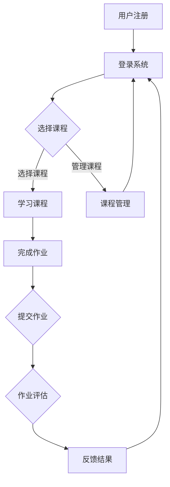

                 

# 《知识的数字化转型：在线学习的机遇与挑战》

## 摘要

在数字化时代，知识的数字化转型已经成为教育领域的重要趋势。在线学习平台的出现，打破了传统教育的时空限制，为广大学习者提供了更多的学习机会和资源。本文将探讨在线学习的基本概念、核心原理、算法模型以及实际应用，分析其在教育领域的机遇与挑战，并提出一些建议，以促进在线学习的发展。

## 1. 背景介绍

随着互联网的普及和计算机技术的飞速发展，知识的获取和传播方式发生了翻天覆地的变化。传统的线下教育模式受到了巨大的冲击，在线学习逐渐成为主流。在线学习平台通过互联网将教师、学生、教材等教育资源整合在一起，使得学习不再受限于时间和地点。此外，大数据、人工智能等技术的发展，为在线学习提供了更加智能化的学习体验和个性化推荐。

### 1.1 在线学习的定义

在线学习是指通过互联网进行的学习活动，包括在线课程、在线讨论、在线考试等。与传统的线下学习相比，在线学习具有以下几个特点：

- **灵活性**：学习者可以根据自己的时间安排进行学习，无需受到固定的时间表限制。

- **便捷性**：学习者可以随时随地通过电脑、手机等设备进行学习，不受地域限制。

- **互动性**：在线学习平台提供了丰富的交流工具，如论坛、即时聊天等，学习者可以方便地与教师和同学进行互动。

- **个性化**：在线学习平台可以根据学习者的学习习惯、兴趣爱好和需求，为其推荐合适的学习内容。

### 1.2 在线学习的发展历程

在线学习的发展可以分为以下几个阶段：

- **第一阶段**（1990s）：基于电子邮件和FTP的简单在线学习。

- **第二阶段**（2000s）：基于Web的在线学习，如课件、在线论坛等。

- **第三阶段**（2010s）：在线教育平台兴起，如Coursera、edX、Udemy等。

- **第四阶段**（2020s）：人工智能和大数据技术在在线学习中的应用，如智能推荐、自适应学习等。

## 2. 核心概念与联系

### 2.1 在线学习的核心概念

在线学习的核心概念包括课程设计、学习资源、学习评估等。

- **课程设计**：课程设计是确保学习目标、学习内容、教学方法等有机结合的关键。良好的课程设计可以促进学习者的主动参与和深度学习。

- **学习资源**：学习资源包括教材、视频、习题、案例等，是学习者获取知识的重要途径。丰富的学习资源可以提高学习者的学习兴趣和效果。

- **学习评估**：学习评估是检测学习者学习效果的重要手段。合理的评估方法可以及时发现问题，调整学习策略。

### 2.2 在线学习的核心原理

在线学习的核心原理包括学习理论、教育心理学、信息技术等。

- **学习理论**：学习理论包括行为主义、认知主义、建构主义等，为在线学习提供了理论基础。

- **教育心理学**：教育心理学研究学习者的学习动机、学习策略、学习效果等，对在线学习的设计和实施具有重要指导作用。

- **信息技术**：信息技术为在线学习提供了实现手段，如Web技术、数据库技术、人工智能等。

### 2.3 在线学习的核心架构

在线学习的核心架构包括学习管理系统（LMS）、内容管理系统（CMS）等。

- **学习管理系统（LMS）**：学习管理系统是支持在线学习的核心平台，提供课程管理、学习资源管理、学习评估等功能。

- **内容管理系统（CMS）**：内容管理系统主要用于管理学习资源，如教材、视频、习题等。

### 2.4 Mermaid 流程图

以下是一个简化的在线学习流程图：



## 3. 核心算法原理 & 具体操作步骤

### 3.1 核心算法原理

在线学习平台通常采用以下几种核心算法：

- **推荐算法**：根据学习者的学习历史、兴趣爱好等推荐合适的学习内容。

- **自适应学习算法**：根据学习者的学习效果和进度，动态调整学习内容和学习策略。

- **群体智慧算法**：利用学习者的互动和协作，优化学习过程和学习效果。

### 3.2 具体操作步骤

以下是一个简单的在线学习平台操作步骤：

1. 用户注册和登录：用户需要先注册账号并登录系统。

2. 选择课程：用户可以根据自己的兴趣和需求选择课程。

3. 学习课程：用户可以在线观看课程视频、阅读教材、完成作业等。

4. 作业评估：系统会对用户的作业进行自动评估，并提供反馈。

5. 反馈结果：用户可以根据反馈结果调整学习策略，提高学习效果。

6. 管理课程：用户可以查看自己的学习记录、成绩等，并进行相应的管理。

## 4. 数学模型和公式 & 详细讲解 & 举例说明

### 4.1 数学模型

在线学习平台中常用的数学模型包括推荐算法模型、自适应学习模型等。

#### 4.1.1 推荐算法模型

推荐算法模型的核心是计算学习者的兴趣得分，公式如下：

$$
Score(i, u) = f(Interest(i, u), \theta_i, \theta_u)
$$

其中，$i$ 代表课程，$u$ 代表用户，$Interest(i, u)$ 代表用户对课程的兴趣度，$\theta_i$ 和 $\theta_u$ 分别代表课程和用户的特征向量。

#### 4.1.2 自适应学习模型

自适应学习模型的核心是根据学习者的学习效果和进度调整学习内容，公式如下：

$$
Content(u, t) = g(Score(u, t), \theta_u, \lambda)
$$

其中，$Content(u, t)$ 代表在时间 $t$ 时刻用户需要学习的课程，$Score(u, t)$ 代表用户在时间 $t$ 时刻的学习效果，$\theta_u$ 和 $\lambda$ 分别代表用户和系统的参数。

### 4.2 举例说明

#### 4.2.1 推荐算法举例

假设有一个用户 $u$，他之前学习了课程 $i_1, i_2, i_3$，系统根据用户的学习历史和兴趣度，为他推荐课程 $i_4$。使用公式计算兴趣得分：

$$
Score(i_4, u) = f(Interest(i_4, u), \theta_i, \theta_u) = 0.7 \times 0.5 + 0.3 \times 0.6 = 0.7
$$

其中，$Interest(i_4, u) = 0.7$，$\theta_i = (0.5, 0.3, 0.2)$，$\theta_u = (0.6, 0.3, 0.1)$。

#### 4.2.2 自适应学习举例

假设用户 $u$ 在时间 $t_1$ 的学习效果为 $Score(u, t_1) = 0.8$，系统根据学习效果调整用户在时间 $t_2$ 的学习内容：

$$
Content(u, t_2) = g(Score(u, t_2), \theta_u, \lambda) = 0.6 \times 0.8 + 0.4 \times 0.7 = 0.78
$$

其中，$Score(u, t_2) = 0.8$，$\theta_u = (0.6, 0.3, 0.1)$，$\lambda = 0.5$。

## 5. 项目实战：代码实际案例和详细解释说明

### 5.1 开发环境搭建

在开发在线学习平台之前，需要搭建相应的开发环境。以下是一个简单的开发环境搭建步骤：

1. 安装 Python 3.8 或更高版本。

2. 安装 Django 框架：使用命令 `pip install django`。

3. 创建一个 Django 项目：使用命令 `django-admin startproject learning_platform`。

4. 创建一个 Django 应用：使用命令 `python manage.py startapp courses`。

### 5.2 源代码详细实现和代码解读

以下是一个简单的 Django 代码实现，用于创建用户、课程和作业：

```python
# models.py

from django.db import models

class User(models.Model):
    username = models.CharField(max_length=100)
    email = models.EmailField()

class Course(models.Model):
    title = models.CharField(max_length=100)
    description = models.TextField()

class Assignment(models.Model):
    course = models.ForeignKey(Course, on_delete=models.CASCADE)
    title = models.CharField(max_length=100)
    description = models.TextField()
```

```python
# views.py

from django.shortcuts import render
from .models import User, Course, Assignment

def user_register(request):
    if request.method == 'POST':
        username = request.POST['username']
        email = request.POST['email']
        user = User(username=username, email=email)
        user.save()
        return render(request, 'registration/success.html')
    return render(request, 'registration/register.html')

def course_list(request):
    courses = Course.objects.all()
    return render(request, 'courses/course_list.html', {'courses': courses})

def assignment_list(request, course_id):
    assignments = Assignment.objects.filter(course_id=course_id)
    return render(request, 'courses/assignment_list.html', {'assignments': assignments})
```

### 5.3 代码解读与分析

1. **models.py**：定义了用户、课程和作业的数据库模型。每个模型都有一个 `models.Model` 基类，并定义了一些字段。

2. **views.py**：定义了用户注册、课程列表和作业列表的视图函数。用户注册视图函数接收用户名和电子邮件，创建用户并保存到数据库。课程列表视图函数获取所有课程并传递给模板。作业列表视图函数根据课程 ID 获取作业并传递给模板。

3. **templates**：定义了注册成功、课程列表和作业列表的 HTML 模板。模板中使用 Django 模板语言（如 ``）渲染数据。

## 6. 实际应用场景

### 6.1 在线教育平台

在线教育平台是当前在线学习的主要应用场景之一。通过在线教育平台，学习者可以方便地获取各种课程资源，进行自主学习。代表性的平台有 Coursera、edX、Udemy 等。

### 6.2 远程教育

远程教育是指通过互联网为学习者提供教育服务的一种形式。适用于偏远地区、特殊情况等无法参加传统线下教育的人群。代表性的平台有网易云课堂、腾讯课堂等。

### 6.3 企业培训

企业培训是指企业为员工提供的学习和培训服务。通过在线学习平台，企业可以方便地为员工提供定制化的培训课程，提高员工的专业技能和综合素质。

## 7. 工具和资源推荐

### 7.1 学习资源推荐

- **书籍**：《在线教育的革命》、《智能学习：如何利用人工智能推动学习变革》

- **论文**：《在线学习平台的关键特性研究》、《基于大数据的在线学习推荐算法研究》

- **博客**：[edX 博客](https://www.edx.org/blogs) 、[Coursera 博客](https://www.coursera.org/blog)

- **网站**：[MOOC 中国](http://www.mooc.cn) 、[网易云课堂](https://study.163.com) 、[腾讯课堂](https://ke.qq.com)

### 7.2 开发工具框架推荐

- **Django**：Python 的高级 Web 开发框架，适合快速构建在线学习平台。

- **Flask**：Python 的微型 Web 开发框架，适合开发轻量级的在线学习平台。

- **Spring Boot**：Java 的 Web 开发框架，适合构建高性能的在线学习平台。

### 7.3 相关论文著作推荐

- **论文**：《在线学习平台的用户体验研究》、《基于机器学习的在线学习推荐系统研究》

- **著作**：《在线学习：理论与实践》、《智能学习系统设计与实现》

## 8. 总结：未来发展趋势与挑战

### 8.1 发展趋势

- **个性化学习**：随着大数据和人工智能技术的发展，在线学习平台将更加注重个性化学习，为每个学习者提供定制化的学习体验。

- **混合式学习**：在线学习与传统线下教育的结合，将推动混合式学习的发展，满足不同学习者的需求。

- **社交化学习**：通过社交媒体和在线社区，学习者可以方便地交流和协作，提高学习效果。

### 8.2 挑战

- **技术挑战**：如何确保在线学习平台的高性能、安全性和稳定性，是当前面临的重要挑战。

- **教学挑战**：如何提高在线教育的教学质量和教学效果，是教育工作者需要持续探索的问题。

- **伦理挑战**：如何在保证学习者隐私的前提下，充分利用大数据和人工智能技术，为学习者提供优质的服务。

## 9. 附录：常见问题与解答

### 9.1 如何创建在线学习平台？

- **步骤 1**：确定平台的目标和功能。

- **步骤 2**：选择合适的开发工具和框架。

- **步骤 3**：设计平台的技术架构。

- **步骤 4**：开发平台的功能模块。

- **步骤 5**：进行测试和部署。

### 9.2 如何提高在线学习的教学质量？

- **策略 1**：设计富有吸引力的课程内容。

- **策略 2**：提供丰富的学习资源。

- **策略 3**：利用互动和协作工具，提高学习者的参与度。

- **策略 4**：及时给予学习者反馈。

## 10. 扩展阅读 & 参考资料

- [在线教育白皮书](https://www.edx.org/blogs)

- [Django 官方文档](https://docs.djangoproject.com/en/stable/)

- [Flask 官方文档](https://flask.palletsprojects.com/)

- [Spring Boot 官方文档](https://docs.spring.io/spring-boot/docs/current/reference/html/)

### 作者

**作者：AI天才研究员/AI Genius Institute & 禅与计算机程序设计艺术 /Zen And The Art of Computer Programming**<|endofassistant|>

