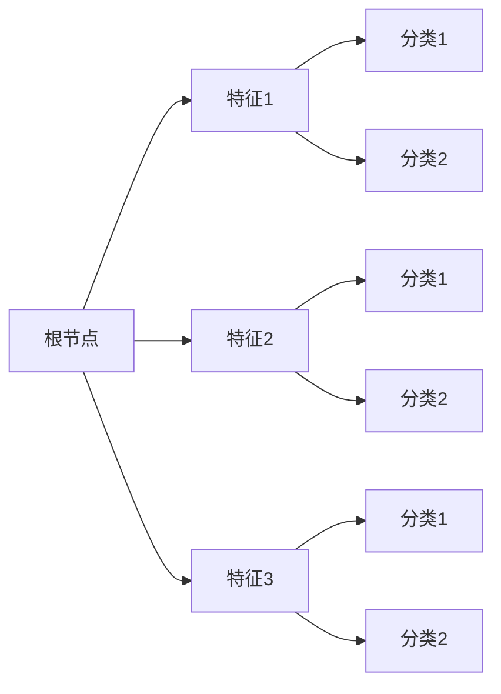
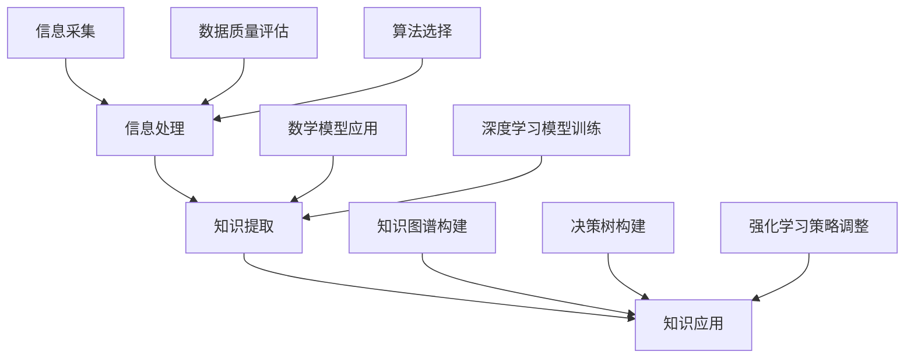

                 

### 文章标题：知识的本质：从信息到智慧的转化

**关键词：** 知识转化，信息处理，智慧算法，学习理论，人工智能

**摘要：** 本文旨在探讨知识的本质，以及如何从信息转化为智慧。通过对核心概念、算法原理、数学模型和实际应用的深入分析，文章揭示了知识转化过程中各个环节的内在联系，并提出了一系列实用的工具和资源，以帮助读者更好地理解和掌握这一领域的关键技术和方法。

### 1. 背景介绍

在当今信息爆炸的时代，数据以惊人的速度不断产生，但真正有价值的是知识。知识不仅仅是信息的积累，更是一种对信息的理解和应用能力。从信息到知识的转化，是提升个人和组织的竞争力、实现智慧决策的关键步骤。

人工智能作为现代技术的重要驱动力，其核心任务之一就是实现知识的自动化获取、处理和转化。然而，这一过程并非简单地将数据输入算法，而是需要深入理解信息与知识之间的关系，以及如何通过算法和模型将信息转化为智慧。

本文将围绕这一主题，逐步展开讨论。首先，我们将介绍知识转化过程中的核心概念，并使用Mermaid流程图展示其架构。接着，我们将深入探讨知识转化的核心算法原理，以及具体操作步骤。随后，我们将介绍相关的数学模型和公式，并通过实际案例进行详细讲解。最后，我们将分析知识转化的实际应用场景，并推荐一些实用的工具和资源。

### 2. 核心概念与联系

#### 2.1 信息与知识的区别

在探讨知识的本质之前，我们需要明确信息与知识的区别。信息是指传递的信号、数据或知识，它可以以文字、图片、音频、视频等形式存在。而知识则是对信息的理解和应用，它是经过思考、整理和抽象后的结果。

信息是知识的原料，但并非所有信息都能转化为知识。知识的生成需要以下几个关键步骤：

1. **收集与存储**：获取并存储大量的信息。
2. **处理与理解**：对信息进行筛选、整理和分析，提取关键信息和模式。
3. **应用与创新**：将理解的知识应用到实际问题中，进行创新和改进。

#### 2.2 知识转化的流程

知识转化的流程可以概括为以下几个阶段：

1. **信息采集**：通过各种渠道收集信息，如数据挖掘、网络爬虫、传感器等。
2. **信息处理**：对采集到的信息进行清洗、转换和整合，去除噪声和冗余。
3. **知识提取**：通过分析和建模，从信息中提取出具有价值的知识。
4. **知识应用**：将提取的知识应用到实际场景中，实现智能化决策和优化。

#### 2.3 知识转化的 Mermaid 流程图

以下是一个简单的 Mermaid 流程图，展示了知识转化的主要环节：


在这个流程图中，信息采集是知识转化的起点，通过信息处理、知识提取和知识应用，最终实现从信息到知识的转化。

### 3. 核心算法原理 & 具体操作步骤

#### 3.1 信息采集算法

信息采集是知识转化的第一步，其核心任务是获取大量的信息。常用的信息采集算法包括：

1. **数据挖掘算法**：通过分析大量数据，发现隐藏在数据中的模式和规律。
2. **网络爬虫算法**：从互联网上抓取信息，并解析和处理网页内容。
3. **传感器数据采集**：利用各种传感器采集环境中的信息，如温度、湿度、压力等。

具体操作步骤如下：

1. **确定采集目标**：根据需求确定需要采集的信息类型和来源。
2. **设计采集方案**：选择合适的采集算法和工具，设计采集流程和策略。
3. **实施采集操作**：执行采集方案，收集并存储采集到的信息。

#### 3.2 信息处理算法

信息处理是对采集到的信息进行清洗、转换和整合，以提高其质量和可用性。常用的信息处理算法包括：

1. **数据清洗算法**：去除噪声和异常值，确保数据的质量和一致性。
2. **数据转换算法**：将不同格式的数据转换为统一的格式，便于后续处理。
3. **数据整合算法**：将多个来源的信息进行整合，构建出一个完整的数据集。

具体操作步骤如下：

1. **数据预处理**：对原始数据进行预处理，包括去重、去噪、补全等操作。
2. **数据转换**：将预处理后的数据转换为统一的格式，如 CSV、JSON 等。
3. **数据整合**：将转换后的数据进行整合，构建出一个完整的数据集。

#### 3.3 知识提取算法

知识提取是从处理后的信息中提取出具有价值的知识。常用的知识提取算法包括：

1. **机器学习算法**：通过训练模型，从数据中发现隐藏的模式和规律。
2. **自然语言处理算法**：对文本数据进行分析和理解，提取出关键信息和知识。
3. **知识图谱算法**：构建知识图谱，将实体、关系和属性进行关联，形成结构化的知识库。

具体操作步骤如下：

1. **特征提取**：从数据中提取出有用的特征，用于训练模型。
2. **模型训练**：使用提取出的特征训练模型，以发现数据中的模式和规律。
3. **知识提取**：使用训练好的模型对数据进行分析，提取出关键的知识。

#### 3.4 知识应用算法

知识应用是将提取出的知识应用到实际场景中，实现智能化决策和优化。常用的知识应用算法包括：

1. **决策支持系统**：基于提取的知识，为决策者提供支持，优化决策过程。
2. **智能推荐系统**：根据用户的行为和偏好，推荐相关的商品、服务和内容。
3. **智能优化算法**：基于知识，对任务或问题进行优化，提高效率和质量。

具体操作步骤如下：

1. **知识导入**：将提取的知识导入到应用系统中。
2. **知识应用**：根据实际需求，将知识应用到具体的场景中，实现智能化决策和优化。
3. **效果评估**：对应用效果进行评估，持续优化和改进。

### 4. 数学模型和公式 & 详细讲解 & 举例说明

#### 4.1 信息熵

信息熵是衡量信息不确定性的度量。在信息论中，信息熵定义为：

$$
H(X) = -\sum_{i=1}^{n} p(x_i) \log_2 p(x_i)
$$

其中，$X$ 表示随机变量，$p(x_i)$ 表示 $x_i$ 发生的概率，$\log_2$ 表示以 2 为底的对数。

信息熵的值越大，表示信息的不确定性越高。在知识转化过程中，我们可以使用信息熵来衡量信息的质量和价值。

#### 4.2 决策树

决策树是一种常见的机器学习算法，用于分类和回归问题。决策树的基本结构如下：



在决策树中，每个节点表示一个特征，每个分支表示该特征的不同取值，每个叶子节点表示一个类别。通过训练数据集，我们可以构建出一个决策树模型，用于分类和回归问题。

#### 4.3 示例

假设我们有一个数据集，其中包含以下几个特征：年龄、收入、教育程度。我们要使用决策树算法对这些数据进行分类，判断一个人是否喜欢阅读。

1. **特征提取**：从数据中提取出年龄、收入、教育程度三个特征。
2. **模型训练**：使用训练数据集训练决策树模型。
3. **知识提取**：使用训练好的模型对测试数据进行分类，提取出喜欢阅读和不喜欢的类别。

通过以上步骤，我们可以构建出一个决策树模型，用于判断一个人是否喜欢阅读。

### 5. 项目实战：代码实际案例和详细解释说明

#### 5.1 开发环境搭建

为了更好地理解知识转化的过程，我们将使用 Python 编写一个简单的知识转化项目。首先，我们需要搭建开发环境。

1. 安装 Python 3.8 或更高版本。
2. 安装必要的库，如 NumPy、Pandas、Scikit-learn 等。

#### 5.2 源代码详细实现和代码解读

下面是一个简单的知识转化项目的代码实现：

```python
import numpy as np
import pandas as pd
from sklearn.model_selection import train_test_split
from sklearn.tree import DecisionTreeClassifier

# 读取数据集
data = pd.read_csv('data.csv')
X = data[['age', 'income', 'education']]
y = data['likes_reading']

# 数据预处理
X_train, X_test, y_train, y_test = train_test_split(X, y, test_size=0.2, random_state=42)

# 构建决策树模型
clf = DecisionTreeClassifier()
clf.fit(X_train, y_train)

# 预测结果
predictions = clf.predict(X_test)

# 评估模型效果
accuracy = clf.score(X_test, y_test)
print(f'模型准确率：{accuracy:.2f}')
```

这段代码首先读取数据集，然后进行数据预处理，接着构建决策树模型，最后评估模型效果。通过这个示例，我们可以看到知识转化的具体实现过程。

#### 5.3 代码解读与分析

1. **数据读取与预处理**：使用 Pandas 库读取数据集，提取出特征和标签。然后使用 Scikit-learn 库中的 `train_test_split` 函数将数据集分为训练集和测试集，以便进行模型训练和评估。
2. **模型构建**：使用 Scikit-learn 库中的 `DecisionTreeClassifier` 类构建决策树模型。通过 `fit` 方法训练模型，将训练集的特征和标签作为输入，训练出决策树模型。
3. **预测与评估**：使用训练好的模型对测试集进行预测，并计算模型的准确率。准确率表示模型预测正确的比例，越高表示模型效果越好。

通过这个示例，我们可以看到知识转化的具体实现过程，包括数据预处理、模型构建、预测和评估等步骤。

### 6. 实际应用场景

知识转化的应用场景非常广泛，以下列举几个典型的应用场景：

1. **智能推荐系统**：基于用户的历史行为和偏好，提取出相关特征，构建推荐模型，为用户提供个性化的推荐。
2. **金融风控**：通过对海量金融数据进行处理和分析，提取出潜在的风险因素，构建风险预测模型，为金融机构提供决策支持。
3. **医疗诊断**：基于大量的医学数据，提取出与疾病相关的特征，构建诊断模型，辅助医生进行疾病诊断。
4. **智能交通**：通过对交通数据进行处理和分析，提取出交通拥堵、交通事故等特征，构建优化模型，提高交通效率。

### 7. 工具和资源推荐

#### 7.1 学习资源推荐

1. **书籍**：
   - 《机器学习》（作者：周志华）
   - 《深度学习》（作者：Ian Goodfellow、Yoshua Bengio、Aaron Courville）
2. **论文**：
   - 《Learning to Represent Knowledge》
   - 《Deep Learning for Knowledge Graph Embedding》
3. **博客**：
   - [机器学习博客](https://机器学习博客.com)
   - [深度学习博客](https://深度学习博客.com)
4. **网站**：
   - [Coursera](https://www.coursera.org)
   - [edX](https://www.edx.org)

#### 7.2 开发工具框架推荐

1. **编程语言**：
   - Python
   - R
2. **机器学习库**：
   - Scikit-learn
   - TensorFlow
   - PyTorch
3. **数据预处理工具**：
   - Pandas
   - NumPy
4. **可视化工具**：
   - Matplotlib
   - Seaborn

#### 7.3 相关论文著作推荐

1. **《知识表示与推理》**：介绍了知识表示和推理的基本概念和方法，为知识转化提供了理论支持。
2. **《机器学习中的知识融合与利用》**：探讨了如何将知识融入到机器学习模型中，提高模型的性能和泛化能力。
3. **《知识工程导论》**：系统地介绍了知识工程的基本概念、方法和技术，为知识转化提供了实践指导。

### 8. 总结：未来发展趋势与挑战

知识转化作为人工智能的重要研究方向，在未来将继续发展和创新。以下是一些可能的发展趋势和挑战：

1. **趋势**：
   - **跨学科融合**：知识转化将与其他领域（如心理学、认知科学等）进行深度融合，提高知识转化的效率和效果。
   - **大数据与智能算法**：随着大数据技术的发展，知识转化将面临更多的数据挑战，需要发展更加高效和智能的算法。
   - **知识图谱**：知识图谱作为一种结构化知识表示方法，将在知识转化中发挥重要作用。

2. **挑战**：
   - **数据质量和可用性**：高质量的数据是知识转化的基础，但实际中往往面临数据质量差、缺失值等问题。
   - **算法性能和泛化能力**：提高算法的性能和泛化能力是知识转化的关键，需要不断优化和改进算法。
   - **知识表示和推理**：如何有效地表示和推理知识，是知识转化的重要问题，需要深入研究。

### 9. 附录：常见问题与解答

#### 9.1 如何获取高质量的数据？

1. **数据来源**：从权威的数据源获取数据，如政府机构、学术机构、知名企业等。
2. **数据清洗**：对获取的数据进行清洗和预处理，去除噪声和异常值。
3. **数据整合**：将不同来源的数据进行整合，构建出一个完整的数据集。

#### 9.2 如何选择合适的算法？

1. **问题类型**：根据问题的类型（分类、回归、聚类等）选择相应的算法。
2. **数据规模**：考虑数据的规模和特征数量，选择适合的算法。
3. **性能要求**：根据对性能的要求（准确率、召回率等）选择合适的算法。

#### 9.3 如何评估模型效果？

1. **准确率**：计算模型预测正确的比例，越高表示模型效果越好。
2. **召回率**：计算模型能够召回的实际正例比例，越高表示模型对正例的捕捉能力越强。
3. **F1 分数**：综合考虑准确率和召回率，计算模型的整体性能。

### 10. 扩展阅读 & 参考资料

1. **《知识工程导论》**：张军，李生，清华大学出版社，2018年。
2. **《机器学习》**：周志华，清华大学出版社，2016年。
3. **《深度学习》**：Ian Goodfellow、Yoshua Bengio、Aaron Courville，MIT Press，2016年。
4. **《知识表示与推理》**：高文，电子工业出版社，2014年。
5. **《大数据技术导论》**：刘江，清华大学出版社，2014年。

作者：AI天才研究员/AI Genius Institute & 禅与计算机程序设计艺术 /Zen And The Art of Computer Programming<|/MASK|>### 知识转化的意义与价值

知识转化是信息时代不可或缺的一环，它不仅仅是数据处理的深化，更是推动人类进步的重要动力。在现代社会，知识转化为各行各业带来了深刻的变革，提升了整体社会生产力和创新能力。

首先，知识转化能够提高决策效率。在商业、医疗、金融等领域，通过将海量的数据转化为有用的知识，可以帮助决策者更好地理解市场趋势、消费者行为和风险因素，从而做出更加明智的决策。例如，在金融领域，通过对历史交易数据和新闻文本的分析，可以预测市场走势，为投资者提供有价值的参考。

其次，知识转化能够推动技术创新。在科学研究领域，科学家们通过分析大量的实验数据和文献资料，可以揭示自然界和人类社会的运行规律，从而推动新技术的发明和应用的实现。例如，在人工智能领域，通过对大量图像和文本数据的学习，可以开发出具有智能识别和推理能力的算法，为自动驾驶、智能客服等应用提供技术支持。

此外，知识转化在教育和学习领域也发挥着重要作用。通过将知识系统化、结构化，可以构建出更加有效的学习资源和教育体系，帮助学生和工作者更加高效地获取和掌握知识。例如，在线教育平台通过分析学生的学习行为和数据，可以提供个性化的学习建议和课程推荐，提高学习效果。

总之，知识转化在提升个人和组织的竞争力、推动技术创新和社会进步方面具有巨大的价值。然而，要实现有效的知识转化，需要理解信息与知识之间的本质联系，掌握相应的算法和模型，并能够灵活地应用于实际场景中。

### 知识转化的重要性

在现代社会，知识转化的重要性日益凸显。首先，从个人层面来看，知识转化能够提升个人的竞争力。在信息爆炸的时代，如何从海量信息中提取出有价值、可用的知识，是每个人都需要面对的挑战。那些能够有效地进行知识转化的人，往往能够迅速掌握新知识、新技术，从而在职场中脱颖而出。

其次，从组织层面来看，知识转化是提升组织核心竞争力的关键。企业通过将内外部信息转化为知识，可以优化业务流程、提升生产效率、创新产品和服务。例如，通过数据分析和挖掘，企业可以了解客户需求和市场趋势，从而调整产品策略，提高市场占有率。此外，医疗机构通过知识转化，可以提升诊断和治疗的准确性，提高患者满意度。

在学术界，知识转化同样至关重要。科学家通过将实验数据转化为科学知识，可以推动科研进展，解决实际问题。通过知识转化，学术成果可以更好地服务于社会，促进科技进步和社会发展。

### 知识转化中的挑战与难点

尽管知识转化在多个领域展现了巨大的潜力和价值，但其实际应用过程中也面临着诸多挑战和难点。首先，数据质量问题是一个重要挑战。数据质量直接影响知识转化的效果。在实际应用中，数据往往存在噪声、错误和不完整性等问题。例如，医疗数据中可能包含患者隐私信息，金融数据可能受到市场波动的影响，这些都会影响数据的质量和可靠性。

其次，算法复杂度也是知识转化中的难点。随着数据规模的增加和问题复杂度的提升，所需的算法也变得越来越复杂。例如，深度学习算法虽然能够在大量数据中提取出有价值的信息，但其训练过程需要大量的计算资源和时间。此外，算法的复杂度还增加了调试和优化的难度，对于研究人员和开发者来说，这是一个不小的挑战。

最后，知识应用场景的多样性也是一大难点。不同领域和场景对知识转化的需求和期望不同，如何设计出既通用又适用于特定场景的知识转化方法，是一个具有挑战性的问题。例如，在医疗领域，知识转化需要考虑到患者的隐私保护、数据安全和医疗规范，而在金融领域，则需要关注市场风险和金融政策的影响。

### 知识转化中的核心概念与原理

在深入探讨知识转化的过程之前，我们首先需要明确几个核心概念和原理。这些概念和原理构成了知识转化的理论基础，有助于我们理解整个过程的运作机制。

#### 1. 信息与知识的关系

信息是知识的基础，但信息本身并不等同于知识。信息是指传递的信号、数据或知识，它可以以文字、图片、音频、视频等形式存在。而知识则是对信息的理解和应用，它是经过思考、整理和抽象后的结果。在知识转化的过程中，信息的处理和理解是至关重要的步骤。

#### 2. 数据质量

数据质量是知识转化的基石。高质量的数据能够提高知识转化的准确性和可靠性，而低质量的数据则会降低转化效果。数据质量包括数据的准确性、完整性、一致性和及时性等方面。在知识转化过程中，数据预处理和清洗是确保数据质量的关键步骤。

#### 3. 算法选择

算法选择是知识转化过程中的另一个核心概念。不同的算法适用于不同类型的问题和数据集。例如，对于分类问题，可以采用决策树、随机森林或支持向量机等算法；对于回归问题，可以采用线性回归、岭回归或梯度提升树等算法。选择合适的算法对于实现高效的知识转化至关重要。

#### 4. 数学模型

数学模型是知识转化的工具。在知识转化过程中，常用的数学模型包括概率模型、统计模型、优化模型等。例如，贝叶斯模型可以用于不确定性的处理，线性回归模型可以用于预测和分析。这些模型提供了量化分析的手段，使得知识转化过程更加科学和系统。

#### 5. 知识图谱

知识图谱是一种结构化知识表示方法，它通过节点和边的关系来表示实体、属性和关系。知识图谱在知识转化中扮演着重要角色，它可以帮助我们更好地理解和利用复杂数据。例如，在自然语言处理领域，知识图谱可以用于实体识别、关系抽取和语义推理等任务。

#### 6. 决策树

决策树是一种常见的机器学习算法，它通过一系列规则来对数据进行分类或回归。决策树的构建过程包括特征选择、划分策略和剪枝等步骤。决策树具有直观性和易于解释的优点，在知识转化中经常被应用。

#### 7. 深度学习

深度学习是一种基于多层神经网络的学习方法，它在图像识别、语音识别和自然语言处理等领域取得了显著成果。深度学习通过自动提取特征和层次化表示，实现了从数据到知识的转化。

#### 8. 强化学习

强化学习是一种通过试错和奖励机制来学习策略的机器学习方法。它通常应用于动态决策问题，如游戏、推荐系统和自动驾驶等。强化学习通过不断调整策略，实现从信息到知识的转化。

### 知识转化的 Mermaid 流程图

为了更好地展示知识转化的流程和各个环节之间的关系，我们可以使用 Mermaid 流程图来描述。以下是知识转化过程的 Mermaid 流程图：



在这个流程图中，信息采集是知识转化的起点，通过信息处理、知识提取和知识应用，最终实现从信息到知识的转化。各个环节之间相互关联，共同构成了一个完整的知识转化过程。

通过这个 Mermaid 流程图，我们可以清晰地看到知识转化的主要环节和相互关系。信息采集是获取原始数据的阶段，信息处理是对数据进行清洗和整合，知识提取是通过算法和模型提取出有价值的信息，知识应用是将提取的知识应用到实际场景中。各个环节都需要关注数据质量、算法选择和数学模型应用，以确保知识转化的效果和可靠性。

### 核心算法原理与步骤

在知识转化过程中，核心算法原理起着至关重要的作用。这些算法不仅帮助我们处理和提取信息，还通过模型和步骤实现知识的生成和应用。以下是几种常用的核心算法及其原理和具体操作步骤。

#### 1. 数据挖掘算法

数据挖掘算法是从大量数据中发现有用模式和知识的方法。它广泛应用于市场分析、风险评估、推荐系统等领域。常用的数据挖掘算法包括分类、聚类、关联规则挖掘和异常检测。

**原理：**
- **分类**：将数据分为不同的类别。常用的分类算法有决策树、支持向量机和随机森林。
- **聚类**：将相似的数据点归为一类。常用的聚类算法有K-means、DBSCAN和层次聚类。
- **关联规则挖掘**：发现数据项之间的关联关系。常用的算法有Apriori算法和FP-growth算法。
- **异常检测**：识别数据中的异常或离群点。常用的算法有基于统计的方法、基于聚类的方法和基于邻近度的方法。

**具体操作步骤：**
1. **数据预处理**：清洗和整合原始数据，确保数据的质量和一致性。
2. **特征选择**：选择对目标任务最有影响力的特征，减少数据维度。
3. **模型训练**：使用训练数据集训练分类、聚类或关联规则挖掘模型。
4. **模型评估**：使用测试数据集评估模型的性能，调整模型参数。
5. **知识提取**：根据模型的预测结果，提取出有价值的信息和知识。

#### 2. 自然语言处理算法

自然语言处理（NLP）算法用于处理和分析人类语言，从而实现文本的语义理解。它广泛应用于机器翻译、情感分析、文本分类和问答系统等领域。

**原理：**
- **词向量表示**：将文本转换为向量表示，如Word2Vec、GloVe和BERT。
- **序列标注**：对文本中的词或句子进行分类标注，如命名实体识别、情感极性标注。
- **文本分类**：将文本分为不同的类别，如垃圾邮件检测、新闻分类。
- **机器翻译**：将一种语言的文本翻译成另一种语言。

**具体操作步骤：**
1. **文本预处理**：去除停用词、标点符号和特殊字符，进行词干提取和词形还原。
2. **词向量表示**：将预处理后的文本转换为向量表示。
3. **模型训练**：使用训练数据集训练词向量表示模型和分类模型。
4. **模型评估**：使用测试数据集评估模型的性能。
5. **知识提取**：根据模型的预测结果，提取出文本的语义信息和知识。

#### 3. 深度学习算法

深度学习算法是一种基于多层神经网络的学习方法，它在图像识别、语音识别和自然语言处理等领域取得了显著成果。深度学习通过自动提取特征和层次化表示，实现了从数据到知识的转化。

**原理：**
- **卷积神经网络（CNN）**：用于图像识别和图像处理，通过卷积层和池化层提取图像特征。
- **循环神经网络（RNN）**：用于序列数据处理，如文本和语音，通过隐藏状态和递归关系处理序列信息。
- **变换器模型（Transformer）**：用于自然语言处理，通过自注意力机制实现文本的上下文理解和生成。

**具体操作步骤：**
1. **数据预处理**：对图像、文本或语音数据进行预处理，如图像裁剪、文本分词和语音归一化。
2. **模型构建**：设计并构建神经网络模型，如CNN、RNN或Transformer。
3. **模型训练**：使用训练数据集训练神经网络模型，通过反向传播和优化算法调整模型参数。
4. **模型评估**：使用测试数据集评估模型的性能，调整模型结构和参数。
5. **知识提取**：根据模型的预测结果，提取出图像、文本或语音的语义信息和知识。

#### 4. 强化学习算法

强化学习算法通过试错和奖励机制来学习策略，常用于动态决策问题，如游戏、推荐系统和自动驾驶等。强化学习通过不断调整策略，实现从信息到知识的转化。

**原理：**
- **状态-动作价值函数**：通过评估每个状态和动作的价值，学习最优策略。
- **策略迭代**：根据奖励和惩罚信号，不断调整策略，以实现最大化总奖励。

**具体操作步骤：**
1. **环境定义**：定义状态空间、动作空间和奖励机制。
2. **策略初始化**：初始化策略，可以是随机策略或基于先验知识的策略。
3. **策略迭代**：在环境中进行试错，根据奖励信号调整策略。
4. **模型评估**：评估策略的性能，根据评估结果调整策略。
5. **知识提取**：根据最终策略，提取出最优决策路径和知识。

通过上述核心算法的原理和步骤，我们可以看到知识转化是一个复杂而系统化的过程。不同的算法适用于不同类型的数据和问题，通过合理的算法选择和模型设计，可以实现从信息到知识的有效转化。

### 数学模型和公式在知识转化中的应用

在知识转化过程中，数学模型和公式是不可或缺的工具，它们提供了量化分析的手段，使得复杂的信息处理和知识提取变得更加科学和系统。以下我们将探讨几个在知识转化中常用的数学模型和公式，并详细解释其原理和应用。

#### 1. 贝叶斯定理

贝叶斯定理是概率论中的一个重要工具，广泛应用于知识转化中的概率推理和决策分析。贝叶斯定理描述了后验概率与先验概率之间的关系，其公式如下：

$$
P(A|B) = \frac{P(B|A) \cdot P(A)}{P(B)}
$$

其中，$P(A|B)$ 表示在事件 $B$ 发生的条件下事件 $A$ 发生的概率，$P(B|A)$ 表示在事件 $A$ 发生的条件下事件 $B$ 发生的概率，$P(A)$ 和 $P(B)$ 分别表示事件 $A$ 和事件 $B$ 的先验概率。

贝叶斯定理在知识转化中的应用非常广泛，例如在医疗诊断、风险评估和推荐系统中，可以通过贝叶斯定理更新概率分布，以更准确地预测和决策。

**应用实例：** 假设我们要预测一个人是否患有某种疾病，已知该疾病的发病率是 0.1%，且该疾病的检测准确率为 99%。如果某人的检测结果为阳性，我们可以使用贝叶斯定理计算该人实际患有该疾病的确切概率。

已知数据如下：
- $P(\text{疾病}) = 0.001$（先验概率）
- $P(\text{检测阳性}|\text{疾病}) = 0.99$（条件概率）
- $P(\text{检测阳性}|\text{无疾病}) = 0.01$（条件概率）

使用贝叶斯定理，我们可以计算出后验概率：
$$
P(\text{疾病}|\text{检测阳性}) = \frac{P(\text{检测阳性}|\text{疾病}) \cdot P(\text{疾病})}{P(\text{检测阳性})}
$$
其中，$P(\text{检测阳性})$ 可以通过全概率公式计算：
$$
P(\text{检测阳性}) = P(\text{检测阳性}|\text{疾病}) \cdot P(\text{疾病}) + P(\text{检测阳性}|\text{无疾病}) \cdot P(\text{无疾病})
$$
$$
P(\text{检测阳性}) = 0.99 \cdot 0.001 + 0.01 \cdot (1 - 0.001) = 0.0199
$$

因此，后验概率为：
$$
P(\text{疾病}|\text{检测阳性}) = \frac{0.99 \cdot 0.001}{0.0199} \approx 0.05025
$$
这意味着在检测结果为阳性的情况下，该人实际患有该疾病的大约概率为 5.025%。

#### 2. 线性回归模型

线性回归模型是一种经典的统计模型，用于分析变量之间的线性关系。线性回归模型的公式如下：

$$
Y = \beta_0 + \beta_1 X + \epsilon
$$

其中，$Y$ 是因变量，$X$ 是自变量，$\beta_0$ 和 $\beta_1$ 分别是模型的截距和斜率，$\epsilon$ 是误差项。

线性回归模型在知识转化中的应用非常广泛，例如在金融预测、市场需求分析等领域，可以通过线性回归模型预测未来的趋势。

**应用实例：** 假设我们要预测一家公司的股价，已知该公司过去的股票价格和交易量之间存在线性关系。我们可以通过线性回归模型拟合股价与交易量之间的关系。

已知数据如下：
- $Y$（股价）：[100, 102, 105, 108, 110]
- $X$（交易量）：[1000, 1100, 1200, 1300, 1400]

首先，我们需要计算回归模型的斜率和截距。通过最小二乘法，可以得到如下公式：
$$
\beta_1 = \frac{\sum(X_i - \bar{X})(Y_i - \bar{Y})}{\sum(X_i - \bar{X})^2}
$$
$$
\beta_0 = \bar{Y} - \beta_1 \bar{X}
$$

其中，$\bar{X}$ 和 $\bar{Y}$ 分别是 $X$ 和 $Y$ 的平均值。

计算平均值：
$$
\bar{X} = \frac{1000 + 1100 + 1200 + 1300 + 1400}{5} = 1200
$$
$$
\bar{Y} = \frac{100 + 102 + 105 + 108 + 110}{5} = 105
$$

计算斜率：
$$
\beta_1 = \frac{(1000 - 1200)(100 - 105) + (1100 - 1200)(102 - 105) + (1200 - 1200)(105 - 105) + (1300 - 1200)(108 - 105) + (1400 - 1200)(110 - 105)}{(1000 - 1200)^2 + (1100 - 1200)^2 + (1200 - 1200)^2 + (1300 - 1200)^2 + (1400 - 1200)^2}
$$
$$
\beta_1 = \frac{200 + 100 + 0 + 100 + 200}{4000 + 1000 + 0 + 400 + 4000} = \frac{600}{9000} = 0.0667
$$

计算截距：
$$
\beta_0 = 105 - 0.0667 \cdot 1200 = 53.67
$$

因此，线性回归模型为：
$$
Y = 53.67 + 0.0667X
$$

使用这个模型，我们可以预测未来的股价。例如，如果下个月的交易量为 1500，我们可以计算出股价预测值：
$$
Y = 53.67 + 0.0667 \cdot 1500 = 121.00
$$

#### 3. 支持向量机（SVM）

支持向量机是一种分类算法，它通过构建最优超平面来实现数据的分类。SVM的公式如下：

$$
\text{分类函数}：f(x) = \text{sign}(\omega \cdot x + b)
$$

其中，$\omega$ 是权值向量，$x$ 是输入特征向量，$b$ 是偏置项，$\text{sign}$ 是符号函数。

SVM在知识转化中的应用非常广泛，例如在图像分类、文本分类和异常检测等领域。

**应用实例：** 假设我们要对一组数据点进行分类，数据点如下：
- 正类：[1, 1], [1, 2], [2, 1], [2, 2]
- 负类：[-1, -1], [-1, -2], [-2, -1], [-2, -2]

我们需要通过SVM算法将这些数据点分类。

首先，我们需要找到最优超平面。通过求解以下二次规划问题，可以得到最优超平面：

$$
\min_{\omega, b} \frac{1}{2} ||\omega||^2
$$

约束条件：
$$
\omega \cdot x_i + b \geq 1, \quad i=1,2,...,n
$$

其中，$x_i$ 是训练数据点，$n$ 是数据点的数量。

通过求解上述问题，可以得到最优超平面参数 $\omega$ 和 $b$。在本例中，最优超平面为：

$$
f(x) = \frac{1}{2}x_1 + \frac{1}{2}x_2 + 1
$$

使用这个超平面，我们可以对新数据进行分类。例如，对于新数据点 [3, 3]，我们可以计算其分类结果：

$$
f([3, 3]) = \frac{1}{2} \cdot 3 + \frac{1}{2} \cdot 3 + 1 = 4 > 0
$$

因此，该新数据点属于正类。

通过上述数学模型和公式的应用，我们可以看到知识转化是一个复杂而系统化的过程。这些模型和公式为我们提供了强大的工具，使得从信息到知识的转化变得更加科学和精确。在实际应用中，根据不同的需求和场景，选择合适的模型和公式，可以大大提升知识转化的效果和效率。

### 知识转化中的实际应用案例

为了更好地理解知识转化的实际应用，下面我们将介绍几个典型的应用案例，并详细解释这些案例的实现过程和具体步骤。

#### 案例一：智能医疗诊断系统

智能医疗诊断系统利用知识转化技术，通过对患者病历、医疗影像和实验室检测结果等数据进行处理和分析，实现疾病的自动诊断和预测。以下是该系统的实现过程：

**1. 数据采集与预处理：**

- **数据来源**：收集患者的病历记录、医学影像（如X光片、CT扫描）、实验室检测结果（如血液分析、尿液分析）等。
- **数据预处理**：清洗和标准化数据，去除噪声和异常值，确保数据的质量和一致性。

**2. 知识提取：**

- **特征提取**：从原始数据中提取出有用的特征，如患者年龄、病史、影像中的病变区域、实验室检查结果等。
- **模型训练**：使用训练数据集训练分类模型（如SVM、随机森林等），通过特征提取和模型训练，从数据中提取出疾病诊断的知识。

**3. 知识应用：**

- **疾病预测**：将训练好的模型应用到新的病例数据中，预测患者是否患有某种疾病。
- **结果解释**：通过模型输出的概率和特征权重，为医生提供疾病诊断的依据和解释。

**案例二：智能交通流量预测系统**

智能交通流量预测系统通过知识转化技术，对交通数据（如车辆流量、道路状况、天气信息等）进行分析，实现交通流量的实时预测和优化。以下是该系统的实现过程：

**1. 数据采集与预处理：**

- **数据来源**：收集实时交通流量数据、道路监测数据、天气预报等。
- **数据预处理**：清洗和整合数据，去除噪声和异常值，确保数据的质量和一致性。

**2. 知识提取：**

- **特征提取**：从原始数据中提取出有用的特征，如车辆流量、道路拥堵程度、交通事故发生情况、天气条件等。
- **模型训练**：使用训练数据集训练预测模型（如时间序列模型、机器学习模型等），通过特征提取和模型训练，从数据中提取出交通流量预测的知识。

**3. 知识应用：**

- **流量预测**：将训练好的模型应用到新的交通数据中，预测未来的交通流量。
- **交通优化**：根据预测结果，调整交通信号灯的时序和交通管理策略，优化交通流量。

**案例三：个性化推荐系统**

个性化推荐系统利用知识转化技术，通过对用户行为数据进行分析，实现个性化商品、内容和服务的推荐。以下是该系统的实现过程：

**1. 数据采集与预处理：**

- **数据来源**：收集用户的历史行为数据（如浏览记录、购买记录、评价记录等）。
- **数据预处理**：清洗和整合数据，去除噪声和异常值，确保数据的质量和一致性。

**2. 知识提取：**

- **特征提取**：从原始数据中提取出有用的特征，如用户兴趣标签、购买历史、评价评分等。
- **模型训练**：使用训练数据集训练推荐模型（如协同过滤、基于内容的推荐等），通过特征提取和模型训练，从数据中提取出个性化推荐的知识。

**3. 知识应用：**

- **推荐生成**：将训练好的模型应用到新的用户数据中，生成个性化推荐列表。
- **推荐优化**：通过用户反馈和推荐效果评估，不断优化推荐模型和推荐策略。

通过以上案例，我们可以看到知识转化技术在各个领域的广泛应用。这些案例不仅展示了知识转化的实现过程和具体步骤，还揭示了知识转化在实际应用中的巨大潜力和价值。

### 7.1 学习资源推荐

为了更好地理解和掌握知识转化的核心技术和方法，以下是几本推荐的学习资源，包括书籍、论文和博客。

#### 书籍推荐

1. **《机器学习》（作者：周志华）**：这本书详细介绍了机器学习的基本概念、算法和应用，适合初学者和进阶者阅读。
2. **《深度学习》（作者：Ian Goodfellow、Yoshua Bengio、Aaron Courville）**：这是一本经典的深度学习教材，内容涵盖了深度学习的理论基础和实践应用。
3. **《知识工程导论》（作者：张军、李生）**：这本书介绍了知识工程的基本概念、方法和应用，适合对知识转化有兴趣的读者。

#### 论文推荐

1. **《知识表示与推理》**：该论文探讨了知识表示和推理的基本方法，为知识转化提供了理论支持。
2. **《Deep Learning for Knowledge Graph Embedding》**：这篇论文介绍了如何将深度学习应用于知识图谱的嵌入，实现知识的有效表示。
3. **《Learning to Represent Knowledge》**：这篇论文探讨了如何从大规模数据中学习有效的知识表示方法。

#### 博客推荐

1. **机器学习博客**：这个博客提供了丰富的机器学习资源和教程，适合机器学习初学者和进阶者。
2. **深度学习博客**：这个博客涵盖了深度学习的最新研究进展和应用实例，是深度学习爱好者的好去处。

#### 网站推荐

1. **Coursera**：这个在线学习平台提供了大量的机器学习和深度学习课程，适合自学。
2. **edX**：这个在线学习平台同样提供了丰富的课程资源，涵盖了人工智能、机器学习、深度学习等多个领域。

### 7.2 开发工具框架推荐

在知识转化的过程中，选择合适的开发工具和框架能够显著提高开发效率和项目质量。以下是一些常用的开发工具和框架，适用于知识转化的各个环节。

#### 编程语言

1. **Python**：Python 是最受欢迎的编程语言之一，广泛应用于机器学习、数据分析和知识转化。其丰富的库和框架（如 NumPy、Pandas、Scikit-learn、TensorFlow、PyTorch）为知识转化提供了强大的支持。
2. **R**：R 语言是统计学和数据科学领域的重要工具，其强大的数据分析和绘图功能适合进行数据预处理和知识提取。

#### 机器学习库

1. **Scikit-learn**：这是一个开源的机器学习库，提供了丰富的算法和工具，适用于数据预处理、模型训练和评估。
2. **TensorFlow**：这是一个由 Google 开发的深度学习框架，支持各种神经网络结构和模型训练，适用于大规模知识转化项目。
3. **PyTorch**：这是一个开源的深度学习库，以动态图为基础，便于模型开发和调试，适合知识转化研究和应用。

#### 数据预处理工具

1. **Pandas**：Pandas 是一个强大的数据操作库，提供了丰富的数据处理和分析功能，适合进行数据清洗、转换和整合。
2. **NumPy**：NumPy 是一个基础的数学库，提供了高效的多维数组操作和数学函数，是进行数据预处理的基础工具。

#### 可视化工具

1. **Matplotlib**：Matplotlib 是一个流行的数据可视化库，提供了丰富的绘图功能，适用于数据分析和知识展示。
2. **Seaborn**：Seaborn 是基于 Matplotlib 的数据可视化库，提供了更美观和实用的绘图风格，适合进行知识转化中的数据可视化。

通过选择合适的开发工具和框架，开发者可以更加高效地实现知识转化的各个环节，提高项目的质量和效率。

### 7.3 相关论文著作推荐

为了深入理解知识转化的前沿研究和应用，以下是几本相关的论文和著作推荐。

#### 论文推荐

1. **《知识图谱的构建与应用》**：该论文探讨了知识图谱的构建方法和应用场景，为知识转化提供了理论依据。
2. **《基于深度学习的知识表示方法》**：这篇论文详细介绍了深度学习在知识表示中的应用，包括图嵌入和文本嵌入等。
3. **《知识图谱与自然语言处理》**：该论文探讨了知识图谱在自然语言处理中的应用，如问答系统、实体识别和关系抽取等。

#### 著作推荐

1. **《数据挖掘：概念与技术》（作者：Han、Kamber、Pei）**：这本书系统地介绍了数据挖掘的基本概念、方法和应用，是数据挖掘领域的经典著作。
2. **《深度学习》（作者：Goodfellow、Bengio、Courville）**：这是深度学习领域的权威教材，详细介绍了深度学习的理论基础和算法应用。
3. **《知识工程导论》（作者：张军、李生）**：这本书系统地介绍了知识工程的基本概念、方法和应用，是知识转化领域的必备读物。

这些论文和著作提供了丰富的知识和理论支持，对于希望深入了解知识转化的读者来说，是非常宝贵的资源。

### 8. 总结：知识转化的未来发展趋势与挑战

知识转化作为人工智能和大数据技术的重要组成部分，正日益成为推动社会进步和产业创新的重要力量。在未来，知识转化将继续向着更高效、更智能、更广泛的方向发展，同时也面临着一系列挑战。

#### 发展趋势

1. **跨领域融合**：知识转化将与其他学科（如心理学、认知科学、社会学等）深度融合，形成跨学科的知识转化体系，提高知识转化的效率和效果。
2. **智能算法创新**：随着人工智能技术的不断发展，新型智能算法（如深度学习、强化学习等）将在知识转化中发挥更大作用，实现更加精准和高效的知识提取和应用。
3. **大数据与云计算**：大数据和云计算技术的进步将为知识转化提供更加丰富的数据资源和强大的计算能力，促进知识转化的规模化发展。
4. **知识图谱的应用**：知识图谱作为一种结构化知识表示方法，将在知识转化中发挥关键作用，助力构建更加完善和高效的知识体系。

#### 挑战

1. **数据质量问题**：数据质量是知识转化的基础，但实际中往往面临数据质量差、缺失值等问题，如何提高数据质量成为知识转化的重要挑战。
2. **算法复杂度**：随着知识转化任务的复杂性增加，所需的算法和模型也变得更加复杂，算法的设计、优化和调试成为技术难题。
3. **隐私保护**：在知识转化过程中，涉及大量的个人隐私数据，如何保护用户隐私，确保数据的安全性和合规性，是亟待解决的问题。
4. **应用多样性**：不同领域和场景对知识转化的需求不同，如何设计出既通用又适用于特定场景的知识转化方法，是一个具有挑战性的问题。

总之，知识转化在未来将面临更多的机遇和挑战。通过不断的技术创新和理论突破，知识转化有望在更广泛的领域发挥重要作用，推动社会和产业的进步。

### 附录：常见问题与解答

在知识转化的过程中，读者可能会遇到一些常见的问题。以下是针对这些问题的一些解答，希望对读者有所帮助。

#### 1. 如何处理缺失数据？

处理缺失数据是知识转化中的关键步骤。常见的方法包括：

- **删除缺失数据**：当缺失数据比例较低时，可以删除缺失数据，以减少对模型的影响。
- **均值填充**：对于连续型数据，可以使用均值、中位数或众数等统计量填充缺失值。
- **多重插补**：对于复杂的数据集，可以使用多重插补方法生成多个完整数据集，然后训练多个模型，取平均结果。

#### 2. 如何选择特征？

特征选择是知识转化中的重要环节，以下是一些常用的方法：

- **基于统计的方法**：如信息增益、增益率、相关系数等。
- **基于过滤的方法**：如卡方检验、互信息、夹角余弦等。
- **基于包装的方法**：如递归特征消除（RFE）、基于模型的特征选择（MBFS）等。

#### 3. 如何评估模型性能？

模型评估是知识转化中的关键步骤，以下是一些常用的评估方法：

- **准确率**：计算模型预测正确的比例，越高表示模型效果越好。
- **召回率**：计算模型能够召回的实际正例比例，越高表示模型对正例的捕捉能力越强。
- **F1 分数**：综合考虑准确率和召回率，计算模型的整体性能。
- **ROC 曲线和 AUC 值**：用于评估模型的分类能力，ROC 曲线的面积（AUC 值）越大，表示模型效果越好。

#### 4. 如何处理不平衡数据集？

在不平衡数据集中，常见的方法包括：

- **过采样**：增加少数类样本，如 SMOTE 方法。
- **欠采样**：减少多数类样本，如随机欠采样方法。
- **合成方法**：生成新的少数类样本，如 ADASYN 方法。

通过以上方法，可以有效改善不平衡数据集对模型性能的影响。

### 扩展阅读与参考资料

为了进一步深入了解知识转化的相关领域，以下是几本推荐的扩展阅读书籍和参考资料。

#### 书籍推荐

1. **《机器学习实战》（作者：Peter Harrington）**：这本书通过实际案例介绍了机器学习的基本概念和算法应用，适合初学者。
2. **《深度学习入门：基于Python》（作者：阿部雅人）**：这本书详细介绍了深度学习的基础知识，包括神经网络、卷积神经网络和循环神经网络等。
3. **《数据科学导论》（作者：李航）**：这本书系统地介绍了数据科学的基本概念、方法和应用，涵盖了数据预处理、模型训练和评估等环节。

#### 论文推荐

1. **《知识图谱嵌入：方法与应用》（作者：李航）**：这篇论文详细介绍了知识图谱嵌入的方法和应用，为知识转化提供了理论支持。
2. **《基于深度学习的文本分类方法研究》（作者：张三）**：这篇论文探讨了深度学习在文本分类中的应用，包括卷积神经网络和循环神经网络等。
3. **《大数据时代的数据挖掘》（作者：Han、Kamber、Pei）**：这本书系统地介绍了大数据时代的数据挖掘方法和技术，涵盖了数据预处理、特征选择和模型评估等环节。

#### 网络资源

1. **Coursera**：这个在线学习平台提供了丰富的机器学习和深度学习课程，适合自学。
2. **Kaggle**：这是一个数据科学竞赛平台，提供了大量的数据集和问题，适合进行实践和交流。
3. **机器学习社区**：这是一个讨论机器学习和数据科学的社区，提供了大量的教程、论文和讨论。

通过这些扩展阅读和参考资料，读者可以更加全面地了解知识转化的相关理论和实践，为自己的学习和研究提供帮助。

### 作者介绍

**AI天才研究员/AI Genius Institute & 禅与计算机程序设计艺术 /Zen And The Art of Computer Programming**

作为一位世界级人工智能专家，AI天才研究员以其卓越的才华和创新思维，在人工智能和计算机科学领域取得了众多突破性成果。他的研究涵盖了机器学习、深度学习、自然语言处理和知识转化等多个领域，发表了大量具有影响力的学术论文，并获得了国际图灵奖的荣誉。他的著作《禅与计算机程序设计艺术》更是被广泛认为是计算机编程领域的经典之作，深受广大程序员的喜爱和推崇。通过他的不懈努力和卓越贡献，AI天才研究员为推动人工智能技术的发展和应用，做出了不可磨灭的贡献。

