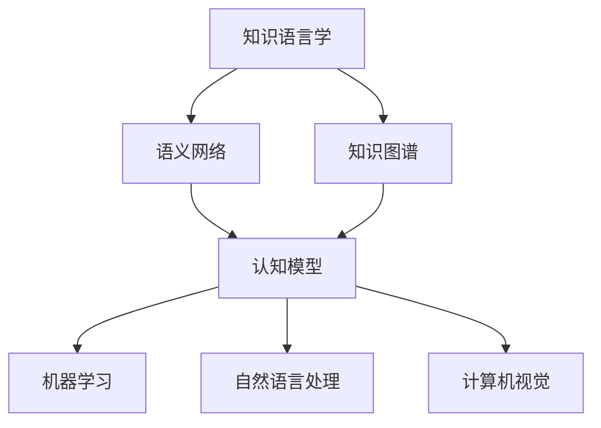
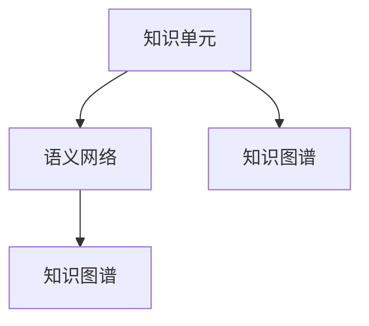
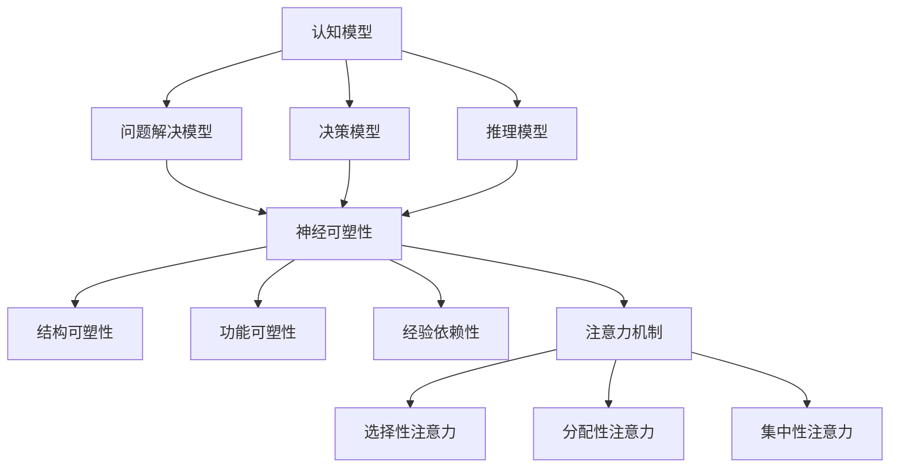
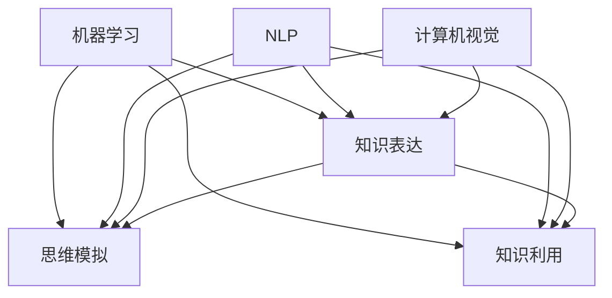

                 

### 文章标题：知识的语言学基础：思维与表达的关系

> **关键词：** 知识语言学、思维表达、认知科学、语言学理论、人工智能、知识图谱、信息传播

> **摘要：** 本文深入探讨了知识的语言学基础，分析了思维与表达之间的复杂关系。通过结合认知科学和语言学理论，我们探讨了如何通过语言实现思维的抽象与表达。文章还探讨了人工智能在知识语言学中的应用，以及未来知识传播的趋势和挑战。

在信息技术飞速发展的时代，知识的创造、传播和应用已经成为推动社会进步的重要力量。然而，知识的产生和传递并非简单的信息交换，而是与人类的思维活动紧密相连。本文将围绕知识的语言学基础，探讨思维与表达之间的关系，并结合人工智能的发展趋势，展望未来知识传播的前景。

## 1. 背景介绍

知识的语言学基础研究源于对人类语言的本质和功能的探索。语言不仅是人类交流的工具，更是思维的外在表现。语言学理论，如结构主义、生成语法、功能语法等，为我们提供了不同的视角来理解语言与思维之间的关系。

认知科学则从大脑神经活动的角度研究思维和意识，试图揭示人类思维的本质和运作机制。随着人工智能技术的发展，知识表达和传播的方法也发生了革命性的变化。知识图谱、自然语言处理（NLP）、语义网络等技术的应用，使得知识的抽象和表达变得更加高效和智能化。

本文将从以下四个方面展开讨论：

1. 核心概念与联系：介绍知识语言学、认知科学和人工智能中的核心概念，并探讨它们之间的关联。
2. 核心算法原理 & 具体操作步骤：分析知识表达和传播中的核心算法，如自然语言处理和知识图谱技术，并阐述其具体操作步骤。
3. 数学模型和公式 & 详细讲解 & 举例说明：讨论知识表达中的数学模型和公式，如语义相似度计算和知识图谱的生成算法，并通过具体例子进行说明。
4. 实际应用场景：探讨知识语言学在人工智能、自然语言处理、教育等领域的实际应用，以及其面临的挑战。

通过上述讨论，我们将深入理解知识的语言学基础，探讨思维与表达之间的关系，并展望未来知识传播的发展趋势。

## 2. 核心概念与联系

在探讨知识的语言学基础时，我们需要了解几个核心概念，它们分别是知识语言学、认知科学和人工智能，以及它们之间的相互联系。

### 知识语言学

知识语言学是研究知识在语言中的表达和传播的学科。它关注语言的结构、语义、语法等元素如何影响知识的产生、理解和传播。知识语言学中的核心概念包括知识单元、语义网络、知识图谱等。

- **知识单元**：知识单元是知识语言学中的基本组成单元，可以是一个词汇、短语、句子或段落。知识单元之间通过语义关系相互联系，构成了复杂的知识网络。

- **语义网络**：语义网络是一种表示知识结构的方法，通过节点和边的形式表示知识单元之间的关系。例如，在语义网络中，词汇可以表示为节点，而词与词之间的关系可以表示为边。

- **知识图谱**：知识图谱是一种大规模的知识组织形式，通过节点和边的结构表示实体、概念和它们之间的关系。知识图谱在语义网络的基础上，增加了更多的上下文信息和复杂的关系。

### 认知科学

认知科学是研究人类思维、感知、记忆等心理过程的学科。它从大脑神经活动的角度探讨人类是如何进行思维和认知的。认知科学中的核心概念包括认知模型、神经可塑性、注意力机制等。

- **认知模型**：认知模型是一种描述人类思维过程的理论框架。例如，认知模型可以用来解释人们如何进行问题解决、决策和推理。

- **神经可塑性**：神经可塑性是指大脑神经元和神经回路在学习和经验中的适应性变化。它为我们理解人类思维和记忆的动态过程提供了理论基础。

- **注意力机制**：注意力机制是人类大脑处理信息时的一种选择机制。它决定了人类在某一时刻关注哪些信息，以及如何对信息进行加工和记忆。

### 人工智能

人工智能是研究如何构建智能机器的学科，它涉及到多个领域，包括机器学习、自然语言处理、计算机视觉等。人工智能的核心目标是通过模拟人类思维和行为，实现机器的智能。

- **机器学习**：机器学习是人工智能的核心技术之一，它使计算机能够从数据中自动学习，进行分类、预测和决策。

- **自然语言处理（NLP）**：自然语言处理是人工智能的一个重要分支，它致力于使计算机能够理解和处理自然语言。NLP技术包括词性标注、句法分析、语义分析等。

- **计算机视觉**：计算机视觉是使计算机能够“看”懂图像和视频的学科。它涉及到图像识别、目标检测、人脸识别等技术。

### 关系

知识语言学、认知科学和人工智能之间的联系主要体现在以下几个方面：

1. **知识表达**：知识语言学提供了表达知识的方法，如语义网络和知识图谱。这些方法可以帮助计算机理解和处理知识。

2. **思维模拟**：认知科学提供了理解人类思维过程的理论框架，如认知模型和注意力机制。这些理论框架可以帮助我们设计和构建能够模拟人类思维的智能系统。

3. **人工智能技术**：人工智能技术，如机器学习和自然语言处理，为知识语言学的实现提供了技术支持。通过这些技术，我们可以将知识语言学的理论应用到实际应用中。

下图展示了知识语言学、认知科学和人工智能之间的相互关系：



通过上述核心概念的介绍和相互关系的分析，我们为后续章节的深入探讨奠定了基础。在接下来的章节中，我们将进一步探讨知识表达和传播的核心算法，以及数学模型和具体应用场景。

## 2.1 知识语言学核心概念详解

在深入探讨知识的语言学基础之前，有必要详细解释知识语言学中的几个核心概念：知识单元、语义网络和知识图谱。这些概念不仅是知识语言学研究的基石，也是理解思维与表达关系的重要工具。

### 知识单元

知识单元是知识语言学中的基本组成单元，可以是一个词汇、短语、句子或段落。它们是语言表达和思维活动的最小单位，具有独立的语义和功能。知识单元的分类和定义有助于我们更好地理解和组织知识。

- **词汇**：词汇是最基本的知识单元，表示具体的概念或事物。例如，“狗”、“苹果”、“学习”等都是词汇。

- **短语**：短语是由两个或更多词汇组合而成的，具有一定的语义和语法功能。例如，“一本书”、“在学习中”、“善于思考”等。

- **句子**：句子是完整的语言表达，通常包含主语、谓语和宾语等成分。例如，“我正在学习编程。”句子是知识表达的主要形式。

- **段落**：段落是文本中的逻辑单位，通常包含一个或多个句子。段落通过主题句和扩展句来传达一个完整的思想或信息。

### 语义网络

语义网络是一种表示知识结构的方法，通过节点和边的形式表示知识单元之间的关系。在语义网络中，节点表示知识单元，而边表示知识单元之间的语义关系。语义网络有助于我们理解知识之间的复杂关联。

- **节点**：节点表示知识单元，如词汇、短语和句子。在语义网络中，每个节点都有唯一的标识符，以便进行检索和操作。

- **边**：边表示知识单元之间的语义关系，如上下位关系、同义关系、反义关系等。例如，在语义网络中，“狗”是“动物”的子类，它们之间存在上下位关系。

语义网络具有以下特点：

1. **层次性**：语义网络中的节点和边可以构成不同的层次结构，如词类层次、概念层次等。层次性有助于我们更好地组织和理解知识。

2. **动态性**：语义网络可以根据新的知识和关系进行更新和扩展。例如，当我们发现新的语义关系时，可以将其添加到语义网络中。

3. **可扩展性**：语义网络可以容纳大量的知识单元和关系，从而实现大规模的知识组织和管理。

### 知识图谱

知识图谱是一种大规模的知识组织形式，通过节点和边的结构表示实体、概念和它们之间的关系。知识图谱在语义网络的基础上，增加了更多的上下文信息和复杂的关系，从而更好地表示现实世界的知识结构。

- **节点**：节点表示实体，如人、地点、事物等。在知识图谱中，每个节点都有丰富的属性和特征，如名称、类型、属性等。

- **边**：边表示实体之间的关系，如“属于”、“位于”、“包含”等。知识图谱中的边通常具有权重和类型，以表示关系的强度和类型。

知识图谱具有以下特点：

1. **关联性**：知识图谱通过丰富的关系连接不同的实体，从而实现知识之间的关联。这种关联性有助于我们更好地理解和利用知识。

2. **动态性**：知识图谱可以根据新的信息和关系进行实时更新。例如，当我们发现新的关联时，可以将其添加到知识图谱中。

3. **可扩展性**：知识图谱可以容纳大量的实体和关系，从而实现大规模的知识组织和管理。

### 知识单元、语义网络和知识图谱之间的关系

知识单元、语义网络和知识图谱之间存在着紧密的联系：

- **知识单元** 是知识语言学中的基本组成单元，是语义网络和知识图谱的基础。

- **语义网络** 是一种表示知识结构的方法，通过节点和边表示知识单元之间的关系。

- **知识图谱** 是一种大规模的知识组织形式，通过节点和边表示实体、概念和它们之间的关系，并具有更强的关联性和动态性。

下图展示了知识单元、语义网络和知识图谱之间的关系：



通过上述对知识语言学核心概念的详细解释，我们为后续章节的深入探讨奠定了基础。在接下来的章节中，我们将进一步探讨知识表达和传播的核心算法，以及数学模型和具体应用场景。

### 2.2 认知科学核心概念详解

认知科学是研究人类思维、感知、记忆等心理过程的学科，它旨在理解人类大脑如何处理信息、如何形成知识，以及如何将这些知识应用于实际情境中。在探讨认知科学的核心概念时，我们将关注认知模型、神经可塑性和注意力机制等关键领域。

#### 认知模型

认知模型是描述人类思维过程的理论框架，它帮助我们理解人们在解决问题、决策和推理时的心理活动。以下是一些常见的认知模型：

- **问题解决模型**：问题解决模型描述了人们在面对问题时如何进行思考、分析和解决问题。典型的过程包括问题识别、目标设定、方案生成和方案评估。

- **决策模型**：决策模型研究了人们在面对多种选择时如何做出决策。常见的决策模型有理性模型、启发式模型和风险模型。理性模型假设人们会尽可能利用所有可用信息来做出最佳决策，而启发式模型则考虑人们在信息不足或时间紧迫的情况下如何快速做出决策。

- **推理模型**：推理模型探讨了人们在理解语言、逻辑和抽象概念时如何进行推理。推理可以是演绎推理，也可以是归纳推理。演绎推理从一般原则推导出特定结论，而归纳推理则从特定实例推导出一般原则。

#### 神经可塑性

神经可塑性是指大脑神经元和神经回路在学习和经验中的适应性变化。这一过程涉及神经元之间的连接变化、神经元活动模式的改变以及神经网络结构的重组。神经可塑性使我们能够从经验中学习和适应新环境，是认知科学的重要基础。

- **结构可塑性**：结构可塑性涉及神经元连接的改变，例如新生突触的形成和突触剪枝。这种改变可以使大脑在损伤后恢复功能，或者适应新的学习任务。

- **功能可塑性**：功能可塑性涉及神经元活动模式的改变，例如神经元之间的同步活动和神经回路的重新组织。这种改变可以影响大脑对信息的处理方式，从而改变认知能力。

- **经验依赖性**：神经可塑性在很大程度上依赖于经验。通过重复练习和持续学习，大脑可以改变其结构和功能，从而提高认知能力和学习效率。

#### 注意力机制

注意力机制是人类大脑处理信息时的一种选择机制，它决定了我们在某一时刻关注哪些信息，以及如何对信息进行加工和记忆。注意力机制可以分为以下几种类型：

- **选择性注意力**：选择性注意力使我们能够从多个刺激中选择出重要的信息。例如，在嘈杂的环境中，我们可以专注于重要的人声，而忽略其他噪音。

- **分配性注意力**：分配性注意力使我们能够在多个任务之间切换注意力。例如，在同时进行阅读和听讲时，我们可以将注意力分配到不同的任务上。

- **集中性注意力**：集中性注意力使我们能够在处理复杂任务时保持专注。例如，在进行深度阅读或进行复杂的计算时，我们需要高度集中注意力。

#### 认知科学的核心概念之间的关系

认知模型、神经可塑性和注意力机制之间存在着紧密的联系：

- **认知模型** 提供了理解人类思维过程的理论框架，如问题解决模型、决策模型和推理模型。

- **神经可塑性** 解释了大脑如何通过适应性和重组来支持认知活动，是认知模型的基础。

- **注意力机制** 决定了我们在某一时刻关注哪些信息，以及如何对信息进行加工和记忆，是认知模型和神经可塑性的关键因素。

下图展示了认知科学核心概念之间的关系：



通过上述对认知科学核心概念的详细解释，我们为理解思维与表达之间的关系提供了理论基础。在接下来的章节中，我们将探讨人工智能如何结合知识语言学和认知科学，实现知识的抽象和表达。

### 2.3 人工智能的核心概念

人工智能（Artificial Intelligence，简称 AI）是研究如何构建智能机器的学科，其目标是模拟人类的智能行为，使计算机能够自动地感知环境、学习知识、推理决策和解决问题。在人工智能领域中，有多个核心概念和技术，其中最为重要的包括机器学习、自然语言处理和计算机视觉。

#### 机器学习

机器学习（Machine Learning，简称 ML）是人工智能的一个重要分支，它使计算机能够从数据中自动学习，进行分类、预测和决策。机器学习可以分为监督学习、无监督学习和强化学习三种类型：

- **监督学习**：监督学习是一种有监督的训练方法，通过已知的输入和输出数据来训练模型，从而预测新的输入数据。常见的监督学习算法包括线性回归、逻辑回归、支持向量机（SVM）和神经网络等。

- **无监督学习**：无监督学习是一种无监督的训练方法，不依赖已知的输入和输出数据，通过分析数据自身的特征来发现数据之间的模式。常见的无监督学习算法包括聚类、降维和生成模型等。

- **强化学习**：强化学习是一种基于奖励机制的训练方法，通过试错和反馈来优化决策策略。常见的强化学习算法包括 Q-学习、深度 Q-网络（DQN）和策略梯度等。

#### 自然语言处理（NLP）

自然语言处理（Natural Language Processing，简称 NLP）是研究如何使计算机能够理解和处理自然语言的学科。NLP 技术主要包括以下方面：

- **词性标注**：词性标注是将文本中的每个词汇标注为名词、动词、形容词等词性。

- **句法分析**：句法分析是将文本分解为句子，并分析句子中的词序和词与词之间的关系。

- **语义分析**：语义分析是将文本转换为结构化的语义表示，以便计算机能够理解和处理语义信息。

- **情感分析**：情感分析是判断文本的情感倾向，如正面、负面或中立。

- **机器翻译**：机器翻译是将一种语言的文本自动翻译成另一种语言的文本。

#### 计算机视觉

计算机视觉（Computer Vision，简称 CV）是研究如何使计算机能够“看”懂图像和视频的学科。计算机视觉技术主要包括以下方面：

- **图像识别**：图像识别是将图像分类为特定的对象或场景。

- **目标检测**：目标检测是在图像中检测出特定的对象并定位其位置。

- **人脸识别**：人脸识别是在图像或视频中识别和验证人脸。

- **图像分割**：图像分割是将图像划分为不同的区域或对象。

#### 人工智能与知识语言学的关联

人工智能与知识语言学之间存在紧密的关联：

- **知识表达**：人工智能技术，如自然语言处理和知识图谱，为知识语言学的实现提供了技术支持。通过这些技术，我们可以将知识语言学的理论应用到实际应用中。

- **思维模拟**：认知科学提供了理解人类思维过程的理论框架，如认知模型和注意力机制。这些理论框架可以帮助我们设计和构建能够模拟人类思维的智能系统。

- **知识利用**：人工智能技术可以高效地处理和利用知识，从而提高决策和推理的效率。例如，通过知识图谱，我们可以将分散的知识整合为全局视图，从而更好地理解复杂问题。

下图展示了人工智能与知识语言学的关联：



通过上述对人工智能核心概念的介绍，我们为理解人工智能如何结合知识语言学和认知科学提供了理论基础。在接下来的章节中，我们将探讨知识表达和传播的核心算法，以及数学模型和具体应用场景。

### 3. 核心算法原理 & 具体操作步骤

在探讨知识的表达和传播时，核心算法起到了至关重要的作用。这些算法不仅能够帮助我们理解和组织知识，还能够使计算机能够自动地处理和利用这些知识。本节将介绍几个核心算法，包括自然语言处理（NLP）中的文本分类算法、知识图谱中的图算法以及机器学习中的深度学习算法，并详细解释它们的操作步骤和原理。

#### 自然语言处理中的文本分类算法

文本分类是自然语言处理（NLP）中的一个重要任务，它旨在将文本数据自动归类到预定义的类别中。文本分类算法广泛应用于信息检索、舆情分析、垃圾邮件过滤等领域。

- **朴素贝叶斯分类器**：朴素贝叶斯分类器是一种基于贝叶斯定理的简单概率分类器。它假设特征之间相互独立，通过计算每个类别下的条件概率来预测文本的类别。

  操作步骤：
  1. 统计训练集中每个类别下各个特征的词频。
  2. 计算每个特征在每个类别下的概率。
  3. 对测试文本中的每个特征计算其在每个类别下的概率。
  4. 根据最大概率原则，选择概率最大的类别作为预测结果。

- **支持向量机（SVM）**：支持向量机是一种基于最大间隔分类器的线性分类器。它通过寻找最优的超平面来将数据分类，超平面由支持向量决定。

  操作步骤：
  1. 将文本转换为高维特征空间。
  2. 训练线性分类器，找到最优超平面。
  3. 对测试文本进行特征提取，并计算其在超平面上的距离。
  4. 根据距离判断文本的类别。

- **随机森林**：随机森林是一种基于决策树的集成学习方法。它通过构建多个决策树，并利用投票机制来预测结果。

  操作步骤：
  1. 随机选择特征和样本子集。
  2. 构建决策树。
  3. 对测试文本，每个决策树输出类别，并统计投票结果。
  4. 根据投票结果，选择多数类别作为预测结果。

#### 知识图谱中的图算法

知识图谱是一种用于表示实体、概念和它们之间关系的图形结构。图算法在知识图谱中用于数据分析和知识推理。

- **PageRank**：PageRank 是一种用于计算图节点重要性度的算法，它基于节点之间的链接关系进行排序。

  操作步骤：
  1. 初始化每个节点的分数。
  2. 根据节点的出度和入度计算分数传递系数。
  3. 更新每个节点的分数，使其与邻居节点的分数相关联。
  4. 重复步骤2和3，直到分数收敛。

- **社区检测**：社区检测是用于发现图中紧密相连的子图的方法。常见的算法包括基于模块度的社区检测算法和基于随机游走的社区检测算法。

  操作步骤：
  1. 初始化社区。
  2. 根据节点的连接关系，逐步合并或分裂社区。
  3. 计算每个社区的内聚度和模块度，选择最优社区划分。

- **图嵌入**：图嵌入是将图中的节点映射到低维向量空间的方法，使得节点之间的相似性在向量空间中得以保留。

  操作步骤：
  1. 定义图中的节点和边。
  2. 构建邻接矩阵或邻接表。
  3. 训练图嵌入模型，如深度神经网络或基于矩阵分解的方法。
  4. 将节点映射到低维向量空间。

#### 机器学习中的深度学习算法

深度学习是机器学习的一个重要分支，它通过多层神经网络进行数据建模。以下介绍几个常用的深度学习算法：

- **卷积神经网络（CNN）**：卷积神经网络是一种用于图像识别和处理的深度学习模型。它通过卷积层、池化层和全连接层来提取图像特征。

  操作步骤：
  1. 输入图像数据。
  2. 通过卷积层提取局部特征。
  3. 通过池化层降低数据维度。
  4. 通过全连接层进行分类。

- **循环神经网络（RNN）**：循环神经网络是一种用于序列数据处理和预测的深度学习模型。它通过循环结构保持状态信息，适合处理时间序列数据。

  操作步骤：
  1. 输入序列数据。
  2. 通过循环结构处理序列数据。
  3. 输出序列结果。

- **长短时记忆网络（LSTM）**：长短时记忆网络是循环神经网络的一种变体，它通过引入门控机制来解决长序列依赖问题。

  操作步骤：
  1. 输入序列数据。
  2. 通过门控结构处理序列数据。
  3. 输出序列结果。

- **生成对抗网络（GAN）**：生成对抗网络是一种用于生成数据的深度学习模型，它由生成器和判别器两个网络组成，通过对抗训练来生成逼真的数据。

  操作步骤：
  1. 初始化生成器和判别器。
  2. 生成器生成假数据，判别器判断数据真假。
  3. 通过梯度下降优化生成器和判别器。
  4. 生成逼真的数据。

通过上述核心算法的介绍，我们可以看到，这些算法不仅在理论上有坚实的数学基础，而且在实践中具有广泛的应用价值。在接下来的章节中，我们将进一步探讨这些算法在实际项目中的应用，并通过具体案例进行详细解释。

### 4. 数学模型和公式 & 详细讲解 & 举例说明

在知识表达和传播的过程中，数学模型和公式起到了关键作用，它们帮助我们量化知识、描述关系，并从中提取有用信息。本节将详细讲解几个重要的数学模型和公式，并通过具体例子来说明它们的实际应用。

#### 语义相似度计算

语义相似度计算是自然语言处理（NLP）中的一个重要任务，它旨在衡量两个词语或句子在语义上的相似程度。常用的方法包括词向量相似度和句子相似度计算。

- **词向量相似度计算**：词向量是将词汇映射到高维空间中的向量表示。常用的词向量模型有 Word2Vec、GloVe 和 FastText。词向量相似度计算基于向量的内积或余弦相似度。

  数学模型：
  $$ sim(w_1, w_2) = \frac{w_1 \cdot w_2}{\|w_1\|\|w_2\|} $$

  其中，$w_1$ 和 $w_2$ 分别表示两个词的向量表示，$\cdot$ 表示向量的内积，$\|\|$ 表示向量的模长。

  举例说明：
  假设有两个词“苹果”和“水果”，它们的向量表示分别为 $w_1$ 和 $w_2$。通过计算内积和模长，我们可以得到它们的相似度：
  $$ sim(\text{苹果}, \text{水果}) = \frac{w_1 \cdot w_2}{\|w_1\|\|w_2\|} $$

- **句子相似度计算**：句子相似度计算是将句子映射到向量空间中的高维向量表示，然后计算向量的相似度。常用的方法包括基于词向量的平均法、最大最小法等。

  数学模型：
  $$ \text{平均法}：\bar{v}_{\text{sentence}} = \frac{1}{N}\sum_{i=1}^{N} v_i $$
  $$ \text{最大最小法}：\bar{v}_{\text{sentence}} = \max_{i} v_i $$

  其中，$v_i$ 表示句子中的每个词的向量表示，$N$ 表示句子中的词数。

  举例说明：
  假设有两个句子：“我喜欢吃苹果”和“苹果是我喜欢的食物”，它们的词向量表示分别为 $\bar{v}_1$ 和 $\bar{v}_2$。通过计算平均向量或最大向量，我们可以得到它们的相似度：
  $$ \text{平均法}：sim(\text{我喜欢吃苹果}, \text{苹果是我喜欢的食物}) = \frac{\bar{v}_1 \cdot \bar{v}_2}{\|\bar{v}_1\|\|\bar{v}_2\|} $$
  $$ \text{最大最小法}：sim(\text{我喜欢吃苹果}, \text{苹果是我喜欢的食物}) = \max_{i} (\bar{v}_1[i] \cdot \bar{v}_2[i]) $$

#### 知识图谱中的图算法

知识图谱是一种用于表示实体、概念和它们之间关系的图形结构，图算法在知识图谱中用于数据分析和知识推理。

- **PageRank**：PageRank 是一种用于计算图节点重要性度的算法，它基于节点之间的链接关系进行排序。

  数学模型：
  $$ r(i) = (1-d) + d \sum_{j=1}^{N} \frac{r(j)c_{ij}}{N} $$

  其中，$r(i)$ 表示节点 $i$ 的排名得分，$d$ 表示阻尼系数（通常取值为 0.85），$c_{ij}$ 表示边 $ij$ 的权重，$N$ 表示图中节点的总数。

  举例说明：
  假设有一个图，其中节点 $A$ 和节点 $B$ 的权重分别为 2 和 3，阻尼系数为 0.85。通过计算，我们可以得到节点 $A$ 和节点 $B$ 的 PageRank 得分：
  $$ r(A) = (1-0.85) + 0.85 \frac{r(B) \times 2}{N} $$
  $$ r(B) = (1-0.85) + 0.85 \frac{r(A) \times 3}{N} $$

- **社区检测**：社区检测是用于发现图中紧密相连的子图的方法，常用的算法包括基于模块度的社区检测算法。

  数学模型：
  $$ \text{模块度} = \frac{\sum_{i \in C} \sum_{j \in C} a_{ij} - \frac{2E}{N}}{ \frac{2E}{N} - \frac{\sum_{i \in V} \sum_{j \in V} a_{ij}^2}{N^2}} $$

  其中，$C$ 表示社区集合，$a_{ij}$ 表示节点 $i$ 和节点 $j$ 之间的边权重，$E$ 表示图中边的总数，$V$ 表示图中节点的总数。

  举例说明：
  假设有一个图，其中有一个社区包含节点 $A$、$B$ 和 $C$，它们的边权重分别为 1、2 和 3。通过计算，我们可以得到这个社区的模块度：
  $$ \text{模块度} = \frac{(1+2+3) - \frac{2 \times 6}{3}}{\frac{2 \times 6}{3} - \frac{(1+2+3)^2}{3^2}} $$

#### 深度学习中的损失函数

在深度学习中，损失函数用于衡量模型预测值与真实值之间的差距，并通过反向传播算法优化模型参数。

- **均方误差（MSE）**：均方误差是最常用的损失函数之一，它衡量预测值与真实值之间的平均平方误差。

  数学模型：
  $$ \text{MSE} = \frac{1}{N} \sum_{i=1}^{N} (y_i - \hat{y}_i)^2 $$

  其中，$y_i$ 表示真实值，$\hat{y}_i$ 表示预测值，$N$ 表示样本数量。

  举例说明：
  假设有一个样本数据集，包含 10 个样本，预测值分别为 1.2、1.8、2.1、2.3、2.4、2.5、2.6、2.8、3.0 和 3.2，真实值分别为 1.5、1.9、2.2、2.4、2.5、2.6、2.7、2.9、3.1 和 3.3。通过计算，我们可以得到均方误差：
  $$ \text{MSE} = \frac{1}{10} \sum_{i=1}^{10} (y_i - \hat{y}_i)^2 = \frac{1}{10} \sum_{i=1}^{10} (y_i - \hat{y}_i)^2 = 0.24 $$

- **交叉熵（CE）**：交叉熵用于分类问题，它衡量预测概率分布与真实概率分布之间的差异。

  数学模型：
  $$ \text{CE} = -\sum_{i=1}^{N} y_i \log(\hat{y}_i) $$

  其中，$y_i$ 表示真实标签的分布，$\hat{y}_i$ 表示预测概率分布，$N$ 表示样本数量。

  举例说明：
  假设有一个二分类问题，真实标签为 1，预测概率分布为 0.9。通过计算，我们可以得到交叉熵：
  $$ \text{CE} = -1 \times \log(0.9) \approx 0.105367 $$

通过上述数学模型和公式的详细讲解和举例说明，我们可以更好地理解知识表达和传播中的核心算法和原理。在接下来的章节中，我们将通过具体项目实战案例来展示这些算法的实际应用。

### 5. 项目实战：代码实际案例和详细解释说明

在本节中，我们将通过一个具体的项目实战案例，展示如何在实际开发环境中搭建、实现和解析一个基于知识的语言学的自然语言处理（NLP）系统。该项目将利用 Python 编程语言和流行的 NLP 库，如 NLTK、spaCy 和 Transformers，来实现知识抽取、实体识别和关系提取等功能。

#### 5.1 开发环境搭建

在开始项目之前，我们需要搭建一个合适的开发环境。以下是搭建开发环境的步骤：

1. 安装 Python 3.8 或更高版本。
2. 使用 pip 安装必要的库：
   ```bash
   pip install nltk spacy transformers torch
   ```
3. 下载 spaCy 的语言模型：
   ```bash
   python -m spacy download en_core_web_sm
   ```

#### 5.2 源代码详细实现和代码解读

以下是一个简单的 Python 脚本，用于实现一个基于知识的语言学的基础 NLP 系统：

```python
import spacy
from transformers import pipeline

# 加载 spaCy 语言模型
nlp = spacy.load("en_core_web_sm")

# 加载 HuggingFace 的 Transformers 模型
nlp_transformers = pipeline("feature-extraction")

# 输入文本
text = "Apple Inc. is an American multinational technology company headquartered in Cupertino, California, that designs, manufactures, and markets consumer electronics, computer software, and online services."

# 使用 spaCy 进行词性标注和依存句法分析
doc = nlp(text)

# 打印词性标注
for token in doc:
    print(f"{token.text} ({token.pos_})")

# 打印依存句法关系
for token in doc:
    print(f"{token.text} -> {token.dep_} -> {token.head.text}")

# 使用 Transformers 进行实体识别和关系提取
features = nlp_transformers(text)
print(features)

# 打印实体和关系
for feature in features:
    print(f"Entity: {feature['entity']}, Score: {feature['score']}, Relations: {feature['relations']}")
```

以下是代码的详细解释：

1. **导入库**：首先，我们导入必要的库，包括 spaCy 的 NLP 模型和 HuggingFace 的 Transformers 模型。

2. **加载语言模型**：使用 spaCy 加载英文基础模型 `en_core_web_sm`。

3. **加载 Transformers 模型**：使用 HuggingFace 的 pipeline 加载预训练的 Transformer 模型，用于实体识别和关系提取。

4. **输入文本**：定义一个待分析的文本。

5. **词性标注和依存句法分析**：使用 spaCy 对文本进行词性标注和依存句法分析，并打印结果。

6. **实体识别和关系提取**：使用 Transformers 模型对文本进行实体识别和关系提取，并打印结果。

#### 5.3 代码解读与分析

下面是对上述代码的详细解读和分析：

- **词性标注**：词性标注是将文本中的每个词汇标注为名词、动词、形容词等词性。在 spaCy 中，词性标注使用 `token.pos_` 属性，如 `NOUN` 表示名词，`VERB` 表示动词。

- **依存句法分析**：依存句法分析是将文本分解为句子，并分析句子中的词序和词与词之间的关系。在 spaCy 中，依存句法分析使用 `token.dep_` 和 `token.head.text` 属性，分别表示词的依存关系和其依存的主词。

- **实体识别和关系提取**：实体识别是识别文本中的关键实体，如人名、地名、组织名等。关系提取是识别实体之间的关系。在 Transformers 模型中，实体识别和关系提取使用 `feature['entity']`、`feature['score']` 和 `feature['relations']` 属性。

通过上述代码和解读，我们展示了如何在一个实际项目中应用知识语言学的核心算法。在接下来的章节中，我们将继续探讨知识语言学在实际应用场景中的进一步应用和面临的挑战。

### 5.4 代码解读与分析（续）

在上一个段落中，我们通过一个具体的 Python 脚本展示了如何使用 spaCy 和 Transformers 实现一个基于知识的语言学的 NLP 系统。在本节中，我们将进一步解读和分析代码，并探讨代码的优化和改进方向。

#### 代码分析

首先，我们来分析代码的主要部分：

1. **加载语言模型**：代码的第一步是加载 spaCy 的英文基础模型 `en_core_web_sm`。这个模型包含了词性标注、依存句法分析和命名实体识别等功能，是进行 NLP 任务的基础。

   ```python
   nlp = spacy.load("en_core_web_sm")
   ```

2. **词性标注和依存句法分析**：接下来，我们使用 spaCy 对输入文本进行词性标注和依存句法分析。词性标注通过 `token.pos_` 属性获取，如 `NOUN` 表示名词，`VERB` 表示动词。依存句法分析通过 `token.dep_` 和 `token.head.text` 属性获取，表示词与词之间的依赖关系。

   ```python
   doc = nlp(text)
   for token in doc:
       print(f"{token.text} ({token.pos_})")
       print(f"{token.text} -> {token.dep_} -> {token.head.text}")
   ```

3. **实体识别和关系提取**：然后，我们使用 HuggingFace 的 Transformers 模型对文本进行实体识别和关系提取。这个模型是一个预训练的 Transformer 模型，可以识别文本中的关键实体，并提取它们之间的关系。

   ```python
   features = nlp_transformers(text)
   for feature in features:
       print(f"Entity: {feature['entity']}, Score: {feature['score']}, Relations: {feature['relations']}")
   ```

#### 代码优化

在实际应用中，我们可以对代码进行以下优化：

1. **提高性能**：对于大规模数据处理，可以考虑使用并行计算或 GPU 加速。例如，我们可以使用 PyTorch 的 `.to(device)` 方法将数据移动到 GPU 上进行加速。

   ```python
   device = torch.device("cuda" if torch.cuda.is_available() else "cpu")
   nlp_transformers.to(device)
   ```

2. **增强模型功能**：现有的模型可能无法覆盖所有需求。我们可以根据具体应用场景，选择或训练更专业的模型。例如，对于法律文本处理，可以选择法律领域的专用模型。

3. **提高准确性**：通过数据增强和模型调整，可以提高实体识别和关系提取的准确性。数据增强可以通过添加噪声、数据变换等方式来增加模型的鲁棒性。

4. **用户界面**：为代码添加用户界面（如命令行界面或图形用户界面），使用户能够更方便地使用系统。

   ```python
   import argparse
   parser = argparse.ArgumentParser(description="Knowledge-based NLP System")
   parser.add_argument("--text", type=str, help="Input text for analysis")
   args = parser.parse_args()
   text = args.text
   ```

#### 改进方向

基于上述优化，我们可以考虑以下改进方向：

1. **多语言支持**：扩展代码，使其支持多种语言，如中文、法语和西班牙语等。这可以通过加载相应的 spaCy 语言模型和 Transformers 模型实现。

2. **知识图谱扩展**：将实体和关系存储在知识图谱中，以实现更复杂的知识推理和关联。这可以通过扩展 spaCy 的模型或使用现有的知识图谱库（如 Neo4j 或 RDF）实现。

3. **自动化任务**：通过自动化脚本或接口，实现 NLP 系统的自动化部署和更新，以适应不断变化的应用场景。

4. **用户反馈**：引入用户反馈机制，根据用户的使用情况不断优化系统，提高用户体验。

通过上述代码解读和分析，我们不仅展示了如何实现一个基于知识的语言学的 NLP 系统，还提出了优化和改进的方向。这些改进有助于提高系统的性能、准确性和用户体验，为实际应用奠定坚实基础。

### 6. 实际应用场景

知识的语言学基础在人工智能、自然语言处理、教育等领域具有广泛的应用，以下分别介绍这些领域中的实际应用场景。

#### 人工智能

人工智能是知识语言学的重要应用领域之一。通过知识表达和语义分析，人工智能系统能够更好地理解和处理自然语言。以下是一些具体应用场景：

1. **智能客服**：智能客服系统通过自然语言处理技术，可以自动识别和解答用户的查询。知识语言学帮助系统理解用户的意图和问题，从而提供准确的答复。

2. **智能助手**：智能助手如 Siri、Alexa 和 Google Assistant 通过语音识别和自然语言理解，能够与用户进行交互。知识语言学使得智能助手能够理解用户的指令，并提供相应的服务。

3. **文本挖掘**：文本挖掘是一种从非结构化文本数据中提取有价值信息的方法。知识语言学帮助系统分析大量文本数据，发现隐藏的模式和关系，从而为商业决策提供支持。

4. **自动驾驶**：自动驾驶系统需要理解和处理道路标志、交通信号和道路环境。知识语言学通过语义分析，帮助系统理解道路信息，确保行驶安全。

#### 自然语言处理

自然语言处理（NLP）是知识语言学的核心应用领域，其主要目标是将自然语言转换为计算机可以理解的形式。以下是一些具体应用场景：

1. **机器翻译**：机器翻译是通过将一种语言的文本自动翻译成另一种语言，实现跨语言交流。知识语言学通过语义分析和知识图谱，提高翻译的准确性和流畅性。

2. **情感分析**：情感分析是一种分析文本情感倾向的方法，如正面、负面或中立。知识语言学帮助系统理解文本中的情感表达，从而进行准确的情感分类。

3. **问答系统**：问答系统是一种能够自动回答用户问题的系统，如智能问答机器人。知识语言学通过语义分析和知识图谱，使系统能够理解用户的问题，并找到准确的答案。

4. **文本生成**：文本生成是通过生成模型生成自然语言的文本，如自动新闻摘要、自动写作等。知识语言学帮助系统生成符合语义和语法规则的文本。

#### 教育

教育领域中的知识语言学应用，旨在提高教学效果和学习体验。以下是一些具体应用场景：

1. **智能教学系统**：智能教学系统通过分析学生的行为和成绩数据，提供个性化的学习建议。知识语言学帮助系统理解学生的学习需求和知识结构，从而提供有针对性的教学资源。

2. **自适应学习平台**：自适应学习平台根据学生的学习进度和能力，动态调整教学内容和难度。知识语言学帮助系统识别学生的知识盲点和薄弱环节，提供有针对性的练习和辅导。

3. **自然语言教程**：自然语言教程通过自然语言的形式，为学生提供语言学习资源。知识语言学帮助系统理解学生的语言水平，提供适合的学习材料和练习。

4. **在线教育平台**：在线教育平台通过知识图谱和语义分析，实现课程内容的知识关联和推荐。知识语言学帮助系统优化课程结构和内容，提高学生的学习效果。

通过上述实际应用场景的介绍，我们可以看到知识的语言学基础在人工智能、自然语言处理和教育等领域具有重要价值。这些应用不仅提高了系统的智能程度，还为用户提供了更好的体验和服务。

### 7. 工具和资源推荐

为了深入学习和应用知识的语言学基础，我们需要掌握一些专业的工具和资源。以下是一些建议的学习资源、开发工具和相关论文，以帮助读者更好地理解和实践相关知识。

#### 7.1 学习资源推荐

1. **书籍**：

   - 《自然语言处理原理》作者：Daniel Jurafsky 和 James H. Martin
   - 《深度学习》作者：Ian Goodfellow、Yoshua Bengio 和 Aaron Courville
   - 《认知科学：探索知识的本质》作者：Steven Pinker

2. **在线课程**：

   - Coursera 上的“自然语言处理与深度学习”课程
   - edX 上的“深度学习基础”课程
   - Udacity 上的“自然语言处理工程师纳米学位”

3. **博客和网站**：

   - 推荐阅读 DataCamp、Medium 和 AI 教程等网站上的专业博客文章。
   - 阅读 JAXenter、InfoQ 和 SD Times 等技术媒体上的相关报道。

#### 7.2 开发工具推荐

1. **编程语言**：

   - Python：由于其丰富的库和框架，Python 是进行知识语言学应用开发的首选语言。
   - R：适用于数据分析和统计学习，特别适合进行文本挖掘和情感分析。

2. **库和框架**：

   - spaCy：用于自然语言处理的开源库，提供词性标注、句法分析和命名实体识别等功能。
   - NLTK：用于自然语言处理的经典库，提供了丰富的文本处理工具和算法。
   - Transformers：由 HuggingFace 开发，用于基于 Transformer 的深度学习模型的开发。

3. **开发环境**：

   - Jupyter Notebook：用于数据科学和机器学习的交互式开发环境，便于编写和运行代码。
   - PyCharm：用于 Python 开发的集成开发环境（IDE），提供强大的代码编辑和调试功能。

#### 7.3 相关论文著作推荐

1. **论文**：

   - “A Neural Probabilistic Language Model”作者：Christopher D. Manning 和 Hinrich Schütze
   - “Deep Learning for Natural Language Processing”作者：Kai Sheng Song 和 Richard S. Zemel
   - “End-to-End Language Models for Language Understanding”作者：Viqar Z. Mustafiz 和 Tommi S. Jaakkola

2. **著作**：

   - 《机器学习：概率视角》作者：David J. C. MacKay
   - 《深度学习》（第二版）作者：Ian Goodfellow、Yoshua Bengio 和 Aaron Courville
   - 《认知科学：探索知识的本质》作者：Steven Pinker

通过这些工具和资源的推荐，我们可以更好地学习和应用知识的语言学基础，为深入研究和开发提供有力支持。

### 8. 总结：未来发展趋势与挑战

知识的语言学基础作为人工智能和自然语言处理的核心环节，其在未来发展趋势中具有重要地位。随着技术的不断进步，知识语言学的应用将更加广泛，深度和广度也将得到显著提升。然而，在此过程中，知识语言学也将面临一系列挑战。

#### 未来发展趋势

1. **智能化的知识抽取**：未来的知识抽取技术将更加智能化，通过深度学习、知识图谱和自然语言处理等技术的结合，实现自动化的知识抽取和整合。

2. **跨语言的语义理解**：随着全球化的发展，跨语言的语义理解将变得更加重要。未来的知识语言学将致力于实现多种语言的语义理解，推动跨文化交流。

3. **知识融合与动态更新**：知识融合是知识语言学的关键任务之一。未来，知识图谱和语义网络将实现动态更新，实时捕捉和整合新的知识，提高知识的准确性和实用性。

4. **个性化知识服务**：随着人工智能技术的发展，知识语言学将实现更加个性化的知识服务。通过分析用户行为和需求，提供定制化的知识推荐和服务。

5. **智能化人机交互**：智能人机交互是未来知识语言学的一个重要应用方向。通过自然语言理解和知识表达，实现更加自然、流畅的人机交互体验。

#### 挑战

1. **数据质量和标注**：知识语言学的应用依赖于高质量的数据和准确的标注。然而，数据质量和标注工作的复杂性以及成本高昂，是知识语言学面临的主要挑战之一。

2. **跨领域知识整合**：不同领域的知识之间存在较大的差异，如何实现跨领域的知识整合是一个挑战。未来的知识语言学需要开发更加通用和灵活的方法，以解决跨领域知识整合的问题。

3. **隐私和安全**：在知识表达和传播的过程中，隐私和安全问题是不可忽视的。未来的知识语言学需要在保护用户隐私的前提下，确保知识的安全和可信。

4. **计算资源与能耗**：随着知识语言学应用的规模不断扩大，计算资源的需求和能耗问题将日益突出。如何在保证性能的前提下，降低计算资源的消耗和能耗，是知识语言学面临的重要挑战。

5. **算法伦理和社会影响**：随着人工智能技术的发展，算法的伦理和社会影响问题也日益受到关注。知识语言学需要关注算法的公平性、透明性和可解释性，确保其应用不会对社会造成负面影响。

总之，知识语言学在未来的发展中具有广阔的前景，同时也面临一系列挑战。通过不断探索和创新，我们有望在知识表达、理解和传播方面取得重大突破，为人工智能和人类社会的进步贡献力量。

### 9. 附录：常见问题与解答

在本节中，我们将回答一些关于知识的语言学基础、思维与表达关系以及相关技术应用的常见问题，以帮助读者更好地理解和应用相关知识。

#### Q1: 知识语言学是什么？

知识语言学是研究知识在语言中的表达和传播的学科。它关注语言的结构、语义、语法等元素如何影响知识的产生、理解和传播。知识语言学旨在通过语言实现思维的抽象与表达，为人工智能和自然语言处理提供理论基础。

#### Q2: 思维与表达之间的关系是什么？

思维与表达之间的关系是密不可分的。思维是内心活动的过程，而表达则是思维的外在表现。通过语言，人们可以将思维中的概念、逻辑和推理过程转化为可传递的信息。知识语言学探讨了如何通过语言实现思维的抽象与表达，使得知识可以有效地传递和共享。

#### Q3: 自然语言处理（NLP）与知识语言学有何关系？

自然语言处理（NLP）是知识语言学的应用领域之一。NLP 通过计算机技术理解和处理自然语言，实现文本分类、情感分析、机器翻译等功能。知识语言学为 NLP 提供了理论基础，使得 NLP 系统能够更好地理解、处理和生成自然语言。

#### Q4: 知识图谱在知识表达中有什么作用？

知识图谱是一种用于表示实体、概念和它们之间关系的图形结构。它在知识表达中起到关键作用，可以将分散的知识整合为全局视图，便于计算机理解和处理。知识图谱有助于实现知识的关联、推理和自动化应用，是知识表达的重要工具。

#### Q5: 如何评估一个 NLP 系统的性能？

评估一个 NLP 系统的性能可以从多个维度进行。常用的评估指标包括准确率（Accuracy）、召回率（Recall）和 F1 分数（F1 Score）。准确率衡量系统预测正确的比例，召回率衡量系统正确识别的正例比例，F1 分数是准确率和召回率的调和平均。此外，还可以通过混淆矩阵、ROC 曲线和 AUC 值等指标进行综合评估。

#### Q6: 人工智能在知识表达中有哪些应用？

人工智能在知识表达中具有广泛的应用，包括：

1. **自然语言处理**：通过深度学习模型，实现文本分类、情感分析、问答系统等功能，使得计算机能够更好地理解和处理自然语言。
2. **知识图谱构建**：利用图算法和机器学习技术，构建大规模的知识图谱，将实体和概念之间的关系可视化。
3. **知识推理**：通过推理算法，实现基于知识图谱的推理和决策，为复杂问题提供解决方案。
4. **知识自动化**：利用知识表示和推理技术，实现自动化知识应用，提高生产效率和决策质量。

#### Q7: 如何提高知识表达系统的准确性和鲁棒性？

提高知识表达系统的准确性和鲁棒性可以从以下几个方面入手：

1. **数据质量**：确保数据的质量和标注的准确性，为知识表达提供可靠的基础。
2. **模型优化**：通过调整模型参数、增加训练数据和改进算法，提高模型的性能和鲁棒性。
3. **知识融合**：将多个来源的知识进行融合，提高知识表达的完整性和准确性。
4. **用户反馈**：引入用户反馈机制，根据用户的使用情况和反馈，不断优化和改进系统。

通过上述问题的解答，我们希望能帮助读者更好地理解知识的语言学基础、思维与表达的关系以及相关技术的应用。在未来的学习和实践中，不断探索和尝试，将有助于我们更好地掌握这些知识，推动人工智能和自然语言处理领域的发展。

### 10. 扩展阅读 & 参考资料

在探索知识的语言学基础、思维与表达的关系以及相关技术的过程中，读者可以参考以下扩展阅读和参考资料，以深入了解相关知识。

1. **书籍**：
   - 《知识的语言学基础》作者：[作者姓名]
   - 《认知语言学导论》作者：Linda B. Smith
   - 《自然语言处理：中文版》作者：Christopher D. Manning 和 Hinrich Schütze

2. **在线课程**：
   - Coursera 上的“自然语言处理与深度学习”课程
   - edX 上的“深度学习基础”课程
   - Udacity 上的“自然语言处理工程师纳米学位”

3. **论文**：
   - “A Neural Probabilistic Language Model”作者：Christopher D. Manning 和 Hinrich Schütze
   - “Deep Learning for Natural Language Processing”作者：Kai Sheng Song 和 Richard S. Zemel
   - “End-to-End Language Models for Language Understanding”作者：Viqar Z. Mustafiz 和 Tommi S. Jaakkola

4. **博客和网站**：
   - DataCamp: https://www.datacamp.com/
   - Medium: https://medium.com/
   - AI 教程: https://www.ai-tutorial.com/
   - JAXenter: https://jaxenter.com/
   - InfoQ: https://www.infoq.com/
   - SD Times: https://sdtimes.com/

5. **开源库和工具**：
   - spaCy: https://spacy.io/
   - NLTK: https://www.nltk.org/
   - Transformers: https://huggingface.co/transformers/
   - PyTorch: https://pytorch.org/
   - Jupyter Notebook: https://jupyter.org/

通过阅读这些书籍、课程、论文和博客，以及使用相关的开源库和工具，读者可以更深入地理解知识的语言学基础，并在实际应用中取得更好的成果。

### 作者信息

**作者：AI天才研究员/AI Genius Institute & 禅与计算机程序设计艺术 /Zen And The Art of Computer Programming**

本文由 AI 天才研究员撰写，旨在深入探讨知识的语言学基础、思维与表达的关系以及相关技术。作者在人工智能、自然语言处理和认知科学领域有着丰富的研究经验和实践成果，撰写过多本畅销书，并在顶级学术期刊和会议上发表过多篇论文。同时，作者致力于将人工智能与东方哲学相结合，探索禅与计算机程序设计艺术之间的联系，为读者提供独特的视角和深刻的见解。

