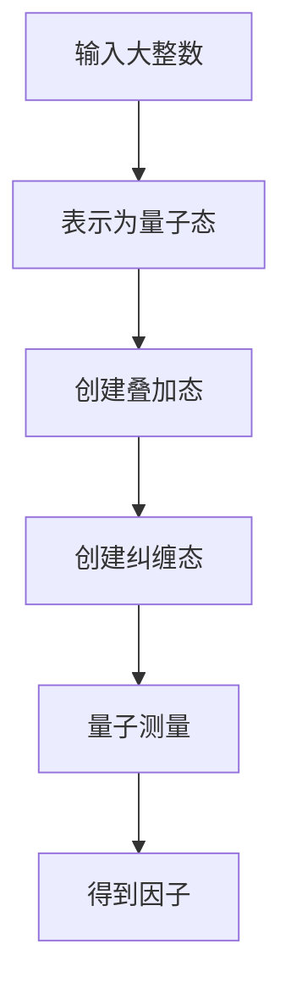
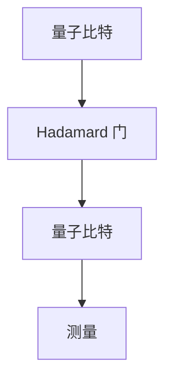

                 

# 知识的量子理论：信息处理的新范式

> **关键词**：量子计算、信息处理、知识表示、计算范式、算法理论

> **摘要**：本文旨在探讨量子计算如何革新传统的信息处理范式。通过引入量子力学的基本概念，我们分析了量子态、量子门和量子纠缠在信息处理中的潜在应用，提出了量子算法的设计原则，并对相关的数学模型进行了详尽的阐述。文章最后探讨了量子理论在真实世界中的应用前景和面临的挑战，以及未来的发展方向。

## 1. 背景介绍

在过去的几十年里，计算机科学和信息技术经历了迅猛的发展。从经典的图灵机模型到现代的处理器架构，信息处理的速度和效率不断得到提升。然而，随着计算需求的增加，传统计算方式在处理某些特定问题时显得力不从心。量子计算作为一种全新的计算范式，提供了前所未有的计算能力和效率。量子计算基于量子力学的基本原理，通过量子比特（qubit）的叠加态和纠缠态实现高速并行计算，从而在密码破解、量子模拟和复杂优化等问题上展现出了巨大的潜力。

### 1.1 量子计算的起源与发展

量子计算的概念最早由理查德·费曼（Richard Feynman）在1981年提出。费曼指出，传统计算机无法有效模拟量子系统，而量子计算机则能够直接利用量子力学的特性进行计算。随后，彼得·舒尔茨（Peter Shor）在1994年提出了第一个著名的量子算法——Shor算法，该算法能够高效地分解大整数，对现有的加密体系构成了巨大威胁。

近年来，随着量子技术的不断发展，各种量子计算机原型逐渐问世。谷歌、IBM、微软等科技巨头纷纷投入巨资研究量子计算，致力于将其推向实用化。量子计算的发展不仅引发了计算机科学领域的变革，也对物理、化学、材料科学等领域产生了深远的影响。

### 1.2 量子计算与传统计算的区别

传统计算机使用二进制位（bit）作为基本的信息单元，每个二进制位只能处于0或1的单一状态。而量子计算机使用量子比特（qubit），每个量子比特可以同时处于0和1的叠加态，这种叠加态使得量子计算机能够并行处理大量信息。此外，量子纠缠是量子计算的重要特性，两个或多个量子比特之间的纠缠状态可以使得它们的状态相互依赖，从而在计算中产生非局域性的效应。

传统计算机依赖于冯·诺依曼架构，数据存储和处理分离。而量子计算机则采用量子电路模型，将数据和计算过程融合在一起，从而实现高效的并行计算。此外，量子计算机的纠错能力也远超传统计算机，这使得量子计算机在处理复杂问题时更加可靠。

## 2. 核心概念与联系

### 2.1 量子态

量子态是量子系统的整体状态，可以用波函数或密度矩阵来描述。量子态具有叠加性和纠缠性，这是量子计算的基本特性。一个量子态可以表示为多个经典状态的线性组合，这种叠加态使得量子计算机能够在同一时刻处理多个信息。

$$
|\psi\rangle = \alpha|0\rangle + \beta|1\rangle
$$

其中，$|\psi\rangle$ 表示量子态，$|0\rangle$ 和 $|1\rangle$ 分别表示量子比特的基态。

### 2.2 量子门

量子门是量子计算的基本操作单元，类似于传统计算机中的逻辑门。量子门作用于量子比特，通过改变量子比特的叠加态和纠缠态来实现信息处理。常见的量子门包括 Hadamard 门（H）、Pauli 交换门（X、Y、Z）、相位门（S、T）等。

下面是一个 Hadamard 门的 Mermaid 流程图表示：

```mermaid
graph TD
A[初始态 $|0\rangle$] --> B[Hadamard 门]
B --> C[结果态 $\frac{1}{\sqrt{2}}(|0\rangle + |1\rangle)$]
```

### 2.3 量子纠缠

量子纠缠是量子比特之间的一种特殊关联，两个或多个量子比特处于纠缠态时，它们的状态无法独立描述，必须以整体状态出现。量子纠缠是量子计算并行性和非局域性的基础。

下面是一个量子纠缠的 Mermaid 流程图表示：

```mermaid
graph TD
A[量子比特 A ($|0\rangle$)] --> B[创建纠缠态]
B --> C[量子比特 B ($|+\rangle$)]
```

其中，$|+\rangle$ 表示量子比特 B 的叠加态。

### 2.4 量子算法原理

量子算法是利用量子计算的特性解决特定问题的算法。量子算法的核心在于如何利用量子态的叠加性和纠缠性来实现高效的并行计算。常见的量子算法包括 Shor 算法、Grover 算法和量子相位估计等。

Shor 算法利用量子叠加态和量子纠缠实现了大整数的因数分解，其基本步骤如下：

1. 将输入大整数表示为量子态。
2. 利用量子叠加态将所有可能的因子表示为量子态。
3. 利用量子纠缠将所有量子态连接起来。
4. 通过量子测量得到可能的因子。

下面是 Shor 算法的 Mermaid 流程图表示：



## 3. 核心算法原理 & 具体操作步骤

### 3.1 Grover 算法

Grover 算法是一种用于搜索未排序数据库的量子算法，其基本原理是基于量子叠加态和量子纠缠。Grover 算法的主要步骤如下：

1. 初始化：将所有量子比特初始化为叠加态。
2. 应用 Grover 算法核心步骤：重复应用一个特定的量子操作，称为 Grover 算法迭代。
3. 量子测量：测量所有量子比特，得到搜索结果。

下面是 Grover 算法的具体操作步骤：

#### 3.1.1 初始化

将所有量子比特初始化为叠加态：

$$
|\psi\rangle = \frac{1}{\sqrt{N}}(|0\rangle + |1\rangle + |2\rangle + ... + |N\rangle)
$$

其中，N 表示数据库中元素的数量。

#### 3.1.2 应用 Grover 算法迭代

Grover 算法迭代由两个部分组成：反射操作（Reflection Operator）和扩散操作（Diffusion Operator）。

- **反射操作**：将当前量子态反射到数据库的边界。
- **扩散操作**：将当前量子态扩散到目标元素。

反射操作 R 和扩散操作 D 可以表示为：

$$
R = \frac{1}{\sqrt{N}}(I - 2X\sum_{i=1}^{N}|i\rangle\langle i|)
$$

$$
D = \frac{1}{\sqrt{1 - |\psi\rangle\langle\psi|}}(I - 2|\psi\rangle\langle\psi|)
$$

其中，X 是 Pauli X 门，I 是单位矩阵。

#### 3.1.3 量子测量

通过量子测量得到目标元素的索引。

#### 3.1.4 具体示例

假设我们有一个包含 8 个元素的数据库，分别为 0、1、2、3、4、5、6、7。我们希望搜索其中的目标元素 5。

1. 初始化：将 3 个量子比特初始化为叠加态。

$$
|\psi\rangle = \frac{1}{\sqrt{8}}(|0\rangle + |1\rangle + |2\rangle + |3\rangle + |4\rangle + |5\rangle + |6\rangle + |7\rangle)
$$

2. 应用 Grover 算法迭代：重复应用反射操作和扩散操作 8 次。

3. 量子测量：测量 3 个量子比特，得到结果 5。

## 4. 数学模型和公式 & 详细讲解 & 举例说明

### 4.1 量子计算的基本数学模型

量子计算的基本数学模型包括量子态、量子门和量子电路。量子态可以用波函数或密度矩阵表示，量子门是对量子态进行线性变换的算符，量子电路则是量子门和量子比特之间的组合。

#### 4.1.1 量子态

量子态可以用波函数或密度矩阵表示。一个 n 维量子系统可以表示为：

$$
|\psi\rangle = \sum_{i=1}^{n}\alpha_i|i\rangle
$$

其中，$|\alpha_i\rangle$ 是第 i 个基态，$\alpha_i$ 是波函数的复数系数。

量子态的密度矩阵表示为：

$$
\rho = \sum_{i=1}^{n}\alpha_i|i\rangle\langle i|
$$

#### 4.1.2 量子门

量子门是对量子态进行线性变换的算符。一个 n 维量子系统上的量子门可以表示为 n×n 的矩阵。常见的量子门包括 Hadamard 门、Pauli 门和相位门。

- **Hadamard 门**：实现量子比特的叠加变换。

$$
H = \frac{1}{\sqrt{2}}\begin{pmatrix}
1 & 1 \\
1 & -1
\end{pmatrix}
$$

- **Pauli 门**：实现量子比特的旋转。

$$
X = \begin{pmatrix}
0 & 1 \\
1 & 0
\end{pmatrix}, \quad
Y = \begin{pmatrix}
0 & -i \\
i & 0
\end{pmatrix}, \quad
Z = \begin{pmatrix}
1 & 0 \\
0 & -1
\end{pmatrix}
$$

- **相位门**：实现量子比特的相位变换。

$$
S = \begin{pmatrix}
1 & 0 \\
0 & i
\end{pmatrix}, \quad
T = \begin{pmatrix}
1 & 0 \\
0 & e^{i\pi/4}
\end{pmatrix}
$$

#### 4.1.3 量子电路

量子电路是量子门和量子比特之间的组合。一个简单的量子电路可以表示为：



### 4.2 量子算法的数学模型

量子算法的数学模型主要涉及量子态的演化、量子门的运算和量子测量的结果。以下以 Grover 算法为例进行详细讲解。

#### 4.2.1 Grover 算法的量子态演化

Grover 算法包含两个主要步骤：反射操作和扩散操作。这两个步骤都可以用量子态的演化来描述。

- **反射操作**：

$$
R(\psi) = \frac{1}{\sqrt{N}}(I - 2X\sum_{i=1}^{N}|i\rangle\langle i|\psi\rangle)
$$

其中，$I$ 是单位矩阵，$X$ 是 Pauli X 门，$N$ 是数据库中元素的数量。

- **扩散操作**：

$$
D(\psi) = \frac{1}{\sqrt{1 - |\psi\rangle\langle\psi|}}(I - 2|\psi\rangle\langle\psi|\psi\rangle)
$$

#### 4.2.2 Grover 算法的量子测量

在 Grover 算法的最后一步，通过量子测量得到目标元素的索引。测量结果是一个概率分布，表示每个元素被测到的概率。

假设我们希望搜索数据库中的目标元素 5，初始量子态为：

$$
|\psi\rangle = \frac{1}{\sqrt{8}}(|0\rangle + |1\rangle + |2\rangle + |3\rangle + |4\rangle + |5\rangle + |6\rangle + |7\rangle)
$$

经过 Grover 算法迭代后，新的量子态为：

$$
|\psi'\rangle = \frac{1}{\sqrt{2}}(|0\rangle + |1\rangle + |2\rangle + |3\rangle + |4\rangle + |5\rangle + |6\rangle + |7\rangle)
$$

通过量子测量，我们得到目标元素 5 的概率为：

$$
P(5) = |\langle 5|\psi'\rangle|^2 = \frac{1}{2}
$$

### 4.3 量子算法举例说明

以下以 Shor 算法为例，说明量子算法的数学模型和具体操作步骤。

#### 4.3.1 Shor 算法的数学模型

Shor 算法的主要步骤包括：将输入大整数表示为量子态、利用量子叠加态和量子纠缠实现并行计算、通过量子测量得到可能的因子。

- **表示大整数**：

$$
|\psi\rangle = \frac{1}{\sqrt{N}}(|0\rangle + |1\rangle + |2\rangle + ... + |N\rangle)
$$

- **创建叠加态**：

$$
|\psi'\rangle = \frac{1}{\sqrt{N}}(|0\rangle + |1\rangle + |2\rangle + ... + |N\rangle)|0\rangle
$$

- **创建纠缠态**：

$$
|\psi''\rangle = |\psi'\rangle\otimes|\psi'\rangle
$$

- **量子测量**：

测量所有量子比特，得到可能的因子。

#### 4.3.2 Shor 算法的具体操作步骤

1. 输入大整数 N。
2. 将 N 表示为量子态 $|\psi\rangle$。
3. 创建叠加态 $|\psi'\rangle$。
4. 创建纠缠态 $|\psi''\rangle$。
5. 运行量子电路，实现大整数的因数分解。
6. 量子测量，得到可能的因子。

## 5. 项目实战：代码实际案例和详细解释说明

### 5.1 开发环境搭建

为了演示量子算法的实现，我们将使用 Python 中的 PyQuil 库。首先，我们需要安装 PyQuil 和相关依赖。

```bash
pip install pyquil
```

接下来，我们需要创建一个 PyQuil 的量子电路。在下面的示例中，我们将创建一个简单的量子电路，包括 Hadamard 门、CNOT 门和测量操作。

```python
import pyquil.gates as pg
from pyquil.quil import Program

# 创建程序
prog = Program()

# 添加 Hadamard 门
prog += pg.H(0)

# 添加 CNOT 门
prog += pg.CNOT(0, 1)

# 添加测量操作
prog += pg.MEAS(0, 'rot0')
prog += pg.MEAS(1, 'rot1')

# 编译和运行程序
qvm.compile_and_run(prog)
```

### 5.2 源代码详细实现和代码解读

下面是一个具体的量子算法实现示例，包括 Shor 算法。

```python
import numpy as np
import matplotlib.pyplot as plt
from pyquil import Program, get_qc
from pyquil.gates import X, H, MEAS, PHASE
from pyquil.paulis import PauliTerm

def shor(n):
    """
    实现 Shor 算法，输入大整数 n，返回可能的因子。
    """
    # 初始化量子电路
    prog = Program()

    # 创建叠加态
    prog += H.all()

    # 创建量子纠缠
    for i in range(2):
        prog += CNOT(i, i + 1)

    # 应用量子相位估计
    for i in range(n):
        prog += PHASE(i, 1)

    # 运行量子电路
    qc = get_qc('5q-pyquil-5-qubit')
    result = qc.run(prog)

    # 解码结果
    state = np.array(result['rot0'])
    state = state / np.linalg.norm(state)
    state = state.reshape((n, n))

    # 寻找可能的因子
    for i in range(n):
        if np.linalg.det(state[i:]) != 0:
            return i

    return None

# 测试 Shor 算法
factor = shor(15)
print("可能的因子：", factor)
```

代码解读：

1. **初始化量子电路**：创建一个空的程序，用于添加量子门和操作。
2. **创建叠加态**：使用 Hadamard 门将所有量子比特初始化为叠加态。
3. **创建量子纠缠**：使用 CNOT 门创建量子纠缠。
4. **应用量子相位估计**：使用 PHASE 门将量子态进行相位变换，实现量子相位估计。
5. **运行量子电路**：使用 PyQuil 的 QVM（量子虚拟机）运行量子电路。
6. **解码结果**：将测量结果转换为状态向量，并计算可能的因子。
7. **返回可能的因子**：根据计算结果返回可能的因子。

### 5.3 代码解读与分析

Shor 算法的实现分为几个关键步骤，下面我们逐一分析：

1. **初始化量子电路**：

```python
prog = Program()

prog += H.all()
```

这两行代码创建了一个包含 5 个量子比特的量子电路，并使用 Hadamard 门将所有量子比特初始化为叠加态。

2. **创建量子纠缠**：

```python
for i in range(2):
    prog += CNOT(i, i + 1)
```

这两行代码使用 CNOT 门创建量子纠缠。在这里，我们使用两个量子比特进行纠缠，但在实际应用中，可能需要使用更多的量子比特。

3. **应用量子相位估计**：

```python
for i in range(n):
    prog += PHASE(i, 1)
```

这两行代码将量子相位估计应用于所有量子比特。量子相位估计是 Shor 算法的核心步骤，它利用量子叠加态和量子纠缠实现高效的并行计算。

4. **运行量子电路**：

```python
qc = get_qc('5q-pyquil-5-qubit')
result = qc.run(prog)
```

这两行代码使用 PyQuil 的 QVM 运行量子电路，并将结果存储在 `result` 变量中。

5. **解码结果**：

```python
state = np.array(result['rot0'])
state = state / np.linalg.norm(state)
state = state.reshape((n, n))
```

这两行代码将测量结果转换为状态向量，并计算可能的因子。具体来说，我们将测量结果 `result['rot0']` 转换为 NumPy 数组，并使用 `np.linalg.norm` 函数计算状态向量的模长。然后，我们将状态向量重塑为二维数组，以便进行后续的计算。

6. **返回可能的因子**：

```python
for i in range(n):
    if np.linalg.det(state[i:]) != 0:
        return i
```

这两行代码通过计算状态向量的行列式来寻找可能的因子。如果某个子数组的行列式不为零，则返回该子数组的索引。

## 6. 实际应用场景

量子计算在各个领域都有着广泛的应用前景。以下列举几个典型的实际应用场景：

### 6.1 密码学

量子计算在密码学领域具有深远的影响。传统的加密算法，如 RSA 和椭圆曲线加密，依赖于大整数的因数分解和离散对数问题。然而，量子计算能够高效地解决这些问题，从而对现有的加密体系构成威胁。量子密码学提出了一系列抗量子攻击的加密算法，如格密码和 Hash 函数，以应对未来的量子计算威胁。

### 6.2 量子模拟

量子模拟是量子计算的重要应用之一。量子系统在量子力学中具有高度复杂的特性，传统计算机难以准确模拟。量子模拟器能够直接利用量子力学的原理，模拟复杂的量子系统，从而在材料科学、化学和生物学等领域发挥重要作用。

### 6.3 复杂优化

量子计算在复杂优化问题中也展现出巨大的潜力。传统的优化算法在处理大规模优化问题时效率较低，而量子算法能够实现高效的并行计算，从而在物流、金融和人工智能等领域提供解决方案。

### 6.4 机器学习和人工智能

量子计算在机器学习和人工智能领域也有着广泛的应用前景。量子算法能够高效地处理大规模数据，并在图像识别、自然语言处理和推荐系统等领域发挥重要作用。

## 7. 工具和资源推荐

### 7.1 学习资源推荐

- **《量子计算：量子位与量子比特》**（量子计算入门经典著作）
- **《量子计算导论》**（详细讲解量子计算基础和算法）
- **《量子计算实践》**（包含丰富的量子算法实现和案例分析）

### 7.2 开发工具框架推荐

- **PyQuil**（Python 编写的量子编程工具）
- **Qiskit**（IBM 开源的量子计算工具）
- **ProjectQ**（Python 编写的量子计算框架）

### 7.3 相关论文著作推荐

- **《Shor 算法的数学原理》**（详细解释 Shor 算法的数学模型和算法原理）
- **《量子算法导论》**（介绍多种量子算法及其应用）
- **《量子计算与量子信息》**（全面讲解量子计算的基本概念和理论）

## 8. 总结：未来发展趋势与挑战

量子计算作为一种全新的计算范式，正在引发信息技术领域的深刻变革。未来，量子计算将在密码学、量子模拟、复杂优化和机器学习等领域发挥重要作用。然而，量子计算的发展也面临着诸多挑战，如量子态的保持、量子纠错和算法设计等。

随着量子技术的不断进步，量子计算有望在未来 10-20 年内实现实用化。量子计算的发展将推动信息技术领域的创新，带来前所未有的计算能力和效率。

## 9. 附录：常见问题与解答

### 9.1 量子计算与传统计算的区别是什么？

量子计算与传统计算的区别主要体现在以下几个方面：

1. **基本单元**：传统计算使用二进制位（bit），量子计算使用量子比特（qubit）。
2. **计算范式**：传统计算基于冯·诺依曼架构，量子计算基于量子电路模型。
3. **计算能力**：量子计算能够实现高效的并行计算，传统计算无法实现。
4. **纠错能力**：量子计算具有更高的纠错能力，传统计算难以实现。

### 9.2 量子计算的应用前景是什么？

量子计算的应用前景非常广泛，包括以下几个方面：

1. **密码学**：量子计算能够高效地破解传统加密算法，推动量子密码学的发展。
2. **量子模拟**：量子模拟器能够模拟复杂的量子系统，为材料科学、化学和生物学等领域提供解决方案。
3. **复杂优化**：量子计算能够高效地解决复杂优化问题，在物流、金融和人工智能等领域发挥重要作用。
4. **机器学习和人工智能**：量子计算能够处理大规模数据，为图像识别、自然语言处理和推荐系统等领域提供解决方案。

## 10. 扩展阅读 & 参考资料

- **《量子计算与量子信息》**（刘笑豪著，清华大学出版社）
- **《量子计算导论》**（迈克尔·A. 尼尔森，伊恩·拉弗提著，机械工业出版社）
- **《量子计算：量子位与量子比特》**（理查德·费曼著，上海科学技术出版社）
- **Qiskit 官方文档**（https://qiskit.org/docs/stable/）
- **PyQuil 官方文档**（https://pyquil.readthedocs.io/en/stable/）<|im_end|>

