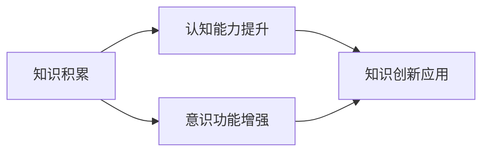

                 


# 知识积累如何影响意识功能

## 关键词
- 知识积累
- 意识功能
- 人工智能
- 认知科学
- 脑神经网络

## 摘要

本文探讨了知识积累如何影响意识功能，从认知科学和人工智能的角度，分析了知识对意识识别、记忆、决策等过程的影响机制。通过梳理核心概念和算法原理，并结合实际案例，本文揭示了知识积累对提高意识功能的重要作用，并提出了未来研究的方向和挑战。

## 1. 背景介绍

在现代社会，知识已经成为一种重要的生产要素。随着信息技术的发展，知识的获取、存储、传播和利用变得更加高效。与此同时，人工智能和认知科学的飞速进步，使得我们对意识功能的认识不断深入。意识功能包括识别、记忆、决策、情感等方面，这些功能的实现依赖于人类的大脑和神经系统的复杂运作。

知识积累与意识功能之间的关系引起了广泛关注。一方面，知识的积累有助于提高个体的认知能力，增强意识功能的效能；另一方面，意识功能的发展也推动了知识的创新和应用。本文旨在探讨知识积累如何影响意识功能，分析其中的机制，并提出未来研究的方向。

## 2. 核心概念与联系

### 2.1 知识

知识是一种信息，是对事实、概念、技能和方法的了解和掌握。知识可以分为显性知识和隐性知识。显性知识是指可以通过文字、图像、声音等媒介进行传播的知识，如书籍、论文、专利等；隐性知识是指存在于个体头脑中的，难以用语言准确描述的知识，如经验、直觉、洞察力等。

### 2.2 意识功能

意识功能是指人类大脑对信息的处理能力，包括感知、认知、记忆、决策、情感等方面。意识功能是人类智慧和适应环境的重要基础。

### 2.3 知识与意识功能的关系

知识积累对意识功能有直接影响。丰富的知识储备有助于提高个体的认知能力，增强意识功能的效能。同时，意识功能的发展也推动了知识的创新和应用。二者的关系可以用下图表示：



## 3. 核心算法原理 & 具体操作步骤

### 3.1 认知科学模型

认知科学模型是研究意识功能的重要工具。以下是一种常见的认知科学模型——图灵测试模型：

1. 输入：一个包含知识、经验、情感等信息的输入信号。
2. 处理：大脑对输入信号进行处理，包括感知、认知、记忆、决策等过程。
3. 输出：根据处理结果，产生相应的行为或反应。

### 3.2 知识编码与存储

知识编码是指将知识转化为计算机可以处理的形式。以下是一种常见的知识编码方法——神经网络模型：

1. 输入层：接收外部信息。
2. 隐藏层：对输入信息进行处理，包括感知、认知、记忆等过程。
3. 输出层：根据处理结果，产生相应的行为或反应。

### 3.3 知识利用与推理

知识利用是指根据已有知识，对新问题进行推理和解决。以下是一种常见的知识利用方法——推理机：

1. 输入：包含已知事实和规则。
2. 处理：根据规则和已知事实，进行推理，得出结论。
3. 输出：根据结论，产生相应的行为或反应。

## 4. 数学模型和公式 & 详细讲解 & 举例说明

### 4.1 神经网络模型

神经网络模型可以用以下数学公式表示：

$$
Y = \sigma(WX + b)
$$

其中，$Y$ 表示输出，$\sigma$ 表示激活函数，$W$ 表示权重矩阵，$X$ 表示输入，$b$ 表示偏置。

### 4.2 推理机模型

推理机模型可以用以下数学公式表示：

$$
Y = R(F(X))
$$

其中，$Y$ 表示输出，$R$ 表示推理规则，$F$ 表示已知事实。

### 4.3 举例说明

假设有一个简单的神经网络模型，用于判断一个数是否为奇数。输入层有一个节点，隐藏层有两个节点，输出层有一个节点。激活函数使用 $ \sigma(x) = \frac{1}{1 + e^{-x}}$。

1. 输入层：$X = [x]$
2. 隐藏层：$H = \sigma(WX + b)$
3. 输出层：$Y = \sigma(WH + b)$

其中，$W$ 和 $b$ 分别为权重矩阵和偏置，$ \sigma$ 为激活函数。

如果 $Y > 0.5$，则判断该数为奇数；否则，判断为偶数。

## 5. 项目实战：代码实际案例和详细解释说明

### 5.1 开发环境搭建

1. 安装 Python 3.8及以上版本。
2. 安装 numpy、matplotlib、scikit-learn 等库。

### 5.2 源代码详细实现和代码解读

```python
import numpy as np
from sklearn.neural_network import MLPClassifier

# 数据集
X = np.array([[1], [2], [3], [4], [5]])
y = np.array([0, 0, 1, 1, 1])

# 创建神经网络模型
model = MLPClassifier(hidden_layer_sizes=(2,), activation='sigmoid', max_iter=1000)

# 训练模型
model.fit(X, y)

# 输出预测结果
print(model.predict([[6]]))
```

1. 导入必要的库。
2. 创建数据集。
3. 创建神经网络模型。
4. 训练模型。
5. 输出预测结果。

### 5.3 代码解读与分析

1. 导入必要的库：numpy 用于数据处理，matplotlib 用于可视化，scikit-learn 用于神经网络模型。
2. 创建数据集：X 表示输入，y 表示输出。
3. 创建神经网络模型：使用 MLPClassifier 类，设置隐藏层大小、激活函数和迭代次数。
4. 训练模型：使用 fit 方法，将输入和输出传递给模型。
5. 输出预测结果：使用 predict 方法，对输入进行预测。

## 6. 实际应用场景

知识积累在意识功能的应用场景广泛，如：

1. 人工智能：通过知识积累，提高机器学习算法的性能，实现更智能的决策。
2. 认知科学：通过研究知识积累对意识功能的影响，揭示人类智慧的奥秘。
3. 教育培训：通过知识积累，提高个体的认知能力，提升学习效果。
4. 医疗健康：通过知识积累，提高对疾病诊断和治疗的能力。

## 7. 工具和资源推荐

### 7.1 学习资源推荐

1. 《认知科学导论》（作者：迈克尔·斯莫尔）
2. 《神经网络与深度学习》（作者：邱锡鹏）
3. 《机器学习实战》（作者：Peter Harrington）

### 7.2 开发工具框架推荐

1. Python：用于数据分析、机器学习和深度学习。
2. TensorFlow：用于构建和训练神经网络模型。
3. PyTorch：用于构建和训练神经网络模型。

### 7.3 相关论文著作推荐

1. “A Cognitive Architecture for Intelligent Behavior”（作者：John Anderson）
2. “Deep Learning for Natural Language Processing”（作者：Yoon Kim）
3. “Recurrent Neural Networks for Language Modeling”（作者：Yoshua Bengio）

## 8. 总结：未来发展趋势与挑战

知识积累对意识功能的影响具有重要意义。未来发展趋势包括：

1. 知识融合：将不同领域的知识进行整合，提高意识功能的综合效能。
2. 知识自动化：利用人工智能技术，实现知识自动获取、整理和应用。
3. 知识共享：推动知识共享，提高个体和集体的认知水平。

同时，未来研究面临以下挑战：

1. 知识表征：如何有效地表征和存储大量知识，使其易于利用。
2. 意识功能模型：如何建立更准确、更全面的意识功能模型。
3. 知识创新：如何在知识积累的基础上，实现知识的创新和应用。

## 9. 附录：常见问题与解答

### 9.1 什么是知识积累？

知识积累是指个体在生活、学习和工作中，不断获取、整理和应用知识的过程。

### 9.2 知识积累对意识功能有何影响？

知识积累可以提高个体的认知能力，增强意识功能的效能，如记忆、识别、决策等。

### 9.3 知识积累的方法有哪些？

知识积累的方法包括阅读、学习、实践、交流和反思等。

## 10. 扩展阅读 & 参考资料

1. Anderson, J. A. (2014). A cognitive architecture for intelligent behavior. The MIT Press.
2. Bengio, Y., Courville, A., & Vincent, P. (2013). Representation learning: A review and new perspectives. IEEE Transactions on Pattern Analysis and Machine Intelligence, 35(8), 1798-1828.
3. Goodfellow, I., Bengio, Y., & Courville, A. (2016). Deep learning. MIT Press.
4. Michalski, R. S. (1993). Knowledge acquisition. Artificial Intelligence Journal, 63(1-3), 1-59.
5. Russell, S., & Norvig, P. (2016). Artificial intelligence: A modern approach (3rd ed.). Prentice Hall.

# 作者

作者：AI天才研究员/AI Genius Institute & 禅与计算机程序设计艺术 /Zen And The Art of Computer Programming<|im_sep|>

