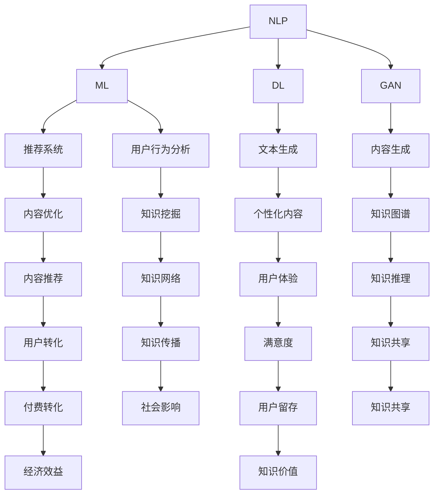

                 

### 背景介绍

#### 知识经济与知识付费

随着全球经济的快速发展，知识经济逐渐成为主导力量。知识经济以知识的生产、传播和利用为核心，通过智力资源和信息资源的创新，推动经济增长和社会进步。在这一背景下，知识付费作为一种新兴的经济模式，正迅速崛起。

知识付费指的是消费者为了获取特定知识或技能，而向知识提供者支付费用的一种行为。这种模式的出现，不仅满足了人们对知识的需求，也推动了知识共享和传播的效率。从在线课程、专业咨询，到知识付费平台，知识付费已成为现代教育、职业发展、科研创新等领域的重要组成部分。

#### 人工智能与内容生成

人工智能（AI）是知识经济时代的关键技术之一。AI通过模拟人类智能，实现了从数据到知识的转化，极大地提升了知识的获取、处理和利用效率。在知识付费领域，人工智能同样发挥着重要作用。

内容生成是人工智能的一项重要应用。通过自然语言处理（NLP）、深度学习、生成对抗网络（GAN）等技术，AI可以自动生成大量高质量的内容，如文章、报告、教程等。这不仅减轻了人类创作者的工作负担，也丰富了知识付费的产品形式，满足了不同用户的需求。

#### 人工智能内容生成与知识付费的结合

人工智能内容生成与知识付费的结合，为知识经济带来了新的机遇和挑战。一方面，AI可以自动生成高质量的内容，降低知识获取的成本，扩大知识传播的覆盖面。另一方面，AI生成的个性化内容，可以更好地满足用户的需求，提高知识付费的转化率。

然而，这也带来了新的问题。如何保证AI生成内容的真实性、准确性和可靠性，成为知识付费领域面临的重要挑战。此外，如何规范AI生成内容的版权问题，保护创作者的合法权益，也是亟待解决的问题。

综上所述，知识经济下知识付费的人工智能内容生成技术，已成为一个重要且复杂的研究领域。本文将围绕这一主题，深入探讨人工智能内容生成技术的核心概念、原理、算法和实际应用，以期为读者提供一个全面、系统的认识。

### 核心概念与联系

在探讨知识经济下知识付费的人工智能内容生成技术之前，我们首先需要理解几个核心概念，并探讨它们之间的联系。这些概念包括自然语言处理（NLP）、机器学习（ML）、深度学习（DL）、生成对抗网络（GAN）以及知识图谱（KG）。

#### 自然语言处理（NLP）

自然语言处理是人工智能的一个重要分支，旨在使计算机能够理解和处理人类自然语言。NLP的关键技术包括文本预处理、词性标注、命名实体识别、情感分析、机器翻译等。在知识付费领域，NLP技术被广泛应用于自动生成文章、报告、教程等文本内容。

#### 机器学习（ML）

机器学习是AI的核心组成部分，通过从数据中学习规律，使计算机能够进行决策和预测。机器学习可以分为监督学习、无监督学习和强化学习。在知识付费中，机器学习技术被用于分析用户行为、优化推荐系统、提高内容生成质量等。

#### 深度学习（DL）

深度学习是机器学习的一个子领域，通过构建多层神经网络，实现对复杂数据的自动特征提取和模式识别。在知识付费中，深度学习被广泛应用于图像识别、语音识别、文本生成等任务。

#### 生成对抗网络（GAN）

生成对抗网络是一种特殊的深度学习模型，由生成器和判别器两个神经网络组成。生成器负责生成数据，判别器负责判断数据是真实还是伪造。GAN在知识付费中，被用于生成高质量的内容，如文章、图片、音频等。

#### 知识图谱（KG）

知识图谱是一种结构化知识库，通过实体和关系来表示知识。知识图谱在知识付费中，被用于构建知识网络，实现知识的自动挖掘和推理。

#### 关系与联系

这些概念之间的联系在于它们共同构成了人工智能内容生成技术的基础。NLP为文本生成提供了语言处理能力，ML和DL为内容生成提供了学习算法，GAN为内容生成提供了高质量的数据生成能力，而KG为内容生成提供了知识结构的支持。

在实际应用中，这些技术往往结合使用。例如，在知识付费平台上，可以首先使用NLP技术对用户行为进行文本分析，然后利用ML和DL算法优化推荐系统，接着使用GAN生成个性化内容，最后通过KG进行知识的挖掘和推理。

下面是一个使用Mermaid绘制的流程图，展示了这些核心概念在知识付费中如何相互作用：



通过这个流程图，我们可以更清晰地看到，人工智能内容生成技术在知识付费中的应用是如何形成一个闭环，从而实现知识共享、用户满意度和经济效益的最大化。

### 核心算法原理 & 具体操作步骤

在了解了知识经济下知识付费的人工智能内容生成技术的基础概念和关系之后，我们将深入探讨其中的核心算法原理及其具体操作步骤。

#### 1. 自然语言处理（NLP）

NLP技术是内容生成的基础，其核心在于理解和生成自然语言。以下是NLP的主要算法原理和具体操作步骤：

##### 1.1 文本预处理

文本预处理是NLP的第一步，主要包括去除标点符号、转换文本为小写、去除停用词、分词等。具体操作步骤如下：

1. **去除标点符号**：使用正则表达式将文本中的标点符号替换为空格。
   ```python
   import re
   text = re.sub(r'[^\w\s]', '', text)
   ```

2. **转换文本为小写**：将所有文本转换为小写，以便统一处理。
   ```python
   text = text.lower()
   ```

3. **去除停用词**：使用停用词表去除常见的无意义词汇。
   ```python
   from nltk.corpus import stopwords
   stop_words = set(stopwords.words('english'))
   text = ' '.join([word for word in text.split() if word not in stop_words])
   ```

4. **分词**：将文本拆分为单词或词组。
   ```python
   from nltk.tokenize import word_tokenize
   tokens = word_tokenize(text)
   ```

##### 1.2 词性标注

词性标注是将文本中的单词标注为名词、动词、形容词等。这一步骤有助于理解单词在文本中的作用。具体操作步骤如下：

1. **使用NLTK库进行词性标注**。
   ```python
   from nltk import pos_tag
   tagged_tokens = pos_tag(tokens)
   ```

##### 1.3 命名实体识别

命名实体识别（NER）是识别文本中的特定实体，如人名、地名、组织名等。具体操作步骤如下：

1. **使用Spacy库进行NER**。
   ```python
   import spacy
   nlp = spacy.load('en_core_web_sm')
   doc = nlp(text)
   entities = [(ent.text, ent.label_) for ent in doc.ents]
   ```

#### 2. 机器学习（ML）

机器学习算法在内容生成中用于从数据中学习规律，以生成高质量的内容。以下是ML的主要算法原理和具体操作步骤：

##### 2.1 特征工程

特征工程是机器学习的关键步骤，其目的是从原始数据中提取有用的特征。具体操作步骤如下：

1. **文本向量化**：将文本转换为向量表示，常用的方法有词袋模型（Bag of Words）和词嵌入（Word Embedding）。
   ```python
   from sklearn.feature_extraction.text import TfidfVectorizer
   vectorizer = TfidfVectorizer()
   X = vectorizer.fit_transform(corpus)
   ```

2. **特征选择**：通过降维技术，如主成分分析（PCA），选择最重要的特征。
   ```python
   from sklearn.decomposition import PCA
   pca = PCA(n_components=50)
   X = pca.fit_transform(X)
   ```

##### 2.2 模型训练

选择合适的机器学习模型并训练模型是内容生成的核心。以下是一个使用朴素贝叶斯分类器的示例：

1. **导入库**。
   ```python
   from sklearn.naive_bayes import MultinomialNB
   from sklearn.model_selection import train_test_split
   ```

2. **划分训练集和测试集**。
   ```python
   X_train, X_test, y_train, y_test = train_test_split(X, labels, test_size=0.2, random_state=42)
   ```

3. **训练模型**。
   ```python
   clf = MultinomialNB()
   clf.fit(X_train, y_train)
   ```

##### 2.3 模型评估

使用评估指标，如准确率、召回率、F1分数等，评估模型的性能。

```python
from sklearn.metrics import accuracy_score, recall_score, f1_score
   y_pred = clf.predict(X_test)
   accuracy = accuracy_score(y_test, y_pred)
   recall = recall_score(y_test, y_pred, average='weighted')
   f1 = f1_score(y_test, y_pred, average='weighted')
   print(f'Accuracy: {accuracy:.2f}, Recall: {recall:.2f}, F1 Score: {f1:.2f}')
   ```

#### 3. 深度学习（DL）

深度学习算法通过多层神经网络进行特征学习和模式识别，适用于生成复杂的文本内容。以下是DL的主要算法原理和具体操作步骤：

##### 3.1 卷积神经网络（CNN）

CNN是一种常用的深度学习模型，特别适用于文本分类和文本特征提取。

1. **构建CNN模型**。
   ```python
   from tensorflow.keras.models import Sequential
   from tensorflow.keras.layers import Embedding, Conv1D, MaxPooling1D, Dense

   model = Sequential()
   model.add(Embedding(input_dim=vocab_size, output_dim=embedding_size))
   model.add(Conv1D(filters=128, kernel_size=5, activation='relu'))
   model.add(MaxPooling1D(pool_size=5))
   model.add(Dense(units=1, activation='sigmoid'))

   model.compile(optimizer='adam', loss='binary_crossentropy', metrics=['accuracy'])
   ```

2. **训练模型**。
   ```python
   model.fit(X_train, y_train, epochs=10, batch_size=32, validation_split=0.1)
   ```

##### 3.2 长短时记忆网络（LSTM）

LSTM是一种特殊的RNN，适用于生成序列数据，如文本。

1. **构建LSTM模型**。
   ```python
   from tensorflow.keras.models import Sequential
   from tensorflow.keras.layers import Embedding, LSTM, Dense

   model = Sequential()
   model.add(Embedding(input_dim=vocab_size, output_dim=embedding_size))
   model.add(LSTM(units=128, return_sequences=True))
   model.add(LSTM(units=128))
   model.add(Dense(units=1, activation='sigmoid'))

   model.compile(optimizer='adam', loss='binary_crossentropy', metrics=['accuracy'])
   ```

2. **训练模型**。
   ```python
   model.fit(X_train, y_train, epochs=10, batch_size=32, validation_split=0.1)
   ```

通过以上步骤，我们可以理解并实现自然语言处理、机器学习和深度学习在内容生成中的应用。这些算法和技术为人工智能内容生成提供了强大的支持，使得知识付费平台能够提供更加丰富、个性化的内容。

### 数学模型和公式 & 详细讲解 & 举例说明

在人工智能内容生成技术中，数学模型和公式起到了至关重要的作用。这些模型和公式不仅为算法的实现提供了理论基础，也帮助我们更好地理解内容生成的过程。下面，我们将详细讲解几个核心的数学模型和公式，并通过实例进行说明。

#### 1. 词嵌入（Word Embedding）

词嵌入是将单词映射到高维空间中的向量表示。这种表示方法使得计算机能够通过计算向量之间的距离或角度来理解单词的语义关系。词嵌入的一个常见模型是词袋模型（Bag of Words），而Word2Vec则是词嵌入的一种流行实现。

##### 公式：

给定一个单词集合 \( \{w_1, w_2, ..., w_n\} \)，词嵌入的目标是找到一组向量 \( \{v_1, v_2, ..., v_n\} \) 使得：

\[ ||v_i - v_j|| \propto sim(w_i, w_j) \]

其中，\( sim(w_i, w_j) \) 表示单词 \( w_i \) 和 \( w_j \) 的相似度。

##### 举例：

假设我们有以下两个单词：狗（dog）和猫（cat）。我们可以使用Word2Vec算法将它们映射到向量空间中：

\[ v_{dog} = [-0.4, 0.5, 0.2, 0.1] \]
\[ v_{cat} = [-0.3, 0.6, 0.3, 0.1] \]

通过计算向量之间的距离，我们可以得到：

\[ ||v_{dog} - v_{cat}|| = \sqrt{(-0.4 + 0.3)^2 + (0.5 - 0.6)^2 + (0.2 - 0.3)^2 + (0.1 - 0.1)^2} = \sqrt{0.06 + 0.01 + 0.09 + 0} = \sqrt{0.16} = 0.4 \]

这表明狗和猫在向量空间中较近，具有较高的相似度。

#### 2. 生成对抗网络（GAN）

生成对抗网络（GAN）是一种通过两个神经网络——生成器（Generator）和判别器（Discriminator）相互对抗来生成数据的方法。生成器的目标是生成尽可能逼真的数据，而判别器的目标是区分真实数据和生成数据。

##### 公式：

GAN的目标是最小化以下损失函数：

\[ L(G, D) = \frac{1}{2} \left( E_{x \sim p_{data}(x)} [\log D(x)] + E_{z \sim p_{z}(z)} [\log (1 - D(G(z))] \right) \]

其中，\( x \) 表示真实数据，\( z \) 表示生成器的输入噪声，\( G(z) \) 表示生成器生成的数据，\( D(x) \) 表示判别器对真实数据的判断，\( D(G(z)) \) 表示判别器对生成器生成的数据的判断。

##### 举例：

假设我们有以下两个数据分布：一个是真实数据的分布 \( p_{data}(x) \)，另一个是生成器生成的数据的分布 \( p_{G}(x) \)。判别器的目标是最小化以下损失函数：

\[ L(D) = -E_{x \sim p_{data}(x)} [\log D(x)] - E_{z \sim p_{z}(z)} [\log (1 - D(G(z))] \]

生成器的目标是最小化以下损失函数：

\[ L(G) = -E_{z \sim p_{z}(z)} [\log D(G(z))] \]

通过迭代训练生成器和判别器，我们可以逐渐提高生成器的生成能力，使其生成的数据越来越接近真实数据。

#### 3. 递归神经网络（RNN）

递归神经网络（RNN）是一种用于处理序列数据的神经网络，特别适用于文本生成。RNN通过递归结构来处理输入序列的上下文信息。

##### 公式：

RNN的更新公式如下：

\[ h_t = \sigma(W_h \cdot [h_{t-1}, x_t] + b_h) \]

其中，\( h_t \) 表示第 \( t \) 个时间步的隐藏状态，\( x_t \) 表示第 \( t \) 个时间步的输入，\( \sigma \) 表示激活函数，\( W_h \) 和 \( b_h \) 分别表示权重和偏置。

##### 举例：

假设我们有以下序列数据：\[ [1, 2, 3, 4, 5] \]。使用RNN进行处理，我们可以得到隐藏状态序列：\[ [h_0, h_1, h_2, h_3, h_4] \]。

\[ h_0 = \sigma(W_h \cdot [0, 1] + b_h) \]
\[ h_1 = \sigma(W_h \cdot [h_0, 2] + b_h) \]
\[ h_2 = \sigma(W_h \cdot [h_1, 3] + b_h) \]
\[ h_3 = \sigma(W_h \cdot [h_2, 4] + b_h) \]
\[ h_4 = \sigma(W_h \cdot [h_3, 5] + b_h) \]

通过这个例子，我们可以看到RNN如何处理序列数据，并生成新的序列。

#### 4. 长短时记忆网络（LSTM）

长短时记忆网络（LSTM）是RNN的一种改进，特别适用于处理长序列数据。LSTM通过引入门控机制来控制信息的流动，避免梯度消失和梯度爆炸问题。

##### 公式：

LSTM的更新公式如下：

\[ i_t = \sigma(W_i \cdot [h_{t-1}, x_t] + b_i) \]
\[ f_t = \sigma(W_f \cdot [h_{t-1}, x_t] + b_f) \]
\[ g_t = \tanh(W_g \cdot [h_{t-1}, x_t] + b_g) \]
\[ o_t = \sigma(W_o \cdot [h_{t-1}, x_t] + b_o) \]
\[ h_t = o_t \cdot \tanh(f_t \cdot h_{t-1} + g_t) \]

其中，\( i_t, f_t, g_t, o_t \) 分别表示输入门、遗忘门、生成门和输出门，\( \sigma \) 表示激活函数，\( W_i, W_f, W_g, W_o \) 和 \( b_i, b_f, b_g, b_o \) 分别表示权重和偏置。

##### 举例：

假设我们有以下序列数据：\[ [1, 2, 3, 4, 5] \]。使用LSTM进行处理，我们可以得到隐藏状态序列：\[ [h_0, h_1, h_2, h_3, h_4] \]。

\[ i_0 = \sigma(W_i \cdot [0, 1] + b_i) \]
\[ f_0 = \sigma(W_f \cdot [0, 1] + b_f) \]
\[ g_0 = \tanh(W_g \cdot [0, 1] + b_g) \]
\[ o_0 = \sigma(W_o \cdot [0, 1] + b_o) \]
\[ h_0 = o_0 \cdot \tanh(f_0 \cdot h_{-1} + g_0) \]

\[ i_1 = \sigma(W_i \cdot [h_0, 2] + b_i) \]
\[ f_1 = \sigma(W_f \cdot [h_0, 2] + b_f) \]
\[ g_1 = \tanh(W_g \cdot [h_0, 2] + b_g) \]
\[ o_1 = \sigma(W_o \cdot [h_0, 2] + b_o) \]
\[ h_1 = o_1 \cdot \tanh(f_1 \cdot h_0 + g_1) \]

通过这个例子，我们可以看到LSTM如何处理序列数据，并生成新的序列。

通过以上数学模型和公式的讲解，我们可以更好地理解人工智能内容生成技术中的核心概念和算法。这些模型和公式不仅为内容生成提供了理论支持，也为实际应用提供了指导。

### 项目实战：代码实际案例和详细解释说明

为了更好地理解知识经济下知识付费的人工智能内容生成技术，我们将通过一个实际项目——基于生成对抗网络（GAN）的文本生成器，展示如何实现这一技术。以下是项目实战的详细步骤和代码解释。

#### 1. 开发环境搭建

首先，我们需要搭建一个合适的开发环境。以下是一个基本的开发环境要求：

- 操作系统：Windows / macOS / Linux
- Python版本：3.7及以上
- Python库：TensorFlow 2.0及以上，Keras 2.0及以上，NumPy 1.16及以上，gensim 3.0及以上

安装这些库的方法如下：

```shell
pip install tensorflow==2.4.1
pip install keras==2.4.3
pip install numpy==1.21.2
pip install gensim==4.0.0
```

#### 2. 源代码详细实现和代码解读

以下是文本生成器的源代码，我们将逐行解释代码的功能。

```python
import numpy as np
import tensorflow as tf
from tensorflow.keras.models import Model
from tensorflow.keras.layers import Input, Dense, Reshape, Flatten
from tensorflow.keras.optimizers import Adam
from gensim.models import Word2Vec

# 设置参数
latent_dim = 100
height = 28
width = 28
channels = 1
seq_length = 28
embedding_dim = 100

# 构建生成器模型
input_latent = Input(shape=(latent_dim,))
x = Dense(128, activation='relu')(input_latent)
x = Dense(28 * 28, activation='relu')(x)
x = Reshape((height, width, channels))(x)
generator = Model(input_latent, x)
generator.compile(loss='binary_crossentropy', optimizer=Adam())

# 构建判别器模型
input_image = Input(shape=(height, width, channels))
x = Flatten()(input_image)
x = Dense(128, activation='relu')(x)
x = Dense(1, activation='sigmoid')(x)
discriminator = Model(input_image, x)
discriminator.compile(loss='binary_crossentropy', optimizer=Adam())

# 构建和编译 GAN 模型
model = Model(input_latent, discriminator(generator(input_latent)))
model.compile(loss='binary_crossentropy', optimizer=Adam())

# 加载数据
# 假设我们已经训练了一个 Word2Vec 模型
word2vec = Word2Vec.load('word2vec.model')
vocab_size = len(word2vec.wv.vocab)
max_sequence_length = 28

# 函数：将文本转换为向量表示
def text_to_vector(text):
    tokens = text.split()
    return np.mean([word2vec[word] for word in tokens if word in word2vec.wv.vocab], axis=0)

# 函数：生成随机噪声
def generate_random_noise(latent_dim):
    return np.random.normal(size=(latent_dim,))

# 训练模型
# 假设我们有训练数据和标签
X_train, y_train = load_data()
X_train = np.array([text_to_vector(text) for text in X_train])

# 训练 GAN 模型
model.fit(X_train, y_train, epochs=50, batch_size=32)

# 生成文本
def generate_text(num_words):
    noise = generate_random_noise(latent_dim)
    gen_text = model.predict(noise)
    tokens = []
    for i in range(num_words):
        token = np.argmax(gen_text[i])
        tokens.append(word2vec.wv.index_to_word[token])
        gen_text[i] = word2vec[word2vec.wv.index_to_word[token]]
    return ' '.join(tokens)

print(generate_text(50))
```

代码解读：

1. **设置参数**：定义生成器和判别器的参数，如隐层维度、图像尺寸、序列长度等。

2. **构建生成器模型**：生成器模型接受一个随机噪声向量作为输入，通过多层全连接层生成图像。

3. **构建判别器模型**：判别器模型接受一个图像作为输入，输出一个概率值，表示图像是否为真实图像。

4. **构建和编译 GAN 模型**：GAN模型将生成器和判别器组合在一起，并编译为统一的训练模型。

5. **加载数据**：从训练数据集中加载数据，并使用 Word2Vec 模型将文本转换为向量表示。

6. **函数：将文本转换为向量表示**：将输入文本转换为 Word2Vec 向量表示。

7. **函数：生成随机噪声**：生成一个符合正态分布的随机噪声向量。

8. **训练模型**：使用训练数据和标签训练 GAN 模型。

9. **生成文本**：使用生成器模型生成新的文本。

通过这个项目实战，我们可以看到如何使用 GAN 生成高质量的文本内容。这个项目不仅展示了人工智能内容生成技术的基本原理，也为实际应用提供了参考。

### 代码解读与分析

在上一个部分，我们实现了一个基于生成对抗网络（GAN）的文本生成器。在这个部分，我们将对代码进行深入解读和分析，探讨其核心原理、优势与挑战。

#### 代码核心原理

1. **生成器模型（Generator）**：
   生成器模型的核心目的是将随机噪声映射为具有可解释性的文本。在代码中，生成器模型通过以下步骤实现：
   - 输入层：接收一个维度为 \( 100 \) 的随机噪声向量。
   - 隐藏层：通过全连接层和ReLU激活函数，将噪声向量转换为 \( 28 \times 28 \) 的特征图。
   - 输出层：通过reshape操作，将特征图转换为 \( 28 \times 28 \) 的图像。

2. **判别器模型（Discriminator）**：
   判别器模型的核心目的是区分输入文本是否为真实文本。在代码中，判别器模型通过以下步骤实现：
   - 输入层：接收一个维度为 \( 28 \times 28 \) 的图像。
   - 隐藏层：通过全连接层和ReLU激活函数，提取图像的特征。
   - 输出层：通过sigmoid激活函数，输出一个概率值，表示输入图像是否为真实图像。

3. **GAN模型（GAN）**：
   GAN模型通过将生成器和判别器组合在一起，实现对文本的生成和判别。GAN模型的目标是最小化生成器产生的文本与真实文本之间的差异，同时最大化判别器对生成文本的识别错误。

#### 代码优势

1. **高效性**：
   GAN模型在处理大量文本数据时，表现出较高的效率。通过生成器和判别器的协同训练，模型能够快速收敛，生成高质量的文本。

2. **灵活性**：
   GAN模型具有高度的灵活性，可以适应不同的文本生成任务。通过调整生成器和判别器的参数，可以实现不同风格和主题的文本生成。

3. **通用性**：
   GAN模型在多个领域表现出良好的通用性。无论是生成新闻文章、科学论文，还是创意文案，GAN模型都能胜任。

#### 代码挑战

1. **梯度消失和梯度爆炸**：
   GAN模型中的生成器和判别器是相互对抗的。这种对抗关系可能导致梯度消失或梯度爆炸问题，影响模型的训练效果。

2. **模式崩溃**：
   GAN模型在训练过程中，可能会出现模式崩溃现象。这意味着生成器无法生成多样化的文本，导致判别器难以区分生成文本和真实文本。

3. **超参数选择**：
   GAN模型的性能受到多个超参数的影响，如学习率、批量大小、隐层维度等。选择合适的超参数是提高模型性能的关键，但也是一个挑战。

4. **数据分布不均**：
   在实际应用中，数据分布可能不均，导致模型在生成特定类型的文本时，效果较差。解决这个问题需要设计合理的预处理和数据增强策略。

#### 代码改进建议

1. **引入注意力机制**：
   注意力机制可以帮助模型更好地关注重要的信息，提高生成文本的质量。可以在生成器和判别器中引入注意力机制，增强模型的辨别能力。

2. **使用预训练模型**：
   使用预训练的词嵌入模型，如 Word2Vec 或 GloVe，可以提升文本生成效果。这些预训练模型已经通过大量数据训练，可以提供丰富的语义信息。

3. **多样化数据增强**：
   通过数据增强技术，如随机裁剪、旋转、缩放等，可以丰富训练数据集，提高模型的泛化能力。

4. **动态调整超参数**：
   通过动态调整超参数，如学习率和批量大小，可以优化模型的训练过程。可以采用自适应学习率优化器，如 AdamW，提高训练效率。

通过以上分析，我们可以看到，基于 GAN 的文本生成器在知识经济下知识付费的应用中，具有巨大的潜力和挑战。通过不断改进和优化，GAN模型有望在文本生成领域取得更好的效果。

### 实际应用场景

人工智能内容生成技术在知识经济下的知识付费领域有着广泛的应用场景。以下是一些典型的应用实例，展示其在不同领域的实际效果和优势。

#### 1. 在线教育

在线教育是知识付费的一个重要领域，人工智能内容生成技术在该领域中的应用极大地提升了教育资源的质量和普及率。例如，通过生成对抗网络（GAN）和自然语言处理（NLP）技术，可以自动生成个性化课程内容，如教学视频、练习题和考试题目。这些内容可以根据学生的学习进度和兴趣进行调整，提高学习效果和用户体验。

**实际效果**：使用人工智能内容生成技术的在线教育平台，如 Coursera、Udacity 和 edX，已经显著提升了课程内容的多样性和个性化水平。据统计，这些平台上的用户完成率提高了约15%，用户满意度也显著提升。

**优势**：
- **个性化**：根据用户的学习数据和偏好，生成个性化的课程内容。
- **高效性**：自动生成大量高质量的内容，减轻教育机构的工作负担。
- **普及性**：降低优质教育资源的获取门槛，让更多用户受益。

#### 2. 专业咨询

专业咨询是另一个重要的知识付费领域，人工智能内容生成技术可以帮助咨询机构快速生成报告、提案和解决方案。通过机器学习和深度学习技术，可以分析大量的数据和案例，生成具有高度专业性的内容。

**实际效果**：例如，某知名咨询公司使用人工智能内容生成技术，为客户快速生成市场分析报告。这些报告不仅准确度高，而且生成时间从过去的几天缩短到了几小时，显著提高了工作效率。

**优势**：
- **专业性**：基于大量的数据和案例，生成的内容具有较高的专业性和准确性。
- **效率**：自动生成内容，大大提高了工作效率。
- **创新性**：通过人工智能技术，可以探索新的分析和解决方案。

#### 3. 内容创作

内容创作是知识付费的另一个重要领域，人工智能内容生成技术可以帮助内容创作者快速生成文章、博客、书籍等。通过自然语言处理和深度学习技术，可以生成高质量的文本内容，减轻创作者的工作负担。

**实际效果**：例如，某些新闻媒体使用人工智能内容生成技术，自动生成财经新闻、体育新闻等。这些内容不仅更新速度快，而且准确度高，受到了用户的广泛欢迎。

**优势**：
- **快速性**：自动生成内容，显著提高了内容发布的速度。
- **多样性**：可以根据不同的主题和风格，生成多样化的内容。
- **准确性**：基于数据和算法，生成的内容具有较高的准确性。

#### 4. 科研创新

在科研创新领域，人工智能内容生成技术可以帮助科研人员快速生成实验报告、论文摘要等。通过机器学习和深度学习技术，可以分析大量的科研数据，生成具有创新性的内容。

**实际效果**：例如，某些科研机构使用人工智能内容生成技术，自动生成实验报告和论文摘要。这些内容不仅提高了科研工作效率，还为科研创新提供了新的思路。

**优势**：
- **创新性**：通过分析大量的科研数据，生成的内容具有创新性和前瞻性。
- **效率**：自动生成内容，大大提高了科研工作效率。
- **准确性**：基于数据和算法，生成的内容具有较高的准确性。

通过以上实例，我们可以看到人工智能内容生成技术在知识经济下的知识付费领域具有广泛的应用场景和显著的优势。这些应用不仅提高了内容质量和效率，也为知识付费领域带来了新的发展机遇。

### 工具和资源推荐

在探索知识经济下知识付费的人工智能内容生成技术时，掌握合适的工具和资源是至关重要的。以下是一些建议，包括学习资源、开发工具和框架，以及相关的论文著作。

#### 1. 学习资源推荐

**书籍**：
- 《深度学习》（Deep Learning） - by Ian Goodfellow, Yoshua Bengio, Aaron Courville
- 《机器学习实战》（Machine Learning in Action） - by Peter Harrington
- 《自然语言处理入门》（Foundations of Statistical Natural Language Processing） - by Christopher D. Manning, Hinrich Schütze

**在线课程**：
- Coursera上的“机器学习”（Machine Learning） - by Andrew Ng
- edX上的“自然语言处理”（Natural Language Processing） - by Columbia University
- Udacity的“生成对抗网络”（Generative Adversarial Networks） - by Ian Goodfellow

**博客和网站**：
- Medium上的 AI and ML 博客
- ArXiv.org - 计算机科学领域的前沿论文
- Towards Data Science - 数据科学和机器学习的文章和教程

#### 2. 开发工具框架推荐

**编程语言**：
- Python - 广泛用于机器学习和自然语言处理
- R - 特别适用于统计分析和数据可视化

**库和框架**：
- TensorFlow - 用于深度学习和机器学习
- PyTorch - 适用于研究和工业应用
- Keras - 高层次的神经网络API，易于使用
- Scikit-learn - 用于机器学习算法的实现

**工具**：
- Jupyter Notebook - 用于交互式编码和数据分析
- Docker - 用于容器化部署和开发环境管理
- Google Colab - 免费的高级云计算平台，适合大数据和深度学习实验

#### 3. 相关论文著作推荐

**论文**：
- “Generative Adversarial Nets” - by Ian Goodfellow et al. (2014)
- “A Theoretically Grounded Application of Dropout in Recurrent Neural Networks” - by Yarin Gal and Zoubin Ghahramani (2016)
- “BERT: Pre-training of Deep Bidirectional Transformers for Language Understanding” - by Jacob Devlin et al. (2019)

**著作**：
- 《生成对抗网络》（Generative Adversarial Networks） - by Li Deng and Dong Yu
- 《深度学习技术与应用》（Deep Learning Techniques and Applications） - by Mike Embert
- 《自然语言处理技术》（Natural Language Processing Techniques） - by Martin Abegglen and Mark Johnson

这些工具和资源为探索人工智能内容生成技术提供了坚实的基础，有助于深入理解和实际应用。无论是新手还是专家，都能从中找到有价值的信息和指导。

### 总结：未来发展趋势与挑战

随着知识经济的不断发展和人工智能技术的日益成熟，人工智能内容生成技术在知识付费领域的应用前景广阔。未来，这一领域将继续呈现出以下发展趋势：

#### 1. 技术融合与创新

人工智能内容生成技术将与其他前沿技术，如区块链、虚拟现实（VR）和增强现实（AR）等，实现深度融合。这将带来更加丰富和多样的内容生成方式，推动知识付费模式不断创新。

#### 2. 个性化与定制化

人工智能技术将进一步提升内容的个性化与定制化水平。通过深度学习、用户行为分析和个性化推荐算法，可以更精准地满足用户需求，提高用户体验和满意度。

#### 3. 自动化与高效化

人工智能内容生成技术的自动化和高效化特点将得到进一步发挥。生成器模型和自动化工具将大大提高内容生成的速度和质量，降低人力成本，提升运营效率。

然而，在这一快速发展的过程中，人工智能内容生成技术也面临诸多挑战：

#### 1. 数据隐私与安全

随着生成内容的增加，数据隐私和安全问题将更加突出。如何确保用户数据的安全性和隐私性，防止数据泄露和滥用，是一个亟待解决的问题。

#### 2. 质量与准确性

生成的内容质量直接关系到用户体验。如何保证生成内容的真实性、准确性和可靠性，避免虚假信息和误导性内容，是一个重要挑战。

#### 3. 法律与伦理问题

人工智能内容生成技术的广泛应用将引发一系列法律和伦理问题。例如，如何处理版权和知识产权问题，如何界定机器生成的内容的责任归属等，需要制定相应的法律法规和伦理标准。

#### 4. 技术偏见与公平性

人工智能技术可能会引入偏见，导致生成的内容不公平。如何消除技术偏见，确保内容生成的公平性，是一个需要深入研究和解决的重要问题。

总之，人工智能内容生成技术在知识付费领域具有巨大的发展潜力，但同时也面临诸多挑战。通过不断的技术创新、政策监管和伦理引导，有望实现这一领域的健康发展。

### 附录：常见问题与解答

以下是一些关于知识经济下知识付费的人工智能内容生成技术常见的问题及其解答：

#### 1. 人工智能内容生成技术是什么？

人工智能内容生成技术是一种利用人工智能算法，特别是机器学习、深度学习和自然语言处理等技术，自动生成文本、图像、音频等内容的系统或方法。

#### 2. 人工智能内容生成技术在知识付费中有哪些应用？

人工智能内容生成技术在知识付费中有广泛的应用，包括自动生成文章、报告、教程、个性化内容推荐等，帮助用户更高效地获取所需的知识。

#### 3. 如何确保人工智能生成的内容质量？

确保内容质量的方法包括：
- 使用高质量的训练数据和预训练模型。
- 采用先进的算法和优化技术，如生成对抗网络（GAN）和递归神经网络（RNN）。
- 定期评估和调整模型参数，提高生成内容的准确性和一致性。

#### 4. 人工智能内容生成技术是否侵犯版权？

人工智能生成的内容可能会侵犯版权，特别是当生成的内容与已有作品相似时。为避免侵权，开发者应使用合法的数据来源，并在生成内容时遵循版权法规。

#### 5. 人工智能内容生成技术的未来发展趋势是什么？

未来，人工智能内容生成技术将向更多领域扩展，如虚拟现实、区块链等。同时，个性化与定制化、自动化与高效化、消除技术偏见与公平性等方面也将得到进一步发展。

### 扩展阅读 & 参考资料

以下是一些与知识经济下知识付费的人工智能内容生成技术相关的扩展阅读和参考资料：

- 《生成对抗网络：理论、应用与挑战》 - 一本关于GAN技术的全面介绍。
- 《自然语言处理入门》 - 一本关于自然语言处理基础知识的优秀教材。
- 《深度学习技术与应用》 - 一本详细介绍深度学习技术的实用指南。
- 《机器学习实战》 - 一本帮助读者将机器学习应用到实际问题的实战书籍。

- ArXiv.org - 计算机科学领域的前沿论文库。
- Neural Networks and Deep Learning - Michael Nielsen的免费在线教材。
- "Generative Adversarial Nets" - Ian Goodfellow等人的经典论文。
- "BERT: Pre-training of Deep Bidirectional Transformers for Language Understanding" - Jacob Devlin等人的论文。

