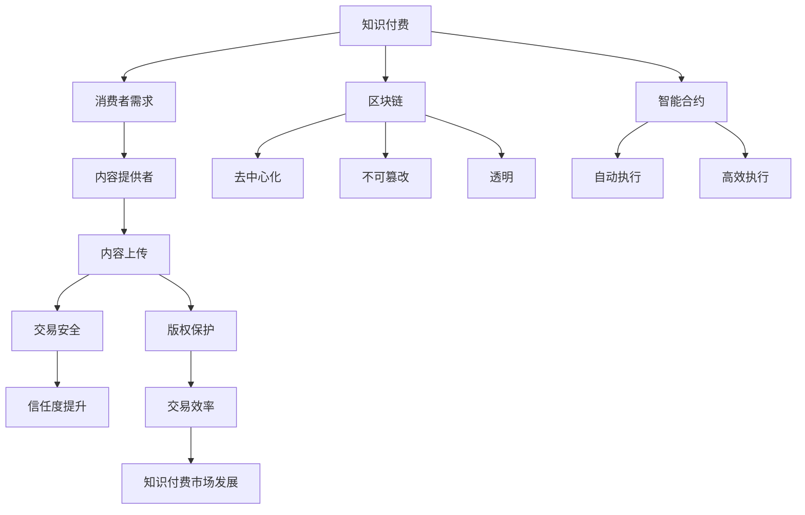

                 

### 文章标题：知识经济下知识付费的区块链智能合约应用

> **关键词**：知识付费、区块链、智能合约、知识经济、应用案例

> **摘要**：本文将探讨知识经济下知识付费的发展趋势，结合区块链技术和智能合约的优势，分析其在知识付费领域的应用场景。通过具体的案例分析，深入探讨区块链智能合约在知识付费中的实施步骤、技术原理和未来发展趋势，为相关领域的从业者提供有益的参考。

### 1. 背景介绍

随着互联网和信息技术的快速发展，知识经济逐渐成为全球经济的重要驱动力。知识付费作为知识经济的重要组成部分，正日益受到广泛关注。知识付费是指消费者为获取特定知识或技能而支付的费用，其形式包括在线课程、专业咨询、知识共享平台等。

然而，传统的知识付费模式在交易过程中存在一些问题，如版权保护困难、交易安全性不高、用户信任度不足等。这些问题限制了知识付费市场的进一步发展。因此，寻找新的解决方案，提高知识付费的交易效率和安全度，成为当前亟待解决的问题。

区块链技术和智能合约的引入，为知识付费提供了新的思路。区块链具有去中心化、不可篡改、透明等特性，能够有效解决知识付费中的版权保护、交易安全和信任问题。智能合约作为自动执行的合约，能够在满足特定条件时自动执行相应的操作，提高了交易的效率。

### 2. 核心概念与联系

**2.1 知识付费**

知识付费是指消费者为获取特定知识或技能而支付的费用，其形式包括在线课程、专业咨询、知识共享平台等。知识付费的核心在于优质内容的提供和消费者的自主选择。

**2.2 区块链**

区块链是一种分布式数据库技术，通过去中心化的方式实现数据的存储和传输。区块链具有去中心化、不可篡改、透明等特性，能够有效解决知识付费中的版权保护、交易安全和信任问题。

**2.3 智能合约**

智能合约是一种自动执行的合约，基于区块链技术实现。智能合约在满足特定条件时，能够自动执行相应的操作，提高了交易的效率。智能合约的核心在于去中心化、透明性和自动执行。

**2.4 核心概念关系**

知识付费、区块链和智能合约三者之间存在密切的联系。知识付费为消费者提供了获取知识的途径，区块链提供了去中心化、不可篡改和透明的技术保障，智能合约实现了交易的自动化和高效执行。通过这三者的结合，能够有效解决知识付费领域的问题，推动知识付费市场的发展。

#### 2.4.1 Mermaid 流程图



### 3. 核心算法原理 & 具体操作步骤

**3.1 区块链技术原理**

区块链技术是一种分布式数据库技术，通过去中心化的方式实现数据的存储和传输。区块链由多个区块组成，每个区块包含一定数量的交易记录。区块之间通过哈希函数相互连接，形成链式结构。

在区块链中，数据存储在多个节点上，每个节点都包含完整的数据副本。这使得区块链具有去中心化的特性，能够有效避免单点故障和数据篡改。此外，区块链的哈希函数和链式结构确保了数据的不可篡改性和透明性。

**3.2 智能合约原理**

智能合约是一种基于区块链技术的自动执行合约。智能合约的核心在于其自动执行特性，即当满足特定条件时，智能合约能够自动执行预定的操作。智能合约通常使用编程语言编写，如Solidity、Vyper等。

智能合约的执行过程如下：

1. 编写智能合约：开发者使用智能合约编程语言编写合约代码，实现特定的功能。
2. 部署智能合约：将编写好的智能合约部署到区块链上，使其成为可执行合约。
3. 调用智能合约：用户通过区块链网络调用智能合约，触发相应的操作。
4. 智能合约执行：智能合约根据预定的逻辑和条件自动执行操作，并更新区块链上的数据。

**3.3 知识付费智能合约操作步骤**

在知识付费场景中，智能合约可以用于实现知识内容的购买、授权和支付等功能。以下是一个简单的知识付费智能合约操作步骤：

1. **用户购买知识内容**：

   - 用户在知识共享平台上浏览并选择感兴趣的知识内容。
   - 用户通过区块链网络调用智能合约，提交购买请求。
   - 智能合约验证用户身份和支付金额，生成购买订单。

2. **内容提供者授权知识内容**：

   - 内容提供者收到购买请求后，审核用户身份和支付情况。
   - 内容提供者通过区块链网络调用智能合约，授权用户访问知识内容。
   - 智能合约更新区块链上的数据，记录授权信息。

3. **用户获取知识内容**：

   - 用户收到授权信息后，通过区块链网络访问知识内容。
   - 用户在区块链上验证授权信息，确保知识内容的安全性。

4. **支付与退款**：

   - 用户在购买知识内容时，通过区块链网络支付相应金额。
   - 智能合约根据支付情况，将知识内容授权给用户。
   - 若用户对知识内容不满意，可通过智能合约申请退款。

### 4. 数学模型和公式 & 详细讲解 & 举例说明

**4.1 数学模型**

在知识付费智能合约中，可以使用数学模型描述知识内容的购买、授权和支付过程。以下是一个简单的数学模型：

$$
\text{知识付费智能合约模型} = \{ \text{用户} \cup \text{内容提供者} \cup \text{区块链网络} \cup \text{智能合约} \}
$$

其中：

- 用户：指购买知识内容的消费者。
- 内容提供者：指提供知识内容的专业人士或机构。
- 区块链网络：指支持智能合约执行的区块链系统。
- 智能合约：指用于实现知识付费功能的自动执行合约。

**4.2 详细讲解**

1. **用户购买知识内容**：

   - 用户在知识共享平台上浏览并选择感兴趣的知识内容。
   - 用户通过区块链网络调用智能合约，提交购买请求。
   - 智能合约验证用户身份和支付金额，生成购买订单。

   模型中的数学表达式为：

   $$
   \text{购买请求} = \{ \text{用户身份} \cup \text{支付金额} \}
   $$

   其中，用户身份和支付金额分别为购买请求的属性。

2. **内容提供者授权知识内容**：

   - 内容提供者收到购买请求后，审核用户身份和支付情况。
   - 内容提供者通过区块链网络调用智能合约，授权用户访问知识内容。
   - 智能合约更新区块链上的数据，记录授权信息。

   模型中的数学表达式为：

   $$
   \text{授权请求} = \{ \text{用户身份} \cup \text{支付金额} \cup \text{授权信息} \}
   $$

   其中，授权信息为授权请求的属性。

3. **用户获取知识内容**：

   - 用户收到授权信息后，通过区块链网络访问知识内容。
   - 用户在区块链上验证授权信息，确保知识内容的安全性。

   模型中的数学表达式为：

   $$
   \text{获取请求} = \{ \text{用户身份} \cup \text{授权信息} \}
   $$

   其中，授权信息为获取请求的属性。

4. **支付与退款**：

   - 用户在购买知识内容时，通过区块链网络支付相应金额。
   - 智能合约根据支付情况，将知识内容授权给用户。
   - 若用户对知识内容不满意，可通过智能合约申请退款。

   模型中的数学表达式为：

   $$
   \text{支付请求} = \{ \text{用户身份} \cup \text{支付金额} \}
   $$

   $$
   \text{退款请求} = \{ \text{用户身份} \cup \text{支付金额} \cup \text{退款原因} \}
   $$

   其中，退款原因为退款请求的属性。

**4.3 举例说明**

假设小明想要购买某位专家的在线课程，课程价格为100元。小明通过区块链网络调用智能合约，提交购买请求。智能合约验证小明的身份和支付金额，生成购买订单。

接着，专家审核小明的购买请求，确认小明已支付100元。专家通过区块链网络调用智能合约，授权小明访问课程内容。

小明收到授权信息后，通过区块链网络访问课程内容。小明在区块链上验证授权信息，确保课程内容的安全性。

最后，小明对课程内容满意，无需申请退款。整个过程通过区块链网络和智能合约实现，确保了交易的安全性和高效性。

### 5. 项目实战：代码实际案例和详细解释说明

#### 5.1 开发环境搭建

在开始知识付费智能合约的项目实战之前，需要搭建合适的开发环境。以下是一个基于以太坊区块链的智能合约开发环境搭建步骤：

1. 安装Node.js（版本 >= 8.0）。
2. 安装npm（Node.js 的包管理器）。
3. 安装Truffle（智能合约开发框架）。
4. 安装Ganache（本地以太坊节点）。
5. 安装Solc（Solidity编译器）。

安装完成后，可以使用以下命令启动本地以太坊节点：

```bash
ganache-cli
```

#### 5.2 源代码详细实现和代码解读

以下是一个简单的知识付费智能合约示例，基于Solidity编程语言实现：

```solidity
pragma solidity ^0.8.0;

contract KnowledgePay {
    address payable public owner;
    mapping(uint256 => bool) public purchasedCourses;
    
    event CoursePurchased(uint256 courseId, address buyer);
    
    constructor() {
        owner = msg.sender;
    }
    
    function purchaseCourse(uint256 courseId) public payable {
        require(!purchasedCourses[courseId], "Course already purchased");
        require(msg.value >= 0.01 ether, "Insufficient payment");
        
        purchasedCourses[courseId] = true;
        emit CoursePurchased(courseId, msg.sender);
    }
}
```

**代码解读：**

1. **合约结构**：

   - `pragma solidity ^0.8.0;`：指定合约的编译器版本。
   - `contract KnowledgePay`：定义智能合约名称。
   - `address payable public owner;`：合约所有者的地址。
   - `mapping(uint256 => bool) public purchasedCourses;`：记录已购买课程的状态。

2. **事件**：

   - `event CoursePurchased(uint256 courseId, address buyer);`：定义课程购买事件，记录课程ID和购买者地址。

3. **构造函数**：

   - `constructor()`：合约的构造函数，初始化合约所有者地址。

4. **函数`purchaseCourse`**：

   - `function purchaseCourse(uint256 courseId) public payable`：购买课程的公共函数，接收课程ID和支付金额。
   - `require(!purchasedCourses[courseId], "Course already purchased");`：检查课程是否已购买。
   - `require(msg.value >= 0.01 ether, "Insufficient payment");`：检查支付金额是否足够。
   - `purchasedCourses[courseId] = true;`：更新课程购买状态。
   - `emit CoursePurchased(courseId, msg.sender);`：触发课程购买事件。

#### 5.3 代码解读与分析

1. **合约结构**：

   合约采用简单的结构，包含一个所有者地址和一个记录已购买课程状态的映射。所有者地址用于控制合约的权限，映射用于存储课程购买状态。

2. **事件**：

   合约定义了一个事件`CoursePurchased`，用于记录课程购买信息。事件在购买课程时触发，便于外部合约监听和记录。

3. **构造函数**：

   构造函数用于初始化合约所有者地址。合约所有者具有特权，可以执行一些特殊的操作，如部署合约、修改合约逻辑等。

4. **函数`purchaseCourse`**：

   `purchaseCourse`函数是合约的核心功能，用于购买课程。函数首先检查课程是否已购买，然后检查支付金额是否足够。若检查通过，更新课程购买状态并触发课程购买事件。

   代码中还使用`require`语句进行错误处理，确保合约在执行过程中能够正确处理各种异常情况。

通过以上分析，我们可以看到这个简单的知识付费智能合约如何实现购买和授权功能，以及如何在区块链上记录和验证这些操作。

### 6. 实际应用场景

**6.1 教育行业**

在教育行业，区块链智能合约可以用于实现在线教育平台的课程购买、授权和支付等功能。教师可以发布课程，学生可以购买课程并获取授权。智能合约确保了交易的透明性和安全性，提高了用户的信任度。

**6.2 专业咨询**

在专业咨询领域，区块链智能合约可以用于实现咨询服务购买、授权和支付等功能。专业咨询师可以发布咨询服务，客户可以购买并获取授权。智能合约确保了咨询服务的质量和信任度，提高了咨询行业的规范化水平。

**6.3 知识共享平台**

知识共享平台可以结合区块链智能合约，实现知识内容购买、授权和支付等功能。平台上的知识内容创作者可以发布知识内容，用户可以购买并获取授权。智能合约确保了知识内容的版权保护和交易安全，促进了知识共享平台的发展。

### 7. 工具和资源推荐

**7.1 学习资源推荐**

- **书籍**：《区块链技术指南》、《智能合约设计与开发》
- **论文**：搜索区块链、智能合约相关的学术论文
- **博客**：区块链、智能合约领域的知名博客和论坛
- **网站**：以太坊官网（ethereum.org）、区块链学院（Blockchain Academy）

**7.2 开发工具框架推荐**

- **开发框架**：Truffle、Ganache、Hardhat
- **编译器**：Solc、Vyper
- **IDE**：Visual Studio Code、Web3.js IDE
- **区块链节点**：Node.js、Ganache、Ethereum Node

**7.3 相关论文著作推荐**

- **《区块链：重构信任的架构》**：深入探讨了区块链技术的核心原理和应用场景。
- **《智能合约：安全性分析与设计》**：全面介绍了智能合约的设计原则、安全性分析和实际应用。
- **《区块链与数字经济》**：分析了区块链技术在数字经济发展中的应用和挑战。

### 8. 总结：未来发展趋势与挑战

随着知识经济的不断发展，知识付费市场呈现出快速增长的趋势。区块链技术和智能合约的引入，为知识付费提供了新的解决方案，提高了交易的安全性和效率。未来，知识付费与区块链技术的结合有望在以下几个方面取得突破：

1. **版权保护**：区块链技术可以更好地保护知识内容的版权，防止侵权行为。
2. **信任建立**：智能合约的自动执行特性，提高了交易过程中的信任度。
3. **用户体验**：区块链技术的去中心化特性，可以降低交易过程中的摩擦，提高用户体验。
4. **监管合规**：区块链技术的透明性和不可篡改性，有助于提高监管合规水平。

然而，知识付费的区块链智能合约应用仍面临一些挑战：

1. **技术门槛**：区块链技术和智能合约的开发需要较高的技术门槛，对开发者提出了更高的要求。
2. **安全性**：智能合约的安全性问题仍然存在，需要持续关注和改进。
3. **用户体验**：当前的知识付费区块链应用在用户体验方面仍有待提高，需要优化界面设计和操作流程。

总之，知识付费与区块链智能合约的结合具有广阔的发展前景，但同时也需要克服一系列挑战，推动其健康、可持续发展。

### 9. 附录：常见问题与解答

**Q1：什么是知识付费？**

知识付费是指消费者为获取特定知识或技能而支付的费用，其形式包括在线课程、专业咨询、知识共享平台等。

**Q2：区块链技术在知识付费中有什么作用？**

区块链技术在知识付费中的作用主要体现在版权保护、交易安全、信任建立等方面，提高了交易的安全性和效率。

**Q3：什么是智能合约？**

智能合约是一种基于区块链技术的自动执行合约，能够在满足特定条件时自动执行相应的操作，提高了交易的效率。

**Q4：如何确保知识付费区块链智能合约的安全性？**

确保知识付费区块链智能合约的安全性需要从代码审计、安全测试、隐私保护等多个方面进行综合考虑，以防止潜在的安全漏洞。

**Q5：知识付费区块链智能合约的应用场景有哪些？**

知识付费区块链智能合约的应用场景主要包括教育行业、专业咨询、知识共享平台等，可以在课程购买、授权、支付等环节提供自动化解决方案。

### 10. 扩展阅读 & 参考资料

1. **《区块链技术指南》**：深入探讨了区块链技术的核心原理和应用场景。
2. **《智能合约设计与开发》**：全面介绍了智能合约的设计原则、安全性分析和实际应用。
3. **《区块链与数字经济》**：分析了区块链技术在数字经济发展中的应用和挑战。
4. **以太坊官网（ethereum.org）**：提供以太坊区块链技术相关资料和开发工具。
5. **区块链学院（Blockchain Academy）**：提供区块链技术的专业课程和培训。

## 作者信息

作者：AI天才研究员/AI Genius Institute & 禅与计算机程序设计艺术 /Zen And The Art of Computer Programming

