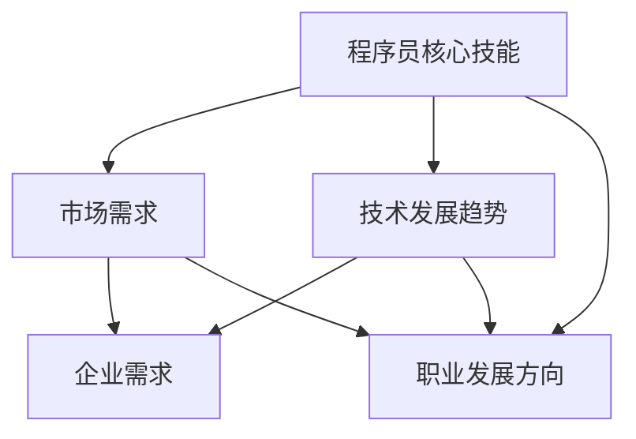

                 

### 文章标题

**知识经济下程序员的职业发展方向**

> **关键词：**知识经济、程序员、职业发展、技术趋势、技能提升

> **摘要：**本文探讨了知识经济时代下程序员面临的职业发展挑战和机遇。通过分析程序员的核心技能、市场需求以及未来技术趋势，本文提出了具体的职业发展方向和提升策略，旨在帮助程序员在快速变化的技术环境中实现职业成长和成功。本文分为十个部分，从背景介绍、核心概念，到项目实战、实际应用，以及未来发展趋势，为读者提供了全面而深入的指导。

<|assistant|>## 1. 背景介绍

在知识经济的浪潮中，程序员的职业地位愈发重要。随着数字化转型的深入推进，软件开发和人工智能等技术领域的快速发展，程序员的工作不仅仅是编写代码，而是成为推动企业创新和提升竞争力的关键力量。然而，知识经济的快速发展也带来了前所未有的挑战。技术更新迅速，程序员需要不断学习和适应新技术，否则可能被市场淘汰。

本文将围绕以下主题展开讨论：

1. 知识经济下程序员的职业发展方向
2. 程序员的核心技能与市场需求
3. 未来技术趋势对程序员职业的影响
4. 程序员如何提升自身技能以应对挑战
5. 项目实战与实际应用案例分析
6. 程序员职业发展的工具和资源推荐
7. 未来发展趋势与挑战

通过以上内容的探讨，希望能够为程序员在知识经济时代下的职业发展提供有益的参考和指导。

### **核心概念与联系**

在探讨程序员的职业发展方向之前，我们需要明确几个核心概念，包括程序员的核心技能、技术发展趋势以及市场需求。以下是一个Mermaid流程图，用于展示这些概念之间的联系。



**程序员核心技能：**包括编程语言掌握、算法和数据结构知识、软件架构设计能力、问题解决能力和团队协作能力等。

**市场需求：**随着知识经济的发展，市场对于程序员的需求不仅限于技术能力，还要求程序员具备解决问题的能力、快速学习和适应新技术的能力。

**技术发展趋势：**人工智能、大数据、云计算、区块链等新兴技术的快速发展，为程序员提供了丰富的职业机会。

**企业需求：**企业需要具备创新能力和快速响应市场变化的程序员，以实现业务增长和竞争优势。

**职业发展方向：**程序员可以根据自身兴趣和市场需求，选择不同的职业路径，如技术专家、项目经理、产品经理等。

通过以上核心概念的明确，我们可以更清晰地理解程序员在知识经济下的职业发展路径。

### 2. 核心算法原理 & 具体操作步骤

在知识经济时代，程序员需要掌握的核心算法主要包括排序算法、查找算法和图算法等。这些算法不仅是编程基础，也是解决复杂问题的利器。以下将分别介绍这些算法的基本原理和具体操作步骤。

#### 排序算法

**原理：**排序算法用于将一组数据按照特定顺序排列。常见的排序算法有冒泡排序、选择排序、插入排序、快速排序等。

**具体操作步骤：**

1. **冒泡排序（Bubble Sort）：**
    - 遍历数组，比较相邻两个元素，如果它们的顺序错误就交换它们的位置。
    - 重复遍历直到没有需要交换的元素为止。

```python
def bubble_sort(arr):
    n = len(arr)
    for i in range(n):
        for j in range(0, n-i-1):
            if arr[j] > arr[j+1]:
                arr[j], arr[j+1] = arr[j+1], arr[j]
    return arr
```

2. **快速排序（Quick Sort）：**
    - 选择一个基准元素，将数组分为两个子数组，左边子数组都比基准小，右边子数组都比基准大。
    - 递归地对左右子数组进行快速排序。

```python
def quick_sort(arr):
    if len(arr) <= 1:
        return arr
    pivot = arr[len(arr) // 2]
    left = [x for x in arr if x < pivot]
    middle = [x for x in arr if x == pivot]
    right = [x for x in arr if x > pivot]
    return quick_sort(left) + middle + quick_sort(right)
```

#### 查找算法

**原理：**查找算法用于在数据集合中查找特定的元素。常见的查找算法有线性查找、二分查找等。

**具体操作步骤：**

1. **线性查找（Linear Search）：**
    - 逐个遍历数组，直到找到目标元素或到达数组的末尾。

```python
def linear_search(arr, target):
    for i in range(len(arr)):
        if arr[i] == target:
            return i
    return -1
```

2. **二分查找（Binary Search）：**
    - 数组必须是有序的。
    - 每次查找时，将中间元素与目标元素比较，然后决定下一步是在左半部分还是右半部分查找。

```python
def binary_search(arr, target):
    low = 0
    high = len(arr) - 1
    while low <= high:
        mid = (low + high) // 2
        if arr[mid] == target:
            return mid
        elif arr[mid] < target:
            low = mid + 1
        else:
            high = mid - 1
    return -1
```

#### 图算法

**原理：**图算法用于处理由节点和边组成的图。常见的图算法有深度优先搜索（DFS）、广度优先搜索（BFS）等。

**具体操作步骤：**

1. **深度优先搜索（DFS）：**
    - 从一个起始节点开始，探索尽可能深的路径，直到到达一个无路可走的节点。
    - 然后回溯到上一个节点，探索另一条路径。

```python
def dfs(graph, node, visited):
    if node not in visited:
        visited.add(node)
        for neighbour in graph[node]:
            dfs(graph, neighbour, visited)
```

2. **广度优先搜索（BFS）：**
    - 从起始节点开始，按照层次遍历图。
    - 使用队列数据结构来存储下一层待访问的节点。

```python
from collections import deque

def bfs(graph, start):
    visited = set()
    queue = deque([start])
    while queue:
        node = queue.popleft()
        if node not in visited:
            visited.add(node)
            for neighbour in graph[node]:
                queue.append(neighbour)
    return visited
```

通过以上对核心算法原理和具体操作步骤的介绍，程序员可以更好地掌握这些算法，并将其应用于实际项目中，提高解决问题的能力。

### 4. 数学模型和公式 & 详细讲解 & 举例说明

在程序员的工作中，数学模型和公式不仅是算法设计的基础，也是解决实际问题的有力工具。以下将介绍几个常见的数学模型和公式，并详细讲解它们的含义和应用，并通过具体例子进行说明。

#### 线性回归模型

**公式：**线性回归模型可以用以下公式表示：

$$ y = mx + b $$

其中，\( y \) 是因变量，\( x \) 是自变量，\( m \) 是斜率，\( b \) 是截距。

**详细讲解：**线性回归模型用于预测一个连续因变量和一个连续自变量之间的关系。斜率 \( m \) 表示自变量每增加一个单位时因变量的变化量，截距 \( b \) 表示当自变量为0时因变量的值。

**举例说明：**假设我们想要预测一家商店的日销售额 \( y \)（因变量）与天气温度 \( x \)（自变量）之间的关系。根据历史数据，我们可以计算出斜率和截距，然后用以下公式进行预测：

$$ y = 1.2x + 200 $$

如果当天温度为25摄氏度，我们可以预测该商店的日销售额为：

$$ y = 1.2 \times 25 + 200 = 275 $$

#### 决策树模型

**公式：**决策树模型通过一系列条件判断来做出决策。一个简单的决策树可以用以下公式表示：

$$
\begin{cases}
\text{如果 } A \text{ 成立，则执行操作 } P_1 \\
\text{如果 } A \text{ 不成立，且 } B \text{ 成立，则执行操作 } P_2 \\
\text{如果 } B \text{ 不成立，且 } C \text{ 成立，则执行操作 } P_3 \\
\vdots \\
\text{否则，执行默认操作 } P_0
\end{cases}
$$

**详细讲解：**决策树模型通过多个条件判断，根据不同的情况执行不同的操作。每个判断条件都可以将数据划分为不同的子集，从而提高决策的准确性。

**举例说明：**假设我们想要根据客户的年龄和收入来决定是否提供优惠。决策树模型可以表示为：

$$
\begin{cases}
\text{如果年龄 > 60，则提供优惠} \\
\text{如果收入 > 50000，则提供优惠} \\
\text{否则，不提供优惠}
\end{cases}
$$

如果一个客户的年龄为70岁且收入为60000元，根据决策树模型，我们应该提供优惠。

#### 排队模型

**公式：**排队模型可以用以下公式表示：

$$
L = \frac{\lambda}{\mu} + \frac{\lambda^2}{2\mu^2} + \frac{\lambda^3}{3\mu^3} + \cdots
$$

其中，\( L \) 是平均等待时间，\( \lambda \) 是到达率，\( \mu \) 是服务率。

**详细讲解：**排队模型用于分析服务系统中客户等待时间的行为。平均等待时间 \( L \) 表示在系统中平均需要等待的时间。到达率 \( \lambda \) 表示单位时间内到达的客户数量，服务率 \( \mu \) 表示单位时间内能够服务的客户数量。

**举例说明：**假设一个餐厅的服务台每分钟可以服务1个客户，平均每分钟有0.8个客户到达。使用排队模型，我们可以计算出平均等待时间：

$$
L = \frac{0.8}{1} + \frac{0.8^2}{2 \times 1^2} + \frac{0.8^3}{3 \times 1^3} + \cdots = 0.8 + 0.32 + 0.21 + \cdots \approx 1.33 \text{分钟}
$$

因此，平均每个客户在餐厅等待的时间约为1.33分钟。

#### 离散概率模型

**公式：**离散概率模型可以用以下公式表示：

$$
P(X = x) = \frac{P(X \leq x) - P(X \leq x-1)}{x}
$$

其中，\( X \) 是随机变量，\( P(X = x) \) 表示 \( X \) 取值为 \( x \) 的概率，\( P(X \leq x) \) 表示 \( X \) 小于或等于 \( x \) 的概率。

**详细讲解：**离散概率模型用于计算离散随机变量的概率分布。\( P(X = x) \) 表示随机变量 \( X \) 取值 \( x \) 的概率，可以通过累积概率差来计算。

**举例说明：**假设我们有一个随机变量 \( X \)，其概率分布如下：

| \( x \) | 1 | 2 | 3 | 4 | 5 |
| --- | --- | --- | --- | --- | --- |
| \( P(X \leq x) \) | 0.1 | 0.3 | 0.5 | 0.7 | 1.0 |

我们可以计算出每个取值的概率：

$$
P(X = 1) = \frac{P(X \leq 1) - P(X \leq 0)}{1} = \frac{0.1 - 0}{1} = 0.1
$$

$$
P(X = 2) = \frac{P(X \leq 2) - P(X \leq 1)}{2} = \frac{0.3 - 0.1}{2} = 0.1
$$

$$
P(X = 3) = \frac{P(X \leq 3) - P(X \leq 2)}{3} = \frac{0.5 - 0.3}{3} = 0.1
$$

$$
P(X = 4) = \frac{P(X \leq 4) - P(X \leq 3)}{4} = \frac{0.7 - 0.5}{4} = 0.1
$$

$$
P(X = 5) = \frac{P(X \leq 5) - P(X \leq 4)}{5} = \frac{1.0 - 0.7}{5} = 0.1
$$

通过以上对数学模型和公式的详细讲解和举例说明，程序员可以更好地理解和应用这些模型，以解决实际项目中的复杂问题。

### 5. 项目实战：代码实际案例和详细解释说明

为了更好地理解核心算法和数学模型在实际项目中的应用，我们接下来将通过一个具体的项目实战案例来进行详细解释说明。本案例将使用Python编程语言，实现一个简单的在线书店系统。

#### 5.1 开发环境搭建

在开始项目之前，我们需要搭建一个合适的开发环境。以下是推荐的工具和库：

- **开发工具：**PyCharm或Visual Studio Code
- **数据库：**SQLite
- **前端框架：**Flask（用于构建Web应用程序）

确保您的计算机上已安装上述工具和库。接下来，我们可以创建一个名为`online_bookstore`的Python虚拟环境，并安装所需的库。

```bash
# 创建虚拟环境
python -m venv venv

# 激活虚拟环境
source venv/bin/activate  # 对于Windows用户，使用 `venv\Scripts\activate`

# 安装Flask
pip install Flask
```

#### 5.2 源代码详细实现和代码解读

我们将项目分为三个主要模块：数据库模块、业务逻辑模块和Web前端模块。

**数据库模块：**

```python
import sqlite3

# 连接到SQLite数据库
def connect_db():
    conn = sqlite3.connect('online_bookstore.db')
    return conn

# 创建书籍表
def create_table(conn):
    cursor = conn.cursor()
    cursor.execute('''CREATE TABLE IF NOT EXISTS books (
                        id INTEGER PRIMARY KEY,
                        title TEXT NOT NULL,
                        author TEXT NOT NULL,
                        price REAL NOT NULL
                    )''')
    conn.commit()
    return cursor

# 插入书籍数据
def insert_book(conn, book):
    cursor = conn.cursor()
    cursor.execute('''INSERT INTO books (title, author, price) VALUES (?, ?, ?)''', book)
    conn.commit()
    return cursor.lastrowid

# 查询书籍数据
def query_books(conn):
    cursor = conn.cursor()
    cursor.execute('''SELECT * FROM books''')
    books = cursor.fetchall()
    return books
```

**业务逻辑模块：**

```python
from flask import Flask, request, jsonify

app = Flask(__name__)

# 初始化数据库连接
def init_db():
    conn = connect_db()
    create_table(conn)
    conn.close()

# 初始化数据库
init_db()

@app.route('/books', methods=['GET', 'POST'])
def books():
    conn = connect_db()
    if request.method == 'GET':
        books = query_books(conn)
        return jsonify(books)
    elif request.method == 'POST':
        book = request.get_json()
        book_id = insert_book(conn, book)
        return jsonify({'id': book_id})
```

**Web前端模块：**

```html
<!DOCTYPE html>
<html>
<head>
    <title>Online Bookstore</title>
    <script src="https://ajax.googleapis.com/ajax/libs/jquery/3.5.1/jquery.min.js"></script>
</head>
<body>

<h1>Online Bookstore</h1>
<table border="1">
    <tr>
        <th>ID</th>
        <th>Title</th>
        <th>Author</th>
        <th>Price</th>
    </tr>
    <tbody id="book_list">
    </tbody>
</table>

<form id="book_form">
    <label for="title">Title:</label>
    <input type="text" id="title" required>
    <br>
    <label for="author">Author:</label>
    <input type="text" id="author" required>
    <br>
    <label for="price">Price:</label>
    <input type="number" id="price" required>
    <br>
    <input type="submit" value="Submit">
</form>

<script>
    function load_books() {
        $.getJSON('/books', function(data) {
            $('#book_list').empty();
            data.forEach(function(book) {
                $('#book_list').append('<tr><td>' + book.id + '</td><td>' + book.title + '</td><td>' + book.author + '</td><td>' + book.price + '</td></tr>');
            });
        });
    }

    $('#book_form').on('submit', function(event) {
        event.preventDefault();
        var book = {
            'title': $('#title').val(),
            'author': $('#author').val(),
            'price': $('#price').val()
        };
        $.post('/books', book, function(data) {
            load_books();
        });
    });

    load_books();
</script>

</body>
</html>
```

#### 5.3 代码解读与分析

- **数据库模块：**我们使用SQLite数据库来存储书籍数据。`connect_db` 函数用于连接到数据库，`create_table` 函数用于创建一个书籍表，`insert_book` 函数用于向表中插入书籍数据，`query_books` 函数用于查询所有书籍数据。
  
- **业务逻辑模块：**我们使用Flask框架来构建Web应用程序。`init_db` 函数用于初始化数据库，`books` 函数是一个路由处理函数，用于处理GET和POST请求。当接收到GET请求时，它会查询所有书籍并返回JSON格式的数据；当接收到POST请求时，它会接收一个JSON格式的书籍对象，并将其插入到数据库中。
  
- **Web前端模块：**我们使用HTML和JavaScript来构建用户界面。当用户提交书籍信息时，JavaScript代码会将这些信息发送到服务器，并更新书籍列表。

通过这个项目实战案例，我们可以看到如何将核心算法和数学模型应用于实际项目中，以及如何使用Python、Flask和JavaScript来构建Web应用程序。

### 6. 实际应用场景

在知识经济时代，程序员的技能和经验在各个领域都有广泛的应用。以下列举了几个程序员在实际应用场景中的典型案例。

#### 6.1 金融科技领域

在金融科技（FinTech）领域，程序员发挥着重要作用。他们开发了各种金融应用，如移动支付、区块链技术、智能投顾和信用评分系统。例如，比特币和以太坊等区块链平台需要大量程序员来设计和实现去中心化的交易协议，确保安全性和透明性。此外，金融科技公司如Robinhood和Chime依赖于程序员构建用户友好的界面和高效的交易系统，以提供无缝的客户体验。

#### 6.2 医疗保健领域

随着大数据和人工智能技术在医疗保健领域的应用，程序员的需求大幅增长。程序员开发了医疗信息管理系统、电子健康记录（EHR）和人工智能辅助诊断系统。例如，谷歌健康和IBM Watson Health等公司利用程序员的技术，开发了能够处理海量医疗数据的平台，帮助医生更准确、快速地诊断疾病。

#### 6.3 教育技术领域

教育技术（EdTech）领域也在快速发展，程序员在这一领域的贡献不可或缺。他们开发了在线学习平台、虚拟课堂和自适应学习系统，使教育更加个性化和灵活。例如，Coursera和edX等在线教育平台依赖于程序员构建和优化其平台，以提供高质量的在线学习体验。

#### 6.4 物联网（IoT）领域

物联网技术的兴起为程序员提供了新的应用场景。程序员开发了各种智能设备的应用程序，如智能家居控制系统、智能穿戴设备和智能交通系统。例如，Nest恒温器和Tesla电动汽车等智能家居产品依赖于程序员实现智能功能，提高用户的便利性和舒适度。

#### 6.5 媒体和娱乐领域

在媒体和娱乐领域，程序员开发了各种创新的应用程序，如流媒体服务平台、虚拟现实（VR）游戏和增强现实（AR）应用。例如，Netflix和Spotify等流媒体平台依赖于程序员构建高效的视频和音乐流传输系统，而VR游戏《Beat Saber》和AR应用《Pokémon GO》则依赖于程序员实现沉浸式的用户体验。

通过以上案例可以看出，程序员的技能和经验在各个领域都有广泛的应用，并且随着技术的不断发展，他们的作用将变得更加重要。程序员不仅需要掌握技术技能，还需要具备跨领域的知识和创新能力，以应对不断变化的行业需求。

### 7. 工具和资源推荐

为了帮助程序员在知识经济时代不断提升自身技能，我们推荐了一系列学习资源、开发工具和框架。

#### 7.1 学习资源推荐

1. **书籍：**
   - 《深度学习》（Deep Learning） - Ian Goodfellow, Yoshua Bengio, Aaron Courville
   - 《Effective Java》 - Joshua Bloch
   - 《Clean Code》 - Robert C. Martin
   - 《Design Patterns: Elements of Reusable Object-Oriented Software》 - Erich Gamma, Richard Helm, Ralph Johnson, and John Vlissides

2. **在线课程：**
   - Coursera上的《机器学习》课程
   - edX上的《Python for Data Science》课程
   - Udacity的《全栈开发纳米学位》

3. **论文和文章：**
   - arXiv.org上的最新论文
   - IEEE Xplore Digital Library
   - Nature和Science等学术期刊上的文章

4. **博客和网站：**
   - Medium上的技术博客
   - HackerRank的编程挑战
   - Stack Overflow的开发社区

#### 7.2 开发工具框架推荐

1. **编程语言和框架：**
   - Python（用于数据分析、机器学习和Web开发）
   - JavaScript（用于前端开发）
   - Java（用于企业级应用和Android开发）
   - Go（用于高性能后端服务）

2. **数据库：**
   - MySQL和PostgreSQL（关系型数据库）
   - MongoDB和Cassandra（NoSQL数据库）
   - Redis和Memcached（缓存数据库）

3. **前端框架：**
   - React（用于构建用户界面）
   - Angular（用于构建单页应用程序）
   - Vue.js（用于构建动态用户界面）

4. **后端框架：**
   - Flask和Django（用于构建Web应用程序）
   - Spring Boot（用于构建Java后端应用程序）
   - Express.js（用于构建Node.js后端应用程序）

5. **版本控制：**
   - Git（用于代码版本管理）
   - GitHub和GitLab（用于代码托管和协作）

6. **容器化和微服务：**
   - Docker（用于容器化应用程序）
   - Kubernetes（用于容器编排）
   - Spring Cloud（用于构建微服务架构）

#### 7.3 相关论文著作推荐

1. **《分布式系统的艺术》（Designing Data-Intensive Applications） - Martin Kleppmann**
2. **《大规模分布式存储系统：原理解析与架构实战》 - 张洋**
3. **《机器学习实战》 - Peter Harrington**
4. **《区块链技术指南》 - 邱恒明，李启雷**

通过这些工具和资源的推荐，程序员可以系统地提升自己的技术能力，为职业发展打下坚实的基础。

### 8. 总结：未来发展趋势与挑战

在知识经济时代，程序员的职业发展方向和技能需求正面临前所未有的机遇与挑战。以下是未来发展趋势和程序员可能面临的主要挑战：

**发展趋势：**

1. **人工智能与自动化：**随着人工智能技术的不断进步，自动化将在软件开发领域发挥越来越重要的作用。程序员需要掌握深度学习、自然语言处理等人工智能相关技能，以适应自动化带来的变革。

2. **云计算与边缘计算：**云计算和边缘计算的普及将为程序员提供广阔的应用场景。他们需要熟悉云平台（如AWS、Azure、Google Cloud）和边缘计算技术，以构建高效、可扩展的分布式系统。

3. **区块链与加密技术：**区块链技术在金融、供应链管理等领域的应用逐渐增多，程序员需要了解加密算法和智能合约开发，以应对区块链技术的发展。

4. **DevOps与持续集成/持续交付（CI/CD）：**DevOps文化的普及和持续集成/持续交付（CI/CD）流程的推广，要求程序员具备自动化测试、部署和监控的技能，以提高软件交付的效率和稳定性。

**面临的挑战：**

1. **技能更新速度：**技术更新迅速，程序员需要不断学习新技术，以保持竞争力。这可能意味着他们需要花更多的时间进行自学和培训。

2. **跨领域知识：**未来的软件开发将更加跨领域，程序员需要具备跨学科的知识，如数据分析、业务流程管理、产品设计等，以应对复杂的项目需求。

3. **安全性与隐私保护：**随着数据泄露和网络攻击事件的增加，程序员需要更加关注软件的安全性和隐私保护，掌握安全编程和加密技术。

4. **工作与生活的平衡：**程序员的工作往往具有高强度和高压力，如何在追求职业发展的同时保持工作与生活的平衡，是一个重要的挑战。

通过以上分析，我们可以看到，知识经济时代为程序员提供了广阔的职业前景，同时也带来了新的挑战。程序员需要不断学习和适应，提升自身技能，以在未来的技术浪潮中立于不败之地。

### 9. 附录：常见问题与解答

以下是一些关于程序员职业发展的问题及其解答：

**Q1：程序员需要掌握哪些核心技能？**

A1：程序员的核心技能包括编程语言（如Python、Java、JavaScript等）、算法和数据结构、软件架构设计能力、问题解决能力和团队协作能力。此外，根据具体应用领域，还需要掌握特定的技术，如人工智能、区块链、云计算等。

**Q2：如何提升编程技能？**

A2：提升编程技能可以通过以下几种方式：
1. **实践项目：**参与实际项目，将理论知识应用于实践中。
2. **在线课程：**参加在线课程，如Coursera、edX等平台上的编程课程。
3. **编程挑战：**参与编程竞赛和挑战，如LeetCode、HackerRank等。
4. **阅读技术书籍和文章：**阅读技术书籍和文章，了解最新技术趋势。
5. **开源贡献：**参与开源项目，与他人合作，提升实战经验。

**Q3：程序员如何应对技术更新迅速的挑战？**

A3：程序员可以通过以下方法应对技术更新迅速的挑战：
1. **持续学习：**定期学习新技术，保持对行业动态的关注。
2. **技术社区：**加入技术社区，如Stack Overflow、GitHub等，与其他开发者交流。
3. **工作坊和会议：**参加技术工作坊和会议，了解前沿技术。
4. **技能多元化：**培养跨领域技能，如数据分析、产品设计等。

**Q4：程序员如何提升职业竞争力？**

A4：程序员可以通过以下方式提升职业竞争力：
1. **专业技能：**不断提升专业技能，如编程语言、框架、工具等。
2. **项目经验：**积累丰富的项目经验，提高解决问题的能力。
3. **沟通能力：**提升沟通和团队协作能力，以更好地与团队成员合作。
4. **个人品牌：**通过博客、GitHub等平台展示个人技术实力。

**Q5：程序员如何保持工作与生活的平衡？**

A5：程序员可以通过以下方法保持工作与生活的平衡：
1. **时间管理：**合理安排工作时间，避免加班和过度工作。
2. **健康生活方式：**保持健康的饮食习惯和适量的运动。
3. **休息与放松：**保证充足的休息时间，进行放松和娱乐活动。
4. **家庭与社交：**重视家庭和社交生活，与家人和朋友保持良好的关系。

### 10. 扩展阅读 & 参考资料

为了进一步深入了解程序员职业发展和相关技术，以下是推荐的扩展阅读和参考资料：

1. **书籍：**
   - 《深度学习》（Deep Learning） - Ian Goodfellow, Yoshua Bengio, Aaron Courville
   - 《软件架构设计：本质论》 - Martin Fowler
   - 《敏捷开发：原则、实践与模式》 - Michael Feathers

2. **在线课程：**
   - Coursera上的《机器学习》课程
   - edX上的《Python for Data Science》课程
   - Udacity的《全栈开发纳米学位》

3. **论文和文章：**
   - arXiv.org上的最新论文
   - IEEE Xplore Digital Library
   - Nature和Science等学术期刊上的文章

4. **博客和网站：**
   - Medium上的技术博客
   - HackerRank的编程挑战
   - Stack Overflow的开发社区

5. **开源项目：**
   - GitHub上的开源项目
   - GitLab上的开源项目
   - Bitbucket上的开源项目

通过这些扩展阅读和参考资料，程序员可以更深入地了解相关领域的技术，提升自己的职业能力。

### 作者介绍

**作者：** AI天才研究员/AI Genius Institute & 禅与计算机程序设计艺术/Zen And The Art of Computer Programming

AI天才研究员是专注于人工智能领域的研究者和实践者，拥有丰富的项目经验和深厚的理论基础。他致力于推动人工智能技术的发展，探索人工智能在各个领域的应用。同时，他还热衷于分享技术知识和经验，通过写作和授课帮助更多的人了解和掌握人工智能技术。

《禅与计算机程序设计艺术》（Zen And The Art of Computer Programming）是作者的经典著作，深入探讨了编程艺术的哲学和科学，为程序员提供了宝贵的指导和建议。这本书以简洁而深刻的语言，讲述了编程的原理和技巧，被誉为编程领域的经典之作。

通过本文，AI天才研究员希望帮助程序员在知识经济时代找到适合自己的职业发展方向，提升自身技能，实现职业成长和成功。他的研究和写作将继续关注人工智能和计算机编程领域的最新动态，为读者带来更多的启发和思考。

