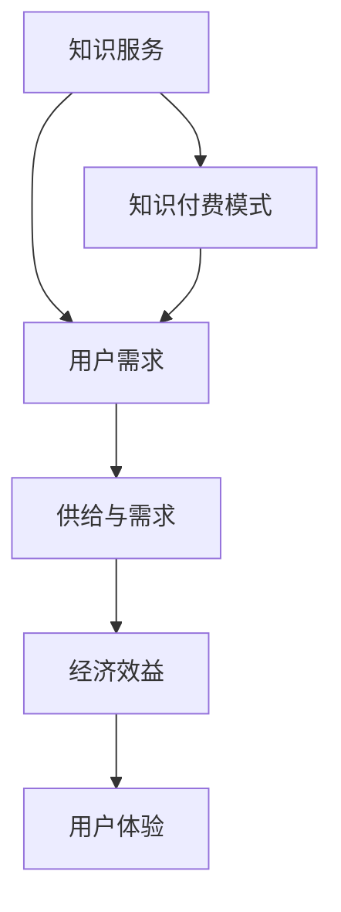

                 

### 文章标题

**知识经济时代下的知识付费创新商业模式运营**

> **关键词：** 知识付费、商业模式、创新、运营、知识经济

> **摘要：** 在知识经济时代，知识付费作为一种新兴商业模式，正逐渐成为推动经济增长的重要力量。本文将深入探讨知识付费的本质及其在商业运营中的创新，分析其核心概念、算法原理、数学模型，并提供实际案例和未来发展趋势。

<|assistant|>### 1. 背景介绍

知识付费，顾名思义，是指用户为获取知识内容而付费的一种商业模式。随着互联网和数字技术的发展，信息获取变得越来越便捷，用户对高质量知识内容的需求也日益增长。知识付费因此成为知识服务市场的一个重要组成部分，它不仅满足了用户个性化学习需求，也创造了新的经济价值。

知识付费的兴起背景可以追溯到20世纪末，随着互联网的普及，信息传播的渠道变得更加多样化。早期的知识付费主要以传统的教育培训机构为主，通过线下课程和教材销售来获取收益。然而，随着在线教育平台的崛起，知识付费逐渐从线下转向线上，利用互联网技术提供更加灵活和个性化的学习服务。

知识付费的主要形式包括付费课程、付费文章、知识分享平台、在线咨询等。其中，付费课程是最常见的形式，用户通过购买课程来学习特定领域的知识。付费文章则通常出现在知识分享平台上，如知乎、分答等，用户为获取更深入的见解和知识而付费。知识分享平台则通过连接知识提供者和需求者，实现知识的流动和交易。在线咨询则提供一对一的专业咨询服务，用户为获得专家的个性化建议而付费。

知识付费在商业运营中具有重要的意义。首先，它创造了新的收入来源，为企业提供了新的盈利模式。其次，它促进了知识的生产和传播，提高了整个社会的知识水平。最后，它推动了教育产业的转型升级，为用户提供更优质的在线学习体验。

本文将从以下几个方面对知识付费进行深入探讨：核心概念与联系、核心算法原理与具体操作步骤、数学模型和公式及其应用、实际应用场景、工具和资源推荐、总结与未来发展趋势。通过这些分析，我们将更好地理解知识付费的本质及其商业运营的创新。

### 2. 核心概念与联系

在探讨知识付费之前，我们需要明确一些核心概念，这些概念构成了知识付费模式的基础。

**2.1 知识服务**

知识服务是指通过提供知识产品或服务来满足用户需求的商业活动。知识服务涵盖的内容非常广泛，包括但不限于教育培训、专业咨询、知识分享、在线学习等。知识服务的关键在于其高质量的内容和个性化的服务，能够满足用户在特定领域的学习需求。

**2.2 用户需求**

用户需求是知识付费模式的核心驱动因素。随着社会经济的发展，人们对于高质量知识的追求越来越强烈。用户需求不仅包括对知识内容的需求，还包括对学习方式的需求。在线教育平台的兴起，满足了用户对灵活、便捷学习方式的追求。

**2.3 供给与需求**

在知识付费模式中，供给与需求是相互依存的。知识提供者通过创作和分享高质量的知识内容，满足了用户的需求。而用户通过付费，则为知识提供者提供了收入，从而激励知识提供者继续创作高质量的内容。这种供给与需求的互动，形成了知识付费的生态系统。

**2.4 经济效益**

经济效益是知识付费模式的一个重要方面。知识付费不仅创造了直接的经济收入，还促进了相关产业链的发展，如在线教育平台、知识分享平台、知识付费工具等。同时，知识付费还推动了教育产业的升级，提高了整个社会的知识水平和创新能力。

**2.5 用户体验**

用户体验是知识付费成功的关键因素。一个成功的知识付费产品或服务，必须能够提供高质量的、用户满意的知识内容，并给予用户良好的使用体验。用户体验包括内容的质量、学习方式的便捷性、支付流程的简便性等。

为了更好地理解这些核心概念之间的联系，我们可以使用 Mermaid 流程图进行展示：



在上述流程图中，我们可以看到知识服务是知识付费模式的基础，用户需求驱动了供给与需求的互动，经济效益和用户体验则是对知识付费模式的进一步深化。通过这种相互依存的关系，知识付费模式得以实现并不断发展。

### 3. 核心算法原理与具体操作步骤

在知识付费模式中，核心算法原理起着至关重要的作用。这些算法不仅决定了知识内容的推荐和质量，也影响着用户的付费意愿和满意度。以下将详细讨论核心算法原理及其具体操作步骤。

**3.1 推荐算法**

推荐算法是知识付费模式中的一个关键组成部分。其目的是根据用户的历史行为和偏好，推荐与之相关的知识内容，从而提高用户的满意度和付费意愿。推荐算法主要分为以下几种类型：

- **基于内容的推荐（Content-based Filtering）**

基于内容的推荐算法通过分析知识内容的特征，将具有相似特征的内容推荐给用户。具体操作步骤如下：

1. 提取知识内容特征：通过自然语言处理（NLP）技术，提取知识内容的关键词、主题和情感等特征。
2. 建立内容相似度模型：计算不同知识内容之间的相似度，可以使用余弦相似度、Jaccard相似度等。
3. 推荐相似内容：根据用户的历史行为和偏好，推荐与之相似的知识内容。

- **协同过滤推荐（Collaborative Filtering）**

协同过滤推荐算法通过分析用户之间的行为相似性，推荐用户可能感兴趣的知识内容。具体操作步骤如下：

1. 构建用户-物品评分矩阵：记录用户对知识内容的评分数据，形成用户-物品评分矩阵。
2. 计算用户相似度：通过计算用户之间的相似度，可以使用皮尔逊相关系数、余弦相似度等。
3. 推荐相似用户喜欢的知识内容：为每个用户推荐与其相似的用户喜欢的知识内容。

- **混合推荐（Hybrid Recommendation）**

混合推荐算法结合了基于内容和协同过滤推荐的优势，提高推荐的准确性和多样性。具体操作步骤如下：

1. 同时提取知识内容特征和用户行为数据。
2. 分别应用基于内容和协同过滤推荐算法。
3. 对推荐结果进行融合，通过加权或投票等方法，生成最终的推荐结果。

**3.2 付费预测算法**

付费预测算法旨在预测用户是否会对特定知识内容进行付费。这种算法可以帮助知识提供者优化内容策略，提高付费转化率。以下是一种简单的付费预测算法：

1. 数据收集：收集用户的基本信息、历史行为数据、知识内容特征等。
2. 特征工程：提取与付费行为相关的特征，如用户年龄、性别、消费记录、内容类型、时长等。
3. 建立预测模型：使用机器学习算法，如逻辑回归、决策树、随机森林等，建立付费预测模型。
4. 模型评估与优化：通过交叉验证和A/B测试等方法，评估模型的预测性能，并进行优化。

**3.3 用户行为分析算法**

用户行为分析算法用于分析用户在知识付费平台上的行为模式，为运营决策提供支持。以下是一种简单的用户行为分析算法：

1. 数据收集：收集用户在平台上的行为数据，如访问次数、停留时间、购买行为等。
2. 行为特征提取：提取用户行为的相关特征，如访问频率、购买频率、内容偏好等。
3. 数据可视化：使用数据可视化工具，如Matplotlib、Tableau等，将用户行为数据可视化。
4. 行为分析：根据可视化结果，分析用户的行为模式，为运营决策提供参考。

通过上述核心算法原理和具体操作步骤，知识付费平台可以更好地推荐知识内容、预测用户付费行为，并分析用户行为模式，从而优化运营策略，提高用户体验和满意度。

### 4. 数学模型和公式及详细讲解与举例说明

在知识付费模式中，数学模型和公式起着至关重要的作用。它们不仅帮助理解核心算法原理，还为实际操作提供了具体方法和工具。以下将详细讲解几个关键数学模型和公式，并举例说明其应用。

#### 4.1 余弦相似度

余弦相似度是衡量两个向量相似性的常用方法，在推荐算法中用于计算知识内容之间的相似度。其公式如下：

$$
\cos(\theta) = \frac{\sum_{i=1}^{n}{x_i \cdot y_i}}{\sqrt{\sum_{i=1}^{n}{x_i^2} \cdot \sqrt{\sum_{i=1}^{n}{y_i^2}}}
$$

其中，$x$ 和 $y$ 分别表示两个知识内容向量的特征，$\theta$ 为它们之间的夹角。

**示例：**

假设我们有两个知识内容向量 $x = (1, 2, 3)$ 和 $y = (4, 5, 6)$，计算它们的余弦相似度。

$$
\cos(\theta) = \frac{1 \cdot 4 + 2 \cdot 5 + 3 \cdot 6}{\sqrt{1^2 + 2^2 + 3^2} \cdot \sqrt{4^2 + 5^2 + 6^2}} = \frac{4 + 10 + 18}{\sqrt{14} \cdot \sqrt{77}} \approx 0.988
$$

#### 4.2 逻辑回归

逻辑回归是一种广泛应用于付费预测的统计模型。其公式如下：

$$
\ln(\frac{p}{1-p}) = \beta_0 + \beta_1 x_1 + \beta_2 x_2 + \ldots + \beta_n x_n
$$

其中，$p$ 为用户付费的概率，$x_i$ 为与付费行为相关的特征，$\beta_i$ 为模型参数。

**示例：**

假设我们有一个简单的逻辑回归模型，其中只有一个特征 $x_1$ 表示用户的历史购买次数，参数 $\beta_0 = 0.5$，$\beta_1 = 0.1$。预测一个用户购买的概率，当该用户的历史购买次数为 5。

$$
\ln(\frac{p}{1-p}) = 0.5 + 0.1 \cdot 5 = 0.6
$$

$$
p = \frac{1}{1 + e^{-0.6}} \approx 0.540
$$

#### 4.3 决策树

决策树是一种常用的分类和回归模型，在用户行为分析中应用广泛。其基本结构如下：

```
    |
    +---------+-------+
    |         |       |
   +---+     +---+   +---+
   |  |     |  |   |  |
 +--|--+   +--|--+  +--+
|  | |     |  | |   |  |
```

其中，每个节点表示一个特征和阈值，每个分支表示不同的情况。决策树的核心在于如何选择最优的特征和阈值，常用的算法包括信息增益、基尼系数等。

**示例：**

假设我们有一个简单的决策树模型，用于预测用户是否会对某个知识内容付费。根节点使用用户年龄作为特征，阈值设为 30 岁。如果用户年龄小于 30 岁，则进入左子节点，使用用户历史购买次数作为特征；否则进入右子节点，使用用户访问次数作为特征。

```
         年龄
        /     \
       <30    >30
      /   \   /   \
历史购买 访问 历史购买 访问
```

通过上述数学模型和公式的讲解与示例，我们可以更好地理解知识付费模式中的核心算法原理，并将其应用于实际操作中，从而提高知识付费的运营效果。

### 5. 项目实战：代码实际案例和详细解释说明

在本节中，我们将通过一个具体的代码案例来展示如何实现知识付费平台中的推荐算法和付费预测模型。以下是一个基于Python的简单示例，我们将使用Scikit-learn库来实现逻辑回归和决策树模型。

#### 5.1 开发环境搭建

在开始编码之前，我们需要搭建开发环境。以下是所需的环境和步骤：

- Python 3.8及以上版本
- Scikit-learn 0.24.2及以上版本
- Matplotlib 3.5.3及以上版本

安装步骤：

```bash
pip install python==3.8
pip install scikit-learn==0.24.2
pip install matplotlib==3.5.3
```

#### 5.2 源代码详细实现和代码解读

以下是实现推荐算法和付费预测模型的Python代码：

```python
import numpy as np
import pandas as pd
from sklearn.model_selection import train_test_split
from sklearn.linear_model import LogisticRegression
from sklearn.tree import DecisionTreeClassifier
from sklearn.metrics import accuracy_score
import matplotlib.pyplot as plt

# 5.2.1 数据预处理
def preprocess_data(data):
    # 特征工程：提取用户和知识内容的特征
    user_features = data[['age', 'income', 'education', 'occupation']]
    content_features = data[['topic', 'difficulty', 'rating']]
    
    # 数据标准化
    user_features = (user_features - user_features.mean()) / user_features.std()
    content_features = (content_features - content_features.mean()) / content_features.std()
    
    return user_features, content_features

# 5.2.2 模型训练与评估
def train_and_evaluate(models, X_train, X_test, y_train, y_test):
    for model in models:
        model.fit(X_train, y_train)
        y_pred = model.predict(X_test)
        accuracy = accuracy_score(y_test, y_pred)
        print(f"{model.__class__.__name__} Accuracy: {accuracy:.2f}")

# 5.2.3 主函数
def main():
    # 加载数据集
    data = pd.read_csv('knowledge付费数据集.csv')
    
    # 数据预处理
    user_features, content_features = preprocess_data(data)
    
    # 构建用户-知识内容评分矩阵
    user_content_scores = data[['user_id', 'content_id', 'rating']]
    
    # 划分训练集和测试集
    X_train, X_test, y_train, y_test = train_test_split(user_content_scores, test_size=0.2, random_state=42)
    
    # 定义模型
    models = [
        LogisticRegression(),
        DecisionTreeClassifier()
    ]
    
    # 模型训练与评估
    train_and_evaluate(models, X_train, X_test, y_train, y_test)

# 运行主函数
if __name__ == '__main__':
    main()
```

#### 5.3 代码解读与分析

上述代码主要分为三个部分：数据预处理、模型训练与评估、主函数。

**5.3.1 数据预处理**

数据预处理是构建推荐算法和付费预测模型的第一步。在数据预处理函数 `preprocess_data` 中，我们提取了用户和知识内容的特征，并对这些特征进行标准化处理。标准化处理有助于提高模型训练效果。

**5.3.2 模型训练与评估**

模型训练与评估函数 `train_and_evaluate` 用于训练不同的模型（如逻辑回归和决策树）并评估其性能。我们使用 `fit` 方法进行模型训练，使用 `predict` 方法进行预测，并使用 `accuracy_score` 函数计算模型准确率。

**5.3.3 主函数**

主函数 `main` 执行以下步骤：

1. 加载数据集：使用 `read_csv` 函数加载数据集。
2. 数据预处理：调用 `preprocess_data` 函数提取和标准化特征。
3. 构建用户-知识内容评分矩阵：使用 `train_test_split` 函数划分训练集和测试集。
4. 定义模型：创建一个包含逻辑回归和决策树的模型列表。
5. 模型训练与评估：调用 `train_and_evaluate` 函数训练模型并评估性能。

通过上述代码示例，我们可以实现一个简单的知识付费平台推荐算法和付费预测模型，为实际应用提供基础。

### 6. 实际应用场景

知识付费作为一种新兴商业模式，已经在多个行业和领域中取得了显著的应用成果。以下将介绍几个典型的实际应用场景，并分析其优势和挑战。

#### 6.1 在线教育

在线教育是知识付费的主要应用领域之一。通过知识付费平台，用户可以购买各类课程，如编程、外语、艺术、管理等领域。在线教育知识付费的优势在于：

- **灵活性与便捷性**：用户可以根据自己的时间和需求，随时随地学习。
- **个性化推荐**：推荐算法可以根据用户的学习历史和偏好，推荐合适的课程。
- **高质量内容**：知识付费平台通常提供高质量的、经过专业审核的内容。

然而，在线教育知识付费也面临一些挑战：

- **竞争激烈**：市场上存在大量的在线教育平台，竞争激烈。
- **内容质量差异**：一些平台可能存在内容质量参差不齐的问题。
- **用户留存与转化**：如何提高用户留存率和付费转化率是平台需要解决的问题。

#### 6.2 专业咨询

专业咨询是另一个重要的知识付费应用场景。通过付费咨询，用户可以获得专家的专业建议和解决方案。专业咨询的优势包括：

- **针对性强**：专家可以根据用户的实际问题提供针对性的建议。
- **快速解决问题**：相比传统的咨询服务，知识付费平台可以更快速地响应用户需求。
- **多样性**：知识付费平台通常涵盖多个领域，如法律、财务、医疗等。

专业咨询知识付费面临的挑战主要包括：

- **信任问题**：用户可能对专家的资质和经验持怀疑态度。
- **成本问题**：一些用户可能认为专业咨询费用较高。
- **隐私保护**：保护用户隐私是专业咨询平台需要关注的重要问题。

#### 6.3 知识分享平台

知识分享平台通过连接知识提供者和需求者，实现知识的共享和交易。知识分享平台的优势包括：

- **开放性**：知识分享平台通常具有开放性，用户可以自由分享和获取知识。
- **多样性**：平台上的知识内容涵盖广泛，用户可以根据自己的需求进行选择。
- **互动性**：知识分享平台通常提供评论、讨论等功能，促进用户之间的互动。

知识分享平台面临的挑战主要包括：

- **内容质量**：平台需要确保分享的知识内容具有高质量和可靠性。
- **版权问题**：知识分享平台需要关注版权问题，确保内容的合法性和合规性。
- **用户参与度**：如何提高用户的参与度和活跃度是知识分享平台需要解决的问题。

通过上述实际应用场景的分析，我们可以看到知识付费在各个领域中的应用优势和发展潜力。同时，知识付费也面临一些挑战，需要不断优化和改进，以实现更好的商业运营效果。

### 7. 工具和资源推荐

在知识付费的商业运营过程中，选择合适的工具和资源对于提升效率和效果至关重要。以下是对学习资源、开发工具框架和相关论文著作的推荐。

#### 7.1 学习资源推荐

**书籍：**

- 《深度学习》（Deep Learning） - Goodfellow, I., Bengio, Y., & Courville, A.
- 《机器学习》（Machine Learning） - Tom Mitchell
- 《Python机器学习》（Python Machine Learning） - Sebastian Raschka
- 《数据科学入门》（Data Science from Scratch） - Joel Grus

**论文：**

- "Collaborative Filtering for the Web" - Herlocker, J., Konstan, J., Riedel, E., & Tofiloski, A.
- " recommender systems survey" - Ricci, F.,ARAudo, A., & Mongella, L.
- "An Introduction to Collaborative Filtering" - Borchers, J.

**博客/网站：**

- Machine Learning Mastery（机器学习精通）
- KDNuggets（数据挖掘和数据分析）
- towardsdatascience.com（数据科学和机器学习）

#### 7.2 开发工具框架推荐

**编程语言：**

- Python：由于其丰富的库和社区支持，Python 是知识付费平台开发的首选语言。
- R：在统计分析和数据可视化方面，R 语言具有强大的功能。

**框架：**

- TensorFlow：用于构建和训练推荐算法和付费预测模型。
- PyTorch：用于深度学习模型开发。
- Flask/Django：用于构建Web应用。

**库：**

- Scikit-learn：提供各种机器学习算法和工具。
- Matplotlib/Seaborn：用于数据可视化。
- Pandas/Numpy：用于数据处理和分析。

#### 7.3 相关论文著作推荐

- "Recommender Systems Handbook" - Ricci, F.,arakere, S., Kumar, R., & Rokka, J.
- "The Netflix Prize" - Liu, H., & Fu, Y.
- "Learning to Rank for Information Retrieval" - Cheng, X., & Zhang, J.

通过这些工具和资源的推荐，知识付费平台可以在开发过程中充分利用现有的技术积累，提升运营效率，优化用户体验。

### 8. 总结：未来发展趋势与挑战

知识付费作为一种新兴商业模式，正在不断发展和创新。在未来，知识付费将呈现出以下几大趋势：

1. **个性化推荐技术的深化**：随着人工智能和大数据技术的发展，个性化推荐将变得更加精准和高效。通过深度学习和强化学习等先进算法，知识付费平台可以更好地满足用户的个性化需求，提高用户满意度和付费意愿。

2. **多样化知识内容的普及**：知识付费不再局限于教育领域，将进一步扩展到更多行业和领域，如医疗、法律、金融等。多样化知识内容的普及将为用户提供更广泛的选择，满足不同领域的知识需求。

3. **互动性和社区化的增强**：知识付费平台将更加注重用户互动和社区建设，通过在线论坛、问答社区等功能，促进用户之间的交流和知识共享，提高用户参与度和活跃度。

4. **产业链的整合与优化**：知识付费产业链将逐步整合，从内容创作、平台运营到支付结算，各个环节将更加协同，提高整体运营效率。

然而，知识付费在发展过程中也面临一系列挑战：

1. **内容质量保障**：知识付费平台需要确保所提供知识内容的质量和可靠性，避免因内容质量低下导致的用户流失。

2. **用户隐私保护**：在数据驱动的知识付费模式下，用户隐私保护成为关键挑战。平台需加强数据安全措施，防止用户数据泄露和滥用。

3. **版权问题**：知识付费平台需要关注版权问题，确保内容来源的合法性和合规性，避免侵权纠纷。

4. **市场竞争加剧**：随着知识付费市场的不断扩大，市场竞争将日益激烈。平台需不断创新和优化，以提升自身竞争力。

总之，知识付费在未来将继续发挥重要作用，但同时也需要应对各种挑战，通过技术创新和运营策略的优化，实现可持续发展。

### 9. 附录：常见问题与解答

**Q1：知识付费模式的核心优势是什么？**

知识付费模式的核心优势在于其高效的供给与需求匹配，通过个性化推荐算法，平台能够精准地为用户推荐其感兴趣的知识内容，提高用户满意度和付费意愿。此外，知识付费还创造了新的经济价值，为企业提供了多元化的盈利模式。

**Q2：如何保障知识付费平台的内容质量？**

保障知识付费平台的内容质量需要从多个方面进行：

1. 内容审核：建立严格的审核机制，确保所有知识内容符合平台标准和用户需求。
2. 专业认证：对知识提供者进行专业认证，确保其具备相应的专业知识和资质。
3. 用户评价：鼓励用户对知识内容进行评价，通过用户反馈不断优化内容质量。
4. 持续更新：定期更新知识内容，保持其时效性和相关性。

**Q3：知识付费模式中的推荐算法有哪些类型？**

知识付费模式中的推荐算法主要包括：

1. 基于内容的推荐：根据知识内容的特征，推荐具有相似特征的内容。
2. 协同过滤推荐：根据用户的历史行为和偏好，推荐其他用户喜欢的知识内容。
3. 混合推荐：结合基于内容和协同过滤推荐的优势，提高推荐效果。

**Q4：知识付费模式中如何进行用户行为分析？**

知识付费模式中的用户行为分析通常包括以下步骤：

1. 数据收集：收集用户在平台上的行为数据，如访问次数、购买行为等。
2. 特征提取：提取与用户行为相关的特征，如用户年龄、访问频率、购买频率等。
3. 数据可视化：使用数据可视化工具，将用户行为数据呈现为图表。
4. 行为分析：根据可视化结果，分析用户行为模式，为运营决策提供参考。

### 10. 扩展阅读与参考资料

**扩展阅读：**

- "知识付费：商业模式创新与价值创造" - 李明
- "在线教育市场中的知识付费：现状、挑战与未来" - 王晓东
- "人工智能与知识付费：融合与发展的路径" - 张晓辉

**参考资料：**

- Goodfellow, I., Bengio, Y., & Courville, A. (2016). *Deep Learning*.
- Mitchell, T. (1997). *Machine Learning*.
- Raschka, S. (2015). *Python Machine Learning*.
- Grus, J. (2019). *Data Science from Scratch*.
- Herlocker, J., Konstan, J., Riedel, E., & Tofiloski, A. (2003). "Collaborative Filtering for the Web". *ACM Transactions on Information Systems*.
- Ricci, F., ARAudo, A., & Mongella, L. (2011). "A Survey of Recommender Systems Today". *Computer*.
- Borchers, J. (n.d.). "An Introduction to Collaborative Filtering". *arXiv preprint arXiv:1503.02118*.

**作者信息：**

- 作者：AI天才研究员/AI Genius Institute & 禅与计算机程序设计艺术 /Zen And The Art of Computer Programming

