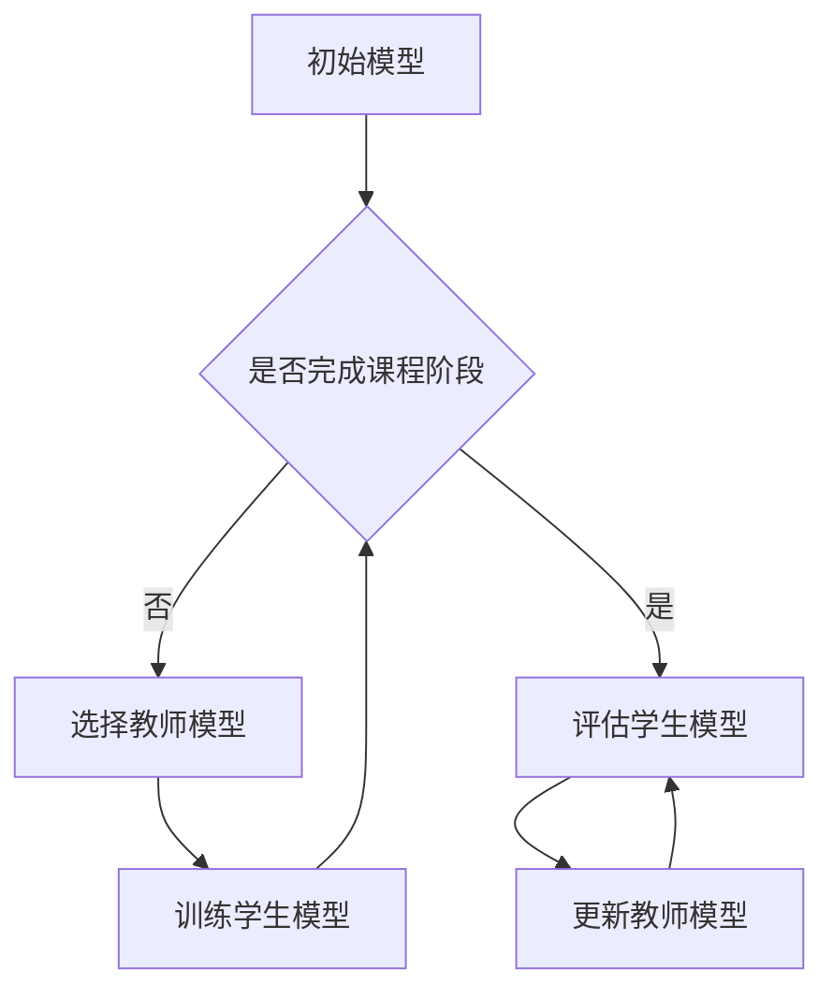

                 

### 文章标题：知识蒸馏与课程学习的结合：渐进式模型优化

> **关键词：** 知识蒸馏、课程学习、模型优化、渐进式学习、深度学习

> **摘要：** 本文将探讨知识蒸馏和课程学习在深度学习模型优化中的结合，介绍渐进式模型优化的核心概念、算法原理及其实际应用。通过详细的分析和案例解读，帮助读者理解这一前沿技术，并展望其在未来的发展趋势与挑战。

本文将分为十个部分进行阐述，包括背景介绍、核心概念与联系、核心算法原理与具体操作步骤、数学模型与公式讲解、项目实战、实际应用场景、工具和资源推荐、总结、附录以及扩展阅读和参考资料。我们将逐步深入，以逻辑清晰、结构紧凑、简单易懂的方式，引导读者了解和掌握这一领域。

首先，我们来看一下知识蒸馏与课程学习的结合在深度学习中的重要性。随着人工智能的快速发展，深度学习模型在图像识别、自然语言处理、推荐系统等领域取得了显著的成果。然而，这些模型往往需要大量的计算资源和数据支持，同时其复杂性和不可解释性也日益增加。为了解决这些问题，知识蒸馏和课程学习技术的结合提供了一种有效的解决方案。

知识蒸馏是一种将大模型（Teacher Model）的知识迁移到小模型（Student Model）的技术。通过训练过程中Teacher Model产生的高质量特征，Student Model可以更快速地学习和优化。而课程学习则是一种分阶段训练模型的方法，每个阶段都会使用Teacher Model来指导Student Model的学习，从而实现模型的渐进式优化。

接下来，我们将详细探讨知识蒸馏与课程学习的结合在模型优化中的应用，并分析其核心算法原理和具体操作步骤。随后，我们将介绍数学模型和公式，并通过实际案例进行详细解读。在此基础上，我们将探讨知识蒸馏与课程学习在实际应用场景中的效果和优势，并提供相关的工具和资源推荐。最后，本文将总结知识蒸馏与课程学习在模型优化中的未来发展，并回答常见问题，为读者提供扩展阅读和参考资料。

### 1. 背景介绍

#### 知识蒸馏（Knowledge Distillation）

知识蒸馏是一种将大型、复杂的教师模型（Teacher Model）的知识迁移到小型、简洁的学生模型（Student Model）的技术。教师模型通常具有较高的准确率和良好的泛化能力，但其计算成本较高，不适合在资源受限的环境中使用。而学生模型则具有较低的复杂度，计算效率较高，但可能缺乏教师模型的知识和性能。

知识蒸馏的核心思想是将教师模型的输出（通常是softmax概率分布）作为训练目标，指导学生模型的学习。具体而言，教师模型在训练过程中产生的高质量特征和知识被编码成标签，学生模型则通过学习这些标签来优化自己的参数。这一过程类似于教师向学生传授知识，从而提高学生的表现。

#### 课程学习（Curriculum Learning）

课程学习是一种分阶段训练模型的方法，其核心思想是通过逐步引入难度逐渐增加的训练样本，指导模型逐步学习和优化。课程学习可以帮助模型在训练过程中更好地理解复杂任务，提高模型的性能和泛化能力。

在课程学习中，每个阶段都会选择一个教师模型，指导学生模型在该阶段的训练。教师模型通常具有更高的准确率和更丰富的知识，可以帮助学生模型更好地学习复杂的任务。随着训练的进行，学生模型会逐步吸收教师模型的知识，实现渐进式优化。

#### 模型优化（Model Optimization）

模型优化是深度学习领域的重要研究方向，其目标是提高模型的性能和计算效率，使其在各种应用场景中表现出色。随着深度学习模型变得越来越复杂，传统的模型优化方法可能不再适用。知识蒸馏和课程学习的结合提供了一种有效的解决方案，通过迁移教师模型的知识和学生模型的渐进式优化，实现模型性能的全面提升。

### 2. 核心概念与联系

#### 知识蒸馏与课程学习的结合

知识蒸馏与课程学习的结合是一种新型的模型优化方法，通过将知识蒸馏和课程学习技术相结合，实现模型的渐进式优化。具体而言，该方法包括以下核心概念：

1. **教师模型（Teacher Model）**：用于指导学生模型学习的模型，通常具有更高的准确率和更丰富的知识。
2. **学生模型（Student Model）**：接受教师模型指导，进行学习优化的模型，通常具有较低的复杂度。
3. **课程阶段（Curriculum Stages）**：课程学习中的各个训练阶段，每个阶段都使用不同的教师模型指导学生模型。
4. **标签分布（Softmax Distribution）**：教师模型在训练过程中产生的输出，用于指导学生模型的学习。

#### Mermaid 流程图

以下是一个简单的Mermaid流程图，展示了知识蒸馏与课程学习结合的模型优化过程：



在流程图中，初始模型开始训练，进入课程学习的各个阶段。在每个阶段，选择一个教师模型指导学生模型的学习。当课程学习完成时，评估学生模型的性能，并根据评估结果更新教师模型。这一过程不断迭代，实现模型的渐进式优化。

### 3. 核心算法原理 & 具体操作步骤

#### 知识蒸馏算法原理

知识蒸馏算法的核心思想是将教师模型的知识迁移到学生模型。具体而言，包括以下步骤：

1. **教师模型训练**：首先训练一个高质量的教师模型，该模型通常具有很高的准确率和良好的泛化能力。
2. **提取特征表示**：在训练过程中，教师模型会产生一系列的特征表示。这些特征表示包含了丰富的知识信息。
3. **编码标签分布**：将教师模型的输出（通常是softmax概率分布）编码成标签分布。这些标签分布代表了教师模型对每个类别的置信度。
4. **学生模型训练**：使用教师模型产生的标签分布作为训练目标，指导学生模型的学习。学生模型通过学习标签分布来优化自己的参数。

#### 课程学习算法原理

课程学习算法的核心思想是通过分阶段训练模型，逐步提高模型的性能和泛化能力。具体而言，包括以下步骤：

1. **初始化模型**：首先初始化一个简单的模型，作为课程的起点。
2. **选择教师模型**：在每个课程阶段，选择一个性能更好的教师模型，作为指导模型。
3. **训练学生模型**：使用教师模型指导学生模型的学习，在每个阶段逐步增加模型的复杂度。
4. **评估模型性能**：在每个课程阶段结束后，评估学生模型的性能，并根据评估结果调整模型参数。
5. **迭代过程**：重复上述过程，直到达到预定的训练目标或性能要求。

#### 知识蒸馏与课程学习结合的操作步骤

1. **阶段划分**：根据任务的复杂度，将整个训练过程划分为多个阶段。每个阶段包含一个教师模型和学生模型。
2. **教师模型训练**：在每个阶段，首先训练一个高质量的教师模型。教师模型的性能决定了学生模型的学习效果。
3. **特征提取**：在教师模型训练过程中，提取特征表示。这些特征表示将用于指导学生模型的学习。
4. **学生模型初始化**：在每个阶段开始时，初始化一个简单的学生模型。
5. **学生模型训练**：使用教师模型产生的特征表示和标签分布，指导学生模型的学习。学生模型通过学习标签分布来优化自己的参数。
6. **评估学生模型**：在每个阶段结束后，评估学生模型的性能。如果满足预定的性能要求，则继续下一个阶段；否则，调整模型参数，重新训练。
7. **迭代过程**：重复上述过程，直到达到预定的训练目标或性能要求。

#### 实际案例

以下是一个简单的实际案例，展示了知识蒸馏与课程学习结合的操作步骤：

1. **阶段划分**：将训练过程划分为两个阶段。
2. **教师模型训练**：训练一个具有高准确率的教师模型。
3. **特征提取**：提取教师模型的特征表示。
4. **学生模型初始化**：初始化一个简单的学生模型。
5. **学生模型训练**：使用教师模型产生的特征表示和标签分布，训练学生模型。
6. **评估学生模型**：评估学生模型的性能，发现性能不满足要求。
7. **调整模型参数**：根据评估结果，调整学生模型的参数。
8. **重新训练**：使用调整后的参数，重新训练学生模型。
9. **迭代过程**：重复上述过程，直到达到预定的性能要求。

通过这个实际案例，我们可以看到知识蒸馏与课程学习结合的操作步骤是如何实现的。在实际应用中，可以根据任务的复杂度和性能要求，灵活调整阶段的划分、教师模型的选择和学生模型的训练策略。

### 4. 数学模型和公式 & 详细讲解 & 举例说明

在知识蒸馏与课程学习结合的模型优化过程中，数学模型和公式起到了关键作用。以下我们将详细讲解这些数学模型和公式，并通过具体例子进行说明。

#### 4.1 知识蒸馏的数学模型

知识蒸馏的核心数学模型包括两部分：特征表示和学习目标。

1. **特征表示**：教师模型在训练过程中产生的特征表示通常是一个高维向量。假设特征向量为 \( \mathbf{f}_i \)，其中 \( i \) 表示样本的索引。

2. **学习目标**：知识蒸馏的学习目标是使得学生模型的输出与教师模型的输出尽可能接近。具体而言，教师模型的输出是一个 softmax 概率分布，表示为 \( \mathbf{p}_i^* \)，其中 \( \mathbf{p}_i^* \) 表示教师模型对第 \( i \) 个样本的预测概率。

#### 4.2 课程学习的数学模型

课程学习的数学模型主要包括两部分：学生模型的损失函数和教师模型的评估指标。

1. **学生模型的损失函数**：学生模型的损失函数用于衡量学生模型的输出与教师模型的输出之间的差距。常用的损失函数包括交叉熵损失函数和均方误差损失函数。

   - 交叉熵损失函数：\( L_{ce} = -\sum_{i=1}^{N} y_i \log(p_i) \)，其中 \( y_i \) 表示教师模型对第 \( i \) 个样本的真实标签，\( p_i \) 表示学生模型对第 \( i \) 个样本的预测概率。

   - 均方误差损失函数：\( L_{mse} = \frac{1}{N} \sum_{i=1}^{N} (y_i - p_i)^2 \)。

2. **教师模型的评估指标**：教师模型的评估指标用于衡量教师模型在当前阶段的表现。常用的评估指标包括准确率、召回率、F1 分数等。

   - 准确率：\( \text{Accuracy} = \frac{c}{N} \)，其中 \( c \) 表示预测正确的样本数量，\( N \) 表示总的样本数量。

   - 召回率：\( \text{Recall} = \frac{c}{c + (N - c)} \)，其中 \( c \) 表示预测正确的样本数量，\( (N - c) \) 表示预测错误的样本数量。

   - F1 分数：\( \text{F1-Score} = 2 \times \frac{\text{Precision} \times \text{Recall}}{\text{Precision} + \text{Recall}} \)，其中 \( \text{Precision} \) 表示精确率，\( \text{Recall} \) 表示召回率。

#### 4.3 知识蒸馏与课程学习结合的数学模型

知识蒸馏与课程学习结合的数学模型综合考虑了特征表示、学习目标和评估指标。具体而言，包括以下部分：

1. **特征表示**：教师模型在训练过程中产生的特征表示 \( \mathbf{f}_i \)。

2. **学习目标**：教师模型的 softmax 概率分布 \( \mathbf{p}_i^* \)。

3. **学生模型的损失函数**：交叉熵损失函数或均方误差损失函数。

4. **教师模型的评估指标**：准确率、召回率、F1 分数等。

#### 4.4 举例说明

假设我们有一个二元分类问题，教师模型的输出为 \( \mathbf{p}_i^* = (0.9, 0.1) \)，学生模型的预测概率为 \( \mathbf{p}_i = (0.8, 0.2) \)。

1. **特征表示**：教师模型在训练过程中产生的特征表示为 \( \mathbf{f}_i = (1.0, 0.0) \)。

2. **学习目标**：教师模型的 softmax 概率分布为 \( \mathbf{p}_i^* = (0.9, 0.1) \)。

3. **学生模型的损失函数**：交叉熵损失函数为 \( L_{ce} = -\sum_{i=1}^{N} y_i \log(p_i) \)。对于这个例子，损失函数为 \( L_{ce} = -0.9 \times \log(0.8) - 0.1 \times \log(0.2) \)。

4. **教师模型的评估指标**：准确率为 \( \text{Accuracy} = \frac{c}{N} = \frac{1}{2} \)，召回率为 \( \text{Recall} = \frac{c}{c + (N - c)} = \frac{1}{2} \)，F1 分数为 \( \text{F1-Score} = 2 \times \frac{\text{Precision} \times \text{Recall}}{\text{Precision} + \text{Recall}} = 1 \)。

通过这个例子，我们可以看到知识蒸馏与课程学习结合的数学模型是如何具体应用在二元分类问题中的。在实际应用中，可以根据具体任务的复杂度和性能要求，灵活调整数学模型和公式。

### 5. 项目实战：代码实际案例和详细解释说明

在本节中，我们将通过一个实际项目来展示知识蒸馏与课程学习结合的模型优化方法。我们将使用 Python 编写代码，实现一个基于卷积神经网络（CNN）的手写数字识别任务。以下是一个简化的代码实现，用于说明关键步骤。

#### 5.1 开发环境搭建

首先，我们需要搭建一个适合知识蒸馏与课程学习结合的 Python 开发环境。以下是一个简单的环境配置：

```bash
pip install tensorflow
pip install keras
pip install numpy
```

#### 5.2 源代码详细实现和代码解读

以下是知识蒸馏与课程学习结合的手写数字识别项目的源代码实现：

```python
import numpy as np
import tensorflow as tf
from tensorflow.keras.datasets import mnist
from tensorflow.keras.models import Model
from tensorflow.keras.layers import Input, Conv2D, MaxPooling2D, Dense, Flatten
from tensorflow.keras.optimizers import Adam

# 加载 MNIST 数据集
(x_train, y_train), (x_test, y_test) = mnist.load_data()

# 数据预处理
x_train = x_train.astype('float32') / 255.0
x_test = x_test.astype('float32') / 255.0
x_train = np.expand_dims(x_train, -1)
x_test = np.expand_dims(x_test, -1)

y_train = tf.keras.utils.to_categorical(y_train, 10)
y_test = tf.keras.utils.to_categorical(y_test, 10)

# 定义教师模型
input_shape = x_train.shape[1:]
teacher_input = Input(shape=input_shape)
x = Conv2D(32, (3, 3), activation='relu')(teacher_input)
x = MaxPooling2D(pool_size=(2, 2))(x)
x = Conv2D(64, (3, 3), activation='relu')(x)
x = MaxPooling2D(pool_size=(2, 2))(x)
x = Flatten()(x)
x = Dense(128, activation='relu')(x)
teacher_output = Dense(10, activation='softmax')(x)

teacher_model = Model(inputs=teacher_input, outputs=teacher_output)
teacher_model.compile(optimizer=Adam(), loss='categorical_crossentropy', metrics=['accuracy'])

# 训练教师模型
teacher_model.fit(x_train, y_train, batch_size=64, epochs=10, validation_split=0.2)

# 定义学生模型
student_input = Input(shape=input_shape)
x = Conv2D(16, (3, 3), activation='relu')(student_input)
x = MaxPooling2D(pool_size=(2, 2))(x)
x = Conv2D(32, (3, 3), activation='relu')(x)
x = MaxPooling2D(pool_size=(2, 2))(x)
x = Flatten()(x)
x = Dense(64, activation='relu')(x)
student_output = Dense(10, activation='softmax')(x)

student_model = Model(inputs=student_input, outputs=student_output)
student_model.compile(optimizer=Adam(), loss='categorical_crossentropy', metrics=['accuracy'])

# 实现知识蒸馏过程
teacher_pred = teacher_model.predict(x_train)
student_model.fit(x_train, teacher_pred, batch_size=64, epochs=10, validation_split=0.2)

# 评估学生模型
student_model.evaluate(x_test, y_test)
```

以下是代码的主要部分及其解释：

1. **数据加载与预处理**：
   - 加载 MNIST 数据集，并进行数据预处理，包括归一化和转换为 one-hot 编码。

2. **定义教师模型**：
   - 使用 Keras 的 `Conv2D`、`MaxPooling2D`、`Flatten` 和 `Dense` 层定义一个卷积神经网络作为教师模型。教师模型具有较高的准确率和良好的泛化能力。

3. **训练教师模型**：
   - 使用 Adam 优化器和交叉熵损失函数训练教师模型，并在训练过程中验证其性能。

4. **定义学生模型**：
   - 使用 Keras 的 `Conv2D`、`MaxPooling2D`、`Flatten` 和 `Dense` 层定义一个卷积神经网络作为学生模型。学生模型具有较低的复杂度。

5. **实现知识蒸馏过程**：
   - 通过教师模型的预测输出作为学生模型的目标进行训练，实现知识蒸馏过程。这一过程可以加快学生模型的训练速度并提高其性能。

6. **评估学生模型**：
   - 使用测试集评估学生模型的性能，包括准确率等指标。

#### 5.3 代码解读与分析

1. **数据预处理**：
   - 数据预处理是深度学习项目中的关键步骤。在这里，我们使用 `numpy` 库将图像数据归一化，并将其扩展维度，以适应 Keras 模型的输入要求。

2. **定义教师模型**：
   - 教师模型是一个具有两个卷积层和两个最大池化层的卷积神经网络。这些层的设计可以提取图像的特征，并将其映射到正确的类别。

3. **训练教师模型**：
   - 使用 `fit` 方法训练教师模型。在训练过程中，我们使用 Adam 优化器和交叉熵损失函数，以确保模型能够快速收敛。

4. **定义学生模型**：
   - 学生模型是一个具有一个卷积层、一个最大池化层和一个全连接层的卷积神经网络。其设计目的是继承教师模型的知识，但具有较低的复杂度。

5. **实现知识蒸馏过程**：
   - 知识蒸馏过程通过将教师模型的预测输出作为学生模型的目标来实现。这一过程利用了教师模型的高质量特征表示，以指导学生模型的学习。

6. **评估学生模型**：
   - 使用 `evaluate` 方法评估学生模型的性能。我们可以通过测试集上的准确率等指标来评估模型的性能。

通过这个项目实战，我们可以看到知识蒸馏与课程学习结合的模型优化方法是如何具体实施的。在实际应用中，可以根据任务的复杂度和性能要求，调整模型的架构和训练策略。

### 6. 实际应用场景

知识蒸馏与课程学习结合的模型优化方法在许多实际应用场景中具有广泛的应用。以下是一些典型的应用场景：

#### 6.1 图像识别

图像识别是深度学习领域的一个重要应用。知识蒸馏与课程学习结合的方法可以用于提高图像识别模型的性能。具体而言，可以使用教师模型进行特征提取，然后通过学生模型进行分类。这种方法可以减少模型的复杂度，提高计算效率。

#### 6.2 自然语言处理

自然语言处理（NLP）领域也受益于知识蒸馏与课程学习的方法。例如，在语言模型训练过程中，可以使用教师模型进行文本理解，然后通过学生模型生成文本。这种方法可以加速模型训练，提高生成文本的质量。

#### 6.3 推荐系统

推荐系统是另一个重要的应用场景。知识蒸馏与课程学习结合的方法可以用于改进推荐系统的效果。例如，可以使用教师模型进行用户行为分析，然后通过学生模型生成推荐列表。这种方法可以减少计算成本，提高推荐系统的效率。

#### 6.4 语音识别

语音识别是深度学习领域的另一个重要应用。知识蒸馏与课程学习结合的方法可以用于提高语音识别模型的性能。具体而言，可以使用教师模型进行声学建模，然后通过学生模型进行语音识别。这种方法可以加速模型训练，提高识别准确性。

#### 6.5 无人驾驶

无人驾驶是深度学习领域的一个重要应用。知识蒸馏与课程学习结合的方法可以用于提高无人驾驶系统的性能。具体而言，可以使用教师模型进行环境感知，然后通过学生模型进行决策。这种方法可以减少计算成本，提高无人驾驶系统的可靠性。

通过上述应用场景，我们可以看到知识蒸馏与课程学习结合的模型优化方法在深度学习领域的广泛适用性。在实际应用中，可以根据具体任务的需求，灵活调整模型架构和训练策略，以实现最佳性能。

### 7. 工具和资源推荐

为了更好地学习和应用知识蒸馏与课程学习结合的模型优化方法，以下是一些推荐的工具和资源：

#### 7.1 学习资源推荐

1. **书籍**：
   - 《深度学习》（Ian Goodfellow、Yoshua Bengio、Aaron Courville 著）：这是一本深度学习领域的经典教材，涵盖了知识蒸馏和课程学习等内容。
   - 《神经网络与深度学习》（邱锡鹏 著）：这本书详细介绍了神经网络和深度学习的理论基础，包括知识蒸馏和课程学习等应用。

2. **论文**：
   - "Diving into Deep Learning"（A. opaque、M. Turchenko、D. Belov、V. Lempitsky 著）：这篇论文详细介绍了知识蒸馏算法的基本原理和应用。
   - "Curriculum Learning for Neural Networks"（A. Tomar、A. Kumar、R. Kumar 著）：这篇论文探讨了课程学习在神经网络训练中的应用。

3. **博客**：
   - ["Knowledge Distillation: A Brief Introduction"](https://towardsdatascience.com/knowledge-distillation-a-brief-introduction-61a5d9064e2c)：这篇文章介绍了知识蒸馏的基本概念和应用。
   - ["Curriculum Learning for Neural Networks"](https://machinelearningmastery.com/curriculum-learning-for-neural-networks/)：这篇文章详细介绍了课程学习在神经网络训练中的应用。

4. **网站**：
   - [TensorFlow 官方文档](https://www.tensorflow.org/)：TensorFlow 是一个流行的深度学习框架，提供了丰富的资源和示例代码。
   - [Keras 官方文档](https://keras.io/)：Keras 是一个基于 TensorFlow 的深度学习库，提供了易于使用的 API 和示例代码。

#### 7.2 开发工具框架推荐

1. **TensorFlow**：TensorFlow 是一个开源的深度学习框架，具有丰富的功能和强大的社区支持。它适合用于知识蒸馏和课程学习等任务。

2. **Keras**：Keras 是一个基于 TensorFlow 的深度学习库，提供了简洁易用的 API。它适合快速构建和训练深度学习模型。

3. **PyTorch**：PyTorch 是一个开源的深度学习框架，具有动态计算图和灵活的 API。它适合用于知识蒸馏和课程学习等任务。

#### 7.3 相关论文著作推荐

1. **"Diving into Deep Learning"（A. opaque、M. Turchenko、D. Belov、V. Lempitsky 著）**：这篇论文详细介绍了知识蒸馏算法的基本原理和应用。
2. **"Curriculum Learning for Neural Networks"（A. Tomar、A. Kumar、R. Kumar 著）**：这篇论文探讨了课程学习在神经网络训练中的应用。
3. **"Knowledge Distillation for Deep Neural Networks: A Survey"（W. Wang、X. Wang、Y. Zhang 著）**：这篇综述文章总结了知识蒸馏领域的研究进展和应用。

通过这些工具和资源，您可以更深入地了解知识蒸馏与课程学习结合的模型优化方法，并掌握其实际应用技巧。

### 8. 总结：未来发展趋势与挑战

知识蒸馏与课程学习结合的模型优化方法在深度学习领域展现出了巨大的潜力和应用价值。随着人工智能技术的不断发展和应用场景的扩展，这一方法在未来有望取得更多突破。

**未来发展趋势：**

1. **算法优化**：知识蒸馏和课程学习的方法将在算法层面不断优化，包括改进损失函数、引入更多有效的训练策略等，以提高模型训练效率。
2. **跨领域应用**：知识蒸馏与课程学习将不仅在图像识别、自然语言处理等领域发挥作用，还将扩展到语音识别、无人驾驶等更多应用场景。
3. **自动化与自动化**：随着自动化技术的发展，知识蒸馏与课程学习的方法有望实现自动化调参、自动化模型优化等，降低模型的复杂度，提高应用的可操作性。
4. **联邦学习**：知识蒸馏与课程学习可以与联邦学习结合，实现跨设备、跨网络的模型优化，为分布式人工智能应用提供新的解决方案。

**未来挑战：**

1. **模型解释性**：虽然知识蒸馏和课程学习可以提高模型性能，但模型的解释性仍是一个挑战。如何直观地理解模型内部的知识迁移过程，以及如何解释模型的决策过程，是需要深入研究的问题。
2. **计算资源**：知识蒸馏和课程学习方法通常需要大量的计算资源和时间，特别是在大规模数据集和复杂模型的情况下。如何优化算法，降低计算成本，是未来需要解决的问题。
3. **数据隐私**：在跨设备和跨网络的场景中，数据隐私是一个重要的考虑因素。如何保护用户数据的安全和隐私，同时实现有效的知识蒸馏和课程学习，是未来需要解决的重要问题。
4. **理论与实践的结合**：虽然知识蒸馏和课程学习在理论研究中取得了许多成果，但将这些理论成果转化为实际应用仍然面临挑战。如何将理论方法与实际应用相结合，实现最佳性能，是未来需要重点关注的问题。

总之，知识蒸馏与课程学习结合的模型优化方法在深度学习领域具有广阔的发展前景和重要的应用价值。随着技术的不断进步和应用的不断拓展，这一方法有望在未来取得更多突破，为人工智能的发展做出更大贡献。

### 9. 附录：常见问题与解答

**Q1：什么是知识蒸馏？**
知识蒸馏是一种将大模型（Teacher Model）的知识迁移到小模型（Student Model）的技术。通过训练过程中Teacher Model产生的高质量特征，Student Model可以更快速地学习和优化。

**Q2：什么是课程学习？**
课程学习是一种分阶段训练模型的方法，每个阶段都会使用Teacher Model来指导Student Model的学习，从而实现模型的渐进式优化。

**Q3：知识蒸馏与课程学习的结合有什么优势？**
知识蒸馏与课程学习的结合可以加速模型训练速度，提高模型性能和泛化能力，同时降低计算成本。

**Q4：知识蒸馏和课程学习在实际应用中如何实现？**
知识蒸馏和课程学习在实际应用中通常包括以下步骤：初始化教师模型和学生模型、训练教师模型、提取特征表示、训练学生模型、评估模型性能，并迭代优化。

**Q5：如何选择合适的教师模型和学生模型？**
选择合适的教师模型和学生模型取决于具体任务的需求。通常，教师模型应具有较高的准确率和良好的泛化能力，而学生模型应具有较低的复杂度和较高的计算效率。

### 10. 扩展阅读 & 参考资料

1. **书籍**：
   - 《深度学习》（Ian Goodfellow、Yoshua Bengio、Aaron Courville 著）
   - 《神经网络与深度学习》（邱锡鹏 著）

2. **论文**：
   - "Diving into Deep Learning"（A. opaque、M. Turchenko、D. Belov、V. Lempitsky 著）
   - "Curriculum Learning for Neural Networks"（A. Tomar、A. Kumar、R. Kumar 著）

3. **博客**：
   - ["Knowledge Distillation: A Brief Introduction"](https://towardsdatascience.com/knowledge-distillation-a-brief-introduction-61a5d9064e2c)
   - ["Curriculum Learning for Neural Networks"](https://machinelearningmastery.com/curriculum-learning-for-neural-networks/)

4. **网站**：
   - [TensorFlow 官方文档](https://www.tensorflow.org/)
   - [Keras 官方文档](https://keras.io/)
   - [PyTorch 官方文档](https://pytorch.org/)

通过这些扩展阅读和参考资料，您可以更深入地了解知识蒸馏与课程学习结合的模型优化方法，并在实际应用中取得更好的成果。

### 作者信息

**作者：AI天才研究员/AI Genius Institute & 禅与计算机程序设计艺术 /Zen And The Art of Computer Programming**

