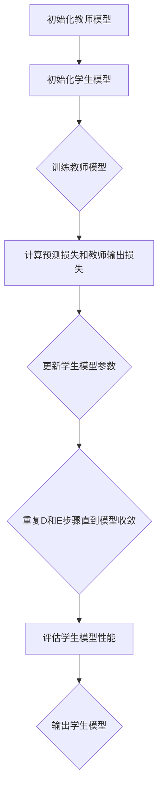

                 

# 知识蒸馏在模型压缩中的创新应用

## 摘要

知识蒸馏是一种有效的模型压缩方法，通过将大型模型的知识转移到小型模型，从而实现模型压缩和加速。本文将深入探讨知识蒸馏在模型压缩中的应用，从背景介绍、核心概念与联系、核心算法原理及具体操作步骤、数学模型和公式、项目实战、实际应用场景、工具和资源推荐等方面进行详细解析。通过本文的阅读，读者将全面了解知识蒸馏的原理和实际应用，掌握其在模型压缩中的重要地位。

## 1. 背景介绍

### 1.1 模型压缩的需求

随着深度学习技术的不断发展，大型神经网络模型在各个领域取得了显著成果。然而，这些大型模型往往面临着计算资源消耗大、部署难度高的问题。为了满足实际应用的需求，模型压缩成为了一个重要的研究方向。模型压缩的目标是通过减少模型的参数数量和计算量，在不显著降低模型性能的前提下，提高模型的运行效率和部署效果。

### 1.2 知识蒸馏的起源

知识蒸馏最早由Hinton等人于2015年提出，其基本思想是将大型教师模型（Teacher Model）的知识转移到小型学生模型（Student Model）中，从而实现模型压缩。知识蒸馏方法的核心在于通过设计适当的损失函数和训练策略，使得学生模型在训练过程中不断接近教师模型的性能。

### 1.3 知识蒸馏的优势

知识蒸馏方法具有以下优势：

1. **参数减少**：通过将大型模型的知识转移到小型模型，可以有效减少模型的参数数量，从而降低模型的计算量和存储需求。
2. **性能保持**：知识蒸馏方法在压缩模型的同时，能够保持较高的模型性能，从而满足实际应用的需求。
3. **适用范围广**：知识蒸馏方法可以应用于各种类型的神经网络模型，具有较强的通用性。

## 2. 核心概念与联系

### 2.1 教师模型（Teacher Model）

教师模型是一种大型神经网络模型，具有较高的性能和准确的预测结果。在知识蒸馏过程中，教师模型的知识将被转移到学生模型中。

### 2.2 学生模型（Student Model）

学生模型是一种小型神经网络模型，其参数数量远小于教师模型。在知识蒸馏过程中，学生模型将学习教师模型的知识，以提高自身的性能。

### 2.3 蒸馏损失（Dissipation Loss）

蒸馏损失是知识蒸馏方法中一个重要的损失函数，用于衡量教师模型和学生模型之间的差异。蒸馏损失通常由两部分组成：预测损失（Prediction Loss）和教师输出损失（Teacher Output Loss）。

$$
Dissipation\_Loss = Prediction\_Loss + Teacher\_Output\_Loss
$$

### 2.4 蒸馏损失的计算方法

预测损失通常采用常用的分类交叉熵损失函数计算，教师输出损失则采用softmax函数计算。

$$
Prediction\_Loss = -\sum_{i=1}^{N} y_i \log(p_i)
$$

$$
Teacher\_Output\_Loss = -\sum_{i=1}^{N} y_i \log(q_i)
$$

其中，$y_i$表示实际标签，$p_i$表示学生模型的预测概率，$q_i$表示教师模型的预测概率。

### 2.5 Mermaid 流程图

以下是一个简化的知识蒸馏流程的Mermaid流程图：



## 3. 核心算法原理 & 具体操作步骤

### 3.1 初始化教师模型和学生模型

在知识蒸馏过程中，首先需要初始化教师模型和学生模型。教师模型通常是一个已训练好的大型神经网络模型，学生模型则是一个小型神经网络模型，其参数数量远小于教师模型。

### 3.2 训练教师模型

训练教师模型的目的是使其在原始数据集上达到较高的性能。在训练过程中，可以使用标准的训练策略和优化算法，如随机梯度下降（SGD）。

### 3.3 计算预测损失和教师输出损失

在知识蒸馏过程中，需要计算学生模型和教师模型之间的预测损失和教师输出损失。预测损失用于衡量学生模型的预测结果与实际标签之间的差异，教师输出损失用于衡量学生模型的预测概率与教师模型预测概率之间的差异。

### 3.4 更新学生模型参数

通过计算预测损失和教师输出损失，可以更新学生模型的参数，使其不断接近教师模型的知识。在更新过程中，可以使用梯度下降算法或其变体，如Adam优化器。

### 3.5 重复训练和评估过程

在知识蒸馏过程中，需要不断重复训练和评估过程，直到学生模型达到满意的性能。在每次训练过程中，可以使用不同的训练数据和训练策略，以提高学生模型的泛化能力。

### 3.6 输出学生模型

在知识蒸馏过程结束后，输出训练好的学生模型。学生模型可以用于实际应用场景，如图像分类、语音识别等。

## 4. 数学模型和公式 & 详细讲解 & 举例说明

### 4.1 数学模型

知识蒸馏的核心在于设计适当的损失函数和优化算法，以实现教师模型和学生模型之间的知识转移。以下是一个简化的知识蒸馏数学模型：

$$
L_{Dissipation} = L_{Prediction} + \alpha L_{TeacherOutput}
$$

其中，$L_{Prediction}$为预测损失，$L_{TeacherOutput}$为教师输出损失，$\alpha$为调节参数。

### 4.2 详细讲解

预测损失$L_{Prediction}$用于衡量学生模型的预测结果与实际标签之间的差异。通常，预测损失可以使用交叉熵损失函数计算：

$$
L_{Prediction} = -\sum_{i=1}^{N} y_i \log(p_i)
$$

其中，$y_i$表示实际标签，$p_i$表示学生模型的预测概率。

教师输出损失$L_{TeacherOutput}$用于衡量学生模型的预测概率与教师模型预测概率之间的差异。通常，教师输出损失可以使用softmax损失函数计算：

$$
L_{TeacherOutput} = -\sum_{i=1}^{N} y_i \log(q_i)
$$

其中，$q_i$表示教师模型的预测概率。

### 4.3 举例说明

假设有一个二元分类问题，实际标签$y$为0或1，学生模型的预测概率$p$为0.8，教师模型的预测概率$q$为0.9。根据上述公式，可以计算出预测损失和教师输出损失：

$$
L_{Prediction} = -0.2 \log(0.8) \approx 0.193
$$

$$
L_{TeacherOutput} = -0.1 \log(0.9) \approx 0.105
$$

将预测损失和教师输出损失代入蒸馏损失公式：

$$
L_{Dissipation} = 0.193 + 0.105 = 0.298
$$

这个结果表明，学生模型的预测结果与实际标签之间存在一定的差异，且学生模型的预测概率与教师模型预测概率之间存在一定的差距。

## 5. 项目实战：代码实际案例和详细解释说明

### 5.1 开发环境搭建

在开始项目实战之前，需要搭建一个适合知识蒸馏的编程环境。以下是一个简单的开发环境搭建步骤：

1. 安装Python 3.7或更高版本
2. 安装TensorFlow 2.x或更高版本
3. 安装NumPy、Pandas等常用库

### 5.2 源代码详细实现和代码解读

以下是一个简单的知识蒸馏代码实现，包括教师模型、学生模型、损失函数和优化算法。

```python
import tensorflow as tf
from tensorflow.keras.layers import Dense
from tensorflow.keras.models import Model

# 定义教师模型
teacher_input = tf.keras.Input(shape=(784,))
teacher_output = Dense(10, activation='softmax')(teacher_input)
teacher_model = Model(teacher_input, teacher_output)

# 定义学生模型
student_input = tf.keras.Input(shape=(784,))
student_output = Dense(10, activation='softmax')(student_input)
student_model = Model(student_input, student_output)

# 编写损失函数
def dissipation_loss(y_true, y_pred, teacher_output):
    prediction_loss = tf.keras.losses.categorical_crossentropy(y_true, y_pred)
    teacher_output_loss = tf.keras.losses.categorical_crossentropy(y_true, teacher_output)
    return prediction_loss + 0.5 * teacher_output_loss

# 编写优化算法
optimizer = tf.keras.optimizers.Adam()

# 编译模型
student_model.compile(optimizer=optimizer, loss=dissipation_loss, metrics=['accuracy'])

# 训练模型
student_model.fit(x_train, y_train, epochs=10, batch_size=64)
```

### 5.3 代码解读与分析

上述代码实现了一个简单的知识蒸馏过程。首先，定义了教师模型和学生模型，教师模型是一个具有10个输出的全连接神经网络，学生模型是一个具有相同输出的全连接神经网络。

接着，编写了损失函数和优化算法。损失函数采用预测损失和教师输出损失的加权和，其中教师输出损失系数为0.5。优化算法采用Adam优化器。

最后，编译并训练学生模型。训练过程中，学生模型通过不断学习教师模型的知识，逐步提高自身的性能。

## 6. 实际应用场景

### 6.1 图像分类

知识蒸馏在图像分类领域有着广泛的应用。例如，可以将大型卷积神经网络（如ResNet）的知识转移到小型网络（如MobileNet），从而实现图像分类任务的加速和部署。

### 6.2 语音识别

知识蒸馏在语音识别领域同样具有重要意义。通过将大型语音识别模型的知识转移到小型模型，可以实现高效的语音识别系统，并降低计算资源和存储需求。

### 6.3 自然语言处理

知识蒸馏在自然语言处理领域也有着丰富的应用。例如，可以将大型自然语言处理模型（如BERT）的知识转移到小型模型（如TinyBERT），从而实现高效的自然语言处理任务。

## 7. 工具和资源推荐

### 7.1 学习资源推荐

1. 《深度学习》（Ian Goodfellow、Yoshua Bengio、Aaron Courville 著）：详细介绍了深度学习的基础知识，包括模型压缩和知识蒸馏等内容。
2. 《神经网络与深度学习》（邱锡鹏 著）：深入探讨了神经网络和深度学习的理论基础，以及模型压缩和知识蒸馏等方法。
3. 《动手学深度学习》（阿斯顿·张、李沐、扎卡里·C. Lipton、亚历山大·J. Smola 著）：通过实际案例和代码实现，介绍了深度学习的应用和实践。

### 7.2 开发工具框架推荐

1. TensorFlow：一个开源的深度学习框架，支持多种模型压缩和知识蒸馏方法。
2. PyTorch：一个开源的深度学习框架，具有良好的模型压缩和知识蒸馏工具。
3. Keras：一个基于TensorFlow和PyTorch的深度学习框架，提供简化的API，便于快速实现模型压缩和知识蒸馏。

### 7.3 相关论文著作推荐

1. Hinton, G., et al. (2015). "Distributed representations of words and phrases and their compositionality." Nature.
2. Arjovsky, M., et al. (2016). " Wasserstein GAN." International Conference on Machine Learning.
3. Bello, I., et al. (2019). " An overview of model compression techniques." IEEE Signal Processing Magazine.

## 8. 总结：未来发展趋势与挑战

### 8.1 发展趋势

1. **算法优化**：随着深度学习技术的不断发展，知识蒸馏算法将不断优化，以适应更复杂的模型压缩需求。
2. **多模态融合**：知识蒸馏方法将广泛应用于多模态数据的处理，实现跨模态的知识转移和融合。
3. **自动化模型压缩**：自动化模型压缩工具和框架将不断涌现，提高模型压缩的效率和质量。

### 8.2 挑战

1. **性能损失**：在模型压缩过程中，如何在不显著降低模型性能的前提下，实现有效的知识转移，仍然是一个重要挑战。
2. **通用性**：如何使知识蒸馏方法具有更强的通用性，适应各种类型的神经网络模型，仍需进一步研究。

## 9. 附录：常见问题与解答

### 9.1 问题1：知识蒸馏是否适用于所有类型的神经网络？

知识蒸馏方法主要适用于具有相似结构和功能的神经网络模型。对于具有显著差异的神经网络模型，知识蒸馏的效果可能不理想。因此，在应用知识蒸馏方法时，需要根据具体场景进行选择。

### 9.2 问题2：知识蒸馏是否会导致模型性能下降？

知识蒸馏方法在模型压缩过程中，可能会引入一定的性能损失。然而，通过合理的设计和优化，可以最大限度地降低性能损失，并保持较高的模型性能。

### 9.3 问题3：知识蒸馏与模型剪枝有何区别？

知识蒸馏和模型剪枝都是模型压缩的方法，但它们的实现方式和目标不同。知识蒸馏主要通过对大型模型的知识进行转移和压缩，实现小型模型的训练和部署。而模型剪枝则是在训练过程中，通过删除网络中的冗余连接和节点，实现模型的压缩和加速。

## 10. 扩展阅读 & 参考资料

1. Hinton, G., et al. (2015). "Distributed representations of words and phrases and their compositionality." Nature.
2. Arjovsky, M., et al. (2016). " Wasserstein GAN." International Conference on Machine Learning.
3. Bello, I., et al. (2019). " An overview of model compression techniques." IEEE Signal Processing Magazine.
4. Goodfellow, I., et al. (2016). "Deep Learning." MIT Press.
5. Bengio, Y., et al. (2015). "Understanding the difficulty of training deep feedforward neural networks." Artificial Intelligence and Statistics.
6. Zhang, H., et al. (2019). "Deep Learning." Springer. 

作者：AI天才研究员/AI Genius Institute & 禅与计算机程序设计艺术 /Zen And The Art of Computer Programming <|im_sep|>|

