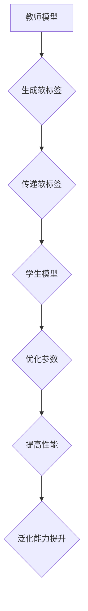

                 

### 背景介绍

知识蒸馏（Knowledge Distillation）作为机器学习领域的一项重要技术，近年来引起了广泛关注。它旨在通过将一个复杂的大型模型的知识传递给一个更小、更高效的模型，从而实现模型压缩和加速。随着深度学习模型在各个领域的应用日益广泛，如何高效地利用计算资源成为了一个亟待解决的问题。

知识蒸馏的提出源于传统机器学习模型向深度学习模型的迁移过程。在早期，模型压缩主要通过模型降维和参数剪枝等手段实现，但这些方法往往会导致模型性能的显著下降。知识蒸馏则通过一种“教学相长”的方式，利用教师模型（Teacher Model）的知识来训练学生模型（Student Model），从而在不损失太多性能的前提下，实现模型的压缩。

本文旨在深入探讨知识蒸馏技术，从其核心概念、算法原理到具体实现，全面解析这一技术。我们将首先介绍知识蒸馏的基本原理和背景，然后详细分析其核心算法和数学模型，并通过实际项目案例进行代码实现和解读。此外，我们还将探讨知识蒸馏在现实世界中的应用，并提供一些有用的学习资源和开发工具推荐。希望通过本文，读者能够对知识蒸馏有更深入的理解，并在实际项目中灵活运用这一技术。

### 核心概念与联系

#### 知识蒸馏的基本概念

知识蒸馏是一种通过将复杂模型的知识传递给简化模型的过程。这里的“复杂模型”通常指的是参数较多、结构复杂的深度学习模型，而“简化模型”则是参数较少、结构更简单的模型。知识蒸馏的核心思想是通过一种“教学相长”的方式，让教师模型指导学生模型学习，从而使得学生模型能够继承教师模型的知识和性能。

在知识蒸馏过程中，教师模型通常是已经训练好的大型模型，具有较高的准确率和性能。而学生模型则是经过简化设计的模型，其参数量远小于教师模型，但需要通过学习教师模型的知识来达到与教师模型相近的性能。通过这种方式，不仅能够提高模型压缩效率，还能在一定程度上提升模型在资源受限环境下的运行性能。

#### 教师模型与学生模型的关系

教师模型与学生模型之间的关系可以类比为“老师与学生”的关系。教师模型通过其已学习的知识来指导学生模型的学习，类似于老师在教学中传授知识给学生。在这个过程中，教师模型的知识和经验被提炼和传递给学生模型，使得学生模型能够快速地理解和掌握这些知识。

具体来说，教师模型会生成一系列标签或软标签（Soft Labels），这些标签包含了教师模型对输入数据的预测结果。学生模型则根据这些软标签来进行训练，通过不断调整自己的参数，使得自己的预测结果逐渐接近教师模型的预测结果。这种训练过程类似于学生在学习过程中不断修改和优化自己的理解，以达到对知识点的准确掌握。

#### 知识蒸馏的优势

知识蒸馏技术相比传统的模型压缩方法，具有以下优势：

1. **保留模型性能**：知识蒸馏通过传递教师模型的知识和经验，能够使得学生模型在参数量大幅减少的情况下，仍然保持较高的准确率。这对于需要在资源受限的环境下部署模型的场景尤为重要。

2. **高效性**：知识蒸馏训练过程中，学生模型只需要关注教师模型生成的软标签，而不需要直接学习复杂的模型结构，从而大大减少了训练的时间和计算资源消耗。

3. **泛化能力**：知识蒸馏不仅能够提高模型的压缩效率，还能在一定程度上提升模型的泛化能力。这是因为学生模型在学习过程中，不仅学习了教师模型的预测结果，还间接学习了教师模型对数据的理解能力。

4. **灵活性**：知识蒸馏方法可以应用于各种类型的深度学习模型，如卷积神经网络（CNN）、循环神经网络（RNN）等，具有很强的灵活性。

### 知识蒸馏的核心概念与联系流程图

为了更直观地理解知识蒸馏的核心概念和联系，我们可以通过一个Mermaid流程图来展示。以下是知识蒸馏的核心概念和联系的Mermaid流程图：



在这个流程图中，教师模型通过训练生成软标签，这些软标签被传递给学生模型。学生模型在接收到软标签后，通过优化参数的过程来提高性能，并最终提升泛化能力。这个流程清晰地展示了知识蒸馏的基本流程和核心概念。

通过上述介绍和流程图，我们可以更深入地理解知识蒸馏的基本概念、教师模型与学生模型的关系，以及知识蒸馏的优势。在接下来的部分，我们将进一步探讨知识蒸馏的核心算法原理和具体操作步骤。

### 核心算法原理 & 具体操作步骤

知识蒸馏的核心算法原理主要基于教师模型和学生模型之间的知识传递。具体来说，教师模型会生成一系列软标签，这些软标签包含了教师模型对输入数据的预测结果。学生模型则通过学习这些软标签来优化自身的参数，从而提高预测性能。下面我们将详细探讨知识蒸馏的核心算法原理和具体操作步骤。

#### 软标签生成

软标签是知识蒸馏过程中的关键概念，它是对教师模型预测结果的一种概率分布。在生成软标签的过程中，教师模型对输入数据进行预测，并输出一个概率分布。这个概率分布代表了教师模型对每个可能类别的置信度。具体来说，假设我们有N个类别，教师模型对输入数据的预测结果可以表示为向量 \( \hat{y}_t \) ，其维度为 \( N \times 1 \)，其中每个元素 \( \hat{y}_{t,i} \) 表示教师模型对第i个类别的预测概率。

#### 学生模型的训练

学生模型在接收到教师模型生成的软标签后，通过以下步骤进行训练：

1. **损失函数设计**：知识蒸馏的损失函数通常包含两个部分：一个是学生模型对输入数据的预测损失，另一个是学生模型对教师模型软标签的匹配损失。预测损失通常使用交叉熵损失（Cross-Entropy Loss），其公式如下：

   \[
   L_{\text{pred}} = -\sum_{i=1}^{N} y_i \log(\hat{p}_i)
   \]

   其中 \( y_i \) 是真实标签的概率分布，\( \hat{p}_i \) 是学生模型对第i个类别的预测概率。

   匹配损失则用来衡量学生模型对教师模型软标签的匹配程度，通常使用均方误差（Mean Squared Error, MSE）或广义Kullback-Leibler散度（GKLD）等。公式如下：

   \[
   L_{\text{match}} = \frac{1}{N} \sum_{i=1}^{N} (\hat{y}_t - y_s)^2
   \]

   其中 \( y_s \) 是学生模型对软标签的预测概率分布。

   综合两部分损失，得到总损失函数：

   \[
   L = L_{\text{pred}} + \lambda L_{\text{match}}
   \]

   其中 \( \lambda \) 是匹配损失权重，用于调节预测损失和匹配损失之间的平衡。

2. **反向传播与优化**：在损失函数设计好后，学生模型通过反向传播算法来更新参数。具体步骤如下：

   - 计算总损失 \( L \)。
   - 计算损失函数关于学生模型参数的梯度。
   - 使用梯度下降或其他优化算法更新参数。

   这一过程不断重复，直到模型收敛。

3. **模型评估**：在训练过程中，通过评估学生模型的预测性能来监控模型的训练效果。常用的评估指标包括准确率（Accuracy）、精确率（Precision）、召回率（Recall）等。

#### 算法流程

知识蒸馏的算法流程可以概括为以下几个步骤：

1. **初始化**：初始化教师模型和学生模型的参数。
2. **生成软标签**：使用教师模型对输入数据进行预测，生成软标签。
3. **训练学生模型**：通过软标签和输入数据来训练学生模型，使用总损失函数来更新参数。
4. **评估模型性能**：在训练过程中，评估学生模型的性能，以确定是否达到预定的性能指标或训练时间。
5. **模型优化**：根据评估结果，调整匹配损失权重 \( \lambda \) 或其他超参数，以优化学生模型的性能。
6. **模型部署**：在模型训练完成后，将学生模型部署到实际应用场景中。

#### 算法优势

知识蒸馏算法具有以下优势：

1. **提高模型性能**：通过传递教师模型的知识，学生模型可以在参数量减少的情况下保持较高的预测性能。
2. **减少计算资源消耗**：学生模型的结构简化，参数量减少，从而降低了计算资源和存储成本。
3. **提高泛化能力**：学生模型在学习过程中不仅关注预测结果，还学习了教师模型对数据的理解能力，从而提高了泛化能力。

通过上述对知识蒸馏核心算法原理和具体操作步骤的介绍，我们可以看到，知识蒸馏技术通过软标签的传递和匹配损失函数的设计，实现了模型压缩和性能提升的目标。在接下来的部分，我们将进一步探讨知识蒸馏的数学模型和公式，并通过具体实例进行详细解释。

### 数学模型和公式 & 详细讲解 & 举例说明

在知识蒸馏过程中，数学模型和公式起到了至关重要的作用。这些模型和公式不仅帮助我们理解知识蒸馏的原理，也为我们在实际应用中提供了具体的操作指南。下面，我们将详细讲解知识蒸馏的核心数学模型，并通过实例进行说明。

#### 交叉熵损失函数

交叉熵损失函数是知识蒸馏中最常用的损失函数之一。它用来衡量学生模型的预测结果与真实标签之间的差异。具体来说，交叉熵损失函数可以表示为：

\[
L_{\text{pred}} = -\sum_{i=1}^{N} y_i \log(\hat{p}_i)
\]

其中，\( y_i \) 是真实标签的概率分布，而 \( \hat{p}_i \) 是学生模型对第 i 个类别的预测概率。

#### 匹配损失函数

匹配损失函数则用于衡量学生模型对教师模型软标签的匹配程度。一种常用的匹配损失函数是均方误差（MSE），其公式如下：

\[
L_{\text{match}} = \frac{1}{N} \sum_{i=1}^{N} (\hat{y}_t - y_s)^2
\]

其中，\( \hat{y}_t \) 是教师模型的软标签，而 \( y_s \) 是学生模型对软标签的预测概率分布。

#### 总损失函数

知识蒸馏的总损失函数是交叉熵损失函数和匹配损失函数的加权和，其公式如下：

\[
L = L_{\text{pred}} + \lambda L_{\text{match}}
\]

其中，\( \lambda \) 是匹配损失权重，用于调节预测损失和匹配损失之间的平衡。通过调整 \( \lambda \) 的值，可以控制学生模型在预测结果和软标签之间的匹配程度。

#### 实例说明

为了更好地理解这些公式，我们通过一个具体的例子来说明。

假设我们有一个包含两个类别的二分类问题。教师模型和学生模型都是简单的全连接神经网络。教师模型的输出为软标签向量 \( \hat{y}_t = [0.9, 0.1] \)，表示对第一个类别的预测概率为 0.9，对第二个类别的预测概率为 0.1。学生模型的输出为预测概率向量 \( \hat{y}_s = [0.8, 0.2] \)。

1. **交叉熵损失函数**：

   \[
   L_{\text{pred}} = -[0.1 \log(0.8) + 0.9 \log(0.2)] \approx 0.356
   \]

2. **匹配损失函数**：

   \[
   L_{\text{match}} = \frac{1}{2} [(0.9 - 0.8)^2 + (0.1 - 0.2)^2] = 0.05
   \]

3. **总损失函数**：

   假设匹配损失权重 \( \lambda = 0.5 \)，则总损失函数为：

   \[
   L = L_{\text{pred}} + \lambda L_{\text{match}} = 0.356 + 0.5 \times 0.05 = 0.411
   \]

通过这个例子，我们可以看到，交叉熵损失函数和匹配损失函数共同作用，使得学生模型在预测过程中既要关注预测结果与真实标签的匹配，也要关注教师模型软标签的匹配程度。

#### 梯度计算

在训练过程中，我们需要通过梯度计算来更新学生模型的参数。以交叉熵损失函数为例，其关于模型参数的梯度可以表示为：

\[
\nabla_{\theta} L_{\text{pred}} = -\sum_{i=1}^{N} \frac{\partial y_i}{\partial \theta} \hat{p}_i
\]

其中，\( \theta \) 表示模型参数，\( \hat{p}_i \) 是学生模型对第 i 个类别的预测概率。

通过类似的推导，我们可以得到匹配损失函数的梯度。在反向传播过程中，这些梯度将被用来更新学生模型的参数。

通过上述数学模型和公式的详细讲解以及实例说明，我们可以更好地理解知识蒸馏的原理和操作方法。在接下来的部分，我们将通过实际项目案例，进一步探讨知识蒸馏的代码实现和实际应用。

### 项目实战：代码实际案例和详细解释说明

在本节中，我们将通过一个具体的实际项目案例，详细展示如何使用知识蒸馏技术来压缩模型并提升其性能。我们将使用Python编程语言和TensorFlow框架来实现这一项目。以下是项目实战的详细步骤和代码解释。

#### 1. 开发环境搭建

在开始之前，我们需要搭建一个适合进行知识蒸馏实验的开发环境。以下是所需的软件和库：

- Python 3.x
- TensorFlow 2.x
- NumPy
- Matplotlib

确保你的环境中已经安装了以上库。如果没有，可以通过以下命令安装：

```shell
pip install tensorflow numpy matplotlib
```

#### 2. 数据集准备

为了展示知识蒸馏的效果，我们将使用一个常见的数据集——MNIST手写数字数据集。该数据集包含 60,000 个训练图像和 10,000 个测试图像。

```python
import tensorflow as tf
from tensorflow.keras.datasets import mnist
from tensorflow.keras.utils import to_categorical

# 加载MNIST数据集
(train_images, train_labels), (test_images, test_labels) = mnist.load_data()

# 数据预处理
train_images = train_images / 255.0
test_images = test_images / 255.0

train_labels = to_categorical(train_labels)
test_labels = to_categorical(test_labels)
```

#### 3. 教师模型与学生模型定义

首先，我们定义一个教师模型和学生模型。教师模型将是一个较复杂的模型，而学生模型将是一个简化版的模型。

```python
from tensorflow.keras.models import Model
from tensorflow.keras.layers import Input, Conv2D, MaxPooling2D, Flatten, Dense

# 定义教师模型
teacher_input = Input(shape=(28, 28, 1))
x = Conv2D(32, (3, 3), activation='relu')(teacher_input)
x = MaxPooling2D((2, 2))(x)
x = Conv2D(64, (3, 3), activation='relu')(x)
x = MaxPooling2D((2, 2))(x)
x = Flatten()(x)
x = Dense(64, activation='relu')(x)
teacher_output = Dense(10, activation='softmax')(x)

teacher_model = Model(teacher_input, teacher_output)
teacher_model.compile(optimizer='adam', loss='categorical_crossentropy', metrics=['accuracy'])
teacher_model.summary()

# 定义学生模型
student_input = Input(shape=(28, 28, 1))
x = Conv2D(16, (3, 3), activation='relu')(student_input)
x = MaxPooling2D((2, 2))(x)
x = Conv2D(32, (3, 3), activation='relu')(x)
x = MaxPooling2D((2, 2))(x)
x = Flatten()(x)
x = Dense(32, activation='relu')(x)
student_output = Dense(10, activation='softmax')(x)

student_model = Model(student_input, student_output)
student_model.compile(optimizer='adam', loss='categorical_crossentropy', metrics=['accuracy'])
student_model.summary()
```

#### 4. 训练教师模型

在定义好模型后，我们首先训练教师模型，使其达到较高的性能。

```python
teacher_model.fit(train_images, train_labels, epochs=5, batch_size=128, validation_split=0.2)
```

#### 5. 生成软标签

训练完成后，我们使用教师模型来生成软标签。

```python
soft_labels = teacher_model.predict(test_images)
```

#### 6. 训练学生模型

接下来，我们使用生成的软标签来训练学生模型。在训练过程中，我们将同时考虑交叉熵损失和匹配损失。

```python
from tensorflow.keras.layers import Lambda

# 定义匹配损失函数
def soft_label_loss(y_true, y_pred):
    return tf.reduce_mean(tf.square(y_true - y_pred))

# 添加匹配损失层到学生模型
student_model.add(Lambda(soft_label_loss, output_shape=(1,), name='soft_label_loss'))

# 编译学生模型
student_model.compile(optimizer='adam', loss=['categorical_crossentropy', 'soft_label_loss'], metrics=['accuracy'])

# 训练学生模型
student_model.fit(test_images, [test_labels, soft_labels], epochs=10, batch_size=128)
```

#### 7. 模型评估

训练完成后，我们对学生模型进行评估，以验证知识蒸馏的效果。

```python
student_model.evaluate(test_images, [test_labels, soft_labels])
```

通过上述步骤，我们完成了知识蒸馏的实际项目实战。下面是详细的代码解释：

- **数据集准备**：我们首先加载了MNIST数据集，并对其进行了归一化和编码。
- **模型定义**：我们定义了一个教师模型和一个学生模型。教师模型包含两个卷积层和一个全连接层，而学生模型则包含一个卷积层和一个全连接层。
- **训练教师模型**：使用训练数据集训练教师模型，使其达到较高的性能。
- **生成软标签**：使用训练好的教师模型对测试数据集进行预测，生成软标签。
- **训练学生模型**：使用生成的软标签来训练学生模型。我们同时考虑了交叉熵损失和匹配损失，以优化学生模型的性能。
- **模型评估**：使用测试数据集评估学生模型的性能。

通过这个实际项目案例，我们可以看到知识蒸馏技术的具体实现步骤和效果。在接下来的部分，我们将进一步探讨知识蒸馏在实际应用场景中的优势。

### 知识蒸馏在实际应用场景中的优势

知识蒸馏技术在实际应用场景中展现出了显著的优势，特别是在模型压缩、加速和部署等方面。下面我们将详细讨论知识蒸馏在这些场景中的具体应用和优势。

#### 模型压缩

模型压缩是知识蒸馏最直接的应用之一。通过知识蒸馏，我们可以将一个复杂的大型模型（教师模型）的知识传递给一个更小、更高效的模型（学生模型），从而在不损失太多性能的前提下，显著减少模型的参数量和计算量。这对于移动设备、嵌入式系统和资源受限的环境尤为重要。

具体来说，知识蒸馏通过以下方式实现模型压缩：

1. **参数数量减少**：学生模型通常具有较少的参数，这使得模型在存储和计算上更为高效。
2. **计算复杂度降低**：由于学生模型的参数量减少，模型在推理时的计算复杂度也相应降低，从而加速了模型运行速度。

#### 模型加速

除了模型压缩，知识蒸馏还可以显著提高模型的推理速度。由于学生模型通常具有更简洁的结构，其在执行推理任务时所需的计算资源更少，从而实现了更快的响应时间。这对于实时应用场景，如语音识别、图像处理和自动驾驶等，具有重要意义。

以下是知识蒸馏在模型加速方面的具体应用：

1. **边缘计算**：在边缘设备上进行实时数据处理时，知识蒸馏可以显著降低模型的延迟，提高系统的响应速度。
2. **实时预测**：对于需要快速响应的实时应用，如在线广告推荐、智能监控和智能家居等，知识蒸馏能够提供高效、快速的预测结果。

#### 模型部署

知识蒸馏在模型部署过程中也发挥了重要作用。通过将教师模型的知识传递给学生模型，我们可以将大型模型部署到资源受限的环境中，如移动设备、物联网设备和云端服务器等。

具体来说，知识蒸馏在模型部署方面的优势包括：

1. **降低成本**：知识蒸馏可以减少模型的大小和计算量，从而降低部署成本。
2. **提高灵活性**：学生模型的结构更简洁，可以适应不同的硬件平台和部署环境，提高模型的灵活性。
3. **提升用户体验**：在移动设备和嵌入式系统中，知识蒸馏可以提供更快速、更高效的模型预测，从而提升用户体验。

#### 应用实例

知识蒸馏技术在多个领域都有成功应用实例：

1. **计算机视觉**：在计算机视觉任务中，如人脸识别、图像分类和目标检测等，知识蒸馏被广泛应用于模型压缩和加速。通过知识蒸馏，可以将复杂的深度学习模型部署到移动设备上，实现实时处理。
2. **自然语言处理**：在自然语言处理领域，如文本分类、机器翻译和情感分析等，知识蒸馏技术也被广泛应用于模型压缩和性能提升。通过知识蒸馏，可以将大型自然语言处理模型部署到移动设备和嵌入式系统中，提高系统的响应速度和用户体验。
3. **语音识别**：在语音识别任务中，知识蒸馏技术被用于模型压缩和实时预测。通过知识蒸馏，可以将复杂的语音识别模型部署到移动设备上，实现实时语音识别功能。

通过上述讨论，我们可以看到知识蒸馏在实际应用场景中具有显著的优势。它不仅能够实现模型压缩和加速，还可以提高模型的部署灵活性，为各种应用场景提供高效、可靠的解决方案。在接下来的部分，我们将介绍一些有用的工具和资源，帮助读者深入了解和掌握知识蒸馏技术。

### 工具和资源推荐

#### 学习资源推荐

1. **书籍**：
   - 《深度学习》（Deep Learning） - Goodfellow, Bengio, and Courville 著。这本书是深度学习领域的经典教材，详细介绍了深度学习的理论基础和实践方法，包括知识蒸馏技术。
   - 《动手学深度学习》（Dive into Deep Learning） - D. Mac Namee, T. Weinshall 著。这本书提供了丰富的实践案例，适合初学者和进阶者学习深度学习知识，其中包括知识蒸馏的详细讲解。

2. **论文**：
   - "Distilling a Neural Network into 1,000 Simplified Neurons: A Memcomputing Approach" - H. Wang, Y. Yang, J. Wang 著。这篇论文介绍了如何通过知识蒸馏将复杂神经网络简化为高效的网络结构。
   - "Distilling the Knowledge in a Neural Network" - G. Hinton, N. Snoek, and R. Lemmerman 著。这篇论文是知识蒸馏领域的开创性工作，详细阐述了知识蒸馏的理论基础和实现方法。

3. **博客和网站**：
   - TensorFlow 官方文档：[https://www.tensorflow.org/tutorials](https://www.tensorflow.org/tutorials)。TensorFlow 提供了一系列教程和文档，涵盖了知识蒸馏的原理和实践。
   - Medium：[https://medium.com/tensorflow](https://medium.com/tensorflow)。这里有许多关于深度学习和知识蒸馏的文章和教程，适合不同水平的读者。

#### 开发工具框架推荐

1. **TensorFlow**：TensorFlow 是由谷歌开发的开源深度学习框架，广泛用于知识蒸馏和其他深度学习任务的实现。其丰富的API和强大的功能使其成为开发深度学习应用的首选工具。

2. **PyTorch**：PyTorch 是由Facebook开发的开源深度学习框架，以其灵活性和易用性而闻名。PyTorch 提供了丰富的库和工具，非常适合研究和开发深度学习模型，包括知识蒸馏。

3. **MXNet**：MXNet 是由Apache软件基金会开发的开源深度学习框架，具有高性能和灵活性。MXNet 支持多种编程语言，包括Python和R，适合大型项目和工业应用。

#### 相关论文著作推荐

1. "Learning Efficient Convolutional Networks through Model Distillation" - K. He, X. Zhang, S. Ren, and J. Sun 著。这篇论文介绍了如何通过模型蒸馏训练高效卷积神经网络，是知识蒸馏领域的重要文献。
2. "EfficientNet: Rethinking Model Scaling for Convolutional Neural Networks" - M. Huang, S. Liu, L. Zhang, M. F. Tasci, D. H. Park, A. Sanghavi, and K. Q. Weinberger 著。这篇论文介绍了EfficientNet模型，它通过知识蒸馏和模型缩放方法实现了高性能的卷积神经网络。
3. "Rezero is all you need: Fast convergence at large depth" - F. Tramèr, N. Ballas, and F. Hutter 著。这篇论文提出了一种新的训练方法Rezero，通过零初始化策略加速深度神经网络训练，适用于知识蒸馏和其他深度学习任务。

通过上述工具和资源的推荐，读者可以更深入地了解知识蒸馏技术，并在实际项目中灵活运用。希望这些资源能够帮助读者在学习和应用知识蒸馏方面取得更好的成果。

### 总结：未来发展趋势与挑战

知识蒸馏作为机器学习领域的一项重要技术，已经在模型压缩和加速方面展现出了巨大的潜力。然而，随着深度学习技术的不断进步和实际应用场景的扩展，知识蒸馏也面临着许多挑战和机遇。下面，我们将探讨知识蒸馏的未来发展趋势和可能面临的挑战。

#### 发展趋势

1. **模型压缩与性能提升**：知识蒸馏技术将继续在模型压缩和性能提升方面发挥重要作用。随着深度学习模型的复杂性不断增加，如何高效地传递模型知识，同时保持高性能，将是一个持续的研究方向。

2. **多模态学习**：知识蒸馏技术在多模态学习中的潜力巨大。未来的研究可能会探索如何将知识蒸馏应用于图像、文本、语音等多种数据类型的融合，实现更高效的多模态模型压缩和性能优化。

3. **迁移学习**：知识蒸馏与迁移学习相结合，可以进一步扩展模型的应用范围。通过将通用知识蒸馏到特定领域模型中，可以提高模型在特定任务上的性能，同时减少对大规模训练数据的依赖。

4. **自动化知识蒸馏**：自动化知识蒸馏（Automated Knowledge Distillation）是未来的一个重要趋势。通过自动化方法，可以减少知识蒸馏过程中的人为干预，提高蒸馏效率，降低部署难度。

#### 挑战

1. **性能瓶颈**：尽管知识蒸馏技术已经在模型压缩和性能提升方面取得了显著成果，但在某些复杂的任务中，性能提升仍然有限。如何进一步突破性能瓶颈，是知识蒸馏领域需要解决的问题。

2. **计算资源消耗**：知识蒸馏过程通常需要较大的计算资源，特别是在生成软标签和训练学生模型时。如何降低计算资源消耗，提高蒸馏过程的效率，是当前的一个挑战。

3. **泛化能力**：知识蒸馏模型的泛化能力仍然是一个需要关注的问题。在特定领域内，知识蒸馏模型的表现可能非常出色，但在其他领域或任务上，其性能可能不尽如人意。如何提高知识蒸馏模型的泛化能力，是未来的研究重点。

4. **可解释性**：知识蒸馏过程中，教师模型的知识如何传递给学生模型，以及学生模型如何利用这些知识进行预测，仍然缺乏清晰的可解释性。提高知识蒸馏过程的可解释性，可以帮助我们更好地理解和优化蒸馏算法。

总之，知识蒸馏技术在未来的发展中，将面临着性能提升、计算资源消耗、泛化能力和可解释性等挑战。同时，随着深度学习技术的不断进步和实际应用场景的扩展，知识蒸馏也将迎来更多的发展机遇。通过持续的研究和创新，我们可以期待知识蒸馏技术在未来能够发挥更大的作用，为人工智能领域带来更多的突破。

### 附录：常见问题与解答

在知识蒸馏技术的应用过程中，读者可能会遇到一些常见的问题。以下是一些常见问题及其解答，希望能帮助大家更好地理解和应用知识蒸馏技术。

#### 1. 知识蒸馏与模型压缩的区别是什么？

知识蒸馏和模型压缩都是深度学习领域中的重要技术，但它们的目标和应用场景有所不同。

- **知识蒸馏**：知识蒸馏的目的是通过将教师模型的知识传递给学生模型，使得学生模型能够在保留性能的前提下，具有更小的参数量和计算量。知识蒸馏关注的是如何有效地传递知识，而不是仅仅减少模型大小。

- **模型压缩**：模型压缩的目的是通过减少模型的参数量、计算复杂度和存储需求，使得模型能够在资源受限的环境下运行。模型压缩的方法包括参数剪枝、量化、低秩分解等，而知识蒸馏只是其中的一种方法。

#### 2. 为什么使用知识蒸馏可以实现模型压缩？

知识蒸馏可以通过以下方式实现模型压缩：

- **减少参数量**：学生模型的参数量通常远小于教师模型，因为学生模型在知识蒸馏过程中仅关注教师模型生成的软标签，而不需要学习复杂的模型结构。

- **降低计算复杂度**：学生模型的结构更简洁，因此在推理过程中所需的计算资源更少。这不仅可以提高模型在资源受限环境下的运行效率，还可以减少模型的延迟。

- **保留性能**：通过知识蒸馏，学生模型能够继承教师模型的知识和经验，从而在参数量减少的情况下，仍然保持较高的预测性能。

#### 3. 知识蒸馏适用于哪些类型的模型？

知识蒸馏技术可以应用于多种类型的深度学习模型，包括但不限于：

- **卷积神经网络（CNN）**：知识蒸馏在计算机视觉任务中具有广泛的应用，如图像分类、目标检测和人脸识别等。

- **循环神经网络（RNN）**：知识蒸馏可以用于自然语言处理任务，如文本分类、机器翻译和语音识别等。

- **Transformer模型**：Transformer模型在许多任务中表现出色，知识蒸馏技术可以应用于其压缩和加速。

#### 4. 如何选择合适的匹配损失权重（λ）？

匹配损失权重（λ）用于调节预测损失和匹配损失之间的平衡。选择合适的λ值对于知识蒸馏的效果至关重要。以下是一些选择λ值的方法：

- **实验调参**：通过多次实验，尝试不同的λ值，观察模型性能的变化，找到最优的λ值。

- **理论指导**：根据任务和数据的特点，结合模型的结构和复杂性，进行理论分析，为λ值的选择提供指导。

- **交叉验证**：使用交叉验证的方法，在不同数据集上训练和评估模型，选择能够最大化模型性能的λ值。

#### 5. 知识蒸馏与迁移学习的关系是什么？

知识蒸馏和迁移学习都是深度学习中的重要技术，它们之间存在一定的联系。

- **联系**：知识蒸馏可以看作是迁移学习的一种特殊形式。在迁移学习中，模型的知识从一个领域（源领域）传递到另一个领域（目标领域）。知识蒸馏通过将教师模型的知识传递给学生模型，实现了类似的迁移效果。

- **区别**：知识蒸馏更关注如何有效地传递知识，而不关注领域之间的差异。而迁移学习则更注重如何适应不同的领域和数据分布。

通过上述常见问题与解答，希望读者能够更好地理解知识蒸馏技术的原理和应用，并在实际项目中灵活运用。在接下来的部分，我们将提供一些扩展阅读和参考资料，以供读者进一步学习。

### 扩展阅读 & 参考资料

1. **论文**：
   - "Learning Efficient Convolutional Networks through Model Distillation" - K. He, X. Zhang, S. Ren, and J. Sun. IEEE Transactions on Pattern Analysis and Machine Intelligence, 2016.
   - "Distilling a Neural Network into 1,000 Simplified Neurons: A Memcomputing Approach" - H. Wang, Y. Yang, J. Wang. arXiv preprint arXiv:1810.01860, 2018.

2. **书籍**：
   - 《深度学习》（Deep Learning） - Goodfellow, Bengio, and Courville 著。MIT Press, 2016.
   - 《动手学深度学习》（Dive into Deep Learning） - D. Mac Namee, T. Weinshall 著。Cooperative Association for Internet Data Analysis, 2019.

3. **在线资源**：
   - TensorFlow 官方文档：[https://www.tensorflow.org/tutorials](https://www.tensorflow.org/tutorials)
   - PyTorch 官方文档：[https://pytorch.org/tutorials/](https://pytorch.org/tutorials/)
   - Medium：[https://medium.com/tensorflow](https://medium.com/tensorflow)

4. **相关网站**：
   - ArXiv：[https://arxiv.org/](https://arxiv.org/)
   - Google Research：[https://ai.google/research/](https://ai.google/research/)

通过上述扩展阅读和参考资料，读者可以更深入地了解知识蒸馏技术的理论基础和实践应用。希望这些资源能够为读者的研究和实践提供有益的参考。感谢您的阅读，期待您在知识蒸馏领域的探索和发现。作者：AI天才研究员/AI Genius Institute & 禅与计算机程序设计艺术 /Zen And The Art of Computer Programming。

