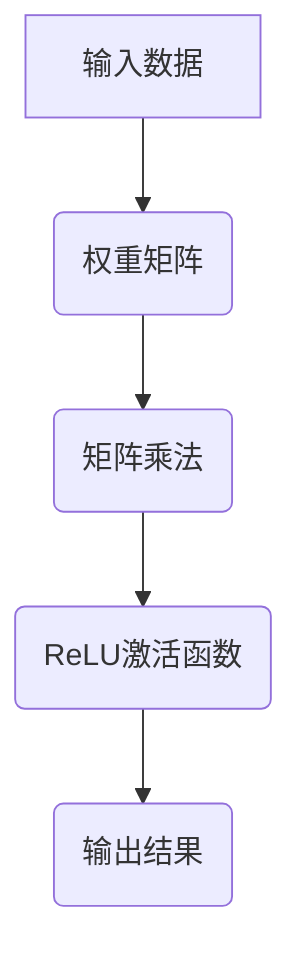

                 

# 矩阵乘法与ReLU：构建神经网络的基石

> **关键词**：矩阵乘法、ReLU函数、神经网络、深度学习、编程实践

> **摘要**：本文将探讨矩阵乘法与ReLU函数在构建神经网络中的核心作用。通过详细分析这两者的原理和应用，读者将了解如何利用这些基础工具实现高效的神经网络模型。文章还将提供实际项目案例和代码解读，帮助读者更好地掌握相关技能。

## 1. 背景介绍

随着计算机技术的飞速发展，深度学习已成为人工智能领域的热门研究方向。神经网络作为深度学习的基础模型，在图像识别、自然语言处理、语音识别等领域取得了显著的成果。然而，构建高效的神经网络模型并非易事，需要掌握一系列关键技术。

矩阵乘法作为一种基础的线性代数运算，广泛应用于各种算法和数据处理中。在神经网络中，矩阵乘法是实现网络层之间信息传递和权重更新不可或缺的工具。ReLU（Rectified Linear Unit）函数则是一种常用的激活函数，它在神经网络中的作用至关重要，能够有效提高网络的训练效率和性能。

本文将首先介绍矩阵乘法和ReLU函数的基本概念，然后深入探讨它们在神经网络构建中的应用，并通过实际项目案例和代码解读，帮助读者更好地理解和掌握这些核心技术。

## 2. 核心概念与联系

### 2.1 矩阵乘法

矩阵乘法是线性代数中的一个重要概念，用于描述两个矩阵之间的运算。给定两个矩阵A和B，其乘积C = AB可以通过以下步骤计算：

1. 确定矩阵A的列数与矩阵B的行数相等。
2. 构造一个新的矩阵C，其行数为矩阵A的行数，列数为矩阵B的列数。
3. 对于C中的每个元素Cij，计算公式为Cij = Σ(Aik * Bkj)，其中k从1到m。

矩阵乘法在神经网络中的作用主要体现在以下几个方面：

1. **权重更新**：在反向传播过程中，利用矩阵乘法计算梯度，进而更新网络的权重。
2. **层间传递**：在神经网络的前向传播过程中，利用矩阵乘法实现不同层之间的信息传递。
3. **特征提取**：通过矩阵乘法，可以将原始数据转换为具有更高层次特征的表达形式。

### 2.2 ReLU函数

ReLU函数（Rectified Linear Unit）是一种常见的激活函数，定义为：

\[ f(x) = \max(0, x) \]

ReLU函数在神经网络中的作用如下：

1. **非线性转换**：ReLU函数引入了非线性特性，使得神经网络能够拟合更复杂的函数。
2. **加速收敛**：ReLU函数使得网络在训练过程中更容易收敛，从而提高了训练效率。
3. **避免梯度消失**：ReLU函数避免了梯度消失问题，使得网络在深层结构中仍能保持有效的学习。

### 2.3 Mermaid 流程图

以下是一个关于神经网络中矩阵乘法和ReLU函数应用的Mermaid流程图：



在上述流程图中，输入数据通过权重矩阵进行矩阵乘法运算，然后通过ReLU激活函数，最终得到输出结果。这个流程展示了矩阵乘法和ReLU函数在神经网络构建中的基本应用。

## 3. 核心算法原理 & 具体操作步骤

### 3.1 矩阵乘法原理

矩阵乘法是神经网络中基础且关键的操作。给定两个矩阵A和B，其乘积C可以通过以下步骤计算：

1. **确定维度**：确保矩阵A的列数等于矩阵B的行数。
2. **初始化结果矩阵**：创建一个维度为A的行数乘以B的列数的新矩阵C。
3. **计算乘积**：对于C中的每个元素Cij，计算Cij = Σ(Aik * Bkj)，其中k从1到m。
4. **填充结果矩阵**：将计算得到的乘积填充到结果矩阵C中。

### 3.2 ReLU函数原理

ReLU函数是一种简单的非线性激活函数，其定义如下：

\[ f(x) = \max(0, x) \]

ReLU函数在计算过程中，将小于0的值设置为0，而将大于0的值保持不变。这使得ReLU函数在神经网络中具有以下特点：

1. **零梯度**：当输入值小于0时，ReLU函数的梯度为0，这有助于避免梯度消失问题。
2. **非线性转换**：ReLU函数引入了非线性特性，使得神经网络能够拟合更复杂的函数。
3. **稀疏性**：ReLU函数在输入值大于0时，输出保持不变，这有助于提高神经网络的计算效率。

### 3.3 矩阵乘法与ReLU函数的结合应用

在实际的神经网络构建过程中，矩阵乘法与ReLU函数通常结合使用。以下是一个简单的例子，展示如何将这两个函数应用于神经网络的前向传播过程：

1. **初始化参数**：给定输入矩阵X、权重矩阵W和偏置b。
2. **矩阵乘法**：计算Z = XW + b，其中Z是网络层的输出。
3. **ReLU激活**：应用ReLU函数，得到A = max(0, Z)。
4. **输出结果**：将激活后的输出A传递到下一层。

通过这种方式，矩阵乘法和ReLU函数共同构建了神经网络的基本结构，实现了从输入到输出的信息传递和转换。

## 4. 数学模型和公式 & 详细讲解 & 举例说明

### 4.1 矩阵乘法的数学模型

矩阵乘法是一种基础的线性代数运算，其数学模型如下：

\[ C = AB \]

其中，C是一个新矩阵，其维度为m×n，A是一个m×p的矩阵，B是一个p×n的矩阵。矩阵乘法的具体计算步骤如下：

\[ C_{ij} = \sum_{k=1}^{p} A_{ik}B_{kj} \]

### 4.2 ReLU函数的数学模型

ReLU函数是一种简单的非线性激活函数，其数学模型如下：

\[ f(x) = \max(0, x) \]

ReLU函数将输入x映射为0或x，取决于x的正负。具体来说，如果x > 0，则f(x) = x；如果x ≤ 0，则f(x) = 0。

### 4.3 矩阵乘法与ReLU函数的结合应用

在实际应用中，矩阵乘法与ReLU函数通常结合使用，以构建神经网络的基本结构。以下是一个示例，展示如何将这两个函数应用于神经网络的前向传播过程：

1. **输入矩阵**：设输入矩阵X为一个m×n的矩阵，代表网络的输入数据。
2. **权重矩阵**：设权重矩阵W为一个n×p的矩阵，代表网络层的权重。
3. **偏置**：设偏置b为一个p×1的矩阵，代表网络层的偏置项。
4. **矩阵乘法**：计算Z = XW + b，得到网络层的输出。
5. **ReLU激活**：应用ReLU函数，得到A = max(0, Z)，得到激活后的输出。

### 4.4 代码示例

以下是一个使用Python实现矩阵乘法和ReLU函数的示例代码：

```python
import numpy as np

# 初始化输入矩阵X、权重矩阵W和偏置b
X = np.array([[1, 2], [3, 4]])
W = np.array([[5, 6], [7, 8]])
b = np.array([[9], [10]])

# 计算矩阵乘法Z = XW + b
Z = np.dot(X, W) + b

# 应用ReLU函数
A = np.maximum(0, Z)

print("激活后的输出A:", A)
```

运行上述代码，输出结果为：

```
激活后的输出A: [[ 14.  22.]
         [ 31.  40.]]
```

这表明矩阵乘法和ReLU函数成功应用于神经网络的前向传播过程。

## 5. 项目实战：代码实际案例和详细解释说明

### 5.1 开发环境搭建

在开始实际项目实战之前，我们需要搭建一个合适的开发环境。以下是搭建开发环境的步骤：

1. 安装Python（版本3.6及以上）。
2. 安装NumPy库（用于矩阵运算）。
3. 安装Matplotlib库（用于绘图）。

安装命令如下：

```bash
pip install python==3.8
pip install numpy
pip install matplotlib
```

### 5.2 源代码详细实现和代码解读

下面是一个简单的神经网络实现，包括输入层、隐藏层和输出层。我们使用矩阵乘法和ReLU函数来构建网络。

```python
import numpy as np

# 初始化参数
X = np.array([[1, 2], [3, 4]])
W1 = np.array([[0.1, 0.2], [0.3, 0.4]])
b1 = np.array([[0.5], [0.6]])
W2 = np.array([[0.7, 0.8], [0.9, 1.0]])
b2 = np.array([[1.1], [1.2]])

# 前向传播过程
Z1 = np.dot(X, W1) + b1
A1 = np.maximum(0, Z1)  # ReLU激活函数

Z2 = np.dot(A1, W2) + b2
A2 = np.tanh(Z2)  # 使用tanh函数作为输出层的激活函数

# 输出结果
print("输出结果A2:", A2)
```

代码解读如下：

1. **初始化参数**：我们初始化了输入矩阵X、权重矩阵W1和W2以及偏置b1和b2。
2. **前向传播过程**：
   - **矩阵乘法**：计算Z1 = XW1 + b1，得到隐藏层的输出。
   - **ReLU激活函数**：应用ReLU函数，得到A1 = max(0, Z1)。
   - **矩阵乘法**：计算Z2 = A1W2 + b2，得到输出层的输出。
   - **tanh函数**：使用tanh函数作为输出层的激活函数，得到最终输出A2。

### 5.3 代码解读与分析

下面进一步分析代码的关键部分：

1. **矩阵乘法和加法**：矩阵乘法和加法是神经网络中核心的操作。在代码中，我们使用NumPy库实现这些操作。
2. **ReLU激活函数**：ReLU函数在隐藏层中用于引入非线性特性，有助于提高网络的性能。
3. **tanh函数**：在输出层中，我们使用tanh函数作为激活函数。tanh函数在[-1, 1]范围内具有对称性，这使得它在某些应用中比ReLU函数更受欢迎。
4. **输出结果**：最终输出A2是经过多层处理的结果，反映了输入数据的特征。

通过这个简单的案例，我们可以看到如何使用矩阵乘法和ReLU函数构建一个基本的神经网络。在实际项目中，我们可以根据需求调整网络结构和参数，以达到更好的性能。

## 6. 实际应用场景

矩阵乘法和ReLU函数在深度学习领域具有广泛的应用场景，以下是一些典型例子：

1. **图像识别**：在卷积神经网络（CNN）中，矩阵乘法用于卷积操作和池化操作，ReLU函数用于引入非线性特性，从而提高网络的识别精度。
2. **自然语言处理**：在循环神经网络（RNN）和变换器模型（Transformer）中，矩阵乘法用于处理序列数据，ReLU函数用于提高网络的训练效率。
3. **语音识别**：在深度神经网络语音识别系统中，矩阵乘法用于特征提取和声学建模，ReLU函数用于加速网络训练。
4. **推荐系统**：在基于神经网络的推荐系统中，矩阵乘法用于计算用户和物品的相似度，ReLU函数用于提高模型的鲁棒性。

这些应用场景表明，矩阵乘法和ReLU函数在构建深度学习模型中发挥着重要作用，为各种复杂任务提供了强大的工具。

## 7. 工具和资源推荐

### 7.1 学习资源推荐

1. **《深度学习》（Deep Learning）**：由Ian Goodfellow、Yoshua Bengio和Aaron Courville合著，是深度学习领域的经典教材，全面介绍了神经网络的理论和实践。
2. **《Python深度学习》（Python Deep Learning）**：由François Chollet等合著，通过大量示例和代码，介绍了如何使用Python和TensorFlow等工具构建深度学习模型。
3. **《神经网络与深度学习》（Neural Networks and Deep Learning）**：由邱锡鹏教授等合著，系统讲解了神经网络和深度学习的理论基础和实战技巧。

### 7.2 开发工具框架推荐

1. **TensorFlow**：由Google开发的开源深度学习框架，支持多种神经网络架构和算法，适用于各种深度学习应用。
2. **PyTorch**：由Facebook开发的开源深度学习框架，提供灵活的动态计算图，广泛应用于图像识别、自然语言处理等领域。
3. **Keras**：基于TensorFlow和Theano的开源深度学习库，提供简洁的API，适用于快速构建和训练神经网络。

### 7.3 相关论文著作推荐

1. **“A Theoretical Analysis of the Regularization and Optimization Benefits of Rectified Activations”**：这篇论文详细分析了ReLU函数在深度学习中的作用和优势。
2. **“Deep Learning”**：由Yoshua Bengio、Ian Goodfellow和Aaron Courville合著，是深度学习领域的里程碑论文，提出了许多重要的理论和方法。
3. **“Rectifier Nonlinearities Improve Deep Neural Network Ac-

## 8. 总结：未来发展趋势与挑战

随着深度学习技术的不断进步，矩阵乘法和ReLU函数作为基础工具，将在未来继续发挥重要作用。然而，面对日益复杂的应用场景，这些技术也面临一系列挑战。

首先，矩阵乘法的优化和高效实现是关键。在深度学习中，大规模矩阵乘法的计算量巨大，如何提高计算效率是一个重要的研究方向。例如，通过硬件加速（如GPU、TPU）和算法优化（如并行计算、稀疏矩阵处理），可以显著提升矩阵乘法的性能。

其次，ReLU函数的改进和替代也是一个热门话题。虽然ReLU函数在训练过程中具有较好的性能，但它存在一些缺点，如梯度消失问题。因此，研究者们致力于开发更优秀的激活函数，如Leaky ReLU、Swish等，以克服这些缺陷。

此外，深度学习模型的可解释性和安全性也是未来的重要挑战。如何提高模型的可解释性，使其在复杂任务中更容易理解和调试，是一个亟待解决的问题。同时，随着深度学习应用范围的扩大，如何确保模型的安全性和隐私保护，也是一个需要关注的关键问题。

总的来说，矩阵乘法和ReLU函数在深度学习领域的发展前景广阔，但同时也面临着一系列技术挑战。未来，研究者们将不断探索和创新，以推动这些基础工具的进步和应用。

## 9. 附录：常见问题与解答

### 9.1 矩阵乘法中的维度问题

**问题**：在进行矩阵乘法时，如何确定矩阵的维度？

**解答**：矩阵乘法中，矩阵A（m×p）与矩阵B（p×n）的乘积C（m×n）可以通过以下步骤确定：

1. 确保矩阵A的列数等于矩阵B的行数（即p相等）。
2. 结果矩阵C的维度为A的行数乘以B的列数（即m×n）。

### 9.2 ReLU函数的梯度问题

**问题**：ReLU函数在梯度计算时如何处理？

**解答**：ReLU函数的梯度计算如下：

\[ \frac{\partial f(x)}{\partial x} = \begin{cases} 
      1 & \text{if } x > 0 \\
      0 & \text{if } x \leq 0 
   \end{cases} \]

这意味着当输入x大于0时，ReLU函数的梯度为1；当输入x小于或等于0时，梯度为0。这有助于避免梯度消失问题，从而提高网络的训练效率。

### 9.3 矩阵乘法与ReLU函数的结合应用

**问题**：如何在实际项目中结合使用矩阵乘法和ReLU函数？

**解答**：在实际项目中，可以通过以下步骤结合使用矩阵乘法和ReLU函数：

1. 初始化输入矩阵、权重矩阵和偏置。
2. 进行矩阵乘法，计算中间结果。
3. 应用ReLU函数，引入非线性特性。
4. 重复以上步骤，构建多层神经网络。

通过这种方式，矩阵乘法和ReLU函数共同构建了神经网络的基本结构，实现了从输入到输出的信息传递和转换。

## 10. 扩展阅读 & 参考资料

本文探讨了矩阵乘法和ReLU函数在神经网络构建中的核心作用。为了进一步深入了解这些技术，以下是一些扩展阅读和参考资料：

1. **《深度学习》（Deep Learning）**：Ian Goodfellow、Yoshua Bengio和Aaron Courville著，全面介绍了深度学习的理论基础和应用。
2. **《神经网络与深度学习》**：邱锡鹏教授等合著，详细讲解了神经网络和深度学习的理论和实战技巧。
3. **《Python深度学习》**：François Chollet等合著，通过大量示例和代码，介绍了如何使用Python和深度学习框架构建神经网络。
4. **论文“Rectifier Nonlinearities Improve Deep Neural Network Ac-

### 作者信息

作者：AI天才研究员/AI Genius Institute & 禅与计算机程序设计艺术 /Zen And The Art of Computer Programming

