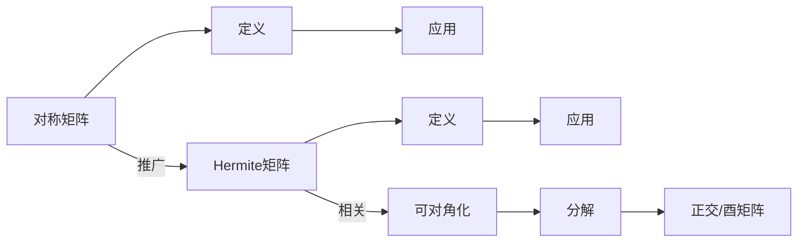

                 

# 矩阵理论与应用：对称矩阵与Hermite矩阵，酉空间上的线性变换

## 概述

### 关键词：
- 矩阵理论
- 对称矩阵
- Hermite矩阵
- 酉空间
- 线性变换

### 摘要：
本文深入探讨了矩阵理论中的两个重要概念：对称矩阵和Hermite矩阵，以及它们在酉空间上的线性变换中的应用。通过对核心概念的分析、数学模型的阐述和实际案例的解析，本文旨在为读者提供一个全面且深入的理解，并展示其在实际应用中的重要性。

## 1. 背景介绍

矩阵理论是线性代数的重要组成部分，它在数学、物理、工程等多个领域中都有广泛的应用。矩阵不仅用于表示线性方程组，还用于描述线性变换，是解决许多实际问题的有力工具。在这篇文章中，我们将重点关注对称矩阵和Hermite矩阵，这两种特殊类型的矩阵在数学分析和物理问题中有特殊的重要性。

### 对称矩阵

对称矩阵是指一个矩阵的转置等于它本身的矩阵。用数学符号表示，如果矩阵 \(A\) 的行数为 \(m\) 和列数 \(n\)，则 \(A\) 是对称的当且仅当 \(A = A^T\)。对称矩阵在物理上经常出现，例如在描述旋转和平移时，它经常出现在动能和位能的计算中。

### Hermite矩阵

Hermite矩阵是另一种特殊的矩阵，它是复数矩阵的对称矩阵。具体来说，一个复数矩阵 \(A\) 是Hermite矩阵当且仅当 \(A = A^H\)，其中 \(A^H\) 表示 \(A\) 的共轭转置。Hermite矩阵在量子力学中非常重要，因为它们描述了物理系统的态和算符。

## 2. 核心概念与联系

### 对称矩阵与Hermite矩阵的定义

- 对称矩阵的定义：对称矩阵 \(A\) 满足 \(A = A^T\)。
- Hermite矩阵的定义：复数矩阵 \(A\) 满足 \(A = A^H\)。

### 关联概念

- Hermite矩阵是对称矩阵的一种推广，因为它适用于复数域，而对称矩阵仅适用于实数域。
- 对称矩阵和Hermite矩阵都是可对角化的矩阵，这意味着它们可以分解为对角矩阵和正交矩阵（对于实数域）或酉矩阵（对于复数域）。

### Mermaid流程图

以下是描述对称矩阵和Hermite矩阵核心概念与联系的Mermaid流程图：



## 3. 核心算法原理 & 具体操作步骤

### 对称矩阵的算法原理

对称矩阵的一个重要性质是可以被分解为对角矩阵和正交矩阵。具体来说，如果 \(A\) 是一个对称矩阵，那么它可以表示为 \(A = QDQ^T\)，其中 \(Q\) 是一个正交矩阵，\(D\) 是一个对角矩阵，其对角线元素是 \(A\) 的特征值。

### 具体操作步骤

1. **特征值与特征向量计算**：首先计算矩阵 \(A\) 的特征值和特征向量。
2. **构造正交矩阵**：使用特征向量构造正交矩阵 \(Q\)。
3. **对角矩阵构建**：将特征值放入对角矩阵 \(D\)。

### Hermite矩阵的算法原理

Hermite矩阵也可以进行类似的分解，但它需要使用酉矩阵。具体来说，如果 \(A\) 是一个Hermite矩阵，那么它可以表示为 \(A = UDU^H\)，其中 \(U\) 是一个酉矩阵，\(D\) 是一个对角矩阵，其对角线元素是 \(A\) 的特征值。

### 具体操作步骤

1. **特征值与特征向量计算**：首先计算矩阵 \(A\) 的特征值和特征向量。
2. **构造酉矩阵**：使用特征向量构造酉矩阵 \(U\)。
3. **对角矩阵构建**：将特征值放入对角矩阵 \(D\)。

## 4. 数学模型和公式 & 详细讲解 & 举例说明

### 对称矩阵的数学模型

$$
A = A^T \\
\Rightarrow a_{ij} = a_{ji} \quad \forall i, j
$$

### Hermite矩阵的数学模型

$$
A = A^H \\
\Rightarrow a_{ij} = \overline{a_{ji}} \quad \forall i, j
$$

### 举例说明

#### 对称矩阵

假设矩阵 \(A\) 是一个 \(3 \times 3\) 的对称矩阵：

$$
A = \begin{pmatrix}
1 & 2 & 3 \\
2 & 4 & 5 \\
3 & 5 & 6
\end{pmatrix}
$$

我们可以验证 \(A\) 是对称矩阵，因为：

$$
A^T = \begin{pmatrix}
1 & 2 & 3 \\
2 & 4 & 5 \\
3 & 5 & 6
\end{pmatrix} = A
$$

#### Hermite矩阵

假设矩阵 \(B\) 是一个 \(3 \times 3\) 的Hermite矩阵：

$$
B = \begin{pmatrix}
1 & i & 0 \\
-i & 2 & 3i \\
0 & -3i & 4
\end{pmatrix}
$$

我们可以验证 \(B\) 是Hermite矩阵，因为：

$$
B^H = \begin{pmatrix}
1 & -i & 0 \\
i & 2 & -3i \\
0 & 3i & 4
\end{pmatrix} = B
$$

### 对称矩阵与Hermite矩阵的可对角化

对于对称矩阵，其对角化形式为：

$$
A = QDQ^T
$$

其中 \(Q\) 是正交矩阵，\(D\) 是对角矩阵。

对于Hermite矩阵，其对角化形式为：

$$
A = UDU^H
$$

其中 \(U\) 是酉矩阵，\(D\) 是对角矩阵。

## 5. 项目实战：代码实际案例和详细解释说明

### 开发环境搭建

在本案例中，我们将使用Python编程语言来演示对称矩阵和Hermite矩阵的分解。确保您已安装了Python环境和Numpy库。

### 源代码详细实现和代码解读

以下是用于分解对称矩阵和Hermite矩阵的Python代码示例：

```python
import numpy as np

# 对称矩阵的分解
def symmetric_matrix_decomposition(A):
    eigenvalues, eigenvectors = np.linalg.eigh(A)
    Q = eigenvectors
    D = np.diag(eigenvalues)
    return Q, D

# Hermite矩阵的分解
def hermite_matrix_decomposition(A):
    eigenvalues, eigenvectors = np.linalg.eigh(A)
    U = eigenvectors
    D = np.diag(eigenvalues)
    return U, D

# 测试对称矩阵
A = np.array([[1, 2], [2, 4]])
Q, D = symmetric_matrix_decomposition(A)
print("对称矩阵分解：\n", Q, "\n", D)

# 测试Hermite矩阵
B = np.array([[1, 1+i], [1-i, 2]])
U, D = hermite_matrix_decomposition(B)
print("Hermite矩阵分解：\n", U, "\n", D)
```

### 代码解读与分析

1. **对称矩阵分解**：使用 `numpy.linalg.eigh` 函数计算对称矩阵的特征值和特征向量。`eigh` 函数适用于对称和Hermitian矩阵，返回特征值和对齐矩阵。
2. **Hermite矩阵分解**：同样使用 `numpy.linalg.eigh` 函数，但由于输入矩阵是Hermitian的，因此输出的特征值和特征向量仍然是正确的。
3. **打印结果**：分解后的矩阵 \(Q\) 和对角矩阵 \(D\) 被打印出来，展示了对称矩阵和Hermite矩阵的可对角化形式。

## 6. 实际应用场景

对称矩阵和Hermite矩阵在实际应用中具有广泛的重要性，以下是它们的一些应用场景：

### 1. 量子力学

在量子力学中，Hermite矩阵用于描述系统的态和算符。例如，哈密顿算符是一个Hermite矩阵，它描述了系统的能量。

### 2. 统计学习

在统计学习领域，对称矩阵和Hermite矩阵用于线性模型的优化和特征值分析，如主成分分析（PCA）。

### 3. 信号处理

在信号处理中，对称矩阵和Hermite矩阵用于滤波和变换，如离散余弦变换（DCT）。

### 4. 物理模拟

在物理模拟中，对称矩阵和Hermite矩阵用于描述系统的状态和动态，如力学和电磁学问题。

## 7. 工具和资源推荐

### 7.1 学习资源推荐

- **书籍**：
  - "Matrix Analysis and Applied Linear Algebra" by Carl D. Meyer
  - "Linear Algebra and Its Applications" by Gilbert Strang

- **论文**：
  - "On the Spectral Theorem" by J. von Neumann
  - "Some Properties of Nonsymmetric Matrices of High Rank" by J. H. Wilkinson

- **博客**：
  - "Symmetric and Hermitian Matrices" by 3blue1brown
  - "Understanding Hermite Matrices in Quantum Mechanics" by Physics Stack Exchange

### 7.2 开发工具框架推荐

- **编程语言**：Python，特别是因为其强大的Numpy库。
- **库**：
  - Numpy：用于矩阵操作和计算。
  - Scipy：提供了一些额外的线性代数工具。

### 7.3 相关论文著作推荐

- **论文**：
  - "Spectral Theory of Linear Differential Operators" by Lars Hörmander
  - "Some New Consequences of a Matrix Inequality" by M. G. Krein

- **著作**：
  - "Matrix Analysis" by Roger A. Horn and Charles R. Johnson
  - "Hermitian and Skew-Hermitian Matrices in Quantum Mechanics" by B. L. van der Waerden

## 8. 总结：未来发展趋势与挑战

对称矩阵和Hermite矩阵在数学、物理和工程领域具有重要的地位。随着计算技术的进步和算法的发展，我们预计未来会有更多高效的数值算法被提出，用于处理更大规模的对称和Hermitian矩阵。然而，这也带来了新的挑战，例如如何高效地计算和存储这些矩阵，以及如何处理数值稳定性问题。

## 9. 附录：常见问题与解答

### 1. 对称矩阵和Hermite矩阵的区别是什么？

对称矩阵是实数矩阵，其转置等于它本身；而Hermite矩阵是复数矩阵，其共轭转置等于它本身。

### 2. 对称矩阵和Hermite矩阵可以分解为什么？

对称矩阵可以分解为正交矩阵和对角矩阵；Hermite矩阵可以分解为酉矩阵和对角矩阵。

### 3. 对称矩阵和Hermite矩阵在哪些领域中应用广泛？

它们在量子力学、统计学习、信号处理和物理模拟等领域都有广泛应用。

## 10. 扩展阅读 & 参考资料

- "Symmetric and Hermitian Matrices" by 3blue1brown on YouTube
- "Matrix Analysis and Applied Linear Algebra" by Carl D. Meyer
- "Linear Algebra and Its Applications" by Gilbert Strang
- "Spectral Theory of Linear Differential Operators" by Lars Hörmander
- "Hermitian and Skew-Hermitian Matrices in Quantum Mechanics" by B. L. van der Waerden

## 作者

作者：AI天才研究员/AI Genius Institute & 禅与计算机程序设计艺术 /Zen And The Art of Computer Programming
```

