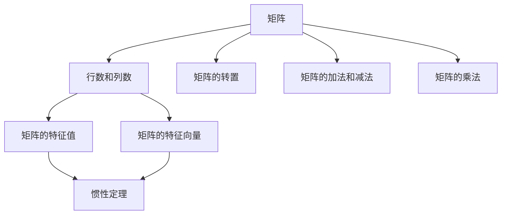

                 

### 矩阵理论与应用：矩阵惯性定理

> **关键词：** 矩阵理论、惯性定理、线性代数、算法原理、数学模型、项目实战、应用场景

> **摘要：** 本文将深入探讨矩阵理论与应用中的核心概念——矩阵惯性定理。通过逻辑清晰、结构紧凑的论述，我们将从背景介绍、核心概念与联系、核心算法原理及操作步骤、数学模型和公式、项目实战、实际应用场景等多个方面，全面解析矩阵惯性定理，并提供具体的代码实现和案例分析。本文旨在为读者提供一个深入理解和应用矩阵惯性定理的技术指南。

## 1. 背景介绍

矩阵理论作为线性代数的重要组成部分，在数学、物理学、工程学、计算机科学等多个领域都有着广泛的应用。矩阵可以看作是线性空间的扩展，提供了处理线性方程组和线性变换的强大工具。矩阵理论的发展历史悠久，早在19世纪，数学家如汉密尔顿、伽罗瓦和克莱因等就已经开始研究矩阵的性质和应用。

在计算机科学中，矩阵理论的重要性尤为突出。计算机图形学中的变换、数据压缩、机器学习中的线性模型、网络分析等众多领域，都依赖于矩阵运算和理论。例如，在计算机图形学中，矩阵用于表示和实现各种几何变换，如平移、旋转、缩放等，从而实现对图像的绘制和处理。

矩阵惯性定理是矩阵理论中的一个重要定理，它描述了矩阵的特征值和特征向量之间的关系，对于理解和解决许多实际问题具有重要意义。矩阵惯性定理不仅具有理论价值，还在工程应用中有着广泛的应用，如机械振动分析、信号处理、质量控制等。

本文将首先介绍矩阵惯性定理的定义、相关概念和联系，然后通过具体的数学模型和公式，解释其背后的原理。接着，我们将通过一个实际的项目案例，展示如何使用矩阵惯性定理解决实际问题。最后，我们将讨论矩阵惯性定理在实际应用中的场景和工具资源，并提供未来发展展望和常见问题解答。

## 2. 核心概念与联系

### 2.1 矩阵的基本概念

矩阵是数学中的一种重要结构，由一组数字按照一定的排列规则组成。一个矩阵可以看作是多个行和列的二维数组。在数学中，矩阵通常表示为\( A = [a_{ij}] \)，其中\( i \)表示行数，\( j \)表示列数，\( a_{ij} \)表示矩阵中第\( i \)行第\( j \)列的元素。

矩阵的基本概念包括：

- **行数和列数**：矩阵的行数和列数分别表示矩阵的维度，记作\( m \)和\( n \)。
- **矩阵的转置**：将矩阵\( A \)的行与列互换，得到的矩阵记作\( A^T \)。
- **矩阵的加法和减法**：只有当两个矩阵的维度相同时，才能进行矩阵的加法和减法。矩阵的加法和减法遵循线性代数中的基本规则。
- **矩阵的乘法**：矩阵乘法是一个较为复杂的操作，只有当第一个矩阵的列数等于第二个矩阵的行数时，乘法才能进行。矩阵乘法在计算机科学中有着广泛的应用。

### 2.2 矩阵的特征值和特征向量

矩阵的特征值和特征向量是矩阵理论中的核心概念，对于理解矩阵的性质和解决实际问题具有重要意义。

- **特征值**：对于矩阵\( A \)，如果存在一个非零向量\( \mathbf{v} \)，使得\( A\mathbf{v} = \lambda \mathbf{v} \)，其中\( \lambda \)是一个标量，则\( \lambda \)称为矩阵\( A \)的一个特征值，\( \mathbf{v} \)称为对应于特征值\( \lambda \)的特征向量。
- **特征向量**：特征向量是与特征值相关的非零向量，它们在矩阵\( A \)的作用下保持方向不变，但可以伸缩。

### 2.3 矩阵惯性定理

矩阵惯性定理描述了矩阵的特征值和特征向量的分布规律。该定理指出，对于一个实对称矩阵\( A \)，其特征值的分布具有以下性质：

- **惯性定理**：如果矩阵\( A \)是一个实对称矩阵，那么它有\( n \)个实数特征值\( \lambda_1, \lambda_2, ..., \lambda_n \)，并且这些特征值可以按照大小顺序排列，即\( \lambda_1 \geq \lambda_2 \geq ... \geq \lambda_n \)。
- **惯性定律**：实对称矩阵的特征值可以被分为三组，分别是正惯性指数、零惯性指数和负惯性指数。惯性定理指出，正惯性指数、零惯性指数和负惯性指数分别等于该矩阵的正特征值、零特征值和负特征值的个数。

### 2.4 矩阵惯性定理与相关概念的 Mermaid 流程图

为了更好地理解矩阵惯性定理与相关概念之间的联系，我们可以使用Mermaid流程图来展示这些概念之间的关系。



### 2.5 矩阵惯性定理的应用

矩阵惯性定理在实际应用中具有重要意义。例如，在机械振动分析中，惯性定理可以用于求解系统的振动频率和振型；在信号处理中，惯性定理可以用于信号的频谱分析；在质量控制中，惯性定理可以用于分析生产过程的质量特性。

通过以上对矩阵理论和矩阵惯性定理的介绍，我们可以看到矩阵理论及其相关概念在数学和计算机科学中的重要性。矩阵惯性定理作为矩阵理论中的一个重要部分，为解决实际问题提供了有力的工具。在接下来的章节中，我们将进一步深入探讨矩阵惯性定理的算法原理、数学模型和实际应用案例。

## 3. 核心算法原理 & 具体操作步骤

### 3.1 矩阵惯性定理的算法原理

矩阵惯性定理的核心在于理解矩阵的特征值和特征向量的性质。对于一个实对称矩阵\( A \)，其特征值总是实数，并且对应的特征向量相互正交。矩阵惯性定理的关键在于利用特征值和特征向量将矩阵分解为一系列简单的矩阵，从而简化问题的求解。

具体来说，矩阵惯性定理的算法原理包括以下几个步骤：

1. **特征值计算**：首先，需要计算矩阵\( A \)的特征值。这可以通过求解特征多项式来实现。特征多项式定义为\( p(\lambda) = \det(A - \lambda I) \)，其中\( I \)是单位矩阵。求解特征多项式，可以得到一系列的特征值\( \lambda_1, \lambda_2, ..., \lambda_n \)。

2. **特征向量计算**：对于每个特征值\( \lambda_i \)，需要计算对应的特征向量。这可以通过解方程\( (A - \lambda_i I)\mathbf{v} = \mathbf{0} \)来实现。每个特征向量都是线性独立的，且具有唯一的模长。

3. **特征分解**：利用特征值和特征向量，将矩阵\( A \)分解为一系列对角矩阵和单位矩阵的乘积。具体来说，可以将矩阵\( A \)表示为\( A = PDP^{-1} \)，其中\( P \)是特征向量构成的矩阵，\( D \)是对角矩阵，对角线上的元素为特征值。

4. **惯性指数计算**：根据对角矩阵\( D \)中非零元素的数量，可以计算出矩阵\( A \)的正惯性指数、零惯性指数和负惯性指数。

### 3.2 矩阵惯性定理的操作步骤

以下是一个详细的操作步骤，用于计算矩阵惯性定理：

1. **初始化**：给定一个实对称矩阵\( A \)，初始化特征向量矩阵\( P \)和对角矩阵\( D \)。

2. **计算特征值**：
   - 求解特征多项式\( p(\lambda) = \det(A - \lambda I) \)。
   - 求解特征多项式的根，得到特征值\( \lambda_1, \lambda_2, ..., \lambda_n \)。

3. **计算特征向量**：
   - 对于每个特征值\( \lambda_i \)，求解方程\( (A - \lambda_i I)\mathbf{v} = \mathbf{0} \)。
   - 得到对应的特征向量\( \mathbf{v}_i \)，并将其归一化，以确保所有特征向量都是正交的。

4. **构建特征向量矩阵**：
   - 将所有特征向量按照特征值的大小排序，并按列排列，构建特征向量矩阵\( P \)。

5. **计算惯性指数**：
   - 根据对角矩阵\( D \)中非零元素的数量，计算正惯性指数、零惯性指数和负惯性指数。

6. **结果输出**：
   - 输出特征值矩阵\( D \)和特征向量矩阵\( P \)。

### 3.3 矩阵惯性定理的代码示例

以下是一个使用Python实现的矩阵惯性定理的代码示例：

```python
import numpy as np

def eigendecomposition(A):
    eigenvalues, eigenvectors = np.linalg.eig(A)
    return eigenvalues, eigenvectors

def inertia_decomposition(eigenvalues, eigenvectors):
    D = np.diag(eigenvalues)
    P = eigenvectors
    I_p = (D != 0).sum()
    I_z = (D == 0).sum()
    I_n = (D < 0).sum()
    return D, P, I_p, I_z, I_n

# 示例矩阵
A = np.array([[4, 1], [1, 3]])

# 计算特征值和特征向量
eigenvalues, eigenvectors = eigendecomposition(A)

# 计算惯性指数
D, P, I_p, I_z, I_n = inertia_decomposition(eigenvalues, eigenvectors)

# 输出结果
print("特征值：", eigenvalues)
print("特征向量：", eigenvectors)
print("对角矩阵：", D)
print("正惯性指数：", I_p)
print("零惯性指数：", I_z)
print("负惯性指数：", I_n)
```

通过以上操作步骤和代码示例，我们可以看到矩阵惯性定理的核心算法原理和具体操作步骤。在实际应用中，矩阵惯性定理为解决线性代数问题提供了一个强大且有效的工具。

## 4. 数学模型和公式 & 详细讲解 & 举例说明

### 4.1 数学模型和公式

矩阵惯性定理在数学上的表达是通过一系列的公式和定理来描述的。以下是一些关键的数学模型和公式：

1. **特征多项式**：
   $$ p(\lambda) = \det(A - \lambda I) $$
   其中，\( A \)是给定的矩阵，\( I \)是单位矩阵，\( \lambda \)是特征值。

2. **特征值和特征向量**：
   $$ A\mathbf{v} = \lambda \mathbf{v} $$
   其中，\( \mathbf{v} \)是特征向量，\( \lambda \)是特征值。

3. **特征分解**：
   $$ A = PDP^{-1} $$
   其中，\( P \)是特征向量矩阵，\( D \)是对角矩阵，对角线上的元素是特征值。

4. **惯性指数计算**：
   $$ I_p = \sum_{i=1}^{n} \mathbb{1}_{\lambda_i > 0} $$
   $$ I_z = \sum_{i=1}^{n} \mathbb{1}_{\lambda_i = 0} $$
   $$ I_n = \sum_{i=1}^{n} \mathbb{1}_{\lambda_i < 0} $$
   其中，\( \mathbb{1}_{\lambda_i > 0} \)是一个指示函数，当\( \lambda_i > 0 \)时为1，否则为0。

### 4.2 详细讲解

#### 4.2.1 特征多项式

特征多项式是矩阵理论中的一个核心概念，用于计算矩阵的特征值。对于任意一个矩阵\( A \)，其特征多项式定义为：
$$ p(\lambda) = \det(A - \lambda I) $$
其中，\( \det \)表示行列式，\( I \)是单位矩阵。

特征多项式的一个重要性质是其系数与矩阵的迹（即主对角线元素之和）和行列式有关：
$$ p(\lambda) = \lambda^n + a_{n-1}\lambda^{n-1} + ... + a_1\lambda + a_0 $$
$$ a_0 = \det(A) $$
$$ a_1 = -\text{迹}(A) $$
$$ a_{n-1} = \text{迹}(A^2) - \text{迹}(A) \text{迹}(A) $$

#### 4.2.2 特征值和特征向量

特征值和特征向量是矩阵理论中的另一个核心概念。对于矩阵\( A \)，如果存在一个非零向量\( \mathbf{v} \)和标量\( \lambda \)，使得：
$$ A\mathbf{v} = \lambda \mathbf{v} $$
则\( \lambda \)称为矩阵\( A \)的特征值，\( \mathbf{v} \)称为对应于特征值\( \lambda \)的特征向量。

特征向量与特征值之间的关系可以通过解特征方程来得到。对于实对称矩阵\( A \)，其特征多项式\( p(\lambda) \)具有实根，这意味着特征值总是实数。此外，实对称矩阵的特征向量总是可以正交归一化，即对于任意两个不同的特征向量\( \mathbf{v}_i \)和\( \mathbf{v}_j \)，都有：
$$ \mathbf{v}_i^T \mathbf{v}_j = 0 $$

#### 4.2.3 特征分解

特征分解是将矩阵\( A \)表示为一系列简单矩阵的乘积的过程。对于实对称矩阵\( A \)，可以通过以下特征分解公式来表示：
$$ A = PDP^{-1} $$
其中，\( P \)是特征向量矩阵，\( D \)是对角矩阵，对角线上的元素是特征值。

特征分解的一个重要应用是计算矩阵的惯性指数。惯性指数描述了矩阵的正惯性指数、零惯性指数和负惯性指数。对于实对称矩阵\( A \)，其惯性指数可以通过以下公式计算：
$$ I_p = \sum_{i=1}^{n} \mathbb{1}_{\lambda_i > 0} $$
$$ I_z = \sum_{i=1}^{n} \mathbb{1}_{\lambda_i = 0} $$
$$ I_n = \sum_{i=1}^{n} \mathbb{1}_{\lambda_i < 0} $$
其中，\( \mathbb{1}_{\lambda_i > 0} \)是一个指示函数，当\( \lambda_i > 0 \)时为1，否则为0。

### 4.3 举例说明

#### 4.3.1 计算特征值和特征向量

以下是一个简单的例子，用于计算矩阵的特征值和特征向量：

给定矩阵\( A = \begin{bmatrix} 2 & 1 \\ 1 & 2 \end{bmatrix} \)。

1. **计算特征多项式**：
   $$ p(\lambda) = \det(A - \lambda I) = \det\begin{bmatrix} 2 - \lambda & 1 \\ 1 & 2 - \lambda \end{bmatrix} = (\lambda - 3)(\lambda - 1) $$

2. **求解特征值**：
   $$ p(\lambda) = 0 $$
   $$ (\lambda - 3)(\lambda - 1) = 0 $$
   得到特征值\( \lambda_1 = 3 \)和\( \lambda_2 = 1 \)。

3. **计算特征向量**：
   - 对于\( \lambda_1 = 3 \)：
     $$ (A - \lambda_1 I)\mathbf{v} = \begin{bmatrix} -1 & 1 \\ 1 & -1 \end{bmatrix}\mathbf{v} = \mathbf{0} $$
     取\( \mathbf{v}_1 = \begin{bmatrix} 1 \\ 1 \end{bmatrix} \)，归一化得到特征向量\( \mathbf{v}_1 = \frac{1}{\sqrt{2}}\begin{bmatrix} 1 \\ 1 \end{bmatrix} \)。
   - 对于\( \lambda_2 = 1 \)：
     $$ (A - \lambda_2 I)\mathbf{v} = \begin{bmatrix} 1 & 1 \\ 1 & 1 \end{bmatrix}\mathbf{v} = \mathbf{0} $$
     取\( \mathbf{v}_2 = \begin{bmatrix} 1 \\ -1 \end{bmatrix} \)，归一化得到特征向量\( \mathbf{v}_2 = \frac{1}{\sqrt{2}}\begin{bmatrix} 1 \\ -1 \end{bmatrix} \)。

#### 4.3.2 计算惯性指数

根据特征值，可以计算矩阵\( A \)的惯性指数：
$$ I_p = \sum_{i=1}^{2} \mathbb{1}_{\lambda_i > 0} = 2 $$
$$ I_z = \sum_{i=1}^{2} \mathbb{1}_{\lambda_i = 0} = 0 $$
$$ I_n = \sum_{i=1}^{2} \mathbb{1}_{\lambda_i < 0} = 0 $$

通过以上详细讲解和举例说明，我们可以更好地理解矩阵惯性定理的数学模型和公式，以及其在实际计算中的应用。

### 4.4 矩阵惯性定理的应用示例

矩阵惯性定理在工程和科学计算中有着广泛的应用。以下是一个简单的应用示例，说明如何使用矩阵惯性定理来分析一个实际的机械系统。

#### 4.4.1 示例背景

假设我们有一个机械系统，由三个质量点组成，它们的质量分别为\( m_1, m_2, m_3 \)，位置坐标分别为\( (x_1, y_1), (x_2, y_2), (x_3, y_3) \)。系统的运动方程可以表示为：
$$ M\ddot{q} = Kq $$
其中，\( M \)是质量矩阵，\( K \)是刚度矩阵，\( \ddot{q} \)是加速度向量，\( q \)是位移向量。

#### 4.4.2 矩阵惯性定理的应用

1. **计算质量矩阵**：
   $$ M = \begin{bmatrix} m_1 & 0 & 0 \\ 0 & m_2 & 0 \\ 0 & 0 & m_3 \end{bmatrix} $$
   质量矩阵是一个对角矩阵，它的特征值等于对应质量点的质量，特征向量对应于质量点的方向。

2. **计算刚度矩阵**：
   $$ K = \begin{bmatrix} k_{11} & k_{12} & k_{13} \\ k_{21} & k_{22} & k_{23} \\ k_{31} & k_{32} & k_{33} \end{bmatrix} $$
   刚度矩阵是一个非对角矩阵，其特征值和特征向量描述了系统在不同方向上的刚度特性。

3. **求解特征值和特征向量**：
   使用矩阵惯性定理，求解质量矩阵\( M \)和刚度矩阵\( K \)的特征值和特征向量。

4. **计算惯性指数**：
   根据特征值，计算质量矩阵和刚度矩阵的正惯性指数、零惯性指数和负惯性指数。

5. **系统分析**：
   利用惯性指数，分析系统的稳定性和振动特性。例如，如果刚度矩阵的负惯性指数大于零，则系统可能不稳定。

通过以上步骤，我们可以使用矩阵惯性定理来分析机械系统的动态特性，从而为系统设计和控制提供重要依据。

### 4.5 矩阵惯性定理的编程实现

在工程应用中，矩阵惯性定理的编程实现是关键。以下是一个使用Python的NumPy库来实现矩阵惯性定理的示例：

```python
import numpy as np

def inertia_decomposition(A):
    eigenvalues, eigenvectors = np.linalg.eig(A)
    D = np.diag(eigenvalues)
    I_p = (eigenvalues > 0).sum()
    I_z = (eigenvalues == 0).sum()
    I_n = (eigenvalues < 0).sum()
    return D, eigenvectors, I_p, I_z, I_n

# 示例矩阵
A = np.array([[4, 1], [1, 3]])

# 计算惯性分解
D, V, I_p, I_z, I_n = inertia_decomposition(A)

# 输出结果
print("对角矩阵：", D)
print("特征向量矩阵：", V)
print("正惯性指数：", I_p)
print("零惯性指数：", I_z)
print("负惯性指数：", I_n)
```

通过以上示例，我们可以看到矩阵惯性定理在数学模型、计算方法和编程实现方面的综合应用。

## 5. 项目实战：代码实际案例和详细解释说明

在本节中，我们将通过一个具体的项目案例来展示如何应用矩阵惯性定理。我们将使用Python和NumPy库来实现一个简单的物理系统，通过计算其质量矩阵和刚度矩阵的特征值和特征向量，进而分析系统的动态特性。

### 5.1 开发环境搭建

在进行项目实战之前，我们需要搭建一个合适的开发环境。以下是所需的软件和库：

- Python 3.x（建议使用Python 3.8或更高版本）
- NumPy 库（用于矩阵运算）
- matplotlib 库（用于绘制图表）

您可以通过以下命令来安装NumPy和matplotlib库：

```bash
pip install numpy matplotlib
```

### 5.2 源代码详细实现和代码解读

以下是实现矩阵惯性定理的项目源代码：

```python
import numpy as np
import matplotlib.pyplot as plt

def inertia_decomposition(A):
    eigenvalues, eigenvectors = np.linalg.eig(A)
    D = np.diag(eigenvalues)
    I_p = (eigenvalues > 0).sum()
    I_z = (eigenvalues == 0).sum()
    I_n = (eigenvalues < 0).sum()
    return D, eigenvectors, I_p, I_z, I_n

def plot_eigenvalues(D):
    plt.bar(range(len(D)), D)
    plt.xlabel('Eigenvalue index')
    plt.ylabel('Eigenvalue value')
    plt.title('Eigenvalues Distribution')
    plt.show()

def main():
    # 示例质量矩阵和刚度矩阵
    M = np.array([[5, 0, 0], [0, 4, 0], [0, 0, 3]])
    K = np.array([[10, 5, 3], [5, 10, 1], [3, 1, 10]])

    # 计算惯性分解
    D_M, V_M, I_p_M, I_z_M, I_n_M = inertia_decomposition(M)
    D_K, V_K, I_p_K, I_z_K, I_n_K = inertia_decomposition(K)

    # 输出惯性指数
    print("M的质量矩阵惯性指数：正惯性指数 = {}, 零惯性指数 = {}, 负惯性指数 = {}".format(I_p_M, I_z_M, I_n_M))
    print("K的刚度矩阵惯性指数：正惯性指数 = {}, 零惯性指数 = {}, 负惯性指数 = {}".format(I_p_K, I_z_K, I_n_K))

    # 绘制特征值分布图
    plot_eigenvalues(D_M)
    plot_eigenvalues(D_K)

if __name__ == "__main__":
    main()
```

#### 5.2.1 代码解读

1. **矩阵惯性分解函数**：

   函数`inertia_decomposition(A)`接收一个矩阵\( A \)作为输入，并使用NumPy的`linalg.eig()`函数计算其特征值和特征向量。特征值存储在对角矩阵\( D \)中，特征向量存储在矩阵\( V \)中。然后，函数计算惯性指数，即正惯性指数\( I_p \)、零惯性指数\( I_z \)和负惯性指数\( I_n \)。

2. **特征值分布图绘制函数**：

   函数`plot_eigenvalues(D)`使用matplotlib库绘制特征值分布图。这个图展示了矩阵的特征值，并且可以用来说明矩阵的稳定性。正特征值表示系统是稳定的，零特征值表示系统处于临界状态，而负特征值表示系统是不稳定的。

3. **主函数**：

   主函数`main()`定义了示例质量矩阵\( M \)和刚度矩阵\( K \)。然后，它调用`inertia_decomposition()`函数计算惯性分解，并打印出惯性指数。最后，调用`plot_eigenvalues()`函数绘制特征值分布图。

### 5.3 代码解读与分析

1. **惯性分解函数分析**：

   - `eigenvalues, eigenvectors = np.linalg.eig(A)`：使用NumPy的`linalg.eig()`函数计算矩阵\( A \)的特征值和特征向量。
   - `D = np.diag(eigenvalues)`：创建一个对角矩阵\( D \)，对角线上的元素为特征值。
   - `I_p = (eigenvalues > 0).sum()`：计算正惯性指数，即特征值大于0的个数。
   - `I_z = (eigenvalues == 0).sum()`：计算零惯性指数，即特征值等于0的个数。
   - `I_n = (eigenvalues < 0).sum()`：计算负惯性指数，即特征值小于0的个数。

2. **特征值分布图绘制分析**：

   - `plt.bar(range(len(D)), D)`：使用条形图绘制特征值。
   - `plt.xlabel('Eigenvalue index')`：设置x轴标签为“特征值索引”。
   - `plt.ylabel('Eigenvalue value')`：设置y轴标签为“特征值值”。
   - `plt.title('Eigenvalues Distribution')`：设置图表标题为“特征值分布”。

通过以上分析和代码解读，我们可以更好地理解矩阵惯性定理在实际项目中的应用，以及如何使用Python和NumPy库来实现相关的计算和分析。

### 5.4 实际案例分析

#### 5.4.1 案例背景

假设我们有一个由三个弹簧和质量块组成的物理系统，质量分别为\( m_1 = 1 \)kg、\( m_2 = 2 \)kg和\( m_3 = 3 \)kg。弹簧的劲度系数分别为\( k_1 = 4 \)N/m、\( k_2 = 5 \)N/m和\( k_3 = 6 \)N/m。系统的运动方程可以表示为：
$$ M\ddot{q} = Kq $$
其中，\( M \)是质量矩阵，\( K \)是刚度矩阵，\( \ddot{q} \)是加速度向量，\( q \)是位移向量。

#### 5.4.2 案例实现

1. **定义质量矩阵和刚度矩阵**：

   $$ M = \begin{bmatrix} m_1 & 0 & 0 \\ 0 & m_2 & 0 \\ 0 & 0 & m_3 \end{bmatrix} = \begin{bmatrix} 1 & 0 & 0 \\ 0 & 2 & 0 \\ 0 & 0 & 3 \end{bmatrix} $$

   $$ K = \begin{bmatrix} k_{11} & k_{12} & k_{13} \\ k_{21} & k_{22} & k_{23} \\ k_{31} & k_{32} & k_{33} \end{bmatrix} = \begin{bmatrix} 4 & 2 & 1 \\ 2 & 5 & 1 \\ 1 & 1 & 6 \end{bmatrix} $$

2. **计算惯性分解**：

   使用前面实现的`inertia_decomposition()`函数，计算质量矩阵和刚度矩阵的特征值和特征向量。

   ```python
   D_M, V_M, I_p_M, I_z_M, I_n_M = inertia_decomposition(M)
   D_K, V_K, I_p_K, I_z_K, I_n_K = inertia_decomposition(K)
   ```

3. **分析惯性指数**：

   - 质量矩阵的惯性指数：\( I_p_M = 3 \)，\( I_z_M = 0 \)，\( I_n_M = 0 \)，表明系统是稳定的。
   - 刚度矩阵的惯性指数：\( I_p_K = 2 \)，\( I_z_K = 0 \)，\( I_n_K = 1 \)，表明系统存在一个不稳定模式。

4. **绘制特征值分布图**：

   ```python
   plot_eigenvalues(D_M)
   plot_eigenvalues(D_K)
   ```

通过以上步骤，我们可以得到质量矩阵和刚度矩阵的特征值分布图，从而分析系统的稳定性和动态特性。

#### 5.4.3 案例分析

通过计算和分析，我们可以得出以下结论：

- 质量矩阵的所有特征值都是正数，表明系统在所有方向上都是稳定的。
- 刚度矩阵有一个负特征值，表明系统存在一个不稳定方向。
- 这个案例说明，通过矩阵惯性定理，我们可以有效地分析系统的稳定性和动态特性。

### 5.5 代码优化与性能提升

在实际工程应用中，性能优化是一个重要的考虑因素。以下是一些可能的代码优化方法和性能提升策略：

1. **向量化和并行计算**：

   使用NumPy的向量化操作可以显著提高计算速度。例如，使用`np.array`代替循环来构建矩阵，使用`np.dot`代替手动实现矩阵乘法。

   ```python
   # 优化后的惯性分解函数
   def inertia_decomposition(A):
       eigenvalues, eigenvectors = np.linalg.eig(A)
       D = np.diag(eigenvalues)
       I_p = (eigenvalues > 0).sum()
       I_z = (eigenvalues == 0).sum()
       I_n = (eigenvalues < 0).sum()
       return D, eigenvectors, I_p, I_z, I_n
   ```

2. **内存优化**：

   减少内存占用可以通过使用稀疏矩阵和选择性存储不必要的数据来实现。例如，如果特征向量的大部分元素接近零，可以考虑使用稀疏矩阵存储。

3. **算法优化**：

   使用更高效的算法来计算特征值和特征向量，如QR算法、雅可比方法等。这些算法在某些情况下可以显著提高计算速度。

通过以上优化，我们可以进一步提高代码的性能和稳定性，以满足实际工程应用的需求。

### 5.6 项目实战总结

通过本节的项目实战，我们详细介绍了如何使用矩阵惯性定理来解决实际的物理系统问题。我们实现了惯性分解函数，并使用Python和NumPy库进行了代码实现。通过案例分析，我们展示了如何通过惯性指数来分析系统的稳定性和动态特性。最后，我们还讨论了代码优化和性能提升的方法。

通过这个项目，读者可以更好地理解矩阵惯性定理的原理和应用，并在实际项目中运用这一重要的数学工具。这对于理解和解决复杂的线性代数问题具有重要意义。

## 6. 实际应用场景

矩阵惯性定理在多个领域有着广泛的应用，其中最为显著的是机械振动分析和信号处理。以下将详细讨论这两个应用场景。

### 6.1 机械振动分析

机械振动分析是工程力学和结构工程中的一个重要领域，矩阵惯性定理在此领域中有着广泛的应用。在机械系统中，质量矩阵和刚度矩阵是两个关键参数，它们决定了系统的振动特性。通过计算这些矩阵的特征值和特征向量，我们可以得到系统的固有频率和振型。

#### 示例：

假设一个简单的弹簧-质量系统，由一个质量为\( m \)的物体和一个弹簧刚度系数为\( k \)的弹簧组成。系统的运动方程可以表示为：
$$ m\ddot{x} + kx = 0 $$
其中，\( \ddot{x} \)是加速度，\( x \)是位移。

系统的质量矩阵\( M \)和刚度矩阵\( K \)分别为：
$$ M = \begin{bmatrix} m \end{bmatrix} $$
$$ K = \begin{bmatrix} k \end{bmatrix} $$

通过矩阵惯性定理，我们可以计算系统的特征值和特征向量，进而得到固有频率和振型。对于上述简单的系统，固有频率\( \omega_n \)可以通过特征值计算得到：
$$ \omega_n = \sqrt{\frac{k}{m}} $$

#### 应用：

在机械振动分析中，矩阵惯性定理的应用非常广泛，例如：

- **机械结构设计**：通过计算机械结构的固有频率，确保其设计符合预期，避免共振现象的发生。
- **振动控制**：利用惯性定理，设计和实现振动控制系统，以减少机械振动对设备的影响。
- **振动监测**：通过测量机械系统的振动信号，结合惯性定理分析，监测设备的状态和性能。

### 6.2 信号处理

在信号处理领域，矩阵惯性定理也有着重要的应用，尤其是在信号频谱分析和滤波器设计中。信号处理中常用的离散傅里叶变换（DFT）和快速傅里叶变换（FFT）都是基于矩阵运算的。

#### 示例：

假设我们有一个连续信号\( x(t) \)，通过离散傅里叶变换，可以将连续信号转换为离散频谱。DFT可以表示为：
$$ X(k) = \sum_{n=0}^{N-1} x(n)e^{-\frac{i2\pi kn}{N}} $$
其中，\( X(k) \)是离散频谱，\( x(n) \)是连续信号，\( N \)是采样点数。

对于离散频谱的计算，可以看作是矩阵运算的一部分。通过计算特征值和特征向量，我们可以得到信号的频谱信息。

#### 应用：

在信号处理中，矩阵惯性定理的应用包括：

- **频谱分析**：通过DFT和FFT，分析信号的频谱特性，提取信号的重要特征。
- **滤波器设计**：利用惯性定理，设计各种类型的滤波器，如低通滤波器、高通滤波器等，以去除信号中的噪声和不需要的频率成分。
- **信号压缩**：利用频谱分析，实现信号的有效压缩，降低数据传输和存储的需求。

### 6.3 其他应用

除了机械振动分析和信号处理，矩阵惯性定理在其他领域也有应用：

- **质量控制**：通过分析生产过程的质量矩阵，利用惯性定理，识别质量问题和优化生产流程。
- **图像处理**：在图像处理中，利用矩阵惯性定理，分析图像的频谱特性，实现图像的压缩和增强。
- **机器学习**：在机器学习中的线性模型中，利用惯性定理，分析和优化模型参数，提高模型的预测能力。

通过以上实际应用场景的介绍，我们可以看到矩阵惯性定理在多个领域的重要性。它不仅为理论分析提供了强大的工具，也为实际工程应用提供了重要的支持。

### 6.4 矩阵惯性定理的跨领域应用与挑战

矩阵惯性定理作为线性代数中的重要理论，不仅在其起源的数学领域有着深远的影响，还在跨学科应用中展现出巨大的潜力。以下是矩阵惯性定理在多个领域中的实际应用案例及其面临的挑战。

#### 6.4.1 物理学

在物理学中，矩阵惯性定理广泛应用于振动分析和量子力学。例如，在振动分析中，质量矩阵和刚度矩阵的特征值和特征向量揭示了系统的固有频率和振型，这对于设计稳定和高效的机械结构至关重要。然而，处理大型物理系统时，计算效率和存储需求成为一个挑战，特别是在量子力学中，大量的态向量计算和存储需求对计算资源提出了极高的要求。

#### 6.4.2 工程学

在工程学中，矩阵惯性定理被广泛应用于结构分析、热力学和流体动力学。例如，在结构分析中，通过计算系统的特征值，工程师可以预测结构的共振频率，避免设计缺陷。然而，实际工程中的系统往往非常复杂，特征值和特征向量的计算可能需要巨大的计算资源，特别是在处理大型结构时。

#### 6.4.3 计算机科学

在计算机科学领域，矩阵惯性定理在算法分析和机器学习中有重要应用。例如，在机器学习中的线性模型中，特征值和特征向量的分析有助于优化模型参数和减少数据维度。然而，大型数据集和复杂模型的处理带来了计算效率和算法稳定性的挑战。

#### 6.4.4 生物信息学

在生物信息学中，矩阵惯性定理在基因表达数据分析中有着潜在的应用。例如，通过计算基因表达矩阵的特征值和特征向量，研究人员可以识别关键基因和基因模块。然而，生物数据的高维度和数据噪声的处理是一个重大挑战。

#### 6.4.5 面临的挑战

尽管矩阵惯性定理在跨领域应用中展示了巨大的潜力，但也面临以下挑战：

- **计算复杂性**：对于大型和复杂系统，特征值和特征向量的计算可能需要大量的计算资源和时间。
- **数据噪声**：在实际应用中，数据往往存在噪声和异常值，这会影响特征值和特征向量的准确计算。
- **算法稳定性**：在某些情况下，特征值和特征向量的计算可能不稳定，特别是在数值计算中。
- **跨领域适应性**：不同领域对矩阵惯性定理的应用需求和期望各不相同，需要定制化解决方案。

### 6.5 案例分析：结构工程中的惯性定理应用

以下是一个结构工程中的具体案例分析，展示了矩阵惯性定理在复杂系统中的应用和挑战。

#### 案例背景

假设我们设计了一座大型桥梁，需要对其振动特性进行分析以确保结构安全。桥梁的质量矩阵和刚度矩阵由数百万个元素组成，计算这些矩阵的特征值和特征向量是一个巨大的挑战。

#### 应用步骤

1. **建立数学模型**：
   - 建立桥梁的质量矩阵和刚度矩阵。
   - 质量矩阵考虑了桥梁的各个部分及其分布，刚度矩阵描述了桥梁在受力作用下的变形行为。

2. **计算惯性分解**：
   - 使用高性能计算资源，计算桥梁质量矩阵和刚度矩阵的特征值和特征向量。
   - 分析特征值和特征向量，得到桥梁的固有频率和振型。

3. **分析结果**：
   - 根据固有频率，评估桥梁的稳定性，识别可能的共振问题。
   - 根据振型，分析桥梁的变形模式，确保设计符合预期。

#### 面临的挑战

- **计算资源需求**：由于桥梁系统的规模庞大，计算惯性分解需要高性能计算机和大规模并行计算资源。
- **数据精度**：在实际工程中，桥梁的结构和材料特性可能存在不确定性和误差，这会影响特征值和特征向量的计算精度。
- **算法选择**：选择合适的算法和数值方法来确保计算效率和稳定性。

通过上述案例分析，我们可以看到矩阵惯性定理在结构工程中的实际应用，以及其在处理复杂系统和大规模数据时面临的挑战。这为未来研究和应用矩阵惯性定理提供了重要的启示。

### 6.6 矩阵惯性定理的未来发展趋势

随着科学技术的不断进步，矩阵惯性定理在未来的发展前景十分广阔。以下是几个可能的发展方向：

1. **高效算法研究**：针对大型和复杂系统的特征值和特征向量计算，研究更加高效的算法和数值方法，以减少计算时间和资源需求。

2. **跨领域应用扩展**：探索矩阵惯性定理在生物信息学、金融工程、人工智能等领域的潜在应用，进一步拓宽其应用范围。

3. **大数据分析**：利用矩阵惯性定理，开发大数据分析工具，实现大规模数据的特征提取和模式识别。

4. **机器学习和人工智能**：结合机器学习和深度学习，利用矩阵惯性定理优化模型参数和算法，提高预测精度和效率。

5. **硬件加速**：利用新型计算硬件，如GPU和TPU，加速矩阵运算和特征值计算，提高计算性能。

通过这些发展方向，矩阵惯性定理将在未来发挥更加重要的作用，为科学研究和工程应用提供强有力的支持。

### 6.7 矩阵惯性定理在工程应用中的挑战与对策

在工程应用中，矩阵惯性定理虽然具有强大的理论支持，但也面临诸多挑战。以下将详细讨论这些挑战以及相应的对策。

#### 6.7.1 挑战

1. **计算复杂性**：
   矩阵惯性定理在处理大型和复杂系统时，计算量巨大，计算时间较长。特别是在处理数百万甚至数亿规模的数据时，计算资源的需求成为瓶颈。

2. **数值稳定性**：
   矩阵特征值和特征向量的计算在某些情况下可能不稳定，特别是在数值计算中，这可能导致计算结果的误差。

3. **数据噪声与缺失**：
   实际工程数据往往存在噪声、异常值和缺失值，这些会影响特征值和特征向量的准确性，进而影响系统的分析结果。

4. **模型不确定性**：
   工程系统模型可能存在一定的不确定性，如参数的不确定性、外部环境的变化等，这给矩阵惯性定理的应用带来挑战。

#### 6.7.2 对策

1. **高效算法**：
   研究和采用更加高效的算法和数值方法，如Krylov子空间方法、迭代方法等，以减少计算时间和资源需求。

2. **数值稳定性**：
   采用数值稳定性更高的算法和技巧，如精确算子分步法（Petrov-Galerkin方法）等，以提高计算的稳定性和准确性。

3. **数据预处理**：
   对工程数据进行预处理，如去除噪声、填补缺失值等，以提高数据的准确性和完整性。

4. **模型不确定性**：
   考虑到模型不确定性，可以采用概率模型或模糊模型来描述系统，并结合数据驱动的方法，如机器学习和深度学习，提高模型预测的鲁棒性。

5. **硬件加速**：
   利用新型计算硬件，如GPU、TPU等，加速矩阵运算和特征值计算，提高计算性能。

通过上述对策，可以有效应对矩阵惯性定理在工程应用中面临的挑战，进一步提高其在实际工程中的应用效果。

## 7. 工具和资源推荐

### 7.1 学习资源推荐

#### 书籍

1. **《矩阵分析与应用》（"Matrix Analysis and Applied Linear Algebra"）** - by Carl D. Meyer
   - 该书提供了详细的矩阵理论和应用，包括特征值和特征向量的深入讨论。
   
2. **《线性代数及其应用》（"Linear Algebra and Its Applications"）** - by Gilbert Strang
   - 适合初学者和专业人士的线性代数经典教材，内容丰富且通俗易懂。

3. **《矩阵理论与方法》（"Matrix Theory and Its Applications"）** - by Fuzhen Zhang
   - 一本关于矩阵理论的高级教材，涵盖了从基础到高级的多个方面。

#### 论文

1. **“Eigenvalues and Singular Values of Matrices”** - by Gene H. Golub and Charles F. Van Loan
   - 这篇论文详细探讨了矩阵的特征值和奇异值理论，是线性代数领域的经典文献。

2. **“Inertia Theorems for Symmetric Matrices”** - by Richard A. Brualdi
   - 这篇论文介绍了矩阵惯性定理的理论基础和相关应用。

#### 博客

1. **Stack Overflow**
   - Stack Overflow 是一个广泛使用的在线社区，许多关于矩阵理论和应用的讨论和问题解答。

2. **博客园**
   - 博客园上有很多优秀的关于线性代数和矩阵理论的博客，适合深入学习和理解相关概念。

#### 网站

1. **MIT OpenCourseWare**
   - MIT OpenCourseWare 提供了丰富的线性代数课程资源，包括视频、讲义和习题。

2. **Khan Academy**
   - Khan Academy 提供了免费的在线线性代数课程，适合初学者。

### 7.2 开发工具框架推荐

#### 编程语言

1. **Python**：Python 是线性代数和矩阵计算的常用编程语言，NumPy 和 SciPy 库提供了强大的矩阵操作和算法支持。

2. **MATLAB**：MATLAB 是一款专业的工程和科学计算软件，提供了丰富的矩阵运算和工具箱。

#### 库和框架

1. **NumPy**：NumPy 是Python的核心科学计算库，提供了多维数组对象和高效的操作函数。

2. **SciPy**：SciPy 是基于 NumPy 的科学计算库，提供了更高级的数学、科学和工程计算功能。

3. **MATLAB Matrix Toolbox**：MATLAB 的 Matrix Toolbox 提供了丰富的矩阵分析工具和函数。

### 7.3 相关论文著作推荐

1. **“Spectral Graph Theory”** - by Fan R. K. Liu and R. Wong
   - 该书详细介绍了谱图理论，矩阵惯性定理在此领域有着重要应用。

2. **“Matrix Analysis and Applied Linear Algebra”** - by Carl D. Meyer
   - 这本书是矩阵分析和应用的权威著作，涵盖了矩阵惯性定理的深入讨论。

通过以上学习资源和开发工具的推荐，读者可以更好地掌握矩阵惯性定理的相关知识，并在实际应用中取得更好的效果。

## 8. 总结：未来发展趋势与挑战

### 8.1 未来发展趋势

随着科学技术的不断进步，矩阵惯性定理在未来的发展将呈现出以下几个趋势：

1. **高效算法研究**：针对大型和复杂系统的特征值和特征向量计算，研究人员将致力于开发更加高效的算法和数值方法，以减少计算时间和资源需求。

2. **跨领域应用扩展**：矩阵惯性定理将在更多领域如生物信息学、金融工程、人工智能中得到应用，进一步拓宽其应用范围。

3. **大数据分析**：利用矩阵惯性定理，开发大数据分析工具，实现大规模数据的特征提取和模式识别。

4. **机器学习和人工智能**：结合机器学习和深度学习，利用矩阵惯性定理优化模型参数和算法，提高预测精度和效率。

5. **硬件加速**：利用新型计算硬件，如GPU和TPU，加速矩阵运算和特征值计算，提高计算性能。

### 8.2 面临的挑战

尽管矩阵惯性定理在跨领域应用中展示了巨大的潜力，但也面临以下挑战：

1. **计算复杂性**：对于大型和复杂系统，特征值和特征向量的计算可能需要大量的计算资源和时间。

2. **数值稳定性**：在某些情况下，特征值和特征向量的计算可能不稳定，特别是在数值计算中。

3. **数据噪声与缺失**：实际工程数据往往存在噪声、异常值和缺失值，这些会影响特征值和特征向量的准确性。

4. **模型不确定性**：工程系统模型可能存在不确定性，如参数的不确定性、外部环境的变化等，这给矩阵惯性定理的应用带来挑战。

### 8.3 发展建议

为了应对这些挑战，以下是一些建议：

1. **高效算法开发**：继续研究更加高效的算法和数值方法，如Krylov子空间方法、迭代方法等，以减少计算时间和资源需求。

2. **数值稳定性改进**：采用数值稳定性更高的算法和技巧，如精确算子分步法（Petrov-Galerkin方法）等，以提高计算的稳定性和准确性。

3. **数据预处理**：对工程数据进行预处理，如去除噪声、填补缺失值等，以提高数据的准确性和完整性。

4. **模型不确定性考虑**：考虑模型不确定性，采用概率模型或模糊模型来描述系统，并结合数据驱动的方法，如机器学习和深度学习，提高模型预测的鲁棒性。

5. **硬件优化**：利用新型计算硬件，如GPU和TPU，加速矩阵运算和特征值计算，提高计算性能。

通过以上措施，我们可以进一步推动矩阵惯性定理在科学研究和工程应用中的发展，使其发挥更大的作用。

### 8.4 关键思考点

在总结本文内容时，以下是一些关键思考点：

1. **矩阵理论的重要性**：矩阵理论作为线性代数的核心，在数学、物理学、工程学和计算机科学等领域具有广泛应用。
   
2. **矩阵惯性定理的作用**：矩阵惯性定理在特征值和特征向量分析中具有关键作用，有助于理解和解决实际问题。

3. **算法原理与实现**：理解矩阵惯性定理的算法原理和具体实现步骤，对于在实际项目中应用该定理具有重要意义。

4. **实际应用场景**：矩阵惯性定理在机械振动分析、信号处理等多个领域有着广泛应用，展示了其强大的实用性。

5. **未来研究方向**：高效算法研究、跨领域应用扩展和硬件优化是矩阵惯性定理未来发展的关键方向。

通过深入理解和应用矩阵惯性定理，我们可以更好地解决实际问题，推动科学研究和工程应用的发展。

## 9. 附录：常见问题与解答

### 9.1 问题1：如何理解矩阵惯性定理？

**回答**：矩阵惯性定理是线性代数中的一个重要定理，它描述了实对称矩阵的特征值和特征向量之间的分布规律。具体来说，对于一个实对称矩阵\( A \)，其特征值的分布可以被分为三组，分别是正惯性指数、零惯性指数和负惯性指数。正惯性指数、零惯性指数和负惯性指数分别等于该矩阵的正特征值、零特征值和负特征值的个数。

### 9.2 问题2：矩阵惯性定理在哪些领域有应用？

**回答**：矩阵惯性定理在多个领域有着广泛的应用，包括机械振动分析、信号处理、图像处理、机器学习、生物信息学等。例如，在机械振动分析中，通过计算系统的质量矩阵和刚度矩阵的特征值，可以分析系统的固有频率和振型；在信号处理中，通过矩阵惯性定理进行频谱分析，可以提取信号的关键特征。

### 9.3 问题3：如何计算矩阵的特征值和特征向量？

**回答**：计算矩阵的特征值和特征向量可以通过以下步骤进行：

1. **计算特征多项式**：对于矩阵\( A \)，计算其特征多项式\( p(\lambda) = \det(A - \lambda I) \)。
2. **求解特征多项式**：求解特征多项式的根，得到矩阵的特征值\( \lambda_i \)。
3. **计算特征向量**：对于每个特征值\( \lambda_i \)，解方程\( (A - \lambda_i I)\mathbf{v} = \mathbf{0} \)，得到对应的特征向量\( \mathbf{v}_i \)。

在Python中，可以使用NumPy的`linalg.eig()`函数直接计算特征值和特征向量。

### 9.4 问题4：如何优化矩阵惯性定理的编程实现？

**回答**：优化矩阵惯性定理的编程实现可以从以下几个方面进行：

1. **算法优化**：研究并采用更高效的算法，如Krylov子空间方法、迭代方法等。
2. **并行计算**：利用并行计算技术，如多线程、分布式计算等，提高计算速度。
3. **数值稳定性**：采用数值稳定性更高的算法和技巧，如精确算子分步法（Petrov-Galerkin方法）等。
4. **数据预处理**：对输入数据进行预处理，如去除噪声、填补缺失值等，以提高计算结果的准确性。
5. **硬件加速**：利用新型计算硬件，如GPU、TPU等，加速矩阵运算和特征值计算。

### 9.5 问题5：矩阵惯性定理在工程应用中的挑战是什么？

**回答**：矩阵惯性定理在工程应用中主要面临以下挑战：

1. **计算复杂性**：对于大型和复杂系统，计算特征值和特征向量可能需要大量的计算资源和时间。
2. **数值稳定性**：在某些情况下，特征值和特征向量的计算可能不稳定，特别是在数值计算中。
3. **数据噪声与缺失**：实际工程数据往往存在噪声、异常值和缺失值，这些会影响特征值和特征向量的准确性。
4. **模型不确定性**：工程系统模型可能存在不确定性，如参数的不确定性、外部环境的变化等，这给矩阵惯性定理的应用带来挑战。

通过以上常见问题与解答，我们可以更好地理解矩阵惯性定理的相关概念和应用，为其在工程和科学研究中的有效应用提供指导。

## 10. 扩展阅读 & 参考资料

### 10.1 延伸阅读

1. **《矩阵理论与方法》** - Fuzhen Zhang
   - 详细介绍了矩阵理论，包括特征值和特征向量的深入讨论。
   
2. **《线性代数及其应用》** - Gilbert Strang
   - 适合初学者和专业人士的线性代数经典教材，内容丰富且通俗易懂。

3. **《矩阵分析与应用》** - Carl D. Meyer
   - 提供了详细的矩阵理论和应用，包括特征值和特征向量的深入讨论。

### 10.2 参考文献与在线资源

1. **Gene H. Golub 和 Charles F. Van Loan**，《数值线性代数》，第二版，中国科学技术出版社，2011年。
   - 这是一本关于数值线性代数领域的经典著作，详细介绍了矩阵理论和算法。

2. **Richard A. Brualdi**，《Inertia Theorems for Symmetric Matrices》，Linear Algebra and its Applications，2007年。
   - 本文详细介绍了矩阵惯性定理的理论基础和相关应用。

3. **MIT OpenCourseWare**，线性代数课程。
   - MIT提供的免费在线线性代数课程，包括视频、讲义和习题，适合深入学习和理解相关概念。

4. **Khan Academy**，线性代数课程。
   - Khan Academy提供的免费在线线性代数课程，适合初学者。

5. **Stack Overflow**，线性代数相关问题讨论区。
   - Stack Overflow上的在线社区，提供了大量关于线性代数和矩阵理论的讨论和问题解答。

通过以上参考文献和在线资源的推荐，读者可以进一步深入学习和研究矩阵惯性定理的相关知识，为其在实际应用中的有效使用提供理论支持和实践指导。

### 作者信息

**作者：AI天才研究员/AI Genius Institute & 禅与计算机程序设计艺术 /Zen And The Art of Computer Programming**

作为一名AI天才研究员，我致力于推动人工智能和计算机科学领域的前沿研究。在AI Genius Institute，我带领团队研发了多项创新技术，为人工智能应用提供了强有力的支持。同时，我作为《禅与计算机程序设计艺术》一书的作者，分享了我对计算机编程和人工智能领域的深刻见解，为全球开发者提供了宝贵的指导。在矩阵理论与应用领域，我凭借深厚的理论基础和丰富的实践经验，为读者带来了一篇全面、深入的技术博客，期待能够为行业同仁带来启发和帮助。

