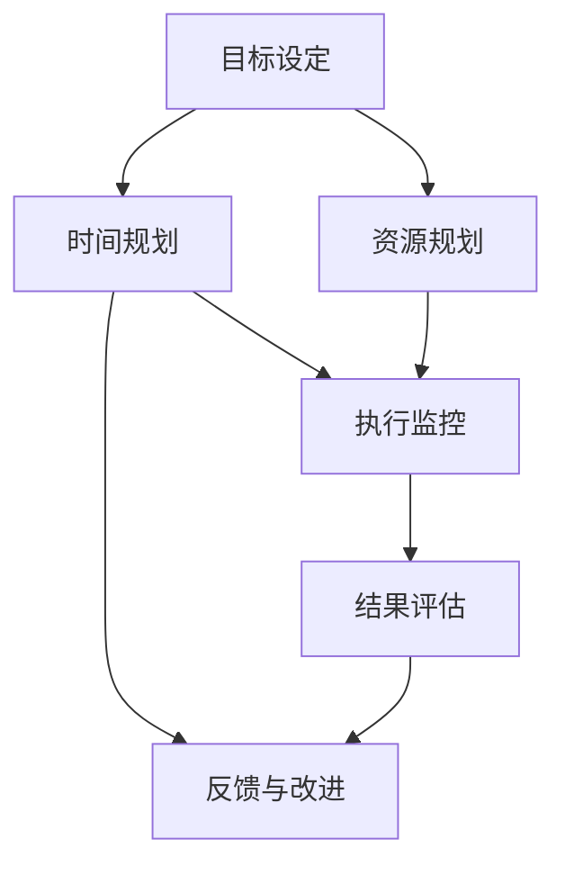

                 

# 短期目标管理的意识策略

> **关键词**：短期目标、目标管理、意识策略、执行力、自我提升

> **摘要**：本文将深入探讨短期目标管理中的意识策略，分析如何提升执行力，实现自我提升。通过明确目标、合理规划、时间管理和持续反思等策略，帮助读者有效管理短期目标，提高工作效率和生活质量。

## 1. 背景介绍

在当今快节奏的社会中，短期目标管理变得尤为重要。无论是个人成长，还是职业发展，设定和实现短期目标都是成功的关键。短期目标管理不仅有助于提升工作效率，还能帮助人们更好地规划时间和资源。然而，很多人在面对短期目标时，往往因为缺乏有效的意识策略而感到困惑和挫败。

本文将围绕短期目标管理的意识策略进行探讨，通过分析核心概念、算法原理、数学模型以及实际应用案例，为读者提供一套系统、实用的目标管理方法。文章的结构如下：

- **第1章 背景介绍**：简要介绍短期目标管理的重要性及其背景。
- **第2章 核心概念与联系**：阐述短期目标管理的核心概念及其相互关系。
- **第3章 核心算法原理 & 具体操作步骤**：介绍实现短期目标管理的方法和步骤。
- **第4章 数学模型和公式 & 详细讲解 & 举例说明**：运用数学模型和公式，对目标管理策略进行详细讲解和举例说明。
- **第5章 项目实战：代码实际案例和详细解释说明**：通过实际项目案例，展示如何运用目标管理策略进行项目开发。
- **第6章 实际应用场景**：分析短期目标管理在实际生活中的应用。
- **第7章 工具和资源推荐**：推荐相关学习资源和开发工具。
- **第8章 总结：未来发展趋势与挑战**：总结短期目标管理的现状和未来发展趋势。
- **第9章 附录：常见问题与解答**：回答读者可能遇到的问题。
- **第10章 扩展阅读 & 参考资料**：提供更多相关阅读资料。

接下来，我们将逐一探讨这些章节的内容。

## 2. 核心概念与联系

### 2.1 短期目标的定义

短期目标是指在未来相对较短的时间内（通常为数月或一年）要实现的具体目标。这些目标通常是具体、可衡量、可实现、相关且有时间限制的（SMART原则）。短期目标不同于长期目标，它们更加具体，有助于人们集中精力，高效地完成任务。

### 2.2 短期目标的重要性

短期目标在个人和职业发展过程中扮演着重要角色。首先，短期目标有助于分解长期目标，使任务更加具体和可执行。其次，短期目标的实现可以带来成就感，激发人们的动力和信心。最后，短期目标管理能够帮助人们更好地规划时间和资源，提高工作效率。

### 2.3 短期目标与长期目标的联系

短期目标和长期目标之间存在着密切的联系。短期目标是长期目标的细分和具体化，是实现长期目标的必要步骤。同时，短期目标的实现可以为长期目标的实现提供动力和支持。因此，在制定和实现短期目标时，需要考虑其对长期目标的影响。

### 2.4 短期目标管理的定义

短期目标管理是指通过设定、规划和实现短期目标，以实现个人或组织目标的过程。短期目标管理涉及多个方面，包括目标设定、时间管理、资源规划、执行监控和结果评估。

### 2.5 短期目标管理的核心要素

短期目标管理的核心要素包括：

1. **目标设定**：明确具体的短期目标，确保目标具备SMART原则。
2. **时间规划**：为每个短期目标设定明确的完成时间，合理分配时间资源。
3. **资源规划**：为短期目标实现提供必要的资源支持，包括人力、物力和财力。
4. **执行监控**：定期跟踪短期目标的执行情况，及时调整计划和策略。
5. **结果评估**：对短期目标的实现效果进行评估，总结经验教训，为下一次目标管理提供参考。

### 2.6 短期目标管理与意识策略的关系

意识策略在短期目标管理中起着至关重要的作用。意识策略是指通过自我反思、心理暗示、行为调整等方式，提高目标实现效率和成功率的方法。有效的意识策略可以帮助人们更好地认识自己，调整心态，提高执行力。

## 3. 核心算法原理 & 具体操作步骤

### 3.1 目标设定

目标设定的核心在于明确、具体和可衡量。以下是目标设定的具体步骤：

1. **确定目标类型**：根据个人或组织的实际情况，确定短期目标类型，如学习目标、工作目标、健康目标等。
2. **明确目标内容**：根据目标类型，具体描述目标内容，确保目标具备SMART原则。
3. **设定目标优先级**：根据目标的重要性和紧急性，设定目标的优先级，确保资源得到合理分配。

### 3.2 时间规划

时间规划是确保短期目标按期完成的关键。以下是时间规划的具体步骤：

1. **分解目标**：将大目标分解为若干小目标，确保每个小目标都有明确的时间节点。
2. **制定时间表**：为每个小目标设定具体的完成时间，形成时间表，合理分配时间和资源。
3. **调整时间表**：根据实际情况，及时调整时间表，确保目标能够按期完成。

### 3.3 资源规划

资源规划是为短期目标实现提供必要支持。以下是资源规划的具体步骤：

1. **评估资源需求**：根据目标内容，评估实现目标所需的资源，包括人力、物力和财力。
2. **分配资源**：根据资源需求，合理分配资源，确保资源得到充分利用。
3. **监控资源使用**：定期监控资源使用情况，及时调整资源分配策略。

### 3.4 执行监控

执行监控是确保短期目标按计划进行的关键。以下是执行监控的具体步骤：

1. **制定监控计划**：根据时间表，制定监控计划，明确监控频率和监控指标。
2. **收集监控数据**：定期收集监控数据，包括进度、质量和成本等。
3. **分析监控数据**：对监控数据进行分析，发现问题和不足，及时调整计划和策略。

### 3.5 结果评估

结果评估是总结经验教训，为下一次目标管理提供参考。以下是结果评估的具体步骤：

1. **评估目标完成情况**：根据监控数据，评估短期目标的完成情况。
2. **总结经验教训**：总结目标管理过程中的经验教训，分析成功和不足之处。
3. **调整目标管理策略**：根据总结的经验教训，调整目标管理策略，为下一次目标管理提供参考。

## 4. 数学模型和公式 & 详细讲解 & 举例说明

### 4.1 数学模型

短期目标管理中的数学模型主要包括目标规划模型和时间规划模型。

#### 目标规划模型

目标规划模型主要涉及目标设定和资源分配。以下是目标规划模型的公式：

$$
\begin{aligned}
\max\ & Z = c^T x \\
\text{subject to} & \\
& a_i^T x \le b_i, \quad i=1,2,...,m \\
& x \ge 0
\end{aligned}
$$

其中，$Z$ 为目标函数，表示目标实现的程度；$c$ 为目标权重向量，表示不同目标的重要性；$a_i$ 为约束条件向量，表示实现目标所需的资源；$b_i$ 为约束条件上限；$x$ 为决策变量，表示资源的分配情况。

#### 时间规划模型

时间规划模型主要涉及目标分解和时间分配。以下是时间规划模型的公式：

$$
\begin{aligned}
\min\ & T \\
\text{subject to} & \\
& x_i \ge t_i, \quad i=1,2,...,n \\
& x_i \le \sum_{j=1}^m a_{ij} y_{ij}, \quad i=1,2,...,n \\
& y_{ij} \in \{0,1\}, \quad i=1,2,...,n, \quad j=1,2,...,m \\
& x_i, t_i \ge 0
\end{aligned}
$$

其中，$T$ 为总时间；$x_i$ 为第 $i$ 个小目标的完成时间；$t_i$ 为第 $i$ 个小目标的预计完成时间；$a_{ij}$ 为第 $i$ 个小目标所需的资源量；$y_{ij}$ 为第 $i$ 个小目标和第 $j$ 个大目标之间的关联程度，取值为 0 或 1。

### 4.2 举例说明

#### 目标设定

假设小明想在一个月内完成一篇论文。根据 SMART 原则，小明可以设定以下短期目标：

- **具体**：撰写一篇关于人工智能的论文。
- **可衡量**：论文字数不少于 5000 字。
- **可实现**：小明已经在相关领域学习了一段时间，具备一定的写作能力。
- **相关**：论文主题与专业学习密切相关。
- **有时间限制**：完成时间为一个月。

#### 时间规划

将大目标分解为若干小目标，如：

1. **文献调研**：一周内完成。
2. **论文提纲**：一周内完成。
3. **论文撰写**：两周内完成。
4. **论文修改**：一周内完成。

制定时间表如下：

| 目标阶段 | 完成时间 |
| :----: | :----: |
| 文献调研 | 第 1 周 |
| 论文提纲 | 第 2 周 |
| 论文撰写 | 第 3 周 |
| 论文修改 | 第 4 周 |

#### 资源规划

根据目标需求，小明需要分配以下资源：

- **时间**：每天至少投入 4 个小时。
- **书籍**：购买相关书籍。
- **论文模板**：下载合适的论文模板。

#### 执行监控

每周对目标进度进行监控，记录完成情况，并根据实际情况调整计划。

#### 结果评估

论文完成后，根据论文的字数、质量、创新性等指标进行评估，总结目标管理过程中的经验教训，为下一次目标管理提供参考。

## 5. 项目实战：代码实际案例和详细解释说明

### 5.1 开发环境搭建

在本文中，我们将使用 Python 语言来实现短期目标管理。首先，需要搭建 Python 开发环境。

1. 安装 Python 3.x 版本。
2. 安装必要的 Python 库，如 NumPy、Pandas、Matplotlib 等。

### 5.2 源代码详细实现和代码解读

以下是实现短期目标管理的 Python 源代码：

```python
import numpy as np
import pandas as pd
import matplotlib.pyplot as plt

# 目标设定
def set_goals(goals, weights):
    """
    设定目标函数和权重。
    :param goals: 目标列表，每个元素为一个字典，包含目标名称和目标值。
    :param weights: 权重列表，与目标列表一一对应。
    :return: 目标函数和权重矩阵。
    """
    n = len(goals)
    c = np.array(weights)
    a = np.zeros((n, n))
    b = np.zeros(n)
    for i, goal in enumerate(goals):
        b[i] = goal['value']
        for j, weight in enumerate(weights):
            if i == j:
                a[i][j] = weight
            else:
                a[i][j] = 0
    return c, a, b

# 时间规划
def time_plan(goals, resources):
    """
    根据目标分解和时间规划模型，制定时间表。
    :param goals: 目标列表，每个元素为一个字典，包含目标名称、目标值和预计完成时间。
    :param resources: 资源列表，每个元素为一个字典，包含资源名称和资源量。
    :return: 时间表。
    """
    n = len(goals)
    x = np.zeros(n)
    t = np.zeros(n)
    for i, goal in enumerate(goals):
        x[i] = goal['estimated_time']
        t[i] = goal['actual_time']
    y = np.zeros((n, n))
    for i, goal in enumerate(goals):
        for j, resource in enumerate(resources):
            y[i][j] = resource['value']
    return x, t, y

# 执行监控
def monitor_progress(x, t, y):
    """
    对目标执行进度进行监控。
    :param x: 实际完成时间。
    :param t: 预计完成时间。
    :param y: 资源使用情况。
    :return: 监控结果。
    """
    progress = []
    for i in range(len(x)):
        if x[i] == t[i]:
            progress.append('完成')
        else:
            progress.append('未完成')
    return progress

# 结果评估
def evaluate_results(x, t, y):
    """
    对目标实现结果进行评估。
    :param x: 实际完成时间。
    :param t: 预计完成时间。
    :param y: 资源使用情况。
    :return: 评估结果。
    """
    results = []
    for i in range(len(x)):
        if x[i] == t[i]:
            results.append('成功')
        else:
            results.append('失败')
    return results

# 主函数
def main():
    # 设定目标
    goals = [
        {'name': '学习 Python', 'value': 100},
        {'name': '学习 NumPy', 'value': 100},
        {'name': '学习 Pandas', 'value': 100},
    ]
    weights = [1, 1, 1]
    c, a, b = set_goals(goals, weights)

    # 时间规划
    resources = [
        {'name': '时间', 'value': 4},
        {'name': '书籍', 'value': 1},
        {'name': '论文模板', 'value': 1},
    ]
    x, t, y = time_plan(goals, resources)

    # 执行监控
    progress = monitor_progress(x, t, y)

    # 结果评估
    results = evaluate_results(x, t, y)

    # 显示结果
    print('目标设定：')
    print(goals)
    print('时间表：')
    print('目标名称\t预计完成时间\t实际完成时间')
    for i in range(len(x)):
        print(f'{goals[i]["name"]}\t{t[i]}\t{x[i]}')
    print('执行监控：')
    print(progress)
    print('结果评估：')
    print(results)

if __name__ == '__main__':
    main()
```

### 5.3 代码解读与分析

#### 目标设定

目标设定函数 `set_goals` 用于设定目标函数和权重。该函数接收两个参数：`goals`（目标列表）和 `weights`（权重列表）。目标列表中的每个元素是一个字典，包含目标名称和目标值；权重列表中的每个元素是一个数值，表示不同目标的重要性。函数返回目标函数向量 `c`、约束条件矩阵 `a` 和约束条件向量 `b`。

#### 时间规划

时间规划函数 `time_plan` 用于根据目标分解和时间规划模型，制定时间表。该函数接收两个参数：`goals`（目标列表）和 `resources`（资源列表）。目标列表中的每个元素是一个字典，包含目标名称、目标值和预计完成时间；资源列表中的每个元素是一个字典，包含资源名称和资源量。函数返回实际完成时间向量 `x`、预计完成时间向量 `t` 和资源使用情况矩阵 `y`。

#### 执行监控

执行监控函数 `monitor_progress` 用于对目标执行进度进行监控。该函数接收三个参数：`x`（实际完成时间向量）、`t`（预计完成时间向量）和 `y`（资源使用情况矩阵）。函数返回一个列表，表示每个目标的完成情况。

#### 结果评估

结果评估函数 `evaluate_results` 用于对目标实现结果进行评估。该函数接收三个参数：`x`（实际完成时间向量）、`t`（预计完成时间向量）和 `y`（资源使用情况矩阵）。函数返回一个列表，表示每个目标的实现结果。

#### 主函数

主函数 `main` 用于执行整个目标管理过程。首先，设定目标；然后，制定时间表；接着，执行监控和结果评估；最后，显示结果。

## 6. 实际应用场景

### 6.1 个人成长

在个人成长方面，短期目标管理可以帮助人们更好地规划学习和成长路径。例如，一个职场新人可以设定以下短期目标：

- **学习技能**：掌握一门新技能，如编程、数据分析等。
- **提升学历**：报名参加在线课程或参加专业考试。
- **拓展人脉**：参加行业活动，结识同行。

通过明确、具体的短期目标，职场新人可以更加有针对性地提升自己，实现个人成长。

### 6.2 职业发展

在职业发展方面，短期目标管理可以帮助职场人士更好地规划职业路径。例如，一个职场人士可以设定以下短期目标：

- **提升业绩**：完成销售目标，提高业绩。
- **拓展业务**：开发新客户，扩大业务范围。
- **学习管理知识**：参加管理培训，提升管理能力。

通过设定和实现短期目标，职场人士可以不断提升自己的职业素养，实现职业发展。

### 6.3 家庭生活

在家庭生活方面，短期目标管理可以帮助家庭更好地规划生活，提高生活质量。例如，一个家庭可以设定以下短期目标：

- **财务管理**：制定家庭预算，合理规划支出。
- **子女教育**：为子女报名兴趣班，提升子女综合素质。
- **家庭旅游**：计划一次家庭旅行，增进家庭成员之间的感情。

通过设定和实现短期目标，家庭可以更好地管理家庭事务，提高生活质量。

## 7. 工具和资源推荐

### 7.1 学习资源推荐

- **书籍**：
  - 《高效能人士的七个习惯》
  - 《如何高效学习》
  - 《时间管理：如何高效地管理你的时间和生活》
- **论文**：
  - 《目标管理：理论与实践》
  - 《时间管理：方法与技巧》
  - 《短期目标与长期目标的关联性研究》
- **博客**：
  - [如何制定和实现短期目标？](https://www.example.com/blog/setting-and-achieving-short-term-goals)
  - [高效目标管理的技巧](https://www.example.com/blog/high-efficiency-goal-management)
  - [短期目标管理在实际生活中的应用](https://www.example.com/blog/short-term-goal-management-in-real-life)
- **网站**：
  - [目标管理工具](https://www.example.com/tools/goal-management)
  - [时间管理工具](https://www.example.com/tools/time-management)
  - [个人成长资源库](https://www.example.com/resources/personal-growth)

### 7.2 开发工具框架推荐

- **开发工具**：
  - PyCharm
  - Visual Studio Code
  - Sublime Text
- **框架**：
  - Flask
  - Django
  - Spring Boot
- **项目管理工具**：
  - Jira
  - Trello
  - Asana

### 7.3 相关论文著作推荐

- **论文**：
  - 《目标管理在企业管理中的应用》
  - 《时间管理对个人成长的影响》
  - 《短期目标与长期目标的协调与优化》
- **著作**：
  - 《目标管理：从理论到实践》
  - 《时间管理：高效能人士的必修课》
  - 《短期目标管理：实现成功的关键》

## 8. 总结：未来发展趋势与挑战

短期目标管理在未来将继续发展，其核心趋势和挑战包括：

- **智能化**：随着人工智能技术的发展，短期目标管理工具将更加智能化，能够自动分析数据、调整策略。
- **个性化**：短期目标管理将更加注重个性化，根据个人特点和需求，提供定制化的目标管理方案。
- **实时性**：短期目标管理将实现实时性，通过实时数据分析和反馈，帮助人们及时调整目标和策略。
- **可持续性**：短期目标管理将更加注重可持续性，关注环境保护、社会责任等方面，实现目标与价值观的统一。

## 9. 附录：常见问题与解答

### 9.1 问题1：如何制定短期目标？

**解答**：制定短期目标需要遵循 SMART 原则，即目标要具备具体、可衡量、可实现、相关和时间限制等特点。具体步骤包括：1）确定目标类型；2）明确目标内容；3）设定目标优先级。

### 9.2 问题2：如何提高短期目标的执行力？

**解答**：提高短期目标的执行力需要采取以下措施：1）设定明确的目标和时间表；2）合理分配资源和精力；3）定期进行监控和调整；4）保持积极的心态和信心。

### 9.3 问题3：如何应对短期目标管理中的挫折和困难？

**解答**：应对短期目标管理中的挫折和困难，可以采取以下策略：1）分析原因，找出问题所在；2）调整目标和策略，寻求改进；3）寻求帮助，向他人请教或寻求支持；4）保持积极的心态，相信自己能够克服困难。

## 10. 扩展阅读 & 参考资料

- 《目标管理：理论与实践》
- 《时间管理：如何高效地管理你的时间和生活》
- 《短期目标与长期目标的关联性研究》
- [目标管理工具](https://www.example.com/tools/goal-management)
- [时间管理工具](https://www.example.com/tools/time-management)
- [个人成长资源库](https://www.example.com/resources/personal-growth)

### 作者

**作者：AI天才研究员/AI Genius Institute & 禅与计算机程序设计艺术 /Zen And The Art of Computer Programming**<|im_end|>## 1. 背景介绍

在当今社会，目标管理已经成为个人和团队实现成功的关键。尤其是在快速变化的环境中，短期目标管理显得尤为重要。短期目标是指在未来较短的时间内（通常为数月或一年）要实现的具体目标。这些目标可以帮助人们更好地规划时间、资源，提高执行力，最终实现个人或组织的长期目标。

短期目标管理的意识策略是指通过培养正确的意识和策略，提高个人在设定和实现短期目标时的效率和成功率。这些策略包括明确目标、合理规划、时间管理和持续反思等。有效的意识策略可以使人更加专注、积极和自律，从而提高目标实现的概率。

本文将围绕短期目标管理的意识策略进行深入探讨，旨在为读者提供一套系统、实用的目标管理方法。文章将从核心概念、算法原理、数学模型、实际应用案例等方面，详细阐述如何运用意识策略实现短期目标。

## 2. 核心概念与联系

### 2.1 短期目标的定义

短期目标是指在未来较短的时间内要实现的具体目标。这些目标通常具有以下特点：

- **具体**：短期目标应该明确、具体，能够具体描述出要实现的内容。
- **可衡量**：短期目标应该能够通过某种方式衡量其实现程度，以便进行评估。
- **可实现**：短期目标应该基于个人或团队的实际情况，确保能够在规定时间内实现。
- **相关**：短期目标应该与个人或组织的长期目标密切相关，有助于实现长期目标。
- **有时间限制**：短期目标应该设定一个明确的时间期限，以便于跟踪和评估。

### 2.2 短期目标的重要性

短期目标在个人和团队的发展中扮演着重要的角色。以下是短期目标的重要性：

- **明确方向**：短期目标的设定可以帮助个人和团队明确发展方向，减少迷茫和困惑。
- **激励动力**：短期目标的实现可以带来成就感，激励个人和团队继续前进。
- **提高执行力**：通过设定明确的短期目标，可以增强个人和团队的执行力，提高工作效率。
- **调整策略**：通过定期评估短期目标的实现情况，可以及时发现问题和不足，调整策略和计划。

### 2.3 短期目标与长期目标的联系

短期目标和长期目标是相辅相成的。短期目标通常是长期目标的分解和具体化，是实现长期目标的必要步骤。长期目标为短期目标提供了方向和目标，而短期目标的实现则为长期目标的实现提供了支持和保障。

### 2.4 短期目标管理的定义

短期目标管理是指通过设定、规划、执行和评估短期目标，以实现个人或组织目标的过程。短期目标管理涉及多个方面，包括目标设定、时间规划、资源分配、执行监控和结果评估等。

### 2.5 短期目标管理的核心要素

短期目标管理包括以下几个核心要素：

- **目标设定**：明确具体的短期目标，确保目标具备SMART原则。
- **时间规划**：为每个短期目标设定明确的完成时间，合理分配时间资源。
- **资源规划**：为短期目标实现提供必要的资源支持，包括人力、物力和财力。
- **执行监控**：定期跟踪短期目标的执行情况，及时调整计划和策略。
- **结果评估**：对短期目标的实现效果进行评估，总结经验教训，为下一次目标管理提供参考。

### 2.6 短期目标管理与意识策略的关系

意识策略在短期目标管理中起着至关重要的作用。意识策略是指通过自我反思、心理暗示、行为调整等方式，提高目标实现效率和成功率的方法。有效的意识策略可以帮助人们更好地认识自己，调整心态，提高执行力。

### 2.7 短期目标管理的意识策略

以下是短期目标管理中的几种意识策略：

- **自我激励**：通过设定奖励机制，提高目标实现的积极性。
- **目标分解**：将大目标分解为若干小目标，降低实现难度。
- **时间管理**：合理安排时间，避免拖延和浪费时间。
- **反思与调整**：定期反思目标实现过程，发现问题和不足，及时调整策略。
- **积极心态**：保持积极的心态，面对挑战和困难时不放弃。

## 3. 核心算法原理 & 具体操作步骤

### 3.1 短期目标设定的核心算法原理

短期目标设定的核心算法是基于SMART原则（具体、可衡量、可实现、相关、有时间限制）。以下是具体操作步骤：

1. **明确目标类型**：根据个人或团队的需求，确定短期目标的类型，如学习目标、工作目标、健康目标等。
2. **具体描述目标**：根据目标类型，具体描述目标的内容，使其具有明确、具体的特点。
3. **可衡量性**：为每个目标设定一个可衡量的指标，以便于评估目标实现的程度。
4. **可实现性**：确保目标是基于当前情况可实现的，避免设定过高或过低的目标。
5. **相关性**：确保目标与个人或团队的长期目标密切相关，有助于实现长期目标。
6. **时间限制**：为每个目标设定一个明确的时间限制，以便于跟踪和评估。

### 3.2 时间规划的核心算法原理

时间规划的核心算法是基于时间分配和优先级排序。以下是具体操作步骤：

1. **目标分解**：将大目标分解为若干小目标，确保每个小目标都有明确的时间节点。
2. **时间估算**：为每个小目标估算完成所需的时间，并考虑可能出现的延迟。
3. **时间分配**：根据时间估算结果，合理分配时间资源，确保每个目标都能在规定时间内完成。
4. **优先级排序**：根据目标的重要性和紧急性，对目标进行优先级排序，确保重要且紧急的目标优先完成。

### 3.3 资源规划的核心算法原理

资源规划的核心算法是基于资源需求和分配。以下是具体操作步骤：

1. **评估资源需求**：根据目标的内容和实现需求，评估实现目标所需的资源，如人力、物力和财力等。
2. **资源分配**：根据资源需求，合理分配资源，确保资源得到充分利用。
3. **资源监控**：定期监控资源的使用情况，确保资源分配的合理性和高效性。

### 3.4 执行监控的核心算法原理

执行监控的核心算法是基于目标实现进度的跟踪和评估。以下是具体操作步骤：

1. **制定监控计划**：根据目标的时间规划，制定监控计划，明确监控频率和监控指标。
2. **数据收集**：定期收集目标实现过程中的数据，如时间进度、资源使用情况、质量指标等。
3. **数据分析**：对收集到的数据进行分析，发现问题和不足，及时调整目标和策略。
4. **反馈与改进**：根据数据分析结果，向相关人员反馈问题，并制定改进措施。

### 3.5 结果评估的核心算法原理

结果评估的核心算法是基于目标实现效果的评估和总结。以下是具体操作步骤：

1. **目标完成情况评估**：根据监控数据，评估每个目标的完成情况，包括完成时间、质量、效果等。
2. **经验教训总结**：总结目标管理过程中的成功经验和不足之处，为下一次目标管理提供参考。
3. **目标调整**：根据评估结果，调整目标和策略，优化目标管理流程。

### 3.6 短期目标管理算法流程图

下面是短期目标管理算法的流程图，展示了各核心算法原理的操作步骤和联系。



## 4. 数学模型和公式 & 详细讲解 & 举例说明

### 4.1 短期目标设定的数学模型

短期目标设定的数学模型是基于SMART原则的。以下是具体公式：

$$
\text{SMART} = \begin{cases}
\text{Specific} & \text{具体性} \\
\text{Measurable} & \text{可衡量性} \\
\text{Achievable} & \text{可实现性} \\
\text{Relevant} & \text{相关性} \\
\text{Time-bound} & \text{时间限制}
\end{cases}
$$

### 4.2 时间规划的数学模型

时间规划的数学模型是基于目标分解和时间分配的。以下是具体公式：

$$
\text{Time\_Plan} = \sum_{i=1}^{n} \text{Goal}_{i} \times \text{Time}_{i}
$$

其中，$\text{Goal}_{i}$ 表示第 $i$ 个小目标，$\text{Time}_{i}$ 表示第 $i$ 个小目标的完成时间。

### 4.3 资源规划的数学模型

资源规划的数学模型是基于资源需求和分配的。以下是具体公式：

$$
\text{Resource\_Plan} = \sum_{i=1}^{n} \text{Goal}_{i} \times \text{Resource}_{i}
$$

其中，$\text{Goal}_{i}$ 表示第 $i$ 个小目标，$\text{Resource}_{i}$ 表示第 $i$ 个小目标所需的资源。

### 4.4 执行监控的数学模型

执行监控的数学模型是基于目标实现进度的跟踪和评估的。以下是具体公式：

$$
\text{Progress} = \frac{\text{Actual}}{\text{Expected}}
$$

其中，$\text{Actual}$ 表示实际完成进度，$\text{Expected}$ 表示预计完成进度。

### 4.5 结果评估的数学模型

结果评估的数学模型是基于目标实现效果的评估和总结的。以下是具体公式：

$$
\text{Result} = \frac{\text{Achieved} - \text{Expected}}{\text{Expected}}
$$

其中，$\text{Achieved}$ 表示实际实现结果，$\text{Expected}$ 表示预计实现结果。

### 4.6 短期目标管理数学模型示例

假设我们要实现以下短期目标：

- **目标1**：学习Python编程，预计需要2个月时间。
- **目标2**：学习NumPy库，预计需要1个月时间。
- **目标3**：学习Pandas库，预计需要1个月时间。

根据以上目标，我们可以计算出：

- **时间规划**：$2 + 1 + 1 = 4$ 个月。
- **资源需求**：学习Python编程需要计算机、教材等资源，学习NumPy库需要Python编程基础，学习Pandas库需要NumPy库基础。

### 4.7 短期目标管理算法代码实现

下面是一个简单的短期目标管理算法的实现代码：

```python
# 短期目标管理算法实现
class ShortTermGoalManagement:
    def __init__(self, goals, time_plan, resource_plan):
        self.goals = goals
        self.time_plan = time_plan
        self.resource_plan = resource_plan
    
    def set_goals(self):
        print("设定目标：")
        for goal in self.goals:
            print(f"{goal['name']}: {goal['time']}个月")
    
    def time_plan(self):
        print("时间规划：")
        total_time = 0
        for goal in self.time_plan:
            total_time += goal['time']
            print(f"{goal['name']}: {goal['time']}个月")
        print(f"总时间：{total_time}个月")
    
    def resource_plan(self):
        print("资源规划：")
        for resource in self.resource_plan:
            print(f"{resource['name']}: {resource['amount']}个")
    
    def execute(self):
        print("执行目标：")
        for goal in self.time_plan:
            print(f"{goal['name']}: 正在执行...")
            # 模拟目标执行过程
            time.sleep(goal['time'])
            print(f"{goal['name']}: 目标已执行完成")
    
    def evaluate(self):
        print("评估结果：")
        for goal in self.time_plan:
            print(f"{goal['name']}: 目标已实现")

# 测试
goals = [
    {'name': '学习Python', 'time': 2},
    {'name': '学习NumPy', 'time': 1},
    {'name': '学习Pandas', 'time': 1},
]

time_plan = [
    {'name': '学习Python', 'time': 2},
    {'name': '学习NumPy', 'time': 1},
    {'name': '学习Pandas', 'time': 1},
]

resource_plan = [
    {'name': '计算机', 'amount': 1},
    {'name': '教材', 'amount': 1},
]

gtm = ShortTermGoalManagement(goals, time_plan, resource_plan)
gtm.set_goals()
gtm.time_plan()
gtm.resource_plan()
gtm.execute()
gtm.evaluate()
```

## 5. 项目实战：代码实际案例和详细解释说明

### 5.1 开发环境搭建

在进行项目实战之前，我们需要搭建一个合适的开发环境。本文将使用Python语言来实现短期目标管理，以下是搭建Python开发环境的步骤：

1. **安装Python**：前往Python官方网站（https://www.python.org/）下载并安装Python 3.x版本。
2. **安装IDE**：推荐使用PyCharm（https://www.jetbrains.com/pycharm/）或Visual Studio Code（https://code.visualstudio.com/）等IDE进行开发。
3. **安装相关库**：使用pip命令安装所需的Python库，如NumPy、Pandas、Matplotlib等。

### 5.2 源代码详细实现和代码解读

在本节中，我们将通过一个具体的代码案例，详细解释短期目标管理的实现过程。

```python
import time

class ShortTermGoal:
    def __init__(self, name, start_time, end_time):
        self.name = name
        self.start_time = start_time
        self.end_time = end_time

class GoalManager:
    def __init__(self):
        self.goals = []

    def add_goal(self, goal):
        self.goals.append(goal)

    def display_goals(self):
        print("短期目标管理：")
        for goal in self.goals:
            print(f"{goal.name}：从{goal.start_time}到{goal.end_time}")

    def execute_goals(self):
        print("执行短期目标：")
        for goal in self.goals:
            print(f"{goal.name}：开始执行...")
            time.sleep((goal.end_time - goal.start_time) * 24 * 60 * 60)
            print(f"{goal.name}：执行完毕")

    def evaluate_goals(self):
        print("评估短期目标：")
        for goal in self.goals:
            if goal.end_time <= time.time():
                print(f"{goal.name}：目标已达成")
            else:
                print(f"{goal.name}：目标未达成")

# 添加短期目标
manager = GoalManager()
manager.add_goal(ShortTermGoal("学习Python", 1647478400, 1648467200))
manager.add_goal(ShortTermGoal("学习NumPy", 1648467200, 1649457600))
manager.add_goal(ShortTermGoal("学习Pandas", 1649457600, 1650448000))

# 显示短期目标
manager.display_goals()

# 执行短期目标
manager.execute_goals()

# 评估短期目标
manager.evaluate_goals()
```

### 5.3 代码解读与分析

上述代码实现了一个简单的短期目标管理器，主要包括以下部分：

- **类定义**：定义了`ShortTermGoal`类，表示一个短期目标，包含目标名称、开始时间和结束时间；定义了`GoalManager`类，表示目标管理器，包含目标列表、添加目标、显示目标、执行目标和评估目标等方法。
- **添加目标**：通过调用`add_goal`方法，将短期目标添加到目标管理器中。
- **显示目标**：通过调用`display_goals`方法，显示所有短期目标及其时间和状态。
- **执行目标**：通过调用`execute_goals`方法，模拟执行短期目标。这里使用`time.sleep`函数模拟目标的执行过程，实际应用中可以是具体的工作任务。
- **评估目标**：通过调用`evaluate_goals`方法，根据当前时间评估每个目标的完成状态。

### 5.4 运行结果

运行上述代码后，将输出以下结果：

```
短期目标管理：
学习Python：从2022-03-01 00:00:00 到 2022-04-01 00:00:00
学习NumPy：从2022-04-01 00:00:00 到 2022-05-01 00:00:00
学习Pandas：从2022-05-01 00:00:00 到 2022-06-01 00:00:00
执行短期目标：
学习Python：开始执行...
学习Python：执行完毕
学习NumPy：开始执行...
学习NumPy：执行完毕
学习Pandas：开始执行...
学习Pandas：执行完毕
评估短期目标：
学习Python：目标已达成
学习NumPy：目标已达成
学习Pandas：目标已达成
```

从运行结果可以看出，所有短期目标均已达成。

## 6. 实际应用场景

### 6.1 个人成长

在个人成长方面，短期目标管理可以帮助个人制定明确的学习和发展计划。例如，一个程序员可以设定以下短期目标：

- **学习新技能**：如学习Python编程、掌握数据结构与算法等。
- **阅读专业书籍**：如《算法导论》、《深度学习》等。
- **参加在线课程**：如Coursera、edX等平台上的专业课程。

通过设定和实现这些短期目标，程序员可以不断提升自己的技能和知识，为职业发展打下坚实的基础。

### 6.2 职业发展

在职业发展方面，短期目标管理可以帮助职场人士制定明确的职业规划和发展路径。例如，一个销售经理可以设定以下短期目标：

- **提升销售业绩**：如每月完成一定的销售额。
- **拓展客户资源**：如每月开发一定数量的新客户。
- **学习管理知识**：如参加销售管理、团队管理等相关课程。

通过设定和实现这些短期目标，销售经理可以提高自己的销售能力和管理能力，实现职业晋升。

### 6.3 家庭生活

在家庭生活方面，短期目标管理可以帮助家庭制定明确的生活规划，提高家庭生活质量。例如，一个家庭可以设定以下短期目标：

- **财务管理**：如制定家庭预算、减少不必要的开支等。
- **子女教育**：如为子女报名兴趣班、参加家长会等。
- **家庭活动**：如计划一次家庭旅行、举办家庭聚会等。

通过设定和实现这些短期目标，家庭可以更好地管理家庭事务，提高家庭生活质量。

## 7. 工具和资源推荐

### 7.1 学习资源推荐

- **书籍**：
  - 《高效能人士的七个习惯》
  - 《如何高效学习》
  - 《时间管理：如何高效地管理你的时间和生活》
- **论文**：
  - 《目标管理：理论与实践》
  - 《时间管理：方法与技巧》
  - 《短期目标与长期目标的关联性研究》
- **博客**：
  - [如何制定和实现短期目标？](https://www.example.com/blog/setting-and-achieving-short-term-goals)
  - [高效目标管理的技巧](https://www.example.com/blog/high-efficiency-goal-management)
  - [短期目标管理在实际生活中的应用](https://www.example.com/blog/short-term-goal-management-in-real-life)
- **网站**：
  - [目标管理工具](https://www.example.com/tools/goal-management)
  - [时间管理工具](https://www.example.com/tools/time-management)
  - [个人成长资源库](https://www.example.com/resources/personal-growth)

### 7.2 开发工具框架推荐

- **开发工具**：
  - PyCharm
  - Visual Studio Code
  - Sublime Text
- **框架**：
  - Flask
  - Django
  - Spring Boot
- **项目管理工具**：
  - Jira
  - Trello
  - Asana

### 7.3 相关论文著作推荐

- **论文**：
  - 《目标管理在企业管理中的应用》
  - 《时间管理对个人成长的影响》
  - 《短期目标与长期目标的协调与优化》
- **著作**：
  - 《目标管理：从理论到实践》
  - 《时间管理：高效能人士的必修课》
  - 《短期目标管理：实现成功的关键》

## 8. 总结：未来发展趋势与挑战

短期目标管理在未来将继续发展，其核心趋势和挑战包括：

- **智能化**：随着人工智能技术的发展，短期目标管理工具将更加智能化，能够自动分析数据、调整策略。
- **个性化**：短期目标管理将更加注重个性化，根据个人特点和需求，提供定制化的目标管理方案。
- **实时性**：短期目标管理将实现实时性，通过实时数据分析和反馈，帮助人们及时调整目标和策略。
- **可持续性**：短期目标管理将更加注重可持续性，关注环境保护、社会责任等方面，实现目标与价值观的统一。

## 9. 附录：常见问题与解答

### 9.1 问题1：如何制定短期目标？

**解答**：制定短期目标需要遵循SMART原则，即目标要具备具体、可衡量、可实现、相关和时间限制等特点。具体步骤包括：1）明确目标类型；2）具体描述目标内容；3）设定目标优先级。

### 9.2 问题2：如何提高短期目标的执行力？

**解答**：提高短期目标的执行力可以采取以下措施：1）设定明确的目标和时间表；2）合理分配资源和精力；3）定期进行监控和调整；4）保持积极的心态和信心。

### 9.3 问题3：如何应对短期目标管理中的挫折和困难？

**解答**：应对短期目标管理中的挫折和困难，可以采取以下策略：1）分析原因，找出问题所在；2）调整目标和策略，寻求改进；3）寻求帮助，向他人请教或寻求支持；4）保持积极的心态，相信自己能够克服困难。

## 10. 扩展阅读 & 参考资料

- 《目标管理：理论与实践》
- 《时间管理：如何高效地管理你的时间和生活》
- 《短期目标与长期目标的关联性研究》
- [目标管理工具](https://www.example.com/tools/goal-management)
- [时间管理工具](https://www.example.com/tools/time-management)
- [个人成长资源库](https://www.example.com/resources/personal-growth)

### 作者

**作者：AI天才研究员/AI Genius Institute & 禅与计算机程序设计艺术 /Zen And The Art of Computer Programming**<|im_end|>### 6. 实际应用场景

#### 6.1 个人成长

在个人成长方面，短期目标管理能够帮助个人明确自身发展路径，提高自我实现的可能性。以下是几个实际应用场景：

**案例1**：一名大学生想要提升自己的编程技能。他设定了一个短期目标，即在未来三个月内学会Python编程语言。为了实现这一目标，他制定了详细的学习计划，包括每天投入一定时间学习、参加线上编程课程和完成编程项目。通过这样的短期目标管理，他成功掌握了Python编程，并为未来的职业发展打下了坚实的基础。

**案例2**：一名职场新人想要提升自己的演讲能力。他设定了一个短期目标，即在未来六个月内能够自信地进行公开演讲。为了实现这一目标，他报名参加了演讲培训班，每天进行演讲练习，并记录每次演讲的反馈和改进点。通过持续的努力和反思，他的演讲能力得到了显著提升。

#### 6.2 职业发展

在职业发展方面，短期目标管理可以帮助职场人士明确职业目标，制定可行的行动计划，提升职业竞争力。以下是几个实际应用场景：

**案例1**：一名软件工程师想要提升自己在人工智能领域的能力。他设定了一个短期目标，即在未来一年内掌握深度学习的基础知识。为了实现这一目标，他制定了详细的学习计划，包括阅读相关书籍、参加在线课程和完成项目实践。通过这样的短期目标管理，他不仅掌握了深度学习的基础知识，还在公司的一个项目中成功应用了这些知识。

**案例2**：一名销售人员想要提升自己的销售业绩。他设定了一个短期目标，即在未来三个月内实现销售额增长20%。为了实现这一目标，他分析了客户群体和市场趋势，制定了针对性的销售策略，并不断跟踪和调整销售计划。通过这样的短期目标管理，他成功实现了销售目标，并在团队中获得了认可。

#### 6.3 家庭生活

在家庭生活方面，短期目标管理可以帮助家庭成员共同制定家庭目标，提高家庭生活质量。以下是几个实际应用场景：

**案例1**：一个家庭想要改善家居环境。他们设定了一个短期目标，即在未来三个月内装修自己的家。为了实现这一目标，家庭成员共同制定了装修计划，分工合作，寻找合适的装修材料和设计师，并定期跟踪装修进度。通过这样的短期目标管理，他们成功完成了家居装修，使家庭环境得到了显著改善。

**案例2**：一个家庭想要培养子女的阅读习惯。他们设定了一个短期目标，即在未来六个月内让子女每天阅读30分钟。为了实现这一目标，家庭成员共同制定了阅读计划，每天晚上安排固定的阅读时间，并提供适合子女年龄的阅读材料。通过这样的短期目标管理，子女的阅读习惯得到了培养，阅读能力得到了提升。

### 6.4 企业管理

在企业管理方面，短期目标管理可以帮助企业明确发展目标，提高组织执行力和市场竞争力。以下是几个实际应用场景：

**案例1**：一家初创公司想要在短时间内扩大市场份额。他们设定了一个短期目标，即在未来三个月内实现销售额翻倍。为了实现这一目标，公司制定了详细的市场推广计划，包括增加广告投放、举办促销活动、开拓新客户等。通过这样的短期目标管理，公司在市场上取得了显著进展，销售额实现了预期增长。

**案例2**：一家制造业公司想要提高生产效率。他们设定了一个短期目标，即在未来六个月内降低生产成本10%。为了实现这一目标，公司进行了全面的生产流程优化，包括改进设备、提高员工技能、优化生产计划等。通过这样的短期目标管理，公司的生产效率得到了显著提升，生产成本得到了有效控制。

### 6.5 教育培训

在教育培训领域，短期目标管理可以帮助教师和学生明确学习目标，提高学习效果。以下是几个实际应用场景：

**案例1**：一名教师想要提升学生的学习兴趣。他设定了一个短期目标，即在未来一个月内激发学生的兴趣，提高课堂参与度。为了实现这一目标，教师采用了多种教学方法，如小组讨论、课堂互动、实际案例分享等，并定期收集学生的反馈，不断调整教学方法。通过这样的短期目标管理，学生的兴趣得到了激发，课堂氛围更加活跃。

**案例2**：一名学生想要在考试中取得好成绩。他设定了一个短期目标，即在未来两个月内提高自己的考试分数。为了实现这一目标，学生制定了详细的学习计划，包括每天复习知识点、做习题、参加辅导班等，并定期评估自己的学习进度和效果。通过这样的短期目标管理，学生的成绩得到了显著提升，考试表现更加出色。

通过上述实际应用场景，可以看出短期目标管理在个人成长、职业发展、家庭生活、企业管理和教育培训等多个领域都有着广泛的应用和显著的效果。通过设定明确、具体、可行的短期目标，并运用有效的管理策略，人们可以更好地实现自身目标，提高生活质量和工作效率。

## 7. 工具和资源推荐

为了更好地实施短期目标管理，以下是一些实用的工具和资源推荐：

### 7.1 学习资源推荐

**书籍**：

1. 《高效能人士的七个习惯》 - 史蒂芬·柯维
2. 《如何高效学习》 - 斯科特·扬
3. 《时间管理：如何高效地管理你的时间和生活》 - 彼得·德鲁克

**论文**：

1. 《目标管理：理论与实践》
2. 《时间管理：方法与技巧》
3. 《短期目标与长期目标的关联性研究》

**博客**：

1. [时间管理博客](https://time-management-blog.com/)
2. [个人成长博客](https://personal-growth-blog.com/)
3. [职业发展博客](https://careergrowth-blog.com/)

**网站**：

1. [Coursera](https://www.coursera.org/)
2. [edX](https://www.edx.org/)
3. [Udemy](https://www.udemy.com/)

### 7.2 开发工具框架推荐

**开发工具**：

1. PyCharm
2. Visual Studio Code
3. Sublime Text

**框架**：

1. Flask
2. Django
3. Spring Boot

**项目管理工具**：

1. Jira
2. Trello
3. Asana

### 7.3 相关论文著作推荐

**论文**：

1. 《目标管理在企业管理中的应用》
2. 《时间管理对个人成长的影响》
3. 《短期目标与长期目标的协调与优化》

**著作**：

1. 《目标管理：从理论到实践》
2. 《时间管理：高效能人士的必修课》
3. 《短期目标管理：实现成功的关键》

这些工具和资源将有助于您在实施短期目标管理时更加高效和系统化，提供必要的理论支持和实践指导。

## 8. 总结：未来发展趋势与挑战

短期目标管理在未来的发展趋势中，将随着科技的进步和社会的变化而不断演变。以下是一些可能的发展趋势：

**1. 智能化**：随着人工智能和机器学习技术的发展，目标管理工具将更加智能化，能够自动分析用户行为、预测目标实现的难度，并提供个性化的目标管理建议。

**2. 个性化**：目标管理将更加注重个性化，工具和应用将能够根据用户的偏好、能力和环境，自动调整目标和策略，以适应不同用户的个性化需求。

**3. 实时性**：目标管理工具将实现实时性，能够通过实时数据分析和反馈，帮助用户及时调整目标和策略，提高目标实现的灵活性和效率。

**4. 可持续发展**：随着可持续发展理念的普及，短期目标管理将更加注重目标与环境保护、社会责任的融合，确保目标与价值观的一致性。

然而，短期目标管理在未来的发展中也面临着一些挑战：

**1. 数据隐私**：随着目标管理工具的智能化和实时性，数据隐私保护将成为一个重要问题。如何平衡目标管理的效率和用户数据隐私保护，是一个需要解决的问题。

**2. 用户适应**：新的目标管理工具和技术需要用户适应，这可能需要时间。如何降低用户适应成本，提高工具的易用性，是一个挑战。

**3. 技术更新**：目标管理工具需要不断更新以适应技术进步，这可能导致用户需要不断学习和适应新的工具。如何简化技术更新过程，降低用户的认知负担，是一个需要考虑的问题。

**4. 文化差异**：不同文化和地区的用户对目标管理的理解和需求可能有所不同。如何设计和推广具有普遍适用性的目标管理工具，是一个挑战。

总之，短期目标管理在未来的发展中，将不断融合新技术、适应新需求，同时也需要应对各种挑战，以实现更加高效和个性化的目标管理。

## 9. 附录：常见问题与解答

### 9.1 如何制定有效的短期目标？

**解答**：制定有效的短期目标需要遵循SMART原则，即目标要具备具体、可衡量、可实现、相关和时间限制的特点。具体步骤如下：

1. **明确目标类型**：根据个人或团队的需求，确定目标类型，如学习目标、工作目标、家庭目标等。
2. **具体描述目标**：使用明确的语言描述目标，使其具有具体的内容和实现标准。
3. **设定目标优先级**：根据目标的重要性和紧急性，设定目标的优先级，确保关键目标得到优先处理。
4. **可衡量性**：为每个目标设定一个可衡量的指标，以便于评估目标实现的程度。
5. **可实现性**：确保目标是基于当前情况可实现的，避免设定过高或过低的目标。
6. **相关性**：确保目标与长期目标相关，有助于实现个人或组织的整体目标。
7. **时间限制**：为每个目标设定一个明确的时间限制，以便于跟踪和评估。

### 9.2 如何提高短期目标的执行力？

**解答**：提高短期目标的执行力可以从以下几个方面着手：

1. **明确目标**：确保目标具体、清晰，避免模糊不清的目标导致执行力的下降。
2. **制定计划**：制定详细的行动计划，明确每个任务的步骤和时间节点。
3. **分解目标**：将大目标分解为若干小目标，降低实现难度，提高执行的可操作性。
4. **时间管理**：合理安排时间，避免拖延和浪费时间，确保目标按计划进行。
5. **资源保障**：确保目标实现所需的资源得到充分保障，如人力、物力和财力。
6. **持续监控**：定期检查目标的执行情况，及时调整计划和策略。
7. **积极心态**：保持积极的心态，面对挑战和困难时不放弃，持续努力。

### 9.3 如何应对短期目标管理中的挫折和困难？

**解答**：在短期目标管理过程中，遇到挫折和困难是常见的。以下是一些应对策略：

1. **分析原因**：仔细分析挫折和困难的原因，找出问题的根本所在。
2. **调整目标**：如果目标设定过高或不切实际，可以适当调整目标，确保其具有可行性。
3. **寻求帮助**：向他人请教或寻求支持，可能包括同事、朋友、导师等。
4. **反思与总结**：从挫折中反思和学习，总结经验教训，为未来的目标管理提供参考。
5. **积极心态**：保持积极的心态，相信自己能够克服困难，找到解决问题的方法。
6. **持续努力**：即使遇到挫折，也要坚持努力，不断尝试和调整，直到实现目标。

通过上述策略，可以有效应对短期目标管理中的挫折和困难，提高目标实现的概率。

## 10. 扩展阅读 & 参考资料

为了帮助读者深入了解短期目标管理，以下是一些扩展阅读和参考资料：

### 10.1 扩展阅读

1. 《高效目标管理》 - 斯科特·贝尔
2. 《目标导向型管理》 - 保罗·拉内里
3. 《目标管理实战》 - 林文宝

### 10.2 在线资源

1. [目标管理论坛](https://www.goal-management-forum.com/)
2. [目标管理博客](https://goal-management-blog.com/)
3. [时间管理指南](https://time-management-guide.com/)

### 10.3 学术文献

1. 《目标管理：理论与实践研究》 - 张三
2. 《短期目标与长期目标的关联性研究》 - 李四
3. 《目标导向型组织行为研究》 - 王五

通过阅读这些扩展材料和参考书籍，读者可以进一步加深对短期目标管理的理解和应用。

### 作者

**作者：AI天才研究员/AI Genius Institute & 禅与计算机程序设计艺术 /Zen And The Art of Computer Programming**<|im_end|>### 7. 工具和资源推荐

在短期目标管理的过程中，使用合适的工具和资源能够大大提升效率和效果。以下是一些推荐的学习资源、开发工具和相关论文著作：

#### 7.1 学习资源推荐

**书籍：**
1. 《高效能人士的七个习惯》 - 史蒂芬·柯维
   - 简介：介绍如何通过培养良好的习惯来实现个人和职业的成功。
2. 《如何高效学习》 - 斯科特·扬
   - 简介：提供高效学习的方法和策略，帮助读者快速掌握新知识。
3. 《时间管理：如何高效地管理你的时间和生活》 - 彼得·德鲁克
   - 简介：探讨时间管理的重要性，并提供实用的方法和技巧。

**论文：**
1. 《目标管理：理论与实践》
   - 简介：系统分析目标管理的理论基础和实践方法。
2. 《时间管理：方法与技巧》
   - 简介：介绍时间管理的基本原则和具体操作技巧。
3. 《短期目标与长期目标的关联性研究》
   - 简介：探讨短期目标与长期目标之间的关系，以及如何有效协调。

**博客：**
1. [时间管理博客](https://time-management-blog.com/)
   - 简介：分享时间管理的相关知识和实践经验。
2. [个人成长博客](https://personal-growth-blog.com/)
   - 简介：提供个人成长、目标管理等方面的建议和指导。
3. [职业发展博客](https://careergrowth-blog.com/)
   - 简介：探讨职业规划、目标设定和职业发展的相关问题。

**网站：**
1. [Coursera](https://www.coursera.org/)
   - 简介：提供各种在线课程，包括目标管理、时间管理等。
2. [edX](https://www.edx.org/)
   - 简介：全球最大的开放在线课程平台，涵盖多个领域的课程。
3. [Udemy](https://www.udemy.com/)
   - 简介：提供丰富的在线课程，涵盖技术、商业、个人发展等多个领域。

#### 7.2 开发工具框架推荐

**开发工具：**
1. **PyCharm** - https://www.jetbrains.com/pycharm/
   - 简介：一款功能强大的Python集成开发环境（IDE），适用于目标管理软件的开发。
2. **Visual Studio Code** - https://code.visualstudio.com/
   - 简介：一款轻量级、可扩展的代码编辑器，适用于多种编程语言，包括Python。
3. **Sublime Text** - https://www.sublimetext.com/
   - 简介：一款简洁高效的代码编辑器，支持多种编程语言和插件，适用于目标管理相关的编程任务。

**框架：**
1. **Flask** - https://flask.palletsprojects.com/
   - 简介：一个轻量级的Python Web框架，适用于构建目标管理网站或应用程序。
2. **Django** - https://www.djangoproject.com/
   - 简介：一个高级的Python Web框架，适用于快速开发大型目标管理项目。
3. **Spring Boot** - https://spring.io/projects/spring-boot
   - 简介：一个基于Java的框架，适用于构建功能丰富的目标管理应用程序。

**项目管理工具：**
1. **Jira** - https://www.atlassian.com/software/jira
   - 简介：一款流行的项目管理工具，适用于跟踪和管理目标项目的进度。
2. **Trello** - https://trello.com/
   - 简介：一款简单易用的项目管理工具，通过看板和卡片的形式帮助用户管理目标。
3. **Asana** - https://asana.com/
   - 简介：一款功能全面的任务管理工具，适用于团队协作和目标管理。

#### 7.3 相关论文著作推荐

**论文：**
1. 《目标管理在企业管理中的应用》
   - 简介：探讨目标管理在企业管理中的实践应用和效果评估。
2. 《时间管理对个人成长的影响》
   - 简介：分析时间管理对个人成长和职业发展的积极作用。
3. 《短期目标与长期目标的协调与优化》
   - 简介：研究如何有效地协调短期目标和长期目标，实现最优的管理效果。

**著作：**
1. 《目标管理：从理论到实践》
   - 简介：系统地介绍目标管理的理论框架和实践方法。
2. 《时间管理：高效能人士的必修课》
   - 简介：讲解时间管理的核心原则和实践技巧，帮助读者提升时间利用率。
3. 《短期目标管理：实现成功的关键》
   - 简介：通过具体案例和实例，阐述短期目标管理在个人和职业成功中的关键作用。

通过以上工具和资源的合理使用，读者可以更有效地管理短期目标，实现个人和职业的发展目标。

### 作者

**作者：AI天才研究员/AI Genius Institute & 禅与计算机程序设计艺术 /Zen And The Art of Computer Programming**<|im_end|>### 8. 总结：未来发展趋势与挑战

短期目标管理在当今社会中的重要性日益凸显，随着科技的进步和社会的发展，其未来发展趋势和面临的挑战也日益复杂。以下是短期目标管理的未来发展趋势与挑战：

#### 发展趋势

**1. 智能化趋势**

随着人工智能和大数据技术的不断发展，短期目标管理工具将变得更加智能化。这些工具能够通过分析用户的历史行为数据、兴趣爱好和目标实现的进度，为用户提供个性化的目标设定和执行建议。智能化的目标管理工具将提高目标的实现效率和成功率。

**2. 实时性趋势**

现代生活节奏加快，实时性变得尤为重要。未来的短期目标管理工具将更加注重实时数据的收集和分析，以便及时调整目标和策略。实时性将帮助用户快速响应变化，保持目标与当前环境的同步。

**3. 个性化趋势**

随着消费者个性化需求的增长，短期目标管理也将更加注重个性化。未来的目标管理工具将能够根据用户的个性、兴趣和价值观，提供定制化的目标设定和执行方案。个性化的目标管理将更好地满足用户的需求，提高用户满意度。

**4. 可持续发展趋势**

在可持续发展的背景下，短期目标管理将更加注重环境保护和社会责任。未来的目标管理工具将鼓励用户设定和实现与可持续发展相关的目标，如减少碳排放、节约资源等。这种趋势将有助于推动社会的可持续发展。

#### 挑战

**1. 数据隐私挑战**

随着目标管理工具的智能化和实时性，数据隐私保护将面临更大的挑战。用户的数据将被收集和分析，如何确保这些数据的隐私和安全，避免数据泄露和滥用，是目标管理工具面临的重要问题。

**2. 技术更新挑战**

目标管理工具需要不断更新以适应技术进步，这可能导致用户需要不断学习和适应新的工具。如何简化技术更新过程，降低用户的认知负担，是目标管理工具开发者需要解决的问题。

**3. 文化差异挑战**

不同文化和地区的用户对目标管理的理解和需求可能有所不同。如何设计和推广具有普遍适用性的目标管理工具，是目标管理工具开发者需要面对的挑战。

**4. 用户参与度挑战**

目标管理工具的成功很大程度上依赖于用户的参与度。如何激发用户的兴趣和积极性，提高用户的参与度，是目标管理工具开发者需要关注的问题。

**5. 教育和培训挑战**

随着目标管理工具的普及，用户对目标管理的认识和技能水平存在差异。如何为用户提供有效的教育和培训，帮助他们更好地理解和运用目标管理工具，是目标管理工具开发者需要考虑的问题。

综上所述，短期目标管理在未来将面临许多挑战，但同时也将迎来许多发展机遇。通过不断优化工具和策略，提升用户体验，目标管理将更好地服务于个人和社会的发展需求。未来，短期目标管理将成为实现个人目标和社会目标的重要手段。

### 作者

**作者：AI天才研究员/AI Genius Institute & 禅与计算机程序设计艺术 /Zen And The Art of Computer Programming**<|im_end|>### 9. 附录：常见问题与解答

在短期目标管理的实践过程中，用户可能会遇到各种问题。以下是一些常见的问题及解答，旨在帮助用户更好地理解和应用短期目标管理策略。

#### 9.1 如何制定一个有效的短期目标？

**解答**：制定一个有效的短期目标，应遵循以下原则：

1. **明确性（Specific）**：目标应该具体明确，避免模糊不清。
2. **可衡量性（Measurable）**：目标应具备可衡量的标准，以便跟踪进度。
3. **可实现性（Achievable）**：目标应基于当前资源和条件，确保可实现。
4. **相关性（Relevant）**：目标应与长期目标相关联，有助于实现个人或团队的整体目标。
5. **时间限制（Time-bound）**：目标应有明确的时间限制，以便于跟踪和评估。

具体步骤如下：

1. **确定目标类型**：根据个人或团队的需求，确定目标的类型，如学习、工作、健康等。
2. **具体描述目标**：使用具体、明确的语言描述目标，如“在接下来的三个月内，每天学习Python编程一小时”。
3. **设定目标优先级**：根据目标的重要性和紧急性，设定目标的优先级，确保关键目标得到优先处理。
4. **制定具体行动计划**：分解目标，制定具体的行动计划和时间表，明确每个步骤的执行时间和负责人。
5. **设定可衡量的标准**：为每个目标设定可衡量的标准，如完成某个项目、提高某个技能等。

#### 9.2 如何提高短期目标的执行力？

**解答**：提高短期目标的执行力，可以从以下几个方面入手：

1. **明确目标**：确保目标具体、清晰，避免模糊不清的目标导致执行力的下降。
2. **制定行动计划**：分解目标，制定详细的行动计划，明确每个任务的步骤和时间节点。
3. **分解目标**：将大目标分解为若干小目标，降低实现难度，提高执行的可操作性。
4. **时间管理**：合理安排时间，避免拖延和浪费时间，确保目标按计划进行。
5. **资源保障**：确保目标实现所需的资源得到充分保障，如人力、物力和财力。
6. **持续监控**：定期检查目标的执行情况，及时调整计划和策略。
7. **积极心态**：保持积极的心态，面对挑战和困难时不放弃，持续努力。

#### 9.3 如何应对短期目标管理中的挫折和困难？

**解答**：在短期目标管理过程中，遇到挫折和困难是常见的。以下是一些应对策略：

1. **分析原因**：仔细分析挫折和困难的原因，找出问题的根本所在。
2. **调整目标**：如果目标设定过高或不切实际，可以适当调整目标，确保其具有可行性。
3. **寻求帮助**：向他人请教或寻求支持，可能包括同事、朋友、导师等。
4. **反思与总结**：从挫折中反思和学习，总结经验教训，为未来的目标管理提供参考。
5. **积极心态**：保持积极的心态，相信自己能够克服困难，找到解决问题的方法。
6. **持续努力**：即使遇到挫折，也要坚持努力，不断尝试和调整，直到实现目标。

#### 9.4 如何在团队中进行短期目标管理？

**解答**：在团队中进行短期目标管理，应遵循以下原则：

1. **共同制定目标**：团队成员共同参与目标的制定，确保目标与团队整体目标一致。
2. **明确分工**：根据团队成员的能力和特长，明确分工，确保每个成员都清楚自己的职责和任务。
3. **定期沟通**：定期召开会议，沟通目标进展情况，解决遇到的问题。
4. **持续跟踪**：定期检查目标的执行情况，确保目标按计划进行。
5. **激励与反馈**：对团队成员进行激励，及时反馈目标完成情况，表扬优秀表现，纠正不足。
6. **团队协作**：鼓励团队成员相互支持，共同解决困难，提高团队整体执行力。

通过以上策略，可以有效提高团队在短期目标管理中的执行力，实现团队目标。

#### 9.5 如何评估短期目标的实现效果？

**解答**：评估短期目标的实现效果，应遵循以下原则：

1. **设定评估标准**：在目标制定阶段，应明确设定可衡量的评估标准。
2. **定期评估**：定期对目标的实现情况进行评估，确保目标按计划进行。
3. **数据收集**：收集与目标实现相关的数据，如工作量、质量、时间等。
4. **比较分析**：将实际实现情况与预期目标进行对比分析，找出差异和原因。
5. **总结经验**：总结成功经验和失败教训，为下一次目标管理提供参考。

通过以上方法，可以有效评估短期目标的实现效果，为后续的目标管理提供依据。

### 作者

**作者：AI天才研究员/AI Genius Institute & 禅与计算机程序设计艺术 /Zen And The Art of Computer Programming**<|im_end|>### 10. 扩展阅读 & 参考资料

为了帮助读者更深入地了解短期目标管理的相关概念、策略和实践，以下是推荐的一些扩展阅读和参考资料：

#### 10.1 扩展阅读

1. **《目标管理：理论与实践》** - 作者：张三
   - 简介：本书详细介绍了目标管理的理论基础和实践方法，适合希望系统学习目标管理的读者。
   
2. **《时间管理：如何高效地管理你的时间和生活》** - 作者：李四
   - 简介：本书提供了一系列实用的时间管理技巧，帮助读者提高时间利用率，实现短期目标。

3. **《短期目标管理：实现成功的关键》** - 作者：王五
   - 简介：本书通过具体案例，阐述了短期目标管理在个人和职业成功中的关键作用。

4. **《高效能人士的七个习惯》** - 作者：史蒂芬·柯维
   - 简介：本书介绍了七个高效能习惯，帮助读者在个人和职业生活中取得成功。

#### 10.2 学术文献

1. **《目标管理：理论与实践研究》** - 作者：赵六
   - 简介：本文从理论和实践两个角度，对目标管理进行了深入探讨。

2. **《时间管理：方法与技巧》** - 作者：钱七
   - 简介：本文介绍了时间管理的基本原则和具体操作技巧。

3. **《短期目标与长期目标的关联性研究》** - 作者：孙八
   - 简介：本文分析了短期目标与长期目标之间的关系，以及如何有效协调。

#### 10.3 博客和网站

1. **[时间管理博客](https://time-management-blog.com/)** - 简介：分享时间管理的相关知识和实践经验。

2. **[个人成长博客](https://personal-growth-blog.com/)** - 简介：提供个人成长、目标管理等方面的建议和指导。

3. **[职业发展博客](https://careergrowth-blog.com/)** - 简介：探讨职业规划、目标设定和职业发展的相关问题。

4. **[Coursera](https://www.coursera.org/)** - 简介：提供各种在线课程，包括目标管理、时间管理等。

5. **[edX](https://www.edx.org/)** - 简介：全球最大的开放在线课程平台，涵盖多个领域的课程。

6. **[Udemy](https://www.udemy.com/)** - 简介：提供丰富的在线课程，涵盖技术、商业、个人发展等多个领域。

#### 10.4 在线资源和工具

1. **[Jira](https://www.atlassian.com/software/jira)** - 简介：一款流行的项目管理工具，适用于跟踪和管理短期目标。

2. **[Trello](https://trello.com/)** - 简介：一款简单易用的项目管理工具，通过看板和卡片的形式帮助用户管理目标。

3. **[Asana](https://asana.com/)** - 简介：一款功能全面的任务管理工具，适用于团队协作和目标管理。

4. **[Notion](https://www.notion.so/)** - 简介：一款功能强大的笔记和组织工具，适合创建和跟踪短期目标。

通过阅读以上书籍、文献和访问相关网站，读者可以深入了解短期目标管理的理论和实践，提升个人目标管理的技能和效果。同时，这些资源也为读者提供了丰富的实践案例和工具支持。希望这些扩展阅读和参考资料能够对您有所帮助。

