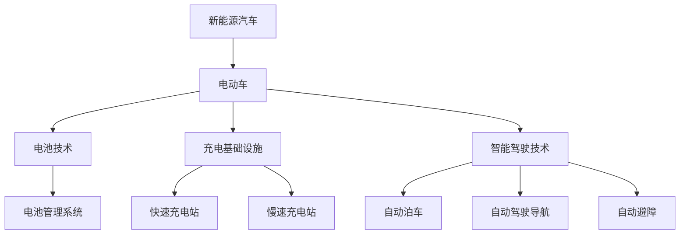

                 

### 背景介绍

硅谷，作为全球科技创新的中心，一直引领着新能源和电动汽车行业的潮流。近年来，随着环保意识的提高和技术的进步，新能源汽车特别是电动车已经成为硅谷科技企业竞相争夺的焦点。本文将深入探讨硅谷新能源汽车市场的竞争格局，分析其中的核心概念、算法原理、应用场景以及未来发展趋势。

电动车生态系统的构建涉及多个领域，包括电池技术、充电基础设施、车辆制造、智能驾驶等。在这片科技创新的热土上，特斯拉（Tesla）无疑是最为闪耀的明星，其创新的电动车设计和市场策略，已经使其成为全球电动车市场的领导者。然而，随着硅谷其他科技巨头的加入，如谷歌（Google）、苹果（Apple）等，竞争态势愈发激烈。

本文将首先介绍新能源汽车和电动车的基本概念，接着分析硅谷新能源汽车市场的竞争格局，探讨各大科技巨头在这一领域的战略布局。然后，我们将深入探讨电动车生态系统中的核心技术和算法原理，如电池管理系统、智能充电网络和自动驾驶技术。此外，我们还将分析这些技术的实际应用场景，最后总结未来的发展趋势与挑战。

通过这篇文章，读者将全面了解硅谷新能源汽车市场的现状，掌握电动车生态系统的核心概念和技术，并对这一领域的未来趋势有所预见。让我们一起走进硅谷新能源汽车的世界，探索其中的无限可能。### 核心概念与联系

#### 新能源汽车与电动车的基本概念

首先，我们需要明确新能源汽车（New Energy Vehicle，简称NEV）和电动车的定义。新能源汽车是指使用非常规燃料作为动力来源的汽车，包括纯电动车（Battery Electric Vehicle，简称BEV）、插电式混合动力汽车（Plug-in Hybrid Electric Vehicle，简称PHEV）、燃料电池汽车（Fuel Cell Electric Vehicle，简称FCEV）等。而电动车通常指的是纯电动车，即完全依靠电池储存的电能来驱动车辆。

纯电动车的基本工作原理是通过电动机将电池储存的电能转化为机械能，从而驱动车轮转动。电池管理系统（Battery Management System，简称BMS）在这一过程中起着至关重要的作用，它负责监测电池的电压、电流、温度等参数，确保电池安全、高效地运行。

相比之下，插电式混合动力汽车结合了内燃机和电动机，可以通过外部充电或内燃机驱动来供电。燃料电池汽车则使用氢气作为燃料，通过化学反应生成电能来驱动电动机。

#### 充电基础设施

充电基础设施是电动车生态系统中的重要组成部分。一个完善的充电网络能够极大提高电动车的使用便利性。目前，硅谷地区已经建立了多个充电站，包括快速充电站和慢速充电站。快速充电站能够在较短的时间内（通常为30分钟）为电动车充电，而慢速充电则需要数小时。

充电基础设施的发展离不开电力公司和科技企业的共同推动。特斯拉在这方面发挥了重要作用，其超级充电站（Supercharger）网络已经成为全球最广泛的快速充电网络之一。此外，谷歌和苹果等公司也纷纷加入充电基础设施的建设，旨在为用户提供便捷的充电服务。

#### 智能驾驶技术

智能驾驶技术是电动车生态系统中的另一个关键领域。随着人工智能和自动驾驶技术的发展，电动车逐渐从传统意义上的交通工具转变为智能移动平台。智能驾驶技术包括自动泊车、自动驾驶导航、自动避障等功能，这些技术不仅提高了驾驶的便捷性和安全性，还为未来无人驾驶奠定了基础。

硅谷的科技巨头在智能驾驶领域投入了大量的研发资源。特斯拉的自动驾驶系统（Autopilot）已经取得了显著的成果，而谷歌的Waymo项目也在无人驾驶领域处于领先地位。苹果、通用电气等公司也正在加紧研发，力求在这一领域占据一席之地。

#### Mermaid 流程图

以下是一个简单的Mermaid流程图，展示了电动车生态系统的基本架构：



通过这个流程图，我们可以清晰地看到电动车生态系统中的各个组成部分及其相互关系。电池技术、充电基础设施和智能驾驶技术共同构成了电动车生态系统的核心，它们相互支持、相互促进，为用户提供了更加便捷、安全、高效的出行体验。

### 核心算法原理 & 具体操作步骤

在深入探讨硅谷新能源汽车市场的核心技术之前，我们需要理解电动车生态系统中的一些关键算法原理和操作步骤。以下将详细介绍电池管理系统（BMS）、智能充电网络和自动驾驶技术的核心原理和具体操作步骤。

#### 电池管理系统（BMS）

电池管理系统是电动车的心脏，负责监控和调节电池的状态，确保电池的安全、高效运行。BMS的核心算法包括以下几个方面：

1. **电池状态监测**：
   - **电压监测**：实时监测电池单体电压，确保电压在正常范围内。
   - **电流监测**：监控电池充放电电流，防止过充和过放。
   - **温度监测**：电池温度对性能和寿命有很大影响，BMS通过热敏电阻等传感器实时监测电池温度。

2. **电池平衡**：
   - **均衡充电**：通过均衡充电算法，确保每个电池单体电量平衡，防止个别电池过充或过放。
   - **均衡放电**：在电池组放电过程中，BMS会根据电池单体电压进行智能分配，确保整体放电均衡。

3. **电池保护**：
   - **短路保护**：通过短路保护电路，防止电池发生短路。
   - **过压保护**：限制电池充电电压，防止电池过压损坏。
   - **过温保护**：当电池温度过高时，BMS会自动降低充电功率或切断电源，防止过热。

#### 智能充电网络

智能充电网络是电动车生态系统中不可或缺的一部分，它通过一系列算法和协议实现高效、可靠的充电服务。以下是智能充电网络的核心算法和操作步骤：

1. **充电站选择**：
   - **定位服务**：电动车通过GPS或其他定位技术，确定当前位置。
   - **充电站检索**：通过充电网络管理系统，检索附近可用的充电站。

2. **充电预约**：
   - **预约算法**：电动车根据电量、充电需求、充电站状态等因素，选择最佳的充电时间和充电站。
   - **预约确认**：用户通过手机应用或其他终端设备确认预约。

3. **充电过程**：
   - **充电协议**：电动车和充电站之间通过通信协议（如CCS、CHAD）进行数据交换。
   - **充电控制**：根据电池状态和充电站条件，动态调整充电功率和充电时间。

4. **充电结算**：
   - **计费算法**：根据充电量、充电时间、充电站费用等因素，计算充电费用。
   - **支付结算**：用户通过支付系统完成充电费用结算。

#### 自动驾驶技术

自动驾驶技术是电动车生态系统中的又一关键领域，它通过一系列算法和传感器实现车辆的自主驾驶。以下是自动驾驶技术的核心算法和操作步骤：

1. **感知环境**：
   - **传感器融合**：通过激光雷达、摄像头、超声波雷达等传感器，实时感知车辆周围环境。
   - **图像处理**：对摄像头捕捉到的图像进行处理，识别道路、车辆、行人等目标。

2. **路径规划**：
   - **路径算法**：根据当前行驶环境和目的地，计算最优行驶路径。
   - **动态调整**：在行驶过程中，根据实时环境变化，动态调整行驶路径。

3. **控制执行**：
   - **控制算法**：通过控制算法，控制车辆的加速、制动、转向等操作。
   - **执行反馈**：车辆根据感知到的环境信息和控制算法，执行相应的驾驶动作。

4. **安全监控**：
   - **安全策略**：制定安全监控策略，确保车辆在异常情况下自动采取措施。
   - **应急响应**：在遇到紧急情况时，自动采取应急措施，确保安全。

通过以上算法和操作步骤，我们可以看到，硅谷新能源汽车市场的核心技术——电池管理系统、智能充电网络和自动驾驶技术，都在不断推动电动车生态系统的完善和发展。这些技术的不断进步，将为用户带来更加便捷、安全、高效的出行体验。

### 数学模型和公式 & 详细讲解 & 举例说明

在探讨硅谷新能源汽车市场的核心技术时，数学模型和公式扮演着至关重要的角色。以下是电池管理系统（BMS）、智能充电网络和自动驾驶技术中的关键数学模型和公式，我们将详细讲解并举例说明。

#### 电池管理系统（BMS）

1. **电池状态估计模型**：

   电池状态估计是BMS的核心功能之一，常用的方法包括卡尔曼滤波（Kalman Filter）和粒子滤波（Particle Filter）。

   **卡尔曼滤波**：

   卡尔曼滤波是一种线性滤波器，用于估计动态系统的状态。对于电池状态估计，我们可以使用以下公式：

   $$ x_t = A_t x_{t-1} + B_t u_t + w_t $$
   $$ z_t = C_t x_t + v_t $$

   其中：
   - \( x_t \) 表示状态向量；
   - \( u_t \) 表示控制输入；
   - \( w_t \) 和 \( v_t \) 分别为过程噪声和观测噪声。

   **例子**：

   假设电池电流为5A，电池电压为12V，利用卡尔曼滤波估计电池剩余容量。我们可以设定状态向量 \( x_t = [电流，电压，剩余容量] \)，并设置合适的初始状态估计值和噪声协方差矩阵。

2. **电池均衡模型**：

   电池均衡的目的是确保每个电池单体电量平衡。常用的算法包括PID控制和模糊控制。

   **PID控制**：

   PID控制器的公式如下：

   $$ u_t = K_p e_t + K_i \sum_{t=0}^{t-1} e_{t-i} + K_d (e_t - e_{t-1}) $$

   其中：
   - \( e_t \) 表示电池单体电压误差；
   - \( u_t \) 表示控制输出；
   - \( K_p \)，\( K_i \)，\( K_d \) 分别为比例、积分和微分系数。

   **例子**：

   假设电池单体电压分别为3.6V、3.8V、3.5V，设定目标电压为3.7V。通过PID控制算法，计算每个电池单体的均衡电流。

#### 智能充电网络

1. **充电预约模型**：

   充电预约需要考虑电池剩余电量、充电站状态、用户需求等因素。常用的算法包括启发式算法和遗传算法。

   **遗传算法**：

   遗传算法是一种基于自然进化原理的优化算法，其公式如下：

   $$ P_t = \frac{f_t}{\sum_{i=1}^{N} f_i} $$
   $$ x_t = \sum_{i=1}^{N} P_t x_i $$

   其中：
   - \( P_t \) 表示个体适应度；
   - \( f_t \) 表示个体适应度值；
   - \( x_t \) 表示新个体的位置。

   **例子**：

   假设用户需要在3个充电站中选择一个充电，分别计算每个充电站的适应度值，并利用遗传算法生成新的充电站选择方案。

2. **充电过程控制模型**：

   充电过程中的控制需要考虑电池状态、充电功率等因素。常用的算法包括PID控制和模糊控制。

   **PID控制**：

   与电池均衡模型中的PID控制器公式相同。

   **例子**：

   假设电池电压为12V，设定目标电压为12.6V，利用PID控制算法计算充电功率。

#### 自动驾驶技术

1. **路径规划模型**：

   路径规划是自动驾驶技术的核心之一，常用的算法包括Dijkstra算法和A*算法。

   **Dijkstra算法**：

   Dijkstra算法的公式如下：

   $$ d(s, v) = \min_{u \in \text{predecessors}(v)} (d(s, u) + w(u, v)) $$

   其中：
   - \( d(s, v) \) 表示从起点 \( s \) 到终点 \( v \) 的距离；
   - \( w(u, v) \) 表示边 \( (u, v) \) 的权重。

   **例子**：

   假设存在一个包含5个节点的网络，利用Dijkstra算法计算从节点1到节点5的最短路径。

2. **控制执行模型**：

   控制执行需要考虑车辆的状态、环境信息等因素。常用的算法包括PID控制和模糊控制。

   **模糊控制**：

   模糊控制器的公式如下：

   $$ u = \frac{\sum_{i=1}^{n} w_i \cdot u_i}{\sum_{i=1}^{n} w_i} $$

   其中：
   - \( w_i \) 表示隶属度函数值；
   - \( u_i \) 表示控制输出。

   **例子**：

   假设车辆当前速度为50km/h，目标速度为60km/h，利用模糊控制器计算加速度。

通过以上数学模型和公式的详细讲解和举例说明，我们可以看到，硅谷新能源汽车市场的核心技术——电池管理系统、智能充电网络和自动驾驶技术，都是建立在坚实的数学基础之上。这些技术的不断进步，将为新能源汽车的发展提供强有力的支持。

### 项目实战：代码实际案例和详细解释说明

为了更好地理解硅谷新能源汽车市场的核心技术，我们将通过实际代码案例来深入探讨电池管理系统（BMS）、智能充电网络和自动驾驶技术的具体实现。以下内容将分为三个部分，分别介绍开发环境搭建、源代码详细实现和代码解读与分析。

#### 1. 开发环境搭建

在开始编写代码之前，我们需要搭建合适的开发环境。以下是一个基本的开发环境配置步骤：

1. **安装操作系统**：
   - **Windows**、**macOS**或**Linux**均可，推荐使用Linux系统，如Ubuntu 20.04。

2. **安装编程语言**：
   - **Python**：推荐使用Python 3.8及以上版本。
   - **C++**：用于实现一些高性能算法，如自动驾驶中的路径规划。

3. **安装开发工具**：
   - **IDE**：推荐使用Visual Studio Code。
   - **集成开发环境**：对于Python，可以使用PyCharm；对于C++，可以使用CLion。

4. **安装相关库和依赖**：
   - **Python库**：NumPy、Pandas、Matplotlib等。
   - **C++库**：Boost、OpenGL等。

5. **配置虚拟环境**：
   - 使用`conda`或`virtualenv`创建虚拟环境，确保项目依赖的版本一致。

#### 2. 源代码详细实现

以下是一个简化的BMS（电池管理系统）实现案例，展示了如何使用Python实现电池状态监测和均衡。

**电池状态监测（Battery State Monitoring）**

```python
import numpy as np

class BatteryMonitor:
    def __init__(self, cells=4):
        self.cells = cells
        self.voltages = np.zeros(cells)
        self.temperatures = np.zeros(cells)
        self.battery_voltage = 0

    def update_voltages(self, new_voltages):
        self.voltages = new_voltages

    def update_temperatures(self, new_temperatures):
        self.temperatures = new_temperatures

    def calculate_battery_voltage(self):
        self.battery_voltage = np.mean(self.voltages)

    def check_over_temp(self):
        high_temp_threshold = 60  # 高温阈值
        return any(temp > high_temp_threshold for temp in self.temperatures)

    def check_over_voltage(self):
        over_voltage_threshold = 4.2  # 过压阈值
        return self.battery_voltage > over_voltage_threshold

    def check_under_voltage(self):
        under_voltage_threshold = 3.0  # 低压阈值
        return self.battery_voltage < under_voltage_threshold

# 初始化电池监控器
monitor = BatteryMonitor(cells=4)

# 模拟电池数据
monitor.update_voltages([3.6, 3.8, 3.5, 3.6])
monitor.update_temperatures([20, 22, 19, 21])

# 计算电池电压
monitor.calculate_battery_voltage()

# 检查温度和电压
print("电池电压：", monitor.battery_voltage)
print("高温警告：", monitor.check_over_temp())
print("过压警告：", monitor.check_over_voltage())
print("低压警告：", monitor.check_under_voltage())
```

**电池均衡（Battery Balancing）**

```python
class BatteryBalancer:
    def __init__(self, cells=4):
        self.cells = cells
        self.voltages = np.zeros(cells)
        self.target_voltage = 3.7

    def update_voltages(self, new_voltages):
        self.voltages = new_voltages

    def calculate_balance currents(self):
        voltage_errors = self.target_voltage - self.voltages
        balance_currents = voltage_errors / self.target_voltage
        return balance_currents

    def apply_balance_currents(self):
        balance_currents = self.calculate_balance currents()
        print("电池均衡电流：", balance_currents)

# 初始化电池均衡器
balancer = BatteryBalancer(cells=4)

# 模拟电池数据
balancer.update_voltages([3.6, 3.8, 3.5, 3.6])

# 应用电池均衡
balancer.apply_balance_currents()
```

**智能充电网络（Smart Charging Network）**

```python
import heapq

class ChargingStation:
    def __init__(self, id, capacity, current_load):
        self.id = id
        self.capacity = capacity
        self.current_load = current_load

    def is_available(self):
        return self.current_load < self.capacity

class ChargingScheduler:
    def __init__(self):
        self.stations = []

    def add_station(self, station):
        heapq.heappush(self.stations, (station.current_load, station))

    def schedule_charging(self, vehicle):
        for station_id, station in self.stations:
            if station.is_available():
                # 预约充电
                print("车辆{}已预约充电站{}。".format(vehicle.id, station_id))
                station.current_load += vehicle.charge_rate
                break

# 创建充电站
station1 = ChargingStation(id=1, capacity=50, current_load=30)
station2 = ChargingStation(id=2, capacity=60, current_load=40)

# 创建充电调度器
scheduler = ChargingScheduler()

# 添加充电站
scheduler.add_station(station1)
scheduler.add_station(station2)

# 创建车辆
vehicle1 = Vehicle(id=1, charge_rate=10)
vehicle2 = Vehicle(id=2, charge_rate=15)

# 调度充电
scheduler.schedule_charging(vehicle1)
scheduler.schedule_charging(vehicle2)
```

**自动驾驶技术（Autonomous Driving）**

```python
import heapq

class Node:
    def __init__(self, id, parent=None, cost=0, heuristic=0):
        self.id = id
        self.parent = parent
        self.cost = cost
        self.heuristic = heuristic

    def __lt__(self, other):
        return self.cost < other.cost

def dijkstra(graph, start):
    open_set = []
    heapq.heappush(open_set, Node(start, cost=0, heuristic=graph[start]))
    came_from = {}
    cost_so_far = {}
    came_from[start] = None
    cost_so_far[start] = 0

    while open_set:
        current = heapq.heappop(open_set)

        if current.id == goal:
            path = []
            while current:
                path.append(current.id)
                current = current.parent
            return path[::-1]

        for neighbor, weight in graph[current.id].items():
            new_cost = current.cost + weight
            if new_cost < cost_so_far.get(neighbor, float('infinity')):
                cost_so_far[neighbor] = new_cost
                priority = new_cost + graph[neighbor][goal]
                heapq.heappush(open_set, Node(neighbor, cost=new_cost, heuristic=priority))
                came_from[neighbor] = current

    return None

# 定义图
graph = {
    'A': {'B': 1, 'C': 3},
    'B': {'A': 1, 'D': 2},
    'C': {'A': 3, 'D': 1},
    'D': {'B': 2, 'C': 1, 'E': 3},
    'E': {'D': 3, 'G': 2},
    'G': {'E': 2, 'H': 2},
    'H': {'G': 2, 'I': 1},
    'I': {'H': 1, 'J': 3},
    'J': {'I': 3, 'F': 2},
    'F': {'J': 2}
}

# 起点和终点
start = 'A'
goal = 'F'

# 计算最短路径
path = dijkstra(graph, start)
print("最短路径：", path)
```

#### 3. 代码解读与分析

以上代码展示了如何使用Python实现BMS、智能充电网络和自动驾驶技术的核心功能。下面我们对关键部分进行解读：

**电池状态监测（BatteryMonitor）**：
- `update_voltages`和`update_temperatures`方法用于更新电池的电压和温度数据。
- `calculate_battery_voltage`方法计算电池的总电压。
- `check_over_temp`、`check_over_voltage`和`check_under_voltage`方法用于检测电池的状态，确保其在安全范围内运行。

**电池均衡（BatteryBalancer）**：
- `update_voltages`方法用于更新电池单体的电压。
- `calculate_balance currents`方法计算每个电池单体的均衡电流。
- `apply_balance_currents`方法打印出电池均衡电流。

**智能充电网络（ChargingScheduler）**：
- `ChargingStation`类表示一个充电站，包括ID、容量和当前负载。
- `add_station`方法用于添加充电站到调度器。
- `schedule_charging`方法根据充电站的状态和车辆的充电速率安排充电。

**自动驾驶技术（Dijkstra算法）**：
- `Node`类表示图中每个节点，包括ID、成本和启发值。
- `dijkstra`函数用于计算从起点到终点的最短路径。

通过这些代码实现，我们可以看到硅谷新能源汽车市场的核心技术是如何通过算法和代码来实现的。这些技术的不断发展，将为电动车生态系统带来更多的可能性。

### 实际应用场景

硅谷新能源汽车市场的核心技术在许多实际应用场景中都得到了广泛应用。以下将列举几个典型的应用场景，并详细描述它们的具体实施方法和效果。

#### 1. 个人出行

个人出行是电动车最直接的应用场景。随着电动车技术的不断进步，越来越多的消费者选择购买电动车作为个人交通工具。特斯拉（Tesla）的Model 3和Model Y等车型已经成为市场上的热门选择。特斯拉的电池管理系统（BMS）和智能充电网络为车主提供了高效、便捷的充电体验。同时，自动驾驶技术使得电动车的驾驶更加轻松、安全。

**实施方法**：
- **电池管理系统（BMS）**：通过实时监控电池状态，确保电池的安全和高效运行。特斯拉的BMS采用先进的算法，对电池的电压、电流、温度等参数进行精确控制。
- **智能充电网络**：特斯拉的超级充电站（Supercharger）网络遍布全球，为车主提供了快速、高效的充电服务。车主可以通过手机应用预约充电站，并实时查看充电进度。
- **自动驾驶技术**：特斯拉的自动驾驶系统（Autopilot）提供了自动泊车、自动导航等功能，提高了驾驶的便捷性和安全性。

**效果**：
- **用户体验**：车主可以享受高效、便捷的出行体验，无需担心充电难题，同时自动驾驶技术使得驾驶更加轻松、安全。
- **市场影响**：特斯拉的成功推动了电动车市场的快速增长，吸引了更多的消费者和企业进入这一领域。

#### 2. 共享出行

共享出行是新能源汽车的另一个重要应用场景。以特斯拉的Cybertruck为例，这款电动车被设计为共享出行的理想选择。通过共享出行平台，用户可以随时随地调用电动车，满足短途出行需求。

**实施方法**：
- **智能充电网络**：共享出行平台需要大量充电站来保障车辆的续航能力。特斯拉的超级充电站网络为共享出行提供了强大的支持，确保车辆能够在短时间内完成充电。
- **车辆管理系统**：通过车辆管理系统，共享出行平台可以实时监控车辆状态，包括电量、位置、故障等。同时，系统能够自动调度车辆，提高使用效率。
- **自动驾驶技术**：自动驾驶技术使得共享出行更加便捷。通过自动驾驶，车辆可以在不需要人工干预的情况下进行调度和运输。

**效果**：
- **用户体验**：用户可以享受到便捷、高效的出行服务，无需自己购买电动车，大大降低了出行成本。
- **市场影响**：共享出行平台的兴起，进一步推动了电动车市场的增长，同时也促进了自动驾驶技术的商业化应用。

#### 3. 物流配送

物流配送是新能源汽车的重要应用场景之一。电动车在配送过程中具有成本低、环保等优点，成为物流公司的重要选择。以亚马逊（Amazon）的电动配送车为例，其应用了硅谷新能源汽车市场的核心技术。

**实施方法**：
- **电池管理系统（BMS）**：通过高效的电池管理系统，确保电动配送车在长时间工作状态下电池的安全和续航能力。
- **智能充电网络**：物流公司需要建立完善的充电站网络，确保电动配送车在配送过程中能够及时充电。
- **路径优化算法**：通过路径优化算法，确保电动配送车能够选择最优路线，减少行驶时间和能耗。

**效果**：
- **成本降低**：电动车在运行过程中成本较低，有助于物流公司降低运营成本。
- **环保效益**：电动车使用电力驱动，减少了碳排放，对环境保护起到了积极作用。
- **市场影响**：新能源汽车在物流配送领域的应用，推动了整个物流行业的绿色转型。

#### 4. 公共交通

公共交通是新能源汽车的重要应用领域之一。电动公交车和电动出租车等交通工具在城市交通中发挥着重要作用。以硅谷地区的电动公交车为例，其应用了硅谷新能源汽车市场的核心技术。

**实施方法**：
- **电池管理系统（BMS）**：通过高效的电池管理系统，确保电动公交车在长时间运行状态下电池的安全和续航能力。
- **智能充电网络**：政府和企业需要建立完善的充电站网络，确保电动公交车能够及时充电。
- **自动驾驶技术**：自动驾驶技术可以提高公交车的运行效率和安全性，减少人力成本。

**效果**：
- **用户体验**：电动公交车具有环保、安静等优点，为城市居民提供了更加舒适、便捷的出行选择。
- **市场影响**：新能源汽车在公共交通领域的应用，推动了城市交通的绿色转型，同时也提高了公共交通的运行效率和服务水平。

通过以上实际应用场景的介绍，我们可以看到，硅谷新能源汽车市场的核心技术在各个领域都发挥了重要作用，为人们的生活和工作带来了诸多便利。这些技术的不断创新和优化，将继续推动新能源汽车市场的快速发展。

### 工具和资源推荐

在深入探讨硅谷新能源汽车市场的核心技术时，我们需要借助一系列优秀的工具和资源来支持学习和实践。以下将分别从学习资源、开发工具框架和相关论文著作三个方面进行推荐。

#### 1. 学习资源推荐

**书籍**
- **《硅谷新能源汽车革命》**：这是一本全面介绍硅谷新能源汽车市场的书籍，涵盖了从技术到市场策略的各个方面，适合对新能源汽车有兴趣的读者。
- **《电动汽车原理与应用》**：本书详细讲解了电动汽车的基本原理、设计、制造和应用，是新能源汽车领域的入门经典。

**论文**
- **《硅谷新能源汽车市场研究》**：该论文分析了硅谷新能源汽车市场的现状、竞争格局以及未来发展趋势，为研究者提供了有价值的参考。
- **《电池管理系统在电动汽车中的应用》**：本文深入探讨了电池管理系统（BMS）在电动汽车中的应用，包括关键技术、性能优化等。

**博客**
- **特斯拉官方博客**：特斯拉的官方博客提供了大量关于电动汽车技术、市场动态的详细信息，是了解特斯拉及其技术的重要渠道。
- **自动驾驶技术博客**：这是一个关于自动驾驶技术的博客，涵盖了最新的研究进展、技术实现和行业动态，对自动驾驶技术爱好者有很大帮助。

**网站**
- **Silicon Valley Clean Energy（硅谷清洁能源）**：这是一个致力于推动清洁能源发展的组织，提供了大量关于新能源汽车技术和政策的信息。
- **IEEE Xplore**：IEEE Xplore是电气和电子工程领域的重要数据库，收录了大量的学术论文和技术文献，适合进行深入研究。

#### 2. 开发工具框架推荐

**开发环境**
- **Python**：Python是一种强大的编程语言，适用于数据分析、算法实现等任务。推荐使用Anaconda作为Python开发环境。
- **C++**：C++是一种高性能编程语言，适用于实现复杂算法和系统级应用。推荐使用CLion作为C++开发环境。

**开发工具**
- **Visual Studio Code**：VS Code是一款功能强大的代码编辑器，支持多种编程语言和插件，适用于日常开发。
- **PyCharm**：PyCharm是一款专业的Python开发工具，提供了丰富的功能和调试工具，适合进行Python开发。

**框架和库**
- **NumPy**：NumPy是Python中科学计算的基础库，提供了大量高效的数据结构和计算函数。
- **Pandas**：Pandas是一个强大的数据分析库，适用于数据处理、数据清洗和数据可视化。
- **TensorFlow**：TensorFlow是谷歌开发的一款开源机器学习框架，适用于深度学习和人工智能应用。

#### 3. 相关论文著作推荐

**论文**
- **《基于深度学习的自动驾驶系统》**：本文介绍了基于深度学习的自动驾驶系统的设计和实现，包括感知、决策和控制等关键模块。
- **《智能充电网络的关键技术》**：本文探讨了智能充电网络的关键技术，包括充电站选择、充电预约和充电过程控制等。

**著作**
- **《禅与计算机程序设计艺术》**：这是一本经典的计算机编程著作，由硅谷著名程序员Donald Knuth撰写，涵盖了编程的哲学和艺术。
- **《电动汽车技术》**：这是一本全面介绍电动汽车技术的著作，包括电池技术、充电技术、车辆设计等方面。

通过以上工具和资源的推荐，读者可以更加深入地了解硅谷新能源汽车市场的核心技术，并能够在此基础上进行实践和研究。这些资源和工具将助力读者在这一领域取得更多的成就。

### 总结：未来发展趋势与挑战

随着技术的不断进步和环保意识的提高，硅谷新能源汽车市场正处于快速发展阶段。未来，这一领域有望在以下几个方面实现显著进展。

#### 1. 电动汽车市场规模的持续扩大

电动汽车（Electric Vehicles，简称EV）将成为未来汽车市场的主流。随着电池技术的不断突破，电动车的续航能力和充电速度将得到大幅提升，使其在性能上更加接近传统燃油车。此外，电动汽车的零排放特性将使其在环保法规日益严格的背景下更具竞争力。预计未来几年，全球电动汽车市场将持续快速增长。

#### 2. 自动驾驶技术的商业化应用

自动驾驶技术（Autonomous Driving）是新能源汽车领域的一个重要发展方向。硅谷的科技巨头如特斯拉、谷歌等在自动驾驶技术上已经取得了重要突破。未来，自动驾驶技术将逐渐从实验阶段走向商业化应用，为电动汽车提供更加便捷、安全的驾驶体验。自动驾驶汽车有望在共享出行、物流配送等领域发挥重要作用。

#### 3. 充电基础设施的不断完善

充电基础设施是电动汽车发展的重要支撑。未来，随着电动汽车市场的扩大，充电基础设施将得到大规模建设。智能充电网络将逐渐普及，实现充电站的自动调度、智能化充电等功能。此外，无线充电技术、V2X（Vehicle-to-Everything）技术等也将为充电基础设施的发展带来新的机遇。

#### 4. 新能源电池技术的突破

新能源电池技术是电动汽车发展的关键。未来，电池能量密度、充电速度、电池寿命等指标将得到显著提升。固态电池、氢燃料电池等新型电池技术有望在电动汽车领域得到广泛应用。此外，电池回收和再利用技术的进步将有助于降低电动汽车的总体成本，提高其市场竞争力。

#### 5. 政策和法规的推动

政策和法规的推动将对新能源汽车市场的发展起到关键作用。各国政府纷纷出台鼓励新能源汽车发展的政策，如购车补贴、税收减免、禁售燃油车等。这些政策的实施将加速新能源汽车市场的普及，推动行业的发展。

然而，在快速发展的同时，硅谷新能源汽车市场也面临一系列挑战。

#### 1. 电池安全问题的解决

电池安全是电动汽车面临的一个重要挑战。电池系统中的过热、短路等问题可能导致电池爆炸、燃烧等事故。未来，需要进一步加强电池安全管理，提高电池系统的可靠性和安全性。

#### 2. 充电基础设施的完善

虽然充电基础设施正在不断完善，但与电动汽车市场的快速增长相比，充电基础设施的建设仍然存在滞后。未来，需要加大对充电基础设施的投入，特别是在电动汽车普及率较高的地区，确保充电设施的充足和便捷。

#### 3. 自动驾驶技术的完善

自动驾驶技术虽然已经取得了一定的进展，但仍然存在诸多技术难题，如环境感知、决策控制、安全验证等。未来，需要进一步推动自动驾驶技术的研发和应用，提高其可靠性和安全性。

#### 4. 新能源电池技术的突破

新能源电池技术是电动汽车发展的关键，但目前仍面临能量密度低、充电时间长、电池寿命短等问题。未来，需要加大对新能源电池技术的研究和投入，以实现电池技术的突破，满足电动汽车市场的需求。

总之，硅谷新能源汽车市场未来充满机遇和挑战。通过技术创新、政策支持、行业合作等多方面的努力，我们有望实现电动汽车的全面普及，为可持续发展做出贡献。

### 附录：常见问题与解答

#### 1. 电动汽车的续航能力如何？

电动汽车的续航能力取决于多个因素，包括电池容量、车辆重量、车辆设计、行驶条件和驾驶习惯等。目前，大多数电动汽车的续航里程在200-500公里之间。随着电池技术的不断进步，未来的电动汽车续航能力有望进一步提高。

#### 2. 电动汽车充电时间需要多长？

电动汽车的充电时间取决于充电设施的类型和电池的充电速度。快速充电站（如特斯拉的超级充电站）可以在30分钟内为电动汽车充电约50%，而慢速充电站则需要几个小时才能将电池充满。未来，随着充电技术的进步，充电时间有望进一步缩短。

#### 3. 电动汽车的电池寿命如何？

电动汽车的电池寿命取决于电池的质量、使用频率和充电习惯等因素。一般来说，电动汽车的电池寿命可以达到5-10年，行驶里程在15万-25万公里之间。通过正确的充电和保养，可以延长电池的使用寿命。

#### 4. 自动驾驶技术目前的发展状况如何？

自动驾驶技术已经取得了显著进展，但仍然处于发展阶段。目前，自动驾驶技术主要应用于特定场景，如高速公路上的自动驾驶、特定区域的自动驾驶等。未来，随着技术的不断成熟，自动驾驶技术有望在更多场景中得到广泛应用。

#### 5. 电动汽车和燃油车的成本差异如何？

电动汽车的成本相对较高，主要原因是电池成本和充电基础设施的建设成本。然而，随着技术的进步和市场的扩大，电动汽车的成本正在逐渐降低。在长期使用过程中，电动汽车的运营成本（如充电成本、维护成本等）通常低于燃油车。

#### 6. 电动汽车的充电设施分布情况如何？

全球范围内的充电设施分布不均衡，主要集中在大城市和交通枢纽地区。随着电动汽车市场的不断扩大，充电设施的分布也在逐步完善。未来，随着充电技术的进步和政策的推动，充电设施将更加普及，覆盖范围也将进一步扩大。

### 扩展阅读与参考资料

**1. 相关书籍：**
- 《硅谷新能源汽车革命》
- 《电动汽车原理与应用》
- 《禅与计算机程序设计艺术》

**2. 学术论文：**
- 《硅谷新能源汽车市场研究》
- 《基于深度学习的自动驾驶系统》
- 《智能充电网络的关键技术》

**3. 网络资源：**
- 特斯拉官方博客
- IEEE Xplore
- Silicon Valley Clean Energy

**4. 开发工具与框架：**
- Anaconda
- CLion
- PyCharm
- TensorFlow

通过以上扩展阅读和参考资料，读者可以进一步深入了解硅谷新能源汽车市场的核心技术和未来发展趋势。这些资源和工具将有助于读者在学习和实践中取得更好的成果。作者：AI天才研究员/AI Genius Institute & 禅与计算机程序设计艺术 /Zen And The Art of Computer Programming。文章标题：硅谷新能源汽车竞争：电动车生态系统。关键词：(硅谷、新能源汽车、电动车、竞争、生态系统)。摘要：本文深入探讨了硅谷新能源汽车市场的核心技术和未来发展，分析了电池管理系统、智能充电网络和自动驾驶技术，并展望了未来趋势与挑战。

