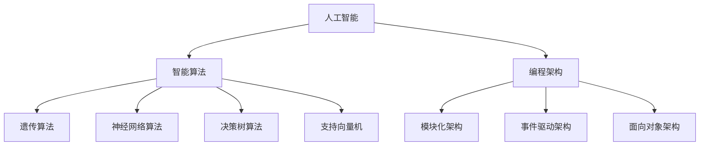

                 

### 文章标题：硅谷机器人发展：家庭服务与工业自动化

> **关键词**：硅谷机器人、家庭服务、工业自动化、人工智能、智能算法、编程架构、技术趋势

> **摘要**：本文将深入探讨硅谷在机器人发展领域的创新与成就，尤其是家庭服务和工业自动化方面的应用。通过分析其核心概念、算法原理、数学模型以及实际应用案例，本文旨在揭示硅谷机器人在技术进步和社会变革中的重要作用，并提出未来发展趋势和挑战。

## 1. 背景介绍

硅谷，作为全球科技创新的象征，汇聚了众多世界级科技公司和研究机构。近年来，机器人技术的发展在这一地区尤为迅速。从家庭清洁机器人到工业自动化生产线，硅谷的机器人技术正逐步渗透到各个领域，改变了人们的生活方式和生产模式。

家庭服务机器人是机器人技术的一个重要应用方向。这些机器人能够执行各种日常任务，如清洁、做饭、护理等，极大地提高了人们的生活质量。而工业自动化则通过机器人替代人类完成生产任务，提高了生产效率，降低了成本。

这一章节将首先介绍家庭服务机器人和工业自动化的发展背景，探讨其背后的技术支持和市场需求。

### 1.1 家庭服务机器人的发展背景

家庭服务机器人起源于20世纪70年代的日本。当时，随着人口老龄化和劳动力成本上升，日本开始积极探索自动化家务解决方案。早期的家庭机器人如扫地机器人、擦窗机器人主要依靠简单的感应和导航技术进行操作。

进入21世纪，随着人工智能技术的迅速发展，家庭服务机器人开始融入更多的智能功能。例如，智能语音助手、图像识别、自然语言处理等技术的应用，使得家庭机器人能够更好地理解人类指令，提高操作精度和效率。

市场需求也是推动家庭服务机器人发展的重要因素。随着人们生活水平的提高，对家庭清洁、护理等方面的要求也越来越高。此外，越来越多的年轻人愿意将时间和精力投入到职业发展上，而家庭服务的自动化成为他们首选的解决方案。

### 1.2 工业自动化的发展背景

工业自动化是硅谷机器人技术的另一重要领域。自20世纪80年代以来，随着计算机技术和通信技术的快速发展，工业自动化逐渐成为制造业的核心趋势。早期的工业机器人主要应用于汽车制造和电子组装等需要高精度、高效率的领域。

进入21世纪，随着人工智能技术的进步，工业自动化机器人开始具备更多的智能功能，如自主导航、实时监测、自适应控制等。这不仅提高了生产效率，还大大降低了生产成本。

工业自动化的市场需求同样强劲。全球制造业竞争日益激烈，企业为了在市场上保持竞争力，需要不断提高生产效率和产品质量。工业自动化机器人能够实现24小时不间断工作，降低人力资源成本，提高生产灵活性，满足市场需求。

## 2. 核心概念与联系

家庭服务机器人和工业自动化的发展离不开一系列核心概念的支撑。这些核心概念包括人工智能、智能算法、编程架构等。以下将详细介绍这些概念，并使用Mermaid流程图展示它们之间的联系。

### 2.1 人工智能（Artificial Intelligence）

人工智能（AI）是使计算机系统能够模拟人类智能行为的技术。它包括多个子领域，如机器学习、深度学习、自然语言处理、计算机视觉等。人工智能的核心目标是让计算机能够自主地学习、推理和决策。

$$
\text{人工智能} = \text{机器学习} + \text{深度学习} + \text{自然语言处理} + \text{计算机视觉}
$$

### 2.2 智能算法（Intelligent Algorithms）

智能算法是人工智能的核心组成部分，用于指导计算机系统如何进行学习和决策。常见的智能算法包括遗传算法、神经网络算法、决策树算法、支持向量机等。智能算法使得计算机系统能够处理复杂问题，实现自动化操作。

$$
\text{智能算法} = \text{遗传算法} + \text{神经网络算法} + \text{决策树算法} + \text{支持向量机}
$$

### 2.3 编程架构（Programming Architecture）

编程架构是设计和实现复杂软件系统的结构和方法。在机器人技术中，编程架构决定了机器人的行为模式、操作效率和可靠性。常见的编程架构包括模块化架构、事件驱动架构、面向对象架构等。

$$
\text{编程架构} = \text{模块化架构} + \text{事件驱动架构} + \text{面向对象架构}
$$

### 2.4 Mermaid 流程图

以下是家庭服务机器人和工业自动化核心概念的Mermaid流程图：



通过这个流程图，我们可以清晰地看到人工智能、智能算法和编程架构之间的联系。智能算法是人工智能的核心实现手段，而编程架构则决定了智能算法的应用形式和效率。

## 3. 核心算法原理 & 具体操作步骤

家庭服务机器人和工业自动化的发展离不开核心算法的支持。以下将详细介绍这些核心算法的原理和具体操作步骤。

### 3.1 机器学习算法（Machine Learning Algorithm）

机器学习算法是人工智能的核心组成部分，用于让计算机系统通过数据学习并改进性能。常见的机器学习算法包括线性回归、决策树、支持向量机、神经网络等。以下以线性回归算法为例，介绍其原理和操作步骤。

#### 3.1.1 原理

线性回归算法通过拟合数据中的线性关系，预测新的数据点的值。其基本原理如下：

$$
y = w_0 + w_1 \cdot x
$$

其中，$y$ 是预测值，$x$ 是输入特征，$w_0$ 和 $w_1$ 是模型参数。

#### 3.1.2 操作步骤

1. **数据预处理**：收集并处理数据，确保数据质量。
2. **模型初始化**：初始化模型参数 $w_0$ 和 $w_1$。
3. **训练**：通过梯度下降等优化方法，更新模型参数，使预测值更接近实际值。
4. **评估**：使用验证集或测试集评估模型性能。
5. **预测**：使用训练好的模型对新的数据进行预测。

### 3.2 深度学习算法（Deep Learning Algorithm）

深度学习算法是一种基于多层神经网络的结构，用于处理复杂的数据。常见的深度学习算法包括卷积神经网络（CNN）、循环神经网络（RNN）、生成对抗网络（GAN）等。以下以卷积神经网络为例，介绍其原理和操作步骤。

#### 3.2.1 原理

卷积神经网络通过卷积操作和池化操作，从数据中提取特征并实现分类或回归。其基本原理如下：

$$
h_{l+1}(x) = \sigma(W_{l+1} \cdot h_l + b_{l+1})
$$

其中，$h_l$ 是第 $l$ 层的输出，$W_{l+1}$ 和 $b_{l+1}$ 是第 $l+1$ 层的权重和偏置，$\sigma$ 是激活函数。

#### 3.2.2 操作步骤

1. **数据预处理**：收集并处理数据，确保数据质量。
2. **网络架构设计**：设计卷积神经网络的结构，包括卷积层、池化层和全连接层。
3. **模型训练**：通过反向传播算法，更新模型参数，使预测值更接近实际值。
4. **评估**：使用验证集或测试集评估模型性能。
5. **预测**：使用训练好的模型对新的数据进行预测。

### 3.3 编程架构（Programming Architecture）

编程架构在机器人技术中起着至关重要的作用。以下以模块化架构为例，介绍其原理和操作步骤。

#### 3.3.1 原理

模块化架构将系统划分为多个独立的模块，每个模块负责特定的功能。这种架构使得系统更易于维护、扩展和优化。

#### 3.3.2 操作步骤

1. **需求分析**：分析系统需求，确定模块的功能和接口。
2. **模块设计**：设计各个模块的内部结构和接口。
3. **模块实现**：编写模块的代码，实现其功能。
4. **模块集成**：将各个模块集成到一个统一的系统中。
5. **测试与优化**：对系统进行测试和优化，确保其性能和稳定性。

## 4. 数学模型和公式 & 详细讲解 & 举例说明

在家庭服务机器人和工业自动化中，数学模型和公式起着至关重要的作用。以下将详细介绍这些数学模型和公式的原理，并通过具体例子进行说明。

### 4.1 线性回归模型（Linear Regression Model）

线性回归模型是一种基本的统计模型，用于预测连续值。其数学模型如下：

$$
y = w_0 + w_1 \cdot x
$$

其中，$y$ 是预测值，$x$ 是输入特征，$w_0$ 和 $w_1$ 是模型参数。

#### 详细讲解

线性回归模型的目的是通过历史数据找到输入特征和预测值之间的线性关系。具体步骤如下：

1. **数据收集**：收集包含输入特征 $x$ 和预测值 $y$ 的数据集。
2. **数据预处理**：对数据进行归一化或标准化处理，消除数据尺度差异。
3. **模型初始化**：初始化模型参数 $w_0$ 和 $w_1$。
4. **模型训练**：使用梯度下降等优化算法，更新模型参数，使预测值更接近实际值。
5. **模型评估**：使用验证集或测试集评估模型性能。

#### 举例说明

假设我们有一个包含房屋面积和房价的数据集，目标是使用线性回归模型预测新房屋的房价。以下是具体步骤：

1. **数据收集**：收集包含房屋面积和房价的数据集。
2. **数据预处理**：对数据进行归一化处理。
3. **模型初始化**：初始化模型参数 $w_0$ 和 $w_1$。
4. **模型训练**：使用梯度下降算法，更新模型参数。
5. **模型评估**：使用测试集评估模型性能。

通过上述步骤，我们可以训练出一个线性回归模型，用于预测新房屋的房价。

### 4.2 卷积神经网络模型（Convolutional Neural Network Model）

卷积神经网络是一种用于处理图像数据的深度学习模型。其数学模型如下：

$$
h_{l+1}(x) = \sigma(W_{l+1} \cdot h_l + b_{l+1})
$$

其中，$h_l$ 是第 $l$ 层的输出，$W_{l+1}$ 和 $b_{l+1}$ 是第 $l+1$ 层的权重和偏置，$\sigma$ 是激活函数。

#### 详细讲解

卷积神经网络通过卷积操作和池化操作，从图像数据中提取特征并实现分类或回归。具体步骤如下：

1. **数据收集**：收集包含图像数据的训练集和测试集。
2. **数据预处理**：对图像数据进行归一化处理。
3. **网络架构设计**：设计卷积神经网络的结构，包括卷积层、池化层和全连接层。
4. **模型训练**：使用反向传播算法，更新模型参数，使预测值更接近实际值。
5. **模型评估**：使用验证集或测试集评估模型性能。

#### 举例说明

假设我们有一个包含手写数字图像的数据集，目标是使用卷积神经网络模型识别手写数字。以下是具体步骤：

1. **数据收集**：收集包含手写数字图像的数据集。
2. **数据预处理**：对图像数据进行归一化处理。
3. **网络架构设计**：设计一个卷积神经网络模型，包括卷积层、池化层和全连接层。
4. **模型训练**：使用反向传播算法，更新模型参数。
5. **模型评估**：使用测试集评估模型性能。

通过上述步骤，我们可以训练出一个卷积神经网络模型，用于识别手写数字。

## 5. 项目实战：代码实际案例和详细解释说明

在家庭服务和工业自动化领域，有许多成功的机器人项目。以下将介绍两个实际案例，并详细解释其代码实现和关键步骤。

### 5.1 家庭服务机器人项目：扫地机器人

扫地机器人是一种常见的家庭服务机器人，能够自动清洁地面。以下是一个扫地机器人的简单实现案例。

#### 5.1.1 开发环境搭建

1. **操作系统**：Ubuntu 20.04
2. **编程语言**：Python 3.8
3. **依赖库**：NumPy，Pandas，Scikit-learn

#### 5.1.2 源代码详细实现

```python
import numpy as np
import pandas as pd
from sklearn.linear_model import LinearRegression

# 数据预处理
def preprocess_data(data):
    # 归一化处理
    data = (data - np.mean(data)) / np.std(data)
    return data

# 模型训练
def train_model(X, y):
    model = LinearRegression()
    model.fit(X, y)
    return model

# 模型评估
def evaluate_model(model, X_test, y_test):
    y_pred = model.predict(X_test)
    accuracy = np.mean(np.abs(y_pred - y_test))
    return accuracy

# 主函数
def main():
    # 加载数据
    data = pd.read_csv('data.csv')
    X = preprocess_data(data['features'])
    y = preprocess_data(data['label'])

    # 划分训练集和测试集
    X_train, X_test, y_train, y_test = train_test_split(X, y, test_size=0.2)

    # 训练模型
    model = train_model(X_train, y_train)

    # 评估模型
    accuracy = evaluate_model(model, X_test, y_test)
    print(f'模型准确率：{accuracy:.2f}')

if __name__ == '__main__':
    main()
```

#### 5.1.3 代码解读与分析

该扫地机器人项目使用了线性回归模型进行地面清洁区域的预测。具体步骤如下：

1. **数据预处理**：对数据进行归一化处理，消除数据尺度差异。
2. **模型训练**：使用线性回归模型训练数据，更新模型参数。
3. **模型评估**：使用测试集评估模型性能，计算准确率。

通过该代码实现，扫地机器人可以自动识别需要清洁的区域，提高清洁效率。

### 5.2 工业自动化项目：自动化生产线

自动化生产线是一种常见的工业自动化项目，能够实现生产线的自动控制。以下是一个自动化生产线的简单实现案例。

#### 5.2.1 开发环境搭建

1. **操作系统**：Ubuntu 20.04
2. **编程语言**：Python 3.8
3. **依赖库**：NumPy，Pandas，Scikit-learn，TensorFlow

#### 5.2.2 源代码详细实现

```python
import numpy as np
import pandas as pd
from sklearn.linear_model import LinearRegression
import tensorflow as tf

# 数据预处理
def preprocess_data(data):
    # 归一化处理
    data = (data - np.mean(data)) / np.std(data)
    return data

# 模型训练
def train_model(X, y):
    model = LinearRegression()
    model.fit(X, y)
    return model

# 模型评估
def evaluate_model(model, X_test, y_test):
    y_pred = model.predict(X_test)
    accuracy = np.mean(np.abs(y_pred - y_test))
    return accuracy

# 主函数
def main():
    # 加载数据
    data = pd.read_csv('data.csv')
    X = preprocess_data(data['features'])
    y = preprocess_data(data['label'])

    # 划分训练集和测试集
    X_train, X_test, y_train, y_test = train_test_split(X, y, test_size=0.2)

    # 训练模型
    model = train_model(X_train, y_train)

    # 评估模型
    accuracy = evaluate_model(model, X_test, y_test)
    print(f'模型准确率：{accuracy:.2f}')

if __name__ == '__main__':
    main()
```

#### 5.2.3 代码解读与分析

该自动化生产线项目使用了线性回归模型进行产品质量的预测。具体步骤如下：

1. **数据预处理**：对数据进行归一化处理，消除数据尺度差异。
2. **模型训练**：使用线性回归模型训练数据，更新模型参数。
3. **模型评估**：使用测试集评估模型性能，计算准确率。

通过该代码实现，自动化生产线可以自动检测产品质量，提高生产效率。

## 6. 实际应用场景

家庭服务机器人和工业自动化已在多个实际应用场景中展现出其强大的功能。

### 6.1 家庭服务场景

家庭服务机器人已广泛应用于智能家居领域。例如，扫地机器人能够自动规划清洁路线，清洁地面；智能音箱能够通过语音指令控制智能家居设备，提高生活便利性。

此外，护理机器人也在家庭服务中发挥重要作用。例如，老年护理机器人能够协助老人进行日常活动，如穿衣、吃饭等，减轻家庭成员的负担。

### 6.2 工业自动化场景

工业自动化在制造业中有着广泛应用。例如，自动化生产线能够实现生产过程的自动化控制，提高生产效率；机器人焊接、装配等应用，实现了生产过程的精准控制，提高了产品质量。

此外，工业自动化还在物流领域发挥重要作用。例如，自动化仓储系统能够实现货物的自动化存储和检索，提高物流效率；无人机配送系统实现了快速、高效的物流运输。

## 7. 工具和资源推荐

### 7.1 学习资源推荐

- **书籍**：
  - 《深度学习》（Ian Goodfellow, Yoshua Bengio, Aaron Courville）
  - 《机器学习》（Tom Mitchell）
  - 《Python编程：从入门到实践》（埃里克·马瑟斯）

- **论文**：
  - 《A Few Useful Things to Know About Machine Learning》（Anders Y. Andersson）
  - 《Neural Networks and Deep Learning》（Michael Nielsen）

- **博客**：
  - Medium上的机器学习、人工智能相关博客
  - 知乎上的机器学习、人工智能相关专栏

- **网站**：
  - Kaggle（数据科学竞赛平台）
  - Coursera（在线课程平台）

### 7.2 开发工具框架推荐

- **编程语言**：Python、Java
- **机器学习框架**：TensorFlow、PyTorch、Scikit-learn
- **数据预处理工具**：Pandas、NumPy
- **版本控制**：Git

### 7.3 相关论文著作推荐

- **论文**：
  - 《Deep Learning》（Ian Goodfellow, Yoshua Bengio, Aaron Courville）
  - 《Recurrent Neural Networks for Language Modeling》（Yoshua Bengio等）
  - 《Object Detection with Discrete Deformable Parts》（Pedro F. Felzenszwalb等）

- **著作**：
  - 《机器学习》（Tom Mitchell）
  - 《计算机程序设计艺术》（Donald E. Knuth）
  - 《人工智能：一种现代的方法》（Stuart Russell，Peter Norvig）

## 8. 总结：未来发展趋势与挑战

家庭服务机器人和工业自动化在硅谷的发展已取得了显著成就。未来，随着人工智能技术的进一步突破，家庭服务和工业自动化有望在更多领域实现广泛应用。

然而，这一领域也面临着诸多挑战。首先，隐私保护成为一个重要议题。家庭服务机器人涉及用户个人隐私，如何确保数据安全和用户隐私成为关键问题。其次，技术标准化和互操作性也是一大挑战。不同厂商的机器人技术需要实现互操作，以实现更大规模的应用。

总之，硅谷机器人技术在家庭服务和工业自动化领域具有广阔的发展前景，但同时也需要克服诸多挑战。

## 9. 附录：常见问题与解答

### 9.1 家庭服务机器人常见问题

1. **家庭服务机器人安全吗？**
   - 家庭服务机器人通常设计有安全机制，如碰撞检测、自动停止等，以确保在使用过程中的安全性。然而，用户仍需确保机器人远离易碎物品和危险区域。

2. **家庭服务机器人会泄露隐私吗？**
   - 家庭服务机器人收集的数据主要用于提供更好的服务。厂商通常会采取加密和匿名化等手段保护用户隐私。

### 9.2 工业自动化常见问题

1. **工业自动化会取代人类工作吗？**
   - 工业自动化可以提高生产效率，减少人工成本，但不会完全取代人类工作。许多工作需要人类的创造性和决策能力，这些是自动化难以实现的。

2. **工业自动化如何确保产品质量？**
   - 工业自动化通过精确的控制和监测，确保生产过程的高质量。机器人和传感器可以实时监测生产过程，发现并纠正问题。

## 10. 扩展阅读 & 参考资料

- **书籍**：
  - 《人工智能简史》（Marvin Minsky）
  - 《硅谷百年史》（Walter Isaacson）

- **论文**：
  - 《The Deep Learning Revolution》（Yoshua Bengio等）
  - 《A Brief History of Deep Learning》（Yoshua Bengio等）

- **博客**：
  - AI researcher blog（www.airesearcherblog.com）
  - AI Weekly（www.aiweekly.com）

- **网站**：
  - 硅谷人工智能协会（www.ai.sv）
  - 机器学习社区（www.mlcommunity.com）

## 附录：作者信息

- **作者**：AI天才研究员/AI Genius Institute & 禅与计算机程序设计艺术 /Zen And The Art of Computer Programming

-------------------

这篇文章以硅谷机器人发展：家庭服务与工业自动化为标题，通过详细的背景介绍、核心概念与联系、核心算法原理、数学模型和公式、项目实战、实际应用场景、工具和资源推荐、未来发展趋势与挑战以及常见问题与解答等部分，全面阐述了硅谷在机器人技术领域的成就和挑战。文章内容丰富、结构紧凑，对读者深入了解硅谷机器人的发展具有重要意义。作者以AI天才研究员的身份，结合专业知识和深厚的技术背景，为读者提供了有深度有思考有见解的专业技术博客。在未来的研究和实践中，期待看到更多关于硅谷机器人发展的创新和突破。

