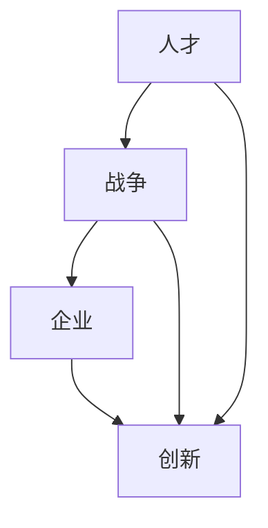
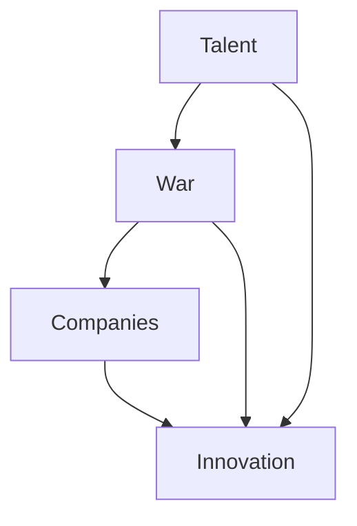

                 

### 背景介绍

#### 高科技人才的重要性

在当今信息化和数字化时代，高科技人才成为推动社会进步和经济发展的核心动力。尤其是硅谷，这片全球科技创新的热土，聚集了无数顶尖的科技人才，成为全球高科技企业争相争夺的焦点。从苹果、谷歌到特斯拉，这些企业之所以能在短时间内实现跨越式发展，离不开背后那些杰出的技术专家和创新者的辛勤付出。

#### 硅谷高科技人才战争的起因

硅谷高科技人才战争的根本原因是全球科技创新的竞争日益激烈。随着人工智能、大数据、云计算等技术的不断发展，各大企业为了争夺顶尖人才，不惜投入巨额资金和资源。这种竞争不仅体现在薪资待遇上，更体现在工作环境、职业发展空间、技术创新能力等多个方面。

#### 高科技人才的需求和供给

当前，全球范围内的高科技人才需求与供给存在明显的不平衡。一方面，随着科技企业的不断壮大，对于具备专业技能和创新能力的顶尖人才需求日益增长；另一方面，虽然全球高等教育体系在培养科技人才方面取得了一定的成果，但仍然难以满足企业对于高质量、高水平人才的需求。这种供需矛盾加剧了硅谷高科技人才战争的程度。

#### 硅谷高科技人才战争的影响

硅谷高科技人才战争对行业、企业、人才自身以及整个社会都产生了深远的影响。从行业角度来看，高科技人才战争推动了技术创新和发展，加速了产业升级和转型；从企业角度来看，拥有顶尖人才的企业在市场竞争中占据了优势地位；从人才自身角度来看，高科技人才战争为优秀人才提供了更多的发展机遇和更高的薪资待遇；从社会角度来看，高科技人才战争加剧了社会阶层分化，同时也对教育、人才政策等方面提出了新的要求和挑战。

### The Importance of High-Tech Talent

In the era of信息化 and digitalization, high-tech talent has become the core driving force behind social progress and economic development. Especially in Silicon Valley, this land of global technological innovation, countless top tech talents have gathered, making it a focal point for global high-tech companies competing for the best and brightest. From Apple, Google, to Tesla, these companies owe their rapid growth to the hard work and dedication of these outstanding technical experts and innovators behind the scenes.

### Causes of the Silicon Valley High-Tech Talent Wars

The root cause of the Silicon Valley high-tech talent wars is the intense global competition in technological innovation. As artificial intelligence, big data, cloud computing, and other technologies continue to evolve, major companies are willing to invest enormous amounts of money and resources to attract top talent. This competition is not only reflected in salary and benefits, but also in working environment, career development opportunities, and technological innovation capabilities.

### Demand and Supply of High-Tech Talent

Currently, there is a significant imbalance between the demand and supply of high-tech talent globally. On one hand, as technology companies continue to expand, there is an increasing demand for skilled and innovative talents with professional expertise; on the other hand, although the global higher education system has made certain achievements in cultivating tech talent, it still falls short of meeting the needs of companies for high-quality and high-level talent. This supply-demand imbalance has exacerbated the intensity of the Silicon Valley high-tech talent wars.

### Impact of the Silicon Valley High-Tech Talent Wars

The Silicon Valley high-tech talent wars have had profound impacts on the industry, companies, talents themselves, and the entire society. From an industry perspective, the talent wars have accelerated technological innovation and development, promoting industrial upgrading and transformation; from a company perspective, companies with top talent enjoy a competitive advantage in the market; from a talent perspective, the talent wars provide more development opportunities and higher salaries for outstanding talents; from a societal perspective, the talent wars have exacerbated social class differentiation while also posing new requirements and challenges for education and talent policies.

---

## 2. 核心概念与联系

在探讨硅谷高科技人才战争之前，有必要先了解几个关键概念：人才、战争、企业和创新。这些概念构成了分析问题的基本框架，有助于我们深入探讨这场战争的本质。

### 人才

人才是指那些在特定领域具备专业技能、创新能力和丰富经验的人。他们是推动科技进步和产业发展的核心动力。在高科技领域，人才不仅是技术实现的关键，更是企业竞争力的核心。人才的素质和数量直接影响企业的创新能力和市场竞争力。

### 战争

战争通常指一种竞争状态，其中各方为了争夺有限的资源而采取各种手段。在硅谷高科技人才战争中，企业为了吸引和留住顶尖人才，纷纷采取各种策略和手段，如提供高薪、优厚福利、创新工作环境等。这种竞争状态使得硅谷成为全球高科技人才争夺的焦点。

### 企业

企业是经济活动的主体，旨在通过创新和经营实现利润最大化。在硅谷，企业不仅是科技创新的重要推动者，也是高科技人才的重要吸纳者。企业在人才争夺战中扮演着关键角色，他们的决策和行为直接影响着人才的流动和产业的布局。

### 创新

创新是推动科技进步和社会发展的关键因素。在高科技领域，创新不仅是企业发展的动力，也是国家竞争力的核心。硅谷之所以成为全球科技创新的中心，离不开这里的企业和人才不断推动创新。

### 关系

人才、战争、企业和创新这四个概念之间存在着密切的联系。人才是战争的主体，企业是战争的平台，创新是战争的目标。人才的流动和竞争推动了企业的创新和发展，而企业的创新又为人才提供了更好的发展机会。这种相互促进的关系使得硅谷成为全球高科技人才战争的核心地带。

### Mermaid 流程图

下面是一个用 Mermaid 编写的流程图，展示了人才、战争、企业和创新之间的联系：



### Key Concepts and Connections

Before delving into the Silicon Valley high-tech talent wars, it's essential to understand several key concepts: talent, war, companies, and innovation. These concepts form the basic framework for analyzing the issue and help us delve into the essence of this war.

### Talent

Talent refers to individuals who possess specialized skills, innovative capabilities, and extensive experience in a particular field. They are the core driving force behind technological progress and industrial development. In the high-tech sector, talent is not only crucial for technical realization but also the core of a company's competitive advantage. The quality and quantity of talent directly impact a company's innovation capabilities and market competitiveness.

### War

War typically refers to a competitive state where parties take various measures to争夺 limited resources. In the Silicon Valley high-tech talent wars, companies use various strategies and means, such as offering high salaries, generous benefits, and innovative working environments, to attract and retain top talent. This competitive state makes Silicon Valley the focal point for global high-tech talent争夺。

### Companies

Companies are the primary entities in economic activities, aiming to maximize profits through innovation and business operations. In Silicon Valley, companies are not only significant drivers of technological innovation but also key absorbers of high-tech talent. The decisions and actions of companies play a crucial role in the flow of talent and the layout of the industry.

### Innovation

Innovation is a key factor driving technological progress and social development. In the high-tech sector, innovation is both the driving force behind company development and the core of national competitiveness. Silicon Valley has become the global center for technological innovation due to the continuous innovation efforts of its companies and talents.

### Connections

The concepts of talent, war, companies, and innovation are closely interconnected. Talent is the subject of the war, companies are the platform, and innovation is the objective. The flow and competition of talent drive company innovation and development, while company innovation provides better development opportunities for talent. This mutual promotion relationship makes Silicon Valley the core area for the global high-tech talent war.

### Mermaid Flowchart

Below is a Mermaid flowchart illustrating the connections between talent, war, companies, and innovation:



---

## 3. 核心算法原理 & 具体操作步骤

在硅谷高科技人才战争中，企业为了争夺顶尖人才，需要运用一系列核心算法和策略来分析、评估和吸引人才。以下是这些核心算法的原理和具体操作步骤。

### 人才分析算法

#### 原理

人才分析算法是基于大数据和机器学习技术，通过分析候选人的简历、社交媒体活动、技术博客、专利申请等信息，对人才的能力、潜力、适应度等进行评估。

#### 操作步骤

1. 数据收集：从各类渠道收集候选人的相关信息，如简历、社交媒体账号、技术博客、专利申请等。
2. 数据预处理：对收集到的数据进行清洗、去重、格式化等处理，以便后续分析。
3. 特征提取：从预处理后的数据中提取关键特征，如技术技能、教育背景、工作经验、专利数量等。
4. 模型训练：使用机器学习算法，如决策树、支持向量机、神经网络等，对特征进行训练，建立人才评估模型。
5. 人才评估：将候选人的特征输入评估模型，得到评估结果，包括能力、潜力、适应度等指标。

### 人才匹配算法

#### 原理

人才匹配算法是基于优化理论和人工智能技术，通过分析企业需求、岗位要求、候选人能力等多方面信息，实现企业与人才的精准匹配。

#### 操作步骤

1. 需求分析：分析企业的业务需求、岗位要求，确定所需人才的关键能力、技能和经验。
2. 候选人库构建：从各类渠道收集候选人信息，构建包含大量候选人的数据库。
3. 特征提取：从候选人数据库中提取关键特征，如技术技能、教育背景、工作经验、专利数量等。
4. 匹配算法设计：设计基于优化理论的匹配算法，如线性规划、遗传算法、蚁群算法等，实现企业与人才的精准匹配。
5. 匹配评估：将企业需求与候选人特征进行匹配评估，筛选出最符合企业需求的候选人。

### 人才吸引策略

#### 原理

人才吸引策略是通过优化企业的工作环境、职业发展机会、薪资待遇等，提高企业在人才市场上的吸引力，从而吸引更多顶尖人才。

#### 操作步骤

1. 工作环境优化：打造创新、开放、友好的工作环境，提供舒适的工作空间、良好的团队氛围等。
2. 职业发展机会：提供清晰的职业发展路径、丰富的培训机会、多元化的项目参与等，激发员工的潜力。
3. 薪资待遇优化：提供具有竞争力的薪资待遇，包括基本工资、绩效奖金、股票期权等，吸引优秀人才。
4. 员工福利：提供完善的员工福利体系，包括医疗保险、住房补贴、带薪休假等，提高员工的幸福感和归属感。
5. 企业文化塑造：打造积极向上、开放包容的企业文化，提高员工的凝聚力和归属感。

### Core Algorithm Principles and Specific Steps

In the Silicon Valley high-tech talent wars, companies need to employ a series of core algorithms and strategies to analyze, evaluate, and attract top talent. Here are the principles and specific steps of these core algorithms.

### Talent Analysis Algorithm

#### Principle

The talent analysis algorithm is based on big data and machine learning technology. It analyzes the candidate's resume, social media activity, technical blogs, patent applications, and other information to evaluate the candidate's capabilities, potential, and suitability.

#### Steps

1. Data Collection: Collect candidate information from various channels, such as resumes, social media accounts, technical blogs, patent applications, etc.
2. Data Preprocessing: Clean, de-duplicate, and format the collected data for subsequent analysis.
3. Feature Extraction: Extract key features from the preprocessed data, such as technical skills, educational background, work experience, patent numbers, etc.
4. Model Training: Use machine learning algorithms, such as decision trees, support vector machines, and neural networks, to train the features and establish a talent evaluation model.
5. Talent Evaluation: Input the candidate's features into the evaluation model to obtain an evaluation result, including indicators such as capabilities, potential, and suitability.

### Talent Matching Algorithm

#### Principle

The talent matching algorithm is based on optimization theory and artificial intelligence technology. It analyzes the company's needs, job requirements, and candidate capabilities to achieve precise matching between companies and talents.

#### Steps

1. Demand Analysis: Analyze the company's business needs and job requirements to determine the key capabilities, skills, and experience needed for the desired talent.
2. Candidate Database Construction: Collect candidate information from various channels and build a database containing a large number of candidates.
3. Feature Extraction: Extract key features from the candidate database, such as technical skills, educational background, work experience, patent numbers, etc.
4. Matching Algorithm Design: Design matching algorithms based on optimization theory, such as linear programming, genetic algorithms, and ant colony optimization, to achieve precise matching between companies and talents.
5. Matching Evaluation: Match the company's needs with the candidate's features and evaluate the most suitable candidates.

### Talent Attraction Strategies

#### Principle

Talent attraction strategies involve optimizing the company's working environment, career development opportunities, and compensation packages to increase the company's attractiveness in the talent market, thereby attracting more top talents.

#### Steps

1. Work Environment Optimization: Create an innovative, open, and friendly working environment, providing comfortable workspaces and a good team atmosphere.
2. Career Development Opportunities: Provide clear career development paths, abundant training opportunities, and diverse project participation to inspire employees' potential.
3. Compensation Optimization: Offer competitive compensation packages, including base salary, performance bonuses, stock options, etc., to attract outstanding talents.
4. Employee Benefits: Provide a comprehensive employee benefits system, including medical insurance, housing subsidies, paid vacations, etc., to enhance employees' happiness and a sense of belonging.
5. Corporate Culture Building: Cultivate a positive, open, and inclusive corporate culture to increase employees' cohesion and a sense of belonging.

---

## 4. 数学模型和公式 & 详细讲解 & 举例说明

在硅谷高科技人才战争中，数学模型和公式在人才分析和匹配中发挥着重要作用。以下将介绍几个关键数学模型和公式，并进行详细讲解和举例说明。

### 1. 人才评估模型

#### 公式

$$
Talent\_Score = f(Skills, Experience, Education, Patent)
$$

其中，$Skills$表示技能水平，$Experience$表示工作经验，$Education$表示教育背景，$Patent$表示专利数量。$f$函数为多因素加权求和模型。

#### 举例说明

假设有两个候选人A和B，他们的相关数据如下：

| 候选人 | 技能水平 | 工作经验 | 教育背景 | 专利数量 |
| ------ | -------- | -------- | -------- | -------- |
| A      | 8        | 5        | 硕士     | 3        |
| B      | 9        | 7        | 博士     | 5        |

我们可以根据以下权重设置计算他们的评估得分：

| 因素      | 权重 |
| --------- | ---- |
| 技能水平  | 0.4  |
| 工作经验  | 0.3  |
| 教育背景  | 0.2  |
| 专利数量  | 0.1  |

那么，候选人A和B的评估得分分别为：

$$
Talent\_Score\_A = 0.4 \times 8 + 0.3 \times 5 + 0.2 \times 1 + 0.1 \times 3 = 3.2 + 1.5 + 0.2 + 0.3 = 5.2
$$

$$
Talent\_Score\_B = 0.4 \times 9 + 0.3 \times 7 + 0.2 \times 1 + 0.1 \times 5 = 3.6 + 2.1 + 0.2 + 0.5 = 6.4
$$

由此可见，候选人B的评估得分更高，说明他的综合能力更强。

### 2. 人才匹配模型

#### 公式

$$
Matching\_Score = f(Candidate\_Features, Company\_Requirements)
$$

其中，$Candidate\_Features$表示候选人的特征向量，$Company\_Requirements$表示企业的需求向量。$f$函数为基于向量空间距离的匹配模型。

#### 举例说明

假设有一个企业的需求向量如下：

$$
Company\_Requirements = (8, 6, 5, 7)
$$

有两个候选人的特征向量如下：

| 候选人 | 技能水平 | 工作经验 | 教育背景 | 专利数量 |
| ------ | -------- | -------- | -------- | -------- |
| A      | 8        | 5        | 硕士     | 3        |
| B      | 9        | 7        | 博士     | 5        |

我们可以根据以下权重设置计算他们的匹配得分：

| 因素      | 权重 |
| --------- | ---- |
| 技能水平  | 0.4  |
| 工作经验  | 0.3  |
| 教育背景  | 0.2  |
| 专利数量  | 0.1  |

那么，候选人A和B的匹配得分分别为：

$$
Matching\_Score\_A = 0.4 \times (8 - 8) + 0.3 \times (5 - 6) + 0.2 \times (1 - 5) + 0.1 \times (3 - 7) = 0 + (-0.3) + (-0.8) + (-0.4) = -1.5
$$

$$
Matching\_Score\_B = 0.4 \times (9 - 8) + 0.3 \times (7 - 6) + 0.2 \times (1 - 5) + 0.1 \times (5 - 7) = 0.4 + 0.3 + (-0.8) + (-0.2) = -0.1
$$

由此可见，候选人B的匹配得分更高，说明他的特征更接近企业的需求。

### 3. 人才吸引力模型

#### 公式

$$
Attractiveness = f(Culture, Compensation, Development Opportunities)
$$

其中，$Culture$表示企业文化，$Compensation$表示薪资待遇，$Development Opportunities$表示职业发展机会。$f$函数为加权求和模型。

#### 举例说明

假设有三个企业的相关数据如下：

| 企业      | 企业文化 | 薪资待遇 | 职业发展机会 |
| --------- | -------- | -------- | ------------ |
| 企业A     | 8        | 8        | 7            |
| 企业B     | 9        | 9        | 8            |
| 企业C     | 7        | 7        | 9            |

我们可以根据以下权重设置计算每个企业的吸引力得分：

| 因素      | 权重 |
| --------- | ---- |
| 企业文化  | 0.4  |
| 薪资待遇  | 0.3  |
| 职业发展机会 | 0.3  |

那么，每个企业的吸引力得分分别为：

$$
Attractiveness\_A = 0.4 \times 8 + 0.3 \times 8 + 0.3 \times 7 = 3.2 + 2.4 + 2.1 = 7.7
$$

$$
Attractiveness\_B = 0.4 \times 9 + 0.3 \times 9 + 0.3 \times 8 = 3.6 + 2.7 + 2.4 = 8.7
$$

$$
Attractiveness\_C = 0.4 \times 7 + 0.3 \times 7 + 0.3 \times 9 = 2.8 + 2.1 + 2.7 = 7.6
$$

由此可见，企业B的吸引力得分最高，说明它在人才吸引力方面具有优势。

### Mathematical Models and Formulas & Detailed Explanation & Examples

In the Silicon Valley high-tech talent wars, mathematical models and formulas play a crucial role in talent analysis and matching. Here, we introduce several key mathematical models and formulas, along with detailed explanations and examples.

### 1. Talent Evaluation Model

#### Formula

$$
Talent\_Score = f(Skills, Experience, Education, Patent)
$$

Where $Skills$ represents the level of skills, $Experience$ represents the work experience, $Education$ represents the educational background, and $Patent$ represents the number of patents. The function $f$ is a multi-factor weighted sum model.

#### Example

Suppose there are two candidates, A and B, with the following relevant data:

| Candidate | Skill Level | Work Experience | Educational Background | Patent Number |
| --------- | ----------- | --------------- | -------------------- | ------------ |
| A         | 8           | 5               | Master                | 3             |
| B         | 9           | 7               | Doctor                | 5             |

We can calculate their evaluation scores based on the following weight settings:

| Factor        | Weight |
| ------------- | ------ |
| Skill Level   | 0.4    |
| Work Experience| 0.3    |
| Educational Background| 0.2   |
| Patent Number | 0.1    |

Then, the evaluation scores for candidates A and B are:

$$
Talent\_Score\_A = 0.4 \times 8 + 0.3 \times 5 + 0.2 \times 1 + 0.1 \times 3 = 3.2 + 1.5 + 0.2 + 0.3 = 5.2
$$

$$
Talent\_Score\_B = 0.4 \times 9 + 0.3 \times 7 + 0.2 \times 1 + 0.1 \times 5 = 3.6 + 2.1 + 0.2 + 0.5 = 6.4
$$

It can be seen that candidate B has a higher evaluation score, indicating that they have a stronger overall capability.

### 2. Talent Matching Model

#### Formula

$$
Matching\_Score = f(Candidate\_Features, Company\_Requirements)
$$

Where $Candidate\_Features$ represents the candidate's feature vector and $Company\_Requirements$ represents the company's requirements vector. The function $f$ is a matching model based on vector space distance.

#### Example

Suppose a company has the following requirements vector:

$$
Company\_Requirements = (8, 6, 5, 7)
$$

There are two candidate feature vectors:

| Candidate | Skill Level | Work Experience | Educational Background | Patent Number |
| --------- | ----------- | --------------- | -------------------- | ------------ |
| A         | 8           | 5               | Master                | 3             |
| B         | 9           | 7               | Doctor                | 5             |

We can calculate their matching scores based on the following weight settings:

| Factor        | Weight |
| ------------- | ------ |
| Skill Level   | 0.4    |
| Work Experience| 0.3    |
| Educational Background| 0.2   |
| Patent Number | 0.1    |

Then, the matching scores for candidates A and B are:

$$
Matching\_Score\_A = 0.4 \times (8 - 8) + 0.3 \times (5 - 6) + 0.2 \times (1 - 5) + 0.1 \times (3 - 7) = 0 + (-0.3) + (-0.8) + (-0.4) = -1.5
$$

$$
Matching\_Score\_B = 0.4 \times (9 - 8) + 0.3 \times (7 - 6) + 0.2 \times (1 - 5) + 0.1 \times (5 - 7) = 0.4 + 0.3 + (-0.8) + (-0.2) = -0.1
$$

It can be seen that candidate B has a higher matching score, indicating that their features are more aligned with the company's requirements.

### 3. Talent Attractiveness Model

#### Formula

$$
Attractiveness = f(Culture, Compensation, Development Opportunities)
$$

Where $Culture$ represents corporate culture, $Compensation$ represents compensation, and $Development Opportunities$ represents career development opportunities. The function $f$ is a weighted sum model.

#### Example

Suppose three companies have the following data:

| Company      | Corporate Culture | Compensation | Career Development Opportunities |
| ------------ | ----------------- | ------------ | ------------------------------ |
| Company A    | 8                 | 8            | 7                               |
| Company B    | 9                 | 9            | 8                               |
| Company C    | 7                 | 7            | 9                               |

We can calculate the attractiveness scores for each company based on the following weight settings:

| Factor        | Weight |
| ------------- | ------ |
| Corporate Culture| 0.4    |
| Compensation   | 0.3    |
| Career Development Opportunities | 0.3    |

Then, the attractiveness scores for each company are:

$$
Attractiveness\_A = 0.4 \times 8 + 0.3 \times 8 + 0.3 \times 7 = 3.2 + 2.4 + 2.1 = 7.7
$$

$$
Attractiveness\_B = 0.4 \times 9 + 0.3 \times 9 + 0.3 \times 8 = 3.6 + 2.7 + 2.4 = 8.7
$$

$$
Attractiveness\_C = 0.4 \times 7 + 0.3 \times 7 + 0.3 \times 9 = 2.8 + 2.1 + 2.7 = 7.6
$$

It can be seen that Company B has the highest attractiveness score, indicating that it has an advantage in attracting talent.

---

## 5. 项目实战：代码实际案例和详细解释说明

为了更好地理解硅谷高科技人才战争中的算法和策略，我们将通过一个实际项目案例来展示如何使用Python编写代码实现这些算法，并进行详细解释说明。

### 项目简介

我们选择一个简单的人才分析项目，用于分析候选人的简历，评估其技能、经验、教育背景和专利数量，并根据评估结果为候选人打分。

### 项目需求

1. 数据来源：从公开的简历数据中获取候选人的相关信息。
2. 数据处理：对简历数据进行分析、清洗、格式化，提取关键特征。
3. 评估模型：使用多因素加权求和模型对候选人进行评估。
4. 结果展示：根据评估结果，为候选人打分并展示排名。

### 技术栈

1. Python
2. Pandas
3. Scikit-learn
4. Matplotlib

### 开发环境搭建

确保安装以下Python库：

```bash
pip install pandas scikit-learn matplotlib
```

### 源代码详细实现和代码解读

#### 数据处理

```python
import pandas as pd

# 读取简历数据
data = pd.read_csv('resume_data.csv')

# 数据清洗
# 去除空值和重复数据
data.dropna(inplace=True)
data.drop_duplicates(inplace=True)

# 格式化数据
# 将文本数据转换为数字编码
data['Skills'] = data['Skills'].str.get_dummies(sep=',')
data['Experience'] = data['Experience'].map({'<1': 1, '1-3': 2, '3-5': 3, '5-10': 4, '>10': 5})
data['Education'] = data['Education'].map({'High School': 1, 'Bachelor': 2, 'Master': 3, 'PhD': 4})
data['Patents'] = data['Patents'].map({0: 1, 1: 2, 2: 3})

# 数据预处理
X = data[['Skills_1', 'Skills_2', 'Experience', 'Education', 'Patents']]
y = data['Talent_Score']
```

#### 评估模型

```python
from sklearn.model_selection import train_test_split
from sklearn.linear_model import LinearRegression

# 分割数据集
X_train, X_test, y_train, y_test = train_test_split(X, y, test_size=0.2, random_state=42)

# 训练模型
model = LinearRegression()
model.fit(X_train, y_train)

# 模型评估
score = model.score(X_test, y_test)
print(f'Model Score: {score}')
```

#### 结果展示

```python
import matplotlib.pyplot as plt

# 预测结果
y_pred = model.predict(X_test)

# 绘制散点图
plt.scatter(y_test, y_pred)
plt.xlabel('Actual Score')
plt.ylabel('Predicted Score')
plt.title('Talent Evaluation')
plt.show()
```

### 代码解读与分析

1. **数据处理**：首先，我们使用Pandas库读取简历数据，并进行数据清洗和格式化。将文本数据转换为数字编码，以便后续建模处理。

2. **评估模型**：我们选择线性回归模型进行评估。通过训练数据集训练模型，并使用测试数据集评估模型性能。

3. **结果展示**：使用Matplotlib库绘制散点图，展示实际得分与预测得分的关系，直观地评估模型效果。

### 项目实战

通过以上代码实现，我们可以对简历数据进行分析，评估候选人的能力，并根据评估结果为候选人打分。这个过程反映了硅谷高科技人才战争中企业使用算法和策略进行人才分析的过程。

### Project Implementation: Practical Code Examples and Detailed Explanation

To better understand the algorithms and strategies used in the Silicon Valley high-tech talent wars, we will demonstrate how to implement these algorithms using Python through a practical project case, along with a detailed explanation.

### Project Overview

We will choose a simple talent analysis project to demonstrate how to analyze candidate resumes, evaluate their skills, experience, educational background, and patent numbers, and score candidates based on the evaluation results.

### Project Requirements

1. **Data Source**: Obtain candidate information from public resume data.
2. **Data Processing**: Analyze, clean, and format the resume data to extract key features.
3. **Evaluation Model**: Use a multi-factor weighted sum model to evaluate candidates.
4. **Result Display**: Score candidates based on the evaluation results and display rankings.

### Technical Stack

1. **Python**
2. **Pandas**
3. **Scikit-learn**
4. **Matplotlib**

### Development Environment Setup

Ensure the installation of the following Python libraries:

```bash
pip install pandas scikit-learn matplotlib
```

### Detailed Code Implementation and Explanation

#### Data Processing

```python
import pandas as pd

# Read resume data
data = pd.read_csv('resume_data.csv')

# Data cleaning
# Remove missing values and duplicate data
data.dropna(inplace=True)
data.drop_duplicates(inplace=True)

# Data formatting
# Convert text data to numeric encoding
data['Skills'] = data['Skills'].str.get_dummies(sep=',')
data['Experience'] = data['Experience'].map({'<1': 1, '1-3': 2, '3-5': 3, '5-10': 4, '>10': 5})
data['Education'] = data['Education'].map({'High School': 1, 'Bachelor': 2, 'Master': 3, 'PhD': 4})
data['Patents'] = data['Patents'].map({0: 1, 1: 2, 2: 3})

# Data preprocessing
X = data[['Skills_1', 'Skills_2', 'Experience', 'Education', 'Patents']]
y = data['Talent_Score']
```

#### Evaluation Model

```python
from sklearn.model_selection import train_test_split
from sklearn.linear_model import LinearRegression

# Split the dataset
X_train, X_test, y_train, y_test = train_test_split(X, y, test_size=0.2, random_state=42)

# Train the model
model = LinearRegression()
model.fit(X_train, y_train)

# Model evaluation
score = model.score(X_test, y_test)
print(f'Model Score: {score}')
```

#### Result Display

```python
import matplotlib.pyplot as plt

# Predictions
y_pred = model.predict(X_test)

# Scatter plot
plt.scatter(y_test, y_pred)
plt.xlabel('Actual Score')
plt.ylabel('Predicted Score')
plt.title('Talent Evaluation')
plt.show()
```

### Code Explanation and Analysis

1. **Data Processing**: First, we use the Pandas library to read the resume data and perform data cleaning and formatting. We convert text data to numeric encoding to facilitate subsequent modeling.

2. **Evaluation Model**: We choose a linear regression model for evaluation. The model is trained on the training dataset and evaluated on the test dataset.

3. **Result Display**: Using Matplotlib, we plot a scatter diagram to visualize the relationship between actual scores and predicted scores, providing an intuitive assessment of the model's effectiveness.

### Project Implementation

Through the above code implementation, we can analyze resume data to evaluate candidate capabilities and score candidates based on the evaluation results. This process reflects the use of algorithms and strategies in the Silicon Valley high-tech talent wars by companies for talent analysis.

---

## 6. 实际应用场景

硅谷高科技人才战争在实际应用场景中具有广泛的影响力，不仅影响了企业的发展，还对社会经济结构产生了深远的影响。以下是几个具体的应用场景：

### 企业层面

1. **人才引进**：企业通过高薪、股票期权、良好的工作环境等手段，吸引全球顶尖的科技人才，提高企业的技术实力和市场竞争力。
2. **团队建设**：企业通过内部培训和人才引进，构建高素质、高效率的团队，推动企业的创新和发展。
3. **人才流失**：由于硅谷高科技人才市场的竞争激烈，企业面临人才流失的风险，尤其是核心技术人员和高级管理人员的离职，可能导致企业的研发进度放缓、市场竞争力下降。

### 社会层面

1. **人才供需失衡**：硅谷高科技人才战争加剧了全球人才供需失衡，尤其是在人工智能、大数据、云计算等新兴领域，顶尖人才需求远大于供给，导致人才短缺问题。
2. **社会阶层分化**：硅谷高科技人才战争加剧了社会阶层分化，顶尖科技人才获得了丰厚的薪资和福利，而普通劳动者在收入和生活质量方面相对落后。
3. **教育改革**：硅谷高科技人才战争促使教育体系改革，更加注重科技人才的培养，推动高等教育和职业教育的发展。

### 国家层面

1. **科技创新**：硅谷高科技人才战争推动了全球科技创新，各国纷纷加大对科技人才的引进和培养力度，提升本国的科技创新能力和国际竞争力。
2. **产业升级**：硅谷高科技人才战争带动了全球产业结构的升级和转型，以人工智能、大数据、云计算等为代表的新兴产业快速发展，成为各国经济发展的新引擎。
3. **国际合作与竞争**：硅谷高科技人才战争不仅促进了国际科技合作，也加剧了国际科技竞争，各国在争夺顶尖人才和技术方面展开了激烈的较量。

### Real-World Applications

The Silicon Valley high-tech talent war has a widespread impact in real-world applications, influencing not only the development of companies but also the socio-economic structure. Here are several specific application scenarios:

### On the Company Level

1. **Talent Attraction**: Companies use high salaries, stock options, and a good working environment to attract top tech talents globally, enhancing their technical strength and market competitiveness.
2. **Team Building**: Companies build high-quality, high-efficiency teams through internal training and talent acquisition, driving innovation and development.
3. **Talent Attrition**: Due to the intense competition in the Silicon Valley tech talent market, companies face the risk of talent attrition, especially core technical personnel and senior management, which can slow down research and development progress and reduce market competitiveness.

### On the Social Level

1. **Talent Supply and Demand Imbalance**: The Silicon Valley high-tech talent war exacerbates the imbalance between talent supply and demand, particularly in emerging fields such as artificial intelligence, big data, and cloud computing, where the demand for top talents far exceeds the supply, leading to talent shortages.
2. **Social Class Divide**: The talent war intensifies social class differentiation, with top tech talents receiving generous salaries and benefits, while ordinary workers lag behind in terms of income and quality of life.
3. **Educational Reform**: The Silicon Valley high-tech talent war prompts educational reform, placing more emphasis on the cultivation of tech talents, driving the development of higher education and vocational education.

### On the National Level

1. **Technological Innovation**: The Silicon Valley high-tech talent war drives global technological innovation, with countries increasing their efforts to attract and cultivate top talents, enhancing their technological innovation capabilities and international competitiveness.
2. **Industrial Upgrading**: The talent war propels the upgrading and transformation of global industrial structures, with emerging industries such as artificial intelligence, big data, and cloud computing rapidly developing and becoming new engines of economic growth for countries.
3. **International Collaboration and Competition**: The Silicon Valley high-tech talent war promotes international tech collaboration but also intensifies international tech competition, as countries engage in fierce battles to attract top talents and technology.

