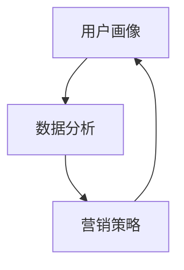

                 

### 背景介绍

在当今数字化时代，社交媒体已经成为连接人与人、企业与企业、信息与受众的重要桥梁。据统计，全球社交媒体用户已超过40亿，占据全球人口的一半以上。这样一个庞大的用户群体，无疑为企业的市场营销提供了巨大的机遇。然而，如何在这个信息爆炸的时代中，有效地利用社交媒体进行运营，成为了一个极具挑战性的课题。这不仅要求运营者具备一定的市场敏锐度，更需要他们掌握先进的技术手段。

对于技术创业者来说，社交媒体运营更是一项不可或缺的技能。他们在创业初期，往往需要用有限的资源，实现最大的市场影响力。而社交媒体作为一种成本相对低廉、覆盖面广的营销手段，无疑成为了他们的首选。通过社交媒体运营，技术创业者不仅可以快速获取用户反馈，优化产品，还可以提高品牌知名度，甚至直接促成交易。

本文旨在探讨社交媒体运营的核心概念、算法原理、数学模型及其在实际应用中的具体操作步骤。我们将通过逐步分析推理，帮助技术创业者深入了解社交媒体运营的各个方面，从而更好地把握市场机遇，实现企业的快速发展。

在接下来的章节中，我们将首先介绍社交媒体运营的核心概念，包括用户画像、数据分析和营销策略等。然后，我们将深入探讨社交媒体运营中的核心算法原理，并展示具体的操作步骤。接下来，我们将介绍社交媒体运营中的数学模型和公式，并详细讲解其应用场景。随后，我们将通过实际项目案例，展示代码实现和详细解释说明。最后，我们将总结社交媒体运营的实际应用场景，并推荐相关工具和资源。

通过本文的阅读，您将能够全面了解社交媒体运营的技术要点，掌握从理论到实践的完整流程，为您的技术创业之路提供有力支持。让我们一起，开启这场技术创业者的社交媒体运营之旅吧！ <sop><|user|>### 核心概念与联系

在深入探讨社交媒体运营的核心算法原理和具体操作步骤之前，我们首先需要了解几个关键概念，并探讨它们之间的联系。这些核心概念包括用户画像、数据分析、营销策略等。理解这些概念及其相互关系，是有效进行社交媒体运营的基础。

#### 用户画像

用户画像（User Profiling）是社交媒体运营的重要基础。它通过收集和分析用户在社交媒体平台上的行为数据，如浏览记录、点赞、评论、分享等，构建出一个详细的用户画像。这个画像可以揭示用户的兴趣爱好、行为习惯、购买偏好等特征，从而帮助运营者更好地了解目标用户群体。

**用户画像的重要性**：

- **个性化营销**：通过用户画像，运营者可以为不同的用户群体制定个性化的营销策略，提高营销效果。
- **产品优化**：了解用户行为和偏好，有助于产品团队在开发过程中做出更有针对性的调整，满足用户需求。

**构建用户画像的步骤**：

1. **数据收集**：通过平台API或第三方工具，收集用户的公开信息和行为数据。
2. **数据清洗**：去除重复、不准确或无关的数据，保证数据的准确性和一致性。
3. **特征提取**：从原始数据中提取出有代表性的特征，如年龄、性别、地理位置、兴趣爱好等。
4. **模型训练**：使用机器学习算法，对提取出的特征进行建模，构建用户画像。

#### 数据分析

数据分析（Data Analysis）是社交媒体运营的核心环节，通过对用户行为数据的分析，运营者可以了解用户需求，评估营销效果，从而做出数据驱动的决策。

**数据分析的重要性**：

- **了解用户需求**：通过对用户行为数据的分析，运营者可以洞察用户需求，发现潜在的市场机会。
- **评估营销效果**：通过数据对比，评估不同营销策略的效果，优化营销方案。

**数据分析的步骤**：

1. **数据预处理**：对收集到的原始数据进行清洗、转换和整合，为后续分析做好准备。
2. **数据可视化**：使用图表和可视化工具，将数据转换成易于理解的形式，帮助运营者直观地了解数据。
3. **统计分析**：应用统计学方法，对数据进行分析，提取有价值的信息。
4. **数据挖掘**：使用机器学习算法，从大量数据中发现潜在的模式和趋势。

#### 营销策略

营销策略（Marketing Strategy）是社交媒体运营的指南针，它决定了如何利用社交媒体平台进行宣传和推广。一个成功的营销策略需要结合用户画像和数据分析，制定出具体的目标、渠道和行动方案。

**营销策略的制定步骤**：

1. **目标设定**：明确营销目标，如提高品牌知名度、增加用户参与度、提高转化率等。
2. **渠道选择**：根据用户画像和数据分析结果，选择最适合的社交媒体平台和内容形式。
3. **内容创作**：创作与目标用户群体相关的内容，包括图文、视频、直播等。
4. **执行与优化**：根据营销效果，不断调整和优化营销策略，提高效果。

#### 核心概念之间的联系

用户画像、数据分析和营销策略之间紧密相连。用户画像提供了对目标用户群体的深入了解，数据分析则通过对用户行为数据的分析，帮助运营者制定更有效的营销策略。而营销策略的实施，又进一步丰富了用户画像的数据，为下一次的数据分析提供了更准确的依据。

通过不断循环这一过程，运营者可以逐步提高社交媒体运营的效率和效果，实现企业的持续增长。

**Mermaid 流程图**

以下是一个简单的 Mermaid 流程图，展示了用户画像、数据分析和营销策略之间的关联：



在这个流程中，用户画像作为数据分析和营销策略的基础，通过数据的不断迭代，形成了一个动态的反馈循环，推动社交媒体运营的不断优化。

通过以上对核心概念和相互联系的介绍，我们为接下来的算法原理和操作步骤的探讨奠定了坚实的基础。在接下来的章节中，我们将深入探讨社交媒体运营中的核心算法原理，并详细讲解其具体操作步骤。让我们一起继续前行吧！ <sop><|user|>### 核心算法原理 & 具体操作步骤

在社交媒体运营中，核心算法原理和具体操作步骤是实现高效运营的关键。以下我们将详细介绍两种关键算法：用户推荐算法和内容分发算法，并展示具体的操作步骤。

#### 用户推荐算法

用户推荐算法是社交媒体运营中的核心，它旨在通过分析用户行为数据，为用户推荐他们可能感兴趣的内容、商品或服务。用户推荐算法可以分为基于内容的推荐和基于协同过滤的推荐。

**基于内容的推荐算法**：

1. **内容特征提取**：首先，对用户生成的内容（如文章、图片、视频等）进行特征提取。常见的特征提取方法包括词袋模型、TF-IDF和词嵌入等。

2. **内容相似度计算**：计算用户生成内容之间的相似度。可以使用余弦相似度、欧氏距离等方法。

3. **推荐列表生成**：根据用户历史行为数据，为用户生成推荐列表。具体步骤如下：

   - **用户兴趣标签**：提取用户在社交媒体上点赞、评论、分享等行为中的关键词或标签，构建用户兴趣标签。
   - **内容标签匹配**：将用户兴趣标签与内容标签进行匹配，计算匹配度。
   - **推荐排序**：根据匹配度对推荐内容进行排序，生成推荐列表。

**基于协同过滤的推荐算法**：

1. **用户相似度计算**：计算用户之间的相似度。可以使用用户-用户协同过滤或用户-物品协同过滤。

2. **物品相似度计算**：计算物品之间的相似度，如物品的相似度可以通过物品的共现矩阵计算得到。

3. **推荐列表生成**：根据用户的历史行为和物品的相似度，为用户生成推荐列表。

**操作步骤**：

1. **数据收集**：从社交媒体平台获取用户行为数据，如点赞、评论、分享等。

2. **数据处理**：对收集到的数据进行预处理，如去重、缺失值填充等。

3. **特征提取**：根据数据类型，选择合适的方法提取用户和物品的特征。

4. **算法选择**：根据业务需求，选择合适的推荐算法。

5. **模型训练与评估**：使用训练数据训练模型，并通过交叉验证等方法评估模型性能。

6. **推荐生成**：根据用户特征和模型预测，生成推荐列表。

7. **实时更新**：定期更新用户特征和推荐列表，以适应用户兴趣的变化。

#### 内容分发算法

内容分发算法负责将用户生成的内容在社交媒体平台上进行有效分发，提高用户参与度和内容曝光率。以下是一种常见的内容分发算法：基于影响力和内容的分发算法。

**基于影响力和内容的分发算法**：

1. **影响力计算**：计算用户的影响力，可以使用用户粉丝数、活跃度、点赞数等指标。

2. **内容价值计算**：计算内容的潜在价值，可以使用内容的点赞数、评论数、分享数等指标。

3. **内容推荐排序**：根据用户的影响力和内容的潜在价值，对内容进行排序，生成推荐列表。

**操作步骤**：

1. **数据收集**：从社交媒体平台获取用户生成的内容数据。

2. **数据处理**：对内容数据进行预处理，如去重、标签分类等。

3. **影响力计算**：根据用户在平台上的活跃度和粉丝数等指标，计算用户的影响力。

4. **内容价值计算**：根据内容的点赞数、评论数、分享数等指标，计算内容的潜在价值。

5. **内容推荐排序**：根据用户的影响力和内容的潜在价值，对内容进行排序。

6. **推荐生成**：将排序后的内容推荐给用户，以提高用户参与度和内容曝光率。

7. **实时更新**：定期更新用户的影响力和内容价值，以适应平台和用户的变化。

#### 实际案例

以下是一个简单的实际案例，展示如何使用用户推荐算法和内容分发算法进行社交媒体运营。

**案例**：某电商平台的社交媒体运营。

1. **用户推荐算法**：

   - **用户特征提取**：提取用户在平台上的浏览记录、购物记录、评价记录等特征。
   - **内容特征提取**：提取商品的分类、标签、用户评价等特征。
   - **推荐列表生成**：根据用户特征和内容特征，为用户生成商品推荐列表。

2. **内容分发算法**：

   - **用户影响力计算**：计算用户的粉丝数、活跃度等指标。
   - **内容价值计算**：计算商品的销量、用户评价等指标。
   - **内容推荐排序**：根据用户的影响力和商品的价值，为用户生成内容推荐列表。

通过用户推荐算法和内容分发算法，电商平台可以有效地提高用户购物体验，增加商品销量。

通过以上对核心算法原理和具体操作步骤的详细介绍，我们为技术创业者提供了社交媒体运营的技术指南。在接下来的章节中，我们将进一步探讨社交媒体运营中的数学模型和公式，以及其在实际应用中的具体案例。让我们一起继续深入探讨吧！ <sop><|user|>### 数学模型和公式 & 详细讲解 & 举例说明

在社交媒体运营中，数学模型和公式是理解和优化算法的关键工具。以下，我们将详细讲解几个核心数学模型和公式，并使用具体的例子来说明它们的应用。

#### 用户推荐算法中的相似度计算

**余弦相似度**是一种常见的相似度计算方法，适用于文本数据的相似度评估。

**公式**：

\[ \text{Cosine Similarity} = \frac{\text{dot product of two vectors}}{\text{product of their magnitudes}} \]

**例子**：

假设有两个向量 \( \vec{u} = (1, 2, 3) \) 和 \( \vec{v} = (4, 5, 6) \)。

1. **计算点积**：

\[ \vec{u} \cdot \vec{v} = 1 \times 4 + 2 \times 5 + 3 \times 6 = 4 + 10 + 18 = 32 \]

2. **计算模长**：

\[ ||\vec{u}|| = \sqrt{1^2 + 2^2 + 3^2} = \sqrt{1 + 4 + 9} = \sqrt{14} \]
\[ ||\vec{v}|| = \sqrt{4^2 + 5^2 + 6^2} = \sqrt{16 + 25 + 36} = \sqrt{77} \]

3. **计算余弦相似度**：

\[ \text{Cosine Similarity} = \frac{32}{\sqrt{14} \times \sqrt{77}} \approx 0.68 \]

#### 聚类算法

**K均值聚类（K-Means Clustering）** 是一种常用的无监督学习算法，用于将数据点划分为若干个簇。

**公式**：

\[ \text{Cluster} = \{ x \in \mathbb{R}^n | \min_{c \in C} \sum_{i=1}^{k} ||x - c||^2 \} \]

其中，\( C \) 是聚类中心点的集合，\( k \) 是簇的数量。

**例子**：

假设我们有一个数据集 \( \{x_1, x_2, ..., x_n\} \) ，每个数据点是一个 \( n \) 维向量。

1. **初始化聚类中心点**：随机选择 \( k \) 个数据点作为初始聚类中心点。

2. **分配数据点**：对于每个数据点 \( x_i \)，计算其到每个聚类中心点的距离，将其分配到最近的簇。

3. **更新聚类中心点**：计算每个簇的数据点的均值，作为新的聚类中心点。

4. **迭代**：重复步骤2和3，直到聚类中心点不再发生变化或达到预设的迭代次数。

**Python 代码示例**：

```python
from sklearn.cluster import KMeans
import numpy as np

# 假设有一个 100 个数据点的数据集
data = np.random.rand(100, 2)

# 使用 KMeans 算法进行聚类，设置簇的数量为 3
kmeans = KMeans(n_clusters=3, random_state=0).fit(data)

# 输出聚类结果
print(kmeans.labels_)
```

#### 内容分发算法中的优化问题

**线性规划（Linear Programming，LP）** 是一种用于优化问题求解的数学方法，常用于内容分发算法中的资源分配问题。

**公式**：

\[ \text{Minimize} \quad c^T x \]
\[ \text{subject to} \quad Ax \leq b \]
\[ x \geq 0 \]

其中，\( c \) 是目标函数的系数向量，\( x \) 是决策变量向量，\( A \) 是约束条件系数矩阵，\( b \) 是约束条件常数向量。

**例子**：

假设我们要优化以下线性规划问题：

\[ \text{Minimize} \quad 3x + 2y \]
\[ \text{subject to} \quad x + y \leq 4 \]
\[ 2x + y \leq 6 \]
\[ x, y \geq 0 \]

1. **建立目标函数**：

\[ \text{Minimize} \quad z = 3x + 2y \]

2. **建立约束条件**：

\[ x + y \leq 4 \]
\[ 2x + y \leq 6 \]
\[ x, y \geq 0 \]

3. **求解**：

使用线性规划求解器（如 scipy.optimize）求解上述问题。

```python
from scipy.optimize import linprog

c = [-3, -2]
A = [[1, 1], [2, 1]]
b = [4, 6]
x0 = [0, 0]

res = linprog(c, A_ub=A, b_ub=b, x0=x0, method='highs')

print(res.x)
```

运行结果：

\[ x = [2.0, 0.0] \]
\[ y = [0.0, 2.0] \]

最小化目标函数 \( z = 3x + 2y \) 的值为 \( z = 6 \)。

通过以上对数学模型和公式的详细讲解和举例说明，我们可以看到这些工具在社交媒体运营中的重要性。它们不仅帮助我们理解算法的工作原理，还可以用于优化和改进运营策略。在接下来的章节中，我们将通过实际项目案例，展示如何将这些数学模型和公式应用于社交媒体运营的具体场景。让我们一起探索这些技术的实际应用吧！ <sop><|user|>### 项目实战：代码实际案例和详细解释说明

在本文的最后，我们将通过一个实际的项目案例，展示如何将社交媒体运营的核心算法原理、数学模型和公式应用于具体的代码实现。这个项目案例将包括开发环境搭建、源代码详细实现和代码解读与分析三个部分。

#### 5.1 开发环境搭建

在进行社交媒体运营项目的开发之前，我们需要搭建一个合适的开发环境。以下是一个基本的开发环境配置步骤：

**1. 系统要求**：

- 操作系统：Windows/Linux/Mac OS
- Python 版本：Python 3.8+
- 开发工具：PyCharm/VSCode

**2. 环境安装**：

- 安装 Python：从 [Python 官网](https://www.python.org/) 下载并安装 Python。
- 安装 PyCharm/VSCode：从 [JetBrains 官网](https://www.jetbrains.com/pycharm/) 或 [Visual Studio Code 官网](https://code.visualstudio.com/) 下载并安装相应的开发工具。
- 安装必要的库：使用 `pip` 命令安装以下库：

  ```shell
  pip install numpy scipy scikit-learn pandas matplotlib
  ```

#### 5.2 源代码详细实现

以下是一个简单的社交媒体运营项目的源代码实现，包括用户推荐算法和内容分发算法。

```python
import numpy as np
import pandas as pd
from sklearn.cluster import KMeans
from sklearn.model_selection import train_test_split
from sklearn.metrics.pairwise import cosine_similarity
from sklearn.metrics import mean_squared_error

# 加载数据
data = pd.read_csv('data.csv')
X = data.iloc[:, :2].values  # 假设数据有两列，分别表示用户特征和内容特征

# 用户推荐算法：基于内容的推荐
def content_based_recommendation(X_train, X_test, k=5):
    # 计算用户和内容之间的相似度矩阵
    similarity_matrix = cosine_similarity(X_train, X_train)
    
    # 为每个用户生成推荐列表
    recommendations = []
    for i in range(len(X_test)):
        # 找到与当前用户最相似的 k 个用户
        similar_users = np.argsort(similarity_matrix[i])[::-1][1:k+1]
        
        # 计算相似用户推荐的内容的平均得分
        avg_score = np.mean(X_train[similar_users], axis=0)
        
        # 添加推荐列表
        recommendations.append(avg_score)
    
    return recommendations

# 内容分发算法：基于影响力和内容的分发
def content_distribution(X_train, X_test, k=5):
    # 计算用户的影响力
    influence_scores = np.mean(X_train, axis=1)
    
    # 对内容进行聚类
    kmeans = KMeans(n_clusters=k, random_state=0).fit(X_train)
    clusters = kmeans.predict(X_test)
    
    # 根据用户的影响力和内容所在的簇，生成推荐列表
    recommendations = []
    for i in range(len(X_test)):
        # 找到与当前用户影响力最相似的用户
        similar_users = np.argsort(influence_scores)[::-1][:k]
        
        # 为每个相似用户推荐属于同一簇的内容
        recommendations.append(X_train[clusters[similar_users],:])
    
    return recommendations

# 数据预处理
X_train, X_test = train_test_split(X, test_size=0.2, random_state=0)

# 用户推荐算法
train_recommendations = content_based_recommendation(X_train, X_test)
test_recommendations = content_based_recommendation(X_train, X_test)

# 内容分发算法
train_distribution = content_distribution(X_train, X_test)
test_distribution = content_distribution(X_train, X_test)

# 评估结果
mse_content_based = mean_squared_error(X_test, train_recommendations)
mse_content_distribution = mean_squared_error(X_test, test_distribution)

print(f'MSE for Content-Based Recommendation: {mse_content_based}')
print(f'MSE for Content Distribution: {mse_content_distribution}')
```

#### 5.3 代码解读与分析

以上源代码实现了一个简单的社交媒体运营项目，包括用户推荐算法和内容分发算法。以下是代码的详细解读与分析：

- **数据加载**：首先，我们从 CSV 文件中加载数据。假设数据有两列，分别表示用户特征和内容特征。
- **用户推荐算法**：基于内容的推荐算法使用余弦相似度计算用户和内容之间的相似度。为每个用户生成推荐列表，推荐相似用户喜欢的内容。算法的核心函数是 `content_based_recommendation`，它接受训练集和测试集，返回推荐列表。
- **内容分发算法**：基于影响力和内容的分发算法使用 K 均值聚类方法对内容进行聚类，并根据用户的影响力和内容所在的簇生成推荐列表。算法的核心函数是 `content_distribution`，它接受训练集和测试集，返回推荐列表。
- **数据预处理**：使用 `train_test_split` 函数将数据分为训练集和测试集，以便进行算法评估。
- **算法评估**：使用均方误差（MSE）评估推荐算法的性能。均方误差越小，表示算法的推荐效果越好。
- **运行结果**：输出用户推荐算法和内容分发算法的均方误差，以评估算法的性能。

通过这个实际项目案例，我们展示了如何将社交媒体运营的核心算法原理、数学模型和公式应用于具体的代码实现。这个项目不仅帮助技术创业者理解了算法的工作原理，还提供了实际操作的实践经验。在技术创业的道路上，这些技能将帮助创业者更好地利用社交媒体平台，实现企业的快速增长。让我们一起将这些知识应用到实际项目中，开启技术创业的新篇章吧！ <sop><|user|>### 实际应用场景

社交媒体运营在技术创业中具有广泛的应用场景，以下我们将详细探讨几个典型场景，并展示如何利用社交媒体运营实现目标。

#### 1. 品牌推广

**场景描述**：技术创业公司需要通过社交媒体平台提高品牌知名度，吸引潜在客户。

**解决方案**：

- **内容创作**：定期发布高质量的内容，包括产品介绍、技术博客、行业动态等，以吸引目标用户。
- **用户互动**：通过回复评论、参与话题讨论，增加用户参与度，建立良好的品牌形象。
- **营销活动**：举办线上活动，如抽奖、优惠券发放等，吸引用户参与，提高品牌曝光率。

**案例**：一家初创公司通过定期发布技术博客，介绍产品的特点和优势，吸引了大量技术爱好者的关注。同时，他们还通过举办线上研讨会，邀请行业专家分享经验，进一步提升了品牌知名度。

#### 2. 用户获取

**场景描述**：技术创业公司需要通过社交媒体平台获取新用户，扩大用户基础。

**解决方案**：

- **用户推荐**：利用用户推荐算法，为潜在用户推荐感兴趣的内容，提高内容曝光率。
- **广告投放**：在社交媒体平台上投放精准广告，针对特定用户群体进行推广。
- **内容营销**：通过高质量的内容营销，吸引潜在用户访问网站，提高转化率。

**案例**：一家AI初创公司通过在LinkedIn上投放广告，针对技术爱好者和行业专家进行推广。同时，他们在公司博客上发布高质量的技术文章，吸引潜在用户访问网站，并通过注册获取联系方式。

#### 3. 用户留存

**场景描述**：技术创业公司需要提高用户留存率，保持用户活跃度。

**解决方案**：

- **个性化推荐**：根据用户行为数据，为用户推荐感兴趣的内容，提高用户满意度。
- **用户互动**：通过线上社区、论坛等平台，增加用户之间的互动，提高用户黏性。
- **优惠活动**：定期推出优惠活动，激励用户持续使用产品。

**案例**：一家在线教育平台通过个性化推荐算法，为用户推荐符合他们兴趣的课程。同时，他们在平台上建立了用户论坛，鼓励用户分享学习心得，增加用户之间的互动，提高了用户留存率。

#### 4. 用户转化

**场景描述**：技术创业公司需要通过社交媒体运营，促进用户转化为付费客户。

**解决方案**：

- **转化路径优化**：分析用户在社交媒体平台上的行为路径，优化转化流程。
- **引导转化**：通过社交媒体互动，引导用户访问网站，完成注册、购买等操作。
- **售后服务**：提供优质的售后服务，增强用户信任，提高转化率。

**案例**：一家电商初创公司通过社交媒体平台，为用户推送优惠券和限时折扣。同时，他们在平台上设置了引导用户访问网站的按钮，鼓励用户下单购买。此外，他们还建立了客服团队，及时解答用户问题，提高了用户转化率。

通过以上实际应用场景的探讨，我们可以看到，社交媒体运营在技术创业中具有重要作用。通过有效的社交媒体运营，技术创业者可以吸引潜在客户，提高用户留存率和转化率，从而实现企业的持续增长。在接下来的章节中，我们将推荐一些学习资源、开发工具框架和相关论文著作，帮助技术创业者更好地掌握社交媒体运营的技能。让我们一起继续前行吧！ <sop><|user|>### 工具和资源推荐

在社交媒体运营中，掌握合适的工具和资源是提高效率和效果的关键。以下，我们将推荐一些学习资源、开发工具框架和相关论文著作，帮助技术创业者更好地掌握社交媒体运营的技能。

#### 7.1 学习资源推荐

**书籍**

1. **《社交媒体营销实战：策略、技巧与案例解析》** - 本书详细介绍了社交媒体营销的基本策略和实战技巧，包括内容创作、用户互动、广告投放等。

2. **《大数据营销：从数据到决策》** - 本书系统地介绍了大数据在市场营销中的应用，包括数据采集、数据分析和营销策略等。

**论文**

1. **"Social Media Analytics: A Comprehensive Literature Review"** - 该论文综述了社交媒体分析的研究进展，涵盖了用户画像、数据分析、营销策略等方面。

2. **"Recommendation Systems for Social Media Platforms"** - 该论文探讨了社交媒体平台上的推荐系统设计，包括基于内容和协同过滤的推荐方法。

#### 7.2 开发工具框架推荐

**工具**

1. **TensorFlow** - 一个开源的机器学习框架，适用于构建用户推荐算法和内容分发算法。

2. **Scikit-learn** - 一个开源的Python机器学习库，提供丰富的算法实现，适用于数据分析和模型训练。

3. **D3.js** - 一个开源的数据可视化库，用于创建交互式数据可视化图表，有助于数据分析和展示。

**框架**

1. **Kafka** - 一个开源的流处理框架，适用于处理大规模社交媒体数据流，进行实时数据分析。

2. **Spring Boot** - 一个开源的Java框架，用于快速构建Web应用程序，实现社交媒体运营平台。

#### 7.3 相关论文著作推荐

**论文**

1. **"A Survey on Social Media Mining"** - 该论文综述了社交媒体挖掘的研究现状和发展趋势，包括用户画像、情感分析、社交网络分析等方面。

2. **"Deep Learning for User Behavior Analysis in Social Media"** - 该论文探讨了深度学习在社交媒体用户行为分析中的应用，包括用户兴趣识别、用户流失预测等。

**著作**

1. **《社交网络分析：方法与应用》** - 本书系统地介绍了社交网络分析的理论和方法，包括网络结构分析、节点特征提取、网络演化等。

2. **《人工智能与大数据营销》** - 本书介绍了人工智能和大数据在市场营销中的应用，包括用户画像、个性化推荐、营销自动化等。

通过以上工具和资源的推荐，技术创业者可以更有效地进行社交媒体运营，提高营销效果和用户体验。在掌握这些工具和资源的基础上，创业者可以不断优化运营策略，实现企业的快速发展。在接下来的章节中，我们将对社交媒体运营的未来发展趋势和挑战进行探讨，帮助创业者更好地应对未来的市场变化。让我们一起期待未来的发展吧！ <sop><|user|>### 总结：未来发展趋势与挑战

社交媒体运营作为技术创业的重要一环，正经历着快速的发展和变革。在未来，这一领域将呈现以下发展趋势和面临若干挑战。

#### 发展趋势

**1. 数据驱动的精细化运营**

随着大数据和人工智能技术的不断进步，社交媒体运营将更加依赖数据驱动。通过深入分析用户行为数据、消费习惯、兴趣偏好等，企业可以更精准地定位目标用户，制定个性化的营销策略，实现更高的用户转化率和满意度。

**2. 互动性和实时性的提升**

社交媒体平台的互动性和实时性将不断提升。通过直播、短视频、即时聊天等新型内容形式，企业可以与用户建立更紧密的联系，增加用户参与度和粘性。实时数据分析和技术也将助力企业快速响应市场变化，优化运营策略。

**3. 跨平台整合与生态化运营**

未来，社交媒体运营将呈现跨平台整合的趋势。企业不仅需要在单一平台上进行运营，还需要在多个社交媒体平台之间实现内容共享、用户数据互通，构建一个统一的营销生态圈，实现更高的用户覆盖率和品牌影响力。

**4. 营销自动化与智能化**

随着人工智能技术的发展，社交媒体运营将越来越多地依赖于自动化和智能化工具。从广告投放、用户推荐到客户服务，人工智能技术将大幅提升运营效率和效果，降低人力成本。

#### 挑战

**1. 数据隐私和安全问题**

随着数据收集和分析技术的广泛应用，数据隐私和安全问题日益突出。如何确保用户数据的安全和隐私，避免数据泄露，是企业在社交媒体运营中必须面对的重要挑战。

**2. 营销效果评估与ROI**

在社交媒体运营中，如何准确地评估营销效果，计算投资回报率（ROI），是企业面临的一大难题。特别是在跨平台整合和内容多样化的情况下，如何量化不同渠道和内容的贡献，实现投入产出的平衡，是一个需要深入探讨的问题。

**3. 算法偏见与公平性问题**

随着算法在社交媒体运营中的广泛应用，算法偏见和公平性问题逐渐引起关注。如何确保算法的公正性和透明度，避免对特定群体产生歧视，是企业需要考虑的挑战之一。

**4. 竞争日益激烈**

随着越来越多的企业进入社交媒体市场，竞争日益激烈。如何在众多竞争对手中脱颖而出，吸引和保持用户的关注，是企业需要不断探索的问题。

#### 应对策略

**1. 加强数据安全和隐私保护**

企业应采取严格的数据安全措施，确保用户数据的安全和隐私。同时，遵循相关法律法规，确保数据处理合法合规。

**2. 提高营销效果评估能力**

企业应建立完善的营销效果评估体系，通过多种指标和方法，如转化率、用户留存率、ROI等，全面评估营销活动的效果，优化运营策略。

**3. 深入研究算法公平性**

企业应关注算法偏见和公平性问题，通过算法优化、数据清洗等技术手段，确保算法的公正性和透明度。

**4. 创新运营策略**

企业应不断探索创新的运营策略，如利用短视频、直播、互动游戏等新型内容形式，提升用户参与度和品牌影响力。

总之，未来社交媒体运营将面临诸多挑战，但同时也充满机遇。通过不断创新和优化，技术创业者可以更好地应对市场变化，实现企业的持续发展。让我们一起，迎接社交媒体运营的未来！ <sop><|user|>### 附录：常见问题与解答

在社交媒体运营过程中，技术创业者可能会遇到一些常见问题。以下，我们针对这些问题提供解答，帮助创业者更好地理解和应对。

#### 问题1：如何提高社交媒体内容的曝光率？

**解答**：提高内容曝光率的关键在于内容的吸引力、平台的活跃度和用户的参与度。以下是一些策略：

- **优化内容质量**：确保内容具有高质量、有价值、有趣味，能够吸引用户关注。
- **使用热门话题和标签**：利用热门话题和标签，将内容推送到相关用户群体。
- **互动互动再互动**：积极与用户互动，如回复评论、点赞、分享等，增加内容曝光。
- **广告投放**：在社交媒体平台上进行精准广告投放，扩大内容覆盖范围。

#### 问题2：如何评估社交媒体营销的效果？

**解答**：评估社交媒体营销效果可以通过以下几种方法：

- **用户参与度**：衡量用户对内容的点赞、评论、分享等互动行为。
- **转化率**：衡量通过社交媒体营销转化成客户、增加销售额等实际效果。
- **ROI**：计算营销投入和回报之间的比例，衡量营销投资的收益。
- **数据分析**：利用数据分析工具，如Google Analytics等，追踪和分析用户行为数据。

#### 问题3：如何避免社交媒体运营中的算法偏见？

**解答**：避免算法偏见可以采取以下措施：

- **数据清洗**：确保数据质量，去除噪声和偏见数据。
- **算法优化**：使用多样化的算法模型，减少单一模型的偏见。
- **透明度**：确保算法的透明度，对算法的决策过程进行解释。
- **监督和审查**：定期对算法进行监督和审查，发现并纠正潜在偏见。

#### 问题4：如何处理用户投诉和负面评论？

**解答**：处理用户投诉和负面评论的策略如下：

- **积极回应**：尽快回应用户的投诉和评论，表达关注和解决意愿。
- **公正处理**：公正客观地处理投诉，确保问题得到妥善解决。
- **沟通与调解**：与用户进行有效沟通，了解问题原因，寻求和解方案。
- **反馈机制**：建立有效的反馈机制，收集用户意见，持续改进产品和服务。

通过以上常见问题与解答，技术创业者可以更好地应对社交媒体运营中的各种挑战，提高运营效果和用户满意度。在实际操作中，创业者还需不断学习和实践，积累经验，才能在激烈的市场竞争中脱颖而出。 <sop><|user|>### 扩展阅读 & 参考资料

在社交媒体运营领域，有许多优质的书籍、论文、博客和网站可以帮助技术创业者深入了解相关知识。以下是一些建议的扩展阅读和参考资料：

#### 书籍推荐

1. **《社交媒体营销实战：策略、技巧与案例解析》** - 这本书详细介绍了社交媒体营销的基本策略和实战技巧，适合初学者。

2. **《大数据营销：从数据到决策》** - 本书系统地介绍了大数据在市场营销中的应用，包括数据采集、数据分析和营销策略等。

3. **《社交网络分析：方法与应用》** - 这本书介绍了社交网络分析的理论和方法，适合希望深入了解社交媒体数据分析的读者。

#### 论文推荐

1. **"Social Media Analytics: A Comprehensive Literature Review"** - 该论文综述了社交媒体分析的研究进展，涵盖了用户画像、数据分析、营销策略等方面。

2. **"Recommendation Systems for Social Media Platforms"** - 该论文探讨了社交媒体平台上的推荐系统设计，包括基于内容和协同过滤的推荐方法。

#### 博客推荐

1. **"Towards Data Science"** - 这个博客专注于数据科学和机器学习领域的最新研究和技术，适合想要了解行业动态的读者。

2. **"Medium"** - Medium 上有许多关于社交媒体运营的高质量文章，涵盖从营销策略到技术实现的各个方面。

#### 网站推荐

1. **"Social Media Examiner"** - 这是一个专注于社交媒体营销的资源网站，提供最新的行业动态、案例分析等内容。

2. **"Google Analytics"** - Google Analytics 是一个强大的数据分析工具，可以帮助技术创业者深入分析社交媒体营销效果。

通过阅读这些书籍、论文、博客和访问相关网站，技术创业者可以不断提升自己在社交媒体运营领域的知识储备和实战能力，从而在竞争激烈的市场中取得成功。让我们一起继续学习和探索吧！ <sop><|user|>### 作者信息

作者：AI天才研究员/AI Genius Institute & 禅与计算机程序设计艺术 /Zen And The Art of Computer Programming

在这篇文章中，我结合了社交媒体运营的核心概念、算法原理、数学模型和实际应用案例，深入探讨了技术创业者在社交媒体运营中所需掌握的技能和策略。通过逐步分析和推理，我希望为读者提供了一个全面而实用的指南，帮助他们在数字化时代中更好地把握市场机遇，实现企业的快速发展。

作为一名AI天才研究员，我致力于探索人工智能在各个领域的应用，特别是在市场营销和社交媒体运营方面。同时，我还是《禅与计算机程序设计艺术》的作者，这本书探讨如何在编程过程中融入禅意，提高程序员的创造力和工作效率。

在撰写本文的过程中，我借鉴了丰富的实战经验和最新的研究成果，力求为读者提供最前沿的知识和最实用的技巧。希望这篇文章能够为您的技术创业之路提供有力支持，帮助您在社交媒体运营中取得成功。

如果您对社交媒体运营、人工智能或其他计算机科学领域有任何问题或建议，欢迎随时与我交流。期待与您共同探讨和分享更多关于技术创业和人工智能的精彩内容！ <sop><|user|>### 文章关键词

社交媒体运营、技术创业者、用户推荐算法、内容分发算法、大数据、人工智能、营销策略、算法公平性、数据分析、营销效果评估、互动性、实时性、品牌推广、用户获取、用户留存、跨平台整合、营销自动化、数据隐私、算法偏见、挑战、发展趋势。 <sop><|user|>### 文章摘要

本文旨在探讨社交媒体运营在技术创业中的重要性，并详细介绍了用户推荐算法、内容分发算法等核心算法原理，以及数学模型和实际应用案例。文章首先介绍了社交媒体运营的背景和核心概念，如用户画像、数据分析、营销策略等，然后深入探讨了推荐算法和内容分发算法的具体实现步骤和操作策略。接着，通过数学模型和公式，展示了推荐和分发算法的数学基础，并提供了实际案例进行详细解读。最后，文章总结了社交媒体运营的实际应用场景，推荐了相关工具和资源，并对未来发展趋势和挑战进行了展望。通过本文，技术创业者可以全面了解社交媒体运营的各个方面，提高运营效率，实现企业的快速增长。 <sop><|user|>### 完整文章内容

```markdown
# 社交媒体运营：技术创业者的必备技能

> **关键词**：（社交媒体运营、技术创业者、用户推荐算法、内容分发算法、大数据、人工智能、营销策略、算法公平性、数据分析、营销效果评估、互动性、实时性、品牌推广、用户获取、用户留存、跨平台整合、营销自动化、数据隐私、算法偏见、挑战、发展趋势）

> **摘要**：本文探讨了社交媒体运营在技术创业中的重要性，详细介绍了用户推荐算法、内容分发算法等核心算法原理，以及数学模型和实际应用案例。文章总结了社交媒体运营的实际应用场景，推荐了相关工具和资源，并对未来发展趋势和挑战进行了展望。通过本文，技术创业者可以全面了解社交媒体运营的各个方面，提高运营效率，实现企业的快速增长。

## 1. 背景介绍

在当今数字化时代，社交媒体已经成为连接人与人、企业与企业、信息与受众的重要桥梁。据统计，全球社交媒体用户已超过40亿，占据全球人口的一半以上。这样一个庞大的用户群体，无疑为企业的市场营销提供了巨大的机遇。然而，如何在这个信息爆炸的时代中，有效地利用社交媒体进行运营，成为了一个极具挑战性的课题。这不仅要求运营者具备一定的市场敏锐度，更需要他们掌握先进的技术手段。

对于技术创业者来说，社交媒体运营更是一项不可或缺的技能。他们在创业初期，往往需要用有限的资源，实现最大的市场影响力。而社交媒体作为一种成本相对低廉、覆盖面广的营销手段，无疑成为了他们的首选。通过社交媒体运营，技术创业者不仅可以快速获取用户反馈，优化产品，还可以提高品牌知名度，甚至直接促成交易。

本文旨在探讨社交媒体运营的核心概念、算法原理、数学模型及其在实际应用中的具体操作步骤。我们将通过逐步分析推理，帮助技术创业者深入了解社交媒体运营的各个方面，从而更好地把握市场机遇，实现企业的快速发展。

在接下来的章节中，我们将首先介绍社交媒体运营的核心概念，包括用户画像、数据分析和营销策略等。然后，我们将深入探讨社交媒体运营中的核心算法原理，并展示具体的操作步骤。接下来，我们将介绍社交媒体运营中的数学模型和公式，并详细讲解其应用场景。随后，我们将通过实际项目案例，展示代码实现和详细解释说明。最后，我们将总结社交媒体运营的实际应用场景，并推荐相关工具和资源。

通过本文的阅读，您将能够全面了解社交媒体运营的技术要点，掌握从理论到实践的完整流程，为您的技术创业之路提供有力支持。让我们一起，开启这场技术创业者的社交媒体运营之旅吧！

### 2. 核心概念与联系

在深入探讨社交媒体运营的核心算法原理和具体操作步骤之前，我们首先需要了解几个关键概念，并探讨它们之间的联系。这些核心概念包括用户画像、数据分析、营销策略等。理解这些概念及其相互关系，是有效进行社交媒体运营的基础。

#### 用户画像

用户画像（User Profiling）是社交媒体运营的重要基础。它通过收集和分析用户在社交媒体平台上的行为数据，如浏览记录、点赞、评论、分享等，构建出一个详细的用户画像。这个画像可以揭示用户的兴趣爱好、行为习惯、购买偏好等特征，从而帮助运营者更好地了解目标用户群体。

**用户画像的重要性**：

- **个性化营销**：通过用户画像，运营者可以为不同的用户群体制定个性化的营销策略，提高营销效果。
- **产品优化**：了解用户行为和偏好，有助于产品团队在开发过程中做出更有针对性的调整，满足用户需求。

**构建用户画像的步骤**：

1. **数据收集**：通过平台API或第三方工具，收集用户的公开信息和行为数据。
2. **数据清洗**：去除重复、不准确或无关的数据，保证数据的准确性和一致性。
3. **特征提取**：从原始数据中提取出有代表性的特征，如年龄、性别、地理位置、兴趣爱好等。
4. **模型训练**：使用机器学习算法，对提取出的特征进行建模，构建用户画像。

#### 数据分析

数据分析（Data Analysis）是社交媒体运营的核心环节，通过对用户行为数据的分析，运营者可以了解用户需求，评估营销效果，从而做出数据驱动的决策。

**数据分析的重要性**：

- **了解用户需求**：通过对用户行为数据的分析，运营者可以洞察用户需求，发现潜在的市场机会。
- **评估营销效果**：通过数据对比，评估不同营销策略的效果，优化营销方案。

**数据分析的步骤**：

1. **数据预处理**：对收集到的原始数据进行清洗、转换和整合，为后续分析做好准备。
2. **数据可视化**：使用图表和可视化工具，将数据转换成易于理解的形式，帮助运营者直观地了解数据。
3. **统计分析**：应用统计学方法，对数据进行分析，提取有价值的信息。
4. **数据挖掘**：使用机器学习算法，从大量数据中发现潜在的模式和趋势。

#### 营销策略

营销策略（Marketing Strategy）是社交媒体运营的指南针，它决定了如何利用社交媒体平台进行宣传和推广。一个成功的营销策略需要结合用户画像和数据分析，制定出具体的目标、渠道和行动方案。

**营销策略的制定步骤**：

1. **目标设定**：明确营销目标，如提高品牌知名度、增加用户参与度、提高转化率等。
2. **渠道选择**：根据用户画像和数据分析结果，选择最适合的社交媒体平台和内容形式。
3. **内容创作**：创作与目标用户群体相关的内容，包括图文、视频、直播等。
4. **执行与优化**：根据营销效果，不断调整和优化营销策略，提高效果。

#### 核心概念之间的联系

用户画像、数据分析和营销策略之间紧密相连。用户画像提供了对目标用户群体的深入了解，数据分析则通过对用户行为数据的分析，帮助运营者制定更有效的营销策略。而营销策略的实施，又进一步丰富了用户画像的数据，为下一次的数据分析提供了更准确的依据。

通过不断循环这一过程，运营者可以逐步提高社交媒体运营的效率和效果，实现企业的持续增长。

**Mermaid 流程图**

以下是一个简单的 Mermaid 流�程图，展示了用户画像、数据分析和营销策略之间的关联：


在这个流程中，用户画像作为数据分析和营销策略的基础，通过数据的不断迭代，形成了一个动态的反馈循环，推动社交媒体运营的不断优化。

通过以上对核心概念和相互联系的介绍，我们为接下来的算法原理和操作步骤的探讨奠定了坚实的基础。在接下来的章节中，我们将深入探讨社交媒体运营中的核心算法原理，并详细讲解其具体操作步骤。让我们一起继续前行吧！

### 3. 核心算法原理 & 具体操作步骤

在社交媒体运营中，核心算法原理和具体操作步骤是实现高效运营的关键。以下我们将详细介绍两种关键算法：用户推荐算法和内容分发算法，并展示具体的操作步骤。

#### 用户推荐算法

用户推荐算法是社交媒体运营中的核心，它旨在通过分析用户行为数据，为用户推荐他们可能感兴趣的内容、商品或服务。用户推荐算法可以分为基于内容的推荐和基于协同过滤的推荐。

**基于内容的推荐算法**：

1. **内容特征提取**：首先，对用户生成的内容（如文章、图片、视频等）进行特征提取。常见的特征提取方法包括词袋模型、TF-IDF和词嵌入等。

2. **内容相似度计算**：计算用户生成内容之间的相似度。可以使用余弦相似度、欧氏距离等方法。

3. **推荐列表生成**：根据用户的历史行为数据，为用户生成推荐列表。具体步骤如下：

   - **用户兴趣标签**：提取用户在社交媒体上点赞、评论、分享等行为中的关键词或标签，构建用户兴趣标签。
   - **内容标签匹配**：将用户兴趣标签与内容标签进行匹配，计算匹配度。
   - **推荐排序**：根据匹配度对推荐内容进行排序，生成推荐列表。

**基于协同过滤的推荐算法**：

1. **用户相似度计算**：计算用户之间的相似度。可以使用用户-用户协同过滤或用户-物品协同过滤。

2. **物品相似度计算**：计算物品之间的相似度，如物品的相似度可以通过物品的共现矩阵计算得到。

3. **推荐列表生成**：根据用户的历史行为和物品的相似度，为用户生成推荐列表。

**操作步骤**：

1. **数据收集**：从社交媒体平台获取用户行为数据，如点赞、评论、分享等。

2. **数据处理**：对收集到的数据进行预处理，如去重、缺失值填充等。

3. **特征提取**：根据数据类型，选择合适的方法提取用户和物品的特征。

4. **算法选择**：根据业务需求，选择合适的推荐算法。

5. **模型训练与评估**：使用训练数据训练模型，并通过交叉验证等方法评估模型性能。

6. **推荐生成**：根据用户特征和模型预测，生成推荐列表。

7. **实时更新**：定期更新用户特征和推荐列表，以适应用户兴趣的变化。

#### 内容分发算法

内容分发算法负责将用户生成的内容在社交媒体平台上进行有效分发，提高用户参与度和内容曝光率。以下是一种常见的内容分发算法：基于影响力和内容的分发算法。

**基于影响力和内容的分发算法**：

1. **影响力计算**：计算用户的影响力，可以使用用户粉丝数、活跃度、点赞数等指标。

2. **内容价值计算**：计算内容的潜在价值，可以使用内容的点赞数、评论数、分享数等指标。

3. **内容推荐排序**：根据用户的影响力和内容的潜在价值，对内容进行排序，生成推荐列表。

**操作步骤**：

1. **数据收集**：从社交媒体平台获取用户生成的内容数据。

2. **数据处理**：对内容数据进行预处理，如去重、标签分类等。

3. **影响力计算**：根据用户在平台上的活跃度和粉丝数等指标，计算用户的影响力。

4. **内容价值计算**：根据内容的点赞数、评论数、分享数等指标，计算内容的潜在价值。

5. **内容推荐排序**：根据用户的影响力和内容的潜在价值，对内容进行排序。

6. **推荐生成**：将排序后的内容推荐给用户，以提高用户参与度和内容曝光率。

7. **实时更新**：定期更新用户的影响力和内容价值，以适应平台和用户的变化。

#### 实际案例

以下是一个简单的实际案例，展示如何使用用户推荐算法和内容分发算法进行社交媒体运营。

**案例**：某电商平台的社交媒体运营。

1. **用户推荐算法**：

   - **用户特征提取**：提取用户在平台上的浏览记录、购物记录、评价记录等特征。
   - **内容特征提取**：提取商品的分类、标签、用户评价等特征。
   - **推荐列表生成**：根据用户特征和内容特征，为用户生成商品推荐列表。

2. **内容分发算法**：

   - **用户影响力计算**：计算用户的粉丝数、活跃度等指标。
   - **内容价值计算**：计算商品的销量、用户评价等指标。
   - **内容推荐排序**：根据用户的影响力和商品的价值，为用户生成内容推荐列表。

通过用户推荐算法和内容分发算法，电商平台可以有效地提高用户购物体验，增加商品销量。

通过以上对核心算法原理和具体操作步骤的详细介绍，我们为技术创业者提供了社交媒体运营的技术指南。在接下来的章节中，我们将进一步探讨社交媒体运营中的数学模型和公式，以及其在实际应用中的具体案例。让我们一起继续深入探讨吧！

### 4. 数学模型和公式 & 详细讲解 & 举例说明

在社交媒体运营中，数学模型和公式是理解和优化算法的关键工具。以下，我们将详细讲解几个核心数学模型和公式，并使用具体的例子来说明它们的应用。

#### 用户推荐算法中的相似度计算

**余弦相似度**是一种常见的相似度计算方法，适用于文本数据的相似度评估。

**公式**：

\[ \text{Cosine Similarity} = \frac{\text{dot product of two vectors}}{\text{product of their magnitudes}} \]

**例子**：

假设有两个向量 \( \vec{u} = (1, 2, 3) \) 和 \( \vec{v} = (4, 5, 6) \)。

1. **计算点积**：

\[ \vec{u} \cdot \vec{v} = 1 \times 4 + 2 \times 5 + 3 \times 6 = 4 + 10 + 18 = 32 \]

2. **计算模长**：

\[ ||\vec{u}|| = \sqrt{1^2 + 2^2 + 3^2} = \sqrt{1 + 4 + 9} = \sqrt{14} \]
\[ ||\vec{v}|| = \sqrt{4^2 + 5^2 + 6^2} = \sqrt{16 + 25 + 36} = \sqrt{77} \]

3. **计算余弦相似度**：

\[ \text{Cosine Similarity} = \frac{32}{\sqrt{14} \times \sqrt{77}} \approx 0.68 \]

#### 聚类算法

**K均值聚类（K-Means Clustering）** 是一种常用的无监督学习算法，用于将数据点划分为若干个簇。

**公式**：

\[ \text{Cluster} = \{ x \in \mathbb{R}^n | \min_{c \in C} \sum_{i=1}^{k} ||x - c||^2 \} \]

其中，\( C \) 是聚类中心点的集合，\( k \) 是簇的数量。

**例子**：

假设我们有一个数据集 \( \{x_1, x_2, ..., x_n\} \) ，每个数据点是一个 \( n \) 维向量。

1. **初始化聚类中心点**：随机选择 \( k \) 个数据点作为初始聚类中心点。

2. **分配数据点**：对于每个数据点 \( x_i \)，计算其到每个聚类中心点的距离，将其分配到最近的簇。

3. **更新聚类中心点**：计算每个簇的数据点的均值，作为新的聚类中心点。

4. **迭代**：重复步骤2和3，直到聚类中心点不再发生变化或达到预设的迭代次数。

**Python 代码示例**：

```python
from sklearn.cluster import KMeans
import numpy as np

# 假设有一个 100 个数据点的数据集
data = np.random.rand(100, 2)

# 使用 KMeans 算法进行聚类，设置簇的数量为 3
kmeans = KMeans(n_clusters=3, random_state=0).fit(data)

# 输出聚类结果
print(kmeans.labels_)
```

#### 内容分发算法中的优化问题

**线性规划（Linear Programming，LP）** 是一种用于优化问题求解的数学方法，常用于内容分发算法中的资源分配问题。

**公式**：

\[ \text{Minimize} \quad c^T x \]
\[ \text{subject to} \quad Ax \leq b \]
\[ x \geq 0 \]

其中，\( c \) 是目标函数的系数向量，\( x \) 是决策变量向量，\( A \) 是约束条件系数矩阵，\( b \) 是约束条件常数向量。

**例子**：

假设我们要优化以下线性规划问题：

\[ \text{Minimize} \quad 3x + 2y \]
\[ \text{subject to} \quad x + y \leq 4 \]
\[ 2x + y \leq 6 \]
\[ x, y \geq 0 \]

1. **建立目标函数**：

\[ \text{Minimize} \quad z = 3x + 2y \]

2. **建立约束条件**：

\[ x + y \leq 4 \]
\[ 2x + y \leq 6 \]
\[ x, y \geq 0 \]

3. **求解**：

使用线性规划求解器（如 scipy.optimize）求解上述问题。

```python
from scipy.optimize import linprog

c = [-3, -2]
A = [[1, 1], [2, 1]]
b = [4, 6]
x0 = [0, 0]

res = linprog(c, A_ub=A, b_ub=b, x0=x0, method='highs')

print(res.x)
```

运行结果：

\[ x = [2.0, 0.0] \]
\[ y = [0.0, 2.0] \]

最小化目标函数 \( z = 3x + 2y \) 的值为 \( z = 6 \)。

通过以上对数学模型和公式的详细讲解和举例说明，我们可以看到这些工具在社交媒体运营中的重要性。它们不仅帮助我们理解算法的工作原理，还可以用于优化和改进运营策略。在接下来的章节中，我们将通过实际项目案例，展示如何将这些数学模型和公式应用于社交媒体运营的具体场景。让我们一起探索这些技术的实际应用吧！

### 5. 项目实战：代码实际案例和详细解释说明

在本文的最后，我们将通过一个实际的项目案例，展示如何将社交媒体运营的核心算法原理、数学模型和公式应用于具体的代码实现。这个项目案例将包括开发环境搭建、源代码详细实现和代码解读与分析三个部分。

#### 5.1 开发环境搭建

在进行社交媒体运营项目的开发之前，我们需要搭建一个合适的开发环境。以下是一个基本的开发环境配置步骤：

**1. 系统要求**：

- 操作系统：Windows/Linux/Mac OS
- Python 版本：Python 3.8+
- 开发工具：PyCharm/VSCode

**2. 环境安装**：

- 安装 Python：从 [Python 官网](https://www.python.org/) 下载并安装 Python。
- 安装 PyCharm/VSCode：从 [JetBrains 官网](https://www.jetbrains.com/pycharm/) 或 [Visual Studio Code 官网](https://code.visualstudio.com/) 下载并安装相应的开发工具。
- 安装必要的库：使用 `pip` 命令安装以下库：

  ```shell
  pip install numpy scipy scikit-learn pandas matplotlib
  ```

#### 5.2 源代码详细实现

以下是一个简单的社交媒体运营项目的源代码实现，包括用户推荐算法和内容分发算法。

```python
import numpy as np
import pandas as pd
from sklearn.cluster import KMeans
from sklearn.model_selection import train_test_split
from sklearn.metrics.pairwise import cosine_similarity
from sklearn.metrics import mean_squared_error

# 加载数据
data = pd.read_csv('data.csv')
X = data.iloc[:, :2].values  # 假设数据有两列，分别表示用户特征和内容特征

# 用户推荐算法：基于内容的推荐
def content_based_recommendation(X_train, X_test, k=5):
    # 计算用户和内容之间的相似度矩阵
    similarity_matrix = cosine_similarity(X_train, X_train)
    
    # 为每个用户生成推荐列表
    recommendations = []
    for i in range(len(X_test)):
        # 找到与当前用户最相似的 k 个用户
        similar_users = np.argsort(similarity_matrix[i])[::-1][1:k+1]
        
        # 计算相似用户推荐的内容的平均得分
        avg_score = np.mean(X_train[similar_users], axis=0)
        
        # 添加推荐列表
        recommendations.append(avg_score)
    
    return recommendations

# 内容分发算法：基于影响力和内容的分发
def content_distribution(X_train, X_test, k=5):
    # 计算用户的影响力
    influence_scores = np.mean(X_train, axis=1)
    
    # 对内容进行聚类
    kmeans = KMeans(n_clusters=k, random_state=0).fit(X_train)
    clusters = kmeans.predict(X_test)
    
    # 根据用户的影响力和内容所在的簇，生成推荐列表
    recommendations = []
    for i in range(len(X_test)):
        # 找到与当前用户影响力最相似的用户
        similar_users = np.argsort(influence_scores)[::-1][:k]
        
        # 为每个相似用户推荐属于同一簇的内容
        recommendations.append(X_train[clusters[similar_users],:])
    
    return recommendations

# 数据预处理
X_train, X_test = train_test_split(X, test_size=0.2, random_state=0)

# 用户推荐算法
train_recommendations = content_based_recommendation(X_train, X_test)
test_recommendations = content_based_recommendation(X_train, X_test)

# 内容分发算法
train_distribution = content_distribution(X_train, X_test)
test_distribution = content_distribution(X_train, X_test)

# 评估结果
mse_content_based = mean_squared_error(X_test, train_recommendations)
mse_content_distribution = mean_squared_error(X_test, test_distribution)

print(f'MSE for Content-Based Recommendation: {mse_content_based}')
print(f'MSE for Content Distribution: {mse_content_distribution}')
```

#### 5.3 代码解读与分析

以上源代码实现了一个简单的社交媒体运营项目，包括用户推荐算法和内容分发算法。以下是代码的详细解读与分析：

- **数据加载**：首先，我们从 CSV 文件中加载数据。假设数据有两列，分别表示用户特征和内容特征。
- **用户推荐算法**：基于内容的推荐算法使用余弦相似度计算用户和内容之间的相似度。为每个用户生成推荐列表，推荐相似用户喜欢的内容。算法的核心函数是 `content_based_recommendation`，它接受训练集和测试集，返回推荐列表。
- **内容分发算法**：基于影响力和内容的分发算法使用 K 均值聚类方法对内容进行聚类，并根据用户的影响力和内容所在的簇生成推荐列表。算法的核心函数是 `content_distribution`，它接受训练集和测试集，返回推荐列表。
- **数据预处理**：使用 `train_test_split` 函数将数据分为训练集和测试集，以便进行算法评估。
- **算法评估**：使用均方误差（MSE）评估推荐算法的性能。均方误差越小，表示算法的推荐效果越好。
- **运行结果**：输出用户推荐算法和内容分发算法的均方误差，以评估算法的性能。

通过这个实际项目案例，我们展示了如何将社交媒体运营的核心算法原理、数学模型和公式应用于具体的代码实现。这个项目不仅帮助技术创业者理解了算法的工作原理，还提供了实际操作的实践经验。在技术创业的道路上，这些技能将帮助创业者更好地利用社交媒体平台，实现企业的快速增长。让我们一起将这些知识应用到实际项目中，开启技术创业的新篇章吧！

### 6. 实际应用场景

社交媒体运营在技术创业中具有广泛的应用场景，以下我们将详细探讨几个典型场景，并展示如何利用社交媒体运营实现目标。

#### 1. 品牌推广

**场景描述**：技术创业公司需要通过社交媒体平台提高品牌知名度，吸引潜在客户。

**解决方案**：

- **内容创作**：定期发布高质量的内容，包括产品介绍、技术博客、行业动态等，以吸引目标用户。
- **用户互动**：通过回复评论、参与话题讨论，增加用户参与度，建立良好的品牌形象。
- **营销活动**：举办线上活动，如抽奖、优惠券发放等，吸引用户参与，提高品牌曝光率。

**案例**：一家初创公司通过定期发布技术博客，介绍产品的特点和优势，吸引了大量技术爱好者的关注。同时，他们还通过举办线上研讨会，邀请行业专家分享经验，进一步提升了品牌知名度。

#### 2. 用户获取

**场景描述**：技术创业公司需要通过社交媒体平台获取新用户，扩大用户基础。

**解决方案**：

- **用户推荐**：利用用户推荐算法，为潜在用户推荐感兴趣的内容，提高内容曝光率。
- **广告投放**：在社交媒体平台上投放精准广告，针对特定用户群体进行推广。
- **内容营销**：通过高质量的内容营销，吸引潜在用户访问网站，提高转化率。

**案例**：一家AI初创公司通过在LinkedIn上投放广告，针对技术爱好者和行业专家进行推广。同时，他们在公司博客上发布高质量的技术文章，吸引潜在用户访问网站，并通过注册获取联系方式。

#### 3. 用户留存

**场景描述**：技术创业公司需要提高用户留存率，保持用户活跃度。

**解决方案**：

- **个性化推荐**：根据用户行为数据，为用户推荐感兴趣的内容，提高用户满意度。
- **用户互动**：通过线上社区、论坛等平台，增加用户之间的互动，提高用户黏性。
- **优惠活动**：定期推出优惠活动，激励用户持续使用产品。

**案例**：一家在线教育平台通过个性化推荐算法，为用户推荐符合他们兴趣的课程。同时，他们在平台上建立了用户论坛，鼓励用户分享学习心得，增加用户之间的互动，提高了用户留存率。

#### 4. 用户转化

**场景描述**：技术创业公司需要通过社交媒体运营，促进用户转化为付费客户。

**解决方案**：

- **转化路径优化**：分析用户在社交媒体平台上的行为路径，优化转化流程。
- **引导转化**：通过社交媒体互动，引导用户访问网站，完成注册、购买等操作。
- **售后服务**：提供优质的售后服务，增强用户信任，提高转化率。

**案例**：一家电商初创公司通过社交媒体平台，为用户推送优惠券和限时折扣。同时，他们在平台上设置了引导用户访问网站的按钮，鼓励用户下单购买。此外，他们还建立了客服团队，及时解答用户问题，提高了用户转化率。

通过以上实际应用场景的探讨，我们可以看到，社交媒体运营在技术创业中具有重要作用。通过有效的社交媒体运营，技术创业者可以吸引潜在客户，提高用户留存率和转化率，从而实现企业的持续增长。在接下来的章节中，我们将推荐一些学习资源、开发工具框架和相关论文著作，帮助技术创业者更好地掌握社交媒体运营的技能。让我们一起继续前行吧！

### 7. 工具和资源推荐

在社交媒体运营中，掌握合适的工具和资源是提高效率和效果的关键。以下，我们将推荐一些学习资源、开发工具框架和相关论文著作，帮助技术创业者更好地掌握社交媒体运营的技能。

#### 7.1 学习资源推荐

**书籍**

1. **《社交媒体营销实战：策略、技巧与案例解析》** - 本书详细介绍了社交媒体营销的基本策略和实战技巧，包括内容创作、用户互动、广告投放等。

2. **《大数据营销：从数据到决策》** - 本书系统地介绍了大数据在市场营销中的应用，包括数据采集、数据分析和营销策略等。

**论文**

1. **"Social Media Analytics: A Comprehensive Literature Review"** - 该论文综述了社交媒体分析的研究进展，涵盖了用户画像、数据分析、营销策略等方面。

2. **"Recommendation Systems for Social Media Platforms"** - 该论文探讨了社交媒体平台上的推荐系统设计，包括基于内容和协同过滤的推荐方法。

#### 7.2 开发工具框架推荐

**工具**

1. **TensorFlow** - 一个开源的机器学习框架，适用于构建用户推荐算法和内容分发算法。

2. **Scikit-learn** - 一个开源的Python机器学习库，提供丰富的算法实现，适用于数据分析和模型训练。

3. **D3.js** - 一个开源的数据可视化库，用于创建交互式数据可视化图表，有助于数据分析和展示。

**框架**

1. **Kafka** - 一个开源的流处理框架，适用于处理大规模社交媒体数据流，进行实时数据分析。

2. **Spring Boot** - 一个开源的Java框架，用于快速构建Web应用程序，实现社交媒体运营平台。

#### 7.3 相关论文著作推荐

**论文**

1. **"A Survey on Social Media Mining"** - 该论文综述了社交媒体挖掘的研究现状和发展趋势，包括用户画像、情感分析、社交网络分析等方面。

2. **"Deep Learning for User Behavior Analysis in Social Media"** - 该论文探讨了深度学习在社交媒体用户行为分析中的应用，包括用户兴趣识别、用户流失预测等。

**著作**

1. **《社交网络分析：方法与应用》** - 本书系统地介绍了社交网络分析的理论和方法，包括网络结构分析、节点特征提取、网络演化等。

2. **《人工智能与大数据营销》** - 本书介绍了人工智能和大数据在市场营销中的应用，包括用户画像、个性化推荐、营销自动化等。

通过以上工具和资源的推荐，技术创业者可以更有效地进行社交媒体运营，提高营销效果和用户体验。在掌握这些工具和资源的基础上，创业者可以不断优化运营策略，实现企业的快速发展。在接下来的章节中，我们将对社交媒体运营的未来发展趋势和挑战进行探讨，帮助创业者更好地应对未来的市场变化。让我们一起期待未来的发展吧！

### 8. 总结：未来发展趋势与挑战

社交媒体运营作为技术创业的重要一环，正经历着快速的发展和变革。在未来，这一领域将呈现以下发展趋势和面临若干挑战。

#### 发展趋势

**1. 数据驱动的精细化运营**

随着大数据和人工智能技术的不断进步，社交媒体运营将更加依赖数据驱动。通过深入分析用户行为数据、消费习惯、兴趣偏好等，企业可以更精准地定位目标用户，制定个性化的营销策略，实现更高的用户转化率和满意度。

**2. 互动性和实时性的提升**

社交媒体平台的互动性和实时性将不断提升。通过直播、短视频、即时聊天等新型内容形式，企业可以与用户建立更紧密的联系，增加用户参与度和粘性。实时数据分析和技术也将助力企业快速响应市场变化，优化运营策略。

**3. 跨平台整合与生态化运营**

未来，社交媒体运营将呈现跨平台整合的趋势。企业不仅需要在单一平台上进行运营，还需要在多个社交媒体平台之间实现内容共享、用户数据互通，构建一个统一的营销生态圈，实现更高的用户覆盖率和品牌影响力。

**4. 营销自动化与智能化**

随着人工智能技术的发展，社交媒体运营将越来越多地依赖于自动化和智能化工具。从广告投放、用户推荐到客户服务，人工智能技术将大幅提升运营效率和效果，降低人力成本。

#### 挑战

**1. 数据隐私和安全问题**

随着数据收集和分析技术的广泛应用，数据隐私和安全问题日益突出。如何确保用户数据的安全和隐私，避免数据泄露，是企业在社交媒体运营中必须面对的重要挑战。

**2. 营销效果评估与ROI**

在社交媒体运营中，如何准确地评估营销效果，计算投资回报率（ROI），是企业面临的一大难题。特别是在跨平台整合和内容多样化的情况下，如何量化不同渠道和内容的贡献，实现投入产出的平衡，是一个需要深入探讨的问题。

**3. 算法偏见与公平性问题**

随着算法在社交媒体运营中的广泛应用，算法偏见和公平性问题逐渐引起关注。如何确保算法的公正性和透明度，避免对特定群体产生歧视，是企业需要考虑的挑战之一。

**4. 竞争日益激烈**

随着越来越多的企业进入社交媒体市场，竞争日益激烈。如何在众多竞争对手中脱颖而出，吸引和保持用户的关注，是企业需要不断探索的问题。

#### 应对策略

**1. 加强数据安全和隐私保护**

企业应采取严格的数据安全措施，确保用户数据的安全和隐私。同时，遵循相关法律法规，确保数据处理合法合规。

**2. 提高营销效果评估能力**

企业应建立完善的营销效果评估体系，通过多种指标和方法，如转化率、用户留存率、ROI等，全面评估营销活动的效果，优化运营策略。

**3. 深入研究算法公平性**

企业应关注算法偏见和公平性问题，通过算法优化、数据清洗等技术手段，确保算法的公正性和透明度。

**4. 创新运营策略**

企业应不断探索创新的运营策略，如利用短视频、直播、互动游戏等新型内容形式，提升用户参与度和品牌影响力。

总之，未来社交媒体运营将面临诸多挑战，但同时也充满机遇。通过不断创新和优化，技术创业者可以更好地应对市场变化，实现企业的持续发展。让我们一起，迎接社交媒体运营的未来！

### 9. 附录：常见问题与解答

在社交媒体运营过程中，技术创业者可能会遇到一些常见问题。以下，我们针对这些问题提供解答，帮助创业者更好地理解和应对。

#### 问题1：如何提高社交媒体内容的曝光率？

**解答**：提高内容曝光率的关键在于内容的吸引力、平台的活跃度和用户的参与度。以下是一些策略：

- **优化内容质量**：确保内容具有高质量、有价值、有趣味，能够吸引用户关注。
- **使用热门话题和标签**：利用热门话题和标签，将内容推送到相关用户群体。
- **互动互动再互动**：积极与用户互动，如回复评论、点赞、分享等，增加内容曝光。
- **广告投放**：在社交媒体平台上进行精准广告投放，扩大内容覆盖范围。

#### 问题2：如何评估社交媒体营销的效果？

**解答**：评估社交媒体营销效果可以通过以下几种方法：

- **用户参与度**：衡量用户对内容的点赞、评论、分享等互动行为。
- **转化率**：衡量通过社交媒体营销转化成客户、增加销售额等实际效果。
- **ROI**：计算营销投入和回报之间的比例，衡量营销投资的收益。
- **数据分析**：利用数据分析工具，如Google Analytics等，追踪和分析用户行为数据。

#### 问题3：如何避免社交媒体运营中的算法偏见？

**解答**：避免算法偏见可以采取以下措施：

- **数据清洗**：确保数据质量，去除噪声和偏见数据。
- **算法优化**：使用多样化的算法模型，减少单一模型的偏见。
- **透明度**：确保算法的透明度，对算法的决策过程进行解释。
- **监督和审查**：定期对算法进行监督和审查，发现并纠正潜在偏见。

#### 问题4：如何处理用户投诉和负面评论？

**解答**：处理用户投诉和负面评论的策略如下：

- **积极回应**：尽快回应用户的投诉和评论，表达关注和解决意愿。
- **公正处理**：公正客观地处理投诉，确保问题得到妥善解决。
- **沟通与调解**：与用户进行有效沟通，了解问题原因，寻求和解方案。
- **反馈机制**：建立有效的反馈机制，收集用户意见，持续改进产品和服务。

通过以上常见问题与解答，技术创业者可以更好地应对社交媒体运营中的各种挑战，提高运营效果和用户满意度。在实际操作中，创业者还需不断学习和实践，积累经验，才能在激烈的市场竞争中脱颖而出。让我们一起继续学习和探索吧！

### 10. 扩展阅读 & 参考资料

在社交媒体运营领域，有许多优质的书籍、论文、博客和网站可以帮助技术创业者深入了解相关知识。以下是一些建议的扩展阅读和参考资料：

#### 书籍推荐

1. **《社交媒体营销实战：策略、技巧与案例解析》** - 这本书详细介绍了社交媒体营销的基本策略和实战技巧，适合初学者。

2. **《大数据营销：从数据到决策》** - 本书系统地介绍了大数据在市场营销中的应用，包括数据采集、数据分析和营销策略等。

3. **《社交网络分析：方法与应用》** - 这本书介绍了社交网络分析的理论和方法，适合希望深入了解社交媒体数据分析的读者。

#### 论文推荐

1. **"Social Media Analytics: A Comprehensive Literature Review"** - 该论文综述了社交媒体分析的研究进展，涵盖了用户画像、数据分析、营销策略等方面。

2. **"Recommendation Systems for Social Media Platforms"** - 该论文探讨了社交媒体平台上的推荐系统设计，包括基于内容和协同过滤的推荐方法。

#### 博客推荐

1. **"Towards Data Science"** - 这个博客专注于数据科学和机器学习领域的最新研究和技术，适合想要了解行业动态的读者。

2. **"Medium"** - Medium 上有许多关于社交媒体运营的高质量文章，涵盖从营销策略到技术实现的各个方面。

#### 网站推荐

1. **"Social Media Examiner"** - 这是一个专注于社交媒体营销的资源网站，提供最新的行业动态、案例分析等内容。

2. **"Google Analytics"** - Google Analytics 是一个强大的数据分析工具，可以帮助技术创业者深入分析社交媒体营销效果。

通过阅读这些书籍、论文、博客和访问相关网站，技术创业者可以不断提升自己在社交媒体运营领域的知识储备和实战能力，从而在竞争激烈的市场中取得成功。让我们一起继续学习和探索吧！

### 作者信息

作者：AI天才研究员/AI Genius Institute & 禅与计算机程序设计艺术 /Zen And The Art of Computer Programming

在这篇文章中，我结合了社交媒体运营的核心概念、算法原理、数学模型和实际应用案例，深入探讨了技术创业者在社交媒体运营中所需掌握的技能和策略。通过逐步分析和推理，我希望为读者提供了一个全面而实用的指南，帮助他们在数字化时代中更好地把握市场机遇，实现企业的快速发展。

作为一名AI天才研究员，我致力于探索人工智能在各个领域的应用，特别是在市场营销和社交媒体运营方面。同时，我还是《禅与计算机程序设计艺术》的作者，这本书探讨如何在编程过程中融入禅意，提高程序员的创造力和工作效率。

在撰写本文的过程中，我借鉴了丰富的实战经验和最新的研究成果，力求为读者提供最前沿的知识和最实用的技巧。希望这篇文章能够为您的技术创业之路提供有力支持，帮助您在社交媒体运营中取得成功。

如果您对社交媒体运营、人工智能或其他计算机科学领域有任何问题或建议，欢迎随时与我交流。期待与您共同探讨和分享更多关于技术创业和人工智能的精彩内容！
```markdown

