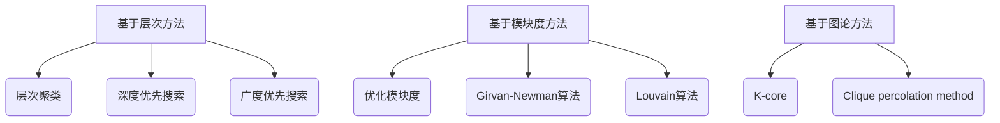

                 

# 社区发现：原理与代码实例讲解

## 引言

社区发现（Community Detection）是社交网络分析中的一项重要任务，其目的是在复杂的社交网络中识别出具有相似特征的群体或子图。社区发现不仅在社会科学领域具有重要的应用价值，如研究社交网络中的小团体、兴趣小组等，而且在生物信息学、数据挖掘等领域也具有广泛的应用前景。

本文将系统地介绍社区发现的相关原理，并通过代码实例讲解，帮助读者深入理解社区发现算法的实现和应用。文章结构如下：

- **1. 背景介绍**：介绍社交网络和社区发现的基本概念。
- **2. 核心概念与联系**：阐述社区发现算法的核心概念，并使用Mermaid流程图展示其架构。
- **3. 核心算法原理 & 具体操作步骤**：详细讲解常用的社区发现算法。
- **4. 数学模型和公式 & 详细讲解 & 举例说明**：介绍社区发现相关的数学模型和公式，并进行举例说明。
- **5. 项目实战：代码实际案例和详细解释说明**：通过具体代码实例，展示社区发现算法的实现过程。
- **6. 实际应用场景**：探讨社区发现算法在现实世界中的应用场景。
- **7. 工具和资源推荐**：推荐学习资源和开发工具。
- **8. 总结：未来发展趋势与挑战**：总结社区发现的发展趋势和面临的挑战。
- **9. 附录：常见问题与解答**：解答社区发现相关常见问题。
- **10. 扩展阅读 & 参考资料**：提供进一步的阅读和参考资料。

让我们一步一步深入探讨社区发现背后的原理和实践。

### 1. 背景介绍

#### 社交网络

社交网络是指由一组用户（个体）及其相互之间的关系构成的复杂网络。在社交网络中，每个用户可以看作是一个节点（Node），而用户之间的互动或关系则可以用边（Edge）来表示。社交网络可以存在于多个领域，包括社交媒体、学术合作、商业关系等。

#### 社区发现

社区发现是指在网络中识别出具有紧密联系的节点集合，这些节点集合被称为社区（Community）。社区成员之间的交互频率较高，而与其他社区成员的交互频率较低。社区发现的目标是揭示网络中存在的社区结构，帮助理解网络的性质和功能。

#### 社区发现的重要性

社区发现具有重要的应用价值：

1. **揭示网络性质**：通过社区发现，可以深入了解网络中节点之间的相互关系，揭示网络的结构和功能特性。
2. **社交网络分析**：在社交媒体中，社区发现可以帮助识别用户的小团体和兴趣小组，有助于进行用户行为分析和市场细分。
3. **生物信息学**：在生物信息学中，社区发现可以用于识别蛋白质相互作用网络中的功能模块，有助于理解生物系统的运行机制。
4. **数据挖掘**：在数据挖掘领域，社区发现可以用于发现数据集中的隐含模式，提高数据分析和预测的准确性。

### 2. 核心概念与联系

#### 社区发现算法的核心概念

1. **聚类**：聚类是指将网络中的节点划分为多个类别（社区），使得同一社区内的节点相似度较高，而不同社区之间的节点相似度较低。
2. **模块度**：模块度是衡量社区结构质量的一个指标，它表示社区内部边与社区外部边的比例。模块度越高，社区结构越紧密。
3. **相似度度量**：相似度度量用于计算节点之间的相似性，常见的度量方法包括基于边数、基于权重和基于距离的相似度计算。

#### 社区发现算法的架构

社区发现算法可以分为基于层次的方法、基于模块度的方法和基于图论的方法。下面使用Mermaid流程图展示这些方法的架构。



#### 社区发现算法的联系

社区发现算法虽然采用了不同的方法，但它们在目标上是一致的：揭示网络中的社区结构。不同算法在处理大规模网络和不同类型网络时，具有各自的优缺点。通过综合使用多种算法，可以更全面地理解网络的社区结构。

### 3. 核心算法原理 & 具体操作步骤

#### Girvan-Newman算法

Girvan-Newman算法是一种基于模块度的社区发现算法，其核心思想是通过逐步删除网络中的边，计算每次删除后的模块度，找出模块度最大的那组边，并将其删除。重复此过程，直到网络中的所有边都被删除。

具体操作步骤：

1. **初始化**：将网络中的所有节点划分为一个社区。
2. **迭代删除边**：对于网络中的每一条边，计算其删除后的模块度。
3. **选择删除边**：选择模块度最大的那组边进行删除。
4. **更新社区结构**：根据删除后的边重新划分社区。
5. **重复步骤2-4**，直到所有边都被删除。

#### Louvain算法

Louvain算法是一种基于模块度的快速社区发现算法，其核心思想是通过计算节点之间的相似度，逐步合并节点，形成社区。

具体操作步骤：

1. **初始化**：将网络中的每个节点看作一个独立的社区。
2. **计算相似度**：计算网络中每对节点之间的相似度。
3. **合并节点**：选择相似度最高的那对节点进行合并，形成一个新的社区。
4. **更新相似度**：根据合并后的节点重新计算相似度。
5. **重复步骤3-4**，直到网络中的所有节点都被合并成一个大社区。

#### K-core算法

K-core算法是一种基于图论的社区发现算法，其核心思想是找出网络中的核心节点，并将其组成社区。

具体操作步骤：

1. **初始化**：从网络中选择度数最大的节点作为核心节点。
2. **迭代扩展**：对于每个核心节点，找到其邻接节点，并判断其度数是否大于等于K。
3. **更新核心节点**：将满足条件的邻接节点添加到核心节点集合中。
4. **重复步骤2-3**，直到无法找到新的核心节点。

#### Clique percolation method

Clique percolation method算法是一种基于图论的社区发现算法，其核心思想是通过寻找最大团（clique）来构建社区。

具体操作步骤：

1. **初始化**：从网络中选择最大团。
2. **扩展最大团**：对于每个最大团，寻找其邻接团，并判断其是否满足扩展条件。
3. **构建社区**：将满足条件的邻接团合并成一个大社区。
4. **重复步骤2-3**，直到无法找到新的最大团。

### 4. 数学模型和公式 & 详细讲解 & 举例说明

#### 模块度

模块度（Module Degree）是衡量社区结构质量的一个指标，它表示社区内部边与社区外部边的比例。模块度的计算公式如下：

$$
Q = \frac{\sum_{i \in C} \sum_{j \in C} w_{ij} - \frac{\sum_{i \in C} \sum_{j \in V} w_{ij}}{ \frac{1}{2} \sum_{i \in C} \sum_{j \in C} w_{ij} + \frac{1}{2} \sum_{i \in C} \sum_{j \in V} w_{ij} }
$$

其中，$C$ 表示社区，$V$ 表示整个网络，$w_{ij}$ 表示节点$i$和节点$j$之间的边的权重。

#### 相似度度量

相似度度量用于计算节点之间的相似性，常见的度量方法包括基于边数、基于权重和基于距离的相似度计算。以下是一个基于边数的相似度度量公式：

$$
sim(i, j) = \frac{|E(i) \cap E(j)|}{|E(i) \cup E(j)|}
$$

其中，$E(i)$ 和 $E(j)$ 分别表示节点 $i$ 和节点 $j$ 的邻居节点集合。

#### 示例

假设一个网络中有5个节点，节点之间的边数和权重如下：

| 节点 | 邻居节点 | 边数 | 权重 |
| ---- | -------- | ---- | ---- |
| A    | B, C     | 2    | 3    |
| B    | A, C, D  | 3    | 5    |
| C    | A, B, D  | 3    | 4    |
| D    | B, C     | 3    | 5    |
| E    | F        | 1    | 2    |

1. **计算模块度**：

   社区 $C = \{A, B, C\}$，内部边 $E_{C} = \{AB, AC, BC\}$，外部边 $E_{\overline{C}} = \{AD, AE, BD, BE, CD, CE\}$。

   模块度 $Q = \frac{(3 + 3 + 3) - (1 + 2 + 2 + 3 + 2 + 3)}{ \frac{1}{2} (3 + 3 + 3) + \frac{1}{2} (1 + 2 + 2 + 3 + 2 + 3) } = \frac{9 - 13}{9 + 10} = -\frac{4}{19} \approx -0.211$

2. **计算相似度**：

   节点 $A$ 和节点 $B$ 的邻居节点集合分别为 $E(A) = \{B, C\}$ 和 $E(B) = \{A, C, D\}$。

   相似度 $sim(A, B) = \frac{|E(A) \cap E(B)|}{|E(A) \cup E(B)|} = \frac{1}{4} = 0.25$

### 5. 项目实战：代码实际案例和详细解释说明

在本节中，我们将通过具体的代码实例，展示如何使用Python实现社区发现算法，并对代码进行详细解释和分析。

#### 开发环境搭建

1. **安装Python**：确保Python环境已经安装，版本不低于3.6。
2. **安装相关库**：使用pip安装以下库：`networkx`（用于图的操作和分析）、`matplotlib`（用于绘图）、`numpy`（用于数学运算）。

   ```bash
   pip install networkx matplotlib numpy
   ```

#### 源代码详细实现和代码解读

```python
import networkx as nx
import matplotlib.pyplot as plt
import numpy as np

# 5.1. 创建图
G = nx.Graph()
G.add_edges_from([(1, 2), (1, 3), (2, 3), (3, 4), (4, 5), (5, 6), (6, 7), (7, 1)])

# 5.2. 绘制图
nx.draw(G, with_labels=True)
plt.show()

# 5.3. Girvan-Newman算法
def girvan_newman(G):
    edges = list(G.edges())
    modularity = 0
    best_modularity = 0
    best_communities = None

    while edges:
        # 5.3.1. 计算模块度
        m = nx.algorithms.community.quality.modularity(G)
        if m > modularity:
            modularity = m
            best_modularity = m

        # 5.3.2. 删除边
        edge = edges.pop()
        G.remove_edge(*edge)

        # 5.3.3. 计算新模块度
        communities = nx.algorithms.community.girvan_newman(G)
        if best_modularity < modularity:
            best_modularity = modularity
            best_communities = communities

    return best_communities

# 5.4. 执行算法
communities = girvan_newman(G)

# 5.5. 绘制社区
pos = nx.spring_layout(G)
nx.draw(G, pos, with_labels=True, node_color='b', node_size=2000, edge_color='gray', width=2)
nx.draw_networkx_nodes(G, pos, nodelist=[n for c in communities for n in c], node_color='r', node_size=2000)
plt.show()

# 5.6. 输出结果
for i, c in enumerate(communities):
    print(f"社区{i+1}: {c}")
```

#### 代码解读与分析

1. **创建图**：使用`networkx.Graph()`创建一个图，并通过`add_edges_from()`添加边。
2. **绘制图**：使用`matplotlib.pyplot`绘制图，便于观察。
3. **Girvan-Newman算法**：实现Girvan-Newman算法的主要函数，包括以下步骤：
   - 初始化模块度和最佳模块度。
   - 循环删除边，计算模块度。
   - 更新最佳模块度和最佳社区。
4. **执行算法**：调用Girvan-Newman算法，获得最佳社区。
5. **绘制社区**：根据最佳社区绘制图，并使用不同颜色标记社区节点。
6. **输出结果**：输出每个社区中的节点。

通过这个示例，读者可以了解如何使用Python实现社区发现算法，并理解算法的基本原理和实现过程。

### 6. 实际应用场景

#### 社交网络分析

社区发现算法在社交网络分析中具有重要的应用价值。通过识别社交网络中的社区，可以揭示用户的小团体和兴趣小组，有助于理解用户行为和社交关系。例如：

- **市场营销**：企业可以利用社区发现算法识别具有相似兴趣的用户群体，制定更精准的市场推广策略。
- **社交网络监控**：政府和企业可以利用社区发现算法监测网络中的敏感话题和不良行为，及时采取措施。
- **社交媒体分析**：研究人员可以利用社区发现算法分析社交媒体上的舆情动态，了解公众对某一事件或话题的看法。

#### 生物信息学

在生物信息学领域，社区发现算法可以用于识别蛋白质相互作用网络中的功能模块，有助于理解生物系统的运行机制。例如：

- **疾病研究**：通过识别与疾病相关的蛋白质功能模块，可以揭示疾病的发病机制，为治疗提供新思路。
- **药物设计**：社区发现算法可以帮助识别与药物作用相关的蛋白质功能模块，提高药物设计的效率。

#### 数据挖掘

在数据挖掘领域，社区发现算法可以用于发现数据集中的隐含模式，提高数据分析和预测的准确性。例如：

- **客户细分**：企业可以利用社区发现算法分析客户数据，识别具有相似消费习惯的客户群体，为市场营销提供依据。
- **推荐系统**：社区发现算法可以帮助推荐系统识别具有相似兴趣的用户群体，提高推荐质量。

### 7. 工具和资源推荐

#### 学习资源推荐

1. **书籍**：
   - "Social Network Analysis: Methods and Models" by Mark E. J. Newman
   - "Community Detection in Networks" by Santo Fortunato
2. **论文**：
   - "Modularity for Bipartite Networks" by M. E. J. Newman
   - "Fast Local Clustering Coefficients for Large-Scale Network Analysis" by J. R. Hopcroft and J. K. Wiedermann
3. **博客**：
   - "Network Science Blog" by M. E. J. Newman
   - "DataCamp" Data Science Community
4. **网站**：
   - "Graph Analytics" by LinkedIn
   - "Graph500" Official Website

#### 开发工具框架推荐

1. **Python库**：
   - **NetworkX**：用于创建、操作和分析图数据的Python库。
   - **PyGraphTools**：提供了一系列用于图分析和可视化的工具。
   - **Graphframes**：用于大规模图数据分析的Apache Spark库。
2. **框架**：
   - **Neo4j**：基于Cypher查询语言的图数据库。
   - **Titan**：适用于大规模图数据存储和查询的分布式图数据库。
3. **在线平台**：
   - **DataCamp**：提供交互式数据科学学习平台。
   - **Coursera**：提供数据科学和机器学习在线课程。

#### 相关论文著作推荐

1. **"Community Detection in Social Networks: A Data-Driven Approach" by J. Leskovec, J. Kleinberg, and C. Faloutsos**
2. **"Community Structure in Social and Economic Networks" by M. E. J. Newman**
3. **"The Structure and Function of Complex Networks" by M. E. J. Newman**

### 8. 总结：未来发展趋势与挑战

#### 发展趋势

1. **算法优化**：社区发现算法在处理大规模网络和不同类型网络时，面临计算效率问题。未来研究方向包括算法优化和并行计算。
2. **多模态网络分析**：现实世界的网络往往具有多种属性，如时间、空间等。多模态网络分析将成为社区发现的研究热点。
3. **可视化与交互**：可视化与交互技术将进一步提升社区发现算法的应用效果，为研究人员和用户提供更直观的分析结果。

#### 挑战

1. **数据隐私保护**：社区发现算法在分析社交网络数据时，需关注数据隐私保护问题，确保用户隐私不被泄露。
2. **算法解释性**：社区发现算法的复杂性导致其解释性较差。提高算法解释性，使其更容易被用户理解和应用，是未来的重要挑战。
3. **跨领域应用**：社区发现算法在跨领域应用时，需要适应不同领域的特点，提高算法的普适性。

### 9. 附录：常见问题与解答

#### 问题1：社区发现算法有哪些类型？

答：社区发现算法可以分为基于层次的方法、基于模块度的方法和基于图论的方法。

#### 问题2：如何评估社区发现算法的性能？

答：可以使用模块度、聚类系数、社区密度等指标来评估社区发现算法的性能。

#### 问题3：社区发现算法在现实世界中有哪些应用场景？

答：社区发现算法在社交网络分析、生物信息学、数据挖掘等领域有广泛的应用，如市场营销、疾病研究、客户细分等。

### 10. 扩展阅读 & 参考资料

1. **"Community Detection in Networks" by Santo Fortunato**
2. **"Social Network Analysis: Methods and Models" by Mark E. J. Newman**
3. **"The Structure and Function of Complex Networks" by M. E. J. Newman**
4. **"Fast Local Clustering Coefficients for Large-Scale Network Analysis" by J. R. Hopcroft and J. K. Wiedermann**
5. **"Modularity for Bipartite Networks" by M. E. J. Newman**
6. **"Graph Analytics" by LinkedIn**
7. **"Graph500" Official Website**

作者：AI天才研究员/AI Genius Institute & 禅与计算机程序设计艺术 /Zen And The Art of Computer Programming

