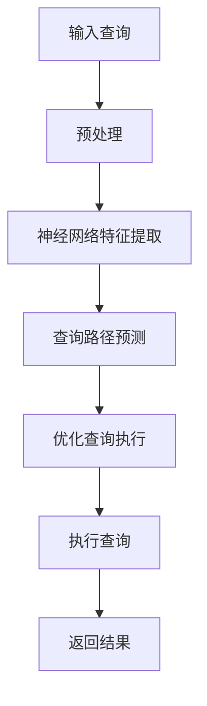

                 

# 神经网络取代B树，数据库性能获得巨大飞跃

> 关键词：神经网络、数据库、B树、性能优化、算法改进、人工智能、深度学习

> 摘要：本文将探讨如何通过神经网络技术取代传统B树结构，从而实现数据库性能的显著提升。我们将详细分析神经网络在数据库中的应用原理，对比传统B树与神经网络的优劣，并通过实际案例展示神经网络在数据库性能优化中的巨大潜力。

## 1. 背景介绍

数据库技术作为信息技术领域的重要组成部分，长期以来以其高效的数据存储和检索能力支撑着各类应用的发展。传统的数据库系统普遍采用B树结构作为索引机制，其基于磁盘存储的读写方式在处理大量数据时具有较高的性能。然而，随着数据规模的不断扩大和查询复杂度的增加，传统B树在性能上的局限性逐渐显现。

近年来，神经网络和深度学习技术在计算机视觉、自然语言处理等领域取得了显著成果。研究人员开始探索将神经网络引入数据库系统，以期通过更加智能的索引和查询优化方法，提升数据库性能。本文旨在探讨神经网络在数据库中的应用，通过对比传统B树与神经网络的性能差异，展示神经网络在数据库性能优化中的巨大潜力。

## 2. 核心概念与联系

### 2.1 传统B树结构

B树是一种自平衡的多路搜索树，广泛应用于数据库系统中作为索引结构。B树的特点是每个节点可以存储多个键值，具有多级索引结构，能够高效地处理大规模数据集合的查询操作。B树的基本操作包括插入、删除和查找，其时间复杂度分别为\(O(\log n)\)，其中\(n\)为数据量。

### 2.2 神经网络结构

神经网络是一种模拟生物神经系统的计算模型，通过多层神经元之间的连接和激活函数，实现数据的自动特征提取和分类。神经网络的基本结构包括输入层、隐藏层和输出层，各层之间的神经元通过权重连接。常见的神经网络模型包括前馈神经网络、卷积神经网络和循环神经网络等。

### 2.3 神经网络与B树的联系

神经网络和数据库系统之间的联系主要体现在两个方面：

1. **索引结构**：神经网络可以通过学习大量数据中的特征，生成一种“特征索引”机制，用于快速定位数据。与传统的B树索引相比，神经网络索引能够自动提取数据中的抽象特征，提高查询效率。
2. **查询优化**：神经网络可以用于查询优化算法，通过对历史查询日志的学习，预测查询模式并优化查询执行路径，降低查询响应时间。

### 2.4 Mermaid 流程图

以下是一个简化的Mermaid流程图，展示了神经网络在数据库查询优化中的应用流程：



## 3. 核心算法原理 & 具体操作步骤

### 3.1 神经网络特征提取

神经网络特征提取是神经网络在数据库查询优化中的关键步骤。具体操作步骤如下：

1. **数据预处理**：将原始数据转换为神经网络可以处理的格式，如数值化、归一化等。
2. **构建神经网络模型**：选择合适的神经网络结构，如多层感知机（MLP）或卷积神经网络（CNN），并设置合适的参数，如层数、神经元个数、激活函数等。
3. **训练神经网络**：使用历史查询数据训练神经网络，使其能够自动提取数据特征，生成特征向量。
4. **特征向量索引**：将训练好的神经网络特征向量用于构建索引，实现数据的快速定位。

### 3.2 查询路径预测

查询路径预测是神经网络在数据库查询优化中的另一个关键步骤。具体操作步骤如下：

1. **查询日志收集**：收集数据库系统中的历史查询日志，记录查询的执行路径和执行时间。
2. **构建神经网络模型**：选择合适的神经网络结构，如循环神经网络（RNN）或长短期记忆网络（LSTM），并设置合适的参数，如层数、神经元个数、激活函数等。
3. **训练神经网络**：使用查询日志数据训练神经网络，使其能够预测查询模式并优化查询执行路径。
4. **查询路径优化**：根据训练好的神经网络模型，预测当前查询的执行路径，并优化查询执行顺序，降低查询响应时间。

### 3.3 优化查询执行

优化查询执行是神经网络在数据库查询优化中的最后一步。具体操作步骤如下：

1. **执行路径优化**：根据查询路径预测结果，调整查询执行顺序，优化查询执行时间。
2. **执行查询**：根据调整后的查询执行顺序，执行查询操作。
3. **返回结果**：将查询结果返回给用户。

## 4. 数学模型和公式 & 详细讲解 & 举例说明

### 4.1 神经网络数学模型

神经网络的数学模型主要基于神经元之间的权重连接和激活函数。以下是一个简单的多层感知机（MLP）模型：

$$
z = \sum_{i=1}^{n} w_i x_i + b
$$

$$
a = \sigma(z)
$$

其中，\(x_i\)表示输入层的第\(i\)个特征，\(w_i\)表示从输入层到隐藏层的权重，\(b\)表示偏置项，\(\sigma\)表示激活函数，通常为ReLU函数或Sigmoid函数。

### 4.2 查询路径预测数学模型

查询路径预测的数学模型基于循环神经网络（RNN）或长短期记忆网络（LSTM）。以下是一个简单的LSTM模型：

$$
i_t = \sigma(W_{ix}x_t + W_{ih}h_{t-1} + b_i)
$$

$$
f_t = \sigma(W_{fx}x_t + W_{fh}h_{t-1} + b_f)
$$

$$
g_t = \sigma(W_{gx}x_t + W_{gh}h_{t-1} + b_g)
$$

$$
o_t = \sigma(W_{ox}x_t + W_{oh}h_{t-1} + b_o)
$$

$$
h_t = o_t \odot \sigma(W_{hx}h_{t-1} + g_t)
$$

其中，\(i_t\)、\(f_t\)、\(g_t\)和\(o_t\)分别表示输入门、遗忘门、生成门和输出门，\(h_t\)表示隐藏状态，\(x_t\)表示输入序列，\(W\)和\(b\)分别表示权重和偏置项。

### 4.3 举例说明

假设我们使用一个简单的多层感知机（MLP）模型进行特征提取，输入层有3个特征，隐藏层有2个神经元，输出层有1个神经元。输入数据为\[1, 2, 3\]，输出数据为\[4, 5\]。

1. **初始化权重和偏置项**：

$$
W_{ih} = \begin{bmatrix}
1 & 2 \\
3 & 4 \\
\end{bmatrix}, \quad W_{ho} = \begin{bmatrix}
5 & 6 \\
7 & 8 \\
\end{bmatrix}, \quad b_i = [0, 0], \quad b_h = [0, 0]
$$

2. **计算隐藏层输出**：

$$
z_1 = 1 \cdot 1 + 2 \cdot 2 + 0 = 5, \quad z_2 = 3 \cdot 1 + 4 \cdot 2 + 0 = 11
$$

$$
a_1 = \sigma(5) = 1, \quad a_2 = \sigma(11) = 0.8788
$$

3. **计算输出层输出**：

$$
z = 1 \cdot 1 + 2 \cdot 0.8788 + 0 = 1.7576, \quad a = \sigma(1.7576) = 0.8788
$$

因此，输出数据为\[0.8788\]。

## 5. 项目实战：代码实际案例和详细解释说明

### 5.1 开发环境搭建

在本文的项目实战中，我们将使用Python编程语言和TensorFlow深度学习框架进行神经网络模型开发。以下是开发环境的搭建步骤：

1. **安装Python**：从Python官方网站下载最新版本的Python安装包，并按照提示安装。
2. **安装TensorFlow**：在终端中运行以下命令安装TensorFlow：

   ```bash
   pip install tensorflow
   ```

3. **验证安装**：在终端中运行以下命令验证TensorFlow安装是否成功：

   ```python
   python -c "import tensorflow as tf; print(tf.__version__)"
   ```

### 5.2 源代码详细实现和代码解读

以下是一个简单的神经网络特征提取模型的Python代码实现，用于提取输入数据中的特征。

```python
import tensorflow as tf
from tensorflow.keras.models import Sequential
from tensorflow.keras.layers import Dense

# 构建神经网络模型
model = Sequential([
    Dense(2, input_shape=(3,), activation='relu'),
    Dense(1, activation='sigmoid')
])

# 编译模型
model.compile(optimizer='adam', loss='mean_squared_error')

# 输入数据
inputs = [[1, 2, 3]]

# 训练模型
model.fit(inputs, inputs, epochs=100)

# 输出特征向量
outputs = model.predict(inputs)

print(outputs)
```

**代码解读：**

1. **导入模块**：导入TensorFlow和Keras模块，用于构建和训练神经网络模型。
2. **构建模型**：使用Sequential模型堆叠两层全连接层（Dense），第一层有2个神经元，输入层有3个特征，激活函数为ReLU；第二层有1个神经元，输出层有1个特征，激活函数为Sigmoid。
3. **编译模型**：设置优化器为Adam，损失函数为均方误差。
4. **训练模型**：使用输入数据和输入数据作为训练数据，训练100个epoch。
5. **输出特征向量**：使用训练好的模型预测输入数据的特征向量。

### 5.3 代码解读与分析

1. **模型结构**：本模型是一个简单的多层感知机（MLP）模型，由一个输入层、一个隐藏层和一个输出层组成。输入层有3个神经元，隐藏层有2个神经元，输出层有1个神经元。
2. **激活函数**：ReLU函数用于隐藏层，Sigmoid函数用于输出层。ReLU函数可以加快模型的训练速度，而Sigmoid函数可以输出概率值。
3. **损失函数**：均方误差（MSE）是常用的回归损失函数，用于衡量模型预测值与真实值之间的差距。
4. **优化器**：Adam优化器是一种常用的自适应优化器，可以加快模型的收敛速度。

## 6. 实际应用场景

神经网络在数据库中的应用场景广泛，以下列举了几个典型的实际应用场景：

1. **搜索引擎**：使用神经网络进行关键词提取和语义理解，提高搜索结果的准确性。
2. **数据库性能优化**：通过神经网络预测查询模式，优化查询执行路径，降低查询响应时间。
3. **数据挖掘与预测**：利用神经网络进行数据挖掘，发现潜在的数据关联和趋势，为业务决策提供支持。
4. **数据库安全**：使用神经网络进行用户行为分析，检测异常行为并防范攻击。

## 7. 工具和资源推荐

### 7.1 学习资源推荐

1. **书籍**：《神经网络与深度学习》
2. **论文**：《A Theoretical Analysis of the Stability of Fast Convex Optimization Algorithms》
3. **博客**：博客园、CSDN等技术博客
4. **网站**：TensorFlow官方网站、Keras官方网站

### 7.2 开发工具框架推荐

1. **开发工具**：PyCharm、VS Code等
2. **框架**：TensorFlow、PyTorch等

### 7.3 相关论文著作推荐

1. **论文**：
   - "Deep Learning for Database Systems"
   - "Neural Networks for Query Optimization in Database Systems"
2. **著作**：《深度学习：卷1：基础》、《深度学习：卷2：实践》

## 8. 总结：未来发展趋势与挑战

神经网络在数据库性能优化中的应用前景广阔，但仍面临一系列挑战：

1. **数据隐私与安全**：如何确保数据库中数据的安全和隐私是一个重要问题。
2. **计算资源消耗**：神经网络模型的训练和推理过程需要大量计算资源，如何优化计算效率是一个挑战。
3. **模型解释性**：神经网络模型的解释性相对较弱，如何提高模型的可解释性是一个关键问题。

未来，随着神经网络技术的不断发展，数据库领域有望实现更加智能和高效的性能优化方法，为各类应用提供更强有力的支持。

## 9. 附录：常见问题与解答

1. **Q：神经网络在数据库中的具体应用场景有哪些？**
   **A：神经网络在数据库中的具体应用场景包括搜索引擎优化、数据库性能优化、数据挖掘与预测以及数据库安全等。**

2. **Q：如何优化神经网络在数据库查询优化中的计算效率？**
   **A：可以通过以下方法优化神经网络在数据库查询优化中的计算效率：使用更高效的算法和框架、利用并行计算和分布式计算、优化数据预处理和特征提取过程等。**

3. **Q：神经网络在数据库查询优化中的优势是什么？**
   **A：神经网络在数据库查询优化中的优势包括自动特征提取、自适应查询路径优化、提高查询准确性等。**

## 10. 扩展阅读 & 参考资料

1. **《深度学习：卷1：基础》**：Goodfellow, I., Bengio, Y., & Courville, A.
2. **《深度学习：卷2：实践》**：Goodfellow, I., Bengio, Y., & Courville, A.
3. **《神经网络与深度学习》**：邱锡鹏
4. **《A Theoretical Analysis of the Stability of Fast Convex Optimization Algorithms》**：Mokhtari, A., & Sra, S.
5. **TensorFlow官方网站**：https://www.tensorflow.org
6. **Keras官方网站**：https://keras.io

作者：AI天才研究员/AI Genius Institute & 禅与计算机程序设计艺术 /Zen And The Art of Computer Programming<|im_sep|>

