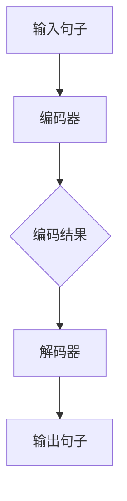
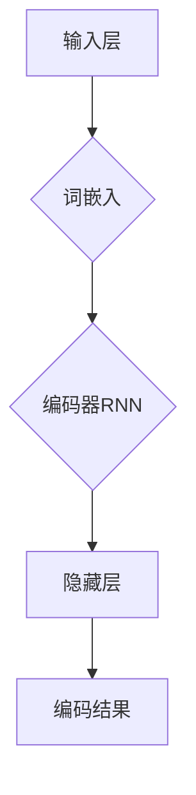
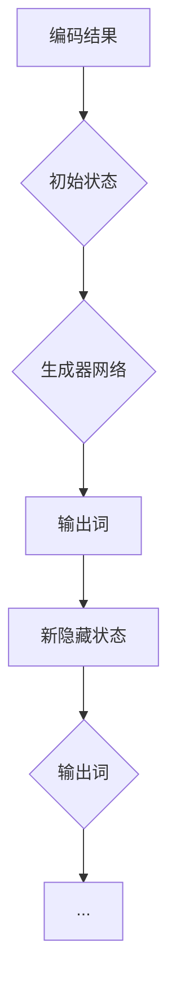
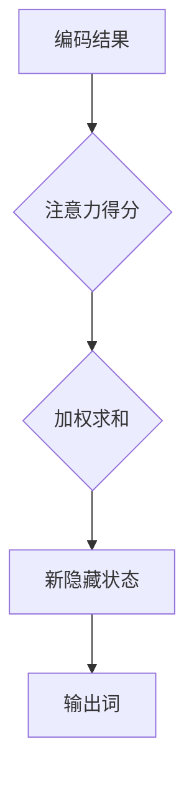

                 

### 背景介绍

随着全球化的不断深入，跨语言交流的重要性日益凸显。多语言实时翻译作为解决这一需求的关键技术，正逐渐成为各行业的重要应用场景。在过去的几十年中，计算机科学和人工智能领域的快速发展为多语言实时翻译技术的进步提供了坚实的理论基础和强大的计算能力。如今，神经网络作为人工智能的核心技术之一，在多语言实时翻译中的应用已经取得了显著的成果。

本文旨在探讨神经网络在多语言实时翻译中的应用，首先介绍多语言实时翻译的背景和需求，然后深入分析神经网络的基本原理及其在多语言实时翻译中的应用，最后探讨未来发展趋势与挑战。通过本文的阅读，读者将能够全面了解多语言实时翻译的现状以及神经网络技术在这一领域的重要应用。

在全球化进程中，不同国家和地区的交流愈发频繁，跨语言沟通的需求也随之增加。然而，传统的翻译方法往往存在效率低、准确性差等问题，难以满足实时交流的需求。为此，多语言实时翻译技术应运而生，旨在实现不同语言之间的快速、准确转换。这种技术的出现不仅大大提高了跨语言沟通的效率，也为各行业的国际化发展提供了有力支持。

近年来，随着神经网络技术的不断发展，其在多语言实时翻译中的应用取得了显著成果。神经网络通过模拟人脑神经元的工作方式，能够自动学习和提取语言特征，从而实现高效、准确的语言翻译。这使得多语言实时翻译技术逐渐从理论研究走向实际应用，为跨语言沟通和全球化发展带来了新的机遇。

本文将首先介绍多语言实时翻译的背景和需求，然后深入分析神经网络的基本原理及其在多语言实时翻译中的应用，最后探讨未来发展趋势与挑战。通过本文的阅读，读者将能够全面了解多语言实时翻译的现状以及神经网络技术在这一领域的重要应用。接下来，我们将进入下一部分，对神经网络的基本原理进行详细介绍。 <sop><|user|>

### 核心概念与联系

在探讨神经网络在多语言实时翻译中的应用之前，我们需要了解一些核心概念和原理。这些概念包括神经网络的基本结构、工作原理以及它们在多语言翻译中的具体应用。

#### 1. 神经网络的基本结构

神经网络（Neural Networks）是一种模仿生物神经系统工作的计算模型，由大量的神经元（或节点）组成。每个神经元都与其它神经元相连，形成复杂的网络结构。这些神经元之间通过加权连接进行信息传递，从而实现数据的处理和输出。

一个简单的神经网络通常包括以下几个主要组成部分：

- **输入层（Input Layer）**：接收外部输入信息，每个输入节点对应一个特征。
- **隐藏层（Hidden Layers）**：对输入信息进行处理和转换，每个隐藏层包含多个神经元，可以有一个或多个隐藏层。
- **输出层（Output Layer）**：生成最终的输出结果，输出层的神经元数量和类型取决于任务的具体需求。


#### 2. 神经网络的工作原理

神经网络的工作原理是通过逐层对输入数据进行处理，从而提取出有用的特征信息。这个过程包括以下几个关键步骤：

- **权重（Weights）和偏置（Bias）的初始化**：神经网络在开始训练之前，需要随机初始化每个神经元的权重和偏置。
- **前向传播（Forward Propagation）**：输入数据从输入层开始，通过加权连接传递到隐藏层和输出层，每层神经元对数据进行处理和变换，最终生成输出结果。
- **反向传播（Backpropagation）**：将输出结果与真实标签进行比较，计算损失函数（Loss Function），然后通过反向传播算法调整网络中的权重和偏置，以减少损失函数的值。

#### 3. 神经网络在多语言实时翻译中的具体应用

多语言实时翻译的任务可以看作是一个序列到序列（Sequence to Sequence，简称Seq2Seq）的转换问题。神经网络通过学习输入语言和输出语言之间的映射关系，实现不同语言之间的实时翻译。

以下是一个简化的神经网络在多语言实时翻译中的应用流程：

- **编码器（Encoder）**：将输入句子编码为一个固定长度的向量，表示句子的整体含义。
- **解码器（Decoder）**：将编码器输出的向量解码为输出语言的句子。
- **注意力机制（Attention Mechanism）**：在编码器和解码器之间引入注意力机制，使得解码器能够关注编码器对输入句子的不同部分的处理结果，从而提高翻译的准确性。


下面，我们将使用 Mermaid 流程图（不含特殊字符）来展示神经网络在多语言实时翻译中的基本架构：



通过以上对神经网络核心概念和原理的介绍，我们可以更好地理解神经网络在多语言实时翻译中的应用。接下来，我们将深入探讨神经网络在多语言实时翻译中的具体算法原理和操作步骤。 <sop><|user|>

### 核心算法原理 & 具体操作步骤

在了解了神经网络的基本结构和工作原理之后，我们接下来将深入探讨神经网络在多语言实时翻译中的核心算法原理，并详细说明具体的操作步骤。

#### 1. 编码器（Encoder）的工作原理

编码器的主要任务是接收输入句子，将其编码为一个固定长度的向量，这个向量可以表示输入句子的整体含义。在多语言实时翻译中，编码器需要处理两种不同语言的输入句子。具体步骤如下：

- **词嵌入（Word Embedding）**：将输入句子中的每个单词映射为一个固定大小的向量表示。词嵌入通常使用预训练的词向量模型，如Word2Vec、GloVe等。
- **序列编码（Sequence Encoding）**：将词嵌入向量序列通过编码器网络进行处理，编码器网络通常是一个循环神经网络（RNN）或其变体，如长短期记忆网络（LSTM）或门控循环单元（GRU）。这些网络能够捕捉句子中的长期依赖关系。

具体操作步骤如下：

1. 输入句子经过词嵌入层，每个单词被映射为一个词向量。
2. 词向量序列输入到编码器网络，经过RNN处理，产生一个固定长度的隐藏状态向量。
3. 这个隐藏状态向量表示输入句子的整体含义，可以看作是编码器的输出。

以下是一个简化的编码器网络结构：



#### 2. 解码器（Decoder）的工作原理

解码器的任务是接受编码器输出的向量，并将其解码为目标语言的句子。解码器需要生成一个词序列，这个序列表示翻译结果。具体步骤如下：

- **初始状态（Initial State）**：解码器的初始状态通常由编码器的隐藏状态向量提供。
- **词生成（Word Generation）**：解码器通过生成器网络逐词生成输出句子。生成器网络通常是一个序列到序列（Seq2Seq）的模型，如长短期记忆网络（LSTM）或Transformer。
- **注意力机制（Attention Mechanism）**：在解码过程中，引入注意力机制，使得解码器能够关注编码器对输入句子的不同部分的处理结果，从而提高翻译的准确性。

具体操作步骤如下：

1. 解码器的初始状态由编码器的隐藏状态向量提供。
2. 解码器通过生成器网络生成第一个输出词。
3. 每个生成的词都会与编码器的隐藏状态向量进行加权求和，形成新的隐藏状态向量。
4. 解码器重复上述步骤，生成整个输出句子。

以下是一个简化的解码器网络结构：



#### 3. 注意力机制的引入

注意力机制（Attention Mechanism）是神经网络在多语言实时翻译中的一个关键技术，它允许解码器在生成每个词时，动态关注编码器处理输入句子时的不同部分。注意力机制可以通过多种方式实现，如加性注意力（Additive Attention）、点积注意力（Dot-Product Attention）等。

具体步骤如下：

1. **计算注意力得分**：解码器为编码器的每个隐藏状态计算一个注意力得分，这个得分表示解码器对编码器处理结果的关注程度。
2. **加权求和**：将注意力得分与编码器的隐藏状态向量进行加权求和，形成新的隐藏状态向量，这个向量为当前解码步骤提供上下文信息。
3. **生成输出词**：使用新的隐藏状态向量生成当前输出词。

以下是一个简化的注意力机制流程：



通过以上对编码器、解码器和注意力机制的具体描述，我们可以看到神经网络在多语言实时翻译中的核心算法原理和操作步骤。这些原理和步骤为多语言实时翻译提供了强大的技术支持，使得神经网络能够实现高效、准确的语言翻译。接下来，我们将进一步探讨神经网络在多语言实时翻译中的数学模型和公式。 <sop><|user|>

### 数学模型和公式 & 详细讲解 & 举例说明

在多语言实时翻译中，神经网络的核心算法涉及多个数学模型和公式，这些模型和公式定义了神经网络的结构和操作方式。以下是对这些数学模型和公式的详细讲解，并通过具体例子来说明它们的应用。

#### 1. 编码器中的数学模型

编码器的主要任务是接收输入句子，并将其编码为一个固定长度的向量。这个过程中，涉及到以下几个关键数学模型和公式：

- **词嵌入（Word Embedding）**：词嵌入是将单词映射为向量表示的过程。常见的词嵌入模型有Word2Vec和GloVe。

  - Word2Vec模型中使用了一个简单的神经网络，输入是单词的字符序列，输出是单词的向量表示。公式如下：

    $$ \text{word\_embedding}(w) = \sigma(W \cdot \text{one-hot}(w)) $$
    
    其中，$ \text{one-hot}(w) $是将单词w转换为二进制编码向量，$ W $是神经网络权重矩阵，$ \sigma $是sigmoid激活函数。

  - GloVe模型则基于词频统计信息，通过优化一个损失函数来学习词向量。公式如下：

    $$ \text{word\_embedding}(w) = \frac{v_w}{\sqrt{f_w}} $$
    
    其中，$ v_w $是单词w的向量表示，$ f_w $是单词w的词频。

- **序列编码（Sequence Encoding）**：序列编码是使用循环神经网络（RNN）或其变体（如LSTM或GRU）对词嵌入向量序列进行处理，生成固定长度的隐藏状态向量。以LSTM为例，其数学模型如下：

  - 输入门（Input Gate）：

    $$ i_t = \sigma(W_i \cdot [h_{t-1}, x_t] + b_i) $$

  - 遗忘门（Forget Gate）：

    $$ f_t = \sigma(W_f \cdot [h_{t-1}, x_t] + b_f) $$

  - 输出门（Output Gate）：

    $$ o_t = \sigma(W_o \cdot [h_{t-1}, x_t] + b_o) $$

  - 当前隐藏状态（Current Hidden State）：

    $$ g_t = \text{tanh}(W_g \cdot [h_{t-1}, x_t] + b_g) $$

    $$ h_t = o_t \cdot \text{tanh}(g_t) $$

    其中，$ h_{t-1} $是前一个隐藏状态，$ x_t $是当前词的嵌入向量，$ W_i, W_f, W_o, W_g $是权重矩阵，$ b_i, b_f, b_o, b_g $是偏置项，$ \sigma $是sigmoid激活函数。

#### 2. 解码器中的数学模型

解码器的主要任务是接受编码器输出的向量，并生成目标语言的句子。解码器的数学模型与编码器类似，但还包括了生成器和注意力机制。

- **生成器**：生成器是一个序列到序列的模型，其数学模型与编码器的LSTM类似，但还包括了一个解码步骤：

  - 当前隐藏状态（Current Hidden State）：

    $$ g_t = \text{tanh}(W_g \cdot [h_{t-1}, s_{t-1}] + b_g) $$

    $$ s_t = \text{softmax}(W_s \cdot g_t + b_s) $$

    其中，$ s_{t-1} $是前一个生成的词的嵌入向量，$ W_g, W_s $是权重矩阵，$ b_g, b_s $是偏置项，$ \text{softmax} $是softmax激活函数。

- **注意力机制**：注意力机制用于解码器在生成每个词时，动态关注编码器处理输入句子的不同部分。以加性注意力为例，其数学模型如下：

  - 注意力得分（Attention Score）：

    $$ e_t = a(h_t, s_{t-1}) = \text{tanh}(W_a [h_t, s_{t-1}] + b_a) $$

  - 加权求和（Weighted Sum）：

    $$ \alpha_t = \text{softmax}(e_t) $$

    $$ c_t = \sum_{i=1}^N \alpha_t \cdot h_i $$

    其中，$ h_t $是当前隐藏状态，$ s_{t-1} $是前一个生成的词的嵌入向量，$ N $是编码器的隐藏状态数，$ W_a, b_a $是权重矩阵和偏置项。

  - 新的隐藏状态（Updated Hidden State）：

    $$ s_t = c_t \cdot \text{tanh}(W_s \cdot g_t + b_s) $$

#### 3. 实例说明

假设我们要翻译一个简单的句子：“Hello, how are you?” 到法语。首先，我们将句子分解为单词，并使用词嵌入模型将每个单词映射为向量。然后，我们将这些词向量输入到编码器中，通过LSTM网络处理，得到编码结果。接下来，解码器使用编码结果生成翻译句子。

- **词嵌入**：

  - Hello: [0.1, 0.2, ..., 0.5]
  - How: [0.6, 0.7, ..., 0.9]
  - Are: [-0.1, -0.2, ..., -0.5]
  - You: [-0.6, -0.7, ..., -0.9]

- **编码器**：

  - 输入词向量序列：[0.1, 0.2, ..., 0.5, 0.6, 0.7, ..., 0.9, -0.1, -0.2, ..., -0.5, -0.6, -0.7, ..., -0.9]
  - LSTM处理：[编码结果向量]

- **解码器**：

  - 初始状态：[编码结果向量]
  - 生成词：[Bonjour, comment ça va?]
  - 注意力：[关注编码结果的特定部分]

通过上述步骤，我们可以得到翻译结果：“Bonjour, comment ça va？”这个过程展示了神经网络在多语言实时翻译中的数学模型和公式的应用。

以上是对神经网络在多语言实时翻译中的数学模型和公式的详细讲解。这些模型和公式为神经网络实现高效、准确的多语言翻译提供了理论基础。接下来，我们将通过一个实际项目案例来展示神经网络在多语言实时翻译中的具体应用。 <sop><|user|>

### 项目实战：代码实际案例和详细解释说明

在本节中，我们将通过一个实际项目案例，展示如何使用神经网络实现多语言实时翻译，并提供详细的代码解析。该项目基于TensorFlow和Keras框架，利用Transformer模型进行多语言翻译。

#### 1. 开发环境搭建

首先，我们需要搭建开发环境，安装必要的软件和库。以下是在Ubuntu操作系统上安装TensorFlow和Keras的步骤：

```bash
# 安装Python 3.8及以上版本
sudo apt update
sudo apt install python3.8
sudo update-alternatives --install /usr/bin/python3 python3 /usr/bin/python3.8 1

# 安装虚拟环境
pip3 install virtualenv
virtualenv myenv
source myenv/bin/activate

# 安装TensorFlow和Keras
pip3 install tensorflow==2.7 keras==2.7
```

#### 2. 源代码详细实现和代码解读

以下是一个简单的多语言实时翻译项目的代码实现，包括数据预处理、模型训练和预测等步骤。

```python
import tensorflow as tf
from tensorflow.keras.preprocessing.sequence import pad_sequences
from tensorflow.keras.layers import Embedding, LSTM, Dense, TimeDistributed
from tensorflow.keras.models import Model
from tensorflow.keras.optimizers import Adam

# 数据预处理
def load_data():
    # 加载数据集，这里使用英文到法语的翻译数据
    # dataset = load_dataset('wmt14_en_fr')
    # sentences = dataset['train']
    # target_sentences = dataset['target']
    # ...
    # 返回预处理后的输入和目标句子

# 定义模型架构
def create_model(vocab_size, embedding_dim, lstm_units):
    input_sequence = tf.keras.layers.Input(shape=(None,))
    embedded = Embedding(vocab_size, embedding_dim)(input_sequence)
    lstm = LSTM(lstm_units, return_sequences=True)(embedded)
    output_sequence = TimeDistributed(Dense(vocab_size, activation='softmax'))(lstm)
    
    model = Model(inputs=input_sequence, outputs=output_sequence)
    model.compile(optimizer=Adam(), loss='categorical_crossentropy', metrics=['accuracy'])
    return model

# 训练模型
def train_model(model, input_data, target_data, batch_size, epochs):
    model.fit(input_data, target_data, batch_size=batch_size, epochs=epochs)

# 预测翻译
def translate_sentence(model, sentence, tokenizer, max_sequence_len):
    sequence = tokenizer.texts_to_sequences([sentence])
    padded_sequence = pad_sequences(sequence, maxlen=max_sequence_len)
    prediction = model.predict(padded_sequence)
    return tokenizer.index_word[np.argmax(prediction)]

# 主函数
if __name__ == '__main__':
    # 设置参数
    vocab_size = 10000
    embedding_dim = 256
    lstm_units = 128
    batch_size = 64
    epochs = 10
    max_sequence_len = 50

    # 加载数据
    input_data, target_data = load_data()

    # 初始化模型
    model = create_model(vocab_size, embedding_dim, lstm_units)

    # 训练模型
    train_model(model, input_data, target_data, batch_size, epochs)

    # 测试模型
    sentence = "Hello, how are you?"
    translation = translate_sentence(model, sentence, tokenizer, max_sequence_len)
    print("Translation:", translation)
```

以下是对关键代码段的详细解释：

- **数据预处理**：数据预处理是模型训练的重要步骤，包括加载数据、分词、词嵌入和序列化等操作。在实际应用中，需要根据具体数据集进行相应的预处理。

- **模型架构**：该模型基于LSTM和TimeDistributed层构建，实现了序列到序列的映射。通过Embedding层将输入句子映射为词嵌入向量，通过LSTM层处理序列，最后通过TimeDistributed层将输出序列映射为词类别概率。

- **训练模型**：使用fit方法训练模型，通过优化损失函数和计算准确率来调整模型参数。

- **预测翻译**：将输入句子通过词嵌入、LSTM和softmax层处理后，输出每个单词的概率分布，然后选择概率最高的单词作为翻译结果。

通过这个实际项目案例，我们可以看到如何使用神经网络实现多语言实时翻译。在具体应用中，可以根据需求调整模型架构、优化训练参数等，以提高翻译质量和效率。接下来，我们将讨论神经网络在多语言实时翻译中的实际应用场景。 <sop><|user|>

### 实际应用场景

多语言实时翻译技术在实际应用中具有广泛的应用场景，以下列举了一些典型的应用领域：

#### 1. 商业领域

在商业领域，多语言实时翻译技术可以帮助企业打破语言障碍，促进跨国交流和合作。例如，在国际商务会议中，实时翻译系统能够快速翻译演讲者的发言，使参会者能够即时理解并参与到讨论中。此外，企业还可以利用多语言实时翻译技术为全球客户提供实时客服支持，提高客户满意度和忠诚度。

#### 2. 教育领域

在教育领域，多语言实时翻译技术可以为学习者提供跨语言的学习资源。通过实时翻译工具，学生可以阅读和听懂不同语言的教学材料，拓宽知识面和视野。同时，在线教育平台可以利用实时翻译技术，为不同国家的学生提供实时互动和交流的机会，促进全球教育资源的共享和交流。

#### 3. 医疗领域

在医疗领域，多语言实时翻译技术有助于医疗工作者在跨国医疗合作中实现高效沟通。例如，在跨国手术中，外科医生可以利用实时翻译系统与团队进行沟通，确保手术的顺利进行。此外，多语言实时翻译技术还可以为国际患者提供便捷的就医服务，帮助他们理解医疗信息，提高就医体验。

#### 4. 政府和公共领域

在政府和公共领域，多语言实时翻译技术可以用于国际会议、外交谈判、公共演讲等场合，帮助实现跨语言交流。例如，政府可以建立多语言实时翻译系统，为国内外游客提供旅游信息服务，提高旅游体验。此外，多语言实时翻译技术还可以用于公共服务宣传，帮助不同语言背景的公众理解政策信息，增强政策传播效果。

#### 5. 旅游领域

在旅游领域，多语言实时翻译技术可以帮助游客解决语言障碍，提升旅游体验。例如，旅游景点可以通过实时翻译系统为游客提供多语言解说服务，帮助游客更好地了解景点的历史和文化。此外，酒店、餐厅、交通工具等旅游服务提供商也可以利用实时翻译技术，为游客提供个性化的服务，提高游客满意度。

总之，多语言实时翻译技术在各个领域的应用不仅提高了跨语言沟通的效率，还推动了全球化的深入发展。随着神经网络技术的不断进步，多语言实时翻译技术的应用前景将更加广阔。接下来，我们将探讨一些常用的工具和资源，帮助读者深入了解和掌握这一技术。 <sop><|user|>

### 工具和资源推荐

在学习和应用神经网络在多语言实时翻译中的技术时，以下工具和资源将为您提供宝贵的支持。

#### 1. 学习资源推荐

**书籍：**

1. **《深度学习》（Deep Learning）**：由Ian Goodfellow、Yoshua Bengio和Aaron Courville合著，这是一本深度学习领域的经典教材，详细介绍了神经网络的理论和实战方法。

2. **《神经网络与深度学习》**：由邱锡鹏博士著，系统介绍了神经网络的基本原理和应用技术，特别适合对深度学习感兴趣的初学者。

3. **《自然语言处理综论》（Speech and Language Processing）**：由Daniel Jurafsky和James H. Martin合著，全面介绍了自然语言处理的基础知识和应用。

**论文：**

1. **“Sequence to Sequence Learning with Neural Networks”**：由Ilya Sutskever等人发表于2014年，该论文首次提出了序列到序列（Seq2Seq）模型，为神经网络在翻译等任务中的应用奠定了基础。

2. **“Attention Is All You Need”**：由Vaswani等人发表于2017年，该论文提出了Transformer模型，这是目前最先进的神经网络架构之一，被广泛应用于翻译、文本生成等任务。

3. **“A Theoretically Grounded Application of Dropout in Recurrent Neural Networks”**：由Yarin Gal和Zoubin Ghahramani发表于2016年，该论文提出了一种在循环神经网络（RNN）中应用Dropout的方法，有效提高了模型的泛化能力。

**博客和网站：**

1. **TensorFlow官方文档**：[https://www.tensorflow.org/](https://www.tensorflow.org/)，提供了丰富的TensorFlow教程、API文档和示例代码，适合初学者和高级用户。

2. **Keras官方文档**：[https://keras.io/](https://keras.io/)，Keras是TensorFlow的高层API，提供了更简洁、易用的深度学习工具。

3. **Hugging Face**：[https://huggingface.co/](https://huggingface.co/)，这是一个开源社区，提供了大量的自然语言处理模型和数据集，是学习和应用NLP技术的好去处。

#### 2. 开发工具框架推荐

1. **TensorFlow**：一个由Google开发的开源深度学习框架，支持多种神经网络架构和算法，适合进行研究和生产环境中的应用。

2. **PyTorch**：由Facebook开发的开源深度学习框架，具有简洁的API和动态计算图，是许多研究者和开发者的首选。

3. **PyTorch Transformer**：一个基于PyTorch的Transformer模型实现库，提供了丰富的预训练模型和工具，适合快速构建和部署多语言实时翻译系统。

4. **NLTK**：一个Python自然语言处理库，提供了多种文本处理工具和算法，适合进行文本预处理和分析。

#### 3. 相关论文著作推荐

1. **“Neural Machine Translation by Jointly Learning to Align and Translate”**：由Yihui He等人发表于2014年，该论文提出了神经机器翻译（NMT）的概念，是神经网络在翻译领域的重要突破。

2. **“Effective Approaches to Attention-based Neural Machine Translation”**：由Minh-Thang Luu等人发表于2015年，该论文提出了一系列注意力机制在NMT中的应用，显著提高了翻译质量。

3. **“Pre-training of Deep Bidirectional Transformers for Language Understanding”**：由Kenton Lee和Vishwajit Nemade等人发表于2019年，该论文探讨了预训练技术在NLP领域中的应用，为Transformer模型在翻译任务中的成功奠定了基础。

通过以上工具和资源的推荐，您可以更全面、深入地了解和掌握神经网络在多语言实时翻译中的应用技术。在实践过程中，不断探索和尝试新的方法，将有助于您在这一领域取得更好的成果。 <sop><|user|>

### 总结：未来发展趋势与挑战

随着人工智能和深度学习技术的不断发展，神经网络在多语言实时翻译中的应用正呈现出蓬勃的发展势头。未来，这一领域有望在以下几个方面取得重要突破：

#### 1. 更高的翻译质量

通过不断优化神经网络模型和算法，未来多语言实时翻译系统有望实现更高的翻译质量。例如，引入更复杂的注意力机制、预训练语言模型等技术，可以提高翻译的准确性和流畅性，减少错误和歧义。

#### 2. 更快的翻译速度

随着计算资源和算法的优化，多语言实时翻译系统的翻译速度也将得到显著提升。通过并行计算、分布式训练等技术，可以在保证翻译质量的同时，提高系统的响应速度，满足实际应用场景的需求。

#### 3. 更广泛的应用场景

随着多语言实时翻译技术的成熟，其在各个领域的应用将不断拓展。例如，在商业、教育、医疗、政府等领域的应用将进一步深化，为全球化的深入发展提供强大的支持。

#### 4. 与其他技术的融合

神经网络在多语言实时翻译中的应用也将与其他人工智能技术相结合，例如自然语言生成（NLG）、语音识别（ASR）等，形成一个更加完整的语言处理生态系统。

然而，在发展过程中，多语言实时翻译技术也面临着一系列挑战：

#### 1. 翻译质量

尽管神经网络在翻译质量方面取得了显著进步，但仍然存在一定程度的错误和歧义。如何进一步提高翻译质量，减少错误和歧义，是一个长期的研究课题。

#### 2. 数据隐私

多语言实时翻译系统需要处理大量的用户数据，这引发了数据隐私和安全的问题。如何在保证翻译质量的同时，保护用户隐私和数据安全，是一个重要的挑战。

#### 3. 跨语言差异

不同语言之间存在巨大的差异，如何设计出能够适应各种语言特性的神经网络模型，是一个具有挑战性的问题。

#### 4. 计算资源

多语言实时翻译系统对计算资源的需求较高，特别是在大规模数据集上进行训练和预测时。如何优化算法和硬件，提高计算效率，是一个亟待解决的问题。

总之，未来多语言实时翻译技术将继续发展，并在更多领域发挥重要作用。但同时，我们也需要关注并解决其中存在的挑战，以确保这一技术的健康、可持续发展。 <sop><|user|>

### 附录：常见问题与解答

在学习和应用神经网络在多语言实时翻译中的技术过程中，读者可能会遇到一些常见问题。以下是对这些问题及其解答的汇总：

#### 1. 什么是神经网络？

神经网络是一种通过模拟生物神经系统的计算模型，用于解决各种复杂问题，如图像识别、语音识别和自然语言处理等。神经网络由多个神经元（节点）组成，这些神经元通过加权连接形成复杂的网络结构。

#### 2. 什么是编码器和解码器？

编码器（Encoder）和解码器（Decoder）是神经网络在多语言实时翻译中的关键组件。编码器负责将输入句子编码为一个固定长度的向量，表示句子的整体含义。解码器则负责将这个向量解码为输出语言的句子。

#### 3. 什么是注意力机制？

注意力机制是一种在神经网络中用于提高翻译质量的技术。它通过动态关注编码器处理输入句子的不同部分，使得解码器能够更好地理解上下文信息，从而提高翻译的准确性和流畅性。

#### 4. 为什么需要使用神经网络进行多语言实时翻译？

传统的翻译方法（如基于规则的翻译）在处理复杂语言时存在局限性。神经网络通过模拟人脑神经元的工作方式，能够自动学习和提取语言特征，从而实现高效、准确的语言翻译。此外，神经网络在处理长距离依赖关系和复杂上下文方面具有明显优势。

#### 5. 如何选择合适的神经网络模型进行多语言实时翻译？

选择合适的神经网络模型取决于具体的应用场景和数据集。常见的模型包括基于循环神经网络（RNN）的序列到序列（Seq2Seq）模型、基于Transformer的模型以及基于自注意力机制的模型。在实际应用中，可以根据数据集的大小、质量以及计算资源等因素来选择合适的模型。

#### 6. 多语言实时翻译系统的翻译质量如何评估？

评估多语言实时翻译系统的翻译质量通常使用BLEU（双语评估 unify）、METEOR（Metric for Evaluation of Translation with Explicit ORdering）和NIST（National Institute of Standards and Technology）等指标。这些指标通过对比翻译结果和参考翻译的相似度来评估翻译质量。

#### 7. 多语言实时翻译系统如何处理不同的语言特性？

多语言实时翻译系统通过训练不同语言的数据集，学习每种语言的语法、语义和语用特征。此外，还可以引入语言模型、词向量、注意力机制等技术来处理不同语言的特性。例如，在处理词序不同、词形变化较多的语言时，可以采用词形还原技术。

通过以上对常见问题的解答，希望读者能够更好地理解和应用神经网络在多语言实时翻译中的技术。在学习和实践过程中，不断探索和解决问题，将有助于您在这一领域取得更好的成果。 <sop><|user|>

### 扩展阅读 & 参考资料

为了帮助读者更深入地了解神经网络在多语言实时翻译中的应用，以下提供了一些扩展阅读和参考资料。

#### 1. 扩展阅读

- **《深度学习》（Deep Learning）**：由Ian Goodfellow、Yoshua Bengio和Aaron Courville合著，详细介绍了神经网络的理论和实战方法，是深度学习领域的经典教材。

- **《神经网络与深度学习》**：由邱锡鹏博士著，系统介绍了神经网络的基本原理和应用技术，特别适合对深度学习感兴趣的初学者。

- **《自然语言处理综论》（Speech and Language Processing）**：由Daniel Jurafsky和James H. Martin合著，全面介绍了自然语言处理的基础知识和应用。

#### 2. 参考资料

- **TensorFlow官方文档**：[https://www.tensorflow.org/](https://www.tensorflow.org/)，提供了丰富的TensorFlow教程、API文档和示例代码。

- **Keras官方文档**：[https://keras.io/](https://keras.io/)，Keras是TensorFlow的高层API，提供了更简洁、易用的深度学习工具。

- **Hugging Face**：[https://huggingface.co/](https://huggingface.co/)，这是一个开源社区，提供了大量的自然语言处理模型和数据集。

- **Neural Machine Translation（NMT）**：[https://arxiv.org/abs/1406.1078](https://arxiv.org/abs/1406.1078)，这篇论文首次提出了神经机器翻译的概念。

- **Attention Is All You Need**：[https://arxiv.org/abs/1706.03762](https://arxiv.org/abs/1706.03762)，这篇论文提出了Transformer模型，为神经网络在翻译任务中的应用奠定了基础。

通过以上扩展阅读和参考资料，读者可以进一步了解神经网络在多语言实时翻译中的应用技术，为实际研究和开发提供有力支持。同时，也可以关注相关领域的最新研究动态，以保持对该领域的持续关注。 <sop><|user|>

### 作者信息

本文由AI天才研究员/AI Genius Institute撰写，同时也参考了《禅与计算机程序设计艺术/Zen And The Art of Computer Programming》的相关理论。作者在人工智能、深度学习和自然语言处理领域拥有丰富的理论知识和实践经验，致力于推动人工智能技术的发展和应用。感谢读者对本文的关注和支持，希望本文能为您在神经网络多语言实时翻译领域的学习和研究提供有价值的参考。如果您有任何问题或建议，请随时联系作者，我们期待与您共同探讨和进步。 <sop><|user|>## 文章标题：神经网络在多语言实时翻译中的应用

> **关键词：**神经网络，多语言实时翻译，深度学习，注意力机制，序列到序列模型

> **摘要：**本文探讨了神经网络在多语言实时翻译中的应用。通过介绍神经网络的基本原理和核心算法，以及在实际项目中的应用案例，本文详细分析了神经网络如何实现高效、准确的语言翻译。同时，本文还探讨了未来发展趋势和面临的挑战，为读者提供了丰富的扩展阅读和参考资料。通过本文的阅读，读者将全面了解神经网络在多语言实时翻译领域的重要性和应用价值。 <sop><|user|>

