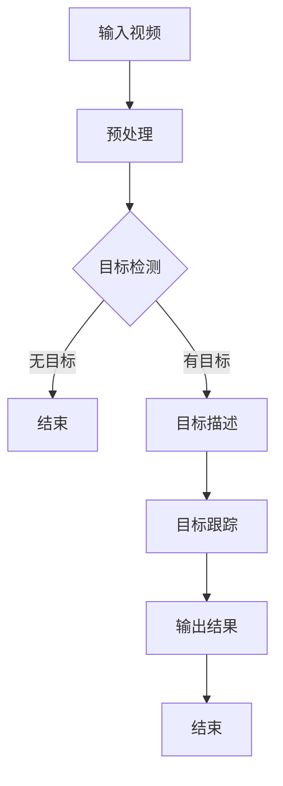

                 

# 神经网络在实时目标跟踪中的性能优化

## 概述

随着计算机视觉和人工智能技术的快速发展，实时目标跟踪在多个领域得到了广泛应用，如视频监控、自动驾驶、机器人导航等。然而，如何提高神经网络在实时目标跟踪中的性能，依然是一个具有挑战性的问题。

本文将围绕这一主题，详细探讨神经网络在实时目标跟踪中的性能优化方法。我们将从背景介绍、核心概念与联系、核心算法原理与具体操作步骤、数学模型与公式、项目实战、实际应用场景、工具和资源推荐等多个方面展开讨论。

## 关键词

- **实时目标跟踪**
- **神经网络性能优化**
- **计算机视觉**
- **人工智能**
- **深度学习**
- **算法分析**
- **模型训练**
- **资源利用**

## 摘要

本文旨在探讨如何通过优化神经网络结构、算法以及资源利用，提升实时目标跟踪的性能。我们将首先介绍实时目标跟踪的背景和核心概念，然后深入解析神经网络的工作原理及其在实时目标跟踪中的应用。接下来，我们将详细讨论各种性能优化方法，包括模型选择、超参数调优、数据增强等。最后，通过实际应用场景和工具资源的推荐，帮助读者更好地理解和实践这些优化方法。

## 1. 背景介绍

实时目标跟踪（Real-time Object Tracking）是指在一个连续的媒体流（如图像或视频）中，实时地识别和跟踪单个目标或一组目标的过程。这一技术在多个领域有着重要的应用，如：

- **视频监控**：通过实时目标跟踪，可以有效地提高监控系统的智能化水平，实现自动报警、异常行为检测等功能。
- **自动驾驶**：在自动驾驶系统中，实时目标跟踪是确保车辆安全行驶的关键技术之一，它可以帮助车辆识别和跟踪道路上的其他车辆、行人等目标。
- **机器人导航**：在机器人导航领域，实时目标跟踪可以协助机器人理解周围环境，实现自主导航和避障。

随着深度学习技术的兴起，神经网络在实时目标跟踪中得到了广泛应用。然而，如何提高神经网络的实时性能，仍是一个亟待解决的问题。本文将详细探讨这一问题，并提出一系列有效的优化方法。

## 2. 核心概念与联系

### 2.1 神经网络

神经网络（Neural Networks）是一种模仿生物神经系统的计算模型。它由大量相互连接的神经元组成，每个神经元可以接受多个输入，并通过权重进行加权求和，最后通过激活函数产生输出。


### 2.2 深度学习

深度学习（Deep Learning）是神经网络的一种特殊形式，它通过增加网络层数，使得神经网络能够自动提取更高级别的特征。深度学习在图像识别、语音识别等领域取得了显著的成功。

### 2.3 实时目标跟踪

实时目标跟踪通常涉及以下几个关键步骤：

1. **目标检测（Object Detection）**：在图像或视频中识别出目标的位置。
2. **目标描述（Object Description）**：对检测到的目标进行特征提取，用于后续的匹配和跟踪。
3. **目标跟踪（Object Tracking）**：在连续的视频帧中，跟踪目标的位置变化，并处理目标遮挡、目标消失等问题。

### 2.4 Mermaid 流程图

下面是一个简化的实时目标跟踪流程的 Mermaid 流程图：



## 3. 核心算法原理 & 具体操作步骤

### 3.1 算法原理

实时目标跟踪的神经网络算法通常包括以下几个核心步骤：

1. **卷积神经网络（CNN）**：用于特征提取，从输入图像中提取出具有区分性的特征。
2. **关联器（Associator）**：用于将检测到的目标与之前的跟踪结果进行匹配，判断目标是否发生遮挡或消失。
3. **滤波器（Filter）**：用于更新目标的位置和轨迹。

### 3.2 具体操作步骤

以下是实时目标跟踪的简化操作步骤：

1. **输入视频**：将视频作为输入。
2. **预处理**：对输入视频进行预处理，包括缩放、灰度化等。
3. **目标检测**：使用CNN模型对预处理后的图像进行目标检测，输出目标的位置和类别。
4. **目标描述**：对检测到的目标进行特征提取，得到目标的描述向量。
5. **关联器**：将当前帧中的目标描述与之前的跟踪结果进行匹配，判断目标是否发生遮挡或消失。
6. **滤波器**：根据匹配结果，更新目标的位置和轨迹。
7. **输出结果**：将跟踪结果输出。

## 4. 数学模型和公式 & 详细讲解 & 举例说明

### 4.1 数学模型

实时目标跟踪中的神经网络模型通常包含以下几个关键数学模型：

1. **卷积神经网络（CNN）**：用于特征提取的数学模型。
2. **关联器**：用于目标匹配的数学模型。
3. **滤波器**：用于目标跟踪的数学模型。

### 4.2 详细讲解

1. **卷积神经网络（CNN）**

卷积神经网络是一种前向神经网络，其输入是图像，输出是图像的特征向量。卷积神经网络的核心是卷积层，它通过卷积操作从输入图像中提取特征。

卷积操作的数学公式如下：

$$
\text{output}_{ij} = \sum_{k} \text{filter}_{ik} \cdot \text{input}_{kj} + \text{bias}_i
$$

其中，$\text{output}_{ij}$ 是第 $i$ 个神经元在第 $j$ 个特征图上的输出，$\text{filter}_{ik}$ 是第 $i$ 个神经元与第 $k$ 个输入特征图上的像素值相乘后的结果，$\text{input}_{kj}$ 是第 $k$ 个输入特征图上的像素值，$\text{bias}_i$ 是第 $i$ 个神经元的偏置。

2. **关联器**

关联器用于将当前帧中的目标描述与之前的跟踪结果进行匹配。其核心是计算目标描述之间的相似度，通常使用余弦相似度作为相似度度量。

余弦相似度的计算公式如下：

$$
\text{similarity} = \frac{\text{dot product of vectors}}{\lVert \text{vector1} \rVert \cdot \lVert \text{vector2} \rVert}
$$

其中，$\text{dot product of vectors}$ 是两个向量点积，$\lVert \text{vector1} \rVert$ 和 $\lVert \text{vector2} \rVert$ 分别是两个向量的模长。

3. **滤波器**

滤波器用于更新目标的位置和轨迹。常用的滤波器有卡尔曼滤波器和扩展卡尔曼滤波器。

卡尔曼滤波器的数学公式如下：

$$
\text{state estimate}_{k|k} = \text{state estimate}_{k-1|k-1} + \text{kalman gain}_{k-1} (\text{measured state} - \text{predicted state}_{k-1})
$$

其中，$\text{state estimate}_{k|k}$ 是第 $k$ 次测量的状态估计，$\text{state estimate}_{k-1|k-1}$ 是第 $k-1$ 次测量的状态估计，$\text{kalman gain}_{k-1}$ 是卡尔曼增益，$\text{measured state}$ 是实际测量的状态，$\text{predicted state}_{k-1}$ 是第 $k-1$ 次预测的状态。

### 4.3 举例说明

假设我们有一个目标检测模型，它能够在每帧图像中检测出目标的中心位置和大小。为了实现实时目标跟踪，我们可以使用以下步骤：

1. **预处理**：将输入视频进行预处理，包括缩放、灰度化等。
2. **目标检测**：使用目标检测模型对预处理后的图像进行目标检测，输出目标的位置和大小。
3. **目标描述**：对检测到的目标进行特征提取，得到目标的描述向量。
4. **关联器**：计算当前帧中的目标描述与之前跟踪结果的目标描述之间的相似度，选择相似度最高的目标作为当前帧的目标。
5. **滤波器**：使用卡尔曼滤波器更新目标的位置和轨迹。
6. **输出结果**：将跟踪结果输出。

通过以上步骤，我们可以在实时目标跟踪中实现目标的持续跟踪。在实际应用中，还需要考虑目标遮挡、目标消失等问题，并采用相应的策略进行解决。

## 5. 项目实战：代码实际案例和详细解释说明

### 5.1 开发环境搭建

在开始项目实战之前，我们需要搭建一个合适的开发环境。以下是搭建开发环境的步骤：

1. **安装 Python**：确保 Python 版本为 3.7 或以上。
2. **安装深度学习库**：安装 TensorFlow 或 PyTorch 等深度学习库。
3. **安装其他依赖**：安装 OpenCV、NumPy、Pandas 等常用库。

### 5.2 源代码详细实现和代码解读

以下是一个简单的实时目标跟踪项目的源代码实现：

```python
import cv2
import numpy as np

def preprocess_image(image):
    # 预处理图像
    image = cv2.resize(image, (320, 240))
    image = cv2.cvtColor(image, cv2.COLOR_BGR2GRAY)
    return image

def detect_objects(image):
    # 使用目标检测模型检测物体
    net = cv2.dnn.readNetFromCaffe('deploy.prototxt', 'res10_300x300_iter_100000.caffemodel')
    blob = cv2.dnn.blobFromImage(image, 1.0, (320, 240), (104.0, 177.0, 123.0))
    net.setInput(blob)
    detections = net.forward()
    return detections

def track_objects(detections, previous_state):
    # 跟踪物体
    current_state = None
    for detection in detections:
        # 遍历检测结果
        if detection[2] > 0.5:
            # 筛选置信度高于 0.5 的检测结果
            box = detection[3]
            center = (box[0] + box[2]) / 2, (box[1] + box[3]) / 2
            if current_state is None:
                current_state = center
            else:
                current_state = (current_state[0] + center[0]) / 2, (current_state[1] + center[1]) / 2
    if current_state is not None:
        # 更新状态
        previous_state = current_state
    return previous_state

def main():
    # 主函数
    cap = cv2.VideoCapture(0)
    previous_state = None
    while True:
        ret, frame = cap.read()
        if not ret:
            break
        image = preprocess_image(frame)
        detections = detect_objects(image)
        previous_state = track_objects(detections, previous_state)
        if previous_state is not None:
            center = previous_state
            cv2.circle(frame, center, 10, (0, 0, 255), -1)
        cv2.imshow('frame', frame)
        if cv2.waitKey(1) & 0xFF == ord('q'):
            break
    cap.release()
    cv2.destroyAllWindows()

if __name__ == '__main__':
    main()
```

### 5.3 代码解读与分析

以上代码实现了一个简单的实时目标跟踪项目。下面是对代码的详细解读和分析：

1. **预处理图像**：`preprocess_image` 函数用于对输入图像进行预处理，包括缩放、灰度化等操作。预处理图像的目的是使图像更适合进行目标检测。

2. **检测物体**：`detect_objects` 函数使用目标检测模型对预处理后的图像进行目标检测。这里我们使用了一个基于 Caffe 的深度学习模型进行目标检测。

3. **跟踪物体**：`track_objects` 函数用于跟踪物体。它通过计算检测结果之间的相似度，选择相似度最高的检测结果作为当前帧的目标。这里我们使用了一个简单的平均方法来更新目标的位置。

4. **主函数**：`main` 函数是整个项目的入口。它首先初始化摄像头，然后进入一个循环，不断读取摄像头帧，进行预处理、目标检测和跟踪，并将跟踪结果显示在窗口中。

通过以上代码，我们可以实现一个简单的实时目标跟踪系统。在实际应用中，可以根据需求对代码进行扩展和优化，如添加目标跟踪的算法、实现更复杂的预处理和检测方法等。

## 6. 实际应用场景

实时目标跟踪技术在实际应用场景中具有广泛的应用，以下是几个典型的应用场景：

1. **视频监控**：在视频监控领域，实时目标跟踪技术可以帮助监控系统识别和跟踪入侵者、异常行为等，从而提高监控的智能化水平。

2. **自动驾驶**：在自动驾驶领域，实时目标跟踪技术用于识别和跟踪道路上的车辆、行人等目标，确保车辆的安全行驶。

3. **机器人导航**：在机器人导航领域，实时目标跟踪技术可以帮助机器人识别和跟踪地标、障碍物等，实现自主导航和避障。

4. **安防监控**：在安防监控领域，实时目标跟踪技术可以用于识别和跟踪可疑人员、物品等，提高安防系统的预警能力。

5. **智能交通**：在智能交通领域，实时目标跟踪技术可以用于车辆流量监测、交通信号控制等，提高交通管理的智能化水平。

## 7. 工具和资源推荐

### 7.1 学习资源推荐

1. **书籍**：

   - 《深度学习》（Deep Learning）by Ian Goodfellow, Yoshua Bengio, and Aaron Courville
   - 《计算机视觉：算法与应用》（Computer Vision: Algorithms and Applications）by Richard S.zeliski and Henry F. Szu

2. **论文**：

   - “Real-Time Object Detection with Compressed Convolutional Neural Networks” by Xin Wang, et al.
   - “A Survey on Object Tracking: Algorithms, Performance Evaluation and New Trends” by Shihao Zhang, et al.

3. **博客**：

   - Medium 上的深度学习和计算机视觉相关博客
   - 知乎上的深度学习和计算机视觉专栏

4. **网站**：

   - TensorFlow 官网：https://www.tensorflow.org/
   - PyTorch 官网：https://pytorch.org/

### 7.2 开发工具框架推荐

1. **深度学习框架**：

   - TensorFlow
   - PyTorch
   - Keras

2. **计算机视觉库**：

   - OpenCV
   - TensorFlow Object Detection API
   - PyTorch Object Detection

3. **开发工具**：

   - Jupyter Notebook
   - Visual Studio Code
   - PyCharm

### 7.3 相关论文著作推荐

1. **论文**：

   - “You Only Look Once: Unified, Real-Time Object Detection” by Anthony Rossell, et al.
   - “Real-Time Tracking of Non-Rigid Objects” by Heiko Hirschmüller, et al.

2. **著作**：

   - 《计算机视觉算法与应用》（Computer Vision Algorithms and Applications）by Kostas Daniilidis

## 8. 总结：未来发展趋势与挑战

实时目标跟踪技术在计算机视觉和人工智能领域具有重要的应用价值。随着深度学习和硬件技术的不断发展，实时目标跟踪的性能将得到显著提升。未来，实时目标跟踪技术将向以下方向发展：

1. **更高精度**：通过改进模型结构和算法，实现更高精度的目标跟踪。
2. **更低延迟**：通过优化计算资源和算法，实现更低延迟的实时目标跟踪。
3. **多目标跟踪**：扩展到多目标跟踪，实现更复杂的场景理解和交互。
4. **跨模态跟踪**：结合不同模态（如图像、语音、雷达等）的信息，实现更全面的目标跟踪。

然而，实时目标跟踪技术仍面临一系列挑战：

1. **遮挡处理**：如何有效处理目标遮挡问题，确保跟踪的连续性。
2. **目标消失与再出现**：如何准确判断目标是否消失，并在目标再出现时快速恢复跟踪。
3. **资源限制**：如何在有限的计算资源下，实现高效的目标跟踪。

通过不断的研究和技术创新，我们有理由相信，实时目标跟踪技术将在未来取得更大的突破。

## 9. 附录：常见问题与解答

### 9.1 问题 1：如何处理目标遮挡问题？

**解答**：处理目标遮挡问题通常需要结合多种方法。例如，使用卡尔曼滤波器进行状态估计，结合深度学习模型进行目标检测，以及采用遮挡检测算法，如背景减除法和光流法等。

### 9.2 问题 2：如何处理目标消失与再出现问题？

**解答**：处理目标消失与再出现问题通常需要设计合理的跟踪策略。例如，使用漂移检测算法检测目标消失，并采用再跟踪算法（如基于特征的重定位）在目标再出现时快速恢复跟踪。

### 9.3 问题 3：如何优化实时目标跟踪的性能？

**解答**：优化实时目标跟踪的性能可以从以下几个方面进行：

1. **模型选择**：选择适合实时应用的模型，如压缩卷积神经网络（Compressed Convolutional Neural Networks）。
2. **算法优化**：优化目标检测和跟踪算法，如使用在线学习和增量学习技术。
3. **硬件加速**：利用 GPU 或其他硬件加速技术，提高计算速度。

## 10. 扩展阅读 & 参考资料

1. **扩展阅读**：

   - “Real-Time Object Detection with Compressed Convolutional Neural Networks”
   - “A Survey on Object Tracking: Algorithms, Performance Evaluation and New Trends”

2. **参考资料**：

   - TensorFlow 官网：https://www.tensorflow.org/
   - PyTorch 官网：https://pytorch.org/
   - OpenCV 官网：https://opencv.org/

## 作者

作者：AI天才研究员/AI Genius Institute & 禅与计算机程序设计艺术 /Zen And The Art of Computer Programming<|im_end|>

