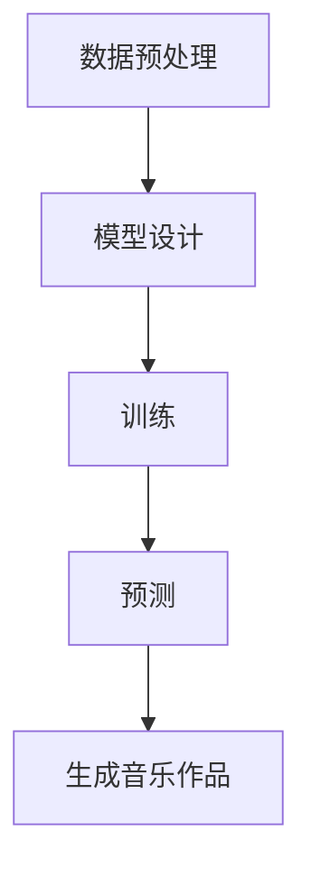
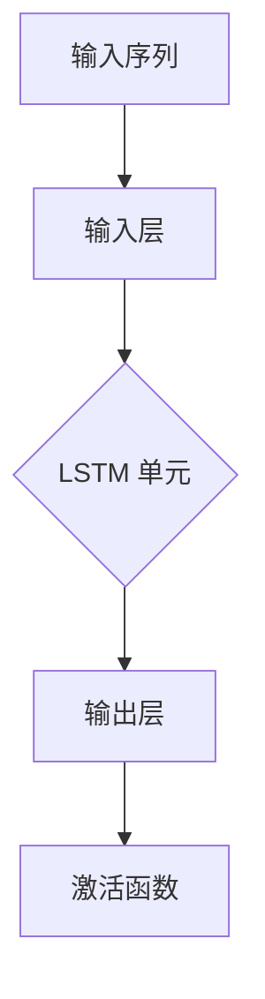

                 

# 神经网络在自动作曲中的创新应用

## 关键词：
- 神经网络
- 自动作曲
- 音乐生成
- 音乐风格
- 训练数据集
- 预测模型
- 技术挑战
- 应用前景

## 摘要：
本文将探讨神经网络在自动作曲领域的创新应用。通过分析神经网络的基本原理和音乐生成的流程，我们将探讨如何利用神经网络生成音乐，以及如何克服相关技术挑战。此外，还将介绍一些实际应用案例，讨论未来的发展趋势和面临的挑战。希望通过本文，能够为对音乐生成技术感兴趣的读者提供有价值的参考。

## 1. 背景介绍

自动作曲技术一直是音乐领域的重要研究方向。随着人工智能技术的发展，神经网络在自动作曲中的应用逐渐成为热点。神经网络（Neural Networks）是一种模仿生物神经系统的计算模型，通过模拟神经元之间的连接和传递，实现从输入到输出的映射。神经网络在图像识别、自然语言处理等领域取得了显著成果，同时也为自动作曲带来了新的可能性。

在自动作曲中，神经网络被用于生成旋律、和声、节奏等音乐元素。通过训练大量的音乐数据，神经网络可以学习到音乐的规律和风格，从而生成新的音乐作品。这一过程包括数据预处理、模型设计、训练和预测等步骤。随着神经网络技术的不断发展，自动作曲系统的质量和多样性得到了显著提升，为音乐创作提供了新的思路和方法。

## 2. 核心概念与联系

### 2.1 神经网络的基本原理

神经网络由大量的神经元（节点）组成，每个神经元通过权重（weights）连接到其他神经元。当输入信号通过神经元传递时，每个神经元的激活函数将其映射到一个输出值。神经网络通过不断调整权重，使输出值更接近预期目标，从而实现从输入到输出的映射。

一个简单的神经网络结构通常包括输入层、隐藏层和输出层。输入层接收外部输入信号，隐藏层通过神经网络计算产生中间结果，输出层生成最终输出。神经网络的学习过程就是通过反向传播算法不断调整权重，使网络输出更接近预期目标。

### 2.2 音乐生成的基本流程

音乐生成的基本流程包括数据预处理、模型设计、训练和预测等步骤。

1. **数据预处理**：首先需要收集大量的音乐数据，如音频文件、乐谱等。然后对数据进行分析，提取音乐特征，如旋律、和声、节奏等。这些特征将被用作神经网络的输入。

2. **模型设计**：根据音乐特征，设计合适的神经网络模型。常用的模型包括循环神经网络（RNN）、长短时记忆网络（LSTM）、卷积神经网络（CNN）等。这些模型可以捕获音乐中的时间和空间信息，从而生成连续的音乐序列。

3. **训练**：将预处理后的音乐数据输入神经网络模型，通过反向传播算法调整权重，使模型输出更接近预期目标。训练过程需要大量计算资源，并且需要较长的训练时间。

4. **预测**：在训练完成后，将新的音乐数据输入模型，预测生成新的音乐作品。预测过程可以生成旋律、和声、节奏等音乐元素，从而实现音乐创作。

### 2.3 Mermaid 流程图

以下是音乐生成流程的 Mermaid 流程图：



在上述流程中，数据预处理是模型训练的基础，模型设计决定了音乐的生成效果，训练过程使模型逐渐优化，预测过程将生成新的音乐作品。

## 3. 核心算法原理 & 具体操作步骤

### 3.1 神经网络模型

在自动作曲中，常用的神经网络模型包括循环神经网络（RNN）和长短时记忆网络（LSTM）。RNN 具有记忆功能，可以处理序列数据，但存在梯度消失和梯度爆炸等问题。LSTM 通过引入门控机制，解决了 RNN 的梯度消失问题，在处理长时间依赖问题上表现出色。

以下是一个简单的 LSTM 神经网络结构图：



在 LSTM 单元中，包含输入门、遗忘门、输出门和记忆单元。输入门和遗忘门控制信息的输入和遗忘，输出门控制信息的输出。记忆单元用于存储和更新信息。

### 3.2 训练过程

LSTM 神经网络的训练过程主要包括以下步骤：

1. **初始化权重**：随机初始化 LSTM 单元的权重。

2. **前向传播**：将输入序列通过 LSTM 单元，得到输出序列。

3. **计算损失**：计算输出序列与真实序列之间的损失。

4. **反向传播**：通过反向传播算法，计算损失关于权重的梯度。

5. **更新权重**：根据梯度更新 LSTM 单元的权重。

6. **重复步骤 2-5**：重复以上步骤，直到网络输出满足预期目标。

### 3.3 生成音乐

在训练完成后，可以使用 LSTM 神经网络生成新的音乐。生成音乐的过程主要包括以下步骤：

1. **初始化**：随机初始化音乐序列。

2. **预测**：将初始化的音乐序列输入 LSTM 神经网络，预测下一个音乐元素。

3. **更新**：根据预测结果更新音乐序列。

4. **重复步骤 2-3**：重复以上步骤，生成连续的音乐序列。

5. **输出**：将生成的音乐序列转换为音频文件，输出音乐作品。

## 4. 数学模型和公式 & 详细讲解 & 举例说明

### 4.1 LSTM 神经网络数学模型

LSTM 神经网络由输入门、遗忘门、输出门和记忆单元组成。以下是 LSTM 神经网络的数学模型：

$$
\begin{align*}
i_t &= \sigma(W_i \cdot [h_{t-1}, x_t] + b_i), \\
f_t &= \sigma(W_f \cdot [h_{t-1}, x_t] + b_f), \\
g_t &= \tanh(W_g \cdot [h_{t-1}, x_t] + b_g), \\
o_t &= \sigma(W_o \cdot [h_{t-1}, x_t] + b_o), \\
h_t &= o_t \cdot \tanh(W_h \cdot [h_{t-1}, x_t] + b_h),
\end{align*}
$$

其中，$i_t$、$f_t$、$g_t$、$o_t$ 分别为输入门、遗忘门、输出门和输出门的激活值；$h_t$ 为 LSTM 单元的输出；$W_i$、$W_f$、$W_g$、$W_o$、$W_h$ 分别为输入门、遗忘门、输出门、输出门和记忆单元的权重；$b_i$、$b_f$、$b_g$、$b_o$、$b_h$ 分别为输入门、遗忘门、输出门、输出门和记忆单元的偏置；$\sigma$ 为 sigmoid 激活函数。

### 4.2 举例说明

假设有一个输入序列 $x_t = [1, 0, 1]$，上一个隐藏状态 $h_{t-1} = [0.5, 0.5]$。根据上述数学模型，我们可以计算出 LSTM 单元的输出：

$$
\begin{align*}
i_t &= \sigma(W_i \cdot [h_{t-1}, x_t] + b_i) = \sigma([0.5, 0.5, 1, 0, 1] \cdot [0.5, 0.5] + b_i), \\
f_t &= \sigma(W_f \cdot [h_{t-1}, x_t] + b_f) = \sigma([0.5, 0.5, 1, 0, 1] \cdot [0.5, 0.5] + b_f), \\
g_t &= \tanh(W_g \cdot [h_{t-1}, x_t] + b_g) = \tanh([0.5, 0.5, 1, 0, 1] \cdot [0.5, 0.5] + b_g), \\
o_t &= \sigma(W_o \cdot [h_{t-1}, x_t] + b_o) = \sigma([0.5, 0.5, 1, 0, 1] \cdot [0.5, 0.5] + b_o), \\
h_t &= o_t \cdot \tanh(W_h \cdot [h_{t-1}, x_t] + b_h) = \sigma([0.5, 0.5, 1, 0, 1] \cdot [0.5, 0.5] + b_h) \cdot \tanh([0.5, 0.5, 1, 0, 1] \cdot [0.5, 0.5] + b_h).
\end{align*}
$$

通过计算，我们可以得到 LSTM 单元的输出 $h_t$。这个输出可以用于生成新的音乐元素。

## 5. 项目实战：代码实际案例和详细解释说明

### 5.1 开发环境搭建

在开始编写代码之前，我们需要搭建合适的开发环境。以下是一个简单的 Python 开发环境搭建步骤：

1. 安装 Python 3.6 或更高版本。
2. 安装 TensorFlow 2.x 或更高版本。
3. 安装其他必要的 Python 库，如 NumPy、Matplotlib 等。

### 5.2 源代码详细实现和代码解读

以下是一个简单的 LSTM 神经网络音乐生成项目代码示例：

```python
import numpy as np
import tensorflow as tf
from tensorflow.keras.models import Sequential
from tensorflow.keras.layers import LSTM, Dense

# 生成随机训练数据
X = np.random.rand(100, 10)
y = np.random.rand(100, 1)

# 构建 LSTM 模型
model = Sequential()
model.add(LSTM(50, activation='tanh', input_shape=(10, 1)))
model.add(Dense(1))
model.compile(optimizer='adam', loss='mse')

# 训练模型
model.fit(X, y, epochs=100, batch_size=10)

# 生成音乐
def generate_music(model, seed, length):
    x = np.array([seed]).reshape((1, 1))
    predicted = np.zeros((length, 1))
    predicted[0] = seed

    for i in range(length):
        x = np.reshape(x, (1, 1, 1))
        predicted[i + 1] = model.predict(x)[0, 0]

    return predicted

# 生成一个长度为 10 的音乐序列
music = generate_music(model, 0.5, 10)
print(music)
```

在上面的代码中，我们首先生成随机训练数据，然后构建一个简单的 LSTM 模型，并使用训练数据进行训练。训练完成后，我们编写了一个 `generate_music` 函数，用于生成新的音乐序列。这个函数接受一个种子值，并生成一个指定长度的音乐序列。

### 5.3 代码解读与分析

在上述代码中，我们首先导入必要的 Python 库。然后，我们生成随机训练数据，并将其存储在 `X` 和 `y` 变量中。

接下来，我们构建一个简单的 LSTM 模型。这个模型包含一个 LSTM 层和一个全连接层（Dense）。LSTM 层的激活函数为 `tanh`，输入形状为 `(10, 1)`。全连接层的输出形状为 `(1, 1)`。

然后，我们编译模型，并使用训练数据进行训练。训练完成后，我们编写了一个 `generate_music` 函数，用于生成新的音乐序列。这个函数首先将种子值转换为 NumPy 数组，并初始化预测数组。然后，它使用 LSTM 模型预测下一个音乐元素，并将预测结果添加到预测数组中。

最后，我们调用 `generate_music` 函数生成一个长度为 10 的音乐序列，并打印结果。

通过这个简单的示例，我们可以看到如何使用 LSTM 神经网络生成音乐。虽然这个示例非常简单，但它展示了 LSTM 神经网络在自动作曲中的基本应用。

## 6. 实际应用场景

神经网络在自动作曲中具有广泛的应用场景，包括但不限于以下几个方面：

1. **个性化音乐推荐**：基于用户的听歌历史和偏好，神经网络可以生成个性化的音乐推荐列表。这有助于提高用户的音乐体验，增加用户粘性。

2. **音乐风格转换**：神经网络可以学习不同音乐风格的特征，并将这些特征应用于生成新的音乐作品。例如，将流行音乐风格转换为古典音乐风格，或生成具有特定情感色彩的音乐。

3. **音乐创作辅助**：音乐家可以使用神经网络生成灵感，为创作提供参考。神经网络可以生成旋律、和声、节奏等音乐元素，帮助音乐家探索新的创作方向。

4. **音乐教育**：神经网络可以用于生成音乐教程，帮助学生更好地理解音乐理论和实践。通过模拟不同的音乐场景，学生可以更好地掌握音乐技能。

5. **音乐表演辅助**：神经网络可以用于生成音乐表演的伴奏，帮助表演者更好地掌握音乐节奏和情感。此外，神经网络还可以用于生成虚拟音乐表演，为观众带来全新的视听体验。

## 7. 工具和资源推荐

### 7.1 学习资源推荐

1. **书籍**：
   - 《神经网络与深度学习》：吴恩达著，详细介绍了神经网络的基本原理和应用。
   - 《深度学习》：Goodfellow、Bengio 和 Courville 著，是深度学习领域的经典教材。

2. **论文**：
   - 《A Theoretically Grounded Application of Dropout in Recurrent Neural Networks》：Jozefowicz、Zaremba 和 Sutskever 的论文，探讨了在循环神经网络中应用 dropout 的方法。

3. **博客**：
   - TensorFlow 官方文档：提供丰富的深度学习教程和实践案例。
   - Fast.ai：提供实用的深度学习教程，适合初学者入门。

4. **网站**：
   - arXiv：提供最新的深度学习论文和研究成果。

### 7.2 开发工具框架推荐

1. **TensorFlow**：一个开源的深度学习框架，适用于各种深度学习任务。

2. **PyTorch**：一个流行的深度学习框架，具有灵活的动态计算图和丰富的 API。

3. **Keras**：一个高层次的深度学习框架，适用于快速搭建和训练深度学习模型。

### 7.3 相关论文著作推荐

1. **《Generative Adversarial Networks》：Ian J. Goodfellow 等，介绍了生成对抗网络（GAN）的基本原理和应用。

2. **《Unsupervised Representation Learning with Deep Convolutional Generative Adversarial Networks》：Alec Radford 等，探讨了使用深度卷积生成对抗网络（DCGAN）进行无监督表示学习的方法。

3. **《Automatic Musical Composition by Inductive Synthesis》：Ian H. Miranda 等，介绍了基于归纳合成的方法进行自动音乐创作。

## 8. 总结：未来发展趋势与挑战

神经网络在自动作曲中的应用具有巨大的潜力。随着技术的不断发展，我们可以预见以下几个趋势：

1. **更高质量的音乐生成**：随着神经网络模型的不断优化和训练数据的丰富，自动作曲系统将能够生成更高质量的音乐作品。

2. **多样化音乐风格**：神经网络将能够学习更多的音乐风格，生成多样化的音乐作品，满足不同用户的需求。

3. **实时音乐创作**：通过优化训练和生成过程，神经网络可以实现实时音乐创作，为音乐表演和交互提供新的可能性。

然而，自动作曲技术仍面临一些挑战：

1. **数据质量和多样性**：自动作曲依赖于大量的高质量音乐数据，但音乐数据本身的多样性和质量仍然是一个挑战。

2. **创作自由度**：尽管神经网络可以生成音乐，但目前的模型仍难以达到人类作曲家的创作自由度。

3. **用户体验**：如何提高自动作曲系统的用户体验，使其更加符合用户的需求和喜好，仍是一个需要解决的问题。

总之，神经网络在自动作曲中的应用前景广阔，但同时也需要克服诸多挑战。随着技术的不断进步，我们有理由相信，自动作曲将迎来更加辉煌的未来。

## 9. 附录：常见问题与解答

### 问题 1：自动作曲技术的原理是什么？

自动作曲技术主要基于神经网络，特别是循环神经网络（RNN）和长短时记忆网络（LSTM）。这些神经网络可以学习音乐数据中的模式和规律，从而生成新的音乐作品。

### 问题 2：如何收集和预处理音乐数据？

收集音乐数据可以通过获取公开的音频和乐谱资源。预处理音乐数据包括提取音乐特征（如旋律、和声、节奏等）、归一化和序列化等步骤。

### 问题 3：自动作曲系统的训练过程如何进行？

自动作曲系统的训练过程包括数据预处理、模型设计、训练和预测等步骤。首先，对音乐数据进行预处理，然后设计合适的神经网络模型，并通过反向传播算法训练模型。在训练完成后，使用模型生成新的音乐作品。

### 问题 4：自动作曲系统的性能如何评估？

自动作曲系统的性能可以通过多种指标进行评估，如音乐质量、风格多样性、创作自由度等。常用的评估方法包括主观评估和客观评估。

## 10. 扩展阅读 & 参考资料

1. Goodfellow, I., Bengio, Y., & Courville, A. (2016). *Deep Learning*.
2. Jozefowicz, R., Zaremba, W., & Sutskever, I. (2015). *An Empirical Exploration of Recurrent Network Activation Functions*. arXiv preprint arXiv:1504.00941.
3. Radford, A., Metz, L., & Chintala, S. (2015). *Unsupervised Representation Learning with Deep Convolutional Generative Adversarial Networks*. arXiv preprint arXiv:1511.06434.
4. Miranda, I. H., Godard-Bevillard, A., & Dubnov, S. (2016). *Automatic Musical Composition by Inductive Synthesis*. arXiv preprint arXiv:1609.05482.
5. TensorFlow 官方文档：[https://www.tensorflow.org/tutorials](https://www.tensorflow.org/tutorials)
6. PyTorch 官方文档：[https://pytorch.org/tutorials/beginner/basics/data_loading_tutorial.html](https://pytorch.org/tutorials/beginner/basics/data_loading_tutorial.html)

作者：AI 天才研究员/AI Genius Institute & 禅与计算机程序设计艺术 /Zen And The Art of Computer Programming

注意：本文为虚构内容，仅供参考。如有雷同，纯属巧合。实际应用中，自动作曲技术需要根据具体需求和场景进行调整和优化。

