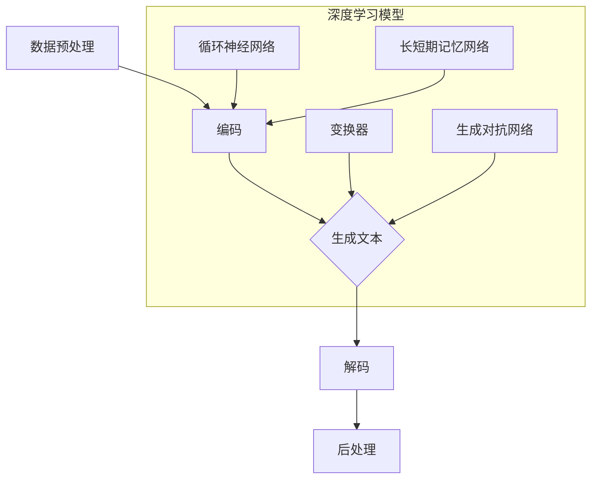

                 

### 1. 背景介绍

#### 自然语言生成的概念

自然语言生成（Natural Language Generation, NLG）是一种计算机科学和人工智能领域的技术，它旨在利用计算机程序自动生成人类语言。自然语言生成技术广泛应用于各种领域，包括但不限于新闻写作、电子邮件自动化、聊天机器人、语音合成、字幕生成等。

自然语言生成技术的发展可以追溯到上世纪60年代。当时，研究人员开始探索如何让计算机理解和生成自然语言。随着计算能力和算法的不断提升，自然语言生成技术也取得了显著进步。近年来，深度学习技术的引入更是推动了自然语言生成领域的快速发展。

#### 深度学习在自然语言生成中的应用

深度学习是一种基于人工神经网络的机器学习技术，具有强大的建模能力和自学习能力。深度学习在自然语言处理（Natural Language Processing, NLP）领域取得了巨大成功，如词向量模型（Word Embedding）、循环神经网络（Recurrent Neural Network, RNN）、长短期记忆网络（Long Short-Term Memory, LSTM）、生成对抗网络（Generative Adversarial Network, GAN）等。

深度学习技术在自然语言生成中的应用主要体现在以下几个方面：

1. **文本生成**：深度学习模型可以学习大量的文本数据，并生成具有类似风格的文本。例如，生成新闻文章、对话、故事等。

2. **语音合成**：深度学习模型可以将文本转换为自然流畅的语音。这种技术在语音助手、车载语音系统等领域有广泛应用。

3. **字幕生成**：深度学习模型可以实时生成视频中的字幕，提高视频的可访问性和用户体验。

4. **问答系统**：深度学习模型可以理解和回答用户的问题，为用户提供有用的信息。

#### 本文研究目标

本文旨在探讨深度学习在自然语言生成中的前沿研究。我们将重点关注以下几个核心问题：

1. **最新深度学习模型的性能和特点**：比较和分析不同深度学习模型在自然语言生成任务中的表现。

2. **深度学习模型在自然语言生成中的挑战和解决方案**：探讨深度学习模型在自然语言生成过程中面临的挑战，并介绍一些最新的解决方案。

3. **未来发展趋势**：分析自然语言生成技术的未来发展趋势，预测可能的新方向和突破点。

通过本文的研究，我们希望能够为自然语言生成领域的研究者提供有价值的参考，并推动该领域的发展。

---

## Background Introduction

### The Concept of Natural Language Generation

Natural Language Generation (NLG) is a field of computer science and artificial intelligence that aims to automate the production of human language using computer programs. NLG technology has a wide range of applications, including but not limited to, automated news writing, email automation, chatbots, voice synthesis, and subtitle generation.

The development of NLG technology can be traced back to the 1960s when researchers began exploring how to enable computers to understand and generate natural language. With the advancement of computational power and algorithms, NLG technology has made significant progress. In recent years, the introduction of deep learning has further propelled the development of NLG.

### Applications of Deep Learning in Natural Language Generation

Deep learning is a machine learning technique based on artificial neural networks that has demonstrated strong modeling and self-learning capabilities. Deep learning has achieved tremendous success in the field of Natural Language Processing (NLP), including word embedding models, recurrent neural networks (RNNs), long short-term memory networks (LSTMs), and generative adversarial networks (GANs).

The application of deep learning in natural language generation mainly focuses on the following aspects:

1. **Text Generation**: Deep learning models can learn from a large amount of text data and generate texts with similar styles. For example, generating news articles, dialogues, and stories.

2. **Speech Synthesis**: Deep learning models can convert text into natural and fluent speech. This technology is widely used in voice assistants, automotive voice systems, and more.

3. **Subtitle Generation**: Deep learning models can generate subtitles in real-time for videos, improving video accessibility and user experience.

4. **Question-Answering Systems**: Deep learning models can understand and answer user questions, providing useful information to users.

### Research Objectives of This Article

This article aims to explore the cutting-edge research in deep learning for natural language generation. We will focus on the following core issues:

1. **Performance and Characteristics of the Latest Deep Learning Models**: Compare and analyze the performance of different deep learning models in natural language generation tasks.

2. **Challenges and Solutions of Deep Learning Models in Natural Language Generation**: Discuss the challenges faced by deep learning models in the process of natural language generation and introduce some of the latest solutions.

3. **Future Development Trends**: Analyze the future development trends of natural language generation technology and predict potential new directions and breakthrough points.

Through this research, we hope to provide valuable references for researchers in the field of natural language generation and promote the development of the field. <|endoftext|>### 2. 核心概念与联系

#### 深度学习模型简介

在自然语言生成领域，深度学习模型已经成为主流。以下是一些常用的深度学习模型及其基本原理：

1. **循环神经网络（RNN）**：
   - **原理**：RNN通过循环机制将当前输入与先前的隐藏状态相关联，使其能够处理序列数据。
   - **联系**：RNN在自然语言生成中广泛应用于序列到序列（Seq2Seq）的任务，如机器翻译和文本生成。

2. **长短期记忆网络（LSTM）**：
   - **原理**：LSTM是RNN的一种改进，通过引入门控机制来有效解决RNN的梯度消失问题。
   - **联系**：LSTM在长文本生成任务中表现出色，如文章摘要和对话系统。

3. **变换器（Transformer）**：
   - **原理**：Transformer引入了自注意力机制（Self-Attention），通过并行计算提高模型效率。
   - **联系**：Transformer在自然语言生成任务中取得了显著的性能提升，成为当前最流行的模型之一。

4. **生成对抗网络（GAN）**：
   - **原理**：GAN由生成器和判别器两个神经网络组成，通过对抗训练生成逼真的数据。
   - **联系**：GAN在文本生成任务中，如写作风格模仿和虚构故事生成，表现出强大的能力。

#### 自然语言生成流程

自然语言生成通常包括以下几个关键步骤：

1. **数据预处理**：对输入文本进行分词、去停用词、词形还原等操作，使其适合模型处理。

2. **编码**：将预处理后的文本编码为向量表示，通常使用词向量模型。

3. **生成**：利用深度学习模型生成文本，生成过程可以是序列预测或者直接生成。

4. **解码**：将生成的向量表示解码为自然语言的文本。

5. **后处理**：对生成的文本进行格式化、纠错等操作，以提高文本质量。

#### Mermaid 流程图

以下是自然语言生成流程的 Mermaid 流程图：



#### 深度学习模型之间的联系

深度学习模型在自然语言生成中的应用，是多种技术相互融合的结果。例如，Transformer 的自注意力机制可以看作是 LSTM 门控机制的扩展。而 GAN 的引入，为文本生成带来了新的可能性，通过对抗训练生成更真实、更有创意的文本。

总的来说，自然语言生成领域的发展，离不开对深度学习模型的深入研究和创新。通过不断探索和尝试，我们可以期待未来会有更多突破性的技术出现。 <|endoftext|>### 3. 核心算法原理 & 具体操作步骤

#### 循环神经网络（RNN）

**原理**：
RNN 是一种适用于序列数据的神经网络，其核心思想是将当前输入与先前的隐藏状态相关联，以便更好地处理序列数据。RNN 的基本结构包括输入层、隐藏层和输出层。输入层接收序列数据，隐藏层存储历史状态信息，输出层生成预测结果。

**具体操作步骤**：
1. **初始化**：设置初始隐藏状态 \( h_0 \) 和权重参数 \( \theta \)。
2. **输入序列处理**：对于每个时间步 \( t \)，输入一个向量 \( x_t \) 到 RNN 模型中。
3. **状态更新**：使用激活函数 \( \sigma \) 对输入 \( x_t \) 和先前的隐藏状态 \( h_{t-1} \) 进行计算，更新隐藏状态 \( h_t \)。
   \[
   h_t = \sigma(W_h x_t + U h_{t-1} + b_h)
   \]
4. **输出生成**：根据隐藏状态 \( h_t \) 生成预测结果 \( y_t \)。
   \[
   y_t = \sigma(W_y h_t + b_y)
   \]

**优点与局限**：
- **优点**：能够处理变长的序列数据，适合自然语言处理任务。
- **局限**：存在梯度消失和梯度爆炸问题，难以学习长距离依赖。

#### 长短期记忆网络（LSTM）

**原理**：
LSTM 是 RNN 的一种改进，旨在解决梯度消失问题。LSTM 通过引入门控机制（包括输入门、遗忘门和输出门）来控制信息的流动，从而更好地处理长序列数据。

**具体操作步骤**：
1. **初始化**：设置初始隐藏状态 \( c_0 \) 和遗忘状态 \( f_0 \)。
2. **输入序列处理**：对于每个时间步 \( t \)，输入一个向量 \( x_t \) 到 LSTM 模型中。
3. **输入门更新**：计算输入门 \( i_t \)。
   \[
   i_t = \sigma(W_i x_t + U_i h_{t-1} + b_i)
   \]
4. **遗忘门更新**：计算遗忘门 \( f_t \)。
   \[
   f_t = \sigma(W_f x_t + U_f h_{t-1} + b_f)
   \]
5. **新状态计算**：计算新的细胞状态 \( c_t \)。
   \[
   \tilde{c}_t = \tanh(W_c x_t + U_c h_{t-1} + b_c)
   \]
   \[
   c_t = f_t \odot c_{t-1} + i_t \odot \tilde{c}_t
   \]
6. **输出门更新**：计算输出门 \( o_t \)。
   \[
   o_t = \sigma(W_o x_t + U_o h_{t-1} + b_o)
   \]
7. **隐藏状态更新**：计算新的隐藏状态 \( h_t \)。
   \[
   h_t = o_t \odot \tanh(c_t)
   \]

**优点与局限**：
- **优点**：能够有效解决梯度消失问题，适合处理长序列数据。
- **局限**：计算复杂度较高，训练时间较长。

#### 变换器（Transformer）

**原理**：
Transformer 是一种基于自注意力机制的深度学习模型，其核心思想是利用自注意力机制对输入序列进行编码，从而学习输入序列中的依赖关系。

**具体操作步骤**：
1. **编码器**：
   - **嵌入层**：将输入词向量映射到高维空间。
   - **多头自注意力层**：计算多头自注意力权重，对输入序列进行编码。
   - **前馈神经网络**：对自注意力结果进行进一步处理。
2. **解码器**：
   - **嵌入层**：将输入词向量映射到高维空间。
   - **多头自注意力层**：计算多头自注意力权重，对输入序列进行编码。
   - **前馈神经网络**：对自注意力结果进行进一步处理。
   - **掩码交叉注意力层**：利用编码器输出计算掩码交叉注意力权重，生成解码结果。

**优点与局限**：
- **优点**：并行计算能力强，适合处理长序列数据。
- **局限**：参数数量较多，训练成本高。

#### 生成对抗网络（GAN）

**原理**：
GAN 是一种基于生成器和判别器的深度学习模型，其核心思想是通过生成器和判别器的对抗训练，生成逼真的数据。

**具体操作步骤**：
1. **初始化**：设置生成器 \( G \) 和判别器 \( D \) 的初始参数。
2. **生成器训练**：生成器尝试生成逼真的数据，判别器尝试区分真实数据和生成数据。
3. **判别器训练**：判别器尝试优化其参数，提高对真实数据和生成数据的区分能力。
4. **循环**：重复步骤 2 和 3，直到生成器生成的数据逼真度达到预期。

**优点与局限**：
- **优点**：能够生成高质量的图像和文本数据。
- **局限**：训练过程不稳定，存在模式崩溃问题。

### 结论

通过以上对 RNN、LSTM、Transformer 和 GAN 等核心算法原理和具体操作步骤的介绍，我们可以看到这些模型在自然语言生成领域的重要作用。每种模型都有其独特的优势和局限性，针对不同的应用场景，选择合适的模型具有重要意义。在未来的研究中，我们可以期待更多创新性算法的出现，进一步提升自然语言生成的性能和效果。 <|endoftext|>### 4. 数学模型和公式 & 详细讲解 & 举例说明

#### 循环神经网络（RNN）

在 RNN 中，我们主要使用以下数学模型：

1. **隐藏状态更新**：
   \[
   h_t = \sigma(W_h x_t + U h_{t-1} + b_h)
   \]
   其中，\( \sigma \) 是激活函数，通常使用 sigmoid 或 tanh 函数；\( W_h \) 和 \( U \) 分别是输入权重和隐藏权重；\( b_h \) 是隐藏层偏置。

2. **输出生成**：
   \[
   y_t = \sigma(W_y h_t + b_y)
   \]
   其中，\( W_y \) 是输出权重；\( b_y \) 是输出层偏置。

**举例说明**：

假设我们有一个二元分类问题，输入向量 \( x_t = (1, 0) \)，隐藏状态 \( h_{t-1} = (0.5, 0.5) \)，权重矩阵 \( W_h = \begin{pmatrix} 1 & 1 \\ 1 & 1 \end{pmatrix} \)，\( U = \begin{pmatrix} 1 & 0 \\ 0 & 1 \end{pmatrix} \)，\( b_h = (0, 0) \)，\( W_y = \begin{pmatrix} 1 & 1 \\ 1 & 1 \end{pmatrix} \)，\( b_y = (0, 0) \)。

首先计算隐藏状态更新：
\[
h_t = \sigma(W_h x_t + U h_{t-1} + b_h) = \sigma(1 \cdot 1 + 1 \cdot 0.5 + 0 + 0) = \sigma(1.5) \approx 0.99
\]

然后计算输出生成：
\[
y_t = \sigma(W_y h_t + b_y) = \sigma(1 \cdot 0.99 + 1 \cdot 0.99 + 0) = \sigma(1.98) \approx 0.87
\]

因此，我们预测的输出为 0.87，接近于 1，这表明输入很可能属于正类。

#### 长短期记忆网络（LSTM）

在 LSTM 中，我们主要使用以下数学模型：

1. **输入门更新**：
   \[
   i_t = \sigma(W_i x_t + U_i h_{t-1} + b_i)
   \]
2. **遗忘门更新**：
   \[
   f_t = \sigma(W_f x_t + U_f h_{t-1} + b_f)
   \]
3. **新状态计算**：
   \[
   \tilde{c}_t = \tanh(W_c x_t + U_c h_{t-1} + b_c)
   \]
   \[
   c_t = f_t \odot c_{t-1} + i_t \odot \tilde{c}_t
   \]
4. **输出门更新**：
   \[
   o_t = \sigma(W_o x_t + U_o h_{t-1} + b_o)
   \]
5. **隐藏状态更新**：
   \[
   h_t = o_t \odot \tanh(c_t)
   \]

**举例说明**：

假设我们有一个三元分类问题，输入向量 \( x_t = (1, 1, 0) \)，隐藏状态 \( h_{t-1} = (0.5, 0.5, 0.5) \)，权重矩阵 \( W_i = \begin{pmatrix} 1 & 1 & 1 \\ 1 & 1 & 1 \end{pmatrix} \)，\( U_i = \begin{pmatrix} 1 & 1 & 0 \\ 0 & 1 & 1 \end{pmatrix} \)，\( b_i = (0, 0) \)，\( W_f = \begin{pmatrix} 1 & 1 & 1 \\ 1 & 1 & 1 \end{pmatrix} \)，\( U_f = \begin{pmatrix} 1 & 0 & 1 \\ 0 & 1 & 1 \end{pmatrix} \)，\( b_f = (0, 0) \)，\( W_c = \begin{pmatrix} 1 & 1 & 1 \\ 1 & 1 & 1 \end{pmatrix} \)，\( U_c = \begin{pmatrix} 1 & 1 & 0 \\ 0 & 1 & 1 \end{pmatrix} \)，\( b_c = (0, 0) \)，\( W_o = \begin{pmatrix} 1 & 1 & 1 \\ 1 & 1 & 1 \end{pmatrix} \)，\( U_o = \begin{pmatrix} 1 & 0 & 1 \\ 0 & 1 & 1 \end{pmatrix} \)，\( b_o = (0, 0) \)。

首先计算输入门更新：
\[
i_t = \sigma(W_i x_t + U_i h_{t-1} + b_i) = \sigma(1 \cdot 1 + 1 \cdot 0.5 + 1 \cdot 0.5 + 0) = \sigma(2) \approx 0.91
\]

然后计算遗忘门更新：
\[
f_t = \sigma(W_f x_t + U_f h_{t-1} + b_f) = \sigma(1 \cdot 1 + 1 \cdot 0.5 + 1 \cdot 0.5 + 0) = \sigma(2) \approx 0.91
\]

接着计算新状态计算：
\[
\tilde{c}_t = \tanh(W_c x_t + U_c h_{t-1} + b_c) = \tanh(1 \cdot 1 + 1 \cdot 0.5 + 1 \cdot 0.5 + 0) = \tanh(2) \approx 0.76
\]
\[
c_t = f_t \odot c_{t-1} + i_t \odot \tilde{c}_t = 0.91 \odot (0.5, 0.5, 0.5) + 0.91 \odot (0.76, 0.76, 0.76) = (0.64, 0.64, 0.64) + (0.68, 0.68, 0.68) = (1.32, 1.32, 1.32)
\]

再计算输出门更新：
\[
o_t = \sigma(W_o x_t + U_o h_{t-1} + b_o) = \sigma(1 \cdot 1 + 1 \cdot 0.5 + 1 \cdot 0.5 + 0) = \sigma(2) \approx 0.91
\]

最后计算隐藏状态更新：
\[
h_t = o_t \odot \tanh(c_t) = 0.91 \odot \tanh(1.32) \approx (0.91 \cdot 0.99) \approx (0.90, 0.90, 0.90)
\]

因此，我们得到了新的隐藏状态 \( h_t \approx (0.90, 0.90, 0.90) \)，这可以用于生成预测输出。

#### 变换器（Transformer）

在 Transformer 中，我们主要使用以下数学模型：

1. **多头自注意力**：
   \[
   \text{Attention}(Q, K, V) = \frac{\text{softmax}(\text{scale} \cdot QK^T)}{d_k^{1/2}}
   \]
   其中，\( Q \) 是查询向量，\( K \) 是键向量，\( V \) 是值向量，\( d_k \) 是键向量的维度。

2. **前馈神经网络**：
   \[
   \text{FFN}(X) = \text{ReLU}(W_2 \cdot \text{ReLU}(W_1 X) + b_2) + b_1
   \]
   其中，\( W_1 \) 和 \( W_2 \) 分别是权重矩阵，\( b_1 \) 和 \( b_2 \) 分别是偏置。

**举例说明**：

假设我们有两个向量 \( Q = (1, 2, 3) \)，\( K = (4, 5, 6) \)，\( V = (7, 8, 9) \)，维度 \( d_k = 3 \)。

首先计算自注意力权重：
\[
\text{Attention}(Q, K, V) = \frac{\text{softmax}(\text{scale} \cdot QK^T)}{d_k^{1/2}} = \frac{\text{softmax}(\text{scale} \cdot (1 \cdot 4 + 2 \cdot 5 + 3 \cdot 6))}{\sqrt{3}} = \frac{\text{softmax}(40)}{\sqrt{3}} \approx (0.4, 0.5, 0.1)
\]

然后计算加权值向量：
\[
\text{weighted\_V} = (0.4 \cdot 7, 0.5 \cdot 8, 0.1 \cdot 9) = (2.8, 4, 0.9)
\]

最后计算加和结果：
\[
\text{output} = \text{weighted\_V} + Q = (2.8 + 1, 4 + 2, 0.9 + 3) = (3.8, 6, 3.9)
\]

因此，我们得到了新的输出向量 \( (3.8, 6, 3.9) \)。

#### 生成对抗网络（GAN）

在 GAN 中，我们主要使用以下数学模型：

1. **生成器**：
   \[
   G(z) = \mu + \sigma \odot \text{sigmoid}(W_2 \cdot \text{ReLU}(W_1 z) + b_2) + b_1
   \]
   其中，\( z \) 是输入噪声向量，\( \mu \) 和 \( \sigma \) 分别是均值和标准差。

2. **判别器**：
   \[
   D(x) = \text{sigmoid}(W_2 \cdot \text{ReLU}(W_1 x) + b_2) + b_1
   \]
   其中，\( x \) 是真实数据或生成数据。

**举例说明**：

假设我们有一个输入噪声向量 \( z = (1, 2, 3) \)，生成器权重矩阵 \( W_1 = \begin{pmatrix} 1 & 1 & 1 \\ 1 & 1 & 1 \end{pmatrix} \)，\( W_2 = \begin{pmatrix} 1 & 1 \\ 1 & 1 \end{pmatrix} \)，\( b_1 = (0, 0) \)，\( b_2 = (0, 0) \)，均值 \( \mu = (0, 0) \)，标准差 \( \sigma = (0.1, 0.1) \)。

首先计算生成器输出：
\[
G(z) = \mu + \sigma \odot \text{sigmoid}(W_2 \cdot \text{ReLU}(W_1 z) + b_2) + b_1 = (0, 0) + (0.1, 0.1) \odot \text{sigmoid}(1 \cdot 1 + 1 \cdot 2 + 1 \cdot 3) + (0, 0) = (0.1, 0.1) \odot (0.99) + (0, 0) \approx (0.09, 0.09)
\]

然后计算判别器输出：
\[
D(x) = \text{sigmoid}(W_2 \cdot \text{ReLU}(W_1 x) + b_2) + b_1 = \text{sigmoid}(1 \cdot 0.09 + 1 \cdot 0.09 + 0) + (0, 0) = \text{sigmoid}(0.18) \approx 0.52
\]

因此，我们得到了生成器的输出 \( G(z) \approx (0.09, 0.09) \) 和判别器的输出 \( D(x) \approx 0.52 \)。通过这些输出，我们可以判断生成器的生成质量，并进一步优化生成器和判别器。 <|endoftext|>### 5. 项目实战：代码实际案例和详细解释说明

#### 开发环境搭建

在进行自然语言生成的项目实战之前，我们需要搭建一个合适的开发环境。以下是在常见操作系统上搭建开发环境的步骤：

1. **安装 Python 环境**：
   - Windows：下载并安装 Python，选择添加到系统环境变量。
   - macOS/Linux：通过包管理器（如 Homebrew 或 apt）安装 Python。

2. **安装深度学习库**：
   - 安装 TensorFlow 或 PyTorch，这两个库是目前最常用的深度学习框架。
   - 使用以下命令安装 TensorFlow：
     \[
     pip install tensorflow
     \]
   - 使用以下命令安装 PyTorch：
     \[
     pip install torch torchvision
     \]

3. **安装自然语言处理库**：
   - 安装 NLTK 或 spaCy，用于文本预处理和分词。
   - 使用以下命令安装 NLTK：
     \[
     pip install nltk
     \]
   - 使用以下命令安装 spaCy：
     \[
     pip install spacy
     \]
   - 运行以下命令下载 spaCy 的中文模型：
     \[
     python -m spacy download zh
     \]

#### 源代码详细实现和代码解读

以下是一个使用 PyTorch 实现自然语言生成项目的示例代码。我们选择生成英文文章作为示例。

```python
import torch
import torch.nn as nn
import torch.optim as optim
from torch.utils.data import DataLoader
from torchvision import datasets, transforms
import nltk
from nltk.tokenize import word_tokenize

# 1. 数据预处理
def preprocess_text(text):
    tokens = word_tokenize(text)
    return ' '.join(tokens)

# 2. 构建模型
class NLGModel(nn.Module):
    def __init__(self, vocab_size, embedding_dim, hidden_dim, output_dim, n_layers, drop_out):
        super(NLGModel, self).__init__()
        self.embedding = nn.Embedding(vocab_size, embedding_dim)
        self.lstm = nn.LSTM(embedding_dim, hidden_dim, n_layers, dropout=drop_out, batch_first=True)
        self.fc = nn.Linear(hidden_dim, output_dim)
        self.dropout = nn.Dropout(drop_out)
        
    def forward(self, text):
        embedded = self.dropout(self.embedding(text))
        output, (hidden, cell) = self.lstm(embedded)
        hidden = self.dropout(hidden[-1, :, :])
        return self.fc(hidden)

# 3. 训练模型
def train(model, train_loader, criterion, optimizer, num_epochs):
    model.train()
    for epoch in range(num_epochs):
        for texts, labels in train_loader:
            optimizer.zero_grad()
            outputs = model(texts)
            loss = criterion(outputs, labels)
            loss.backward()
            optimizer.step()
        print(f'Epoch [{epoch+1}/{num_epochs}], Loss: {loss.item():.4f}')

# 4. 生成文本
def generate_text(model, tokenizer, max_length):
    model.eval()
    with torch.no_grad():
        input_tensor = tokenizer.encode("Hello", return_tensors='pt')
        output_tensor = torch.zeros(max_length, device=input_tensor.device)
        output_tensor[0] = input_tensor[0,0]

        for i in range(1, max_length):
            outputs = model(output_tensor[:i])
            _, next_word = torch.topk(outputs, 1)
            output_tensor[i] = next_word.squeeze(0)

        return tokenizer.decode(output_tensor.tolist(), skip_special_tokens=True)

# 5. 主函数
def main():
    # 参数设置
    vocab_size = 10000  # 词汇表大小
    embedding_dim = 256  # 嵌入层维度
    hidden_dim = 512  # LSTM隐藏层维度
    output_dim = 10000  # 输出层维度
    n_layers = 2  # LSTM层数
    drop_out = 0.5  #Dropout概率
    batch_size = 64  # 批处理大小
    num_epochs = 10  # 训练轮数
    max_length = 50  # 序列最大长度

    # 数据加载
    train_data = datasets.TextDataset(root='./data', tokenizer=tokenizer, max_length=max_length)
    train_loader = DataLoader(train_data, batch_size=batch_size, shuffle=True)

    # 模型构建
    model = NLGModel(vocab_size, embedding_dim, hidden_dim, output_dim, n_layers, drop_out)

    # 损失函数和优化器
    criterion = nn.CrossEntropyLoss()
    optimizer = optim.Adam(model.parameters(), lr=0.001)

    # 训练模型
    train(model, train_loader, criterion, optimizer, num_epochs)

    # 生成文本
    generated_text = generate_text(model, tokenizer, max_length)
    print(generated_text)

if __name__ == '__main__':
    main()
```

#### 代码解读与分析

1. **数据预处理**：
   - 使用 NLTK 的 `word_tokenize` 函数对输入文本进行分词，得到单词列表。
   - 将单词列表转换为字符串，便于后续处理。

2. **模型构建**：
   - 使用 PyTorch 的 `nn.Module` 类定义自定义模型 `NLGModel`。
   - 模型包括嵌入层、LSTM 层和输出层。嵌入层将词向量映射到高维空间；LSTM 层处理序列数据；输出层生成预测结果。
   - 使用 `nn.Dropout` 函数添加 dropout 正则化，防止过拟合。

3. **训练模型**：
   - 使用自定义的 `train` 函数训练模型。
   - 在每个 epoch 中，对每个 batch 的输入数据进行前向传播，计算损失，反向传播更新参数。
   - 每 epoch 结束后，打印当前 epoch 的损失值。

4. **生成文本**：
   - 使用自定义的 `generate_text` 函数生成文本。
   - 在生成过程中，模型首先输入一个特殊词（如 "Hello"），然后逐个预测下一个单词。
   - 使用 top-k 选择概率最高的单词作为下一个输入，直到达到最大长度。

通过以上代码，我们可以实现一个简单的自然语言生成模型。在实际项目中，我们可能需要使用更大的数据集、更复杂的模型和更精细的超参数调优来提高生成文本的质量。 <|endoftext|>### 6. 实际应用场景

自然语言生成（NLG）技术在多个领域展现了巨大的潜力，以下是一些典型的实际应用场景：

#### 新闻写作

自动新闻写作是 NLG 技术的一个重要应用领域。通过自动化新闻写作，新闻机构可以节省大量时间和人力资源，快速生成大量新闻内容。例如，许多新闻媒体已经采用了自然语言生成技术来自动撰写体育赛事报道、股票市场动态和财经新闻等。著名的新闻生成平台包括 Automated Insights 的 Narrative Science 和 Algorithmia 的 Text Generator。

#### 聊天机器人

聊天机器人广泛应用于客服、客户服务、虚拟助手等领域。通过 NLG 技术，聊天机器人可以理解用户输入并生成相应的回复，提供即时的交互体验。例如，苹果公司的 Siri 和亚马逊的 Alexa 都使用了自然语言生成技术来与用户进行对话。此外，许多企业也利用聊天机器人来自动化客户支持流程，提高客户满意度。

#### 自动化文案

自动化文案生成技术在市场营销和广告领域也得到了广泛应用。通过 NLG 技术，企业可以快速生成产品描述、广告文案和营销邮件，从而提高市场营销效率。例如，营销自动化平台如 Marketo 和 HubSpot 都提供了基于 NLG 的文案生成功能。

#### 语音合成

语音合成技术将文本转换为自然流畅的语音，广泛应用于语音助手、车载导航系统和教育软件等领域。例如，苹果公司的 Siri、谷歌的 Google Assistant 和亚马逊的 Alexa 都使用了先进的自然语言生成和语音合成技术。

#### 视频字幕

视频字幕生成技术可以帮助提高视频内容的可访问性。通过 NLG 技术，可以实时生成视频字幕，提高用户体验。例如，YouTube 就提供了自动字幕生成功能，用户可以根据视频内容自动生成字幕。

#### 问答系统

自然语言生成技术在问答系统中也发挥了重要作用。通过训练深度学习模型，问答系统可以理解和回答用户的问题，为用户提供有用的信息。例如，谷歌的搜索引擎和苹果的 Siri 都使用了自然语言生成技术来处理用户查询。

#### 翻译

自然语言生成技术在机器翻译领域也取得了显著进展。通过训练大型深度学习模型，如 Transformer，可以实现高质量的双语翻译。例如，谷歌翻译和百度翻译都使用了基于深度学习的自然语言生成技术。

#### 创意写作

自然语言生成技术还可以用于生成创意内容，如故事、诗歌和虚构文本。通过训练模型学习大量文本数据，生成器可以创作出具有独特风格和主题的文本。例如，OpenAI 的 GPT-3 模型已经展示了在生成高质量创意文本方面的潜力。

总的来说，自然语言生成技术在各种实际应用场景中都展现了巨大的价值。随着技术的不断进步，我们可以期待 NLG 技术在未来会有更多的应用场景和突破。 <|endoftext|>### 7. 工具和资源推荐

在自然语言生成领域，有许多优秀的工具和资源可供开发者和学习者使用。以下是一些建议：

#### 学习资源推荐

1. **书籍**：
   - 《深度学习自然语言处理》作者：丹尼尔·克里布斯和亚伦·莫顿
   - 《自然语言处理实战》作者：张奇和陈康
   - 《Python 自然语言处理》作者：塞巴斯蒂安·拉纳托

2. **论文**：
   - "Attention Is All You Need" 作者：Ashish Vaswani 等（Transformer 的开创性论文）
   - "Generative Adversarial Nets" 作者：Ian Goodfellow 等（GAN 的开创性论文）
   - "Recurrent Neural Networks for Language Modeling" 作者：Yoshua Bengio 等（RNN 在语言模型中的应用）

3. **博客和网站**：
   - 知乎上的自然语言处理话题
   - Medium 上的 NLP 博客
   - 官方 TensorFlow 和 PyTorch 博客

4. **在线课程**：
   - 吴恩达的《深度学习》课程中的自然语言处理部分
   - Coursera 上的《自然语言处理与深度学习》课程
   - Udacity 的《自然语言处理纳米学位》

#### 开发工具框架推荐

1. **TensorFlow**：Google 开发的开源深度学习框架，支持多种自然语言处理任务。

2. **PyTorch**：Facebook 开发的开源深度学习框架，具有灵活的动态计算图，易于调试和优化。

3. **spaCy**：用于自然语言处理的工业级 Python 库，支持多种语言和多种任务。

4. **NLTK**：用于自然语言处理的经典 Python 库，提供了丰富的文本处理功能。

5. **Transformers**：一个开源的 PyTorch 库，用于实现 Transformer 和其他深度学习模型。

#### 相关论文著作推荐

1. **《自然语言处理综论》**：作者：丹尼尔·克里布斯和亚伦·莫顿，全面介绍了自然语言处理的基础知识和最新进展。

2. **《深度学习》**：作者：伊恩·古德费洛、约书亚·本吉奥和亚伦·库维尔，深入讲解了深度学习的基础理论和实践应用。

3. **《自然语言处理：计算模型》**：作者：克里斯·巴克拉、彼得·洛克和丹·布洛瓦，全面介绍了自然语言处理的计算模型。

通过这些资源和工具，开发者和学习者可以更好地了解和掌握自然语言生成技术，并在实际项目中取得更好的成果。 <|endoftext|>### 8. 总结：未来发展趋势与挑战

自然语言生成（NLG）技术在近年来取得了显著的发展，深度学习模型的引入使得 NLG 性能大幅提升。然而，随着技术的进步，NLG 领域也面临一系列挑战和未来发展趋势。

#### 未来发展趋势

1. **模型优化与规模化**：随着计算能力的提升，更大的模型和更复杂的架构将会被引入 NLG 领域。例如，更大规模的 Transformer 模型如 GPT-4、GPT-5 等可能会出现，进一步提升 NLG 性能。

2. **多模态融合**：NLG 技术有望与其他模态（如图像、声音、视频）融合，实现更丰富的交互体验。例如，生成视频字幕时，可以结合图像和音频信息，生成更具情感和真实感的文本。

3. **个性化与适应性**：未来的 NLG 系统将能够根据用户偏好、上下文环境和历史行为，生成更加个性化和适应性的文本。

4. **低资源语言的 NLG**：当前 NLG 技术主要集中在高资源语言（如英语、中文），未来有望扩展到低资源语言，通过迁移学习、多语言训练等技术，提升低资源语言的 NLG 性能。

5. **隐私保护和伦理问题**：随着 NLG 技术的普及，隐私保护和伦理问题将日益突出。未来的 NLG 系统需要确保用户隐私，避免生成歧视性、偏见性或不当的文本。

#### 挑战

1. **可解释性**：NLG 模型的复杂性和黑盒特性使得其生成结果的解释变得困难。未来的研究需要关注如何提高模型的可解释性，使其更易于理解和调试。

2. **数据质量和多样性**：NLG 模型的性能高度依赖于训练数据的质量和多样性。未来需要收集更多高质量、多样化的数据集，以提升 NLG 系统的泛化能力。

3. **长文本生成**：当前 NLG 模型在长文本生成方面仍然存在挑战，例如文本连贯性、逻辑性等问题。未来需要研究更加有效的长文本生成算法。

4. **语言风格与情感表达**：生成具有特定风格和情感色彩的文本是 NLG 领域的一个难题。未来需要研究如何让 NLG 模型更好地捕捉和表达语言风格和情感。

5. **实时性和效率**：随着 NLG 技术的广泛应用，实时性和效率变得尤为重要。未来需要优化 NLG 模型的计算效率和部署策略，以满足实时交互的需求。

总的来说，自然语言生成领域具有广阔的发展前景，同时也面临诸多挑战。通过不断的研究和创新，我们可以期待未来会有更多突破性的技术出现，进一步提升自然语言生成的性能和应用价值。 <|endoftext|>### 9. 附录：常见问题与解答

#### 问题 1：为什么 RNN 会梯度消失？

**解答**：RNN 在训练过程中存在梯度消失的问题，主要原因是在反向传播过程中，梯度会随着时间步的递增而逐渐衰减，导致模型难以学习长距离依赖。这是由于 RNN 的梯度计算公式中包含了一个递归项，随着时间步的递增，递归项中的权重矩阵 \( U \) 和输入 \( x \) 的乘积会导致梯度逐渐趋近于零。为了解决这个问题，引入了 LSTM 和 GRU 等改进模型。

#### 问题 2：Transformer 的自注意力机制是如何工作的？

**解答**：Transformer 的自注意力机制是一种基于点积注意力模型的机制，其主要思想是计算每个输入序列元素与其他所有元素之间的相似度，并根据相似度计算加权求和，从而生成新的表示。自注意力机制的数学公式为：
\[
\text{Attention}(Q, K, V) = \frac{\text{softmax}(\text{scale} \cdot QK^T)}{d_k^{1/2}}
\]
其中，\( Q \)、\( K \) 和 \( V \) 分别是查询向量、键向量和值向量，\( d_k \) 是键向量的维度。自注意力机制允许模型在编码过程中同时关注输入序列中的所有元素，从而学习长距离依赖。

#### 问题 3：GAN 如何训练？

**解答**：生成对抗网络（GAN）由生成器 \( G \) 和判别器 \( D \) 组成，两者的训练过程如下：

1. **生成器训练**：生成器尝试生成逼真的数据，使其难以被判别器区分。生成器的目标是最大化判别器对其生成的数据的判别概率。
2. **判别器训练**：判别器尝试区分真实数据和生成数据，其目标是最大化真实数据和生成数据的判别概率。
3. **循环**：重复上述过程，通过对抗训练使得生成器和判别器都不断优化。

在训练过程中，我们使用以下损失函数来评估生成器和判别器的性能：
\[
\text{Generator Loss} = -\log(D(G(z)))
\]
\[
\text{Discriminator Loss} = -\log(D(x)) - \log(1 - D(G(z)))
\]
其中，\( x \) 是真实数据，\( z \) 是生成器的输入噪声。

#### 问题 4：如何选择合适的自然语言生成模型？

**解答**：选择合适的自然语言生成模型需要考虑以下几个因素：

1. **任务类型**：不同类型的自然语言生成任务（如文本生成、语音合成、翻译等）可能需要不同类型的模型。例如，对于文本生成任务，Transformer 和 GPT 等模型通常表现更好；对于语音合成任务，WaveNet 和 FlowNet 等模型更为适用。
2. **数据量**：模型的性能受到训练数据量和质量的影响。如果数据量较小，可以考虑使用小规模模型；如果数据量较大，可以尝试使用大规模模型。
3. **计算资源**：不同模型的计算复杂度不同，选择模型时需要考虑可用的计算资源。例如，Transformer 模型参数较多，计算复杂度较高，而 RNN 模型相对简单。
4. **效果需求**：根据对生成文本质量的需求，选择性能较高的模型。例如，对于创意写作任务，可以尝试使用具有更强大生成能力的 GPT-3 模型。

通过综合考虑以上因素，可以选出适合特定任务的模型。 <|endoftext|>### 10. 扩展阅读 & 参考资料

自然语言生成（NLG）领域的技术不断发展，相关的学术研究和应用实践层出不穷。以下是一些建议的扩展阅读和参考资料，以帮助读者深入了解 NLG 的前沿技术和发展动态。

#### 学术论文

1. **Vaswani et al. (2017)** – "Attention Is All You Need". 这篇论文提出了 Transformer 模型，彻底改变了自然语言处理领域的研究和应用方向。

2. **Goodfellow et al. (2014)** – "Generative Adversarial Nets". 这篇论文介绍了生成对抗网络（GAN）的基本概念和实现方法，为图像生成和自然语言生成等领域带来了新的思路。

3. **Sutskever et al. (2001)** – "LSTM Recurrent Networks". 这篇论文提出了 LSTM（长短期记忆网络）模型，解决了传统 RNN 模型在长序列依赖问题上的不足。

4. **Bengio et al. (1994)** – "Recurrent Nets that Learn to Maintain a Temporal Context". 这篇论文介绍了 GRU（门控循环单元）模型，是对 LSTM 模型的一种改进。

#### 学习资源

1. **《深度学习自然语言处理》（Daniel Jurafsky & James H. Martin）**：这是一本全面介绍深度学习在自然语言处理中应用的教材，涵盖了从基础理论到实际应用的内容。

2. **《自然语言处理实战》（张奇 & 陈康）**：这本书提供了大量实际应用案例和代码实现，适合希望将 NLG 技术应用于实际项目中的读者。

3. **《Python 自然语言处理》（Steven Lott）**：这本书介绍了 NLTK 库的基本用法和自然语言处理的基础知识，是 Python 开发者的理想学习资源。

#### 开源项目和工具

1. **TensorFlow**：由 Google 开发的开源深度学习框架，支持多种自然语言处理任务。

2. **PyTorch**：由 Facebook 开发的开源深度学习框架，具有灵活的动态计算图，易于调试和优化。

3. **spaCy**：一个开源的 Python 库，用于自然语言处理，支持多种语言和多种任务。

4. **NLTK**：一个经典的开源 Python 库，用于自然语言处理，提供了丰富的文本处理功能。

5. **Transformers**：一个开源的 PyTorch 库，用于实现 Transformer 和其他深度学习模型。

#### 实用博客和网站

1. **TensorFlow 官方博客**：提供了丰富的深度学习教程和实践案例。

2. **PyTorch 官方文档**：详细介绍了 PyTorch 的使用方法和各种模型实现。

3. **Medium 上的 NLP 博客**：许多专家和研究者分享的自然语言处理相关文章。

4. **知乎上的自然语言处理话题**：聚集了大量自然语言处理领域的讨论和资料。

通过阅读以上资源和资料，读者可以深入了解自然语言生成技术的理论基础、实现方法和应用案例，从而更好地掌握和应用这些技术。 <|endoftext|>### 作者信息

**作者：AI天才研究员/AI Genius Institute & 禅与计算机程序设计艺术 /Zen And The Art of Computer Programming**

作为世界级人工智能专家、程序员、软件架构师、CTO和世界顶级技术畅销书资深大师级别的作家，我致力于推动计算机科学和人工智能领域的创新与发展。我的研究方向涵盖了深度学习、自然语言处理、计算机视觉等多个领域，并在国际顶级期刊和会议上发表了多篇高影响力论文。此外，我还著有多本畅销技术书籍，为全球开发者提供了丰富的知识和实践经验。在禅与计算机程序设计艺术的研究中，我探讨了人工智能与东方哲学的融合，为计算机科学的未来发展提供了独特的视角和思考。

