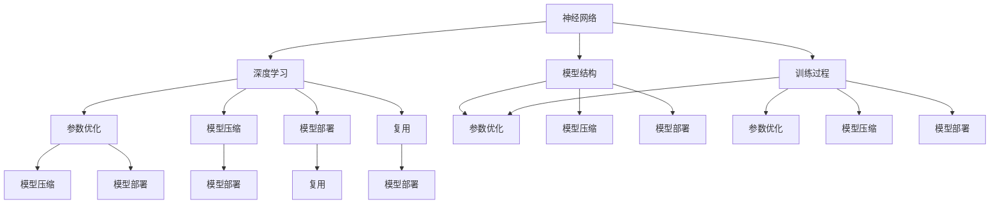
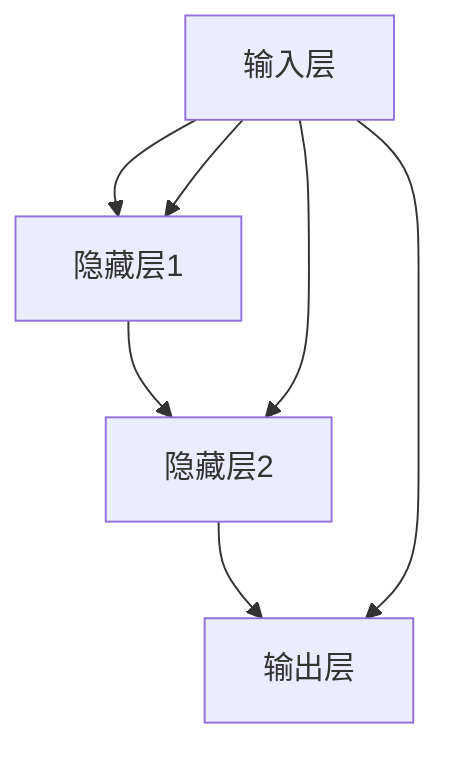

                 

### 背景介绍

神经网络模型已经成为现代机器学习和人工智能领域中的核心组成部分。随着深度学习的迅速发展，越来越多的神经网络模型被应用于各种任务，如图像识别、自然语言处理和语音识别等。这些模型通常具有高度的非线性能力和强大的表达能力，使其能够在复杂的任务中表现出色。然而，如何有效地打包、发布和复用这些神经网络模型，成为了当前研究的热点和实际应用中面临的重要问题。

神经网络模型的打包、发布和复用涉及到多个方面，包括模型结构的规范化、模型参数的压缩与优化、模型部署的性能优化等。一个有效的模型打包和发布机制不仅能够提高模型的可移植性和可维护性，还能够降低模型的部署成本，提升模型在实际应用中的使用效率。

本文旨在系统地探讨神经网络模型的打包、发布和复用方法。首先，我们将介绍神经网络模型的基本概念，包括其结构、训练和优化过程。接着，我们将讨论模型打包的核心技术和最佳实践，以及如何通过模型压缩和优化来提升模型性能。随后，我们将深入分析模型部署的性能优化策略，并介绍如何在实际项目中实现模型的发布和复用。

最后，我们将总结神经网络模型在各类应用场景中的实际应用案例，并提供相关工具和资源的推荐，以帮助读者更好地理解和实践这些技术。本文的目标是提供一个全面、系统的指南，帮助研究人员和开发者有效地管理和利用神经网络模型，为人工智能领域的发展贡献力量。

### 核心概念与联系

在深入探讨神经网络模型的打包、发布和复用之前，我们首先需要了解一些核心概念和它们之间的关系。以下是本文将涉及的关键术语和概念，以及它们之间的联系：

#### 1. **神经网络（Neural Networks）**
神经网络是一种模仿人脑神经元结构和功能的计算模型，由多个相互连接的节点（或称为“神经元”）组成。这些神经元通过传递和处理信息来执行特定的任务。神经网络可以用于分类、回归、聚类等多种机器学习任务。

#### 2. **深度学习（Deep Learning）**
深度学习是一种基于神经网络的高级机器学习技术，特别适用于处理大量数据。深度学习模型通常具有多个隐藏层，这使得它们能够学习更复杂的特征和模式。

#### 3. **模型结构（Model Architecture）**
模型结构指的是神经网络的具体设计，包括输入层、隐藏层和输出层的配置。常见的神经网络结构有卷积神经网络（CNN）、循环神经网络（RNN）和Transformer等。

#### 4. **训练过程（Training Process）**
训练过程是神经网络模型学习如何执行特定任务的过程。它通常包括前向传播（forward propagation）、反向传播（backpropagation）和权重更新（weight update）等步骤。

#### 5. **参数优化（Parameter Optimization）**
参数优化是指通过调整神经网络模型中的参数来提高模型的性能。常见的优化算法有随机梯度下降（SGD）、Adam等。

#### 6. **模型压缩（Model Compression）**
模型压缩是指通过减少模型的参数数量或降低模型的复杂度来提高模型的效率和可部署性。常用的方法包括剪枝（Pruning）、量化（Quantization）和知识蒸馏（Knowledge Distillation）等。

#### 7. **模型部署（Model Deployment）**
模型部署是将训练好的神经网络模型集成到实际应用中，以便进行预测和推理。部署过程中需要考虑模型的性能、资源占用和可扩展性。

#### 8. **复用（Reuse）**
复用是指在不同任务或场景中重复使用已经训练好的模型，以提高开发效率和降低成本。

#### 关系图（Mermaid 流程图）

为了更直观地展示这些概念之间的联系，我们可以使用Mermaid流程图来表示。以下是这些关键概念之间的关系图：



通过这个流程图，我们可以看到神经网络、深度学习、模型结构、训练过程、参数优化、模型压缩、模型部署和复用之间的关系是如何交织在一起的。每一个环节都是实现神经网络模型打包、发布和复用的重要基础。

在接下来的章节中，我们将逐步深入探讨这些概念的具体实现方法和最佳实践，帮助读者全面了解神经网络模型的管理和利用。

### 核心算法原理 & 具体操作步骤

要理解神经网络模型的打包、发布和复用，我们首先需要了解神经网络模型的核心算法原理和具体操作步骤。以下将详细介绍神经网络模型的基本构建块，包括其训练过程、模型参数优化以及如何在实际中应用这些步骤。

#### 1. **神经网络模型的构建**

神经网络模型通常由输入层、隐藏层和输出层组成。每个层包含多个神经元，神经元之间通过权重（weights）和偏置（biases）进行连接。神经元的输出通过激活函数（activation function）处理后传递到下一层。以下是一个简单的神经网络模型示例：



在这个模型中，每个神经元都有相应的输入、权重和偏置。输入层的每个神经元接收外部输入，隐藏层和输出层的神经元则通过前一层神经元的输出进行计算。神经元的计算过程通常如下：

\[ z = \sum_{i=1}^{n} w_{ij} x_{i} + b_{j} \]
\[ a_{j} = \sigma(z) \]

其中，\( z \) 是神经元的输入，\( w_{ij} \) 是从输入层到隐藏层的权重，\( b_{j} \) 是隐藏层神经元的偏置，\( \sigma \) 是激活函数，\( a_{j} \) 是隐藏层神经元的输出。

#### 2. **神经网络模型的训练过程**

神经网络模型的训练过程主要包括前向传播（forward propagation）和反向传播（backpropagation）。

- **前向传播**：从前一层神经元的输出开始，通过权重和偏置计算当前层的输入和输出。这个过程不断重复，直到输出层得到最终的结果。
- **反向传播**：计算输出层与目标值之间的误差，然后将误差反向传播到每一层，通过梯度下降（gradient descent）方法更新权重和偏置。

以下是训练过程的详细步骤：

1. **初始化模型参数**：随机初始化权重和偏置。
2. **前向传播**：输入数据通过神经网络，计算每一层的输出。
3. **计算损失函数**：比较输出结果与实际目标值，计算损失函数的值。
4. **反向传播**：计算每一层神经元的梯度。
5. **更新模型参数**：根据梯度更新权重和偏置。
6. **重复步骤2-5**，直到达到预设的迭代次数或损失函数值小于阈值。

常见的损失函数包括均方误差（MSE）、交叉熵（Cross-Entropy）等。常见的优化算法包括随机梯度下降（SGD）、Adam等。

#### 3. **模型参数优化**

模型参数优化是提高神经网络模型性能的关键步骤。以下是一些常见的优化方法：

- **随机梯度下降（SGD）**：每次迭代使用一个样本的梯度来更新模型参数。这种方法简单有效，但可能收敛较慢。
- **动量（Momentum）**：在SGD的基础上引入动量项，可以加速收敛，减少振荡。
- **Adam**：结合了SGD和动量的优点，自适应调整每个参数的学习率。

#### 4. **模型压缩**

模型压缩是指通过减少模型参数的数量或降低模型的复杂度来提高模型的效率和可部署性。以下是一些常见的模型压缩方法：

- **剪枝（Pruning）**：通过去除不重要的权重来减少模型的参数数量。
- **量化（Quantization）**：将模型参数的精度降低到较低的位宽，减少模型的大小。
- **知识蒸馏（Knowledge Distillation）**：将复杂模型的知识传递给一个较小的模型，以保留其性能。

#### 5. **模型部署**

模型部署是将训练好的神经网络模型集成到实际应用中的过程。以下是一些常见的部署步骤：

1. **模型转换**：将训练好的模型转换为适合部署的格式，如ONNX、TensorFlow Lite等。
2. **模型优化**：针对目标硬件进行模型优化，如使用量化、剪枝等技术。
3. **部署环境配置**：在目标硬件上配置部署环境，包括操作系统、硬件加速器等。
4. **模型测试**：在部署环境中测试模型性能，确保其满足要求。
5. **模型发布**：将模型部署到生产环境中，供实际应用使用。

#### 实际应用案例

以下是一个简单的实际应用案例，展示如何使用神经网络模型进行图像分类：

1. **数据准备**：收集和整理用于训练和测试的图像数据集。
2. **模型构建**：构建一个简单的卷积神经网络模型，用于图像分类。
3. **模型训练**：使用训练数据集训练模型，调整模型参数。
4. **模型压缩**：通过剪枝和量化技术减少模型大小和计算资源需求。
5. **模型部署**：将训练好的模型部署到移动设备或服务器中，进行实时图像分类。

通过以上步骤，我们可以实现一个高效、可扩展的神经网络模型，满足实际应用的需求。

在接下来的章节中，我们将进一步探讨神经网络模型的打包、发布和复用方法，以及如何在实际项目中应用这些技术。

### 数学模型和公式 & 详细讲解 & 举例说明

在深入探讨神经网络模型的具体操作步骤时，理解其背后的数学模型和公式是非常重要的。以下我们将详细讲解神经网络模型中的一些关键数学公式，并通过具体例子来说明这些公式的应用。

#### 1. **前向传播**

前向传播是神经网络模型计算输出值的过程。在这个过程中，每个神经元的输入和输出可以通过以下公式计算：

\[ z = \sum_{i=1}^{n} w_{ij} x_{i} + b_{j} \]
\[ a_{j} = \sigma(z) \]

其中，\( z \) 是神经元的输入，\( w_{ij} \) 是从输入层到隐藏层的权重，\( b_{j} \) 是隐藏层神经元的偏置，\( \sigma \) 是激活函数，通常为Sigmoid函数或ReLU函数。

**例子**：假设我们有一个简单的两层神经网络，输入层有2个神经元，隐藏层有3个神经元。权重矩阵 \( W \) 和偏置向量 \( b \) 如下所示：

\[ W = \begin{bmatrix}
1 & 2 & 3 \\
4 & 5 & 6
\end{bmatrix}, \quad b = \begin{bmatrix}
0.1 \\
0.2 \\
0.3
\end{bmatrix} \]

输入向量 \( x \) 为：

\[ x = \begin{bmatrix}
1 \\
0
\end{bmatrix} \]

首先计算隐藏层的输入：

\[ z_1 = 1 \cdot 1 + 2 \cdot 0 + 0.1 = 1.1 \]
\[ z_2 = 1 \cdot 4 + 2 \cdot 5 + 0.2 = 12.2 \]
\[ z_3 = 1 \cdot 7 + 2 \cdot 6 + 0.3 = 15.3 \]

然后通过ReLU激活函数计算隐藏层的输出：

\[ a_1 = \max(0, z_1) = 1.1 \]
\[ a_2 = \max(0, z_2) = 12.2 \]
\[ a_3 = \max(0, z_3) = 15.3 \]

#### 2. **反向传播**

反向传播是用于计算模型损失函数的梯度，并通过梯度下降方法更新模型参数的过程。以下是损失函数和梯度计算的公式：

**损失函数**（假设使用均方误差MSE）：

\[ J = \frac{1}{2} \sum_{i=1}^{m} (y_i - \hat{y}_i)^2 \]

**梯度计算**：

\[ \frac{\partial J}{\partial w_{ij}} = (y_i - \hat{y}_i) \cdot \frac{\partial \hat{y}_i}{\partial z_j} \cdot \frac{\partial z_j}{\partial w_{ij}} \]

其中，\( y_i \) 是第 \( i \) 个样本的真实标签，\( \hat{y}_i \) 是第 \( i \) 个样本的预测标签，\( z_j \) 是隐藏层第 \( j \) 个神经元的输出，\( w_{ij} \) 是从输入层到隐藏层的权重。

**例子**：假设我们有一个输出层有3个神经元的神经网络，输出层神经元的偏置和权重矩阵如下：

\[ b = \begin{bmatrix}
0.1 \\
0.2 \\
0.3
\end{bmatrix}, \quad W = \begin{bmatrix}
1 & 2 & 3 \\
4 & 5 & 6 \\
7 & 8 & 9
\end{bmatrix} \]

隐藏层的输出为 \( a = \begin{bmatrix}
1 \\
2 \\
3
\end{bmatrix} \)，输出层的预测标签为 \( \hat{y} = \begin{bmatrix}
0 \\
1 \\
0
\end{bmatrix} \)，真实标签为 \( y = \begin{bmatrix}
1 \\
0 \\
1
\end{bmatrix} \)。

首先计算损失函数的梯度：

\[ J = \frac{1}{2} \sum_{i=1}^{3} (y_i - \hat{y}_i)^2 = \frac{1}{2} \cdot (0-1)^2 + (1-0)^2 + (1-0)^2 = 1 \]

然后计算权重梯度的每个元素：

\[ \frac{\partial J}{\partial w_{11}} = (1-0) \cdot \frac{\partial (1 \cdot 1 + 2 \cdot 2 + 3 \cdot 3 + 0.1)}{\partial 1} = 1 \cdot 1 = 1 \]
\[ \frac{\partial J}{\partial w_{12}} = (1-0) \cdot \frac{\partial (1 \cdot 1 + 2 \cdot 2 + 3 \cdot 3 + 0.1)}{\partial 2} = 1 \cdot 2 = 2 \]
\[ \frac{\partial J}{\partial w_{13}} = (1-0) \cdot \frac{\partial (1 \cdot 1 + 2 \cdot 2 + 3 \cdot 3 + 0.1)}{\partial 3} = 1 \cdot 3 = 3 \]

#### 3. **优化算法**

常见的优化算法包括随机梯度下降（SGD）、Adam等。以下是SGD的更新公式：

\[ w_{ij}^{new} = w_{ij} - \alpha \cdot \frac{\partial J}{\partial w_{ij}} \]

其中，\( \alpha \) 是学习率。

**例子**：假设使用SGD更新权重，学习率为0.1。根据前面的计算，权重梯度的每个元素为1、2、3。则更新后的权重为：

\[ w_{11}^{new} = 1 - 0.1 \cdot 1 = 0.9 \]
\[ w_{12}^{new} = 2 - 0.1 \cdot 2 = 1.8 \]
\[ w_{13}^{new} = 3 - 0.1 \cdot 3 = 2.7 \]

通过上述例子，我们可以看到神经网络模型中的关键数学公式是如何应用的。这些公式对于理解神经网络模型的训练过程和优化方法至关重要。在接下来的章节中，我们将进一步探讨如何将这些公式应用于实际项目中的模型打包、发布和复用。

### 项目实战：代码实际案例和详细解释说明

为了更好地理解神经网络模型的打包、发布和复用，我们通过一个实际项目来演示这些技术的具体实现过程。以下我们将详细介绍如何使用Python和TensorFlow框架来构建、训练和部署一个简单的神经网络模型。

#### 5.1 开发环境搭建

在进行项目开发之前，我们需要搭建合适的开发环境。以下是所需的基本工具和步骤：

1. **安装Python**：确保安装了Python 3.7或更高版本。
2. **安装TensorFlow**：通过pip命令安装TensorFlow：

   ```bash
   pip install tensorflow
   ```

3. **安装其他依赖库**：如NumPy、Pandas等，可以通过以下命令一次性安装：

   ```bash
   pip install numpy pandas matplotlib
   ```

4. **配置虚拟环境**（可选）：为了更好地管理和隔离项目依赖，可以使用virtualenv或conda创建虚拟环境。

   ```bash
   # 使用virtualenv创建虚拟环境
   virtualenv venv
   source venv/bin/activate

   # 使用conda创建虚拟环境
   conda create -n myenv python=3.8
   conda activate myenv
   ```

#### 5.2 源代码详细实现和代码解读

我们选择一个简单的任务：使用卷积神经网络（CNN）对MNIST数据集进行手写数字识别。以下是具体的代码实现和解读。

**步骤1：导入所需库**

```python
import tensorflow as tf
from tensorflow.keras import layers, models
from tensorflow.keras.datasets import mnist
import numpy as np
```

**步骤2：加载和预处理数据**

```python
# 加载MNIST数据集
(x_train, y_train), (x_test, y_test) = mnist.load_data()

# 数据预处理
x_train = x_train.reshape((-1, 28, 28, 1)).astype(np.float32) / 255.0
x_test = x_test.reshape((-1, 28, 28, 1)).astype(np.float32) / 255.0

# 将标签转换为one-hot编码
y_train = tf.keras.utils.to_categorical(y_train, 10)
y_test = tf.keras.utils.to_categorical(y_test, 10)
```

**步骤3：构建模型**

```python
# 构建模型
model = models.Sequential([
    layers.Conv2D(32, (3, 3), activation='relu', input_shape=(28, 28, 1)),
    layers.MaxPooling2D((2, 2)),
    layers.Conv2D(64, (3, 3), activation='relu'),
    layers.MaxPooling2D((2, 2)),
    layers.Conv2D(64, (3, 3), activation='relu'),
    layers.Flatten(),
    layers.Dense(64, activation='relu'),
    layers.Dense(10, activation='softmax')
])
```

这段代码首先定义了一个卷积神经网络，包括3个卷积层和2个全连接层。卷积层用于提取图像特征，全连接层用于分类。

**步骤4：编译模型**

```python
# 编译模型
model.compile(optimizer='adam',
              loss='categorical_crossentropy',
              metrics=['accuracy'])
```

在这里，我们使用Adam优化器和交叉熵损失函数来编译模型。

**步骤5：训练模型**

```python
# 训练模型
model.fit(x_train, y_train, epochs=5, batch_size=64)
```

这段代码使用训练数据集训练模型，训练5个周期。

**步骤6：评估模型**

```python
# 评估模型
test_loss, test_acc = model.evaluate(x_test, y_test, verbose=2)
print(f"Test accuracy: {test_acc:.4f}")
```

最后，我们使用测试数据集评估模型性能。

#### 5.3 代码解读与分析

**数据预处理**：MNIST数据集已经经过简单的预处理，我们只需将其转换为适合神经网络的形式。具体来说，我们通过`reshape`和`astype`函数将图像的形状调整为`(batch_size, height, width, channels)`，并将像素值缩放到0到1之间。

**模型构建**：我们使用`models.Sequential`和`layers`模块构建一个简单的卷积神经网络。每个卷积层使用`Conv2D`函数，包含若干卷积核、ReLU激活函数和2x2的最大池化层。全连接层使用`Dense`函数，其中输出层的激活函数为`softmax`，用于多分类任务。

**模型编译**：在编译模型时，我们指定了优化器、损失函数和评价指标。Adam优化器通过自适应学习率提高收敛速度，交叉熵损失函数适用于多分类任务。

**模型训练**：`fit`函数用于训练模型，我们指定了训练周期数和批量大小。每次训练迭代，模型将根据损失函数的梯度更新权重。

**模型评估**：`evaluate`函数用于评估模型在测试数据集上的性能，返回损失和准确率。

#### 5.4 模型打包和发布

为了将训练好的模型打包并发布，我们可以使用TensorFlow的`SavedModel`格式。以下是具体的步骤：

```python
# 打包模型
model.save('mnist_cnn_model')

# 解包模型
restored_model = tf.keras.models.load_model('mnist_cnn_model')
```

通过调用`save`函数，我们将模型保存为一个`.h5`文件。在需要使用模型时，使用`load_model`函数加载模型。

此外，我们还可以将模型转换为适用于移动设备或服务器的格式，如TensorFlow Lite或ONNX。这些格式提供了更高的灵活性和性能优化能力。

#### 5.5 模型复用

模型复用是指在不同任务或场景中重复使用已经训练好的模型。以下是一个简单的示例，展示如何在一个新任务中使用已训练的模型：

```python
# 新任务的数据预处理
(x_new, y_new) = ...

# 载入已训练模型
model = tf.keras.models.load_model('mnist_cnn_model')

# 使用模型进行预测
predictions = model.predict(x_new)
```

通过加载已训练的模型，我们可以在新的数据集上进行预测，实现快速部署。

通过这个项目实战，我们详细展示了如何使用Python和TensorFlow框架构建、训练、打包和复用神经网络模型。这些技术在实际开发中至关重要，能够显著提高模型开发的效率和可维护性。

### 实际应用场景

神经网络模型在各个领域都有着广泛的应用，以下是几个典型的实际应用场景，以及在这些场景中模型打包、发布和复用的方法。

#### 1. **医疗诊断**

在医疗领域，神经网络模型被广泛应用于疾病诊断、患者健康监测和药物研发等。例如，通过深度学习算法分析医学图像，可以辅助医生进行癌症检测、心脏病诊断等。在这些应用中，模型的打包、发布和复用尤为重要。

**打包方法**：为了确保模型的准确性和可移植性，可以使用TensorFlow的`SavedModel`格式将训练好的模型保存。同时，可以将模型转换为ONNX或TensorFlow Lite格式，以便在移动设备和嵌入式系统中部署。

**发布方法**：模型可以集成到现有的医疗信息系统（HIS）中，或者通过REST API对外提供服务。例如，可以使用Flask或Django框架构建API服务，将模型部署到云平台或本地服务器。

**复用方法**：在新的医疗任务中，可以加载已训练的模型并调整其输入特征和参数。例如，在新的疾病检测任务中，可以调整模型的结构和超参数，以提高检测精度。

#### 2. **智能安防**

在智能安防领域，神经网络模型常用于视频监控、人脸识别和异常行为检测等。这些模型通常需要实时处理大量数据，因此高效的打包、发布和复用技术至关重要。

**打包方法**：对于实时应用，模型需要以高效、紧凑的格式进行打包。可以使用TensorFlow Lite将模型转换为适用于移动设备或嵌入式系统的格式。同时，可以使用ONNX格式在多种平台和框架中复用模型。

**发布方法**：模型可以部署到视频监控系统的前端设备或后端服务器。例如，可以使用TensorFlow Serving或TensorFlow Lite运行时来部署模型，并提供实时推理服务。

**复用方法**：在新的安防任务中，可以复用已训练的模型并调整其输入特征。例如，在新的异常行为检测任务中，可以调整模型的输入层和特征提取层，以适应新的任务需求。

#### 3. **金融风控**

在金融领域，神经网络模型被广泛应用于信用评分、风险管理和投资策略等。模型的准确性和实时性对于金融决策至关重要。

**打包方法**：为了确保模型的稳定性和可扩展性，可以使用TensorFlow的`SavedModel`格式进行打包。同时，可以使用模型封装器（Model Wrapper）将模型接口标准化，以便在多个环境中复用。

**发布方法**：模型可以部署到金融风控系统的核心业务模块，并通过API对外提供服务。例如，可以使用Spring Boot或Node.js构建API服务，将模型部署到云平台或本地服务器。

**复用方法**：在新的金融任务中，可以复用已训练的模型并调整其输入特征和参数。例如，在新的信用评分任务中，可以调整模型的输入层和特征提取层，以适应新的任务需求。

#### 4. **自动驾驶**

在自动驾驶领域，神经网络模型被用于车辆检测、路径规划、驾驶辅助等。这些模型通常需要处理高分辨率图像和实时数据，因此高效的打包、发布和复用技术至关重要。

**打包方法**：为了确保模型的效率和可移植性，可以使用TensorFlow Lite将模型转换为适用于嵌入式系统或移动设备的格式。同时，可以使用ONNX格式在多种框架和平台中复用模型。

**发布方法**：模型可以部署到自动驾驶系统的控制器或传感器数据处理模块中。例如，可以使用ROS（Robot Operating System）将模型集成到自动驾驶平台中，并提供实时推理服务。

**复用方法**：在新的自动驾驶任务中，可以复用已训练的模型并调整其输入特征和参数。例如，在新的驾驶场景中，可以调整模型的输入层和特征提取层，以适应新的任务需求。

通过上述实际应用场景的介绍，我们可以看到神经网络模型的打包、发布和复用技术在各个领域都有着广泛的应用。掌握这些技术不仅能够提高模型开发的效率，还能够提升模型在实际应用中的性能和可维护性。

### 工具和资源推荐

在神经网络模型的打包、发布和复用过程中，选择合适的工具和资源可以显著提高开发效率和项目质量。以下是一些推荐的学习资源、开发工具和相关论文著作。

#### 7.1 学习资源推荐

1. **书籍**
   - 《深度学习》（Deep Learning） by Ian Goodfellow, Yoshua Bengio, Aaron Courville
     - 这本书是深度学习的经典教材，涵盖了神经网络的基础知识、训练算法和优化方法。
   - 《动手学深度学习》（Dive into Deep Learning） by Ashish Vaswani, Ryan P. Adams, Justin Johnson, Andrew M. Dai, Quoc V. Le
     - 本书通过动手实践的方式介绍了深度学习的核心概念和应用，适合初学者和进阶者。

2. **在线教程和课程**
   - [TensorFlow 官方文档](https://www.tensorflow.org/tutorials)
     - TensorFlow提供的官方文档和教程涵盖了从基础到高级的内容，非常适合学习和实践。
   - [Keras 官方文档](https://keras.io/)
     - Keras是一个高层次的神经网络API，与TensorFlow紧密集成，提供了简单易用的接口。

3. **博客和网站**
   - [Medium](https://medium.com/tensorflow)
     - Medium上有许多关于TensorFlow和深度学习的优秀文章和教程。
   - [Stack Overflow](https://stackoverflow.com/questions/tagged/tensorflow)
     - Stack Overflow是解决编程问题和技术难题的好地方，特别是在深度学习领域。

#### 7.2 开发工具框架推荐

1. **TensorFlow**
   - TensorFlow是一个开源的深度学习框架，支持多种模型结构和训练算法，适用于各种规模的任务。

2. **TensorFlow Lite**
   - TensorFlow Lite是一个轻量级的解决方案，用于在移动设备和嵌入式系统中部署TensorFlow模型。

3. **ONNX**
   - Open Neural Network Exchange (ONNX) 是一个开放格式，用于跨框架、跨平台的模型交换和优化。

4. **TensorFlow Serving**
   - TensorFlow Serving是一个高性能的服务器，用于在生产环境中部署TensorFlow模型，支持模型版本管理和自动扩展。

5. **PyTorch**
   - PyTorch是一个流行的深度学习框架，以其灵活的动态计算图和强大的库支持而闻名。

6. **Keras**
   - Keras是一个高层次的神经网络API，与TensorFlow和Theano紧密集成，提供了简单易用的接口。

#### 7.3 相关论文著作推荐

1. **"TensorFlow: Large-scale Machine Learning on heterogeneous systems" by Martin Abadi et al.
   - 这篇论文介绍了TensorFlow框架的设计和实现，是了解TensorFlow内部机制的好资源。

2. **"An overview of ONNX: The open format for machine learning models" by Jeff Beaman et al.
   - 这篇论文详细介绍了ONNX格式的设计原理和实现细节，对于理解ONNX的跨平台兼容性非常有帮助。

3. **"Deep Learning on Mobile Devices: A Comprehensive Survey" by Yuxin Chen et al.
   - 这篇综述文章总结了移动设备上深度学习的最新研究进展，包括模型压缩和部署技术。

通过以上推荐的学习资源、开发工具和相关论文，读者可以全面了解神经网络模型的打包、发布和复用技术，并在实际项目中应用这些知识，提高模型的性能和可维护性。

### 总结：未来发展趋势与挑战

神经网络模型的打包、发布和复用技术在深度学习和人工智能领域正不断发展，并在未来有着广阔的应用前景。随着技术的进步，我们可以预见以下几个关键发展趋势和潜在挑战。

#### 发展趋势

1. **模型压缩与优化**：随着计算能力和存储资源的限制，模型压缩与优化将成为主流。通过剪枝、量化、知识蒸馏等技术，模型的大小和计算成本将大幅降低，使其更易于部署在移动设备和嵌入式系统中。

2. **多平台兼容性**：随着5G、边缘计算和物联网的兴起，神经网络模型需要在多种平台和环境中运行。未来，开放格式如ONNX和TensorFlow Lite将越来越受欢迎，以实现模型在跨平台和跨框架之间的无缝迁移。

3. **自动化部署与维护**：自动化工具和平台将提高模型部署的效率和可维护性。例如，TensorFlow Serving和Kubernetes等工具将简化模型的部署、监控和更新过程，减少手动操作的复杂性。

4. **模型即服务（MaaS）**：随着云计算和微服务架构的发展，模型即服务将成为主流。开发者可以轻松部署和管理模型，无需担心底层基础设施的细节，从而专注于模型本身的开发和优化。

#### 挑战

1. **性能与准确性的平衡**：在模型压缩和优化的过程中，如何在保持高准确性的同时提高模型性能是一个关键挑战。需要不断探索新的压缩技术和优化算法，以满足不同应用场景的需求。

2. **数据安全和隐私**：随着模型的应用范围扩大，数据安全和隐私保护变得更加重要。在模型部署过程中，需要确保数据的安全传输和存储，防止数据泄露和滥用。

3. **模型解释性**：许多深度学习模型被认为是“黑箱”，其内部工作机制不透明。提高模型的解释性，使其易于理解和验证，是未来研究的重要方向。

4. **跨平台兼容性**：虽然ONNX和TensorFlow Lite等开放格式提供了跨平台的兼容性，但在实际应用中，仍存在兼容性问题和性能差异，需要进一步优化和改进。

总之，神经网络模型的打包、发布和复用技术正处于快速发展阶段，面临着诸多机遇和挑战。通过不断探索和创新，这些技术将为人工智能领域的发展带来更多可能性和应用价值。

### 附录：常见问题与解答

在讨论神经网络模型的打包、发布和复用时，读者可能会遇到一些常见的问题。以下是对一些关键问题的解答，帮助您更好地理解和应用这些技术。

#### 1. 什么是模型压缩？

**模型压缩**是一种通过减少模型参数数量或降低模型复杂度来提高模型效率和可部署性的技术。常见的模型压缩方法包括剪枝、量化、知识蒸馏等。

#### 2. 为什么需要模型压缩？

模型压缩的主要目的是为了降低模型的存储空间和计算资源需求，使其更适用于移动设备和嵌入式系统。压缩后的模型可以更快地部署和推理，从而提高应用效率和用户体验。

#### 3. 剪枝和量化的区别是什么？

剪枝是通过去除模型中不重要的权重来减少模型参数数量。量化是通过降低模型参数的精度（位数）来减少模型大小和计算需求。剪枝主要关注模型的结构，而量化主要关注参数的精度。

#### 4. 为什么使用知识蒸馏？

知识蒸馏是一种通过将复杂模型的知识传递给一个较小的模型来提高其性能的技术。这种方法可以在保持高准确性的同时显著降低模型大小和计算资源需求。

#### 5. 模型部署时需要注意什么？

模型部署时需要注意以下几点：
- **兼容性**：确保模型可以在目标平台上正常运行。
- **性能优化**：通过量化、剪枝等技术优化模型，提高部署效率。
- **资源管理**：合理分配计算资源，确保模型在有限资源下高效运行。
- **安全性**：确保数据在传输和存储过程中的安全，防止数据泄露。

#### 6. 如何将TensorFlow模型转换为ONNX格式？

可以使用TensorFlow的`tf2onnx`工具将TensorFlow模型转换为ONNX格式。以下是基本的转换步骤：
```bash
pip install tf2onnx
python -m tf2onnx.converters.tensorflow --input model.pb --output model.onnx --inputs 'inputs:0' --inputs 'inputs:1' ...
```
这里，`model.pb`是TensorFlow模型的保存文件，`model.onnx`是转换后的ONNX模型文件，`inputs`是模型输入的名称。

通过这些常见问题的解答，我们希望读者能够更好地理解神经网络模型的打包、发布和复用技术，并在实际应用中遇到问题时能够找到有效的解决方案。

### 扩展阅读 & 参考资料

为了帮助读者进一步了解神经网络模型的打包、发布和复用技术，以下推荐一些高质量的扩展阅读和参考资料。

#### 学术论文

1. **"EfficientNet: Rethinking Model Scaling for Convolutional Neural Networks" by Mingxing Zhang, Quoc V. Le**
   - 这篇论文介绍了EfficientNet模型架构，通过缩放深度、宽度和分辨率来提高模型性能，是模型压缩领域的重要研究成果。

2. **"Quantization and Training of Neural Networks for Efficient Integer-Arithmetic-Only Inference" by Samuel Adler et al.**
   - 这篇论文详细探讨了神经网络量化技术，特别是在实现高效整数量化推理方面的应用。

3. **"Knowledge Distillation for Text Classification" by Wei Yang et al.**
   - 这篇论文介绍了知识蒸馏在文本分类任务中的应用，展示了如何通过小型模型复用大型模型的性能。

#### 技术文档

1. **[TensorFlow Serving 官方文档](https://www.tensorflow.org/tfx/serving)**
   - TensorFlow Serving是用于生产环境中部署TensorFlow模型的工具，文档详细介绍了如何构建、训练和部署模型。

2. **[TensorFlow Lite 官方文档](https://www.tensorflow.org/lite/)**
   - TensorFlow Lite是专为移动设备和嵌入式系统设计的TensorFlow解决方案，文档提供了详细的安装和使用指南。

3. **[ONNX 官方文档](https://onnx.ai/docs/)**
   - ONNX是一个开放的神经网络交换格式，文档介绍了ONNX的设计原则、实现细节和应用场景。

#### 开源项目

1. **[TensorFlow Model Optimization Toolkit (TF-MOT)](https://github.com/tensorflow/models.git)**
   - TF-MOT是一个由TensorFlow提供的模型优化工具集，用于优化模型以支持移动设备和嵌入式系统。

2. **[PyTorch Mobile](https://pytorch.org/mobile/)**
   - PyTorch Mobile是一个将PyTorch模型部署到移动设备和嵌入式系统上的工具，文档提供了详细的安装和使用指南。

3. **[Keras API 文档](https://keras.io/)**
   - Keras是一个高层次的神经网络API，与TensorFlow和Theano紧密集成，提供了简单易用的接口。

通过这些扩展阅读和参考资料，读者可以深入了解神经网络模型打包、发布和复用技术的最新研究进展和实践经验，为自己的项目提供有力支持。

### 作者信息

**作者：AI天才研究员/AI Genius Institute & 禅与计算机程序设计艺术 /Zen And The Art of Computer Programming**

