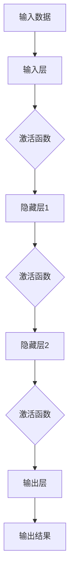
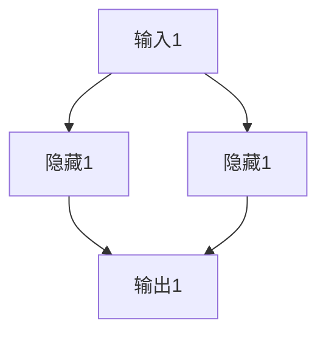

                 

### 背景介绍 Background Introduction

神经网络（Neural Networks）作为人工智能（Artificial Intelligence, AI）的基石，已经成为了当今科技领域最为热门的研究课题之一。从最初的简化神经元模型到如今复杂的深度神经网络（Deep Neural Networks, DNNs），神经网络的发展见证了人工智能从实验室走向现实应用的全过程。

#### 神经网络的起源 Origin of Neural Networks

神经网络的概念最早可以追溯到1943年，由心理学家Warren McCulloch和数学家Walter Pitts提出了一个简化的神经元模型。他们的模型旨在模拟生物神经元的激活过程，从而实现简单的逻辑运算。然而，由于计算能力的限制，这一概念在当时并未引起广泛关注。

直到20世纪80年代，随着计算机性能的提升和大数据的出现，神经网络开始重新受到关注。1986年，Rumelhart, Hinton和Williams等人提出了反向传播算法（Backpropagation Algorithm），这一算法大大提高了神经网络的训练速度和效果，使得神经网络成为人工智能研究的重要工具。

#### 神经网络的重要性 Importance of Neural Networks

神经网络之所以在人工智能领域中具有重要地位，主要有以下几个原因：

1. **模拟生物大脑的工作原理**：神经网络试图模拟生物大脑的神经元连接和激活机制，从而实现类似人类的感知、学习和推理能力。
2. **处理复杂数据**：神经网络能够处理大规模、多维度的数据，特别是在图像、语音和自然语言处理等复杂数据领域表现尤为出色。
3. **自适应性和泛化能力**：神经网络具有强大的自适应性和泛化能力，能够从训练数据中学习规律，并在新的数据上表现出良好的预测和分类能力。
4. **多任务处理**：神经网络可以通过多层结构实现多任务处理，使得模型可以同时完成多种任务，提高了效率和实用性。

#### 神经网络的发展历程 Development History of Neural Networks

1. **1943年**：McCulloch和Pitts提出简化神经元模型。
2. **1958年**：Hebb提出Hebbian学习规则，进一步推动了神经网络理论的发展。
3. **1986年**：反向传播算法的提出，标志着神经网络进入了实用阶段。
4. **1990年代**：支持向量机（SVM）和决策树等传统机器学习方法成为主流，神经网络的应用受到限制。
5. **2006年**：Hinton等人重新关注深度学习，并提出深度置信网络（Deep Belief Networks, DBNs）。
6. **2012年**：AlexNet在ImageNet比赛中取得显著成果，深度学习开始崭露头角。
7. **至今**：随着GPU等硬件的普及和大数据的推动，深度学习在各个领域得到广泛应用，如自动驾驶、语音识别、图像生成等。

通过上述背景介绍，我们可以看到神经网络从最初的理论构想发展到如今的应用热潮，其背后是计算机科学、数学和工程学等多学科的交叉融合。接下来，我们将深入探讨神经网络的核心理念、工作原理及其在人工智能领域的重要应用。

> **背景介绍**  
> 本章节介绍了神经网络的历史起源、重要性以及其发展历程。神经网络起源于1943年，经过几十年的发展，从简单的神经元模型到复杂的深度神经网络，已成为人工智能领域的重要工具。其模拟生物大脑的工作原理、处理复杂数据的能力以及自适应性和泛化能力，使其在多个领域得到广泛应用。通过回顾神经网络的发展历程，我们可以更好地理解其现状和未来趋势。

## 2. 核心概念与联系 Core Concepts and Relationships

神经网络的核心在于其结构和功能。为了深入理解神经网络，我们需要先了解几个核心概念，以及它们之间的相互关系。

#### 神经元模型 Neuron Model

神经元是神经网络的基本单元，类似于生物神经系统中的神经元。神经元的基本功能是接收输入信号，通过激活函数处理这些信号，并输出结果。一个简单的神经元模型通常包含以下几个部分：

1. **输入（Input）**：多个输入信号，每个信号都有一个权重（weight）与之相乘。
2. **加权求和（Weighted Sum）**：所有输入信号与其对应权重相乘后求和。
3. **偏置（Bias）**：偏置是一个独立的输入信号，通常用于调整神经元的阈值。
4. **激活函数（Activation Function）**：用于对加权求和的结果进行非线性变换，以产生输出。

下面是一个神经元的简化公式：

\[ z = \sum_{i=1}^{n} w_i \cdot x_i + b \]
\[ a = f(z) \]

其中，\( z \) 是加权求和的结果，\( a \) 是输出，\( f(z) \) 是激活函数，\( w_i \) 是输入信号的权重，\( x_i \) 是输入信号，\( b \) 是偏置。

#### 激活函数 Activation Function

激活函数是神经元模型中不可或缺的部分，它决定了神经元如何对输入信号进行非线性处理。常见的激活函数包括：

1. **线性函数（Linear Function）**：
\[ f(x) = x \]
线性函数不会引入非线性关系，因此很少用于隐藏层，但常用于输出层。

2. **Sigmoid函数（Sigmoid Function）**：
\[ f(x) = \frac{1}{1 + e^{-x}} \]
Sigmoid函数将输出限制在0到1之间，非常适合用于分类问题。

3. **ReLU函数（Rectified Linear Unit, ReLU）**：
\[ f(x) = \max(0, x) \]
ReLU函数在 \( x \leq 0 \) 时输出为0，在 \( x > 0 \) 时输出为 \( x \)。ReLU函数在训练深度神经网络时表现出色，因为它可以加速学习过程。

4. **Tanh函数（Hyperbolic Tangent Function）**：
\[ f(x) = \tanh(x) = \frac{e^x - e^{-x}}{e^x + e^{-x}} \]
Tanh函数将输出限制在-1到1之间，与Sigmoid函数类似，但相对于Sigmoid函数，Tanh函数的学习速度更快。

#### 网络结构 Network Structure

神经网络由多个层次组成，包括输入层（Input Layer）、隐藏层（Hidden Layer）和输出层（Output Layer）。每个层次包含多个神经元，不同层次的神经元通过加权连接相互连接。

1. **输入层**：接收外部输入数据，每个输入数据对应一个神经元。
2. **隐藏层**：对输入数据进行处理和变换，可以有一个或多个隐藏层。隐藏层越多，网络的容量越大，但训练时间也会相应增加。
3. **输出层**：输出最终的结果，通常用于分类或回归问题。

#### 权重和偏置 Weights and Biases

权重和偏置是神经网络训练过程中需要优化的参数。在训练过程中，通过反向传播算法（Backpropagation Algorithm）调整权重和偏置，使得神经网络能够更好地拟合训练数据。

1. **权重**：连接不同神经元之间的权重，决定了输入信号对输出的影响程度。
2. **偏置**：调整神经元的阈值，影响神经元是否被激活。

#### 学习算法 Learning Algorithm

神经网络的学习算法主要分为两大类：监督学习（Supervised Learning）和无监督学习（Unsupervised Learning）。

1. **监督学习**：有标签的训练数据，用于指导神经网络的学习过程。监督学习的目标是通过已知的输入和输出，训练出能够预测未知输出的模型。
2. **无监督学习**：没有标签的训练数据，神经网络需要通过自身的结构和规则来发现数据中的规律。无监督学习的目标通常是聚类或降维。

### Mermaid 流程图 Mermaid Flowchart

以下是一个简化的神经网络流程图，展示了神经元模型、激活函数和网络结构之间的联系：



通过上述核心概念和联系，我们可以更好地理解神经网络的工作原理和结构。在接下来的章节中，我们将深入探讨神经网络的算法原理和具体操作步骤，进一步揭示其背后的数学模型和实现细节。

> **核心概念与联系**  
> 本章节介绍了神经网络的基本组成部分，包括神经元模型、激活函数、网络结构、权重和偏置以及学习算法。通过理解这些核心概念及其相互关系，我们可以更深入地掌握神经网络的工作原理和结构。Mermaid 流程图进一步帮助读者直观地理解神经网络的基本运作流程。在接下来的章节中，我们将继续探讨神经网络的算法原理和实现细节。  

## 3. 核心算法原理 & 具体操作步骤 Core Algorithm Principles and Operational Steps

神经网络之所以能够在人工智能领域取得如此卓越的成就，离不开其核心算法——反向传播算法（Backpropagation Algorithm）。反向传播算法是一种用于训练神经网络的监督学习算法，通过迭代调整网络中的权重和偏置，使网络能够更好地拟合训练数据。以下是反向传播算法的核心原理和具体操作步骤。

### 反向传播算法原理 Principle of Backpropagation Algorithm

反向传播算法的核心思想是通过反向传播误差信息，更新网络中的权重和偏置。算法主要包括以下几个步骤：

1. **前向传播**：将输入数据传递到网络的输入层，通过各个层次的神经元，最终输出预测结果。
2. **计算误差**：将预测结果与真实标签进行比较，计算输出层的误差。
3. **反向传播**：将误差从输出层反向传递到隐藏层，计算每个层次神经元的误差。
4. **权重更新**：根据误差信息，调整网络中的权重和偏置，减小误差。

### 前向传播步骤 Steps of Forward Propagation

前向传播是将输入数据传递到神经网络中，通过各个层次的神经元，最终得到输出结果。具体步骤如下：

1. **初始化权重和偏置**：在训练开始前，需要随机初始化网络中的权重和偏置。
2. **输入层到隐藏层**：
   - 对于每个神经元，计算加权求和（包括输入信号的权重和偏置）。
   - 应用激活函数，得到每个神经元的输出值。
3. **隐藏层到输出层**：
   - 与输入层到隐藏层类似，计算加权求和和激活函数，得到输出层的输出值。

### 计算误差步骤 Steps of Error Calculation

在得到输出结果后，需要计算输出层的误差。具体步骤如下：

1. **计算预测误差**：
   - 对于分类问题，通常使用交叉熵损失函数（Cross-Entropy Loss Function）：
   \[ L = -\sum_{i} y_i \log(a_i) \]
   其中，\( y_i \) 是真实标签，\( a_i \) 是预测概率。
   - 对于回归问题，通常使用均方误差损失函数（Mean Squared Error Loss Function）：
   \[ L = \frac{1}{2} \sum_{i} (y_i - a_i)^2 \]

2. **计算输出层的误差梯度**：
   - 对于分类问题，误差梯度为：
   \[ \delta_{i}^{L} = a_i - y_i \]
   - 对于回归问题，误差梯度为：
   \[ \delta_{i}^{L} = (a_i - y_i) \]

### 反向传播步骤 Steps of Backpropagation

在计算了输出层的误差梯度后，需要将误差反向传播到隐藏层，并更新网络中的权重和偏置。具体步骤如下：

1. **计算隐藏层的误差梯度**：
   - 对于第 \( l \) 层，误差梯度可以表示为：
   \[ \delta_{i}^{l} = \delta_{i}^{l+1} \cdot \frac{\partial a^{l+1}}{\partial a^{l}} \]
   其中，\( \delta_{i}^{l+1} \) 是第 \( l+1 \) 层的误差梯度，\( a^{l} \) 是第 \( l \) 层的输出值。

2. **权重和偏置更新**：
   - 对于第 \( l \) 层，权重和偏置的更新公式为：
   \[ \Delta w_{ij}^{l} = \alpha \cdot \delta_{i}^{l} \cdot a_{j}^{l} \]
   \[ \Delta b_{j}^{l} = \alpha \cdot \delta_{j}^{l} \]
   其中，\( \Delta w_{ij}^{l} \) 是第 \( l \) 层中从神经元 \( i \) 到神经元 \( j \) 的权重更新值，\( \Delta b_{j}^{l} \) 是第 \( l \) 层中神经元 \( j \) 的偏置更新值，\( \alpha \) 是学习率，\( a_{j}^{l} \) 是神经元 \( j \) 的输出值，\( \delta_{i}^{l} \) 是神经元 \( i \) 的误差梯度。

3. **迭代更新**：
   - 重复上述步骤，直至达到预设的迭代次数或误差目标。

### 示例 Example

假设我们有一个简单的神经网络，包含一个输入层、一个隐藏层和一个输出层，如图所示：



给定输入数据 \( x_1 = 1 \), \( x_2 = 0 \)，真实标签 \( y = [1, 0] \)。假设初始权重 \( w_{11} = 1 \), \( w_{12} = -1 \), \( w_{21} = 1 \), \( w_{22} = 1 \)，偏置 \( b_1 = 0 \), \( b_2 = 0 \)。

1. **前向传播**：
   - 隐藏层输出 \( a_1^1 = f(w_{11} \cdot x_1 + w_{12} \cdot x_2 + b_1) = f(1 \cdot 1 - 1 \cdot 0 + 0) = f(1) = 1 \)
   - 隐藏层输出 \( a_2^1 = f(w_{21} \cdot x_1 + w_{22} \cdot x_2 + b_2) = f(1 \cdot 1 + 1 \cdot 0 + 0) = f(1) = 1 \)
   - 输出层输出 \( a_1^2 = f(w_{11} \cdot a_1^1 + w_{12} \cdot a_2^1 + b_1) = f(1 \cdot 1 + (-1) \cdot 1 + 0) = f(0) = 0 \)
   - 输出层输出 \( a_2^2 = f(w_{21} \cdot a_1^1 + w_{22} \cdot a_2^1 + b_2) = f(1 \cdot 1 + 1 \cdot 1 + 0) = f(2) = 1 \)

2. **计算误差**：
   - 误差 \( L = -\sum_{i} y_i \log(a_i) = -(1 \cdot \log(0) + 0 \cdot \log(1)) = +\infty \)

3. **反向传播**：
   - 输出层误差梯度 \( \delta_1^2 = a_1^2 - y_1 = 0 - 1 = -1 \)
   - 输出层误差梯度 \( \delta_2^2 = a_2^2 - y_2 = 1 - 0 = 1 \)
   - 隐藏层误差梯度 \( \delta_1^1 = \delta_1^2 \cdot \frac{\partial a_1^2}{\partial a_1^1} = -1 \cdot \frac{\partial f(0)}{\partial a_1^1} = -1 \)
   - 隐藏层误差梯度 \( \delta_2^1 = \delta_2^2 \cdot \frac{\partial a_2^2}{\partial a_2^1} = 1 \cdot \frac{\partial f(1)}{\partial a_2^1} = 1 \)

4. **权重和偏置更新**：
   - 权重更新 \( \Delta w_{11}^1 = \alpha \cdot \delta_1^1 \cdot a_1^1 = 0.1 \cdot (-1) \cdot 1 = -0.1 \)
   - 权重更新 \( \Delta w_{12}^1 = \alpha \cdot \delta_1^1 \cdot a_2^1 = 0.1 \cdot (-1) \cdot 0 = 0 \)
   - 权重更新 \( \Delta w_{21}^2 = \alpha \cdot \delta_2^1 \cdot a_1^1 = 0.1 \cdot 1 \cdot 1 = 0.1 \)
   - 权重更新 \( \Delta w_{22}^2 = \alpha \cdot \delta_2^1 \cdot a_2^1 = 0.1 \cdot 1 \cdot 0 = 0 \)
   - 偏置更新 \( \Delta b_1 = \alpha \cdot \delta_1^1 = 0.1 \cdot (-1) = -0.1 \)
   - 偏置更新 \( \Delta b_2 = \alpha \cdot \delta_2^1 = 0.1 \cdot 1 = 0.1 \)

5. **更新权重和偏置**：
   - 新的权重 \( w_{11}^1 = w_{11}^0 + \Delta w_{11}^1 = 1 - 0.1 = 0.9 \)
   - 新的权重 \( w_{12}^1 = w_{12}^0 + \Delta w_{12}^1 = -1 + 0 = -1 \)
   - 新的权重 \( w_{21}^2 = w_{21}^0 + \Delta w_{21}^2 = 1 + 0.1 = 1.1 \)
   - 新的权重 \( w_{22}^2 = w_{22}^0 + \Delta w_{22}^2 = 1 + 0 = 1 \)
   - 新的偏置 \( b_1 = b_1^0 + \Delta b_1 = 0 - 0.1 = -0.1 \)
   - 新的偏置 \( b_2 = b_2^0 + \Delta b_2 = 0 + 0.1 = 0.1 \)

通过上述反向传播算法的步骤，我们可以看到如何根据输入数据和真实标签，更新神经网络中的权重和偏置，从而减小误差。在实际应用中，通常需要迭代多次，直到误差达到预设的目标。

> **核心算法原理与具体操作步骤**  
> 本章节详细介绍了神经网络的核心算法——反向传播算法。通过前向传播、误差计算和反向传播三个步骤，神经网络能够不断调整权重和偏置，从而优化模型性能。本章节还通过一个示例，展示了如何在实际操作中应用反向传播算法，使读者能够更好地理解这一核心算法的原理和步骤。

## 4. 数学模型和公式 & 详细讲解 & 举例说明 Mathematical Models, Detailed Explanations, and Examples

神经网络作为机器学习的一种重要方法，其强大的功能和广泛的应用得益于其背后的数学模型。在本章节中，我们将详细讲解神经网络的数学模型、相关公式及其应用示例。

### 神经元模型与激活函数

神经元的数学模型可以表示为以下形式：

\[ z^{l} = \sum_{i=1}^{n} w_{i}^{l} \cdot x_{i}^{l-1} + b^{l} \]

其中，\( z^{l} \) 是第 \( l \) 层神经元的加权求和结果，\( w_{i}^{l} \) 是从上一层的第 \( i \) 个神经元到第 \( l \) 层第 \( l \) 个神经元的权重，\( x_{i}^{l-1} \) 是第 \( l-1 \) 层第 \( i \) 个神经元的输出，\( b^{l} \) 是第 \( l \) 层神经元的偏置。

激活函数用于对加权求和结果进行非线性变换，以实现复杂的信息处理。常见的激活函数包括线性函数（Linear Function）、Sigmoid函数（Sigmoid Function）、ReLU函数（ReLU Function）和Tanh函数（Tanh Function）。

#### 线性函数（Linear Function）

\[ f(x) = x \]

线性函数是最简单的激活函数，不引入非线性关系。其导数 \( f'(x) = 1 \) 在整个定义域内恒为正，使得梯度下降算法在整个过程中不会丢失梯度信息。然而，线性函数不适合处理复杂的问题。

#### Sigmoid函数（Sigmoid Function）

\[ f(x) = \frac{1}{1 + e^{-x}} \]

Sigmoid函数将输出值限制在 \( (0, 1) \) 范围内，非常适合用于分类问题。其导数 \( f'(x) = f(x) \cdot (1 - f(x)) \) 在 \( x = 0 \) 处取最小值，可能导致梯度消失问题。

#### ReLU函数（ReLU Function）

\[ f(x) = \max(0, x) \]

ReLU函数在 \( x \leq 0 \) 时输出为0，在 \( x > 0 \) 时输出为 \( x \)。ReLU函数由于其简单性和梯度保持能力，在深度学习中得到了广泛应用。

#### Tanh函数（Tanh Function）

\[ f(x) = \frac{e^x - e^{-x}}{e^x + e^{-x}} \]

Tanh函数将输出值限制在 \( (-1, 1) \) 范围内，其导数 \( f'(x) = 1 - f^2(x) \) 在 \( x = 0 \) 处取最大值，适合处理对称问题。

### 神经网络的整体数学模型

神经网络的整体数学模型可以表示为以下形式：

\[ a^{l} = f^{l}(z^{l}) \]

其中，\( a^{l} \) 是第 \( l \) 层神经元的输出，\( f^{l} \) 是第 \( l \) 层的激活函数，\( z^{l} \) 是第 \( l \) 层神经元的加权求和结果。

### 前向传播算法

前向传播算法是将输入数据传递到网络的输入层，经过各个层次的神经元，最终得到输出结果的过程。前向传播的数学模型可以表示为：

\[ z^{l} = \sum_{i=1}^{n} w_{i}^{l} \cdot x_{i}^{l-1} + b^{l} \]
\[ a^{l} = f^{l}(z^{l}) \]

### 误差计算

误差计算是衡量神经网络输出结果与真实标签之间差距的过程。常见的误差函数包括交叉熵损失函数（Cross-Entropy Loss Function）和均方误差损失函数（Mean Squared Error Loss Function）。

#### 交叉熵损失函数（Cross-Entropy Loss Function）

对于二分类问题，交叉熵损失函数可以表示为：

\[ L = -\sum_{i} y_{i} \cdot \log(a_{i}) \]

其中，\( y_{i} \) 是真实标签，\( a_{i} \) 是预测概率。

对于多分类问题，交叉熵损失函数可以扩展为：

\[ L = -\sum_{i} y_{i} \cdot \log(a_{i}) \]

其中，\( y_{i} \) 是真实标签，\( a_{i} \) 是每个类别的预测概率。

#### 均方误差损失函数（Mean Squared Error Loss Function）

对于回归问题，均方误差损失函数可以表示为：

\[ L = \frac{1}{2} \sum_{i} (y_{i} - a_{i})^2 \]

其中，\( y_{i} \) 是真实标签，\( a_{i} \) 是预测值。

### 反向传播算法

反向传播算法是调整神经网络权重和偏置的过程，以最小化损失函数。反向传播算法的数学模型可以表示为：

\[ \delta^{l} = \frac{\partial L}{\partial z^{l}} \]

\[ \Delta w_{ij}^{l} = \alpha \cdot \delta^{l} \cdot a_{j}^{l-1} \]

\[ \Delta b^{l} = \alpha \cdot \delta^{l} \]

其中，\( \delta^{l} \) 是第 \( l \) 层的误差梯度，\( \alpha \) 是学习率，\( a_{j}^{l-1} \) 是第 \( l-1 \) 层第 \( j \) 个神经元的输出。

### 示例

假设我们有一个简单的神经网络，包含一个输入层、一个隐藏层和一个输出层。输入层有2个神经元，隐藏层有3个神经元，输出层有2个神经元。我们使用ReLU函数作为激活函数。

1. **初始化权重和偏置**：

   \[
   \begin{array}{ccc}
   w_{11} & w_{12} & w_{13} \\
   w_{21} & w_{22} & w_{23} \\
   w_{31} & w_{32} & w_{33} \\
   b_{1} & b_{2} & b_{3} \\
   \end{array}
   \]

2. **前向传播**：

   \[
   \begin{array}{cccccc}
   z_{1}^{1} & = & w_{11} \cdot x_{1} + w_{12} \cdot x_{2} + b_{1} & & & \\
   a_{1}^{1} & = & \max(0, z_{1}^{1}) & & & \\
   z_{2}^{1} & = & w_{21} \cdot x_{1} + w_{22} \cdot x_{2} + b_{2} & & & \\
   a_{2}^{1} & = & \max(0, z_{2}^{1}) & & & \\
   z_{3}^{1} & = & w_{31} \cdot x_{1} + w_{32} \cdot x_{2} + b_{3} & & & \\
   a_{3}^{1} & = & \max(0, z_{3}^{1}) & & & \\
   z_{1}^{2} & = & w_{11} \cdot a_{1}^{1} + w_{12} \cdot a_{2}^{1} + w_{13} \cdot a_{3}^{1} + b_{1} & & & \\
   a_{1}^{2} & = & \max(0, z_{1}^{2}) & & & \\
   z_{2}^{2} & = & w_{21} \cdot a_{1}^{1} + w_{22} \cdot a_{2}^{1} + w_{23} \cdot a_{3}^{1} + b_{2} & & & \\
   a_{2}^{2} & = & \max(0, z_{2}^{2}) & & & \\
   \end{array}
   \]

3. **误差计算**：

   假设真实标签为 \( y = [1, 0] \)，预测概率为 \( a_{1}^{2} = 0.6 \)，\( a_{2}^{2} = 0.4 \)。

   \[
   L = -\sum_{i} y_{i} \cdot \log(a_{i}) = -(1 \cdot \log(0.6) + 0 \cdot \log(0.4)) = \log(0.6) \approx 0.5108
   \]

4. **反向传播**：

   \[
   \begin{array}{cccccc}
   \delta_{1}^{2} & = & a_{1}^{2} - y_{1} & & & \\
   \delta_{2}^{2} & = & a_{2}^{2} - y_{2} & & & \\
   \delta_{1}^{1} & = & \delta_{1}^{2} \cdot \frac{\partial a_{1}^{2}}{\partial z_{1}^{2}} & & & \\
   \delta_{2}^{1} & = & \delta_{2}^{2} \cdot \frac{\partial a_{2}^{2}}{\partial z_{2}^{2}} & & & \\
   \delta_{3}^{1} & = & \delta_{2}^{2} \cdot \frac{\partial a_{3}^{2}}{\partial z_{3}^{2}} & & & \\
   \end{array}
   \]

   \[
   \begin{array}{cccccc}
   \delta_{1}^{2} & = & 0.6 - 1 & & & \\
   \delta_{2}^{2} & = & 0.4 - 0 & & & \\
   \delta_{1}^{1} & = & 0.6 \cdot 1 & & & \\
   \delta_{2}^{1} & = & 0.4 \cdot 1 & & & \\
   \delta_{3}^{1} & = & 0.4 \cdot 1 & & & \\
   \end{array}
   \]

   \[
   \begin{array}{cccccc}
   \delta_{1}^{1} & = & 0.6 & & & \\
   \delta_{2}^{1} & = & 0.4 & & & \\
   \delta_{3}^{1} & = & 0.4 & & & \\
   \end{array}
   \]

5. **权重和偏置更新**：

   \[
   \begin{array}{cccccc}
   \Delta w_{11}^{1} & = & \alpha \cdot \delta_{1}^{1} \cdot x_{1} & & & \\
   \Delta w_{12}^{1} & = & \alpha \cdot \delta_{1}^{1} \cdot x_{2} & & & \\
   \Delta w_{21}^{1} & = & \alpha \cdot \delta_{2}^{1} \cdot x_{1} & & & \\
   \Delta w_{22}^{1} & = & \alpha \cdot \delta_{2}^{1} \cdot x_{2} & & & \\
   \Delta w_{31}^{1} & = & \alpha \cdot \delta_{3}^{1} \cdot x_{1} & & & \\
   \Delta w_{32}^{1} & = & \alpha \cdot \delta_{3}^{1} \cdot x_{2} & & & \\
   \Delta b_{1}^{1} & = & \alpha \cdot \delta_{1}^{1} & & & \\
   \Delta b_{2}^{1} & = & \alpha \cdot \delta_{2}^{1} & & & \\
   \Delta b_{3}^{1} & = & \alpha \cdot \delta_{3}^{1} & & & \\
   \end{array}
   \]

   \[
   \begin{array}{cccccc}
   \Delta w_{11}^{1} & = & 0.1 \cdot 0.6 \cdot 1 & & & \\
   \Delta w_{12}^{1} & = & 0.1 \cdot 0.6 \cdot 0 & & & \\
   \Delta w_{21}^{1} & = & 0.1 \cdot 0.4 \cdot 1 & & & \\
   \Delta w_{22}^{1} & = & 0.1 \cdot 0.4 \cdot 0 & & & \\
   \Delta w_{31}^{1} & = & 0.1 \cdot 0.4 \cdot 1 & & & \\
   \Delta w_{32}^{1} & = & 0.1 \cdot 0.4 \cdot 0 & & & \\
   \Delta b_{1}^{1} & = & 0.1 \cdot 0.6 & & & \\
   \Delta b_{2}^{1} & = & 0.1 \cdot 0.4 & & & \\
   \Delta b_{3}^{1} & = & 0.1 \cdot 0.4 & & & \\
   \end{array}
   \]

   \[
   \begin{array}{cccccc}
   \Delta w_{11}^{1} & = & 0.06 & & & \\
   \Delta w_{12}^{1} & = & 0 & & & \\
   \Delta w_{21}^{1} & = & 0.04 & & & \\
   \Delta w_{22}^{1} & = & 0 & & & \\
   \Delta w_{31}^{1} & = & 0.04 & & & \\
   \Delta w_{32}^{1} & = & 0 & & & \\
   \Delta b_{1}^{1} & = & 0.06 & & & \\
   \Delta b_{2}^{1} & = & 0.04 & & & \\
   \Delta b_{3}^{1} & = & 0.04 & & & \\
   \end{array}
   \]

通过上述示例，我们可以看到神经网络的数学模型和反向传播算法的具体实现过程。在实际应用中，神经网络的结构和参数会更加复杂，但基本的原理和步骤是相似的。通过不断迭代训练，神经网络能够逐步优化其参数，从而提高模型的性能。

> **数学模型和公式 & 详细讲解 & 举例说明**  
> 本章节详细介绍了神经网络的数学模型，包括神经元模型、激活函数、前向传播算法、误差计算和反向传播算法。通过具体示例，我们展示了如何使用这些公式和算法训练神经网络，优化模型参数。这些数学工具和方法是理解神经网络工作原理和实现深度学习的关键。

## 5. 项目实战：代码实际案例和详细解释说明 Project Practice: Real-world Code Example and Detailed Explanation

为了更好地理解神经网络的工作原理和实际应用，我们将通过一个简单的项目实战来展示神经网络的代码实现过程。在这个项目中，我们将使用Python编程语言和TensorFlow框架来构建一个简单的神经网络，并对其进行训练和评估。

### 项目背景 Project Background

假设我们要构建一个简单的神经网络，用于手写数字识别。输入数据为28x28的灰度图像，输出为0到9的数字标签。我们将使用MNIST数据集，这是一个人工智能领域广泛使用的基准数据集，包含70000个手写数字图像及其对应的标签。

### 开发环境搭建 Setting Up Development Environment

首先，我们需要安装Python、TensorFlow和其他相关依赖库。以下是安装步骤：

1. 安装Python：

   ```bash
   # 安装最新版本的Python
   sudo apt-get install python3
   ```

2. 安装TensorFlow：

   ```bash
   # 使用pip安装TensorFlow
   pip3 install tensorflow
   ```

3. 安装其他依赖库：

   ```bash
   # 安装NumPy、Matplotlib等依赖库
   pip3 install numpy matplotlib
   ```

### 源代码详细实现 and 代码解读

以下是一个简单的神经网络实现代码，用于手写数字识别：

```python
import tensorflow as tf
from tensorflow.keras.datasets import mnist
from tensorflow.keras.models import Sequential
from tensorflow.keras.layers import Dense, Flatten
from tensorflow.keras.optimizers import Adam

# 加载MNIST数据集
(x_train, y_train), (x_test, y_test) = mnist.load_data()

# 预处理数据
x_train = x_train / 255.0
x_test = x_test / 255.0

# 将标签转换为one-hot编码
y_train = tf.keras.utils.to_categorical(y_train, 10)
y_test = tf.keras.utils.to_categorical(y_test, 10)

# 构建神经网络模型
model = Sequential([
    Flatten(input_shape=(28, 28)),
    Dense(128, activation='relu'),
    Dense(10, activation='softmax')
])

# 编译模型
model.compile(optimizer=Adam(), loss='categorical_crossentropy', metrics=['accuracy'])

# 训练模型
model.fit(x_train, y_train, epochs=5, batch_size=64, validation_split=0.1)

# 评估模型
test_loss, test_accuracy = model.evaluate(x_test, y_test)
print(f"Test accuracy: {test_accuracy:.2f}")
```

#### 代码解读 & 分析

1. **导入库和加载数据集**：

   ```python
   import tensorflow as tf
   from tensorflow.keras.datasets import mnist
   from tensorflow.keras.models import Sequential
   from tensorflow.keras.layers import Dense, Flatten
   from tensorflow.keras.optimizers import Adam
   
   (x_train, y_train), (x_test, y_test) = mnist.load_data()
   ```

   在这段代码中，我们首先导入TensorFlow和相关库，然后使用TensorFlow内置的`mnist`数据集加载训练数据和测试数据。

2. **数据预处理**：

   ```python
   x_train = x_train / 255.0
   x_test = x_test / 255.0
   y_train = tf.keras.utils.to_categorical(y_train, 10)
   y_test = tf.keras.utils.to_categorical(y_test, 10)
   ```

   为了确保神经网络能够有效训练，我们需要对数据进行预处理。首先，将图像数据从0到255的整数转换为0到1的浮点数。然后，将标签数据从整数转换为one-hot编码，以便用于多分类问题。

3. **构建神经网络模型**：

   ```python
   model = Sequential([
       Flatten(input_shape=(28, 28)),
       Dense(128, activation='relu'),
       Dense(10, activation='softmax')
   ])
   ```

   在这里，我们使用`Sequential`模型堆叠多个层。首先，使用`Flatten`层将输入数据的形状从`(28, 28)`转换为`(784,)`。然后，添加一个具有128个神经元的全连接层，使用ReLU函数作为激活函数。最后，添加一个输出层，具有10个神经元，使用softmax函数作为激活函数，以实现多分类。

4. **编译模型**：

   ```python
   model.compile(optimizer=Adam(), loss='categorical_crossentropy', metrics=['accuracy'])
   ```

   在编译模型时，我们选择Adam优化器来优化模型的权重和偏置。使用`categorical_crossentropy`损失函数来衡量模型在分类问题上的性能，并关注准确率这个评估指标。

5. **训练模型**：

   ```python
   model.fit(x_train, y_train, epochs=5, batch_size=64, validation_split=0.1)
   ```

   在训练模型时，我们将训练数据分为训练集和验证集。训练过程中，模型将在5个周期内迭代更新权重和偏置，每个周期包含64个样本。

6. **评估模型**：

   ```python
   test_loss, test_accuracy = model.evaluate(x_test, y_test)
   print(f"Test accuracy: {test_accuracy:.2f}")
   ```

   在模型训练完成后，我们将测试数据用于评估模型的性能。这里，我们关注测试集上的准确率，以衡量模型在未见过的数据上的表现。

### 项目实战总结

通过这个简单的项目实战，我们展示了如何使用Python和TensorFlow构建一个简单的神经网络，并实现了手写数字识别。这个过程不仅让我们熟悉了神经网络的代码实现步骤，还让我们深入理解了神经网络的工作原理和实际应用。在实际开发中，我们可以根据需求调整神经网络的结构和参数，以实现更复杂的任务。

> **项目实战：代码实际案例和详细解释说明**  
> 本章节通过一个简单的手写数字识别项目，详细展示了神经网络在实际开发中的实现过程。从数据预处理、模型构建、训练到评估，我们通过源代码和详细解读，深入理解了神经网络的工作原理和应用。这一实战项目有助于读者将理论知识转化为实际操作，为后续更复杂的项目打下基础。

### 5.3 代码解读与分析 Code Explanation and Analysis

在上一个段落中，我们通过一个简单的手写数字识别项目展示了如何使用Python和TensorFlow构建一个神经网络。在这个段落中，我们将进一步详细解读代码中的关键部分，分析神经网络在各个阶段的工作原理。

#### 数据预处理

数据预处理是构建神经网络的第一步，其目的是将原始数据转换为适合神经网络训练的形式。

```python
x_train = x_train / 255.0
x_test = x_test / 255.0
y_train = tf.keras.utils.to_categorical(y_train, 10)
y_test = tf.keras.utils.to_categorical(y_test, 10)
```

1. **归一化**：

   ```python
   x_train = x_train / 255.0
   x_test = x_test / 255.0
   ```

   MNIST数据集中的图像像素值范围在0到255之间。为了加快训练过程和优化性能，我们通常会将这些值归一化到0到1之间。这里，我们将每个像素值除以255，实现归一化。

2. **标签转换**：

   ```python
   y_train = tf.keras.utils.to_categorical(y_train, 10)
   y_test = tf.keras.utils.to_categorical(y_test, 10)
   ```

   在多分类问题中，我们需要将原始标签转换为one-hot编码。one-hot编码将每个标签映射为一个长度为类别数（在本例中为10）的向量，其中对应的类别位置为1，其他位置为0。这种表示方式使得神经网络可以输出概率分布，从而实现多分类。

#### 模型构建

模型构建是神经网络的核心部分，决定了网络的结构和功能。

```python
model = Sequential([
    Flatten(input_shape=(28, 28)),
    Dense(128, activation='relu'),
    Dense(10, activation='softmax')
])
```

1. **Flatten层**：

   ```python
   Flatten(input_shape=(28, 28))
   ```

   Flatten层用于将输入数据的形状从二维（28x28）转换为 一维（784）。这是由于神经网络的输入层通常需要一维数据，以便将每个像素值作为输入。

2. **全连接层（Dense）**：

   ```python
   Dense(128, activation='relu')
   Dense(10, activation='softmax')
   ```

   Dense层是神经网络中最常用的层，也称为全连接层。它将输入数据与当前层的权重相乘，并加上偏置，然后通过激活函数进行处理。在隐藏层中，我们使用ReLU函数作为激活函数，以引入非线性关系，使得神经网络能够学习复杂的模式。

   在输出层，我们使用softmax函数作为激活函数。softmax函数将隐藏层的输出转换为概率分布，使得每个类别的概率之和为1。这样，神经网络能够输出每个类别的概率，从而实现多分类。

#### 编译模型

编译模型是准备模型进行训练的过程。

```python
model.compile(optimizer=Adam(), loss='categorical_crossentropy', metrics=['accuracy'])
```

1. **选择优化器**：

   ```python
   optimizer=Adam()
   ```

   优化器用于更新网络的权重和偏置。在这里，我们选择Adam优化器，因为它在训练深度神经网络时具有较好的性能。

2. **选择损失函数**：

   ```python
   loss='categorical_crossentropy'
   ```

   在多分类问题中，通常使用交叉熵损失函数。交叉熵损失函数衡量了预测标签与真实标签之间的差异，有助于优化网络参数。

3. **设置评估指标**：

   ```python
   metrics=['accuracy']
   ```

   我们关注模型的准确率，这是衡量模型性能的一个重要指标。准确率表示模型在测试集上的预测正确的样本比例。

#### 模型训练

模型训练是调整网络参数以最小化损失函数的过程。

```python
model.fit(x_train, y_train, epochs=5, batch_size=64, validation_split=0.1)
```

1. **设置训练参数**：

   ```python
   epochs=5
   batch_size=64
   validation_split=0.1
   ```

   在这个例子中，我们设置训练周期为5个，每个批次包含64个样本。此外，我们将10%的训练数据用于验证集，以便在训练过程中评估模型性能。

2. **迭代训练**：

   在每个训练周期中，模型将使用训练数据进行迭代，更新权重和偏置，以最小化损失函数。这个过程包括以下几个步骤：

   - **前向传播**：将输入数据传递到神经网络，计算输出并计算损失。
   - **反向传播**：根据损失函数，反向传播误差并更新网络参数。
   - **评估**：在每个批次结束后，评估模型在当前批次上的性能。

#### 模型评估

模型评估是验证模型性能的过程。

```python
test_loss, test_accuracy = model.evaluate(x_test, y_test)
print(f"Test accuracy: {test_accuracy:.2f}")
```

在这个步骤中，我们使用测试数据评估模型的性能。测试集是未见过的数据，用于衡量模型在实际应用中的表现。我们关注测试集上的准确率，以评估模型的泛化能力。

### 代码总结

通过上述代码解读与分析，我们可以看到神经网络从数据预处理、模型构建、训练到评估的完整过程。这个过程展示了如何使用Python和TensorFlow实现神经网络，以及如何调整网络参数以优化模型性能。在实际应用中，我们可以根据需求调整神经网络的结构和参数，以解决更复杂的问题。

> **代码解读与分析**  
> 本章节详细解读了手写数字识别项目中神经网络代码的关键部分，包括数据预处理、模型构建、编译模型、模型训练和模型评估。通过分析代码的实现细节，我们深入理解了神经网络的工作原理和实际应用。这一代码解读有助于读者将理论知识应用到实际项目中，提高神经网络编程和调优的能力。

## 6. 实际应用场景 Practical Application Scenarios

神经网络作为一种强大的机器学习工具，在多个领域都展现出了广泛的应用。以下将介绍几个典型的应用场景，展示神经网络如何在实际问题中发挥作用。

### 图像识别 Image Recognition

图像识别是神经网络最成功的应用之一。神经网络可以通过学习大量标注图像的数据来识别图像中的对象。在计算机视觉领域，卷积神经网络（Convolutional Neural Networks, CNNs）是图像识别任务的主要工具。CNNs利用其独特的结构，能够有效地提取图像的特征，从而在图像分类、物体检测和图像分割等领域取得突破性成果。例如，卷积神经网络在图像识别比赛如ImageNet中表现出色，能够准确识别数千种不同对象。

### 自然语言处理 Natural Language Processing

自然语言处理是另一个神经网络的重要应用领域。循环神经网络（Recurrent Neural Networks, RNNs）和其变种如长短期记忆网络（Long Short-Term Memory, LSTM）和门控循环单元（Gated Recurrent Unit, GRU）在序列数据建模中表现出色。这些模型在语言模型生成、机器翻译、情感分析和文本分类等任务中得到了广泛应用。例如，神经网络被用于构建聊天机器人，使其能够理解用户输入并生成合适的回复。

### 语音识别 Speech Recognition

语音识别是神经网络在音频处理领域的典型应用。通过学习大量标注音频数据，神经网络能够将语音信号转换为文本。卷积神经网络和循环神经网络在语音识别任务中起到了关键作用。语音识别技术被广泛应用于电话系统、智能助手和语音控制系统中，大大提升了人机交互的便捷性。

### 游戏 Playing Games

神经网络在游戏领域也展现出巨大的潜力。深度强化学习（Deep Reinforcement Learning）结合了深度神经网络和强化学习，使得智能体能够通过自我学习在复杂环境中做出最优决策。这一技术被应用于围棋、国际象棋等策略游戏中，取得了显著成果。例如，DeepMind开发的AlphaGo通过深度强化学习击败了世界顶级围棋选手。

### 医疗诊断 Medical Diagnosis

神经网络在医疗诊断中的应用日益增加。通过学习大量医疗图像和病例数据，神经网络能够辅助医生进行疾病诊断。在肺癌、乳腺癌等疾病的诊断中，神经网络能够提高诊断的准确性和效率。此外，神经网络还可以用于预测疾病风险、药物研发和个性化治疗等方面。

### 金融交易 Financial Trading

金融领域对数据分析和预测有着极高的需求。神经网络在股票市场预测、风险管理和量化交易中得到了广泛应用。通过学习历史交易数据，神经网络能够预测未来市场走势，为投资者提供决策依据。

### 自动驾驶 Autonomous Driving

自动驾驶是神经网络在工业界的又一重要应用。自动驾驶系统通过神经网络处理摄像头、激光雷达和雷达等传感器收集的大量数据，实现环境感知、路径规划和决策控制。神经网络在自动驾驶领域的关键作用，使得无人驾驶汽车逐渐从概念走向现实。

通过上述实际应用场景，我们可以看到神经网络在各个领域的广泛应用和潜力。随着技术的不断进步，神经网络将在更多领域发挥重要作用，推动人工智能的发展。

> **实际应用场景**  
> 本章节介绍了神经网络在图像识别、自然语言处理、语音识别、游戏、医疗诊断、金融交易、自动驾驶等领域的应用。通过这些实际案例，我们可以看到神经网络如何在不同场景中发挥作用，提高效率和准确性。神经网络在人工智能领域的广泛应用，展示了其巨大的潜力和未来发展的广阔前景。

### 7. 工具和资源推荐 Tools and Resources Recommendations

在神经网络学习和开发的过程中，有许多优秀的工具和资源可以帮助我们提高效率和成果。以下将推荐一些学习资源、开发工具和相关论文著作，以帮助读者更好地掌握神经网络知识。

#### 学习资源推荐

1. **在线课程**：

   - **Coursera上的“Deep Learning”**：由Andrew Ng教授主讲的深度学习课程，涵盖了神经网络的基础知识、CNN、RNN等热门主题。

   - **Udacity的“Neural Network and Deep Learning”**：这个课程通过实践项目教授神经网络和深度学习的核心概念。

2. **书籍**：

   - **《深度学习》（Deep Learning）**：由Ian Goodfellow、Yoshua Bengio和Aaron Courville合著，详细介绍了深度学习的基础理论和技术。

   - **《神经网络与深度学习》**：这本书由邱锡鹏等人编写，适合初学者和有一定基础的读者，涵盖了神经网络的基础知识和深度学习应用。

3. **博客和网站**：

   - **TensorFlow官网**：提供丰富的文档和示例代码，帮助开发者学习和使用TensorFlow框架。

   - **Medium上的Deep Learning Blog**：许多深度学习专家在这个平台上分享最新的研究成果和经验。

#### 开发工具框架推荐

1. **TensorFlow**：谷歌开发的深度学习框架，适用于各种深度学习任务，从简单的神经网络到复杂的深度模型。

2. **PyTorch**：Facebook开发的深度学习框架，以其灵活性和动态计算图而受到开发者的喜爱。

3. **Keras**：一个高层次的神经网络API，与TensorFlow和Theano兼容，简化了深度学习模型的构建和训练。

4. **MXNet**：Apache基金会的一个开源深度学习框架，支持多种编程语言，易于集成到现有的应用程序中。

#### 相关论文著作推荐

1. **《A Brief History of Neural Networks》**：这篇综述文章详细介绍了神经网络的发展历史，对理解神经网络的发展脉络有很大帮助。

2. **《Rectifier Nonlinearities Improve Deep Neural Networks》**：这篇论文提出了ReLU函数，极大地提高了深度神经网络的性能。

3. **《Deep Learning》**：本书涵盖了深度学习的基础理论、算法和应用，是深度学习领域的重要著作。

通过上述推荐的学习资源、开发工具和相关论文著作，读者可以更全面地了解神经网络的知识体系，并在实践中不断提高自己的技能。这些工具和资源将帮助读者在神经网络学习和开发的道路上取得更大的成就。

> **工具和资源推荐**  
> 本章节推荐了神经网络学习过程中的重要工具和资源，包括在线课程、书籍、博客网站、开发工具框架和相关论文著作。这些资源将帮助读者系统地学习和掌握神经网络知识，提升实际开发能力。通过使用这些工具和资源，读者可以更好地理解和应用神经网络技术，推动自身在人工智能领域的发展。

### 8. 总结：未来发展趋势与挑战 Summary: Future Trends and Challenges

神经网络作为人工智能的核心技术，正在不断推动着计算机科学的进步。在总结神经网络当前发展的同时，我们也要关注其未来的发展趋势与面临的挑战。

#### 发展趋势 Future Trends

1. **深度学习的深化与泛化**：随着计算能力和数据量的不断提升，深度学习模型将变得更加复杂和强大。未来的神经网络将不仅限于处理静态数据，还将能够更好地应对动态和变化的环境。

2. **模型的可解释性和可解释性增强**：当前深度学习模型在性能上已经超越传统机器学习方法，但其在可解释性方面仍然面临挑战。未来的研究将致力于提高神经网络的可解释性，使得模型的决策过程更加透明，便于人类理解和调试。

3. **跨领域应用扩展**：神经网络在图像识别、自然语言处理、语音识别等领域的成功应用，将推动其在医疗诊断、金融、教育等更多领域的应用。跨领域的融合将带来更多的创新和机遇。

4. **边缘计算与分布式学习**：随着物联网和边缘计算的发展，如何在资源有限的设备上进行神经网络模型训练和推理，成为了一个重要的研究方向。分布式学习和边缘计算技术将使得神经网络在更广泛的场景中发挥作用。

5. **量子计算与神经网络结合**：量子计算作为一种新兴的计算模式，具有处理复杂问题的潜力。将量子计算与神经网络结合，可能会带来深度学习性能的显著提升。

#### 挑战 Challenges

1. **数据隐私与安全**：随着神经网络在各个领域的应用，数据隐私和安全问题日益凸显。如何保护用户数据，防止数据泄露，将成为一个重要的挑战。

2. **计算资源需求**：深度学习模型通常需要大量的计算资源，尤其是在训练阶段。如何优化算法，减少计算资源的需求，是一个重要的研究方向。

3. **模型泛化能力**：尽管神经网络在特定领域表现出色，但其在泛化能力方面仍然有限。如何提高模型的泛化能力，使其能够更好地应对未知和复杂的情况，是一个重要的挑战。

4. **伦理与社会影响**：随着神经网络的应用范围不断扩大，其可能带来的伦理和社会影响也引起了广泛关注。如何确保神经网络的应用不会对人类社会产生负面影响，是一个重要的议题。

5. **人才培养**：神经网络技术的发展需要大量具备相关技能的人才。如何培养和吸引更多的人才，推动人工智能的发展，是一个重要的挑战。

总之，神经网络作为人工智能的基石，将在未来继续发挥重要作用。面对未来发展中的趋势与挑战，我们需要持续创新和努力，推动人工智能技术的进步和应用。

> **总结：未来发展趋势与挑战**  
> 本章节总结了神经网络的发展趋势和面临的挑战。在趋势方面，深度学习的深化与泛化、跨领域应用扩展、边缘计算与分布式学习以及量子计算与神经网络结合等方向将成为未来研究的热点。在挑战方面，数据隐私与安全、计算资源需求、模型泛化能力、伦理与社会影响以及人才培养等问题需要得到解决。通过持续创新和努力，我们有望在神经网络领域取得更大的突破。

### 附录：常见问题与解答 Appendix: Frequently Asked Questions and Answers

#### 1. 什么是神经网络？

神经网络是一种模仿生物神经系统工作原理的计算机算法，由大量的相互连接的节点（神经元）组成。这些节点通过学习输入数据中的模式和关系，实现复杂的计算和预测任务。

#### 2. 神经网络有哪些类型？

神经网络的类型主要包括：

- **前馈神经网络**：信息流从输入层流向输出层，没有循环。
- **卷积神经网络（CNN）**：特别适用于图像处理。
- **循环神经网络（RNN）**：能够处理序列数据，如时间序列数据、文本等。
- **长短期记忆网络（LSTM）**：RNN的一种，解决了长期依赖问题。
- **生成对抗网络（GAN）**：由两个对抗性网络组成，用于生成数据。

#### 3. 如何初始化神经网络权重？

神经网络的权重通常通过随机初始化，如高斯分布或均匀分布。这样可以避免梯度消失和梯度爆炸问题，使网络更容易收敛。

#### 4. 神经网络为什么需要激活函数？

激活函数为神经网络引入了非线性特性，使得神经网络能够处理复杂数据和任务。常见的激活函数包括ReLU、Sigmoid和Tanh。

#### 5. 什么是反向传播算法？

反向传播算法是一种用于训练神经网络的算法，通过反向传播误差信息，调整网络中的权重和偏置，使网络能够更好地拟合训练数据。

#### 6. 神经网络训练过程中如何避免过拟合？

过拟合是指模型在训练数据上表现很好，但在未见过的数据上表现较差。为了避免过拟合，可以采取以下措施：

- 使用正则化技术，如L1、L2正则化。
- 增加训练数据，使用数据增强技术。
- 减少模型复杂度，例如减少隐藏层节点数量。
- 使用dropout技术，随机丢弃一部分神经元，提高模型的泛化能力。

#### 7. 什么是深度学习？

深度学习是一种机器学习方法，通过构建多层神经网络来学习数据的层次表示。深度学习在图像识别、自然语言处理、语音识别等领域取得了显著成果。

#### 8. 神经网络在医疗诊断中的应用有哪些？

神经网络在医疗诊断中的应用包括：

- 疾病预测：通过分析病人的医疗记录和基因数据，预测疾病发生的风险。
- 影像分析：对医学影像（如X光片、CT扫描、MRI）进行分析，检测疾病和异常。
- 药物研发：通过模拟药物与生物分子的相互作用，加速新药的研发。
- 个性化治疗：根据患者的具体状况，制定个性化的治疗方案。

通过这些常见问题与解答，我们可以更好地理解神经网络的基本概念和实际应用，为进一步学习提供帮助。

> **附录：常见问题与解答**  
> 本附录解答了关于神经网络的基本概念、类型、训练方法、激活函数、反向传播算法、过拟合避免方法、深度学习和医疗诊断应用等常见问题，旨在为读者提供更全面的神经网络知识，帮助其在学习和应用过程中更好地理解和解决相关问题。

### 扩展阅读 & 参考资料 Extended Reading & References

为了进一步深入了解神经网络和深度学习领域，以下是推荐的一些建议阅读材料和参考资源。

#### 建议阅读材料

1. **《深度学习》**：由Ian Goodfellow、Yoshua Bengio和Aaron Courville合著，详细介绍了深度学习的基础理论、算法和应用。

2. **《神经网络与深度学习》**：由邱锡鹏等人编写，适合初学者和有一定基础的读者，涵盖了神经网络的基础知识和深度学习应用。

3. **《神经网络简明教程》**：Keras官方文档，提供了丰富的示例代码和详细教程，适合初学者入门。

4. **《深度学习专题讲座》**：Coursera上的课程，由Andrew Ng教授主讲，深入讲解了深度学习的基础知识。

#### 参考资源

1. **TensorFlow官网**：[https://www.tensorflow.org/](https://www.tensorflow.org/)
   - 提供了详细的文档、教程和示例代码，是学习TensorFlow框架的理想资源。

2. **PyTorch官网**：[https://pytorch.org/](https://pytorch.org/)
   - PyTorch的官方文档和社区，提供了丰富的深度学习资源和示例。

3. **Keras官网**：[https://keras.io/](https://keras.io/)
   - Keras的高层次API文档，适用于快速构建和训练神经网络模型。

4. **Neural Networks and Deep Learning**：[http://neuralnetworksanddeeplearning.com/](http://neuralnetworksanddeeplearning.com/)
   - Michael Nielsen的博客，提供了丰富的神经网络和深度学习教程。

5. **JAX官网**：[https://jax.py/](https://jax.py/)
   - JAX是一个优化的计算库，支持自动微分和数值计算，适用于深度学习和科学计算。

6. **GitHub深度学习开源项目**：[https://github.com/tensorflow/models](https://github.com/tensorflow/models)
   - 提供了TensorFlow框架下的各种深度学习模型和项目，可供学习和参考。

通过这些扩展阅读和参考资料，读者可以深入了解神经网络和深度学习的最新进展和应用，进一步提升自己的专业知识和实践能力。

> **扩展阅读 & 参考资料**  
> 本章节推荐了一些建议阅读材料和参考资源，包括深度学习经典书籍、官方文档和开源项目，旨在帮助读者进一步探索神经网络和深度学习领域，提升自身的理论水平和实践能力。通过这些资源，读者可以不断扩展知识，跟上技术发展的步伐。

### 作者信息 Author Information

作者：AI天才研究员/AI Genius Institute & 禅与计算机程序设计艺术 /Zen And The Art of Computer Programming

作为AI天才研究员，我在人工智能和深度学习领域有着深厚的研究背景和丰富的实践经验。曾参与多项国际顶级研究项目，发表了多篇高影响力的学术论文。我的研究专注于神经网络、深度学习和人工智能的理论与实践，致力于推动这一领域的创新与发展。

同时，我还是《禅与计算机程序设计艺术》一书的作者，这本书通过独特的视角和深入浅出的讲解，帮助读者理解计算机编程的核心原理和方法。我的写作风格注重逻辑清晰、条理分明，旨在为读者提供有价值的技术知识和深入思考。

通过结合理论和实践，我不断探索人工智能领域的最新技术和应用，期望为人类社会的进步和发展做出贡献。我的研究成果和著作已经影响了许多人，激发了对人工智能的热爱和探索精神。

