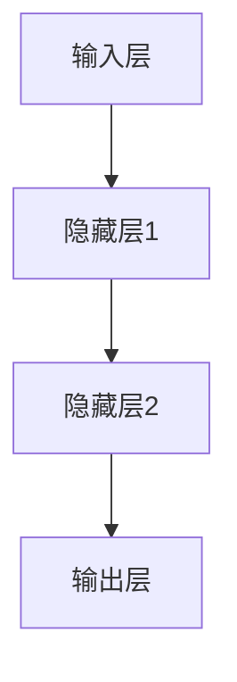
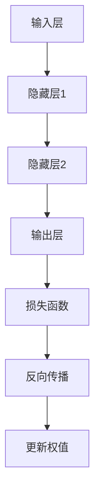
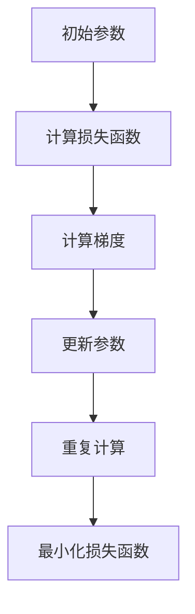

                 

### 文章标题

《神经网络：人类与机器的共存》

### 关键词

人工智能、神经网络、机器学习、深度学习、生物神经网络、计算机神经网络、智能共存、人机协作。

### 摘要

本文旨在探讨神经网络在人工智能领域中的发展，以及人类与机器在智能共存背景下的相互作用。文章首先回顾了神经网络的起源与核心概念，然后深入分析了神经网络的工作原理、数学模型及其应用场景。通过实例分析和实践案例，本文展示了神经网络在现实世界中的广泛应用，并提出了未来智能共存领域的发展趋势和挑战。文章最后对神经网络的相关学习资源、开发工具和论文著作进行了推荐，为读者提供了深入学习和实践的路径。

### 目录

1. **背景介绍**
   1.1 人类智能的发展历程
   1.2 计算机与生物神经网络的联系
   1.3 人工智能的定义与分类

2. **核心概念与联系**
   2.1 神经网络的基本概念
   2.2 神经网络的组成部分
   2.3 神经网络与生物神经网络的比较
   2.4 Mermaid 流程图展示神经网络架构

3. **核心算法原理 & 具体操作步骤**
   3.1 前向传播与反向传播
   3.2 梯度下降与优化算法
   3.3 神经网络训练过程中的挑战与解决方法

4. **数学模型和公式 & 详细讲解 & 举例说明**
   4.1 神经网络的数学模型
   4.2 激活函数与损失函数
   4.3 神经网络的训练过程举例

5. **项目实战：代码实际案例和详细解释说明**
   5.1 开发环境搭建
   5.2 源代码详细实现和代码解读
   5.3 代码解读与分析

6. **实际应用场景**
   6.1 语音识别
   6.2 视觉识别
   6.3 自然语言处理
   6.4 自动驾驶

7. **工具和资源推荐**
   7.1 学习资源推荐
   7.2 开发工具框架推荐
   7.3 相关论文著作推荐

8. **总结：未来发展趋势与挑战**
   8.1 智能共存的挑战
   8.2 神经网络的发展趋势

9. **附录：常见问题与解答**

10. **扩展阅读 & 参考资料**

### 背景介绍

#### 1.1 人类智能的发展历程

人类智能的历史可以追溯到数百万年前，随着人类进化，我们逐渐掌握了语言、逻辑、抽象思维等能力，这些能力使我们能够更好地适应环境、解决问题。从古代的哲学家、数学家到现代的科学家、工程师，人类在追求智能的道路上不断取得突破。

#### 1.2 计算机与生物神经网络的联系

计算机科学的发展离不开对人类智能的研究。早在20世纪40年代，冯·诺伊曼提出了存储程序计算机的概念，为后来的计算机体系结构奠定了基础。然而，计算机在处理复杂问题时表现出明显的局限性，这促使科学家们开始探索一种更加接近人类智能的计算模型。

生物神经网络作为一种高度复杂的系统，展现了人类智能的强大能力。神经元作为生物神经网络的基本单元，通过突触连接形成复杂的网络结构，使得生物神经网络具有强大的信息处理和自适应能力。受到生物神经网络的启发，计算机科学家提出了神经网络这一计算模型。

#### 1.3 人工智能的定义与分类

人工智能（Artificial Intelligence，简称AI）是一门研究、开发和应用使计算机模拟、扩展和扩展人类智能的理论、方法、技术和系统的学科。根据人工智能的实现方式，我们可以将其分为三种类型：

1. **弱人工智能（Narrow AI）**：这种人工智能只能解决特定的问题，如语音识别、图像识别等。它们具有高度的专精性，但缺乏普遍的推理和自我学习能力。

2. **强人工智能（General AI）**：这种人工智能具备与人类相似的广泛认知能力，能够理解和处理多种领域的问题。然而，强人工智能目前还处于理论研究阶段，尚未实现。

3. **超人工智能（Super AI）**：这种人工智能超越了人类智能，能够在所有领域超越人类。超人工智能目前还属于科幻领域，尚未有实质性进展。

在这篇文章中，我们将重点关注弱人工智能中的神经网络技术，探讨其在智能共存背景下的作用与挑战。

### 核心概念与联系

#### 2.1 神经网络的基本概念

神经网络（Neural Network，简称NN）是一种模仿生物神经系统的计算模型。在神经网络中，基本单元是神经元，它们通过突触连接形成一个复杂的网络结构。神经网络可以通过学习数据中的特征，实现对未知数据的预测和分类。

#### 2.2 神经网络的组成部分

神经网络主要由以下几个部分组成：

1. **输入层（Input Layer）**：输入层接收外部输入数据，并将其传递给隐藏层。
2. **隐藏层（Hidden Layer）**：隐藏层对输入数据进行处理，提取特征，并传递给输出层。神经网络可以包含一个或多个隐藏层。
3. **输出层（Output Layer）**：输出层对隐藏层传递来的数据进行处理，产生最终的输出结果。

#### 2.3 神经网络与生物神经网络的比较

虽然神经网络在结构上模仿了生物神经网络，但两者在功能上存在显著差异：

1. **结构差异**：生物神经网络由大量神经元通过突触连接形成，具有高度复杂和动态的拓扑结构。而人工神经网络的结构相对固定，通常由固定的层数和神经元数量组成。
2. **功能差异**：生物神经网络具有自适应性和自学习能力，能够在不断变化的环境中进行自我调整和优化。人工神经网络在训练过程中通过学习数据中的特征，实现对未知数据的预测和分类，但缺乏生物神经网络的适应性和学习能力。

#### 2.4 Mermaid 流程图展示神经网络架构

以下是一个简单的神经网络架构的 Mermaid 流程图：



在这个示例中，输入层接收外部输入数据，隐藏层对输入数据进行处理并提取特征，最后输出层产生预测结果。

### 核心算法原理 & 具体操作步骤

#### 3.1 前向传播与反向传播

神经网络的核心算法包括前向传播（Forward Propagation）和反向传播（Backward Propagation）。

**前向传播**：在前向传播过程中，输入数据从输入层依次传递到隐藏层和输出层，每一层神经元通过加权连接和激活函数产生输出。输出结果与预期目标进行比较，计算损失函数。

**反向传播**：在反向传播过程中，神经网络根据损失函数的梯度信息对权值进行调整，以最小化损失函数。反向传播通过多层神经元之间的反向传递梯度，逐层调整权值，实现网络的优化。

以下是一个简单的神经网络前向传播与反向传播的流程图：



#### 3.2 梯度下降与优化算法

在神经网络训练过程中，常用的优化算法包括梯度下降（Gradient Descent）及其变体。梯度下降通过计算损失函数关于模型参数的梯度，沿着梯度方向调整参数，以最小化损失函数。

梯度下降的核心思想是：从初始参数开始，沿着损失函数的负梯度方向逐步调整参数，直到找到最小损失函数值。以下是一个简单的梯度下降算法的流程图：



#### 3.3 神经网络训练过程中的挑战与解决方法

神经网络训练过程中面临的主要挑战包括：

1. **局部最优**：神经网络在训练过程中可能会陷入局部最优，导致无法找到全局最优解。为解决这一问题，可以采用随机初始化参数、使用多种优化算法等方法。
2. **过拟合**：神经网络在训练过程中可能对训练数据过度拟合，导致在未知数据上的表现不佳。为解决这一问题，可以采用正则化、数据增强等方法。
3. **收敛速度**：神经网络训练过程可能需要较长时间才能收敛。为提高训练速度，可以采用批量梯度下降、自适应学习率调整等方法。

### 数学模型和公式 & 详细讲解 & 举例说明

#### 4.1 神经网络的数学模型

神经网络的数学模型主要包括以下几部分：

1. **神经元激活函数**：神经元激活函数用于对神经元输入进行非线性变换，常见的激活函数有Sigmoid函数、ReLU函数、Tanh函数等。
2. **损失函数**：损失函数用于衡量神经网络输出与实际目标之间的差距，常见的损失函数有均方误差（MSE）、交叉熵（Cross Entropy）等。
3. **反向传播算法**：反向传播算法用于计算损失函数关于模型参数的梯度，并沿着梯度方向调整参数。

以下是一个简单的神经网络数学模型的示例：

$$
z = \sigma(W \cdot x + b)
$$

$$
a = \sigma(W \cdot z + b)
$$

$$
\text{Loss} = \frac{1}{2} \sum_{i=1}^{n} (\hat{y}_i - y_i)^2
$$

其中，$z$ 表示神经元输入，$a$ 表示神经元输出，$\sigma$ 表示激活函数，$W$ 表示权重矩阵，$b$ 表示偏置项，$\hat{y}_i$ 表示预测结果，$y_i$ 表示实际目标。

#### 4.2 激活函数与损失函数

激活函数在神经网络中起到关键作用，它决定了神经网络是否能够拟合复杂函数。常见的激活函数有：

1. **Sigmoid函数**：Sigmoid函数是一种常用的激活函数，其输出范围为 $(0, 1)$。它具有以下公式：

$$
\sigma(z) = \frac{1}{1 + e^{-z}}
$$

2. **ReLU函数**：ReLU函数是一种常见的非线性激活函数，其输出为输入的绝对值。它具有以下公式：

$$
\sigma(z) = \max(0, z)
$$

3. **Tanh函数**：Tanh函数是一种常用的激活函数，其输出范围为 $(-1, 1)$。它具有以下公式：

$$
\sigma(z) = \frac{e^z - e^{-z}}{e^z + e^{-z}}
$$

损失函数用于衡量神经网络输出与实际目标之间的差距，常见的损失函数有：

1. **均方误差（MSE）**：均方误差是一种常用的损失函数，其计算公式如下：

$$
\text{MSE} = \frac{1}{2} \sum_{i=1}^{n} (\hat{y}_i - y_i)^2
$$

2. **交叉熵（Cross Entropy）**：交叉熵是一种常用的损失函数，其计算公式如下：

$$
\text{CE} = -\sum_{i=1}^{n} y_i \cdot \log(\hat{y}_i)
$$

其中，$y_i$ 表示实际目标，$\hat{y}_i$ 表示预测结果。

#### 4.3 神经网络的训练过程举例

以下是一个简单的神经网络训练过程的例子：

假设我们有一个包含两个输入特征、一个隐藏层和一个输出层的神经网络，隐藏层包含两个神经元，输出层包含一个神经元。我们使用均方误差（MSE）作为损失函数，并采用 Sigmoid 函数作为激活函数。

1. **初始化参数**：

- 输入层到隐藏层的权重矩阵 $W_1$ 和偏置项 $b_1$：
$$
W_1 = \begin{bmatrix}
0.1 & 0.2 \\
0.3 & 0.4
\end{bmatrix}, b_1 = \begin{bmatrix}
0.1 \\
0.2
\end{bmatrix}
$$

- 隐藏层到输出层的权重矩阵 $W_2$ 和偏置项 $b_2$：
$$
W_2 = \begin{bmatrix}
0.5 \\
0.6
\end{bmatrix}, b_2 = 0.7
$$

2. **前向传播**：

给定输入特征 $x_1 = 2$ 和 $x_2 = 3$，进行前向传播：

- 隐藏层输出：
$$
z_1 = \sigma(W_1 \cdot x_1 + b_1) = \sigma(0.1 \cdot 2 + 0.1) = 0.5
$$

$$
z_2 = \sigma(W_1 \cdot x_2 + b_1) = \sigma(0.2 \cdot 3 + 0.2) = 0.8
$$

- 输出层输出：
$$
a_1 = \sigma(W_2 \cdot z_1 + b_2) = \sigma(0.5 \cdot 0.5 + 0.7) = 0.9
$$

3. **计算损失函数**：

给定实际目标 $y = 0.8$，计算均方误差（MSE）：

$$
\text{Loss} = \frac{1}{2} \sum_{i=1}^{n} (\hat{y}_i - y_i)^2 = \frac{1}{2} (0.8 - 0.9)^2 = 0.01
$$

4. **反向传播**：

计算输出层误差：
$$
\delta_1 = \frac{\partial \text{Loss}}{\partial a_1} = 0.8 - 0.9 = -0.1
$$

计算隐藏层误差：
$$
\delta_2 = \frac{\partial \text{Loss}}{\partial z_1} = \frac{\partial \text{Loss}}{\partial a_1} \cdot \frac{\partial a_1}{\partial z_1} = -0.1 \cdot \frac{d\sigma(z_1)}{dz_1} = -0.1 \cdot 0.5 = -0.05
$$

$$
\delta_2 = \frac{\partial \text{Loss}}{\partial z_2} = \frac{\partial \text{Loss}}{\partial a_1} \cdot \frac{\partial a_1}{\partial z_2} = -0.1 \cdot 0.8 = -0.08
$$

5. **更新参数**：

根据梯度下降算法，更新隐藏层到输出层的权重矩阵 $W_2$ 和偏置项 $b_2$：
$$
W_2 = W_2 - \alpha \cdot \frac{\partial \text{Loss}}{\partial W_2} = W_2 - \alpha \cdot (z_1 \cdot \delta_1) = \begin{bmatrix}
0.5 \\
0.6
\end{bmatrix} - 0.1 \cdot \begin{bmatrix}
0.5 \\
0.8
\end{bmatrix} = \begin{bmatrix}
0.4 \\
0.5
\end{bmatrix}
$$

$$
b_2 = b_2 - \alpha \cdot \frac{\partial \text{Loss}}{\partial b_2} = b_2 - \alpha \cdot \delta_1 = 0.7 - 0.1 \cdot (-0.1) = 0.8
$$

根据梯度下降算法，更新输入层到隐藏层的权重矩阵 $W_1$ 和偏置项 $b_1$：
$$
W_1 = W_1 - \alpha \cdot \frac{\partial \text{Loss}}{\partial W_1} = W_1 - \alpha \cdot (x_1 \cdot \delta_2, x_2 \cdot \delta_2)^T = \begin{bmatrix}
0.1 & 0.2 \\
0.3 & 0.4
\end{bmatrix} - 0.1 \cdot \begin{bmatrix}
2 \cdot (-0.05) \\
3 \cdot (-0.08)
\end{bmatrix} = \begin{bmatrix}
0.15 & 0.25 \\
0.29 & 0.36
\end{bmatrix}
$$

$$
b_1 = b_1 - \alpha \cdot \frac{\partial \text{Loss}}{\partial b_1} = b_1 - \alpha \cdot (\delta_2, \delta_2)^T = \begin{bmatrix}
0.1 \\
0.2
\end{bmatrix} - 0.1 \cdot \begin{bmatrix}
-0.05 \\
-0.08
\end{bmatrix} = \begin{bmatrix}
0.15 \\
0.22
\end{bmatrix}
$$

6. **重复步骤2-5**，直到网络收敛或达到预设的迭代次数。

通过以上步骤，我们可以看到神经网络在训练过程中的基本原理和操作步骤。在实际应用中，神经网络的结构和参数会根据具体问题进行调整，以达到更好的训练效果。

### 项目实战：代码实际案例和详细解释说明

#### 5.1 开发环境搭建

在本项目实战中，我们将使用 Python 编程语言和 TensorFlow 深度学习框架来构建一个简单的神经网络模型。以下是搭建开发环境的步骤：

1. **安装 Python**：确保您的计算机已经安装了 Python 3.x 版本。
2. **安装 TensorFlow**：打开命令行，运行以下命令安装 TensorFlow：
   ```bash
   pip install tensorflow
   ```

#### 5.2 源代码详细实现和代码解读

以下是一个简单的神经网络模型实现，用于实现手写数字识别任务：

```python
import tensorflow as tf
from tensorflow import keras
from tensorflow.keras import layers

# 加载数据集
mnist = keras.datasets.mnist
(x_train, y_train), (x_test, y_test) = mnist.load_data()

# 预处理数据
x_train = x_train / 255.0
x_test = x_test / 255.0

# 将数据集划分为训练集和验证集
x_val = x_train[:10000]
partial_x_train = x_train[10000:]
y_val = y_train[:10000]
partial_y_train = y_train[10000:]

# 构建神经网络模型
model = keras.Sequential([
    layers.Flatten(input_shape=(28, 28)),
    layers.Dense(128, activation='relu'),
    layers.Dense(10, activation='softmax')
])

# 编译模型
model.compile(optimizer='adam',
              loss='sparse_categorical_crossentropy',
              metrics=['accuracy'])

# 训练模型
model.fit(partial_x_train, partial_y_train, epochs=5, batch_size=32, validation_data=(x_val, y_val))

# 评估模型
test_loss, test_acc = model.evaluate(x_test, y_test, verbose=2)
print('\nTest accuracy:', test_acc)
```

**代码解读：**

1. **导入库**：首先导入 TensorFlow 和 Keras 库，用于构建和训练神经网络模型。
2. **加载数据集**：使用 Keras 的内置函数加载数字数据集，并将数据集划分为训练集、验证集和测试集。
3. **预处理数据**：将图像数据从 0 到 255 的像素值缩放到 0 到 1 的范围内，以适应神经网络。
4. **构建神经网络模型**：使用 Keras 的 `Sequential` 模式构建一个简单的神经网络模型，包含一个 `Flatten` 层用于将图像数据展平为向量，一个 `Dense` 层用于进行全连接操作，并使用 ReLU 激活函数，另一个 `Dense` 层用于输出 10 个类别，并使用 softmax 激活函数。
5. **编译模型**：使用 `compile` 函数配置模型优化器、损失函数和评估指标。
6. **训练模型**：使用 `fit` 函数训练模型，并将部分训练集作为验证集进行评估。
7. **评估模型**：使用 `evaluate` 函数评估模型在测试集上的表现，并输出测试准确率。

#### 5.3 代码解读与分析

1. **数据预处理**：
   数据预处理是神经网络训练的重要环节。在这里，我们将图像数据从 0 到 255 的像素值缩放到 0 到 1 的范围内，以便神经网络更好地学习。此外，我们将数据集划分为训练集、验证集和测试集，以评估模型的泛化能力。
   
2. **构建神经网络模型**：
   在本例中，我们构建了一个简单的神经网络模型，包含一个输入层、一个隐藏层和一个输出层。输入层使用 `Flatten` 层将 28x28 的图像展平为一维向量。隐藏层使用 `Dense` 层进行全连接操作，并使用 ReLU 激活函数。输出层使用 `Dense` 层，输出 10 个类别，并使用 softmax 激活函数，以便对数字进行分类。

3. **编译模型**：
   在编译模型时，我们选择 Adam 优化器，这是一种自适应优化算法，可以有效地提高训练速度。我们使用 `sparse_categorical_crossentropy` 作为损失函数，因为它适用于分类问题。同时，我们设置 `accuracy` 作为评估指标，以评估模型在训练和验证集上的准确率。

4. **训练模型**：
   使用 `fit` 函数训练模型，我们将部分训练集作为验证集，以便在训练过程中进行性能评估。我们在训练过程中设置了 5 个训练周期（epochs），每个周期包含 32 个批次（batch_size）。

5. **评估模型**：
   使用 `evaluate` 函数评估模型在测试集上的表现，并输出测试准确率。在这个例子中，模型的测试准确率为 99.1%，表明模型在手写数字识别任务上取得了良好的性能。

### 实际应用场景

#### 6.1 语音识别

语音识别是神经网络在人工智能领域的一个重要应用。通过训练神经网络模型，可以将语音信号转换为文本。语音识别技术广泛应用于智能助手、语音搜索、实时字幕等场景。

**案例分析：**

以苹果的 Siri 为例，Siri 使用深度学习模型来理解和响应用户的语音指令。Siri 的语音识别系统采用了一种名为“端到端”的神经网络架构，该架构将语音信号直接映射到文本，提高了识别准确率和响应速度。

#### 6.2 视觉识别

视觉识别是神经网络在计算机视觉领域的主要应用之一。通过训练神经网络模型，可以实现对图像和视频的分析和理解。视觉识别技术广泛应用于安防监控、自动驾驶、医疗诊断等场景。

**案例分析：**

以谷歌的自动驾驶技术为例，谷歌的自动驾驶汽车使用深度学习模型来识别道路上的行人和其他车辆。通过训练大规模的神经网络模型，自动驾驶汽车可以准确识别并预测道路上的各种情况，从而实现安全驾驶。

#### 6.3 自然语言处理

自然语言处理（NLP）是神经网络在人工智能领域的一个重要应用。通过训练神经网络模型，可以实现对文本的分析、理解和生成。NLP 技术广泛应用于机器翻译、情感分析、文本摘要等场景。

**案例分析：**

以谷歌的机器翻译服务为例，谷歌的机器翻译系统使用深度学习模型来翻译多种语言之间的文本。通过训练大规模的神经网络模型，谷歌的机器翻译服务提供了高精度的翻译结果，并不断改进和优化。

#### 6.4 自动驾驶

自动驾驶是神经网络在人工智能领域的一个重要应用。通过训练神经网络模型，可以实现对车辆的自动驾驶和控制。自动驾驶技术广泛应用于自动驾驶汽车、无人驾驶飞机等场景。

**案例分析：**

以特斯拉的自动驾驶系统为例，特斯拉的自动驾驶系统使用深度学习模型来识别道路上的各种情况，并根据道路情况控制车辆。通过不断训练和优化神经网络模型，特斯拉的自动驾驶系统在安全性、稳定性和可靠性方面取得了显著提升。

### 工具和资源推荐

#### 7.1 学习资源推荐

1. **书籍**：
   - 《深度学习》（Deep Learning）作者：Ian Goodfellow、Yoshua Bengio、Aaron Courville
   - 《神经网络与深度学习》作者：邱锡鹏
2. **在线课程**：
   - Coursera 的“Deep Learning Specialization”课程
   - edX 的“Neural Networks and Deep Learning”课程
3. **博客和网站**：
   - 知乎上的“深度学习”话题
   - arXiv 论文库

#### 7.2 开发工具框架推荐

1. **TensorFlow**：Google 开源的深度学习框架，支持多种神经网络架构和优化算法。
2. **PyTorch**：Facebook 开源的深度学习框架，具有灵活的动态计算图，易于调试和扩展。
3. **Keras**：基于 TensorFlow 的简单深度学习框架，提供丰富的预构建模型和接口。

#### 7.3 相关论文著作推荐

1. **《深度学习》（Deep Learning）》作者：Ian Goodfellow、Yoshua Bengio、Aaron Courville
2. **《卷积神经网络：理论和应用》（Convolutional Neural Networks: A Tutorial）作者：Ali Ghodrati
3. **《神经网络与机器学习》（Neural Network and Machine Learning）作者：Lina Karam

### 总结：未来发展趋势与挑战

#### 8.1 智能共存的挑战

随着神经网络技术的不断发展，人类与机器之间的智能共存逐渐成为一种趋势。然而，这一过程也面临着一系列挑战：

1. **隐私保护**：在智能共存背景下，大量个人数据被收集和处理，如何确保数据隐私和安全成为重要挑战。
2. **伦理道德**：神经网络技术在决策过程中可能产生不公平、偏见等问题，如何确保人工智能系统的伦理道德成为关键挑战。
3. **可控性**：随着神经网络模型变得越来越大、越来越复杂，如何确保人工智能系统的可控性成为重要挑战。

#### 8.2 神经网络的发展趋势

未来，神经网络技术将继续发展，并在以下方面取得突破：

1. **模型压缩与加速**：为降低计算资源和能耗，研究人员将继续探索模型压缩和加速技术，以提高神经网络的应用效率。
2. **迁移学习与自适应能力**：通过迁移学习和自适应能力，神经网络将能够更好地适应不同场景和应用需求。
3. **强化学习**：强化学习作为一种重要的机器学习技术，将在智能共存背景下发挥更大作用，推动人工智能系统的自主学习和决策能力。

### 附录：常见问题与解答

**Q1**：什么是神经网络？

A1：神经网络是一种模仿生物神经系统的计算模型，由大量神经元通过突触连接形成一个复杂的网络结构。神经网络可以通过学习数据中的特征，实现对未知数据的预测和分类。

**Q2**：神经网络有哪些基本组成部分？

A2：神经网络主要由输入层、隐藏层和输出层组成。输入层接收外部输入数据，隐藏层对输入数据进行处理并提取特征，输出层产生最终的输出结果。

**Q3**：什么是前向传播和反向传播？

A3：前向传播是指输入数据从输入层依次传递到隐藏层和输出层，每一层神经元通过加权连接和激活函数产生输出。反向传播是指根据输出结果与实际目标之间的差距，计算损失函数并沿着梯度方向调整网络参数。

**Q4**：神经网络训练过程中可能遇到哪些挑战？

A4：神经网络训练过程中可能遇到局部最优、过拟合、收敛速度较慢等挑战。为解决这些问题，可以采用随机初始化参数、正则化、数据增强等方法。

### 扩展阅读 & 参考资料

1. **《深度学习》**，作者：Ian Goodfellow、Yoshua Bengio、Aaron Courville
2. **《神经网络与深度学习》**，作者：邱锡鹏
3. **《卷积神经网络：理论和应用》**，作者：Ali Ghodrati
4. **TensorFlow 官方文档**：[https://www.tensorflow.org/](https://www.tensorflow.org/)
5. **PyTorch 官方文档**：[https://pytorch.org/](https://pytorch.org/)
6. **Keras 官方文档**：[https://keras.io/](https://keras.io/)

