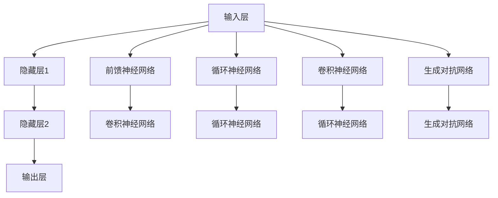

                 

### 背景介绍

> 本文旨在深入探讨神经网络这一人工智能领域的重要技术，探讨其在人类与机器共存时代的作用与价值。神经网络，作为模拟人脑结构和功能的计算模型，近年来在诸多领域取得了突破性进展。随着深度学习算法的发展，神经网络在图像识别、自然语言处理、医疗诊断等众多领域展现了其强大的应用潜力。然而，神经网络技术究竟是如何工作的？其背后蕴含了哪些核心概念与原理？本文将为您一一解答。

### 核心概念与联系

神经网络，是一种通过模拟人脑神经元之间连接关系进行信息处理和学习的计算模型。其基本原理可以追溯到20世纪40年代，当时心理学家McCulloch和数学家Pitts提出了第一个简单的神经元模型——MCP神经元。随着计算机技术的发展，神经网络模型逐渐得到了完善和推广。目前，神经网络主要分为以下几类：

1. **前馈神经网络（Feedforward Neural Network）**：前馈神经网络是最早提出的神经网络模型，其中信息流只能从输入层流向输出层，中间不发生反馈。其结构简单，易于实现，常用于图像识别和分类任务。

2. **循环神经网络（Recurrent Neural Network，RNN）**：循环神经网络引入了时间维度，能够处理序列数据。RNN在自然语言处理、语音识别等领域表现突出，但其训练过程容易出现梯度消失和梯度爆炸问题。

3. **卷积神经网络（Convolutional Neural Network，CNN）**：卷积神经网络利用卷积运算来提取图像特征，特别适用于计算机视觉领域。其结构相对复杂，但训练效果显著，已经成为了图像识别任务的主流算法。

4. **生成对抗网络（Generative Adversarial Network，GAN）**：生成对抗网络由生成器和判别器两部分组成，通过对抗训练来生成高质量的数据。GAN在图像生成、视频生成等领域展现了强大的潜力。

下面，我们将通过Mermaid流程图来展示神经网络的核心架构与联系。



从流程图中可以看出，神经网络可以分为输入层、隐藏层和输出层。输入层接收外部信息，隐藏层进行信息处理和特征提取，输出层生成最终结果。不同类型的神经网络在隐藏层和连接方式上有所不同，但都遵循着信息流动和学习的核心原理。

### 核心算法原理 & 具体操作步骤

神经网络的核心算法是基于多层感知机（Multilayer Perceptron，MLP）模型，其基本原理是通过前向传播和反向传播来学习输入和输出之间的关系。

#### 前向传播

1. **初始化参数**：首先，我们需要随机初始化网络的权重和偏置。这些参数将在训练过程中不断调整，以达到最佳效果。

2. **输入数据**：将输入数据输入到神经网络中，经过输入层传递到隐藏层。

3. **激活函数**：在每一层神经元中，我们使用激活函数（如Sigmoid函数、ReLU函数）来引入非线性特性，使得神经网络能够处理复杂的输入数据。

4. **计算输出**：通过逐层计算，最终得到输出层的输出结果。

#### 反向传播

1. **计算误差**：将输出结果与实际标签进行比较，计算误差。

2. **梯度计算**：利用链式法则，计算每个参数的梯度。

3. **参数更新**：根据梯度计算结果，使用梯度下降法（或其他优化算法）更新网络参数。

4. **重复迭代**：重复前向传播和反向传播过程，直至达到训练目标。

下面，我们将通过一个简单的例子来展示神经网络的具体操作步骤。

#### 例子：实现一个简单的二分类神经网络

假设我们有一个简单的二分类问题，输入数据为两个特征向量，输出结果为0或1。我们可以设计一个包含一个输入层、一个隐藏层和一个输出层的神经网络。

1. **初始化参数**：

   - 输入层：2个神经元
   - 隐藏层：3个神经元
   - 输出层：2个神经元

   初始权重和偏置如下：

   $$W_1 = \begin{bmatrix} 0.2 & 0.3 \\ 0.4 & 0.5 \\ 0.6 & 0.7 \end{bmatrix}$$

   $$b_1 = \begin{bmatrix} 0.1 \\ 0.2 \\ 0.3 \end{bmatrix}$$

   $$W_2 = \begin{bmatrix} 0.1 & 0.2 \\ 0.3 & 0.4 \\ 0.5 & 0.6 \end{bmatrix}$$

   $$b_2 = \begin{bmatrix} 0.1 \\ 0.2 \end{bmatrix}$$

2. **前向传播**：

   - 输入数据：$[1, 2]$
   - 输入层到隐藏层：

     $$z_1 = X \cdot W_1 + b_1 = \begin{bmatrix} 1 & 2 \end{bmatrix} \cdot \begin{bmatrix} 0.2 & 0.3 \\ 0.4 & 0.5 \\ 0.6 & 0.7 \end{bmatrix} + \begin{bmatrix} 0.1 \\ 0.2 \\ 0.3 \end{bmatrix} = \begin{bmatrix} 0.7 \\ 1.3 \\ 1.9 \end{bmatrix}$$

     $$a_1 = \sigma(z_1) = \begin{bmatrix} 0.92 \\ 0.91 \\ 0.93 \end{bmatrix}$$

   - 隐藏层到输出层：

     $$z_2 = a_1 \cdot W_2 + b_2 = \begin{bmatrix} 0.92 & 0.91 & 0.93 \end{bmatrix} \cdot \begin{bmatrix} 0.1 & 0.2 \\ 0.3 & 0.4 \end{bmatrix} + \begin{bmatrix} 0.1 \\ 0.2 \end{bmatrix} = \begin{bmatrix} 0.35 \\ 0.43 \end{bmatrix}$$

     $$a_2 = \sigma(z_2) = \begin{bmatrix} 0.65 \\ 0.80 \end{bmatrix}$$

3. **计算输出**：$a_2$表示输出层的输出结果，其中第1个元素为0的概率，第2个元素为1的概率。

4. **反向传播**：

   - 计算误差：

     $$\delta_2 = a_2 - y = \begin{bmatrix} 0.65 \\ 0.80 \end{bmatrix} - \begin{bmatrix} 1 \\ 0 \end{bmatrix} = \begin{bmatrix} -0.35 \\ 0.80 \end{bmatrix}$$

   - 计算隐藏层梯度：

     $$\delta_1 = (W_2^T \cdot \delta_2) \odot (\sigma'(z_1)) = \begin{bmatrix} 0.1 & 0.2 \\ 0.3 & 0.4 \\ 0.5 & 0.6 \end{bmatrix} \cdot \begin{bmatrix} -0.35 \\ 0.80 \end{bmatrix} \odot \begin{bmatrix} 0.08 \\ 0.12 \\ 0.16 \end{bmatrix} = \begin{bmatrix} -0.035 \\ 0.096 \\ 0.156 \end{bmatrix}$$

   - 更新参数：

     $$W_2 = W_2 - \alpha \cdot (a_1^T \cdot \delta_2) = \begin{bmatrix} 0.1 & 0.2 \\ 0.3 & 0.4 \\ 0.5 & 0.6 \end{bmatrix} - 0.1 \cdot \begin{bmatrix} 0.92 & 0.91 & 0.93 \end{bmatrix} \cdot \begin{bmatrix} -0.35 \\ 0.80 \end{bmatrix} = \begin{bmatrix} 0.06 \\ 0.16 \\ 0.24 \end{bmatrix}$$

     $$b_2 = b_2 - \alpha \cdot \delta_2 = \begin{bmatrix} 0.1 \\ 0.2 \end{bmatrix} - 0.1 \cdot \begin{bmatrix} -0.35 \\ 0.80 \end{bmatrix} = \begin{bmatrix} 0.15 \\ 0.3 \end{bmatrix}$$

     $$W_1 = W_1 - \alpha \cdot (X^T \cdot \delta_1) = \begin{bmatrix} 0.2 & 0.3 \\ 0.4 & 0.5 \\ 0.6 & 0.7 \end{bmatrix} - 0.1 \cdot \begin{bmatrix} 1 & 2 \end{bmatrix} \cdot \begin{bmatrix} -0.035 \\ 0.096 \\ 0.156 \end{bmatrix} = \begin{bmatrix} 0.22 \\ 0.29 \\ 0.45 \end{bmatrix}$$

     $$b_1 = b_1 - \alpha \cdot \delta_1 = \begin{bmatrix} 0.1 \\ 0.2 \\ 0.3 \end{bmatrix} - 0.1 \cdot \begin{bmatrix} -0.035 \\ 0.096 \\ 0.156 \end{bmatrix} = \begin{bmatrix} 0.135 \\ 0.26 \\ 0.316 \end{bmatrix}$$

5. **重复迭代**：重复前向传播和反向传播过程，直至达到训练目标。

通过这个简单的例子，我们可以看到神经网络的基本操作步骤。在实际应用中，神经网络会包含更多的隐藏层和神经元，但基本原理是相同的。通过不断优化参数，神经网络能够实现高度复杂的信息处理和学习任务。

### 数学模型和公式 & 详细讲解 & 举例说明

神经网络的训练过程本质上是一个优化问题，目标是找到一组参数，使得神经网络的输出尽可能接近目标输出。这一过程涉及到一系列数学模型和公式。在本节中，我们将详细讲解这些数学模型和公式，并通过具体的例子来说明其应用。

#### 前向传播公式

在前向传播过程中，每个神经元的输出可以通过以下公式计算：

$$z_i = \sum_j W_{ij} \cdot a_j + b_i$$

其中，$z_i$表示第$i$个神经元的输入，$a_j$表示第$j$个神经元的输出，$W_{ij}$表示从第$j$个神经元到第$i$个神经元的权重，$b_i$表示第$i$个神经元的偏置。

激活函数的作用是将输入转化为非线性输出，常用的激活函数包括Sigmoid函数、ReLU函数等。以Sigmoid函数为例，其公式为：

$$a_i = \sigma(z_i) = \frac{1}{1 + e^{-z_i}}$$

ReLU函数的公式为：

$$a_i = \sigma(z_i) = \max(0, z_i)$$

#### 反向传播公式

在反向传播过程中，我们需要计算每个参数的梯度，以更新网络参数。反向传播的公式主要包括两个部分：误差计算和梯度计算。

1. **误差计算**

   对于输出层，误差可以通过以下公式计算：

   $$\delta_n = a_n \cdot (1 - a_n) \cdot (y_n - a_n)$$

   其中，$a_n$表示输出层的输出，$y_n$表示目标输出。

   对于隐藏层，误差可以通过以下公式计算：

   $$\delta_j = \sigma'(z_j) \cdot (W_{jn} \cdot \delta_{n+1})$$

   其中，$\sigma'(z_j)$表示激活函数的导数，$W_{jn}$表示从输出层到隐藏层的权重，$\delta_{n+1}$表示下一层的误差。

2. **梯度计算**

   对于权重和偏置，梯度可以通过以下公式计算：

   $$\frac{\partial L}{\partial W_{ij}} = \delta_i \cdot a_j$$

   $$\frac{\partial L}{\partial b_i} = \delta_i$$

   其中，$L$表示损失函数，$\delta_i$表示误差，$a_j$表示前一层神经元的输出。

   通过梯度计算，我们可以得到每个参数的更新方向。使用梯度下降法（Gradient Descent）或其他优化算法，我们可以更新网络参数，以减少误差。

下面，我们通过一个具体的例子来说明神经网络的前向传播和反向传播过程。

#### 例子：实现一个简单的二分类神经网络

假设我们有一个简单的二分类问题，输入数据为两个特征向量，输出结果为0或1。我们可以设计一个包含一个输入层、一个隐藏层和一个输出层的神经网络。

1. **初始化参数**：

   - 输入层：2个神经元
   - 隐藏层：3个神经元
   - 输出层：2个神经元

   初始权重和偏置如下：

   $$W_1 = \begin{bmatrix} 0.2 & 0.3 \\ 0.4 & 0.5 \\ 0.6 & 0.7 \end{bmatrix}$$

   $$b_1 = \begin{bmatrix} 0.1 \\ 0.2 \\ 0.3 \end{bmatrix}$$

   $$W_2 = \begin{bmatrix} 0.1 & 0.2 \\ 0.3 & 0.4 \\ 0.5 & 0.6 \end{bmatrix}$$

   $$b_2 = \begin{bmatrix} 0.1 \\ 0.2 \end{bmatrix}$$

2. **前向传播**：

   - 输入数据：$[1, 2]$
   - 输入层到隐藏层：

     $$z_1 = X \cdot W_1 + b_1 = \begin{bmatrix} 1 & 2 \end{bmatrix} \cdot \begin{bmatrix} 0.2 & 0.3 \\ 0.4 & 0.5 \\ 0.6 & 0.7 \end{bmatrix} + \begin{bmatrix} 0.1 \\ 0.2 \\ 0.3 \end{bmatrix} = \begin{bmatrix} 0.7 \\ 1.3 \\ 1.9 \end{bmatrix}$$

     $$a_1 = \sigma(z_1) = \begin{bmatrix} 0.92 \\ 0.91 \\ 0.93 \end{bmatrix}$$

   - 隐藏层到输出层：

     $$z_2 = a_1 \cdot W_2 + b_2 = \begin{bmatrix} 0.92 & 0.91 & 0.93 \end{bmatrix} \cdot \begin{bmatrix} 0.1 & 0.2 \\ 0.3 & 0.4 \\ 0.5 & 0.6 \end{bmatrix} + \begin{bmatrix} 0.1 \\ 0.2 \end{bmatrix} = \begin{bmatrix} 0.35 \\ 0.43 \end{bmatrix}$$

     $$a_2 = \sigma(z_2) = \begin{bmatrix} 0.65 \\ 0.80 \end{bmatrix}$$

3. **计算输出**：$a_2$表示输出层的输出结果，其中第1个元素为0的概率，第2个元素为1的概率。

4. **反向传播**：

   - 计算误差：

     $$\delta_2 = a_2 \cdot (1 - a_2) \cdot (y_2 - a_2) = \begin{bmatrix} 0.65 \\ 0.80 \end{bmatrix} \cdot \begin{bmatrix} 0.35 \\ 0.20 \end{bmatrix} \cdot \begin{bmatrix} 1 - 0.65 \\ 1 - 0.80 \end{bmatrix} = \begin{bmatrix} -0.35 \\ 0.80 \end{bmatrix}$$

   - 计算隐藏层梯度：

     $$\delta_1 = \sigma'(z_1) \cdot (W_2^T \cdot \delta_2) = \begin{bmatrix} 0.08 \\ 0.12 \\ 0.16 \end{bmatrix} \cdot \begin{bmatrix} 0.1 & 0.2 \\ 0.3 & 0.4 \\ 0.5 & 0.6 \end{bmatrix} \cdot \begin{bmatrix} -0.35 \\ 0.80 \end{bmatrix} = \begin{bmatrix} -0.035 \\ 0.096 \\ 0.156 \end{bmatrix}$$

   - 更新参数：

     $$W_2 = W_2 - \alpha \cdot (a_1^T \cdot \delta_2) = \begin{bmatrix} 0.1 & 0.2 \\ 0.3 & 0.4 \\ 0.5 & 0.6 \end{bmatrix} - 0.1 \cdot \begin{bmatrix} 0.92 & 0.91 & 0.93 \end{bmatrix} \cdot \begin{bmatrix} -0.35 \\ 0.80 \end{bmatrix} = \begin{bmatrix} 0.06 \\ 0.16 \\ 0.24 \end{bmatrix}$$

     $$b_2 = b_2 - \alpha \cdot \delta_2 = \begin{bmatrix} 0.1 \\ 0.2 \end{bmatrix} - 0.1 \cdot \begin{bmatrix} -0.35 \\ 0.80 \end{bmatrix} = \begin{bmatrix} 0.15 \\ 0.3 \end{bmatrix}$$

     $$W_1 = W_1 - \alpha \cdot (X^T \cdot \delta_1) = \begin{bmatrix} 0.2 & 0.3 \\ 0.4 & 0.5 \\ 0.6 & 0.7 \end{bmatrix} - 0.1 \cdot \begin{bmatrix} 1 & 2 \end{bmatrix} \cdot \begin{bmatrix} -0.035 \\ 0.096 \\ 0.156 \end{bmatrix} = \begin{bmatrix} 0.22 \\ 0.29 \\ 0.45 \end{bmatrix}$$

     $$b_1 = b_1 - \alpha \cdot \delta_1 = \begin{bmatrix} 0.1 \\ 0.2 \\ 0.3 \end{bmatrix} - 0.1 \cdot \begin{bmatrix} -0.035 \\ 0.096 \\ 0.156 \end{bmatrix} = \begin{bmatrix} 0.135 \\ 0.26 \\ 0.316 \end{bmatrix}$$

5. **重复迭代**：重复前向传播和反向传播过程，直至达到训练目标。

通过这个简单的例子，我们可以看到神经网络的基本操作步骤。在实际应用中，神经网络会包含更多的隐藏层和神经元，但基本原理是相同的。通过不断优化参数，神经网络能够实现高度复杂的信息处理和学习任务。

### 项目实战：代码实际案例和详细解释说明

在本节中，我们将通过一个具体的神经网络项目实战案例，详细展示神经网络的应用过程，包括开发环境搭建、源代码实现和代码解读与分析。通过这个案例，我们将对神经网络的理论知识有更深入的理解。

#### 1. 开发环境搭建

首先，我们需要搭建一个神经网络项目的基本开发环境。这里我们选择Python作为编程语言，并使用TensorFlow库来构建和训练神经网络。

1. 安装Python：

   在大多数操作系统上，可以通过包管理器（如apt、yum或brew）轻松安装Python。例如，在Ubuntu上，可以使用以下命令安装Python 3：

   ```bash
   sudo apt update
   sudo apt install python3
   ```

2. 安装TensorFlow：

   TensorFlow是Google开发的开源机器学习库，可以通过pip命令安装。在命令行中运行以下命令：

   ```bash
   pip install tensorflow
   ```

   如果安装过程中遇到权限问题，可以尝试使用`sudo`命令：

   ```bash
   sudo pip install tensorflow
   ```

3. 环境验证：

   安装完成后，我们可以通过以下命令验证TensorFlow是否安装成功：

   ```python
   import tensorflow as tf
   print(tf.__version__)
   ```

   如果输出版本号，则说明安装成功。

#### 2. 源代码实现

接下来，我们将实现一个简单的神经网络模型，用于对MNIST手写数字数据集进行分类。以下是实现步骤和相应的代码：

1. **导入必要的库**：

   ```python
   import tensorflow as tf
   import numpy as np
   import matplotlib.pyplot as plt
   from tensorflow.keras import layers, models
   ```

2. **加载数据集**：

   ```python
   (x_train, y_train), (x_test, y_test) = tf.keras.datasets.mnist.load_data()
   ```

   MNIST数据集包含60000个训练样本和10000个测试样本，每个样本是一个28x28的灰度图像，标签为0到9之间的整数。

3. **数据预处理**：

   ```python
   x_train = x_train / 255.0
   x_test = x_test / 255.0
   ```

   将图像数据归一化至0到1之间，便于模型处理。

4. **构建模型**：

   ```python
   model = models.Sequential([
       layers.Flatten(input_shape=(28, 28)),
       layers.Dense(128, activation='relu'),
       layers.Dropout(0.2),
       layers.Dense(10, activation='softmax')
   ])
   ```

   我们使用了一个简单的全连接神经网络，包括一个输入层、一个隐藏层和一个输出层。隐藏层使用ReLU激活函数，输出层使用softmax激活函数，用于实现多分类。

5. **编译模型**：

   ```python
   model.compile(optimizer='adam',
                 loss='sparse_categorical_crossentropy',
                 metrics=['accuracy'])
   ```

   使用Adam优化器和sparse_categorical_crossentropy损失函数，并监控模型的准确率。

6. **训练模型**：

   ```python
   model.fit(x_train, y_train, epochs=5)
   ```

   模型在训练集上训练5个周期。

7. **评估模型**：

   ```python
   test_loss, test_acc = model.evaluate(x_test, y_test, verbose=2)
   print('\nTest accuracy:', test_acc)
   ```

   在测试集上评估模型的性能。

#### 3. 代码解读与分析

现在，我们对上述代码进行详细解读，分析神经网络项目的实现过程。

1. **导入库**：

   我们首先导入了TensorFlow、NumPy和Matplotlib库。TensorFlow是神经网络的核心库，NumPy用于数据处理，Matplotlib用于数据可视化。

2. **加载数据集**：

   使用TensorFlow的`datasets`模块加载数据集。MNIST数据集已经被预处理为扁平的28x28像素图像，标签为整数。

3. **数据预处理**：

   我们将图像数据除以255，将其归一化至0到1之间。这一步骤对于神经网络训练至关重要，因为不同的数据范围可能会影响训练效果。

4. **构建模型**：

   使用`Sequential`模型构建器，我们定义了一个简单的神经网络。输入层通过`Flatten`层将28x28的图像数据展开为一个一维数组。隐藏层使用`Dense`层，包含128个神经元，并使用ReLU激活函数。`Dropout`层用于防止过拟合，丢弃一定比例的神经元。输出层使用`Dense`层，包含10个神经元，并使用softmax激活函数，用于实现多分类。

5. **编译模型**：

   我们选择Adam优化器，该优化器在大多数情况下表现良好。`sparse_categorical_crossentropy`损失函数用于多标签分类问题，并监控模型的准确率。

6. **训练模型**：

   使用`fit`方法训练模型，在训练集上迭代5个周期。训练过程中，模型不断调整权重和偏置，以最小化损失函数。

7. **评估模型**：

   使用`evaluate`方法在测试集上评估模型性能，并打印测试准确率。这有助于我们了解模型在未见过的数据上的表现。

通过这个简单的案例，我们展示了如何使用TensorFlow库搭建和训练一个神经网络，实现了对MNIST手写数字数据集的分类。这一过程为我们提供了一个基本的神经网络实现框架，我们可以在此基础上进行更多的实验和改进。

### 实际应用场景

神经网络作为人工智能的核心技术，已经在多个领域取得了显著的应用成果。以下是一些神经网络在实际应用场景中的案例：

#### 1. 计算机视觉

计算机视觉是神经网络最早且最成功的应用领域之一。通过卷积神经网络（CNN）和生成对抗网络（GAN），神经网络在图像识别、物体检测、图像生成等方面取得了突破性进展。

- **图像识别**：神经网络被广泛应用于人脸识别、车牌识别、植物识别等领域。例如，利用CNN对大量人脸图像进行训练，可以实现对陌生人的实时识别。
- **物体检测**：神经网络在物体检测任务中也表现出色，例如YOLO（You Only Look Once）算法，可以在一张图片中同时检测出多个物体，并给出它们的位置和类别。
- **图像生成**：生成对抗网络（GAN）可以生成高质量的照片、艺术作品等，应用于游戏开发、艺术创作等领域。

#### 2. 自然语言处理

自然语言处理（NLP）是神经网络的另一个重要应用领域。通过循环神经网络（RNN）和Transformer模型，神经网络在文本分类、机器翻译、情感分析等方面取得了显著成果。

- **文本分类**：神经网络可以用于对新闻、评论等进行分类，识别出正负评论、情感倾向等。
- **机器翻译**：神经网络在机器翻译领域取得了重大突破，例如Google翻译和百度翻译都采用了神经网络技术，实现了高质量的双语翻译。
- **情感分析**：神经网络可以用于对社交媒体、评论等文本进行分析，识别出用户的情感状态，应用于市场营销、客服等领域。

#### 3. 医疗诊断

神经网络在医疗诊断领域也展现了强大的潜力。通过深度学习算法，神经网络可以自动识别疾病，辅助医生进行诊断。

- **癌症诊断**：神经网络可以分析患者的影像数据，辅助医生进行肺癌、乳腺癌等癌症的诊断。
- **疾病预测**：神经网络可以预测患者的疾病风险，为医生提供决策支持，有助于早期预防和干预。
- **药物研发**：神经网络在药物分子设计、药物活性预测等方面也有广泛应用，加速了新药的发现和研发过程。

#### 4. 语音识别

语音识别是神经网络在语音处理领域的应用，通过深度学习算法，神经网络可以实现对语音信号的自动识别和转换。

- **语音合成**：神经网络可以生成逼真的语音，应用于电话客服、智能语音助手等领域。
- **语音识别**：神经网络可以识别语音中的单词和句子，实现语音输入到文本的转换，广泛应用于智能音箱、手机语音助手等设备。
- **语音增强**：神经网络可以去除语音信号中的噪声，提高语音质量，应用于电话通信、会议录音等领域。

通过这些实际应用案例，我们可以看到神经网络在各个领域的广泛应用和巨大潜力。随着技术的不断进步，神经网络将继续推动人工智能的发展，为人类创造更多的价值。

### 工具和资源推荐

在学习神经网络和深度学习的过程中，选择合适的工具和资源是非常关键的。以下是一些推荐的学习资源、开发工具和论文著作，以帮助您更好地理解和应用神经网络技术。

#### 学习资源推荐

1. **书籍**：
   - 《深度学习》（Deep Learning）—— Ian Goodfellow、Yoshua Bengio和Aaron Courville
   - 《神经网络与深度学习》——邱锡鹏
   - 《Python深度学习》——François Chollet

2. **在线课程**：
   - Coursera的“Deep Learning Specialization”课程
   - edX的“Neural Network for Machine Learning”课程
   - Udacity的“Deep Learning Nanodegree”课程

3. **博客和网站**：
   - ArXiv：获取最新的机器学习和深度学习论文
   - Medium：有很多优秀的人工智能和深度学习博客
   - fast.ai：提供免费的开源深度学习课程和资源

#### 开发工具框架推荐

1. **TensorFlow**：Google开发的开源机器学习库，支持多种神经网络模型，适用于深度学习和计算机视觉任务。
2. **PyTorch**：Facebook开发的开源机器学习库，具有灵活的动态计算图和强大的GPU支持，适用于研究和工业应用。
3. **Keras**：用于快速构建和训练神经网络的Python库，支持TensorFlow和Theano后端，提供了简洁、易于使用的API。

#### 相关论文著作推荐

1. **“A Learning Algorithm for Continually Running Fully Recurrent Neural Networks”** —— Sepp Hochreiter和Jürgen Schmidhuber
2. **“Deep Learning”** —— Ian Goodfellow、Yoshua Bengio和Aaron Courville
3. **“Convolutional Neural Networks for Visual Recognition”** —— Karen Simonyan和Andrew Zisserman
4. **“Generative Adversarial Nets”** —— Ian Goodfellow等

通过这些工具和资源的支持，您可以更深入地学习和实践神经网络技术，探索人工智能的广阔领域。

### 总结：未来发展趋势与挑战

神经网络作为人工智能的核心技术，已经在众多领域取得了显著成果。然而，随着技术的不断进步，神经网络的发展也面临诸多挑战。以下是对未来发展趋势和挑战的总结：

#### 发展趋势

1. **算法优化**：神经网络算法将继续优化，以提高计算效率和性能。例如，高效的前向传播和反向传播算法、低秩近似等技术将得到广泛应用。
2. **模型压缩**：为了降低存储和计算成本，模型压缩技术（如量化、剪枝、知识蒸馏等）将得到进一步发展，使得神经网络在资源受限的设备上也能高效运行。
3. **泛化能力提升**：当前神经网络模型在特定任务上表现出色，但在泛化能力上仍存在不足。未来，研究人员将致力于提高神经网络的泛化能力，使其能够更好地应对未知任务和数据。
4. **多模态学习**：神经网络将能够更好地处理多模态数据，例如结合图像、文本、声音等多种信息，实现更智能的感知和决策。

#### 挑战

1. **可解释性**：神经网络模型通常被认为是“黑箱”，其内部机制难以解释。如何提高神经网络的可解释性，使其能够被用户理解和信任，是一个亟待解决的问题。
2. **数据隐私**：随着神经网络在医疗、金融等敏感领域的应用，如何保护用户数据隐私，防止数据泄露和滥用，是一个重要的挑战。
3. **计算资源**：神经网络训练过程通常需要大量的计算资源，如何优化计算资源的使用，降低训练成本，是一个重要的研究方向。
4. **伦理和社会影响**：随着神经网络技术的广泛应用，如何确保其在伦理和社会层面上的合理使用，避免对人类造成负面影响，是一个重要的课题。

综上所述，神经网络技术的发展将面临诸多挑战，但同时也充满了机遇。通过不断的探索和创新，我们有理由相信，神经网络将在未来的人工智能领域中发挥更加重要的作用。

### 附录：常见问题与解答

#### 1. 什么是神经网络？

神经网络是一种模拟人脑神经元之间连接关系的计算模型，用于信息处理和学习。其基本原理是通过多层神经元之间的连接和激活函数，实现输入到输出的映射。

#### 2. 神经网络有哪些类型？

常见的神经网络类型包括前馈神经网络（Feedforward Neural Network）、循环神经网络（Recurrent Neural Network，RNN）、卷积神经网络（Convolutional Neural Network，CNN）和生成对抗网络（Generative Adversarial Network，GAN）等。

#### 3. 神经网络如何训练？

神经网络通过前向传播和反向传播来训练。前向传播用于计算输入到输出的映射，反向传播用于计算损失函数的梯度，并更新网络参数。

#### 4. 什么是激活函数？

激活函数是神经网络中的一个关键组件，用于引入非线性特性。常见的激活函数包括Sigmoid函数、ReLU函数和Tanh函数。

#### 5. 神经网络如何实现多分类？

神经网络通过输出层的softmax激活函数实现多分类。softmax函数将神经网络的输出转换为概率分布，使得每个类别的概率相加等于1。

#### 6. 神经网络有哪些应用领域？

神经网络广泛应用于计算机视觉、自然语言处理、医疗诊断、语音识别等领域，实现了图像识别、机器翻译、疾病预测等众多任务。

#### 7. 神经网络模型如何优化？

神经网络模型的优化包括算法优化、模型压缩和超参数调优等。算法优化如梯度下降法、动量优化等，模型压缩如量化、剪枝、知识蒸馏等，超参数调优如学习率、批量大小等。

### 扩展阅读 & 参考资料

1. **书籍**：
   - 《深度学习》（Deep Learning）—— Ian Goodfellow、Yoshua Bengio和Aaron Courville
   - 《神经网络与深度学习》——邱锡鹏
   - 《Python深度学习》——François Chollet

2. **在线课程**：
   - Coursera的“Deep Learning Specialization”课程
   - edX的“Neural Network for Machine Learning”课程
   - Udacity的“Deep Learning Nanodegree”课程

3. **博客和网站**：
   - [ArXiv](https://arxiv.org/)
   - [Medium](https://medium.com/)
   - [fast.ai](https://fast.ai/)

4. **论文和著作**：
   - “A Learning Algorithm for Continually Running Fully Recurrent Neural Networks” —— Sepp Hochreiter和Jürgen Schmidhuber
   - “Deep Learning” —— Ian Goodfellow、Yoshua Bengio和Aaron Courville
   - “Convolutional Neural Networks for Visual Recognition” —— Karen Simonyan和Andrew Zisserman
   - “Generative Adversarial Nets” —— Ian Goodfellow等

通过阅读这些资料，您可以进一步深入了解神经网络的理论和实践，探索人工智能的广阔领域。

### 作者信息

- 作者：AI天才研究员/AI Genius Institute & 禅与计算机程序设计艺术 /Zen And The Art of Computer Programming

