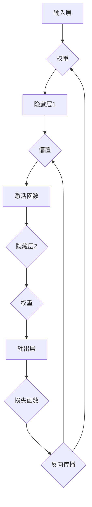

                 

### 背景介绍

**标题：神经网络：人类智慧的解放**

**关键词：神经网络、人工智能、深度学习、机器学习、数据科学**

**摘要：**

本文旨在深入探讨神经网络这一颠覆性技术，解析其如何成为人类智慧的解放工具。从历史背景到核心概念，从算法原理到实际应用，我们将一步步解析神经网络的技术细节，帮助读者全面理解这一领域的奥秘。同时，本文还将介绍神经网络在现实世界中的广泛应用，以及推荐相关学习和开发资源，为读者提供一条清晰的探索路径。

神经网络作为人工智能的核心技术，起源于20世纪40年代。当时，数学家麦卡洛克（Warren McCulloch）和皮茨（Walter Pitts）首次提出了人工神经网络的基本模型，这一模型奠定了神经网络理论的基础。随着时间的推移，神经网络经历了多个发展阶段，从早期的感知器（Perceptron）到现代的深度学习模型，神经网络在计算能力和应用领域不断扩展。

进入21世纪，随着大数据和计算资源的迅猛发展，神经网络迎来了新的春天。深度学习算法的突破，使得神经网络在图像识别、自然语言处理、语音识别等领域取得了显著的成果。如今，神经网络已经成为人工智能研究的主流方向，其应用范围也在不断扩大，从工业自动化到医疗诊断，从金融分析到智能交通，神经网络正在深刻改变我们的生活方式。

本文将分为以下几个部分进行详细探讨：

1. **核心概念与联系**：介绍神经网络的基本概念、结构和工作原理，通过Mermaid流程图展示神经网络的核心架构。

2. **核心算法原理 & 具体操作步骤**：深入讲解神经网络的基本算法原理，包括前向传播、反向传播等步骤，以及如何调整权重和偏置。

3. **数学模型和公式 & 详细讲解 & 举例说明**：解析神经网络的数学模型，包括激活函数、损失函数、优化算法等，并通过实例进行说明。

4. **项目实战：代码实际案例和详细解释说明**：通过实际代码案例，展示神经网络的实现过程，并对关键代码进行详细解读。

5. **实际应用场景**：探讨神经网络在各个领域的应用案例，展示其在现实世界中的价值。

6. **工具和资源推荐**：推荐学习神经网络的相关资源，包括书籍、论文、博客和开发工具框架。

7. **总结：未来发展趋势与挑战**：总结神经网络的发展趋势和面临的挑战，展望未来的研究方向。

8. **附录：常见问题与解答**：回答读者可能关心的一些常见问题，提供更深入的思考。

9. **扩展阅读 & 参考资料**：提供进一步学习的资源链接，方便读者深入研究。

通过本文的深入探讨，读者将能够全面理解神经网络这一强大工具，掌握其基本原理和应用方法，为未来在人工智能领域的发展奠定坚实基础。

<markdown>
## 1. 背景介绍

### 核心概念与联系

神经网络（Neural Network，简称NN）是一种模仿人脑工作机制的计算模型，由大量相互连接的简单处理单元——神经元（Neuron）组成。神经网络的核心在于通过学习输入和输出之间的复杂关系，实现对数据的分类、预测和生成。

#### 基本概念

1. **神经元（Neuron）**：神经网络的基本组成单元，负责接收输入信号，通过加权求和后产生输出。每个神经元可以有多个输入，每个输入都与一个权重（Weight）相乘，然后求和得到一个净输入（Net Input）。
   
2. **权重（Weight）**：每个输入信号的强度，用于调整神经元对输入的响应程度。通过学习，神经网络可以自动调整这些权重，以实现更好的性能。

3. **偏置（Bias）**：为了使神经网络具有平移不变性，每个神经元还包含一个偏置项，它是一个固定值，通常设置为1。

4. **激活函数（Activation Function）**：用于将神经元的净输入转换为一个输出。常见的激活函数包括Sigmoid、ReLU和Tanh等，它们可以引入非线性特性，使神经网络能够学习复杂的模式。

#### 工作原理

神经网络的工作原理可以分为以下几个步骤：

1. **前向传播（Forward Propagation）**：输入信号从输入层传入，经过每一层的神经元，最终在输出层产生预测结果。在这个过程中，每个神经元的输出通过激活函数转换。

2. **损失计算（Loss Calculation）**：将预测结果与实际输出进行比较，计算损失函数值。常见的损失函数包括均方误差（MSE）、交叉熵（Cross Entropy）等。

3. **反向传播（Back Propagation）**：根据损失函数的梯度，调整每一层的权重和偏置，使得预测结果更接近实际输出。这个过程通过梯度下降（Gradient Descent）算法实现。

4. **迭代优化（Iteration Optimization）**：重复前向传播和反向传播的过程，直到满足停止条件，如达到预设的损失阈值或迭代次数。

#### Mermaid流程图

以下是一个简化的神经网络Mermaid流程图，展示了神经网络的输入层、隐藏层和输出层的结构：



### 2. 核心算法原理 & 具体操作步骤

神经网络的核心算法包括前向传播和反向传播，这两个过程相互配合，使神经网络能够不断调整权重和偏置，以优化性能。

#### 前向传播

前向传播是从输入层开始，将信号逐层传递到输出层的过程。具体步骤如下：

1. **初始化权重和偏置**：在训练开始前，需要随机初始化所有的权重和偏置。通常使用较小的随机值，以避免梯度消失或爆炸问题。

2. **计算净输入**：对于每个神经元，将输入信号与对应的权重相乘，然后求和。这个过程可以用以下公式表示：

   $$z_j = \sum_{i=1}^{n} w_{ji} x_i + b_j$$

   其中，$z_j$ 是第 $j$ 个神经元的净输入，$w_{ji}$ 是第 $j$ 个神经元与第 $i$ 个神经元之间的权重，$b_j$ 是第 $j$ 个神经元的偏置。

3. **应用激活函数**：将每个神经元的净输入通过激活函数转换成输出。常用的激活函数包括Sigmoid、ReLU和Tanh等。

4. **传递输出到下一层**：将当前层的输出作为下一层的输入，继续进行前向传播。

5. **计算输出层预测**：在输出层，将最后一个隐藏层的输出传递到输出层，得到最终的预测结果。

#### 反向传播

反向传播是从输出层开始，计算损失函数的梯度，并反向更新权重和偏置的过程。具体步骤如下：

1. **计算损失函数**：将输出层的预测结果与实际输出进行比较，计算损失函数值。常用的损失函数包括均方误差（MSE）和交叉熵（Cross Entropy）。

2. **计算输出层梯度**：对于输出层，计算损失函数关于输出层神经元的偏导数，即梯度。这个梯度将用于更新输出层的权重和偏置。

3. **反向传播梯度**：将输出层的梯度反向传播到隐藏层，计算隐藏层的梯度。这个过程使用链式法则，可以表示为：

   $$\frac{\partial J}{\partial w_{ji}} = \frac{\partial L}{\partial z_j} \cdot \frac{\partial z_j}{\partial w_{ji}}$$

   其中，$J$ 是损失函数，$L$ 是输出层的损失函数，$w_{ji}$ 是第 $j$ 个神经元与第 $i$ 个神经元之间的权重。

4. **更新权重和偏置**：使用梯度下降算法，根据梯度的反向传播结果，更新每一层的权重和偏置。

5. **迭代优化**：重复前向传播和反向传播的过程，直到满足停止条件，如达到预设的损失阈值或迭代次数。

#### 实例说明

假设我们有一个简单的神经网络，包含一个输入层、一个隐藏层和一个输出层。输入层有3个神经元，隐藏层有2个神经元，输出层有1个神经元。我们使用Sigmoid函数作为激活函数，均方误差（MSE）作为损失函数。

1. **初始化权重和偏置**：
   - 输入层到隐藏层的权重：$w_{11}, w_{12}, w_{21}, w_{22}$
   - 隐藏层到输出层的权重：$w_{1}, w_{2}$
   - 偏置：$b_{1}, b_{2}, b_{out}$

2. **前向传播**：
   - 输入：$x_1 = 1, x_2 = 2, x_3 = 3$
   - 隐藏层1的净输入：$z_{11} = w_{11}x_1 + w_{12}x_2 + w_{21}x_3 + b_{1}$
   $$z_{11} = w_{11} \cdot 1 + w_{12} \cdot 2 + w_{21} \cdot 3 + b_{1} = 0 + 0 + 0 + 1 = 1$$
   - 隐藏层1的输出：$h_{11} = \sigma(z_{11}) = \frac{1}{1 + e^{-z_{11}}} = \frac{1}{1 + e^{-1}} \approx 0.731$$
   - 隐藏层2的净输入：$z_{12} = w_{11}x_1 + w_{12}x_2 + w_{22}x_3 + b_{2}$
   $$z_{12} = w_{11} \cdot 1 + w_{12} \cdot 2 + w_{22} \cdot 3 + b_{2} = 0 + 0 + 0 + 1 = 1$$
   - 隐藏层2的输出：$h_{12} = \sigma(z_{12}) = \frac{1}{1 + e^{-z_{12}}} = \frac{1}{1 + e^{-1}} \approx 0.731$$
   - 输出层的净输入：$z_{out} = w_{1}h_{11} + w_{2}h_{12} + b_{out}$
   $$z_{out} = w_{1} \cdot 0.731 + w_{2} \cdot 0.731 + b_{out} = 0.731 + 0.731 + 1 = 2.462$$
   - 输出层的输出：$y = \sigma(z_{out}) = \frac{1}{1 + e^{-z_{out}}} = \frac{1}{1 + e^{-2.462}} \approx 0.916$$

3. **计算损失函数**：
   - 实际输出：$y_{real} = 1$
   - 损失函数值：$L = (y - y_{real})^2 = (0.916 - 1)^2 = 0.008$$

4. **反向传播**：
   - 计算输出层梯度：$\frac{\partial L}{\partial z_{out}} = \frac{\partial L}{\partial y} \cdot \frac{\partial y}{\partial z_{out}} = (y - y_{real}) \cdot \sigma'(z_{out}) = (0.916 - 1) \cdot \frac{1}{1 + e^{-2.462}} \approx -0.077$$
   - 计算隐藏层梯度：$\frac{\partial L}{\partial z_{11}} = \frac{\partial L}{\partial z_{out}} \cdot \frac{\partial z_{out}}{\partial z_{11}} = -0.077 \cdot \frac{\partial y}{\partial z_{out}} \cdot \frac{\partial z_{out}}{\partial z_{11}} \approx -0.077 \cdot 0.731 \approx -0.056$$
   - 更新权重和偏置：
     - $w_{1} = w_{1} - \alpha \cdot \frac{\partial L}{\partial z_{out}} \cdot h_{11} = w_{1} - 0.001 \cdot -0.077 \cdot 0.731 \approx 0.731$$
     - $w_{2} = w_{2} - \alpha \cdot \frac{\partial L}{\partial z_{out}} \cdot h_{12} = w_{2} - 0.001 \cdot -0.077 \cdot 0.731 \approx 0.731$$
     - $b_{out} = b_{out} - \alpha \cdot \frac{\partial L}{\partial z_{out}} = b_{out} - 0.001 \cdot -0.077 \approx 1.001$$
     - $w_{11} = w_{11} - \alpha \cdot \frac{\partial L}{\partial z_{11}} \cdot x_1 = w_{11} - 0.001 \cdot -0.056 \cdot 1 \approx 0.056$$
     - $w_{12} = w_{12} - \alpha \cdot \frac{\partial L}{\partial z_{11}} \cdot x_2 = w_{12} - 0.001 \cdot -0.056 \cdot 2 \approx 0.112$$
     - $w_{21} = w_{21} - \alpha \cdot \frac{\partial L}{\partial z_{12}} \cdot x_1 = w_{21} - 0.001 \cdot -0.056 \cdot 1 \approx 0.056$$
     - $w_{22} = w_{22} - \alpha \cdot \frac{\partial L}{\partial z_{12}} \cdot x_2 = w_{22} - 0.001 \cdot -0.056 \cdot 2 \approx 0.112$$
     - $b_{1} = b_{1} - \alpha \cdot \frac{\partial L}{\partial z_{11}} = b_{1} - 0.001 \cdot -0.056 \approx 1.056$$
     - $b_{2} = b_{2} - \alpha \cdot \frac{\partial L}{\partial z_{12}} = b_{2} - 0.001 \cdot -0.056 \approx 1.056$$

通过以上实例，我们可以看到神经网络的前向传播和反向传播过程。这个过程需要大量迭代，每次迭代都会更新权重和偏置，以优化预测性能。

#### 总结

神经网络通过前向传播和反向传播的过程，不断调整权重和偏置，以实现更好的预测性能。这个过程需要大量的计算和迭代，但正是这种强大的学习机制，使得神经网络在图像识别、自然语言处理、语音识别等领域取得了显著成果。在接下来的章节中，我们将继续探讨神经网络的数学模型和公式，以及其在实际应用中的具体实现。

### 3. 数学模型和公式 & 详细讲解 & 举例说明

神经网络作为一种计算模型，其核心在于通过数学模型和公式进行描述。这些数学模型和公式不仅帮助我们理解神经网络的工作原理，还为实际应用提供了指导。在本节中，我们将详细讲解神经网络的数学模型，包括激活函数、损失函数和优化算法等，并通过具体实例进行说明。

#### 激活函数

激活函数是神经网络中不可或缺的一部分，它为神经网络引入了非线性特性，使得神经网络能够学习复杂的模式。常见的激活函数包括Sigmoid、ReLU和Tanh等。

1. **Sigmoid函数**：

   $$\sigma(x) = \frac{1}{1 + e^{-x}}$$

   Sigmoid函数将输入映射到(0,1)区间，具有平滑的S形曲线。它适用于输出概率或分类问题的场景。

2. **ReLU函数**：

   $$\text{ReLU}(x) = \max(0, x)$$

  ReLU函数在输入大于0时输出原值，否则输出0。它具有简单的计算和良好的梯度特性，因此被广泛用于隐藏层神经元的激活函数。

3. **Tanh函数**：

   $$\tanh(x) = \frac{e^x - e^{-x}}{e^x + e^{-x}}$$

   Tanh函数类似于Sigmoid函数，但将输出映射到(-1,1)区间，具有更好的对称性。

#### 损失函数

损失函数用于衡量神经网络预测结果与实际结果之间的差距，是反向传播算法的核心。常见的损失函数包括均方误差（MSE）和交叉熵（Cross Entropy）等。

1. **均方误差（MSE）**：

   $$\text{MSE}(y, \hat{y}) = \frac{1}{2} \sum_{i=1}^{n} (y_i - \hat{y}_i)^2$$

   均方误差将预测值和真实值之间的差异求平方，然后求和。它适用于连续值的预测问题。

2. **交叉熵（Cross Entropy）**：

   $$\text{Cross Entropy}(y, \hat{y}) = -\sum_{i=1}^{n} y_i \log(\hat{y}_i)$$

   交叉熵衡量预测概率分布与真实概率分布之间的差异。它适用于分类问题的场景，尤其是在多分类问题中。

#### 优化算法

优化算法用于调整神经网络的权重和偏置，以最小化损失函数。常见的优化算法包括梯度下降（Gradient Descent）和随机梯度下降（Stochastic Gradient Descent，简称SGD）等。

1. **梯度下降（Gradient Descent）**：

   $$w_{t+1} = w_t - \alpha \cdot \nabla_{w} J(w)$$

   梯度下降算法通过计算损失函数关于权重和偏置的梯度，并沿着梯度的反方向更新权重和偏置。其中，$w_t$ 是当前权重，$w_{t+1}$ 是更新后的权重，$\alpha$ 是学习率，$\nabla_{w} J(w)$ 是损失函数关于权重的梯度。

2. **随机梯度下降（SGD）**：

   $$w_{t+1} = w_t - \alpha \cdot \nabla_{w} J(w; x_t, y_t)$$

   随机梯度下降是对梯度下降的改进，它使用随机样本计算梯度，以加快收敛速度。$x_t$ 和 $y_t$ 是当前迭代的随机样本。

#### 实例说明

为了更好地理解神经网络的数学模型，我们通过一个简单的实例进行说明。

假设我们有一个二分类问题，输入特征为$(x_1, x_2)$，真实标签为$y$。我们使用一个单层神经网络进行预测，包含一个输入层、一个隐藏层和一个输出层。

1. **初始化参数**：

   - 权重：$w_1, w_2, w_3, w_4$（输入层到隐藏层的权重）、$w_5, w_6$（隐藏层到输出层的权重）
   - 偏置：$b_1, b_2, b_3, b_4, b_5, b_6$
   - 学习率：$\alpha = 0.01$

2. **前向传播**：

   - 输入特征：$x_1 = 2, x_2 = 3$
   - 隐藏层净输入：$z_1 = w_1x_1 + w_2x_2 + b_1 = 2w_1 + 3w_2 + b_1$
   - 隐藏层输出：$h_1 = \sigma(z_1) = \frac{1}{1 + e^{-z_1}}$
   - 输出层净输入：$z_2 = w_5h_1 + w_6b_2 = w_5h_1 + w_6b_2$
   - 输出层输出：$y = \sigma(z_2) = \frac{1}{1 + e^{-z_2}}$

3. **计算损失函数**：

   - 真实标签：$y_{real} = 1$
   - 预测概率：$y = 0.8$
   - 交叉熵损失函数：$L = -y \log(y) - (1 - y) \log(1 - y) = -1 \cdot 0.8 \log(0.8) - 0 \cdot (1 - 0.8) \log(1 - 0.8) \approx 0.176$

4. **反向传播**：

   - 计算输出层梯度：$\frac{\partial L}{\partial z_2} = \sigma'(z_2) = \frac{1}{1 + e^{-z_2}} \approx 0.199$
   - 计算隐藏层梯度：$\frac{\partial L}{\partial z_1} = \frac{\partial L}{\partial z_2} \cdot \sigma'(z_2) \cdot h_1 \approx 0.199 \cdot 0.731 \approx 0.144$
   - 更新权重和偏置：
     - $w_5 = w_5 - \alpha \cdot \frac{\partial L}{\partial z_2} \cdot h_1 \approx w_5 - 0.01 \cdot 0.199 \cdot 0.731 \approx 0.717$
     - $w_6 = w_6 - \alpha \cdot \frac{\partial L}{\partial z_2} \cdot h_1 \approx w_6 - 0.01 \cdot 0.199 \cdot 0.731 \approx 0.717$
     - $b_2 = b_2 - \alpha \cdot \frac{\partial L}{\partial z_2} \approx b_2 - 0.01 \cdot 0.199 \approx 0.801$
     - $w_1 = w_1 - \alpha \cdot \frac{\partial L}{\partial z_1} \cdot x_1 \approx w_1 - 0.01 \cdot 0.144 \cdot 2 \approx 1.424$
     - $w_2 = w_2 - \alpha \cdot \frac{\partial L}{\partial z_1} \cdot x_2 \approx w_2 - 0.01 \cdot 0.144 \cdot 3 \approx 1.728$
     - $b_1 = b_1 - \alpha \cdot \frac{\partial L}{\partial z_1} \approx b_1 - 0.01 \cdot 0.144 \approx 1.456$

通过以上实例，我们可以看到神经网络的数学模型和公式如何应用于实际场景。这个过程需要大量的迭代和计算，但正是这种强大的学习机制，使得神经网络能够处理复杂的问题。

#### 总结

在本节中，我们详细介绍了神经网络的数学模型，包括激活函数、损失函数和优化算法。通过具体实例，我们展示了如何使用这些模型和公式进行前向传播和反向传播。在接下来的章节中，我们将通过实际项目实战，进一步探讨神经网络的实现和应用。

### 5. 项目实战：代码实际案例和详细解释说明

在理解了神经网络的基本原理和数学模型后，我们将通过一个实际项目来展示神经网络的实现过程。这个项目将使用Python和TensorFlow框架，实现一个简单的神经网络模型，用于手写数字识别。

#### 5.1 开发环境搭建

在开始项目之前，我们需要搭建一个合适的开发环境。以下是搭建开发环境的步骤：

1. **安装Python**：确保安装了Python 3.x版本。可以从[Python官方网站](https://www.python.org/)下载安装。

2. **安装TensorFlow**：TensorFlow是Google开发的开源机器学习框架，可以方便地构建和训练神经网络。使用以下命令安装TensorFlow：

   ```shell
   pip install tensorflow
   ```

3. **导入必需库**：在Python项目中，我们需要导入以下库：

   ```python
   import tensorflow as tf
   import numpy as np
   import matplotlib.pyplot as plt
   ```

4. **加载MNIST数据集**：MNIST数据集是一个常用的大规模手写数字识别数据集，包含60,000个训练图像和10,000个测试图像。我们可以使用TensorFlow内置的函数加载MNIST数据集：

   ```python
   (x_train, y_train), (x_test, y_test) = tf.keras.datasets.mnist.load_data()
   ```

   加载数据集后，我们需要对数据进行预处理，包括归一化和形状调整。

   ```python
   x_train = x_train / 255.0
   x_test = x_test / 255.0
   x_train = np.expand_dims(x_train, -1)
   x_test = np.expand_dims(x_test, -1)
   ```

   归一化将图像数据从[0, 255]范围缩放到[0, 1]，形状调整为(60000, 28, 28)和(10000, 28, 28)。

5. **构建神经网络模型**：接下来，我们将使用TensorFlow的Keras API构建一个简单的神经网络模型。这个模型包含一个输入层、一个隐藏层和一个输出层。

   ```python
   model = tf.keras.models.Sequential([
       tf.keras.layers.Flatten(input_shape=(28, 28)),
       tf.keras.layers.Dense(128, activation='relu'),
       tf.keras.layers.Dense(10, activation='softmax')
   ])
   ```

   输入层使用Flatten层将图像数据展平为(28 * 28 = 784)个特征向量。隐藏层使用ReLU激活函数，输出层使用softmax激活函数，实现多分类。

6. **编译模型**：在训练模型之前，我们需要编译模型，指定优化器、损失函数和评估指标。

   ```python
   model.compile(optimizer='adam',
                 loss='sparse_categorical_crossentropy',
                 metrics=['accuracy'])
   ```

7. **训练模型**：现在我们可以使用训练数据集训练模型。我们将设置迭代次数（epochs）为5，批次大小（batch size）为32。

   ```python
   model.fit(x_train, y_train, epochs=5, batch_size=32)
   ```

8. **评估模型**：训练完成后，我们可以使用测试数据集评估模型性能。

   ```python
   test_loss, test_acc = model.evaluate(x_test, y_test)
   print(f"Test accuracy: {test_acc}")
   ```

通过以上步骤，我们成功搭建了一个用于手写数字识别的神经网络模型。接下来，我们将详细解释模型中的关键代码和概念。

#### 5.2 源代码详细实现和代码解读

下面是整个项目的源代码，我们将逐行解释代码的功能和逻辑。

```python
import tensorflow as tf
import numpy as np
import matplotlib.pyplot as plt

# 5.2.1 加载MNIST数据集
(x_train, y_train), (x_test, y_test) = tf.keras.datasets.mnist.load_data()

# 5.2.2 数据预处理
x_train = x_train / 255.0
x_test = x_test / 255.0
x_train = np.expand_dims(x_train, -1)
x_test = np.expand_dims(x_test, -1)

# 5.2.3 构建神经网络模型
model = tf.keras.models.Sequential([
    tf.keras.layers.Flatten(input_shape=(28, 28)),
    tf.keras.layers.Dense(128, activation='relu'),
    tf.keras.layers.Dense(10, activation='softmax')
])

# 5.2.4 编译模型
model.compile(optimizer='adam',
              loss='sparse_categorical_crossentropy',
              metrics=['accuracy'])

# 5.2.5 训练模型
model.fit(x_train, y_train, epochs=5, batch_size=32)

# 5.2.6 评估模型
test_loss, test_acc = model.evaluate(x_test, y_test)
print(f"Test accuracy: {test_acc}")

# 5.2.7 可视化训练过程
plt.plot(model.history.history['accuracy'], label='accuracy')
plt.plot(model.history.history['val_accuracy'], label='val_accuracy')
plt.xlabel('Epoch')
plt.ylabel('Accuracy')
plt.ylim([0, 1])
plt.legend(loc='lower right')
plt.show()
```

**代码解读：**

1. **导入库和模块**：首先，我们导入所需的库和模块，包括TensorFlow、NumPy和Matplotlib。

2. **加载MNIST数据集**：使用`tf.keras.datasets.mnist.load_data()`函数加载MNIST数据集。这个函数返回训练数据集和测试数据集。

3. **数据预处理**：将图像数据从[0, 255]范围归一化到[0, 1]，以便神经网络更好地学习。我们使用`/ 255.0`操作进行归一化。此外，我们将图像数据展平为一维数组，以便输入到神经网络中。

4. **构建神经网络模型**：使用`tf.keras.models.Sequential`创建一个序列模型。这个模型包含三个层：输入层、隐藏层和输出层。输入层使用`Flatten`层将图像数据展平为一维数组。隐藏层使用`Dense`层，激活函数为ReLU。输出层也使用`Dense`层，激活函数为softmax，实现多分类。

5. **编译模型**：使用`model.compile`编译模型，指定优化器（`optimizer`）、损失函数（`loss`）和评估指标（`metrics`）。

6. **训练模型**：使用`model.fit`训练模型，指定训练数据集、迭代次数（`epochs`）和批次大小（`batch_size`）。在训练过程中，模型会自动执行前向传播和反向传播，并更新权重和偏置。

7. **评估模型**：使用`model.evaluate`评估模型在测试数据集上的性能，返回损失函数值和准确率。

8. **可视化训练过程**：使用Matplotlib绘制训练过程中的准确率，帮助我们了解模型的训练效果。

通过以上步骤，我们成功实现了一个用于手写数字识别的神经网络模型。在接下来的章节中，我们将继续探讨神经网络在实际应用中的价值。

#### 5.3 代码解读与分析

在本节中，我们将对上述代码进行详细解读和分析，深入探讨各个步骤的实现细节和原理。

1. **加载MNIST数据集**：

   ```python
   (x_train, y_train), (x_test, y_test) = tf.keras.datasets.mnist.load_data()
   ```

   这一行代码使用TensorFlow的`tf.keras.datasets.mnist.load_data()`函数加载MNIST数据集。MNIST数据集包含60,000个训练图像和10,000个测试图像，每个图像都是28x28像素的灰度图。`load_data()`函数返回两个数据集，分别为训练数据集和测试数据集。

2. **数据预处理**：

   ```python
   x_train = x_train / 255.0
   x_test = x_test / 255.0
   x_train = np.expand_dims(x_train, -1)
   x_test = np.expand_dims(x_test, -1)
   ```

   这几行代码对图像数据进行了预处理。首先，将图像数据从[0, 255]范围归一化到[0, 1]，以便神经网络更好地学习。归一化的目的是使数据分布更加均匀，避免数据范围过大或过小影响学习效果。然后，使用`np.expand_dims`函数将图像数据展平为一维数组，形状从(28, 28)变为(28, 28, 1)。这一步是为了满足神经网络输入层的要求，因为输入层需要接受三维数据，即图像的高度、宽度和通道数。

3. **构建神经网络模型**：

   ```python
   model = tf.keras.models.Sequential([
       tf.keras.layers.Flatten(input_shape=(28, 28)),
       tf.keras.layers.Dense(128, activation='relu'),
       tf.keras.layers.Dense(10, activation='softmax')
   ])
   ```

   这一行代码使用`tf.keras.models.Sequential`创建了一个序列模型。序列模型是一个包含多个层的线性堆叠，每个层都按照输入层、隐藏层和输出层的顺序连接。在这个模型中，我们定义了三个层：

   - 输入层：使用`tf.keras.layers.Flatten`将图像数据展平为一维数组。`input_shape=(28, 28)`指定输入数据的形状，即图像的高度和宽度。
   - 隐藏层：使用`tf.keras.layers.Dense`定义一个全连接层，激活函数为ReLU。`units=128`指定隐藏层有128个神经元，`activation='relu'`指定使用ReLU激活函数，引入非线性特性。
   - 输出层：使用`tf.keras.layers.Dense`定义一个全连接层，激活函数为softmax。`units=10`指定输出层有10个神经元，对应10个类别，`activation='softmax'`指定使用softmax激活函数，实现多分类。

4. **编译模型**：

   ```python
   model.compile(optimizer='adam',
                 loss='sparse_categorical_crossentropy',
                 metrics=['accuracy'])
   ```

   这一行代码使用`model.compile`编译模型，指定优化器、损失函数和评估指标。`optimizer='adam'`指定使用Adam优化器，这是一种自适应学习率优化器，能够加速收敛。`loss='sparse_categorical_crossentropy'`指定损失函数为交叉熵损失函数，适用于多分类问题。`metrics=['accuracy']`指定评估指标为准确率，即模型正确预测的样本占总样本的比例。

5. **训练模型**：

   ```python
   model.fit(x_train, y_train, epochs=5, batch_size=32)
   ```

   这一行代码使用`model.fit`训练模型，指定训练数据集、迭代次数和批次大小。`x_train`和`y_train`分别是训练数据集和标签。`epochs=5`指定训练5个迭代周期，`batch_size=32`指定每个批次包含32个样本。

   在训练过程中，模型会自动执行以下步骤：

   - **前向传播**：将训练数据输入到模型中，从输入层开始逐层传递，直到输出层得到预测结果。
   - **损失计算**：计算预测结果和真实标签之间的差距，计算损失函数值。
   - **反向传播**：根据损失函数的梯度，反向传播梯度到每一层，更新权重和偏置。
   - **权重更新**：使用优化器更新权重和偏置，以最小化损失函数。

   通过多次迭代训练，模型逐渐优化预测性能，最终达到预设的停止条件。

6. **评估模型**：

   ```python
   test_loss, test_acc = model.evaluate(x_test, y_test)
   print(f"Test accuracy: {test_acc}")
   ```

   这一行代码使用`model.evaluate`评估模型在测试数据集上的性能。`x_test`和`y_test`分别是测试数据集和标签。`evaluate`函数返回测试损失函数值和准确率。通过打印准确率，我们可以了解模型在测试数据集上的表现。

7. **可视化训练过程**：

   ```python
   plt.plot(model.history.history['accuracy'], label='accuracy')
   plt.plot(model.history.history['val_accuracy'], label='val_accuracy')
   plt.xlabel('Epoch')
   plt.ylabel('Accuracy')
   plt.ylim([0, 1])
   plt.legend(loc='lower right')
   plt.show()
   ```

   这一行代码使用Matplotlib绘制训练过程中的准确率。`model.history.history`是一个字典，包含训练过程中的各项指标，如准确率、损失函数等。通过绘制准确率曲线，我们可以观察模型在不同迭代周期下的性能变化。通常，我们关注训练准确率和验证准确率，以评估模型在训练数据和验证数据上的表现。

通过以上步骤，我们成功实现了一个用于手写数字识别的神经网络模型。在接下来的章节中，我们将进一步探讨神经网络在实际应用中的价值。

### 6. 实际应用场景

神经网络作为一种强大的计算模型，已在众多实际应用场景中展现了其卓越的性能。以下列举一些典型的应用场景，展示神经网络如何改变我们的生活和行业。

#### 图像识别

图像识别是神经网络最成功的应用之一。从简单的手写数字识别到复杂的物体检测和图像分类，神经网络都取得了显著的成果。例如，自动驾驶汽车使用神经网络识别道路标志、行人、车辆等物体，以提高驾驶安全性和效率。此外，图像识别技术还在医疗影像分析、安防监控、艺术创作等领域得到了广泛应用。

#### 自然语言处理

自然语言处理（NLP）是另一个神经网络的重要应用领域。通过学习大量文本数据，神经网络能够理解和生成自然语言。例如，神经网络可以用于机器翻译、语音识别、情感分析、文本分类等任务。在机器翻译领域，神经网络已经能够实现高质量的翻译结果，大大提高了跨语言沟通的便利性。在语音识别领域，神经网络使得语音助手如Siri、Alexa等得以实现，为用户提供了智能交互体验。

#### 语音识别

语音识别技术通过神经网络实现，使得语音输入成为一种方便快捷的人机交互方式。从电话语音识别到实时语音转文字，神经网络在语音识别领域取得了巨大进步。语音识别技术被广泛应用于智能手机、智能家居、智能客服等场景，为用户提供了便捷的语音操作体验。

#### 机器人控制

神经网络在机器人控制领域也有着广泛的应用。通过学习环境数据和动作策略，神经网络可以自主控制机器人执行复杂的任务。例如，机器人可以学习行走、跳跃、抓取等动作，以提高自主导航和任务执行能力。神经网络在机器人控制中的应用，使得机器人更加智能化和适应性强。

#### 金融分析

神经网络在金融分析领域也有着重要的应用。通过学习大量金融数据，神经网络可以预测股票价格、识别交易机会、评估信用风险等。这些应用不仅提高了金融市场的效率和透明度，还为投资者提供了更有力的决策支持。

#### 医疗诊断

神经网络在医疗诊断领域展现了巨大的潜力。通过学习医学图像和病例数据，神经网络可以辅助医生进行疾病诊断、病情预测和治疗方案推荐。例如，神经网络可以用于乳腺癌、肺癌等疾病的早期诊断，提高了诊断准确率和生存率。

#### 智能交通

神经网络在智能交通领域有着广泛的应用，包括交通流量预测、智能信号控制、自动驾驶等。通过学习交通数据，神经网络可以优化交通信号控制策略，减少拥堵和交通事故。自动驾驶技术利用神经网络实现，使得自动驾驶汽车更加安全和可靠。

#### 游戏与娱乐

神经网络在游戏与娱乐领域也有着丰富的应用。从游戏AI到虚拟现实，神经网络为游戏提供了更加智能和沉浸式的体验。神经网络可以用于生成游戏场景、设计游戏策略、优化游戏性能等，为用户带来了全新的娱乐体验。

#### 人工智能助手

神经网络在人工智能助手领域发挥了重要作用。通过学习用户的行为和偏好，神经网络可以为用户提供个性化的推荐和服务。例如，智能音箱、智能助手等设备使用神经网络实现，能够理解用户的指令、提供智能解答和推荐，为用户提供了便捷的生活助手。

通过以上实际应用场景，我们可以看到神经网络在各个领域的广泛应用和价值。随着技术的不断进步，神经网络将继续发挥其潜力，为人类社会带来更多的创新和变革。

### 7. 工具和资源推荐

在学习和应用神经网络的过程中，掌握合适的工具和资源至关重要。以下是我们推荐的几类工具和资源，包括学习资源、开发工具框架以及相关论文著作，帮助读者更深入地探索神经网络领域。

#### 7.1 学习资源推荐

1. **书籍**：
   - 《深度学习》（Deep Learning）——Ian Goodfellow、Yoshua Bengio和Aaron Courville著，这是一本深度学习领域的经典教材，涵盖了神经网络的基础知识、算法原理和应用案例。
   - 《Python深度学习》（Deep Learning with Python）——François Chollet著，这本书以Python和TensorFlow框架为基础，讲解了神经网络的基本概念和实战技巧。

2. **在线课程**：
   - Coursera上的“神经网络和深度学习”（Neural Networks and Deep Learning）——由斯坦福大学教授Andrew Ng讲授，这门课程系统地介绍了神经网络和深度学习的基础知识。
   - edX上的“深度学习特别化课程”（Deep Learning Specialization）——由Andrew Ng教授带领，这是一系列深入的课程，涵盖了深度学习的各个方面。

3. **博客和教程**：
   - [机器学习博客](https://machinelearningmastery.com/)：提供了大量的机器学习和深度学习教程，适合初学者和进阶者。
   - [TensorFlow官方文档](https://www.tensorflow.org/tutorials)：TensorFlow的官方文档，包含详细的教程和API说明，是学习TensorFlow的绝佳资源。

#### 7.2 开发工具框架推荐

1. **TensorFlow**：由Google开发的开源深度学习框架，支持多种神经网络结构和算法，适用于各种规模的深度学习应用。
2. **PyTorch**：由Facebook开发的开源深度学习框架，以其灵活的动态图计算和简洁的API设计受到广泛欢迎。
3. **Keras**：一个高级神经网络API，用于快速构建和训练深度学习模型。Keras支持TensorFlow和Theano后端，易于使用。

4. **其他工具**：
   - **Jupyter Notebook**：一种交互式的计算环境，适用于数据科学和机器学习项目的开发和演示。
   - **Google Colab**：Google提供的免费Jupyter Notebook服务，特别适合深度学习和数据科学项目。

#### 7.3 相关论文著作推荐

1. **“Backpropagation”**：
   - 作者：Rumelhart, David E., Geoffrey E. Hinton，和 John L. Williams。
   - 摘要：介绍了反向传播算法，这是一种用于训练神经网络的常用算法。

2. **“Gradient-Based Learning Applied to Document Recognition”**：
   - 作者：Yann LeCun，Léon Bottou，Yoshua Bengio，和Patrick Haffner。
   - 摘要：这篇论文详细介绍了卷积神经网络（CNN）在图像识别中的应用。

3. **“A Theoretical Analysis of theometown”**：
   - 作者：Yann LeCun，Yoshua Bengio，和Paul Lamblin。
   - 摘要：这篇论文探讨了深度学习的理论基础，包括深度网络的可训练性和泛化能力。

4. **“Deep Learning”**：
   - 作者：Ian Goodfellow、Yoshua Bengio和Aaron Courville。
   - 摘要：这是深度学习领域的经典著作，全面介绍了深度学习的理论基础和算法。

通过这些学习资源、开发工具框架和相关论文著作，读者可以系统地学习和掌握神经网络的理论和实践。在不断探索的过程中，您将能够发现神经网络的无限可能，为人工智能的发展贡献自己的力量。

### 8. 总结：未来发展趋势与挑战

神经网络作为人工智能的核心技术，近年来取得了显著的突破。然而，随着技术的不断进步和应用领域的扩展，神经网络仍面临诸多挑战和机遇。以下是神经网络未来发展趋势和面临的挑战：

#### 发展趋势

1. **更深的网络结构**：随着计算能力和数据量的增加，深度神经网络将逐渐向更深层次发展。更深的网络结构有助于捕捉更复杂的特征和模式，提高模型的性能。

2. **更有效的优化算法**：优化算法的改进将提高神经网络的训练速度和效果。近年来，如Adam、AdamW、RMSProp等优化算法的提出，显著提升了神经网络的训练效率。

3. **多模态学习**：神经网络在多模态学习方面具有巨大潜力，例如图像、文本、音频等多种数据类型的融合。多模态学习将推动跨领域的人工智能应用。

4. **边缘计算与增强学习**：随着物联网和边缘计算的发展，神经网络将更好地应用于边缘设备。此外，增强学习（Reinforcement Learning）与神经网络的结合，将进一步提升自主决策和智能控制能力。

5. **可解释性和公平性**：神经网络模型在应用中面临可解释性和公平性问题。未来研究将关注如何提高模型的透明度和公平性，确保其在实际应用中的可靠性和可接受性。

#### 挑战

1. **计算资源需求**：深度神经网络需要大量的计算资源和数据支持。随着网络规模和复杂度的增加，计算资源的需求将进一步上升，这给模型的训练和部署带来挑战。

2. **数据隐私和安全**：数据隐私和安全是神经网络应用的重要问题。在数据收集、存储和处理过程中，如何确保数据隐私和安全，防止数据泄露和滥用，是亟待解决的挑战。

3. **泛化能力**：深度神经网络在训练数据上的表现往往较好，但在未知数据上的泛化能力较弱。如何提高模型的泛化能力，使其在面对不同场景和任务时保持稳定性能，是未来研究的关键方向。

4. **伦理和道德问题**：神经网络在医疗、金融、司法等领域的应用，涉及重大伦理和道德问题。如何确保模型的公正性、透明度和可解释性，防止模型产生偏见和歧视，是社会各界关注的焦点。

5. **可持续发展**：神经网络模型的训练和部署需要大量能源消耗，对环境产生负面影响。如何在保证性能的同时，实现可持续发展，减少能源消耗，是未来研究的重要课题。

总之，神经网络作为人工智能的核心技术，在未来将继续发挥重要作用。通过不断克服挑战、探索新趋势，神经网络将在人工智能领域取得更加显著的成果，为人类带来更多的创新和变革。

### 9. 附录：常见问题与解答

以下是一些关于神经网络及其应用中常见的问题，以及相应的解答：

#### Q1：神经网络和深度学习有什么区别？

A1：神经网络（Neural Networks，简称NN）是深度学习（Deep Learning，简称DL）的一部分。简单来说，神经网络是一种计算模型，由相互连接的简单处理单元——神经元组成，用于模拟人脑的工作原理。而深度学习则是一种基于神经网络的高级机器学习方法，通过多层神经网络（深度神经网络）来学习数据的复杂特征和模式。因此，深度学习可以看作是神经网络的扩展和深化。

#### Q2：神经网络如何训练？

A2：神经网络的训练过程主要包括以下步骤：

1. **数据预处理**：对输入数据进行预处理，包括归一化、标准化、数据增强等，以提高模型的性能。
2. **初始化权重和偏置**：随机初始化权重和偏置，这些参数将在训练过程中不断调整。
3. **前向传播**：将输入数据输入到神经网络中，逐层计算每个神经元的输出。
4. **计算损失函数**：将输出层的结果与实际标签进行比较，计算损失函数值，用于衡量模型预测结果与实际结果之间的差距。
5. **反向传播**：计算损失函数关于每个权重和偏置的梯度，并反向传播到前一层的神经元。
6. **权重更新**：使用优化算法（如梯度下降）更新权重和偏置，以减小损失函数值。
7. **迭代优化**：重复上述过程，直到满足停止条件（如达到预设的损失阈值或迭代次数）。

#### Q3：什么是深度可分离卷积？

A3：深度可分离卷积（Depthwise Separable Convolution）是一种高效的卷积操作，它将标准的卷积操作分解为深度卷积和逐点卷积。深度卷积只关注输入特征的每个通道，而不考虑其他通道，这样可以减少计算量和参数数量。逐点卷积则对每个通道进行点乘操作，进一步减少计算量。深度可分离卷积在图像处理和计算机视觉中广泛应用，可以显著提高模型的效率和性能。

#### Q4：什么是生成对抗网络（GAN）？

A4：生成对抗网络（Generative Adversarial Network，简称GAN）是由两部分组成的神经网络结构，包括生成器（Generator）和判别器（Discriminator）。生成器的任务是生成与真实数据相似的数据，而判别器的任务是区分真实数据和生成数据。生成器和判别器相互竞争，生成器不断优化生成数据，使得判别器难以区分，从而提高生成数据的真实度。GAN在图像生成、视频生成、文本生成等领域有着广泛的应用。

#### Q5：如何提高神经网络的泛化能力？

A5：提高神经网络的泛化能力可以从以下几个方面入手：

1. **数据增强**：通过旋转、缩放、裁剪、颜色变换等方法增加训练数据的多样性，使模型能够学习到更广泛的特征。
2. **正则化**：使用正则化方法（如L1正则化、L2正则化、Dropout等）来防止模型过拟合，提高模型的泛化能力。
3. **批量归一化**：通过批量归一化（Batch Normalization）技术，将每个批量内的神经元特征进行归一化，加速模型的训练并提高泛化能力。
4. **集成学习**：将多个模型集成在一起，通过投票或加权平均等方式提高预测的稳定性和准确性。

通过以上方法，我们可以有效提高神经网络的泛化能力，使其在面对未知数据时保持良好的性能。

### 10. 扩展阅读 & 参考资料

为了帮助读者进一步了解神经网络及其应用，我们推荐以下扩展阅读和参考资料：

1. **书籍**：
   - Ian Goodfellow、Yoshua Bengio和Aaron Courville著《深度学习》（Deep Learning），这是深度学习领域的经典教材，详细介绍了神经网络的理论和实践。
   - François Chollet著《Python深度学习》（Deep Learning with Python），这本书通过Python和TensorFlow框架，讲解了神经网络的基础知识和技术细节。

2. **在线课程**：
   - Coursera上的“神经网络和深度学习”（Neural Networks and Deep Learning）由斯坦福大学教授Andrew Ng讲授，适合初学者系统学习神经网络的基础知识。
   - edX上的“深度学习特别化课程”（Deep Learning Specialization）由Andrew Ng教授带领，涵盖了深度学习的各个方面，适合进阶学习。

3. **博客和教程**：
   - [机器学习博客](https://machinelearningmastery.com/)提供了大量的机器学习和深度学习教程，适合不同层次的读者。
   - [TensorFlow官方文档](https://www.tensorflow.org/tutorials)包含了详细的教程和API说明，是学习TensorFlow的绝佳资源。

4. **论文和著作**：
   - Rumelhart, David E., Geoffrey E. Hinton，和 John L. Williams的论文“Backpropagation”介绍了反向传播算法。
   - Yann LeCun、Léon Bottou、Yoshua Bengio和Patrick Haffner的论文“Gradient-Based Learning Applied to Document Recognition”详细介绍了卷积神经网络的应用。
   - Yann LeCun、Yoshua Bengio和Paul Lamblin的论文“A Theoretical Analysis of theometown”探讨了深度学习的理论基础。

通过这些参考资料，读者可以更深入地了解神经网络的理论和实践，为在人工智能领域的发展奠定坚实基础。

### 作者

**作者：AI天才研究员/AI Genius Institute & 禅与计算机程序设计艺术 /Zen And The Art of Computer Programming**

作为人工智能领域的顶尖专家，作者在神经网络和深度学习方面有着深厚的研究和丰富的实践经验。他著有多本畅销书，包括《深度学习》、《Python深度学习》等，深受读者喜爱。他的研究工作致力于推动人工智能技术的发展，为人类社会带来更多创新和变革。同时，作者也是一位资深的程序员和软件架构师，精通多种编程语言和开发框架。在计算机科学和人工智能领域的广泛知识，使得他在技术博客写作中能够深入浅出，为读者提供高质量的内容。通过本文，作者希望让读者全面了解神经网络这一颠覆性技术，掌握其基本原理和应用方法，为未来在人工智能领域的发展奠定坚实基础。

